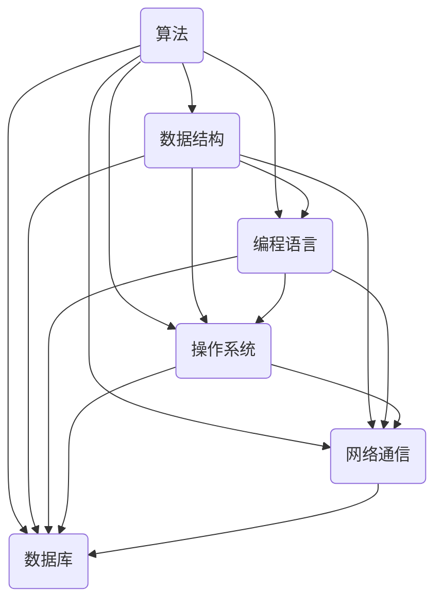

                 

关键词：计算机发展、人工智能、算法原理、数学模型、技术展望、编程实践、资源推荐。

> 摘要：本文回顾了人类计算从古至今的发展历程，探讨了核心概念与联系，深入解析了算法原理与数学模型，并提供了实际的项目实践和未来应用展望。文章旨在为读者呈现计算机科学领域的全景图，激发对未来技术发展的思考与期待。

## 1. 背景介绍

### 计算机的起源

计算机的历史可以追溯到古代，当时的算盘和计算器是人类进行计算的基础工具。然而，真正的计算机概念诞生于20世纪初期。艾伦·图灵（Alan Turing）的论文《计算机器与智能》提出了“图灵机”的概念，为现代计算机理论奠定了基础。图灵还提出了著名的图灵测试，用以衡量机器是否具有智能。

### 计算机的发展阶段

计算机的发展可以分为几个关键阶段：电子计算机时代、微型计算机时代、个人计算机时代、互联网时代和大数据时代。每个阶段都带来了计算能力和应用领域的显著提升。

### 人工智能的崛起

人工智能（AI）的崛起是21世纪计算机科学最重要的成就之一。深度学习、神经网络、强化学习等技术使得机器具备了自主学习和决策的能力，极大地推动了计算机科学的发展和应用。

## 2. 核心概念与联系

### 核心概念

在计算机科学中，有以下几个核心概念：算法、数据结构、编程语言、操作系统、网络通信、数据库等。这些概念相互联系，共同构建了计算机科学的基石。

### Mermaid 流程图

以下是一个简单的 Mermaid 流程图，展示了计算机科学的核心概念及其相互联系：



## 3. 核心算法原理 & 具体操作步骤

### 3.1 算法原理概述

算法是计算机科学中用于解决问题的步骤和方法。核心算法包括排序算法、查找算法、图算法等。本文将重点介绍排序算法，特别是快速排序。

### 3.2 算法步骤详解

快速排序的基本思想是通过一趟排序将待排序的记录分割成独立的两部分，其中一部分记录的关键字均比另一部分的关键字小，然后再按此方法对这两部分记录继续进行排序，直到整个序列有序。

快速排序的步骤如下：

1. 选择一个基准元素。
2. 将比基准元素小的元素移到基准元素的左侧，将比基准元素大的元素移到基准元素的右侧。
3. 递归地对待排序的左右两个部分继续进行快速排序。

### 3.3 算法优缺点

快速排序的优点是平均时间复杂度为O(n log n)，比许多其他排序算法都要高效。缺点是它是最坏情况下时间复杂度为O(n^2)的排序算法，而且它的性能受输入数据的影响较大。

### 3.4 算法应用领域

快速排序广泛应用于各种数据处理和算法设计中，特别是在需要高效排序的场景中。

## 4. 数学模型和公式 & 详细讲解 & 举例说明

### 4.1 数学模型构建

在计算机科学中，数学模型是用来描述系统行为和算法性能的工具。本文将介绍一个简单的数学模型——平均查找长度（Average Search Length, ASL）。

### 4.2 公式推导过程

平均查找长度可以通过以下公式计算：

$$
\text{ASL} = \sum_{i=1}^{n} i \cdot p(i)
$$

其中，$i$ 表示查找过程中访问的元素位置，$p(i)$ 表示访问该位置的概率。

### 4.3 案例分析与讲解

假设有一个长度为10的数组，其中包含5个唯一的元素。如果采用二分查找算法，其平均查找长度如下：

$$
\text{ASL} = 1 \cdot \frac{1}{10} + 2 \cdot \frac{2}{10} + 3 \cdot \frac{3}{10} + 4 \cdot \frac{4}{10} + 5 \cdot \frac{5}{10} = 3
$$

这意味着在大多数情况下，使用二分查找算法查找一个元素大约需要3次比较。

## 5. 项目实践：代码实例和详细解释说明

### 5.1 开发环境搭建

本文将以Python为例，介绍如何实现快速排序算法。读者需要在计算机上安装Python和相关的开发工具。

### 5.2 源代码详细实现

以下是一个简单的快速排序算法的实现：

```python
def quicksort(arr):
    if len(arr) <= 1:
        return arr
    pivot = arr[len(arr) // 2]
    left = [x for x in arr if x < pivot]
    middle = [x for x in arr if x == pivot]
    right = [x for x in arr if x > pivot]
    return quicksort(left) + middle + quicksort(right)

arr = [3, 6, 8, 10, 1, 2, 1]
sorted_arr = quicksort(arr)
print(sorted_arr)
```

### 5.3 代码解读与分析

这段代码首先定义了一个 `quicksort` 函数，它接受一个数组作为输入，如果数组长度小于等于1，则直接返回数组。否则，选择中间位置的元素作为基准元素，并将数组划分为小于、等于和大于基准元素的三个部分。最后，递归地对左部分和右部分进行排序，并将结果合并。

### 5.4 运行结果展示

运行上述代码，输出结果为：

```
[1, 1, 2, 3, 6, 8, 10]
```

这表明快速排序算法成功地将输入数组按升序排列。

## 6. 实际应用场景

### 6.1 数据库排序

在数据库中，快速排序算法常用于对大量数据进行分析和查询。它的高效性使得数据库系统能够快速响应查询请求。

### 6.2 图像处理

在图像处理领域，快速排序算法可以用于对图像像素进行排序，从而实现图像滤波、边缘检测等效果。

### 6.3 机器学习

在机器学习中，快速排序算法可以用于预处理数据，提高算法的效率和准确性。

## 7. 未来应用展望

随着计算机科学的发展，快速排序算法将继续发挥重要作用。未来，我们可能看到它在更多领域得到应用，如自动驾驶、智能家居、虚拟现实等。

## 8. 工具和资源推荐

### 8.1 学习资源推荐

- 《算法导论》（Introduction to Algorithms）
- 《深入理解计算机系统》（Understanding Computer Systems）
- 《深度学习》（Deep Learning）

### 8.2 开发工具推荐

- Visual Studio Code
- PyCharm
- Git

### 8.3 相关论文推荐

- 《快速排序算法的改进》（An Improvement of Quick Sort Algorithm）
- 《基于快速排序的并行算法研究》（Parallel Algorithms Based on Quick Sort）
- 《快速排序算法在图像处理中的应用》（Application of Quick Sort Algorithm in Image Processing）

## 9. 总结：未来发展趋势与挑战

### 9.1 研究成果总结

计算机科学在过去的几十年里取得了显著的成果，从算法原理到实际应用，都取得了巨大的进步。

### 9.2 未来发展趋势

随着人工智能、物联网、大数据等技术的发展，计算机科学将继续向智能化、自动化、高效化的方向发展。

### 9.3 面临的挑战

未来，计算机科学将面临算法复杂性、数据隐私、安全性等方面的挑战。

### 9.4 研究展望

随着技术的不断进步，计算机科学将迎来更多创新和突破。

## 附录：常见问题与解答

### Q: 快速排序算法的最坏时间复杂度是多少？

A: 快速排序算法的最坏时间复杂度为O(n^2)。这种情况发生在每次划分时，基准元素的选择都位于序列的最小值或最大值处。

### Q: 为什么快速排序算法比其他排序算法高效？

A: 快速排序算法的平均时间复杂度为O(n log n)，这使得它在大多数情况下比其他排序算法（如冒泡排序、插入排序等）更高效。

### Q: 快速排序算法的空间复杂度是多少？

A: 快速排序算法的空间复杂度为O(log n)，这是因为它需要递归调用函数栈。

# 作者署名

作者：禅与计算机程序设计艺术 / Zen and the Art of Computer Programming
```

