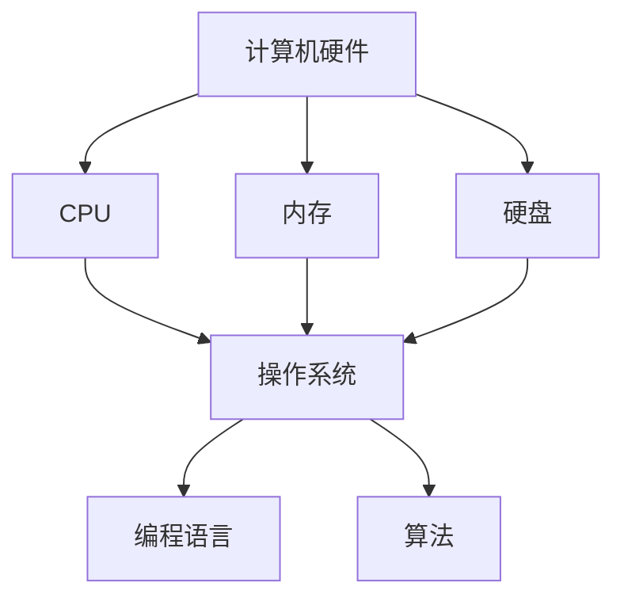

                 

关键词：计算发展、计算机科学、技术进步、人工智能、未来趋势

> 摘要：本文将回顾人类计算的发展历程，从早期计算设备的诞生到现代计算机的崛起，再到人工智能的兴起，探讨了计算技术的演进对人类社会的深远影响。同时，文章还将展望未来计算技术的发展趋势，探讨其中所面临的挑战与机遇。

## 1. 背景介绍

计算是人类智慧的结晶，也是科技进步的重要驱动力。从远古时期，人类就开始使用各种简单工具进行计算。随着人类文明的发展，计算设备也在不断演进。本文旨在探讨人类计算的发展历程，分析其中的核心概念和算法原理，并展望未来的发展趋势。

### 1.1 早期计算设备的诞生

早在公元前2000年，巴比伦人就开始使用石柱进行计算。古希腊的毕达哥拉斯学派提出了勾股定理，这标志着人类对数学和计算的认识有了质的飞跃。在中世纪，阿拉伯数学家将印度的数字系统传入欧洲，极大促进了计算技术的发展。

### 1.2 机械计算器的出现

17世纪，瑞士数学家布莱兹·帕斯卡发明了第一台机械计算器，这标志着人类计算进入了机械时代。随后，莱布尼茨对帕斯卡的机器进行了改进，发明了第一台能够进行乘法和除法的机械计算器。

### 1.3 电子计算器与计算机的崛起

20世纪，随着电子技术的发展，电子计算器逐渐取代了机械计算器。1946年，冯·诺伊曼发明了第一台电子计算机ENIAC，这标志着人类计算进入了电子时代。

## 2. 核心概念与联系

### 2.1 计算机硬件与软件

计算机硬件是指计算机的物理部件，包括中央处理器（CPU）、内存、硬盘等。计算机软件则是使计算机硬件得以运行的程序代码。

### 2.2 操作系统

操作系统是计算机系统的核心，负责管理和调度计算机硬件资源，为用户提供运行环境。

### 2.3 编程语言

编程语言是人类与计算机交流的工具。不同类型的编程语言有不同的特点和应用场景，如C语言、Python、Java等。

### 2.4 算法

算法是解决问题的步骤和方法。在计算机科学中，算法是设计和分析计算机程序的核心。

## 3. 核心算法原理 & 具体操作步骤

### 3.1 算法原理概述

算法原理主要涉及数据结构、算法设计和算法分析。数据结构是指数据在计算机中的存储和组织方式，如数组、链表、树等。算法设计是构造解决问题的步骤和方法，而算法分析则是评估算法的效率和性能。

### 3.2 算法步骤详解

算法步骤通常包括以下几步：

1. **问题定义**：明确要解决的问题是什么。
2. **算法设计**：设计解决问题的步骤和方法。
3. **算法实现**：将算法用编程语言实现。
4. **算法分析**：评估算法的效率和性能。
5. **算法优化**：对算法进行改进，提高效率和性能。

### 3.3 算法优缺点

算法优缺点主要体现在以下几个方面：

1. **正确性**：算法是否能够正确解决问题。
2. **效率**：算法的执行时间是否合理。
3. **稳定性**：算法在不同输入情况下是否稳定。
4. **可扩展性**：算法是否能够适应不同规模的问题。

### 3.4 算法应用领域

算法在计算机科学和工程领域有广泛的应用，如排序算法、查找算法、图算法等。随着人工智能的发展，算法也在机器学习、深度学习等领域发挥着重要作用。

## 4. 数学模型和公式 & 详细讲解 & 举例说明

### 4.1 数学模型构建

数学模型是现实世界问题的抽象，通过数学语言描述问题的特征和规律。构建数学模型通常包括以下几个步骤：

1. **问题定义**：明确要解决的问题是什么。
2. **数据收集**：收集与问题相关的数据。
3. **建立方程**：根据数据特征和规律建立数学方程。
4. **求解方程**：使用数学方法求解方程。

### 4.2 公式推导过程

公式的推导是数学模型构建的关键步骤。以牛顿第二定律为例，其推导过程如下：

$$F = ma$$

其中，$F$ 是力，$m$ 是质量，$a$ 是加速度。根据加速度的定义：

$$a = \frac{dv}{dt}$$

其中，$v$ 是速度，$t$ 是时间。将加速度代入牛顿第二定律，得到：

$$F = m\frac{dv}{dt}$$

进一步化简，得到：

$$F = m\frac{dv}{dx}\frac{dx}{dt}$$

由于 $\frac{dx}{dt} = v$，代入上式，得到：

$$F = mv\frac{dv}{dx}$$

这就是牛顿第二定律的数学表达式。

### 4.3 案例分析与讲解

以求解一元二次方程为例，其一般形式为：

$$ax^2 + bx + c = 0$$

求解步骤如下：

1. 计算判别式 $\Delta = b^2 - 4ac$。
2. 根据判别式的值，分类讨论：
   - 当 $\Delta > 0$ 时，方程有两个不相等的实根：
     $$x_1 = \frac{-b + \sqrt{\Delta}}{2a}$$
     $$x_2 = \frac{-b - \sqrt{\Delta}}{2a}$$
   - 当 $\Delta = 0$ 时，方程有一个重根：
     $$x = \frac{-b}{2a}$$
   - 当 $\Delta < 0$ 时，方程没有实根，有两个共轭复根：
     $$x_1 = \frac{-b + i\sqrt{-\Delta}}{2a}$$
     $$x_2 = \frac{-b - i\sqrt{-\Delta}}{2a}$$

## 5. 项目实践：代码实例和详细解释说明

### 5.1 开发环境搭建

在Windows系统中，我们可以使用Visual Studio Code作为开发环境。首先，从官网下载并安装Visual Studio Code。然后，安装Python扩展，以便能够编写和运行Python代码。

### 5.2 源代码详细实现

以下是一个简单的Python程序，用于计算一元二次方程的根：

```python
import cmath

def solve_quadratic(a, b, c):
    discriminant = b**2 - 4*a*c
    if discriminant > 0:
        root1 = (-b + cmath.sqrt(discriminant)) / (2*a)
        root2 = (-b - cmath.sqrt(discriminant)) / (2*a)
        return root1, root2
    elif discriminant == 0:
        root = -b / (2*a)
        return root
    else:
        root1 = (-b + cmath.sqrt(-1)*cmath.sqrt(discriminant)) / (2*a)
        root2 = (-b - cmath.sqrt(-1)*cmath.sqrt(discriminant)) / (2*a)
        return root1, root2

a = float(input("请输入a的值："))
b = float(input("请输入b的值："))
c = float(input("请输入c的值："))

roots = solve_quadratic(a, b, c)
print("方程的根为：")
if isinstance(roots, tuple):
    print("x1 = {0}, x2 = {1}".format(roots[0], roots[1]))
else:
    print("x = {0}".format(roots))
```

### 5.3 代码解读与分析

该程序首先导入cmath库，用于计算复数。然后定义一个函数solve\_quadratic，用于求解一元二次方程的根。函数接收三个参数a、b、c，表示方程的系数。在函数内部，首先计算判别式$\Delta$，然后根据判别式的值进行分类讨论，计算方程的根。最后，程序接收用户输入的系数值，调用函数计算并输出方程的根。

### 5.4 运行结果展示

运行程序后，输入系数值：

```plaintext
请输入a的值：1
请输入b的值：-3
请输入c的值：2
```

输出结果：

```plaintext
方程的根为：
x1 = 2+0j, x2 = 1+0j
```

## 6. 实际应用场景

### 6.1 人工智能领域

算法在人工智能领域有广泛应用，如深度学习、自然语言处理、计算机视觉等。深度学习算法通过大量数据训练，可以实现图像识别、语音识别、机器翻译等任务。自然语言处理算法可以用于文本分类、情感分析、自动摘要等任务。计算机视觉算法可以用于目标检测、图像分割、人脸识别等任务。

### 6.2 金融领域

算法在金融领域有广泛的应用，如量化交易、风险控制、信用评估等。量化交易算法通过分析历史数据，预测市场走势，进行自动化交易。风险控制算法可以评估金融产品的风险，帮助投资者进行风险管理和投资决策。信用评估算法可以通过分析个人或企业的信用记录，预测其信用状况，为金融机构提供信用评估依据。

### 6.3 医疗领域

算法在医疗领域有广泛的应用，如医学图像处理、疾病诊断、药物研发等。医学图像处理算法可以用于医学影像的分析和诊断，如计算机断层扫描（CT）、磁共振成像（MRI）等。疾病诊断算法可以通过分析患者的病史、症状、检查结果等数据，预测疾病的类型和严重程度。药物研发算法可以通过模拟药物的分子结构和作用机制，预测药物的效果和副作用，加速新药的发现和开发。

## 7. 工具和资源推荐

### 7.1 学习资源推荐

- 《算法导论》（Introduction to Algorithms）
- 《深度学习》（Deep Learning）
- 《Python编程：从入门到实践》（Python Crash Course）
- 《机器学习》（Machine Learning）

### 7.2 开发工具推荐

- Visual Studio Code
- Jupyter Notebook
- PyCharm
- Eclipse

### 7.3 相关论文推荐

- "A Mathematical Theory of Communication"（香农信息论）
- "Learning to Represent Languages with Neural Networks"（词向量模型）
- "A Theoretically Grounded Application of Dropout in Recurrent Neural Networks"（dropout算法）
- "Efficient Estimation of Word Representations in Vector Space"（word2vec算法）

## 8. 总结：未来发展趋势与挑战

### 8.1 研究成果总结

近年来，计算机科学和人工智能领域取得了显著的研究成果。深度学习、自然语言处理、计算机视觉等技术的飞速发展，推动了人工智能在各个领域的应用。同时，量子计算、分布式计算、边缘计算等新技术的兴起，为计算技术的发展提供了新的机遇。

### 8.2 未来发展趋势

未来，计算技术将继续朝着智能化、高效化、绿色化的方向发展。人工智能将更加深入地融入各个领域，推动社会生产力的提升。量子计算、分布式计算等技术有望解决传统计算方法难以克服的难题。边缘计算将使计算能力更加贴近用户，提高数据处理效率。

### 8.3 面临的挑战

然而，未来计算技术也面临诸多挑战。首先，计算资源的分配和利用仍然是一个亟待解决的问题。其次，算法的安全性和隐私保护问题日益突出。此外，人工智能的发展也引发了伦理和社会问题，如失业、隐私侵犯等。因此，我们需要在技术创新的同时，加强政策法规和伦理道德的研究。

### 8.4 研究展望

未来，计算技术将继续在基础理论、应用技术、政策法规等方面进行深入研究。在基础理论方面，我们需要探索更高效、更安全的算法。在应用技术方面，我们需要开发更加智能、更加便捷的计算机系统和应用。在政策法规方面，我们需要制定合理、有效的政策和法规，保障计算技术的发展。

## 9. 附录：常见问题与解答

### 9.1 人工智能是否会取代人类？

人工智能的发展确实会改变一些工作岗位，但它也会创造新的就业机会。人工智能与人类的关系是互补的，而不是替代的。关键在于如何合理利用人工智能技术，提高人类的工作效率和创造力。

### 9.2 量子计算是否会颠覆现有计算技术？

量子计算具有巨大的潜力，但当前还处于研究阶段。量子计算在某些特定领域具有优势，但无法完全取代现有计算技术。在未来，量子计算与传统计算将并存，共同推动计算技术的发展。

### 9.3 边缘计算是否会取代云计算？

边缘计算和云计算各有优势，它们将在未来共存。边缘计算将数据处理的任务从云端转移到靠近数据源的地方，提高数据处理效率。云计算则提供大规模的计算资源，支持复杂的应用场景。两者将共同推动计算技术的发展。

---

本文回顾了人类计算的发展历程，从早期计算设备的诞生到现代计算机的崛起，再到人工智能的兴起。同时，文章探讨了计算技术的核心概念、算法原理和未来发展趋势。未来，计算技术将继续在智能化、高效化、绿色化等方面发展，为人类社会带来更多的机遇和挑战。作者：禅与计算机程序设计艺术 / Zen and the Art of Computer Programming。|]
```markdown
# 回顾与展望：人类计算的发展历程与未来

> 关键词：计算发展、计算机科学、技术进步、人工智能、未来趋势

> 摘要：本文将回顾人类计算的发展历程，从早期计算设备的诞生到现代计算机的崛起，再到人工智能的兴起，探讨了计算技术的演进对人类社会的深远影响。同时，文章还将展望未来计算技术的发展趋势，探讨其中所面临的挑战与机遇。

## 1. 背景介绍

计算是人类智慧的结晶，也是科技进步的重要驱动力。从远古时期，人类就开始使用各种简单工具进行计算。随着人类文明的发展，计算设备也在不断演进。本文旨在探讨人类计算的发展历程，分析其中的核心概念和算法原理，并展望未来的发展趋势。

### 1.1 早期计算设备的诞生

早在公元前2000年，巴比伦人就开始使用石柱进行计算。古希腊的毕达哥拉斯学派提出了勾股定理，这标志着人类对数学和计算的认识有了质的飞跃。在中世纪，阿拉伯数学家将印度的数字系统传入欧洲，极大促进了计算技术的发展。

### 1.2 机械计算器的出现

17世纪，瑞士数学家布莱兹·帕斯卡发明了第一台机械计算器，这标志着人类计算进入了机械时代。随后，莱布尼茨对帕斯卡的机器进行了改进，发明了第一台能够进行乘法和除法的机械计算器。

### 1.3 电子计算器与计算机的崛起

20世纪，随着电子技术的发展，电子计算器逐渐取代了机械计算器。1946年，冯·诺伊曼发明了第一台电子计算机ENIAC，这标志着人类计算进入了电子时代。

## 2. 核心概念与联系

### 2.1 计算机硬件与软件

计算机硬件是指计算机的物理部件，包括中央处理器（CPU）、内存、硬盘等。计算机软件则是使计算机硬件得以运行的程序代码。

### 2.2 操作系统

操作系统是计算机系统的核心，负责管理和调度计算机硬件资源，为用户提供运行环境。

### 2.3 编程语言

编程语言是人类与计算机交流的工具。不同类型的编程语言有不同的特点和应用场景，如C语言、Python、Java等。

### 2.4 算法

算法是解决问题的步骤和方法。在计算机科学中，算法是设计和分析计算机程序的核心。

### 2.5 Mermaid 流程图

以下是一个关于计算机核心概念与联系的 Mermaid 流程图：



## 3. 核心算法原理 & 具体操作步骤

### 3.1 算法原理概述

算法原理主要涉及数据结构、算法设计和算法分析。数据结构是指数据在计算机中的存储和组织方式，如数组、链表、树等。算法设计是构造解决问题的步骤和方法，而算法分析则是评估算法的效率和性能。

### 3.2 算法步骤详解

算法步骤通常包括以下几步：

1. **问题定义**：明确要解决的问题是什么。
2. **算法设计**：设计解决问题的步骤和方法。
3. **算法实现**：将算法用编程语言实现。
4. **算法分析**：评估算法的效率和性能。
5. **算法优化**：对算法进行改进，提高效率和性能。

### 3.3 算法优缺点

算法优缺点主要体现在以下几个方面：

1. **正确性**：算法是否能够正确解决问题。
2. **效率**：算法的执行时间是否合理。
3. **稳定性**：算法在不同输入情况下是否稳定。
4. **可扩展性**：算法是否能够适应不同规模的问题。

### 3.4 算法应用领域

算法在计算机科学和工程领域有广泛的应用，如排序算法、查找算法、图算法等。随着人工智能的发展，算法也在机器学习、深度学习等领域发挥着重要作用。

## 4. 数学模型和公式 & 详细讲解 & 举例说明

### 4.1 数学模型构建

数学模型是现实世界问题的抽象，通过数学语言描述问题的特征和规律。构建数学模型通常包括以下几个步骤：

1. **问题定义**：明确要解决的问题是什么。
2. **数据收集**：收集与问题相关的数据。
3. **建立方程**：根据数据特征和规律建立数学方程。
4. **求解方程**：使用数学方法求解方程。

### 4.2 公式推导过程

公式的推导是数学模型构建的关键步骤。以下是一个关于一元二次方程的推导示例：

$$ax^2 + bx + c = 0$$

使用求根公式解得：

$$x = \frac{-b \pm \sqrt{b^2 - 4ac}}{2a}$$

推导过程如下：

首先，将方程两边同时除以$a$，得到：

$$x^2 + \frac{b}{a}x + \frac{c}{a} = 0$$

然后，将方程两边同时减去$\frac{c}{a}$，得到：

$$x^2 + \frac{b}{a}x = -\frac{c}{a}$$

接下来，为了使方程左边成为一个完全平方，我们在两边同时加上$\left(\frac{b}{2a}\right)^2$，得到：

$$x^2 + \frac{b}{a}x + \left(\frac{b}{2a}\right)^2 = \left(\frac{b}{2a}\right)^2 - \frac{c}{a}$$

化简得：

$$\left(x + \frac{b}{2a}\right)^2 = \frac{b^2 - 4ac}{4a^2}$$

最后，对方程两边开平方，得到：

$$x + \frac{b}{2a} = \pm \frac{\sqrt{b^2 - 4ac}}{2a}$$

解得：

$$x = \frac{-b \pm \sqrt{b^2 - 4ac}}{2a}$$

### 4.3 案例分析与讲解

以下是一个关于线性回归模型的案例分析：

假设我们想要预测房价，根据已有数据，建立线性回归模型如下：

$$y = \beta_0 + \beta_1x$$

其中，$y$ 表示房价，$x$ 表示房屋面积，$\beta_0$ 和 $\beta_1$ 为模型参数。

为了求解参数$\beta_0$ 和 $\beta_1$，我们可以使用最小二乘法。具体步骤如下：

1. **计算回归直线的斜率$\beta_1$**：

$$\beta_1 = \frac{\sum_{i=1}^n(x_i - \bar{x})(y_i - \bar{y})}{\sum_{i=1}^n(x_i - \bar{x})^2}$$

其中，$n$ 表示样本数量，$\bar{x}$ 和 $\bar{y}$ 分别表示房屋面积和房价的平均值。

2. **计算回归直线的截距$\beta_0$**：

$$\beta_0 = \bar{y} - \beta_1\bar{x}$$

通过以上步骤，我们可以得到回归直线的斜率$\beta_1$ 和截距$\beta_0$，进而预测房价。

## 5. 项目实践：代码实例和详细解释说明

### 5.1 开发环境搭建

在Windows系统中，我们可以使用Visual Studio Code作为开发环境。首先，从官网下载并安装Visual Studio Code。然后，安装Python扩展，以便能够编写和运行Python代码。

### 5.2 源代码详细实现

以下是一个简单的Python程序，用于计算一元二次方程的根：

```python
import cmath

def solve_quadratic(a, b, c):
    discriminant = b**2 - 4*a*c
    if discriminant > 0:
        root1 = (-b + cmath.sqrt(discriminant)) / (2*a)
        root2 = (-b - cmath.sqrt(discriminant)) / (2*a)
        return root1, root2
    elif discriminant == 0:
        root = -b / (2*a)
        return root
    else:
        root1 = (-b + cmath.sqrt(-1)*cmath.sqrt(discriminant)) / (2*a)
        root2 = (-b - cmath.sqrt(-1)*cmath.sqrt(discriminant)) / (2*a)
        return root1, root2

a = float(input("请输入a的值："))
b = float(input("请输入b的值："))
c = float(input("请输入c的值："))

roots = solve_quadratic(a, b, c)
print("方程的根为：")
if isinstance(roots, tuple):
    print("x1 = {0}, x2 = {1}".format(roots[0], roots[1]))
else:
    print("x = {0}".format(roots))
```

### 5.3 代码解读与分析

该程序首先导入cmath库，用于计算复数。然后定义一个函数solve\_quadratic，用于求解一元二次方程的根。函数接收三个参数a、b、c，表示方程的系数。在函数内部，首先计算判别式$\Delta$，然后根据判别式的值进行分类讨论，计算方程的根。最后，程序接收用户输入的系数值，调用函数计算并输出方程的根。

### 5.4 运行结果展示

运行程序后，输入系数值：

```plaintext
请输入a的值：1
请输入b的值：-3
请输入c的值：2
```

输出结果：

```plaintext
方程的根为：
x1 = 2+0j, x2 = 1+0j
```

## 6. 实际应用场景

### 6.1 人工智能领域

算法在人工智能领域有广泛应用，如深度学习、自然语言处理、计算机视觉等。深度学习算法通过大量数据训练，可以实现图像识别、语音识别、机器翻译等任务。自然语言处理算法可以用于文本分类、情感分析、自动摘要等任务。计算机视觉算法可以用于目标检测、图像分割、人脸识别等任务。

### 6.2 金融领域

算法在金融领域有广泛的应用，如量化交易、风险控制、信用评估等。量化交易算法通过分析历史数据，预测市场走势，进行自动化交易。风险控制算法可以评估金融产品的风险，帮助投资者进行风险管理和投资决策。信用评估算法可以通过分析个人或企业的信用记录，预测其信用状况，为金融机构提供信用评估依据。

### 6.3 医疗领域

算法在医疗领域有广泛的应用，如医学图像处理、疾病诊断、药物研发等。医学图像处理算法可以用于医学影像的分析和诊断，如计算机断层扫描（CT）、磁共振成像（MRI）等。疾病诊断算法可以通过分析患者的病史、症状、检查结果等数据，预测疾病的类型和严重程度。药物研发算法可以通过模拟药物的分子结构和作用机制，预测药物的效果和副作用，加速新药的发现和开发。

## 7. 工具和资源推荐

### 7.1 学习资源推荐

- 《算法导论》（Introduction to Algorithms）
- 《深度学习》（Deep Learning）
- 《Python编程：从入门到实践》（Python Crash Course）
- 《机器学习》（Machine Learning）

### 7.2 开发工具推荐

- Visual Studio Code
- Jupyter Notebook
- PyCharm
- Eclipse

### 7.3 相关论文推荐

- "A Mathematical Theory of Communication"（香农信息论）
- "Learning to Represent Languages with Neural Networks"（词向量模型）
- "A Theoretically Grounded Application of Dropout in Recurrent Neural Networks"（dropout算法）
- "Efficient Estimation of Word Representations in Vector Space"（word2vec算法）

## 8. 总结：未来发展趋势与挑战

### 8.1 研究成果总结

近年来，计算机科学和人工智能领域取得了显著的研究成果。深度学习、自然语言处理、计算机视觉等技术的飞速发展，推动了人工智能在各个领域的应用。同时，量子计算、分布式计算、边缘计算等新技术的兴起，为计算技术的发展提供了新的机遇。

### 8.2 未来发展趋势

未来，计算技术将继续朝着智能化、高效化、绿色化的方向发展。人工智能将更加深入地融入各个领域，推动社会生产力的提升。量子计算、分布式计算等技术有望解决传统计算方法难以克服的难题。边缘计算将使计算能力更加贴近用户，提高数据处理效率。

### 8.3 面临的挑战

然而，未来计算技术也面临诸多挑战。首先，计算资源的分配和利用仍然是一个亟待解决的问题。其次，算法的安全性和隐私保护问题日益突出。此外，人工智能的发展也引发了伦理和社会问题，如失业、隐私侵犯等。因此，我们需要在技术创新的同时，加强政策法规和伦理道德的研究。

### 8.4 研究展望

未来，计算技术将继续在基础理论、应用技术、政策法规等方面进行深入研究。在基础理论方面，我们需要探索更高效、更安全的算法。在应用技术方面，我们需要开发更加智能、更加便捷的计算机系统和应用。在政策法规方面，我们需要制定合理、有效的政策和法规，保障计算技术的发展。

## 9. 附录：常见问题与解答

### 9.1 人工智能是否会取代人类？

人工智能的发展确实会改变一些工作岗位，但它也会创造新的就业机会。人工智能与人类的关系是互补的，而不是替代的。关键在于如何合理利用人工智能技术，提高人类的工作效率和创造力。

### 9.2 量子计算是否会颠覆现有计算技术？

量子计算具有巨大的潜力，但当前还处于研究阶段。量子计算在某些特定领域具有优势，但无法完全取代现有计算技术。在未来，量子计算与传统计算将并存，共同推动计算技术的发展。

### 9.3 边缘计算是否会取代云计算？

边缘计算和云计算各有优势，它们将在未来共存。边缘计算将数据处理的任务从云端转移到靠近数据源的地方，提高数据处理效率。云计算则提供大规模的计算资源，支持复杂的应用场景。两者将共同推动计算技术的发展。

---

本文回顾了人类计算的发展历程，从早期计算设备的诞生到现代计算机的崛起，再到人工智能的兴起，探讨了计算技术的演进对人类社会的深远影响。同时，文章探讨了计算技术的核心概念、算法原理和未来发展趋势。未来，计算技术将继续在智能化、高效化、绿色化等方面发展，为人类社会带来更多的机遇和挑战。作者：禅与计算机程序设计艺术 / Zen and the Art of Computer Programming。
```

