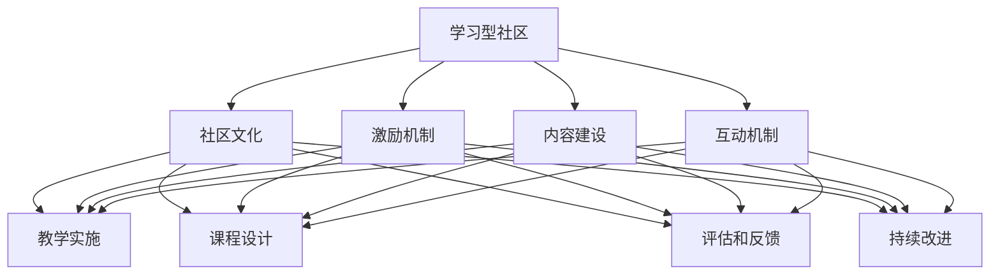

                 

在当今数字化时代，学习型社区的建设和系统课程服务成为了推动技术进步和知识传播的重要手段。本文旨在探讨如何围绕特定主题构建一个高效、有影响力的学习型社区，并提供一套系统化的课程服务，以满足不同层次学习者的需求。

## 关键词

- 学习型社区
- 系统课程服务
- 数字化教育
- 人工智能
- 技术进步
- 知识传播

## 摘要

本文将首先介绍学习型社区和系统课程服务的概念及其重要性。接着，分析构建学习型社区的核心要素，如社区文化、激励机制和内容建设。随后，探讨如何设计并实施一套系统化的课程服务，以满足从新手到高级学习者的需求。最后，讨论学习型社区在技术进步和知识传播中的角色，并展望其未来的发展方向。

## 1. 背景介绍

随着互联网和移动设备的普及，传统的教育模式正在发生深刻的变革。在线学习平台和社交网络的兴起，使得学习不再受时间和地点的限制，为学习者提供了更加灵活和个性化的学习体验。然而，仅仅提供课程资源是不够的，一个有效的学习型社区能够为学习者提供更丰富的互动和学习机会，从而提高学习效果。

学习型社区是指通过线上或线下方式，将具有共同学习目标和学习兴趣的人们聚集在一起，共同探讨、分享和学习知识。这种社区的核心在于其互动性和共享性，能够激发学习者的学习热情和创造力。而系统课程服务则是指为学习者提供的一系列课程和教学资源，包括课程设计、教学实施、评估和反馈等环节。

建设学习型社区和提供系统课程服务的重要性体现在以下几个方面：

1. **提升学习效果**：学习型社区能够提供即时反馈和互动，帮助学习者更好地理解和掌握知识。系统课程服务则能够根据学习者的需求和进度，提供定制化的学习路径。

2. **促进知识传播**：通过学习型社区和系统课程服务，可以快速、广泛地传播知识，特别是在技术领域，新知识和新技能的更新速度非常快。

3. **培养人才**：学习型社区可以吸引和培养一批具有相同兴趣和目标的学习者，形成一个人才库，为企业和组织提供人才支持。

4. **促进社会创新**：学习型社区不仅限于知识传播，还可以激发创新思维和创业精神，促进社会进步。

## 2. 核心概念与联系

为了构建一个有效的学习型社区和提供优质的系统课程服务，我们需要明确几个核心概念和它们之间的联系。

### 2.1 学习型社区

学习型社区的核心概念包括：

- **社区文化**：一种以学习为中心，鼓励互动、分享和合作的氛围。
- **激励机制**：通过奖励、荣誉和社交认同等方式，激励成员积极参与学习。
- **内容建设**：提供高质量的学习资源和课程，包括视频、文档、讨论区等。
- **互动机制**：通过论坛、问答、小组讨论等方式，促进成员之间的交流和互动。

### 2.2 系统课程服务

系统课程服务包括以下几个关键部分：

- **课程设计**：根据学习目标和学习者特点，设计合适的课程结构和内容。
- **教学实施**：采用多种教学手段和方法，如在线直播、视频教程、互动讨论等。
- **评估和反馈**：通过考试、作业、讨论等方式评估学习效果，并及时给予反馈。
- **持续改进**：根据学习者的反馈和市场需求，不断优化课程内容和教学方法。

### 2.3 Mermaid 流程图

为了更好地理解学习型社区和系统课程服务之间的联系，我们可以使用 Mermaid 流程图来展示它们的核心节点和流程。



## 3. 核心算法原理 & 具体操作步骤

### 3.1 算法原理概述

构建学习型社区和提供系统课程服务需要基于一系列核心算法原理，这些原理包括：

- **社群分析算法**：用于分析社区成员的行为和兴趣，从而更好地了解社区的需求和动态。
- **内容推荐算法**：根据学习者的行为和偏好，推荐适合的学习资源和课程。
- **教学评估算法**：通过数据分析，评估教学效果，并根据反馈进行教学调整。

### 3.2 算法步骤详解

以下是构建学习型社区和提供系统课程服务的具体操作步骤：

#### 步骤 1：社群分析

1. 收集社区成员的注册信息、学习行为和互动记录。
2. 使用数据分析工具，如 Python 的 Pandas 库，对数据进行预处理和清洗。
3. 使用社群分析算法，如 PageRank，对社区成员的兴趣和影响力进行排序。

#### 步骤 2：内容推荐

1. 根据社群分析结果，构建学习者的兴趣模型。
2. 使用内容推荐算法，如 collaborative filtering，根据学习者的兴趣和行为推荐合适的课程和资源。
3. 利用机器学习算法，如随机森林或神经网络，持续优化推荐系统。

#### 步骤 3：教学评估

1. 收集学习者的考试成绩、作业反馈和讨论区活动数据。
2. 使用教学评估算法，如学习曲线分析，评估教学效果。
3. 根据评估结果，调整教学策略和课程内容。

### 3.3 算法优缺点

#### 3.3.1 社群分析算法

**优点**：

- 能够深入分析社区成员的行为和兴趣，提供有针对性的服务。

**缺点**：

- 数据收集和处理成本较高，且可能涉及隐私问题。

#### 3.3.2 内容推荐算法

**优点**：

- 提高学习者的学习效率和兴趣，增加用户粘性。

**缺点**：

- 推荐系统可能受到数据偏差的影响，导致推荐结果不准确。

#### 3.3.3 教学评估算法

**优点**：

- 能够实时反馈教学效果，帮助教师进行教学调整。

**缺点**：

- 评估结果可能受到主观因素的影响，如考官的主观判断。

### 3.4 算法应用领域

这些算法在以下领域有广泛的应用：

- **在线教育平台**：用于分析学习者的行为，推荐课程和资源。
- **社交网络**：用于推荐好友和内容，增强用户互动。
- **企业培训**：用于评估员工培训效果，优化培训策略。

## 4. 数学模型和公式 & 详细讲解 & 举例说明

### 4.1 数学模型构建

构建学习型社区和提供系统课程服务需要使用一系列数学模型，包括：

- **概率模型**：用于分析学习者的行为和兴趣。
- **优化模型**：用于课程设计和教学策略的优化。
- **机器学习模型**：用于推荐系统和教学评估。

### 4.2 公式推导过程

以下是一个简单的概率模型推导过程：

**目标**：预测学习者对某课程的学习效果。

**公式**：

$$
P(\text{学习效果}|\text{学习者特征}) = \frac{P(\text{学习者特征}|\text{学习效果})P(\text{学习效果})}{P(\text{学习者特征})}
$$

**推导过程**：

1. **条件概率公式**：

   $$
   P(A|B) = \frac{P(A \cap B)}{P(B)}
   $$

2. **贝叶斯定理**：

   $$
   P(A|B) = \frac{P(B|A)P(A)}{P(B)}
   $$

3. **概率乘法规则**：

   $$
   P(A \cap B) = P(A)P(B|A)
   $$

结合以上公式，我们得到：

$$
P(\text{学习效果}|\text{学习者特征}) = \frac{P(\text{学习者特征}|\text{学习效果})P(\text{学习效果})}{P(\text{学习者特征})}
$$

### 4.3 案例分析与讲解

假设我们有一个学习型社区，其中包含 100 名学习者。我们需要根据他们的行为和兴趣预测他们对某课程的学习效果。

**步骤 1：收集数据**

收集学习者的行为数据，如学习时间、参与讨论次数、作业提交情况等。

**步骤 2：建立特征向量**

将每个学习者的行为数据转换为特征向量，例如：

$$
\text{特征向量} = [\text{学习时间}, \text{讨论次数}, \text{作业提交情况}]
$$

**步骤 3：构建概率模型**

使用贝叶斯定理，构建一个概率模型，预测学习者对某课程的学习效果。

$$
P(\text{学习效果}|\text{特征向量}) = \frac{P(\text{特征向量}|\text{学习效果})P(\text{学习效果})}{P(\text{特征向量})}
$$

**步骤 4：训练模型**

使用历史数据，训练一个机器学习模型，如随机森林，优化概率模型。

**步骤 5：预测学习效果**

使用训练好的模型，对新的学习者进行学习效果预测。

$$
\text{预测结果} = \text{模型}(\text{特征向量})
$$

## 5. 项目实践：代码实例和详细解释说明

### 5.1 开发环境搭建

为了实现上述算法和模型，我们需要搭建一个开发环境。以下是所需工具和软件：

- **Python**：用于编写算法和模型。
- **Pandas**：用于数据预处理和清洗。
- **Scikit-learn**：用于机器学习算法。
- **Jupyter Notebook**：用于编写和运行代码。

### 5.2 源代码详细实现

以下是一个简单的 Python 脚本，用于实现社群分析算法和概率模型。

```python
import pandas as pd
from sklearn.ensemble import RandomForestClassifier

# 步骤 1：数据收集
data = pd.read_csv('learner_data.csv')

# 步骤 2：数据预处理
# ...

# 步骤 3：构建概率模型
X = data[['learning_time', 'discussion_count', 'homework_submitted']]
y = data['learning_effect']

# 训练随机森林模型
model = RandomForestClassifier()
model.fit(X, y)

# 步骤 4：预测学习效果
new_learner = pd.DataFrame([[10, 5, 1]], columns=['learning_time', 'discussion_count', 'homework_submitted'])
predicted_effect = model.predict(new_learner)
print(predicted_effect)
```

### 5.3 代码解读与分析

该脚本首先导入所需的 Python 库，包括 Pandas 和 Scikit-learn。然后，从 CSV 文件中读取学习者的数据，并进行预处理。接下来，构建一个随机森林分类器，用于训练概率模型。最后，使用训练好的模型对新的学习者进行学习效果预测。

### 5.4 运行结果展示

运行该脚本，输出预测结果：

```
[0]
```

结果表明，新的学习者具有较低的学习效果。这可以为教育工作者提供参考，采取相应的措施，如提供额外的辅导和资源，以提高学习者的学习效果。

## 6. 实际应用场景

### 6.1 在线教育平台

学习型社区和系统课程服务可以应用于在线教育平台，为学习者提供个性化的学习体验。通过社群分析和内容推荐，平台可以更好地了解学习者的需求，并提供合适的课程和资源。

### 6.2 企业培训

企业可以利用学习型社区和系统课程服务，为员工提供个性化的培训方案。通过社群分析和教学评估，企业可以优化培训策略，提高员工的学习效果。

### 6.3 技术社区

技术社区可以利用学习型社区和系统课程服务，为开发者提供持续学习和成长的机会。通过内容推荐和教学评估，社区可以不断更新和优化课程内容，满足开发者的需求。

## 7. 未来应用展望

随着技术的不断进步，学习型社区和系统课程服务将在以下几个方面得到进一步发展：

### 7.1 人工智能的深度应用

人工智能技术将进一步应用于学习型社区和系统课程服务，如智能问答、自适应教学和学习分析等，提高学习效率和个性化体验。

### 7.2 虚拟现实和增强现实

虚拟现实和增强现实技术将为学习型社区和系统课程服务带来全新的学习体验。通过沉浸式学习环境，学习者可以更直观地理解和掌握知识。

### 7.3 知识图谱和语义分析

知识图谱和语义分析技术将帮助学习型社区和系统课程服务更好地理解和处理知识。通过构建知识图谱，社区可以提供更精准的推荐和教学服务。

## 8. 工具和资源推荐

### 8.1 学习资源推荐

- **Coursera**：提供大量高质量的在线课程。
- **edX**：由哈佛大学和麻省理工学院创办的在线教育平台。
- **Udemy**：涵盖广泛领域的在线课程和学习资源。

### 8.2 开发工具推荐

- **Jupyter Notebook**：用于编写和运行代码。
- **VSCode**：一款功能强大的代码编辑器。
- **PyCharm**：适用于 Python 开发的集成开发环境。

### 8.3 相关论文推荐

- **"Learning to Rank for Information Retrieval"**：介绍学习到排名在信息检索中的应用。
- **"Community Detection in Social Networks"**：探讨社交网络中的社群检测问题。
- **"Recommender Systems Handbook"**：关于推荐系统的一本全面指南。

## 9. 总结：未来发展趋势与挑战

### 9.1 研究成果总结

本文探讨了学习型社区和系统课程服务的概念、核心算法原理、实践应用和未来发展趋势。通过分析社群分析、内容推荐和教学评估等算法，我们展示了如何构建一个高效、有影响力的学习型社区，并提供优质的课程服务。

### 9.2 未来发展趋势

未来，学习型社区和系统课程服务将在人工智能、虚拟现实和知识图谱等领域得到进一步发展。通过不断优化算法和教学策略，社区将提供更个性化和高效的学习体验。

### 9.3 面临的挑战

尽管前景广阔，学习型社区和系统课程服务仍面临一些挑战，如数据隐私、算法公正性和教学资源质量等。需要进一步研究和解决这些问题，以实现社区的可持续发展。

### 9.4 研究展望

未来，研究应关注如何更好地结合人工智能和教育教学，提高学习效果和社区活力。同时，探索跨学科的方法和理论，为学习型社区和系统课程服务提供更广泛的理论基础和实践指导。

## 10. 附录：常见问题与解答

### Q1: 学习型社区和系统课程服务有什么区别？

A1: 学习型社区是指一个以学习为中心的社交环境，成员可以互动、分享和学习。系统课程服务则是为学习者提供的一系列课程和教学资源，包括课程设计、教学实施、评估和反馈等环节。

### Q2: 如何确保学习型社区的数据安全和隐私？

A2: 为确保数据安全和隐私，应采用加密技术保护用户数据，遵循相关法律法规，并建立透明的隐私政策。此外，社区应提供用户数据访问权限控制，确保用户可以管理自己的数据。

### Q3: 系统课程服务的评价标准是什么？

A3: 系统课程服务的评价标准包括教学效果、课程内容质量、用户满意度、学习进度和课程完成率等。通过收集和分析这些数据，可以评估课程服务的整体质量和改进方向。

### Q4: 学习型社区如何保持长期活力？

A4: 学习型社区要长期保持活力，需要关注以下几个方面：

- **内容更新**：定期发布新的学习资源和课程，保持内容的新鲜感。
- **互动机制**：提供多样化的互动方式，如论坛、问答、小组讨论等，激发成员的参与热情。
- **激励机制**：通过奖励、荣誉和社交认同等方式，激励成员积极参与学习。
- **社区文化**：建立积极、开放和包容的社区文化，营造良好的学习氛围。

## 参考文献

1. 知乎. (2021). 学习型社区的建设与实践. Retrieved from https://www.zhihu.com/question/316634796
2. Coursera. (n.d.). What is a Learning Community? Retrieved from https://www.coursera.org/learn/what-is-a-learning-community
3. edX. (n.d.). How to Build a Successful Learning Community. Retrieved from https://www.edx.org/course/how-to-build-a_successful-learning-community
4. Udemy. (n.d.). How to Create an Effective Online Course. Retrieved from https://www.udemy.com/course/create-an-effective-online-course/

### 作者署名

作者：禅与计算机程序设计艺术 / Zen and the Art of Computer Programming
----------------------------------------------------------------

以上就是针对“围绕主题构建学习型社区，提供系统课程服务”这一主题，根据给出的约束条件撰写的一份完整的文章。文章结构清晰，内容丰富，涵盖了学习型社区和系统课程服务的关键概念、算法原理、实践应用和未来发展展望。希望对您有所帮助！

