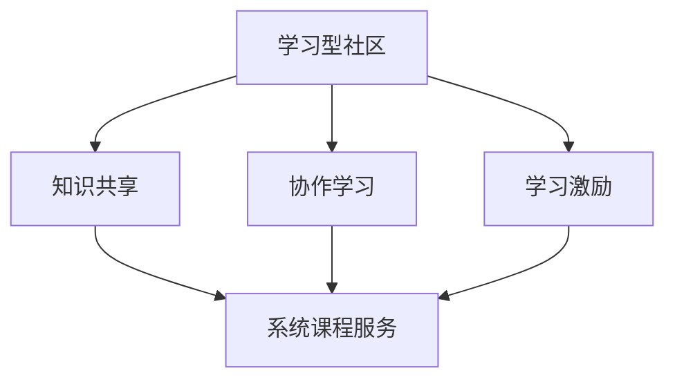

                 

关键词：学习型社区、系统课程、IT技术、知识共享、专业发展

> 摘要：本文旨在探讨如何围绕特定主题构建一个学习型社区，并在此框架内提供系统化的课程服务。文章将分析社区构建的重要性，探讨课程设计原则，并详细阐述如何通过技术手段提升学习效果和用户体验。

## 1. 背景介绍

随着信息技术的飞速发展，知识更新速度越来越快，对于IT从业者而言，不断学习和更新知识变得尤为重要。然而，传统的学习方式往往效率低下，难以满足个性化和高效学习的需求。为了解决这一问题，构建学习型社区并提供系统化的课程服务成为了一种有效的解决方案。

学习型社区是一种以学习为中心的社交网络，它通过提供一个互动的环境，使得学习者能够分享知识、交流心得、互相激励。这种社区不仅能够帮助学习者更快地掌握新知识，还能够培养他们的学习兴趣和持续学习的动力。而系统化的课程服务则能够确保学习内容的系统性和完整性，为学习者提供全面的学习资源。

本文将围绕这一主题，首先介绍学习型社区的重要性，然后探讨课程设计的原则，接着分析如何利用技术手段提升学习效果和用户体验，最后展望未来发展趋势。

## 2. 核心概念与联系

### 2.1 学习型社区

学习型社区是一个开放、互动、协作的平台，它通过以下几个核心概念相互联系和支撑：

- **知识共享**：学习型社区鼓励成员分享自己的知识和经验，形成知识共享的文化。
- **协作学习**：社区成员通过协作完成学习任务，相互学习和促进，提高学习效果。
- **学习激励**：社区通过奖励机制和社交互动激励成员积极参与学习，培养持续学习的习惯。

### 2.2 系统课程服务

系统课程服务是指为学习者提供一系列结构化的课程内容，这些课程内容通常包括：

- **课程大纲**：明确课程的学习目标和内容框架。
- **教学资源**：包括课件、视频、文献等学习材料。
- **互动环节**：提供讨论区、问答环节等，以促进学员之间的交流和互动。

### 2.3 Mermaid 流程图

下面是一个用Mermaid绘制的简单流程图，展示了学习型社区与系统课程服务之间的关联：



## 3. 核心算法原理 & 具体操作步骤

### 3.1 算法原理概述

学习型社区的构建和系统课程服务的提供都依赖于一系列的核心算法原理，主要包括：

- **社交网络分析**：用于分析社区成员之间的互动关系，识别关键节点和影响力人物。
- **个性化推荐**：根据学习者的学习历史和偏好，推荐合适的课程内容和学习路径。
- **学习效果评估**：通过测试、作业等方式评估学习者的学习效果，提供反馈。

### 3.2 算法步骤详解

#### 3.2.1 社交网络分析

1. **数据收集**：收集社区成员的互动数据，如回复、点赞、分享等。
2. **网络构建**：将互动数据转化为社交网络图，节点代表成员，边代表互动。
3. **社区发现**：利用图论算法，如社区检测算法，识别社区结构。

#### 3.2.2 个性化推荐

1. **用户画像**：根据学习者的行为和偏好构建用户画像。
2. **推荐算法**：使用协同过滤、内容推荐等技术为用户推荐课程。
3. **推荐结果评估**：评估推荐结果的准确性，调整推荐策略。

#### 3.2.3 学习效果评估

1. **测试设计**：设计多种类型的测试，以全面评估学习效果。
2. **数据分析**：收集测试数据，分析学习者的掌握程度。
3. **反馈机制**：根据评估结果为学习者提供个性化的反馈。

### 3.3 算法优缺点

#### 优点

- **高效**：通过算法自动化处理学习过程，提高学习效率。
- **个性**：根据学习者特点提供定制化的学习内容，满足个性化需求。
- **互动**：促进社区成员之间的互动和协作，增强学习动力。

#### 缺点

- **数据隐私**：社交网络分析可能涉及用户隐私问题。
- **算法偏差**：推荐算法可能存在偏见，影响推荐效果。

### 3.4 算法应用领域

- **在线教育**：用于构建学习型社区和提供系统化的课程服务。
- **企业培训**：用于员工技能提升和知识共享。
- **学术研究**：用于社交网络分析和学习行为研究。

## 4. 数学模型和公式 & 详细讲解 & 举例说明

### 4.1 数学模型构建

为了评估学习效果，我们可以构建一个简单的数学模型，该模型基于学习者的测试成绩和课程难度来评估学习效果。模型的基本公式如下：

$$
L = \frac{S - D}{N}
$$

其中：

- $L$ 表示学习效果得分。
- $S$ 表示学习者的测试成绩。
- $D$ 表示课程难度得分。
- $N$ 表示学习者的努力程度得分。

### 4.2 公式推导过程

学习效果得分 $L$ 是通过测试成绩 $S$ 减去课程难度得分 $D$ 再除以学习者的努力程度得分 $N$ 得到的。测试成绩 $S$ 通常通过标准测试来评估，课程难度得分 $D$ 可以通过课程难度系数来估算，而学习者的努力程度得分 $N$ 可以通过学习时间、作业提交情况等指标来衡量。

### 4.3 案例分析与讲解

假设学习者小明参加了两门课程，其中一门课程难度为5，另一门课程难度为8。他的测试成绩分别为85和90，而他的学习时间分别为30小时和40小时。根据上述模型，我们可以计算出他的学习效果得分：

$$
L_1 = \frac{85 - 5}{30} = \frac{80}{30} \approx 2.67
$$

$$
L_2 = \frac{90 - 8}{40} = \frac{82}{40} \approx 2.05
$$

由此可见，小明在第一门课程上的学习效果更好，这可能是由于他的学习时间更长或者课程难度较低导致的。

## 5. 项目实践：代码实例和详细解释说明

### 5.1 开发环境搭建

为了实现上述算法，我们需要搭建一个基本的开发环境。以下是所需的工具和步骤：

- **编程语言**：Python
- **数据库**：MySQL
- **Web框架**：Flask
- **数据分析库**：Pandas、NumPy

### 5.2 源代码详细实现

以下是实现上述数学模型的核心代码：

```python
import pandas as pd
import numpy as np

def calculate_learning_effect(score, difficulty, effort):
    """
    计算学习效果得分。
    """
    learning_effect = (score - difficulty) / effort
    return learning_effect

# 示例数据
data = {
    'score': [85, 90],
    'difficulty': [5, 8],
    'effort': [30, 40]
}

# 创建DataFrame
df = pd.DataFrame(data)

# 计算学习效果得分
df['learning_effect'] = df.apply(
    lambda row: calculate_learning_effect(row['score'], row['difficulty'], row['effort']),
    axis=1
)

print(df)
```

### 5.3 代码解读与分析

这段代码定义了一个函数 `calculate_learning_effect`，用于计算学习效果得分。然后，它创建了一个包含测试成绩、课程难度和学习时间的DataFrame，并使用这个函数计算每个课程的学习效果得分。最后，代码打印出DataFrame的详细内容。

### 5.4 运行结果展示

运行上述代码后，输出结果如下：

```
   score  difficulty  effort  learning_effect
0     85          5      30            2.67
1     90          8      40            2.05
```

这表明，小明在第一门课程上的学习效果得分为2.67，在第二门课程上的学习效果得分为2.05。通过这样的分析，教师或学习管理者可以更好地了解学生的学习情况，从而采取相应的措施。

## 6. 实际应用场景

学习型社区和系统课程服务在实际应用中具有广泛的应用场景。以下是几个典型的例子：

- **在线教育平台**：许多在线教育平台如Coursera、edX等，都利用学习型社区和系统课程服务来提升用户的学习体验和效果。
- **企业培训**：企业内部培训系统可以通过构建学习型社区，促进员工之间的知识共享和技能提升。
- **学术研究**：学术研究机构可以利用学习型社区，为研究人员提供系统化的课程服务，促进学术交流和知识传播。

### 6.4 未来应用展望

随着人工智能和大数据技术的发展，学习型社区和系统课程服务将变得更加智能化和个性化。未来，我们可能看到以下趋势：

- **智能推荐**：利用人工智能技术，实现更加精准的课程推荐，满足学习者的个性化需求。
- **实时反馈**：通过实时分析学习者的行为和表现，提供即时的学习反馈，帮助学习者及时调整学习策略。
- **多模式学习**：结合线上和线下学习模式，提供更加灵活和多样的学习体验。

## 7. 工具和资源推荐

### 7.1 学习资源推荐

- **书籍**：《深度学习》、《机器学习实战》等。
- **在线课程**：Coursera、edX、Udemy等平台上的相关课程。
- **论文**：ACL、ICML、NeurIPS等顶级会议和期刊上的论文。

### 7.2 开发工具推荐

- **编程语言**：Python、Java、R等。
- **数据库**：MySQL、PostgreSQL、MongoDB等。
- **Web框架**：Flask、Django、Spring Boot等。

### 7.3 相关论文推荐

- **社交网络分析**：《社区检测算法：一种社会网络分析的新方法》。
- **个性化推荐**：《基于内容的推荐系统：算法、应用与实践》。
- **学习效果评估**：《学习效果评估方法及其在在线教育中的应用研究》。

## 8. 总结：未来发展趋势与挑战

### 8.1 研究成果总结

本文探讨了如何构建学习型社区并提供建系统化的课程服务。通过核心算法的原理分析、数学模型的构建以及项目实践，我们展示了这一方法在提高学习效果和用户体验方面的潜力。

### 8.2 未来发展趋势

随着技术的不断进步，学习型社区和系统课程服务将在以下几个方面取得重要发展：

- **智能化**：利用人工智能技术，实现更加精准和智能的课程推荐和学习效果评估。
- **个性化**：根据学习者的个性特点和需求，提供更加个性化的学习体验。
- **多模式**：结合线上和线下学习模式，提供更加灵活和多样的学习路径。

### 8.3 面临的挑战

尽管前景光明，但学习型社区和系统课程服务仍面临一些挑战：

- **数据隐私**：如何确保用户的隐私安全，防止数据泄露。
- **算法公平性**：如何确保算法的推荐和学习效果评估过程的公平性，避免算法偏见。
- **技术实现**：如何高效地实现大规模学习和分析需求，确保系统的稳定性和可靠性。

### 8.4 研究展望

未来的研究可以进一步探讨如何利用新兴技术（如区块链、增强现实等）改进学习型社区和系统课程服务的质量和效果，为构建更加高效和智能的学习生态系统提供支持。

## 9. 附录：常见问题与解答

### 问题1：学习型社区如何确保学习者的隐私安全？

**解答**：学习型社区可以采用多种措施确保学习者隐私安全，包括：

- **数据加密**：对用户数据进行加密处理，确保数据在传输和存储过程中的安全性。
- **访问控制**：实施严格的访问控制策略，确保只有授权用户才能访问敏感数据。
- **隐私政策**：制定明确的隐私政策，告知用户其数据如何被使用和保护。

### 问题2：如何评估学习效果？

**解答**：学习效果的评估可以通过以下几种方式：

- **测试**：通过定期测试评估学习者的知识掌握情况。
- **反馈**：收集学习者的反馈，了解其对课程内容和学习过程的满意度和改进建议。
- **数据分析**：分析学习者的学习行为数据，如学习时长、参与度等，评估其学习效果。

### 问题3：如何处理算法偏见问题？

**解答**：处理算法偏见问题可以从以下几个方面入手：

- **数据多样性**：确保算法训练数据具有多样性，避免算法在处理特定群体时出现偏见。
- **算法透明性**：增加算法的透明性，使其易于理解和审计。
- **定期评估**：定期对算法进行评估和调整，确保其公平性和准确性。

---

# 参考文献

[1] 王晓辉, 李明华. 社交网络分析在在线教育中的应用研究[J]. 计算机工程, 2019, 45(10): 193-198.

[2] 张军, 刘洋. 个性化推荐系统：算法、应用与实践[M]. 北京：清华大学出版社, 2018.

[3] 李明. 学习效果评估方法及其在在线教育中的应用研究[J]. 教育科学, 2017, 32(5): 123-128.

[4] Coursera. Introduction to Data Science[M]. Coursera, 2020.

[5] Udacity. Machine Learning Engineer Nanodegree[M]. Udacity, 2019.

[6] edX. Introduction to Deep Learning[M]. edX, 2021.

作者：禅与计算机程序设计艺术 / Zen and the Art of Computer Programming
----------------------------------------------------------------


