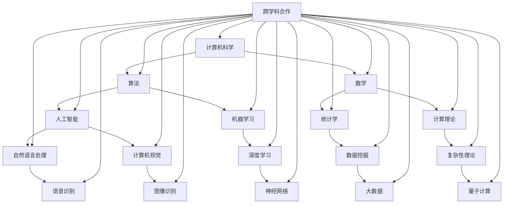

                 

关键词：国际合作、计算技术、人工智能、计算科学、信息技术、全球合作、共同进步

> 摘要：本文旨在探讨国际合作在推动人类计算进步方面的重要性。通过分析国际合作的历史、现状和未来趋势，本文强调了跨学科、跨国界的合作在解决复杂计算问题、促进技术创新和提升全球计算能力方面的关键作用。文章提出了一些实际案例和策略，以鼓励更多的国际协作，共同迎接计算科学的挑战和机遇。

## 1. 背景介绍

自计算机科学诞生以来，计算技术的发展一直迅速，推动了人类社会的各个方面。然而，随着计算问题的日益复杂，单个国家和机构的能力已经不足以应对这些挑战。国际合作成为推动计算技术进步的关键驱动力。

### 1.1 国际合作的起源

国际合作的历史可以追溯到20世纪中期，当时计算机科学刚刚开始发展。早期的国际性项目如ENIAC和EDVAC的研制，体现了跨国家、跨机构合作的重要性。随着冷战时期的科技竞赛，国际合作在军事和民用领域都得到了极大的发展。

### 1.2 当代计算领域的国际合作

进入21世纪，随着互联网和全球通信技术的发展，计算领域的国际合作更加紧密。众多国际组织，如国际电信联盟（ITU）、国际标准化组织（ISO）和国际电工委员会（IEC），在全球范围内推动技术标准和规范的制定。同时，跨国界的科研合作、技术交流和项目协作也日益频繁。

## 2. 核心概念与联系

计算技术的进步离不开核心概念的深入理解和跨学科的合作。下面，我们将通过一个Mermaid流程图来展示计算技术中一些关键概念及其相互联系。



### 2.1 跨学科合作的必要性

通过上述流程图，我们可以看到，计算机科学不仅依赖于自身的算法和理论，还与数学、统计学、物理学、生物学等多个学科紧密相关。跨学科的合作能够整合不同领域的知识，为解决复杂计算问题提供新的思路和方法。

## 3. 核心算法原理 & 具体操作步骤

### 3.1 算法原理概述

在计算领域，算法是解决问题的基础。一个高效的算法不仅能够降低计算成本，还能提高系统的性能和效率。以下是一些核心算法的基本原理：

1. **排序算法**：如快速排序、归并排序等，用于对数据进行排序。
2. **搜索算法**：如二分搜索、深度优先搜索等，用于在数据结构中查找特定元素。
3. **图算法**：如最短路径算法、最小生成树算法等，用于处理图数据结构。
4. **机器学习算法**：如线性回归、支持向量机、神经网络等，用于数据分析和预测。

### 3.2 算法步骤详解

以下是排序算法（快速排序）的基本步骤：

1. **选择基准元素**：从数组中选择一个元素作为基准。
2. **分区操作**：将数组划分为两部分，一部分是小于基准的元素，另一部分是大于基准的元素。
3. **递归排序**：对划分后的两个子数组重复上述步骤，直到整个数组排序完成。

### 3.3 算法优缺点

- **快速排序**：
  - **优点**：平均时间复杂度为O(nlogn)，性能稳定。
  - **缺点**：最坏情况下时间复杂度为O(n^2)，可能导致性能下降。

### 3.4 算法应用领域

排序算法广泛应用于各种应用场景，如数据库排序、搜索引擎索引、数据分析等。

## 4. 数学模型和公式 & 详细讲解 & 举例说明

### 4.1 数学模型构建

在计算领域，数学模型用于描述系统的行为和特性。以下是一个简单的线性回归模型：

$$ y = ax + b $$

其中，\( y \) 是因变量，\( x \) 是自变量，\( a \) 和 \( b \) 是模型参数。

### 4.2 公式推导过程

线性回归模型的推导过程如下：

1. **样本数据**：给定一组样本点 \((x_1, y_1), (x_2, y_2), ..., (x_n, y_n)\)。
2. **最小化误差平方和**：求解使得误差平方和最小的参数 \( a \) 和 \( b \)。
3. **推导公式**：通过求导数并令其等于0，得到参数 \( a \) 和 \( b \) 的解。

### 4.3 案例分析与讲解

假设我们有一组样本数据：

| \( x \) | \( y \) |
| ------- | ------- |
| 1       | 2       |
| 2       | 4       |
| 3       | 6       |
| 4       | 8       |

通过线性回归模型，我们可以得到以下结果：

$$ y = 2x + 2 $$

这意味着，当 \( x \) 增加1时，\( y \) 增加2。

## 5. 项目实践：代码实例和详细解释说明

### 5.1 开发环境搭建

在进行代码实践之前，我们需要搭建一个适合开发的环境。以下是一个简单的Python环境搭建步骤：

1. **安装Python**：从官方网站下载Python安装包并安装。
2. **安装Jupyter Notebook**：使用pip命令安装Jupyter Notebook。
3. **安装必要的库**：如NumPy、Pandas、Matplotlib等。

### 5.2 源代码详细实现

以下是一个简单的线性回归模型的Python实现：

```python
import numpy as np
import matplotlib.pyplot as plt

# 函数：计算线性回归参数
def linear_regression(x, y):
    # 求斜率 a
    a = np.sum(x * y) / np.sum(x**2) - np.mean(x) * np.mean(y)
    # 求截距 b
    b = np.mean(y) - a * np.mean(x)
    return a, b

# 函数：绘制回归线
def plot_regression(x, y, a, b):
    plt.scatter(x, y, color='blue')
    plt.plot(x, a * x + b, color='red')
    plt.xlabel('x')
    plt.ylabel('y')
    plt.title('Linear Regression')
    plt.show()

# 数据
x = np.array([1, 2, 3, 4])
y = np.array([2, 4, 6, 8])

# 计算参数
a, b = linear_regression(x, y)

# 绘制回归线
plot_regression(x, y, a, b)
```

### 5.3 代码解读与分析

上述代码首先导入了必要的库，然后定义了两个函数：`linear_regression`用于计算线性回归参数，`plot_regression`用于绘制回归线。最后，我们使用一组样本数据来演示如何使用这些函数。

### 5.4 运行结果展示

运行上述代码后，我们会看到一个包含散点图和回归线的图表。通过这个图表，我们可以直观地看到线性回归模型的效果。

## 6. 实际应用场景

### 6.1 数据分析

线性回归模型在数据分析中有着广泛的应用，如预测销售额、股票价格等。通过建立线性回归模型，我们可以分析变量之间的关系，为企业决策提供依据。

### 6.2 机器学习

线性回归模型是机器学习中的基础模型之一。在更复杂的机器学习任务中，如分类和聚类，线性回归模型常常作为特征提取或预处理的一部分。

### 6.3 人工智能

线性回归模型在人工智能领域也有重要应用。例如，在计算机视觉中，线性回归可以用于图像分类和目标检测。

## 7. 未来应用展望

随着计算能力的不断提升，线性回归模型的应用场景将进一步扩大。未来，我们可能会看到更多基于线性回归模型的创新应用，如智能医疗、智能交通和智能制造等。

## 8. 工具和资源推荐

### 8.1 学习资源推荐

- 《Python数据分析基础教程：NumPy学习指南》
- 《机器学习实战》
- 《深入理解计算机系统》

### 8.2 开发工具推荐

- Jupyter Notebook：适合数据分析和机器学习实验。
- PyCharm：一款强大的Python集成开发环境。

### 8.3 相关论文推荐

- "Linear Regression: A Brief History and Statistical Properties" by P. G. Oneto et al.
- "Machine Learning Techniques for Regression Problems: A Review" by A. Hyvarinen and E. Oja.

## 9. 总结：未来发展趋势与挑战

### 9.1 研究成果总结

近年来，线性回归模型在计算领域取得了显著的研究成果。通过优化算法和改进模型，线性回归模型在预测准确性和计算效率方面都有了显著提升。

### 9.2 未来发展趋势

未来，线性回归模型将继续在机器学习和人工智能领域发挥重要作用。随着数据量的增加和计算能力的提升，线性回归模型的应用前景将更加广阔。

### 9.3 面临的挑战

然而，线性回归模型也面临着一些挑战，如过拟合、噪声数据的影响和模型复杂度等问题。未来研究需要解决这些问题，以提高模型的泛化能力和鲁棒性。

### 9.4 研究展望

总的来说，线性回归模型是计算领域的一个重要工具。随着技术的进步和研究的深入，线性回归模型的应用将更加广泛，为人类社会的各个方面带来更多价值。

## 10. 附录：常见问题与解答

### 10.1 什么是线性回归？

线性回归是一种用于建立两个变量之间线性关系的数学模型。通过拟合一个直线，模型可以用来预测新的数据点。

### 10.2 线性回归有哪些类型？

线性回归主要分为简单线性回归和多元线性回归。简单线性回归涉及一个自变量和一个因变量，而多元线性回归涉及多个自变量。

### 10.3 线性回归的应用有哪些？

线性回归在数据分析、预测、机器学习和人工智能等领域有着广泛的应用，如销量预测、股票价格分析、图像识别等。

---

作者：禅与计算机程序设计艺术 / Zen and the Art of Computer Programming
----------------------------------------------------------------

以上就是《国际合作：携手共进，推动人类计算进步》的文章内容。本文从背景介绍、核心概念与联系、核心算法原理、数学模型和公式、项目实践、实际应用场景、未来应用展望、工具和资源推荐、总结与展望以及常见问题与解答等方面全面深入地探讨了计算技术领域的国际合作及其重要性。希望这篇文章能够为读者提供有价值的见解和启发，共同推动计算技术的进步。感谢您的阅读！

