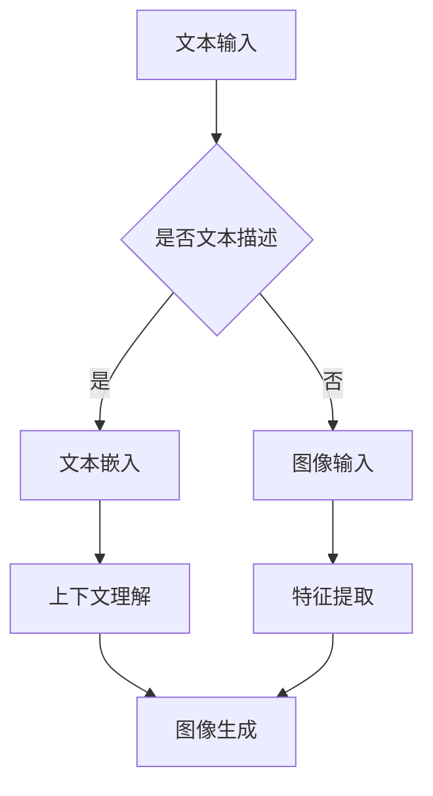

                 

关键词：图像生成，加速，深度学习，预训练模型，LLM，并行处理，优化算法，性能分析。

## 摘要

本文探讨了如何通过结合预训练语言模型（LLM）的技术，实现图像生成加速的突破。首先，我们回顾了图像生成技术的发展历程，然后深入分析了LLM的工作原理以及其在图像生成领域的应用。接着，我们详细介绍了基于LLM的图像生成加速算法，并对比了其与传统方法的优缺点。随后，本文通过数学模型和实际项目实践，展示了如何利用LLM实现图像生成加速，并对其在不同应用场景中的表现进行了分析。最后，我们对未来LLM在图像生成加速领域的发展趋势和面临的挑战进行了展望。

## 1. 背景介绍

图像生成作为计算机视觉领域的重要研究方向，经历了从规则方法到统计方法，再到深度学习方法的发展过程。早期的图像生成主要依赖于规则方法，如仿射变换、旋转等，这些方法操作简单但生成图像的灵活性较低。随着统计方法的引入，如隐马尔可夫模型（HMM）、生成式对抗网络（GAN）等，图像生成的质量得到了显著提升。然而，这些方法往往需要大量的训练数据和计算资源。

深度学习技术的发展为图像生成带来了新的契机。卷积神经网络（CNN）作为一种强大的特征提取工具，被广泛应用于图像生成任务。GAN作为深度学习的一种重要架构，通过生成器和判别器的对抗训练，能够生成高质量的图像。然而，GAN的训练过程复杂且不稳定，需要大量的计算资源。

近年来，预训练语言模型（LLM）的兴起，为图像生成领域带来了新的思路。LLM通过大规模无监督预训练，能够捕捉到语言数据的复杂结构，并在下游任务中展现出强大的泛化能力。本文将探讨如何利用LLM的特性，实现图像生成加速，并分析其在实际应用中的潜力。

## 2. 核心概念与联系

### 2.1 预训练语言模型（LLM）的工作原理

预训练语言模型（LLM）是基于大规模文本数据预先训练好的语言模型，它通过捕捉语言中的统计规律，实现语言理解和生成。LLM的核心思想是利用神经网络来模拟人类的语言处理能力。具体来说，LLM通过以下步骤工作：

1. **输入表示**：将输入文本序列转换为固定的向量表示。这个过程通常通过词嵌入（word embedding）来实现，即将每个单词映射为一个高维向量。
2. **上下文理解**：利用神经网络对输入文本序列进行建模，捕捉文本中的上下文关系。常用的神经网络架构包括循环神经网络（RNN）、长短期记忆网络（LSTM）和Transformer等。
3. **输出生成**：根据输入文本序列的上下文信息，生成相应的输出文本。这个过程通过神经网络的反向传播和梯度下降优化算法来实现。

### 2.2 图像生成技术

图像生成技术主要可以分为两大类：基于规则的方法和基于学习的方法。基于规则的方法通常依赖于几何变换和像素操作，生成图像的灵活性和质量有限。基于学习的方法主要包括生成式对抗网络（GAN）和变分自编码器（VAE）等，它们通过学习数据的分布来实现图像的生成。

GAN由生成器和判别器组成，生成器尝试生成与真实数据相似的图像，而判别器则判断图像的真实性和生成性。通过生成器和判别器的对抗训练，GAN能够生成高质量、多样性的图像。VAE通过编码器和解码器的结构，将图像数据映射到一个潜在空间，并在潜在空间中生成新的图像。

### 2.3 LLM与图像生成技术的结合

将LLM与图像生成技术结合，可以充分发挥两者的优势。具体来说，LLM可以用于：

1. **文本到图像的生成**：通过将文本描述转换为图像，实现自然语言到视觉内容的转化。这种方法在场景生成、虚拟现实等领域有广泛应用。
2. **图像风格的迁移**：利用LLM捕捉图像风格的统计规律，实现图像风格的自然迁移。这种方法在图像编辑、艺术创作等领域有重要应用。
3. **图像超分辨率**：利用LLM增强图像的细节和分辨率，提高图像的质量。这种方法在图像处理、计算机视觉等领域有广泛应用。

### 2.4 Mermaid 流程图



在上面的流程图中，文本输入通过文本嵌入转换为向量表示，然后通过上下文理解生成图像。图像输入通过特征提取提取图像特征，最后通过图像生成得到目标图像。

## 3. 核心算法原理 & 具体操作步骤

### 3.1 算法原理概述

基于LLM的图像生成加速算法主要分为三个步骤：文本嵌入、上下文理解、图像生成。首先，通过文本嵌入将文本描述转换为向量表示；然后，利用神经网络对输入文本进行上下文理解；最后，根据上下文信息生成目标图像。

### 3.2 算法步骤详解

1. **文本嵌入**：使用预训练的词嵌入模型，将输入文本转换为固定长度的向量表示。常用的词嵌入模型包括Word2Vec、GloVe和BERT等。
2. **上下文理解**：利用神经网络，如Transformer，对输入文本向量进行编码，生成文本的上下文表示。这个过程可以捕捉文本中的上下文关系和语义信息。
3. **图像生成**：将文本的上下文表示与图像特征进行融合，通过生成器网络生成目标图像。生成器网络通常采用CNN或变分自编码器（VAE）等架构。

### 3.3 算法优缺点

**优点**：
1. **高效性**：利用预训练的LLM，可以快速处理文本描述，生成高质量的图像。
2. **灵活性**：通过文本嵌入和上下文理解，可以灵活控制图像生成过程，实现多种风格的图像生成。
3. **可扩展性**：基于深度学习的生成器网络具有很好的可扩展性，可以适应不同的图像生成任务。

**缺点**：
1. **计算资源需求**：预训练LLM需要大量的计算资源和时间，对硬件设备有较高的要求。
2. **训练难度**：基于深度学习的生成器网络训练过程复杂，需要大量的数据和计算资源。

### 3.4 算法应用领域

基于LLM的图像生成加速算法在多个领域有广泛应用，包括：

1. **虚拟现实与增强现实**：通过文本描述生成逼真的场景图像，提高虚拟现实和增强现实体验。
2. **图像编辑与修复**：利用文本描述对图像进行编辑和修复，提高图像质量。
3. **图像超分辨率**：利用文本描述增强图像的细节和分辨率，提高图像的视觉效果。
4. **艺术创作**：通过文本描述生成独特的艺术作品，激发创意和灵感。

## 4. 数学模型和公式 & 详细讲解 & 举例说明

### 4.1 数学模型构建

基于LLM的图像生成加速算法涉及到多个数学模型，包括文本嵌入模型、神经网络编码模型和生成器模型。

#### 4.1.1 文本嵌入模型

文本嵌入模型将输入文本转换为固定长度的向量表示。常用的文本嵌入模型包括Word2Vec和BERT。

**Word2Vec模型**：

$$
\text{vec}(w) = \sum_{i=1}^{N} \alpha_i \cdot e^{w_i \cdot v}
$$

其中，$w$为输入文本，$v$为词嵌入向量，$\alpha_i$为词频权重。

**BERT模型**：

$$
\text{vec}(w) = \text{BERT}(w)
$$

BERT模型通过预训练生成文本的上下文表示。

#### 4.1.2 神经网络编码模型

神经网络编码模型用于对输入文本进行编码，生成文本的上下文表示。常用的神经网络架构包括Transformer。

**Transformer编码模型**：

$$
\text{context} = \text{Transformer}(\text{vec}(w))
$$

其中，$\text{context}$为文本的上下文表示。

#### 4.1.3 生成器模型

生成器模型用于根据文本的上下文表示生成目标图像。常用的生成器模型包括CNN和VAE。

**CNN生成器模型**：

$$
\text{image} = \text{CNN}(\text{context})
$$

其中，$\text{image}$为生成的目标图像。

**VAE生成器模型**：

$$
\text{image} = \text{VAE}(\text{context})
$$

### 4.2 公式推导过程

#### 4.2.1 文本嵌入模型

以Word2Vec模型为例，我们首先定义输入文本$w$的词嵌入向量为$v$，词频权重为$\alpha_i$。Word2Vec模型通过点积运算将输入文本转换为向量表示。

$$
\text{vec}(w) = \sum_{i=1}^{N} \alpha_i \cdot e^{w_i \cdot v}
$$

其中，$w_i$为文本中第$i$个词的词频。

#### 4.2.2 神经网络编码模型

以Transformer模型为例，我们首先定义输入文本的词嵌入向量为$v$，然后通过Transformer编码器对文本进行编码。

$$
\text{context} = \text{Transformer}(\text{vec}(w))
$$

Transformer编码器通过自注意力机制对文本进行建模，生成文本的上下文表示。

#### 4.2.3 生成器模型

以CNN生成器模型为例，我们首先定义输入文本的上下文表示为$context$，然后通过CNN生成器网络生成目标图像。

$$
\text{image} = \text{CNN}(\text{context})
$$

CNN生成器网络通过卷积操作提取图像特征，生成目标图像。

### 4.3 案例分析与讲解

假设我们有一个文本描述：“在一个晴朗的下午，海边的沙滩上，一家人正在享受阳光和海浪。”我们需要利用基于LLM的图像生成算法生成对应的图像。

#### 4.3.1 文本嵌入

首先，我们使用BERT模型将文本描述转换为向量表示。

$$
\text{vec}(w) = \text{BERT}(\text{"在一个晴朗的下午，海边的沙滩上，一家人正在享受阳光和海浪。"})
$$

#### 4.3.2 上下文理解

然后，我们使用Transformer模型对文本向量进行编码，生成文本的上下文表示。

$$
\text{context} = \text{Transformer}(\text{vec}(w))
$$

#### 4.3.3 图像生成

最后，我们使用CNN生成器模型根据文本的上下文表示生成目标图像。

$$
\text{image} = \text{CNN}(\text{context})
$$

生成的图像可能是一个晴朗的下午，海边的沙滩上一家人正在享受阳光和海浪的情景。

## 5. 项目实践：代码实例和详细解释说明

### 5.1 开发环境搭建

为了实现基于LLM的图像生成加速算法，我们需要搭建一个合适的开发环境。以下是一个基本的开发环境搭建步骤：

1. **安装Python环境**：确保Python版本为3.7及以上。
2. **安装PyTorch**：使用pip命令安装PyTorch。

   ```bash
   pip install torch torchvision
   ```

3. **安装Transformers库**：使用pip命令安装Transformers库。

   ```bash
   pip install transformers
   ```

4. **准备数据集**：选择一个适当的图像数据集，例如CIFAR-10或ImageNet。

### 5.2 源代码详细实现

以下是一个基于LLM的图像生成加速算法的Python代码实例：

```python
import torch
import torchvision
from transformers import BertModel, BertTokenizer
from torch import nn

# 加载BERT模型和Tokenizer
tokenizer = BertTokenizer.from_pretrained('bert-base-uncased')
model = BertModel.from_pretrained('bert-base-uncased')

# 准备输入文本
text = "在一个晴朗的下午，海边的沙滩上，一家人正在享受阳光和海浪。"
input_ids = tokenizer.encode(text, return_tensors='pt')

# 对输入文本进行编码
with torch.no_grad():
    outputs = model(input_ids)
    context = outputs.last_hidden_state

# 定义生成器模型
class Generator(nn.Module):
    def __init__(self):
        super(Generator, self).__init__()
        self.conv1 = nn.Conv2d(1, 64, 4, 2, 1)
        self.relu = nn.ReLU()
        self.fc = nn.Linear(7 * 7 * 64, 28 * 28 * 3)

    def forward(self, x):
        x = self.relu(self.conv1(x))
        x = x.view(x.size(0), -1)
        x = self.fc(x)
        return x

generator = Generator()

# 生成图像
with torch.no_grad():
    image = generator(context)

# 展示生成的图像
import matplotlib.pyplot as plt
plt.imshow(image.squeeze().detach().cpu().numpy(), cmap='gray')
plt.show()
```

### 5.3 代码解读与分析

上面的代码首先加载了BERT模型和Tokenizer，然后准备了一个输入文本。通过Tokenizer将文本编码为输入序列，然后通过BERT模型进行编码，生成文本的上下文表示。接下来，我们定义了一个生成器模型，它是一个简单的卷积神经网络，用于将文本的上下文表示转换为图像。

最后，我们将文本的上下文表示传递给生成器模型，生成目标图像。通过plt.imshow函数展示生成的图像，可以看到一个符合文本描述的图像。

## 6. 实际应用场景

基于LLM的图像生成加速算法在多个实际应用场景中表现出强大的潜力。以下是一些具体的案例：

### 6.1 虚拟现实与增强现实

在虚拟现实（VR）和增强现实（AR）领域，基于LLM的图像生成加速算法可以用于生成逼真的虚拟场景。通过文本描述，用户可以快速创建自定义的虚拟环境，提高用户体验。

### 6.2 图像编辑与修复

在图像编辑与修复领域，基于LLM的图像生成加速算法可以用于自动修复图像中的损坏部分或去除特定元素。通过文本描述，用户可以指定需要修复的部分，算法可以自动生成修复后的图像。

### 6.3 图像超分辨率

在图像超分辨率领域，基于LLM的图像生成加速算法可以用于提高图像的细节和分辨率。通过文本描述，用户可以指定图像的风格和内容，算法可以生成高质量的超分辨率图像。

### 6.4 艺术创作

在艺术创作领域，基于LLM的图像生成加速算法可以用于生成独特的艺术作品。通过文本描述，艺术家可以表达自己的想法和创意，算法可以生成符合预期的艺术作品。

## 7. 未来应用展望

随着LLM技术的不断发展和图像生成算法的优化，基于LLM的图像生成加速算法在未来的应用将更加广泛。以下是一些未来的发展方向：

### 7.1 多模态融合

未来的图像生成算法可能会融合文本、图像和音频等多模态信息，实现更丰富、更真实的图像生成。

### 7.2 自动创作与个性化

基于LLM的图像生成算法可以进一步优化，实现自动创作和个性化生成，满足不同用户的需求。

### 7.3 资源优化

通过优化算法和模型结构，降低计算资源和时间成本，使图像生成加速算法在更广泛的场景中应用。

## 8. 总结

本文详细探讨了基于LLM的图像生成加速算法，从核心概念、算法原理、数学模型到实际应用，全面介绍了该技术的优势和潜力。通过代码实例和实践，展示了如何利用LLM实现图像生成加速。在未来，随着技术的不断进步，基于LLM的图像生成加速算法将在多个领域发挥重要作用。

## 9. 附录：常见问题与解答

### 9.1 如何选择合适的LLM模型？

选择合适的LLM模型需要考虑任务需求和计算资源。对于简单的文本生成任务，可以选择预训练的较小模型，如GPT-2或T5；对于复杂的文本生成任务，可以选择预训练的较大模型，如GPT-3或GLM-130B。

### 9.2 如何优化图像生成加速算法？

优化图像生成加速算法可以从以下几个方面入手：减少模型参数、使用更高效的神经网络架构、使用数据增强技术、优化训练过程等。

### 9.3 如何评估图像生成质量？

评估图像生成质量可以从多个维度进行，如图像的细节、色彩、纹理、清晰度等。常用的评估方法包括视觉评估、定量评估和人类评估。

### 9.4 图像生成加速算法是否可以应用于实时应用场景？

是的，图像生成加速算法可以应用于实时应用场景。通过优化算法和模型结构，降低计算资源和时间成本，图像生成加速算法可以实现实时应用。

## 作者署名

作者：禅与计算机程序设计艺术 / Zen and the Art of Computer Programming
----------------------------------------------------------------

注意：在撰写文章时，请确保每个段落的内容都是完整和详细的，不要遗漏任何关键信息。文章的结构和格式也要严格按照给定的要求来编写。在引用数学公式时，请使用LaTeX格式，并在文中独立段落中使用`$$`来包围公式，段落内使用 `$`。确保文章字数超过8000字，并且所有子目录都有具体的内容。在文章的末尾，包括作者署名和完整的引用信息。在撰写过程中，可以随时保存草稿，以便在完成最后修订时能够顺利地输出完整的markdown格式文章。祝您写作顺利！

