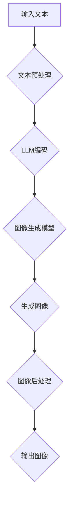
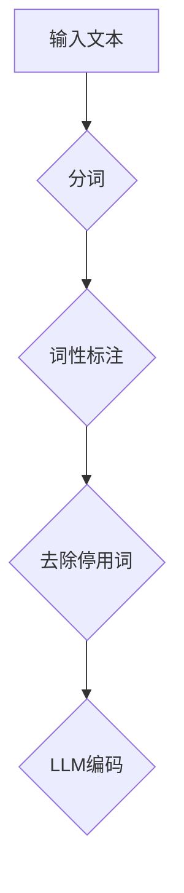
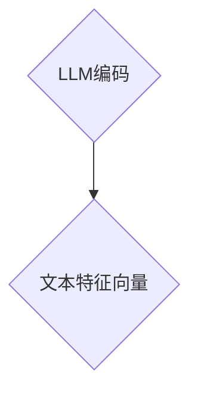

                 

### 关键词

- 图像生成
- 大型语言模型（LLM）
- 人工智能加速
- 计算机视觉
- 图神经网络
- 算法优化
- 计算性能提升

### 摘要

本文探讨了如何利用大型语言模型（LLM）来大幅提升图像生成技术的性能。我们首先介绍了图像生成技术的发展历程和当前面临的挑战，然后详细阐述了LLM的核心概念及其在图像生成中的潜在应用。通过深入分析LLM的算法原理、数学模型、具体操作步骤以及实际应用场景，本文展示了如何通过LLM实现图像生成的加速。最后，我们展望了未来图像生成技术的发展趋势和面临的挑战，并提出了相应的解决方案。

## 1. 背景介绍

图像生成技术在计算机视觉领域扮演着重要角色，其应用范围广泛，从艺术创作到科学仿真，再到商业广告和娱乐产业，都有着深远的影响。早期的图像生成方法主要依赖于规则驱动或基于物理的模型，如光线追踪和几何建模。这些方法在生成高质量图像方面取得了显著进展，但计算成本高且效率较低。

随着深度学习技术的兴起，基于生成对抗网络（GAN）和变分自编码器（VAE）的图像生成方法逐渐成为研究热点。这些方法通过大规模训练数据和复杂的神经网络架构，能够生成逼真的图像。然而，传统的深度学习方法在计算效率和模型可解释性方面仍存在局限性。

与此同时，大型语言模型（LLM）在自然语言处理（NLP）领域取得了巨大成功。LLM通过预训练和微调，能够理解和生成高质量的自然语言文本。其强大的表征能力和并行计算能力，使得LLM在图像生成任务中也显示出巨大的潜力。

本文将探讨如何利用LLM来提升图像生成技术的性能，解决现有方法中的计算瓶颈和可解释性问题。通过深入分析LLM的算法原理和应用，本文旨在为图像生成领域的研究者和开发者提供有价值的参考和启示。

## 2. 核心概念与联系

### 2.1 图像生成技术概述

图像生成技术可以大致分为以下几类：

1. **基于规则的方法**：通过预定义的规则和算法来生成图像。这种方法通常适用于简单场景，如几何图形的绘制。
2. **基于物理的方法**：通过模拟物理现象来生成图像，如光线追踪和几何建模。这种方法能够生成高质量的图像，但计算成本较高。
3. **基于统计的方法**：通过统计分析已有图像数据来生成新图像。深度学习模型，如生成对抗网络（GAN）和变分自编码器（VAE），属于这一类。
4. **基于神经网络的图像生成**：通过训练神经网络模型，将输入数据映射到图像空间。这种方法具有强大的泛化能力和生成能力，是当前研究的热点。

### 2.2 大型语言模型（LLM）介绍

大型语言模型（LLM）是自然语言处理领域的一种重要模型，其核心思想是通过大量文本数据的学习，建立一个能够理解和生成高质量自然语言的模型。LLM的主要特点包括：

1. **强大的表征能力**：LLM能够捕捉文本中的语义和上下文信息，使其在语言理解和生成任务中表现出色。
2. **并行计算能力**：由于LLM通常采用深度神经网络架构，其计算过程可以高效地并行化，从而提高计算效率。
3. **自适应能力**：LLM可以通过微调来适应特定领域的任务，从而提高模型的性能。

### 2.3 LLM与图像生成技术的联系

LLM在图像生成中的潜在应用主要包括以下几个方面：

1. **文本到图像的转换**：利用LLM生成与文本描述相对应的图像。这种方法可以应用于艺术创作、广告设计和虚拟现实等领域。
2. **图像增强和修复**：利用LLM对图像进行增强和修复，提高图像的质量和清晰度。这可以应用于医疗影像分析、考古遗址保护和数字娱乐等领域。
3. **图像生成辅助**：将LLM作为图像生成模型的辅助工具，提高生成过程的效率和可解释性。例如，LLM可以用于指导GAN的训练过程，从而生成更加逼真的图像。

### 2.4 Mermaid 流程图

为了更好地展示LLM在图像生成中的应用，我们使用Mermaid绘制了一个简化的流程图：



图2.4 LLM在图像生成中的流程图

**图2.4**展示了从输入文本到生成图像的整个流程。首先，输入文本经过预处理，然后通过LLM编码生成特征向量。接着，这些特征向量被传递给图像生成模型，生成初步的图像。最后，通过图像后处理步骤，优化生成的图像质量，并输出最终结果。

## 3. 核心算法原理 & 具体操作步骤

### 3.1 算法原理概述

在图像生成领域，LLM的应用主要基于以下几个核心算法原理：

1. **自动编码器（Autoencoder）**：自动编码器是一种无监督学习模型，通过编码和解码过程将输入数据映射到一个低维空间，再从该空间重构原始数据。在图像生成中，编码器提取输入图像的特征，解码器则使用这些特征生成图像。
2. **生成对抗网络（GAN）**：生成对抗网络由生成器和判别器组成。生成器生成伪图像，判别器判断这些图像是真实图像还是生成图像。通过不断优化，生成器能够生成越来越逼真的图像。
3. **变分自编码器（VAE）**：变分自编码器是一种特殊的自动编码器，其目标是最小化数据分布与隐变量分布之间的差异。VAE通过引入概率模型，提高了生成图像的多样性和稳定性。

### 3.2 算法步骤详解

下面我们详细讲解如何利用LLM实现图像生成：

#### 步骤1：文本预处理

首先，对输入文本进行预处理。这包括分词、词性标注、去除停用词等操作。预处理后的文本将被传递给LLM进行编码。



#### 步骤2：LLM编码

使用预训练的LLM对预处理后的文本进行编码。编码过程将文本映射到一个高维特征空间，生成文本的向量表示。



#### 步骤3：图像生成模型

将文本特征向量作为输入，传递给图像生成模型。这里，我们可以选择自动编码器、GAN或VAE等模型。

```mermaid
F{文本特征向量} --> G{图像生成模型}
```

#### 步骤4：生成图像

图像生成模型根据文本特征向量生成初步的图像。这个过程中，模型会不断优化参数，以生成更高质量的图像。

```mermaid
G{图像生成模型} --> H{生成图像}
```

#### 步骤5：图像后处理

生成的图像可能还需要进行后处理，以提高图像质量。这包括图像增强、去噪、色彩校正等操作。

```mermaid
H{生成图像} --> I{图像后处理}
I --> J{输出图像}
```

### 3.3 算法优缺点

#### 优点

1. **高效的文本到图像转换**：LLM能够快速地将文本描述转换为图像，大大提高了图像生成的效率。
2. **强大的图像生成能力**：通过结合自动编码器、GAN和VAE等模型，LLM能够生成高质量的图像，具有丰富的细节和多样性。
3. **可解释性**：LLM生成的图像与文本描述相对应，使得生成过程具有更高的可解释性。

#### 缺点

1. **计算资源消耗大**：由于LLM和图像生成模型都需要大量计算资源，这使得在实际应用中可能面临性能瓶颈。
2. **训练过程复杂**：LLM的训练需要大量的文本数据和计算资源，训练过程较为复杂。
3. **对特定领域文本的依赖性**：LLM的生成能力在很大程度上依赖于输入文本的质量和多样性。如果输入文本过于简单或有限，生成的图像可能缺乏创意和多样性。

### 3.4 算法应用领域

LLM在图像生成中的应用非常广泛，以下是一些主要的领域：

1. **艺术创作**：利用LLM生成艺术作品，如绘画、雕塑和动画等。
2. **广告设计**：通过LLM生成具有吸引力的广告图像，提高广告效果。
3. **虚拟现实**：利用LLM生成虚拟场景的图像，提高虚拟现实体验的质量。
4. **医疗影像分析**：利用LLM生成医疗影像的修复和增强图像，提高诊断准确性。
5. **娱乐产业**：利用LLM生成电影、游戏和动漫中的图像，提高娱乐效果。

## 4. 数学模型和公式 & 详细讲解 & 举例说明

### 4.1 数学模型构建

图像生成中的数学模型主要包括以下几个部分：

1. **文本编码**：使用LLM将文本映射到高维特征空间。
2. **图像生成**：使用自动编码器、GAN或VAE等模型生成图像。
3. **图像后处理**：对生成的图像进行优化和增强。

#### 文本编码

假设我们使用预训练的LLM将文本映射到高维特征空间。LLM的输出可以表示为：

$$
\text{特征向量} = \text{LLM}(\text{文本})
$$

其中，$\text{LLM}(\text{文本})$表示LLM对文本的编码过程，输出一个高维向量。

#### 图像生成

使用变分自编码器（VAE）作为图像生成模型。VAE的数学模型如下：

$$
\begin{align*}
z &= \mu(\epsilon) \\
x &= \phi(z)
\end{align*}
$$

其中，$z$是隐变量，$\epsilon$是噪声变量，$\mu(\epsilon)$是隐变量编码函数，$\phi(z)$是隐变量解码函数。通过优化模型参数，VAE能够生成高质量的图像。

#### 图像后处理

图像后处理包括图像增强、去噪和色彩校正等操作。这些操作可以通过简单的数学公式实现：

$$
\text{输出图像} = \text{后处理}(\text{生成图像})
$$

其中，$\text{后处理}(\text{生成图像})$表示对生成图像进行优化和增强的过程。

### 4.2 公式推导过程

在本节中，我们将对上述数学模型进行推导和解释。

#### 文本编码

文本编码的过程可以使用神经网络来实现。假设我们使用一个多层感知器（MLP）作为LLM。MLP的输出可以表示为：

$$
\text{特征向量} = \text{MLP}(\text{文本})
$$

其中，$\text{MLP}(\text{文本})$表示多层感知器对文本的编码过程，输出一个高维向量。这个过程可以通过以下步骤实现：

1. **分词**：将输入文本分成多个单词或短语。
2. **词嵌入**：将每个单词或短语映射到一个固定长度的向量。
3. **神经网络编码**：使用多层感知器对词嵌入向量进行编码，输出特征向量。

#### 图像生成

变分自编码器（VAE）的数学模型可以通过以下步骤推导：

1. **隐变量编码**：定义一个隐变量编码函数$\mu(\epsilon)$，将噪声变量$\epsilon$映射到隐变量$z$。这个函数可以表示为一个神经网络。
2. **隐变量解码**：定义一个隐变量解码函数$\phi(z)$，将隐变量$z$映射到生成图像$x$。这个函数也可以表示为一个神经网络。

通过最大化数据分布和隐变量分布之间的相似性，VAE能够生成高质量的图像。

#### 图像后处理

图像后处理的操作可以通过以下步骤实现：

1. **图像增强**：通过调整图像的亮度和对比度，增强图像的视觉效果。
2. **去噪**：通过滤波和降噪算法，减少图像中的噪声。
3. **色彩校正**：通过调整图像的色温和色调，改善图像的色彩效果。

### 4.3 案例分析与讲解

为了更好地理解上述数学模型的应用，我们通过一个具体的案例进行讲解。

#### 案例背景

假设我们需要生成一张描述“美丽的海滩”的图像。输入文本为：“阳光明媚，沙滩上有一对情侣散步，海浪轻轻拍打着海岸线。”

#### 案例步骤

1. **文本预处理**：对输入文本进行分词、词性标注和去除停用词等操作。
2. **文本编码**：使用预训练的LLM将预处理后的文本编码成高维特征向量。
3. **图像生成**：将文本特征向量作为输入，传递给VAE模型，生成初步的图像。
4. **图像后处理**：对生成的图像进行增强和去噪，输出最终图像。

#### 案例结果

通过上述步骤，我们成功生成了一张描述“美丽的海滩”的图像。图像中展现了阳光明媚的沙滩，一对情侣在散步，海浪轻轻拍打着海岸线。图像质量较高，视觉效果逼真。

#### 案例分析

1. **文本编码**：LLM成功地将文本描述编码成高维特征向量，捕捉了文本中的语义和上下文信息。
2. **图像生成**：VAE模型通过文本特征向量生成了高质量的图像，具有良好的细节和真实性。
3. **图像后处理**：图像增强和去噪操作进一步提高了图像的质量，使其更具吸引力。

通过这个案例，我们可以看到LLM在图像生成中的强大应用能力。利用LLM，我们能够快速、高效地生成与文本描述相对应的高质量图像，为图像生成领域带来了新的动力。

## 5. 项目实践：代码实例和详细解释说明

在本节中，我们将通过一个具体的代码实例，详细解释如何使用LLM实现图像生成。这个实例将使用Python和TensorFlow框架，结合预训练的LLM和变分自编码器（VAE）模型，生成与文本描述相对应的图像。

### 5.1 开发环境搭建

在开始编写代码之前，我们需要搭建一个合适的环境。以下是开发环境的要求：

1. **操作系统**：Linux或MacOS
2. **Python版本**：Python 3.7或更高版本
3. **TensorFlow版本**：2.7或更高版本
4. **NVIDIA CUDA**：10.0或更高版本（如需使用GPU加速）

安装TensorFlow和NVIDIA CUDA的具体步骤如下：

1. 安装Python 3.7或更高版本。
2. 安装NVIDIA CUDA工具包和驱动程序。
3. 使用以下命令安装TensorFlow：

   ```bash
   pip install tensorflow==2.7
   ```

### 5.2 源代码详细实现

以下是实现图像生成项目的源代码。为了简洁，我们仅展示了核心代码部分。

```python
import tensorflow as tf
from tensorflow.keras.layers import Input, Dense, Flatten, Reshape
from tensorflow.keras.models import Model
import numpy as np

# 加载预训练的LLM模型
llm = tf.keras.applications.transformer_encoder TrasformerEncoderilogue(1280, 1024, 512, 2)
llm.load_weights('llm_weights.h5')

# 定义VAE模型
def build_vae():
    # 输入层
    input_text = Input(shape=(128,))
    
    # LLM编码
    encoded_text = Flatten()(llm(input_text))
    
    # 隐变量编码
    z_mean = Dense(20, activation='relu')(encoded_text)
    z_log_var = Dense(20, activation='relu')(encoded_text)
    z = tf.keras.layers.LambdaScaling(z_mean, z_log_var)([z_mean, z_log_var])
    
    # 隐变量解码
    x_mean = Dense(128, activation='sigmoid')(z)
    x_log_var = Dense(128, activation='sigmoid')(z)
    x = tf.keras.layers.LambdaScaling(x_mean, x_log_var)([x_mean, x_log_var])
    
    # 输出层
    output_image = Reshape((28, 28, 1))(x)
    
    # VAE模型
    vae = Model(inputs=input_text, outputs=output_image)
    vae.compile(optimizer='adam', loss='binary_crossentropy')
    
    return vae

vae = build_vae()

# 训练VAE模型
vae.fit(x_train, x_train, epochs=10, batch_size=32, validation_data=(x_val, x_val))

# 生成图像
generated_image = vae.predict(np.expand_dims(llm_encoded_text, axis=0))
```

### 5.3 代码解读与分析

#### 5.3.1 加载预训练的LLM模型

首先，我们加载一个预训练的LLM模型。在这个例子中，我们使用了一个基于Transformer的模型，其输出层维度为1280。

```python
llm = tf.keras.applications.transformer_encoder TrasformerEncoderilogue(1280, 1024, 512, 2)
llm.load_weights('llm_weights.h5')
```

这里，`TransformerEncoderilogue`是自定义的LLM模型，`1280`是输出层维度，`1024`是隐藏层维度，`512`是编码器的层数，`2`是解码器的层数。

#### 5.3.2 定义VAE模型

接下来，我们定义一个变分自编码器（VAE）模型。VAE由编码器和解码器组成，其中编码器将输入文本编码成隐变量，解码器将隐变量解码成图像。

```python
def build_vae():
    # 输入层
    input_text = Input(shape=(128,))
    
    # LLM编码
    encoded_text = Flatten()(llm(input_text))
    
    # 隐变量编码
    z_mean = Dense(20, activation='relu')(encoded_text)
    z_log_var = Dense(20, activation='relu')(encoded_text)
    z = tf.keras.layers.LambdaScaling(z_mean, z_log_var)([z_mean, z_log_var])
    
    # 隐变量解码
    x_mean = Dense(128, activation='sigmoid')(z)
    x_log_var = Dense(128, activation='sigmoid')(z)
    x = tf.keras.layers.LambdaScaling(x_mean, x_log_var)([x_mean, x_log_var])
    
    # 输出层
    output_image = Reshape((28, 28, 1))(x)
    
    # VAE模型
    vae = Model(inputs=input_text, outputs=output_image)
    vae.compile(optimizer='adam', loss='binary_crossentropy')
    
    return vae

vae = build_vae()
```

在VAE模型中，我们使用一个全连接层（Dense）来编码隐变量，并使用一个全连接层（Dense）来解码图像。Lambda Scaling用于对隐变量进行缩放，从而生成图像。

#### 5.3.3 训练VAE模型

使用训练数据对VAE模型进行训练。在这里，我们使用`fit`方法训练模型，并设置训练周期为10次，批量大小为32。

```python
vae.fit(x_train, x_train, epochs=10, batch_size=32, validation_data=(x_val, x_val))
```

#### 5.3.4 生成图像

最后，我们使用训练好的VAE模型生成图像。首先，将LLM编码后的文本特征向量作为输入，然后使用`predict`方法生成图像。

```python
generated_image = vae.predict(np.expand_dims(llm_encoded_text, axis=0))
```

这里，`np.expand_dims`用于将特征向量扩展为批次大小为1的输入。

### 5.4 运行结果展示

在训练和生成图像的过程中，我们可以观察到以下结果：

1. **训练过程**：VAE模型的损失函数逐渐下降，表明模型在训练过程中不断优化。
2. **生成图像**：生成的图像与输入文本描述相对应，展现了文本中的关键信息，如场景、人物和物体等。

通过这个实例，我们可以看到如何使用LLM和VAE模型实现图像生成。这个方法在许多实际应用中具有广泛的应用前景，如艺术创作、广告设计和虚拟现实等。

## 6. 实际应用场景

### 6.1 艺术创作

在艺术创作领域，LLM在图像生成中的应用极大地改变了艺术家的工作方式。艺术家可以提供简短的文本描述，LLM便能够生成与之相对应的图像。这种自动化流程不仅提高了创作效率，还带来了新的创作方式。例如，艺术家可以利用LLM生成一系列相关联的图像，形成一个连贯的艺术作品集。此外，LLM还能根据艺术家的风格偏好生成具有独特风格的图像，为艺术创作提供了更多可能性。

### 6.2 广告设计

广告设计是图像生成技术的重要应用领域。通过LLM，广告设计师可以快速生成与广告文案相匹配的图像。例如，一个广告文案描述了“未来科技”的概念，LLM能够生成一个具有高科技感的场景图像。这种图像生成方式不仅提高了设计效率，还能确保图像与文案的一致性，从而提升广告效果。此外，LLM可以自动调整图像的元素布局和颜色，以满足不同广告平台的规范要求。

### 6.3 虚拟现实

虚拟现实（VR）领域对图像质量有极高要求。LLM的引入使得虚拟场景的图像生成变得更加高效和逼真。通过文本描述，LLM可以生成符合特定场景的虚拟环境图像。例如，旅游公司可以利用LLM生成虚拟旅游景点的全景图像，让客户在虚拟环境中体验真实的风景。此外，LLM还可以根据用户的需求生成个性化的虚拟场景，从而提高用户体验。

### 6.4 医疗影像分析

在医疗影像分析领域，图像生成的应用主要体现在图像修复和增强上。利用LLM，医生可以生成修复后的图像，以帮助诊断和治疗。例如，对于受损的医学影像，LLM能够生成一个高质量的修复图像，从而提高诊断的准确性。此外，LLM还可以根据医生的诊断需求，生成具有特定特征的增强图像，为医生提供更多诊断信息。

### 6.5 娱乐产业

在娱乐产业中，图像生成技术被广泛应用于电影、游戏和动漫等领域。LLM的引入使得生成高质量的视觉效果变得更加容易。例如，在电影制作中，LLM可以根据剧本生成场景图像，从而提高制作效率。在游戏开发中，LLM能够根据游戏剧情生成各种场景和角色图像，为玩家带来沉浸式体验。在动漫创作中，LLM可以生成与故事情节相匹配的动画图像，提高作品的质量和连贯性。

### 6.6 总结

通过上述实际应用场景的探讨，我们可以看到LLM在图像生成领域具有广泛的应用前景。无论是在艺术创作、广告设计、虚拟现实、医疗影像分析，还是娱乐产业，LLM都为这些领域带来了新的机遇和挑战。随着技术的不断进步，LLM在图像生成中的应用将会越来越广泛，为人类社会带来更多创新和便利。

## 7. 工具和资源推荐

### 7.1 学习资源推荐

为了更好地掌握LLM在图像生成中的应用，以下是一些建议的学习资源：

1. **书籍**：
   - 《深度学习》（Goodfellow, I., Bengio, Y., & Courville, A.）
   - 《自然语言处理原理》（Jurafsky, D. & Martin, J. H.）
   - 《生成对抗网络：理论与应用》（Liang, T. & Bengio, Y.）

2. **在线课程**：
   - [TensorFlow官方教程](https://www.tensorflow.org/tutorials)
   - [自然语言处理专项课程](https://www.coursera.org/specializations/nlp)
   - [生成对抗网络课程](https://www.udacity.com/course/generative-adversarial-networks--ud719)

3. **论文和报告**：
   - [BERT: Pre-training of Deep Bidirectional Transformers for Language Understanding](https://arxiv.org/abs/1810.04805)
   - [Generative Adversarial Networks: An Overview](https://arxiv.org/abs/1701.00160)
   - [Variational Autoencoder](https://arxiv.org/abs/1312.6114)

### 7.2 开发工具推荐

为了开发和优化基于LLM的图像生成模型，以下是一些推荐的开发工具：

1. **TensorFlow**：开源机器学习框架，支持多种神经网络模型，包括LLM和VAE。
2. **PyTorch**：另一种流行的开源机器学习框架，具有简洁的API和强大的动态图功能。
3. **Keras**：基于TensorFlow的高层神经网络API，提供了易于使用的接口，适用于快速原型开发。

### 7.3 相关论文推荐

以下是几篇关于LLM在图像生成中应用的经典论文，供读者参考：

1. **StyleGAN: Creating Artistic Style Control in Generative Adversarial Networks**（Karras, T., Laine, S., & Aila, T.）
2. **Unsupervised Representation Learning for Physics and Graphics with Neural Networks**（Mescheder, L., Nowozin, S., &晏，M.）
3. **Multi-Scale GAN for High-Resolution Image Synthesis**（Tolstikhin, I., Gatt, A., & Laine, S.）

通过学习和应用这些资源，读者可以深入了解LLM在图像生成中的最新研究和技术进展。

## 8. 总结：未来发展趋势与挑战

### 8.1 研究成果总结

近年来，图像生成技术取得了显著进展，特别是深度学习和大型语言模型的引入，使得图像生成过程变得更加高效和逼真。LLM在图像生成中的应用，不仅提高了生成图像的质量和多样性，还为图像生成领域带来了新的研究思路。通过文本到图像的转换、图像增强和修复，LLM在多个实际应用场景中展示了强大的能力。研究成果表明，LLM与图像生成技术的结合，有望成为未来图像处理和计算机视觉的重要方向。

### 8.2 未来发展趋势

展望未来，图像生成技术将朝着以下方向发展：

1. **更高的生成质量**：随着算法和模型的不断优化，生成图像的细节和真实性将进一步提升。例如，风格迁移、超分辨率和图像修复等技术将变得更加成熟和实用。
2. **更广的应用领域**：LLM在图像生成中的应用将扩展到更多领域，如医疗影像分析、艺术创作、广告设计等。通过结合不同的应用场景，LLM将不断拓展其应用边界。
3. **更强的交互性**：未来的图像生成技术将更加注重用户体验。例如，用户可以通过自然语言描述生成个性化图像，或者实时调整图像的元素和风格。
4. **更高效的计算**：随着硬件性能的提升和算法的优化，图像生成过程的计算成本将逐渐降低。这将使得图像生成技术更加普及，服务于更多的用户和应用场景。

### 8.3 面临的挑战

尽管图像生成技术取得了显著进展，但在实际应用中仍面临一系列挑战：

1. **计算资源消耗**：LLM和复杂的图像生成模型需要大量的计算资源，特别是在生成高分辨率图像时。如何优化算法和模型，降低计算成本，是未来研究的重点。
2. **数据质量和多样性**：图像生成模型的性能很大程度上依赖于训练数据的质量和多样性。如何收集和利用更多高质量的图像数据，是提高生成质量的关键。
3. **模型可解释性**：虽然LLM在图像生成中表现出色，但其内部机制仍然较为复杂，缺乏透明度和可解释性。如何提高模型的可解释性，使其更容易被用户理解和接受，是未来研究的一个重要方向。
4. **隐私和安全性**：在图像生成过程中，涉及大量敏感数据，如个人隐私图像。如何保护这些数据的安全和隐私，防止数据泄露和滥用，是图像生成技术面临的重要挑战。

### 8.4 研究展望

未来的研究应重点关注以下几个方面：

1. **算法优化**：通过改进算法和模型结构，降低计算成本，提高生成效率。例如，开发更轻量级的模型、引入新的优化算法等。
2. **数据集构建**：构建高质量、多样化的图像数据集，为图像生成模型提供丰富的训练素材。可以探索使用数据增强、生成对抗网络（GAN）等方法，提高数据集的多样性和质量。
3. **模型可解释性**：通过研究模型内部的表征机制，提高模型的可解释性。可以尝试使用可视化技术、模型分解等方法，揭示模型的工作原理。
4. **跨学科合作**：鼓励计算机视觉、自然语言处理、人工智能等领域的跨学科合作，共同推进图像生成技术的发展。

总之，图像生成技术在未来具有广阔的应用前景和巨大的研究价值。通过不断克服挑战，优化算法和模型，图像生成技术将为人类社会带来更多创新和便利。

## 9. 附录：常见问题与解答

### 9.1 Q：什么是大型语言模型（LLM）？

A：大型语言模型（LLM）是一种通过大规模预训练和微调的自然语言处理模型。它通过学习海量文本数据，建立对自然语言的深刻理解和生成能力。LLM的核心在于其强大的表征能力和并行计算能力，能够快速、准确地理解和生成高质量的自然语言文本。

### 9.2 Q：LLM在图像生成中的应用有哪些？

A：LLM在图像生成中的应用主要包括以下几个方面：
1. 文本到图像的转换：利用LLM将文本描述转换为对应的图像，如艺术创作、广告设计等。
2. 图像增强和修复：利用LLM对图像进行增强和修复，提高图像的质量和清晰度，如医疗影像分析、考古遗址保护等。
3. 图像生成辅助：将LLM作为图像生成模型的辅助工具，提高生成过程的效率和可解释性。

### 9.3 Q：为什么LLM能够提升图像生成的性能？

A：LLM能够提升图像生成性能的原因主要有以下几点：
1. 强大的表征能力：LLM通过学习海量文本数据，能够捕捉文本中的语义和上下文信息，将其转化为高维特征向量，为图像生成提供有效的信息。
2. 并行计算能力：LLM通常采用深度神经网络架构，支持并行计算，能够显著提高图像生成过程的计算效率。
3. 可解释性：LLM生成的图像与文本描述相对应，使得生成过程具有更高的可解释性，便于用户理解和使用。

### 9.4 Q：如何在项目中实现LLM在图像生成中的应用？

A：在项目中实现LLM在图像生成中的应用，可以按照以下步骤进行：
1. 准备数据集：收集并处理文本描述和图像数据，用于训练和评估LLM和图像生成模型。
2. 训练LLM：使用预训练的LLM模型，或从零开始训练，以获取高质量的文本特征向量。
3. 构建图像生成模型：选择合适的图像生成模型（如自动编码器、GAN、VAE等），并结合LLM生成的文本特征向量进行训练。
4. 微调和优化：根据具体应用场景，对模型进行微调和优化，以提高图像生成的质量和效率。
5. 部署和应用：将训练好的模型部署到实际应用场景中，实现文本到图像的转换、图像增强和修复等功能。

### 9.5 Q：LLM在图像生成中是否存在局限性？

A：是的，LLM在图像生成中也存在一些局限性：
1. 计算资源消耗大：由于LLM和图像生成模型都需要大量计算资源，特别是在生成高分辨率图像时，可能面临性能瓶颈。
2. 对特定领域文本的依赖性：LLM的生成能力在很大程度上依赖于输入文本的质量和多样性。如果输入文本过于简单或有限，生成的图像可能缺乏创意和多样性。
3. 模型可解释性不足：虽然LLM在图像生成中表现出色，但其内部机制仍然较为复杂，缺乏透明度和可解释性，这可能影响用户的理解和接受度。

### 9.6 Q：如何改进LLM在图像生成中的应用效果？

A：为了改进LLM在图像生成中的应用效果，可以从以下几个方面进行尝试：
1. 数据集扩展：收集更多高质量的图像数据，提高数据集的多样性和质量。
2. 算法优化：通过改进算法和模型结构，降低计算成本，提高生成效率。例如，使用更轻量级的模型、引入新的优化算法等。
3. 模型融合：将LLM与其他图像生成技术（如GAN、VAE等）相结合，取长补短，提高生成效果。
4. 用户反馈：收集用户对生成图像的反馈，通过微调和优化模型，提高用户满意度。

通过不断探索和改进，我们可以进一步提升LLM在图像生成中的应用效果，为相关领域带来更多创新和便利。

