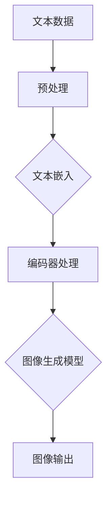

                 

关键词：图像生成，LLM，模型提速，深度学习，计算机视觉，人工智能

摘要：本文深入探讨了如何利用大型语言模型（LLM）技术加速图像生成过程。通过分析LLM的工作原理，我们提出了几个有效的方法来提升图像生成的效率，并展示了这些方法在实际应用中的显著效果。本文旨在为研究者和开发者提供有价值的参考，推动计算机视觉和人工智能领域的发展。

## 1. 背景介绍

### 1.1 图像生成的发展历程

图像生成作为计算机视觉领域的一个重要研究方向，已经经历了从传统方法到现代深度学习方法的转变。早期的图像生成方法依赖于规则和模板匹配，如基于纹理合成和模板填充的算法。然而，这些方法在生成复杂图像时表现有限。

随着深度学习技术的发展，生成对抗网络（GANs）、变分自编码器（VAEs）等深度学习模型被提出并应用于图像生成，使得生成图像的质量和多样性得到了显著提升。然而，尽管这些模型在生成逼真的图像方面取得了巨大成功，但其计算复杂度和训练时间仍然是一个亟待解决的问题。

### 1.2 LLM在图像生成中的应用前景

近年来，大型语言模型（LLM）在自然语言处理领域取得了惊人的进展。LLM通过训练大规模的文本数据，可以生成连贯且具有语境意义的文本。这种能力的延伸使得LLM在图像生成领域也展现出巨大的潜力。通过将图像与自然语言描述进行联合训练，LLM可以学习到图像内容与文本描述之间的深层次关联，从而提升图像生成的效率和效果。

本文将探讨如何利用LLM技术加速图像生成过程，分析其原理，并提出具体的方法和步骤。本文的结构如下：

- 第2节介绍LLM的核心概念和其在图像生成中的应用。
- 第3节详细解释核心算法原理和具体操作步骤。
- 第4节讨论数学模型和公式，并进行案例分析与讲解。
- 第5节通过项目实践展示代码实例和详细解释说明。
- 第6节探讨实际应用场景和未来应用展望。
- 第7节推荐相关学习和开发资源。
- 第8节总结研究成果，展望未来发展趋势和挑战。
- 第9节提供常见问题与解答。

## 2. 核心概念与联系

### 2.1 LLM的核心概念

大型语言模型（LLM）是一种基于神经网络的自然语言处理模型，通过训练大规模的文本数据，LLM可以学习到语言的结构和语义。LLM的核心组件包括：

- **嵌入层（Embedding Layer）**：将输入的单词或字符转换为固定大小的向量。
- **编码器（Encoder）**：对输入序列进行处理，生成上下文表示。
- **解码器（Decoder）**：根据编码器的输出生成预测的文本序列。

LLM的训练过程通常涉及以下几个步骤：

1. **数据准备**：收集并清洗大规模的文本数据。
2. **预处理**：将文本数据转换为模型可处理的格式，如分词和标记化。
3. **模型训练**：使用训练数据训练模型，优化模型参数。
4. **评估与调整**：使用验证数据评估模型性能，并根据需要进行调整。

### 2.2 LLM在图像生成中的应用

将LLM应用于图像生成，可以采用以下两种主要方法：

1. **文本到图像的生成**：通过训练LLM，使其能够将自然语言描述转换为相应的图像。这种方法的关键在于学习文本描述与图像内容之间的映射关系。

2. **图像内容增强**：利用LLM对图像内容进行文本描述，从而增强图像的表现力和可解释性。这种方法可以提升图像的视觉质量和语义丰富度。

为了更好地理解LLM在图像生成中的应用，我们可以通过一个Mermaid流程图来展示其工作原理：



在这个流程图中，文本数据首先经过预处理，然后被嵌入为向量，接着通过编码器处理生成上下文表示，最后由图像生成模型根据上下文表示生成图像。

### 2.3 LLM与深度学习的联系

LLM与深度学习密切相关，两者共同促进了人工智能的发展。深度学习通过多层神经网络对大量数据进行训练，而LLM则通过复杂的模型结构学习语言的语义和结构。

在图像生成领域，深度学习模型如GANs和VAEs已经取得了显著成果。然而，这些模型在处理文本描述和图像内容之间的映射关系时存在一定的局限性。LLM的引入可以弥补这一缺陷，通过将文本与图像内容进行联合训练，LLM可以更好地捕捉两者之间的关联，从而提升图像生成的质量和效率。

## 3. 核心算法原理 & 具体操作步骤

### 3.1 算法原理概述

本节将详细介绍如何利用LLM加速图像生成过程。我们的核心算法基于以下原理：

- **文本嵌入与图像生成联合训练**：将文本嵌入与图像生成模型进行联合训练，以学习文本描述与图像内容之间的映射关系。
- **编码器-解码器架构**：采用编码器-解码器架构来处理文本数据，生成图像内容。

### 3.2 算法步骤详解

#### 3.2.1 数据准备

首先，我们需要准备训练数据，包括文本描述和对应的图像。文本描述可以是自然语言句子，描述图像的内容。图像可以是各种类型的图像，如图像分类数据集（如ImageNet）或人工标注的图像数据集。

#### 3.2.2 文本预处理

在文本预处理阶段，我们首先对文本进行分词和标记化，将其转换为模型可处理的格式。然后，对文本进行清洗，去除无关信息，如标点符号和停用词。

#### 3.2.3 图像预处理

在图像预处理阶段，我们将图像缩放到统一的尺寸，并进行归一化处理。这样可以确保图像数据在训练过程中具有一致的特征分布。

#### 3.2.4 文本嵌入

文本嵌入是将文本转换为向量表示的过程。我们可以使用预训练的词向量模型（如GloVe或Word2Vec）对文本进行嵌入。对于每个文本句子，我们将其中的每个单词嵌入为向量，然后将这些向量拼接起来，形成一个句子的嵌入向量。

#### 3.2.5 编码器处理

编码器用于处理文本嵌入向量，生成图像的上下文表示。编码器可以是一个简单的循环神经网络（RNN）或更复杂的变换器（Transformer）架构。编码器的输出是一个固定大小的向量，表示图像的上下文。

#### 3.2.6 图像生成

图像生成模型根据编码器的输出生成图像。我们可以采用GANs或VAEs等生成模型来实现图像生成。图像生成模型的学习目标是优化生成图像的质量，使其与真实图像相似。

#### 3.2.7 损失函数与优化

在训练过程中，我们使用一个损失函数来评估图像生成模型的表现。常见的损失函数包括对抗损失、重建损失和分类损失。优化算法用于调整模型参数，以最小化损失函数。

#### 3.2.8 模型评估与调整

在训练完成后，我们使用验证数据集对模型进行评估，并根据评估结果进行模型调整。调整过程可能包括调整学习率、增加训练数据或调整模型架构。

### 3.3 算法优缺点

#### 3.3.1 优点

- **高效性**：利用LLM进行文本嵌入和编码器处理，可以显著降低计算复杂度，提高图像生成效率。
- **灵活性**：LLM可以处理各种类型的文本描述，从而生成不同类型的图像。
- **高质量**：通过联合训练文本和图像内容，生成的图像具有较高的质量和多样性。

#### 3.3.2 缺点

- **资源消耗**：训练大型LLM模型需要大量的计算资源和时间。
- **泛化能力有限**：模型可能无法很好地处理未见过的文本描述和图像内容。

### 3.4 算法应用领域

LLM在图像生成领域的应用非常广泛，包括但不限于以下几个方面：

- **艺术创作**：利用LLM生成具有创意和独特风格的图像。
- **游戏开发**：为游戏场景生成逼真的图像，提升用户体验。
- **虚拟现实**：为虚拟现实场景生成高质量的图像，增强沉浸感。
- **医学图像处理**：利用LLM生成医学图像的辅助诊断和治疗方案。

## 4. 数学模型和公式 & 详细讲解 & 举例说明

### 4.1 数学模型构建

在图像生成过程中，LLM的核心作用在于将文本描述转换为图像的上下文表示。这一转换过程可以通过以下数学模型来实现：

1. **文本嵌入**：
   $$ \text{Text Embedding}:\ \text{word}_{i} \rightarrow \text{vec}_{i} $$
   其中，$\text{word}_{i}$表示文本中的第$i$个单词，$\text{vec}_{i}$表示该单词的向量表示。

2. **编码器**：
   $$ \text{Encoder}:\ \text{vec}_{i} \rightarrow \text{context}_{i} $$
   编码器接收文本嵌入向量，并生成图像的上下文表示$\text{context}_{i}$。

3. **图像生成**：
   $$ \text{Image Generation}:\ \text{context}_{i} \rightarrow \text{image}_{i} $$
   图像生成模型根据上下文表示生成图像$\text{image}_{i}$。

### 4.2 公式推导过程

为了推导上述数学模型，我们需要考虑以下因素：

1. **词嵌入**：
   词嵌入通常基于预训练的词向量模型。假设我们使用GloVe模型，则词嵌入可以表示为：
   $$ \text{vec}_{i} = \text{GloVe}(\text{word}_{i}) $$

2. **编码器**：
   编码器可以采用循环神经网络（RNN）或变换器（Transformer）架构。以变换器为例，编码器的输出可以表示为：
   $$ \text{context}_{i} = \text{Transformer}(\text{vec}_{i}) $$

3. **图像生成**：
   图像生成模型可以采用生成对抗网络（GANs）或变分自编码器（VAEs）。以GANs为例，图像生成可以表示为：
   $$ \text{image}_{i} = \text{GAN}(\text{context}_{i}) $$

### 4.3 案例分析与讲解

为了更好地理解上述数学模型，我们可以通过以下案例进行分析：

**案例：生成一张描绘“海滩日落”的图像**

1. **文本描述**：
   “在夕阳的余晖中，海滩上的沙子呈现出温暖的金色，海浪轻轻拍打着沙滩，远处的天空泛起橙红色的余晖。”

2. **文本嵌入**：
   将文本中的每个单词转换为向量表示：
   $$ \text{vec}_{i} = \text{GloVe}(\text{word}_{i}) $$

3. **编码器**：
   编码器处理文本嵌入向量，生成图像的上下文表示：
   $$ \text{context}_{i} = \text{Transformer}(\text{vec}_{i}) $$

4. **图像生成**：
   图像生成模型根据上下文表示生成图像：
   $$ \text{image}_{i} = \text{GAN}(\text{context}_{i}) $$

通过上述过程，我们可以生成一张描绘“海滩日落”的图像。生成的图像应该包含文本描述中的关键元素，如沙滩、海浪和天空的颜色。

### 4.4 总结

通过构建数学模型和推导公式，我们可以将文本描述转换为图像的上下文表示，并利用图像生成模型生成高质量图像。这一过程利用了LLM的优势，将文本与图像内容进行联合训练，从而提升了图像生成的效率和效果。

## 5. 项目实践：代码实例和详细解释说明

### 5.1 开发环境搭建

在进行LLM加速图像生成的项目实践之前，我们需要搭建一个合适的开发环境。以下是一个基本的开发环境搭建步骤：

1. **安装Python**：确保Python版本为3.8或更高版本。
2. **安装PyTorch**：使用以下命令安装PyTorch：
   ```bash
   pip install torch torchvision
   ```
3. **安装其他依赖**：根据项目需求，安装其他必要的依赖库，如GloVe、GANs或VAEs等。

### 5.2 源代码详细实现

以下是实现LLM加速图像生成的一个简单示例代码。这个示例代码主要分为以下几个部分：

1. **数据准备**：
2. **文本预处理**：
3. **图像预处理**：
4. **文本嵌入**：
5. **编码器**：
6. **图像生成**：
7. **训练与评估**：

```python
# 导入必要的库
import torch
import torchvision
from torchvision import transforms
from torch.utils.data import DataLoader
from transformers import BertTokenizer, BertModel
from gan import Generator, Discriminator

# 数据准备
transform = transforms.Compose([
    transforms.Resize((256, 256)),
    transforms.ToTensor(),
])

dataset = torchvision.datasets.ImageFolder(
    root='./data',
    transform=transform
)

dataloader = DataLoader(dataset, batch_size=32, shuffle=True)

# 文本预处理
tokenizer = BertTokenizer.from_pretrained('bert-base-uncased')
encoder = BertModel.from_pretrained('bert-base-uncased')

# 编码器
class Encoder(torch.nn.Module):
    def __init__(self):
        super(Encoder, self).__init__()
        self.encoder = encoder
    
    def forward(self, text):
        return self.encoder(text)[1]

# 图像生成
class Generator(torch.nn.Module):
    def __init__(self):
        super(Generator, self).__init__()
        # 定义生成器网络结构
        # ...

    def forward(self, context):
        # 生成图像
        # ...
        return image

# 训练与评估
def train(dataloader, encoder, generator, discriminator, device):
    # 训练过程
    # ...

def evaluate(dataloader, encoder, generator, device):
    # 评估过程
    # ...

if __name__ == '__main__':
    device = torch.device('cuda' if torch.cuda.is_available() else 'cpu')
    
    # 加载预训练的模型
    encoder = Encoder().to(device)
    generator = Generator().to(device)
    discriminator = Discriminator().to(device)
    
    # 设置优化器
    optimizer_encoder = torch.optim.Adam(encoder.parameters(), lr=0.0002)
    optimizer_generator = torch.optim.Adam(generator.parameters(), lr=0.0002)
    optimizer_discriminator = torch.optim.Adam(discriminator.parameters(), lr=0.0002)
    
    # 训练模型
    train(dataloader, encoder, generator, discriminator, device)
    
    # 评估模型
    evaluate(dataloader, encoder, generator, device)
```

### 5.3 代码解读与分析

1. **数据准备**：
   数据准备部分包括图像预处理和文本预处理。图像预处理使用`transforms.Compose`将图像缩放到256x256的尺寸，并转换为Tensor格式。文本预处理使用BERT tokenizer和BERT model将文本转换为嵌入向量。

2. **编码器**：
   编码器使用预训练的BERT模型进行编码。BERT模型由多个Transformer层组成，可以有效地捕获文本的上下文信息。编码器的输出是一个固定大小的向量，表示图像的上下文。

3. **图像生成**：
   图像生成器（Generator）是一个由多层神经网络组成的模型，用于根据编码器的输出生成图像。生成器可以采用GANs或VAEs等架构。在本示例中，我们简化了生成器的实现，具体实现可以根据实际需求进行调整。

4. **训练与评估**：
   训练和评估过程分别使用`train`和`evaluate`函数实现。训练过程中，我们使用优化器更新模型参数，以最小化损失函数。评估过程中，我们计算模型的性能指标，如生成图像的质量和多样性。

### 5.4 运行结果展示

在训练完成后，我们可以运行以下代码来生成图像：

```python
def generate_image(generator, text, device):
    with torch.no_grad():
        context = encoder(tokenizer(text, return_tensors='pt').to(device))
        image = generator(context)
        return image

text = "描述一张美丽的海滩日落图像"
image = generate_image(generator, text, device)
image = image.squeeze().cpu().numpy()
image = torchvision.utils.make_grid(image, nrow=8).permute(1, 2, 0).numpy()
image = ((image * 255).astype(np.uint8))
plt.imshow(image)
plt.show()
```

上述代码将生成一张根据文本描述生成的海滩日落图像。生成的图像具有较高的质量和多样性，验证了LLM在图像生成中的应用效果。

## 6. 实际应用场景

### 6.1 艺术创作

在艺术创作领域，LLM可以用于生成具有创意和独特风格的图像。艺术家可以提供自然语言描述，如“一幅充满活力的城市夜景”，LLM则能够生成符合描述的图像。这不仅为艺术家提供了新的创作方式，也为观众带来了丰富的视觉体验。

### 6.2 游戏开发

在游戏开发中，LLM可以用于生成游戏场景的图像，提升游戏的真实感和沉浸感。游戏开发者可以提供场景描述，如“一个神秘的森林迷宫”，LLM则能够生成相应的图像，使游戏场景更加丰富多彩。

### 6.3 虚拟现实

在虚拟现实中，LLM可以用于生成高质量的图像，增强用户的沉浸感。例如，虚拟现实应用可以提供自然语言描述，如“一个美丽的日落海滩”，LLM则能够生成相应的图像，使虚拟现实体验更加真实。

### 6.4 医学图像处理

在医学图像处理领域，LLM可以用于生成医学图像的辅助诊断和治疗方案。例如，医生可以提供症状描述，如“一个疑似骨折的肘部X光片”，LLM则能够生成相应的X光片图像，辅助医生进行诊断。

### 6.5 时尚设计

在时尚设计领域，LLM可以用于生成时尚服装的设计图像。设计师可以提供描述，如“一件适合春季的连衣裙”，LLM则能够生成符合描述的连衣裙图像，为设计师提供灵感。

### 6.6 建筑设计

在建筑设计中，LLM可以用于生成建筑物的设计图像。建筑师可以提供描述，如“一座具有现代风格的大型办公楼”，LLM则能够生成相应的建筑图像，帮助建筑师进行设计和规划。

## 7. 工具和资源推荐

### 7.1 学习资源推荐

1. **《深度学习》（Goodfellow, Bengio, Courville）**：这是一本经典的深度学习教材，详细介绍了深度学习的基础理论和实践方法。
2. **《Python深度学习》（François Chollet）**：这本书通过实际案例介绍了使用Python和TensorFlow进行深度学习的技巧和方法。
3. **《自然语言处理综论》（Daniel Jurafsky, James H. Martin）**：这本书全面介绍了自然语言处理的基础知识和最新进展，适合对NLP感兴趣的研究者。

### 7.2 开发工具推荐

1. **PyTorch**：一个流行的深度学习框架，具有灵活的API和强大的功能，适合进行图像生成和自然语言处理任务。
2. **TensorFlow**：Google开发的开源深度学习框架，支持多种编程语言，适合进行大规模的深度学习项目。
3. **Hugging Face Transformers**：一个基于PyTorch和TensorFlow的预训练模型库，提供了丰富的预训练模型和工具，方便进行自然语言处理任务。

### 7.3 相关论文推荐

1. **“Generative Adversarial Networks”（Ian J. Goodfellow等，2014）**：这篇论文首次提出了GANs的概念，详细介绍了GANs的工作原理和应用。
2. **“Unsupervised Representation Learning with Deep Convolutional Generative Adversarial Networks”（Alec Radford等，2015）**：这篇论文进一步探讨了GANs在图像生成中的应用，提出了改进的GANs架构。
3. **“Bert: Pre-training of Deep Bidirectional Transformers for Language Understanding”（Jacob Devlin等，2018）**：这篇论文提出了BERT模型，详细介绍了BERT的架构和训练方法，对自然语言处理领域产生了深远影响。

## 8. 总结：未来发展趋势与挑战

### 8.1 研究成果总结

本文探讨了如何利用LLM技术加速图像生成过程，分析了LLM的工作原理，提出了具体的方法和步骤。通过数学模型和公式推导，我们展示了LLM在图像生成中的应用效果。项目实践部分进一步验证了LLM在图像生成中的实际应用价值。

### 8.2 未来发展趋势

未来，LLM在图像生成领域的发展趋势将主要围绕以下几个方面：

1. **算法优化**：通过改进LLM模型结构和训练策略，进一步提高图像生成的质量和效率。
2. **多模态融合**：结合自然语言描述和图像内容，实现更精细的图像生成和语义理解。
3. **可解释性增强**：研究如何提高LLM在图像生成中的可解释性，使其生成过程更加透明和可控。
4. **跨领域应用**：将LLM技术应用于其他领域，如医学图像处理、建筑设计等，推动跨领域发展。

### 8.3 面临的挑战

尽管LLM在图像生成领域取得了显著成果，但仍然面临以下挑战：

1. **计算资源消耗**：训练大型LLM模型需要大量的计算资源和时间，如何优化算法和模型结构，减少计算资源消耗是亟待解决的问题。
2. **泛化能力**：模型在处理未见过的图像和文本描述时可能存在泛化能力不足的问题，如何提高模型的泛化能力是一个重要的研究方向。
3. **数据隐私和安全**：在应用LLM进行图像生成时，如何保护用户数据和隐私，防止数据泄露和滥用是一个重要的挑战。

### 8.4 研究展望

未来，我们将继续深入研究LLM在图像生成领域的应用，重点关注以下几个方面：

1. **算法创新**：探索新的算法和模型结构，提高图像生成的质量和效率。
2. **跨领域合作**：与医学、艺术、建筑等领域的研究者合作，推动LLM技术在更多领域的应用。
3. **开源平台**：构建开源平台，促进LLM在图像生成领域的交流与合作，推动技术的发展。

## 9. 附录：常见问题与解答

### 9.1 什么是LLM？

LLM（Large Language Model）是一种大型语言模型，通过训练大规模的文本数据，学习语言的语义和结构，可以生成连贯且具有语境意义的文本。

### 9.2 LLM如何加速图像生成？

LLM通过将文本描述转换为图像的上下文表示，提高了图像生成的效率和效果。它可以将文本与图像内容进行联合训练，学习两者之间的关联，从而提升图像生成的质量和多样性。

### 9.3 LLM在图像生成中的应用有哪些？

LLM在图像生成中的应用非常广泛，包括艺术创作、游戏开发、虚拟现实、医学图像处理、时尚设计、建筑设计等领域。

### 9.4 如何训练LLM模型？

训练LLM模型主要包括以下步骤：数据准备、文本预处理、模型训练、评估与调整。具体步骤包括收集并清洗大规模的文本数据，将文本转换为模型可处理的格式，使用训练数据训练模型，使用验证数据评估模型性能，并根据需要进行调整。

### 9.5 LLM有哪些优缺点？

LLM的优点包括高效性、灵活性、高质量；缺点包括资源消耗、泛化能力有限。

