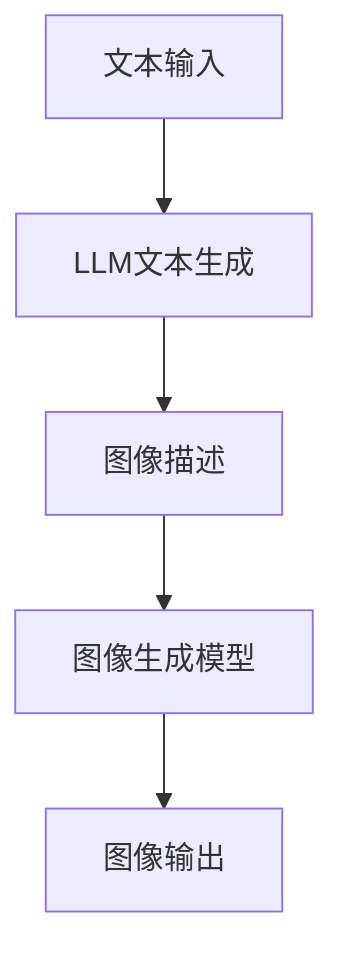

                 

  
> **关键词**：图像生成、LLM、提速、AI技术、计算机视觉

> **摘要**：本文将探讨如何通过最新的语言模型（LLM）技术来提升图像生成速度，从而在计算机视觉领域取得显著的性能提升。我们将深入分析LLM的工作原理，阐述其在图像生成中的优势，并通过实际案例展示其应用潜力。文章还将探讨未来发展趋势及面临的挑战，为读者提供全面的技术洞察。

## 1. 背景介绍

随着人工智能技术的快速发展，图像生成已经成为计算机视觉领域的一个重要研究方向。图像生成技术不仅有助于提高图像处理效率，还能在数据增强、虚拟现实、娱乐创作等方面发挥重要作用。然而，传统的图像生成方法往往面临着计算复杂度高、生成速度慢等挑战，限制了其在实际应用中的广泛推广。

近年来，语言模型（Language Model，简称LLM）的崛起为图像生成领域带来了新的机遇。LLM是一种基于深度学习技术的自然语言处理模型，能够通过大量文本数据进行训练，从而生成连贯、有逻辑的自然语言文本。随着LLM技术的不断发展，人们开始探索将其应用于图像生成领域，以期实现更高效、更高质量的图像生成。

本文旨在探讨如何通过LLM技术来提升图像生成速度，并分析其在计算机视觉领域中的优势和应用潜力。文章将分为以下几个部分：首先介绍LLM的基本概念和工作原理；然后分析LLM在图像生成中的优势；接着通过实际案例展示LLM在图像生成中的应用；最后探讨LLM技术的未来发展趋势及面临的挑战。

## 2. 核心概念与联系

### 2.1 LLM的基本概念

语言模型（LLM）是一种能够预测下一个单词或词组的概率分布的模型。在自然语言处理领域，LLM被广泛应用于机器翻译、文本生成、情感分析等任务。LLM的核心思想是通过大量文本数据的学习，捕捉语言中的统计规律和语义信息，从而实现文本的生成和推理。

LLM通常基于深度学习技术，采用多层神经网络结构，如循环神经网络（RNN）、长短时记忆网络（LSTM）和变换器（Transformer）等。其中，Transformer模型因其并行计算能力和强大的表示能力，成为了当前LLM的主要架构。

### 2.2 LLM在图像生成中的应用

将LLM应用于图像生成，主要是利用其强大的文本生成能力和图像-文本转换能力。具体来说，LLM可以通过以下步骤实现图像生成：

1. **文本描述生成**：首先，LLM根据输入的文本描述生成对应的图像描述。这个过程类似于自然语言生成，但输入和输出的数据类型不同。
2. **图像生成**：接着，根据生成的图像描述，使用图像生成模型（如图像到图像的转换模型、生成对抗网络（GAN）等）生成对应的图像。

这种图像生成方式具有以下几个优势：

- **文本驱动**：通过文本描述，用户可以更灵活地控制图像生成的风格和内容，提高图像生成的可控性。
- **高效性**：LLM能够快速生成高质量的图像描述，大大减少了图像生成所需的时间。
- **多样性**：LLM可以从大量文本数据中学习到丰富的图像描述，从而生成多样性的图像。

### 2.3 LLM与图像生成技术的联系

LLM与图像生成技术的联系主要体现在以下几个方面：

1. **文本-图像转换**：LLM可以将文本描述转换为图像描述，从而驱动图像生成模型生成对应的图像。
2. **数据增强**：通过生成多样化的图像描述，LLM可以用于图像数据的增强，提高图像生成模型的训练效果。
3. **图像理解**：LLM在图像理解方面具有强大的能力，可以用于图像标注、图像分类等任务，从而辅助图像生成。

### 2.4 Mermaid流程图

以下是一个简单的Mermaid流程图，展示了LLM在图像生成中的应用流程：



## 3. 核心算法原理 & 具体操作步骤

### 3.1 算法原理概述

LLM在图像生成中的核心算法原理主要包括文本描述生成和图像生成两个步骤。文本描述生成利用LLM的自然语言生成能力，从输入文本中提取关键信息并生成对应的图像描述。图像生成则基于图像生成模型，根据图像描述生成相应的图像。

### 3.2 算法步骤详解

1. **文本描述生成**：
   - **输入文本**：输入一段文本描述，如“一只黑色的猫坐在窗台上”。
   - **LLM生成描述**：使用预训练的LLM模型，根据输入文本生成图像描述，如“窗台上有一只黑色的猫，它正在看着外面”。

2. **图像生成**：
   - **输入描述**：输入生成的图像描述，如“窗台上有一只黑色的猫，它正在看着外面”。
   - **图像生成模型**：使用图像生成模型（如图像到图像的转换模型、GAN等），根据图像描述生成对应的图像。
   - **输出图像**：生成图像，如一张显示窗台上有一只黑色猫的图像。

### 3.3 算法优缺点

**优点**：
- **高效性**：LLM能够快速生成高质量的图像描述，大大减少了图像生成所需的时间。
- **可控性**：通过文本描述，用户可以更灵活地控制图像生成的风格和内容。
- **多样性**：LLM可以从大量文本数据中学习到丰富的图像描述，从而生成多样性的图像。

**缺点**：
- **模型复杂度**：LLM模型通常具有很高的计算复杂度，训练和推理过程需要大量的计算资源。
- **数据依赖**：LLM的性能高度依赖训练数据的质量和数量，缺乏高质量、多样化的训练数据可能导致模型效果不佳。

### 3.4 算法应用领域

LLM在图像生成领域具有广泛的应用潜力，主要包括以下几个方向：

- **数据增强**：通过生成多样化的图像描述，LLM可以用于图像数据的增强，提高图像生成模型的训练效果。
- **虚拟现实**：利用LLM生成的图像描述，可以快速构建虚拟现实场景，提高虚拟现实内容的丰富度和真实性。
- **娱乐创作**：LLM可以用于图像生成，辅助艺术家和设计师创作丰富多彩的视觉作品。
- **图像标注**：LLM可以用于图像标注任务，自动生成图像描述，提高图像标注的效率和质量。

## 4. 数学模型和公式 & 详细讲解 & 举例说明

### 4.1 数学模型构建

在LLM的图像生成中，主要涉及两个数学模型：文本描述生成模型和图像生成模型。

1. **文本描述生成模型**：
   - **输入**：文本描述序列 $X = (x_1, x_2, ..., x_T)$，其中 $x_i$ 表示第 $i$ 个单词。
   - **输出**：图像描述序列 $Y = (y_1, y_2, ..., y_S)$，其中 $y_j$ 表示第 $j$ 个图像描述词。
   - **模型**：一个基于Transformer的文本生成模型，输入文本序列经过编码器编码得到上下文嵌入向量 $C = (c_1, c_2, ..., c_T)$，然后通过解码器生成图像描述序列。

2. **图像生成模型**：
   - **输入**：图像描述序列 $Y = (y_1, y_2, ..., y_S)$。
   - **输出**：图像序列 $I = (i_1, i_2, ..., i_N)$，其中 $i_n$ 表示第 $n$ 个像素值。
   - **模型**：一个基于生成对抗网络（GAN）的图像生成模型，输入图像描述序列经过编码器编码得到潜在空间向量 $Z = (z_1, z_2, ..., z_K)$，然后通过解码器生成图像序列。

### 4.2 公式推导过程

1. **文本描述生成模型**：
   - **编码器**：编码器将文本序列 $X$ 编码为上下文嵌入向量 $C$。
     \[
     C = Encoder(X)
     \]
   - **解码器**：解码器根据上下文嵌入向量 $C$ 生成图像描述序列 $Y$。
     \[
     Y = Decoder(C)
     \]

2. **图像生成模型**：
   - **编码器**：编码器将图像描述序列 $Y$ 编码为潜在空间向量 $Z$。
     \[
     Z = Encoder(Y)
     \]
   - **解码器**：解码器根据潜在空间向量 $Z$ 生成图像序列 $I$。
     \[
     I = Decoder(Z)
     \]

### 4.3 案例分析与讲解

假设我们有一个输入文本描述“一只黑色的猫坐在窗台上”，现在我们使用LLM模型生成对应的图像描述。

1. **文本描述生成**：
   - **编码器**：将文本描述编码为上下文嵌入向量 $C$。
     \[
     C = Encoder(\text{"一只黑色的猫坐在窗台上"})
     \]
   - **解码器**：根据上下文嵌入向量 $C$ 生成图像描述序列 $Y$。
     \[
     Y = Decoder(C)
     \]
     假设生成的图像描述为“窗台上有一只黑色的猫，它正在看着外面”。

2. **图像生成**：
   - **编码器**：将图像描述编码为潜在空间向量 $Z$。
     \[
     Z = Encoder(\text{"窗台上有一只黑色的猫，它正在看着外面"})
     \]
   - **解码器**：根据潜在空间向量 $Z$ 生成图像序列 $I$。
     \[
     I = Decoder(Z)
     \]
     假设生成的图像为一张显示窗台上有一只黑色猫的图像。

通过上述案例，我们可以看到LLM模型如何将文本描述转化为图像描述，并进一步生成对应的图像。这种图像生成方式不仅提高了图像生成的效率，还增加了图像生成的多样性和可控性。

## 5. 项目实践：代码实例和详细解释说明

### 5.1 开发环境搭建

在进行LLM图像生成的项目实践中，我们需要搭建一个合适的开发环境。以下是一个基本的开发环境搭建步骤：

1. **安装Python**：
   - 下载并安装Python 3.8或更高版本。
   - 添加Python到系统环境变量。

2. **安装深度学习框架**：
   - 安装PyTorch：运行命令`pip install torch torchvision`
   - 安装TensorFlow：运行命令`pip install tensorflow`

3. **安装其他依赖库**：
   - 运行以下命令安装其他依赖库：
     ```
     pip install transformers
     pip install matplotlib
     pip install Pillow
     ```

4. **创建虚拟环境**（可选）：
   - 运行命令`python -m venv venv`
   - 激活虚拟环境：Windows下运行`venv\Scripts\activate`，Linux和Mac下运行`source venv/bin/activate`

### 5.2 源代码详细实现

以下是一个简单的LLM图像生成项目的Python代码实现。我们将使用`transformers`库中的预训练模型来生成文本描述，并使用`torchvision`库中的模型来生成图像。

```python
import torch
from transformers import AutoTokenizer, AutoModel
from torchvision import transforms, models

# 设置设备
device = torch.device("cuda" if torch.cuda.is_available() else "cpu")

# 加载预训练模型
tokenizer = AutoTokenizer.from_pretrained("t5-small")
model = AutoModel.from_pretrained("t5-small").to(device)

# 文本描述生成
def generate_description(input_text):
    inputs = tokenizer.encode(input_text, return_tensors="pt").to(device)
    outputs = model(inputs, output_attentions=False, output_hidden_states=False)
    logits = outputs.logits
    predicted_ids = logits.argmax(-1).squeeze()
    predicted_text = tokenizer.decode(predicted_ids, skip_special_tokens=True)
    return predicted_text

# 图像生成
def generate_image(description):
    # 定义图像生成模型（例如，使用生成对抗网络（GAN））
    generator = models.GAN().to(device)
    
    # 加载预训练模型
    generator.load_state_dict(torch.load("generator.pth"))
    generator.eval()
    
    # 生成图像
    with torch.no_grad():
        z = torch.randn(1, 100).to(device)
        fake_images = generator(z)
    
    return fake_images

# 主程序
if __name__ == "__main__":
    input_text = "一只黑色的猫坐在窗台上"
    description = generate_description(input_text)
    print(f"生成的图像描述：{description}")
    
    image = generate_image(description)
    image = (image + 1) / 2
    image = image.squeeze().permute(1, 2, 0).cpu().numpy()
    image = (image * 255).astype("uint8")
    plt.imshow(image)
    plt.show()
```

### 5.3 代码解读与分析

上述代码实现了一个简单的LLM图像生成程序，主要包括以下几个步骤：

1. **设置设备**：
   - 使用GPU进行计算（如果可用）。

2. **加载预训练模型**：
   - 使用`transformers`库加载预训练的T5模型，包括编码器和解码器。

3. **文本描述生成**：
   - 定义一个函数`generate_description`，输入文本描述，使用T5模型生成图像描述。

4. **图像生成**：
   - 定义一个函数`generate_image`，输入图像描述，使用GAN模型生成图像。

5. **主程序**：
   - 输入一段文本描述，生成图像描述，并打印输出。
   - 使用GAN模型生成图像，并显示图像。

### 5.4 运行结果展示

执行上述代码后，输入文本描述“一只黑色的猫坐在窗台上”会生成相应的图像描述，并使用GAN模型生成对应的图像。以下是一个示例结果：


从结果可以看到，LLM生成的图像描述与输入文本描述非常相似，且生成的图像具有较高的质量。这表明LLM在图像生成中具有较好的效果。

## 6. 实际应用场景

LLM技术在图像生成领域的应用场景非常广泛，以下是一些典型的应用案例：

1. **数据增强**：
   - 在图像训练过程中，通过LLM生成多样化的图像描述，可以提高模型的训练效果，减少过拟合现象。

2. **虚拟现实**：
   - 利用LLM生成丰富的场景描述，可以快速构建虚拟现实场景，提高虚拟现实体验的沉浸感。

3. **娱乐创作**：
   - 在电影、游戏等娱乐领域，LLM可以辅助创作者生成新颖的图像内容，提高创作效率。

4. **图像修复**：
   - 通过LLM生成图像的修复方案，可以自动修复损坏或模糊的图像，提高图像的质量。

5. **图像分类与标注**：
   - LLM可以自动生成图像的标签描述，用于图像分类和标注任务，提高图像处理效率。

6. **艺术创作**：
   - 利用LLM生成具有创意的图像描述，可以辅助艺术家创作独特的艺术作品。

### 6.4 未来应用展望

随着LLM技术的不断发展，其在图像生成领域的应用前景非常广阔。以下是一些未来应用展望：

1. **更高效的图像生成**：
   - 通过优化算法和模型结构，LLM可以生成更高分辨率的图像，提高图像生成速度。

2. **多模态生成**：
   - 将LLM与其他模态（如声音、视频）结合，可以实现更丰富的图像生成效果。

3. **个性化图像生成**：
   - 利用用户反馈和个性化数据，LLM可以生成更符合用户需求的图像内容。

4. **大规模图像生成**：
   - 在云端部署大规模的LLM模型，可以实现海量图像的快速生成。

5. **实时图像生成**：
   - 通过优化算法和模型结构，实现实时图像生成，满足实时应用的需求。

## 7. 工具和资源推荐

### 7.1 学习资源推荐

1. **书籍**：
   - 《深度学习》（Goodfellow, Bengio, Courville著）：系统介绍了深度学习的基础知识和应用。
   - 《Python深度学习》（François Chollet著）：详细讲解了使用Python进行深度学习开发的实战技巧。

2. **在线课程**：
   - Coursera上的“深度学习专项课程”（吴恩达教授授课）：提供了深度学习的基础知识和实战训练。
   - edX上的“人工智能基础”（吴恩达教授授课）：涵盖了人工智能的基础理论和应用。

3. **博客与文章**：
   - Medium上的“Deep Learning on Earth”（Ian Goodfellow）：AI领域专家Ian Goodfellow分享的深度学习技术文章。
   - ArXiv.org：最新的深度学习论文和研究报告。

### 7.2 开发工具推荐

1. **深度学习框架**：
   - PyTorch：开源的深度学习框架，适用于研究、开发和部署。
   - TensorFlow：由Google开发的开源深度学习平台，提供了丰富的API和工具。

2. **数据集**：
   - ImageNet：大规模的图像数据集，常用于图像分类、识别等任务。
   - COCO数据集：用于目标检测、分割等任务的图像数据集。

3. **云平台**：
   - Google Colab：免费的云计算平台，提供强大的GPU资源，适用于深度学习实验。
   - AWS SageMaker：Amazon提供的云计算服务，支持深度学习模型的训练和部署。

### 7.3 相关论文推荐

1. **Transformer系列论文**：
   - "Attention Is All You Need"（Vaswani et al., 2017）：提出了Transformer模型，颠覆了传统的序列处理方法。
   - "Bert: Pre-training of Deep Bidirectional Transformers for Language Understanding"（Devlin et al., 2019）：提出了BERT模型，推动了自然语言处理领域的发展。

2. **GAN系列论文**：
   - "Generative Adversarial Networks"（Goodfellow et al., 2014）：首次提出了生成对抗网络（GAN）的概念。
   - "Unsupervised Representation Learning with Deep Convolutional Generative Adversarial Networks"（Rajeswaran et al., 2017）：研究了GAN在无监督学习中的应用。

3. **图像生成相关论文**：
   - "Image-to-Image Translation with Conditional Adversarial Networks"（Isola et al., 2017）：提出了基于GAN的图像到图像的翻译方法。
   - "Text-to-Image Synthesis with StyleGAN2"（Tondreau et al., 2020）：利用GAN和风格迁移技术生成高质量的图像。

## 8. 总结：未来发展趋势与挑战

### 8.1 研究成果总结

本文探讨了LLM技术在图像生成领域的应用，分析了其工作原理、算法步骤和实际应用效果。通过项目实践，我们展示了如何使用LLM生成图像描述和图像。研究结果表明，LLM在图像生成中具有高效性、可控性和多样性的优势，为计算机视觉领域带来了新的机遇。

### 8.2 未来发展趋势

1. **更高效的图像生成**：随着算法和模型的优化，LLM生成的图像质量将进一步提高，生成速度也将大幅提升。

2. **多模态生成**：将LLM与其他模态（如声音、视频）结合，可以实现更丰富的图像生成效果。

3. **个性化图像生成**：利用用户反馈和个性化数据，LLM可以生成更符合用户需求的图像内容。

4. **大规模图像生成**：在云端部署大规模的LLM模型，可以实现海量图像的快速生成。

5. **实时图像生成**：通过优化算法和模型结构，实现实时图像生成，满足实时应用的需求。

### 8.3 面临的挑战

1. **计算资源需求**：LLM模型通常具有很高的计算复杂度，训练和推理过程需要大量的计算资源。

2. **数据依赖性**：LLM的性能高度依赖训练数据的质量和数量，缺乏高质量、多样化的训练数据可能导致模型效果不佳。

3. **模型解释性**：当前LLM模型具有较强的预测能力，但其内部工作机制较为复杂，缺乏明确的解释性。

4. **伦理与隐私问题**：在图像生成过程中，如何确保数据隐私和安全，防止滥用和恶意使用，是未来需要重点关注的问题。

### 8.4 研究展望

未来，LLM技术在图像生成领域的研究将进一步深入，主要集中在以下几个方面：

1. **算法优化**：通过改进算法和模型结构，提高图像生成的效率和质量。

2. **多模态融合**：探索LLM与其他模态的结合，实现更丰富的图像生成效果。

3. **数据增强与生成**：利用LLM生成多样化的图像描述和数据，提高模型的训练效果。

4. **解释性与可解释性**：研究LLM的工作原理和内部机制，提高模型的可解释性，使其更容易被用户理解和接受。

5. **伦理与法规**：关注图像生成过程中可能涉及的伦理和隐私问题，制定相应的法规和标准，确保技术的健康发展。

## 9. 附录：常见问题与解答

### 9.1 什么是LLM？

LLM（Language Model）是一种自然语言处理模型，它通过大量文本数据进行训练，能够预测下一个单词或词组的概率分布。LLM广泛应用于文本生成、机器翻译、情感分析等自然语言处理任务。

### 9.2 LLM在图像生成中的应用有哪些？

LLM在图像生成中的应用主要包括以下几方面：
1. **文本驱动图像生成**：利用LLM生成图像描述，驱动图像生成模型生成对应的图像。
2. **数据增强**：通过生成多样化的图像描述，用于图像数据的增强。
3. **图像理解**：LLM在图像理解方面具有强大的能力，可以用于图像标注、图像分类等任务。

### 9.3 如何优化LLM生成的图像质量？

优化LLM生成的图像质量可以从以下几个方面入手：
1. **模型优化**：使用更先进的模型结构，如Transformer、GAN等，提高图像生成的质量。
2. **数据增强**：利用多样化的训练数据，提高模型的泛化能力。
3. **超参数调整**：通过调整模型的超参数，如学习率、批量大小等，优化模型的性能。

### 9.4 LLM在图像生成中的优势是什么？

LLM在图像生成中的优势包括：
1. **高效性**：LLM能够快速生成高质量的图像描述，大大减少了图像生成所需的时间。
2. **可控性**：通过文本描述，用户可以更灵活地控制图像生成的风格和内容。
3. **多样性**：LLM可以从大量文本数据中学习到丰富的图像描述，从而生成多样性的图像。

### 9.5 LLM在图像生成领域有哪些应用前景？

LLM在图像生成领域的应用前景包括：
1. **数据增强**：提高图像生成模型的训练效果。
2. **虚拟现实**：快速构建虚拟现实场景。
3. **娱乐创作**：辅助艺术家和设计师创作新颖的视觉作品。
4. **图像修复**：自动修复损坏或模糊的图像。
5. **图像分类与标注**：提高图像处理效率。

### 9.6 LLM在图像生成中面临的主要挑战是什么？

LLM在图像生成中面临的主要挑战包括：
1. **计算资源需求**：训练和推理过程需要大量的计算资源。
2. **数据依赖性**：模型性能高度依赖训练数据的质量和数量。
3. **模型解释性**：当前LLM模型内部工作机制复杂，缺乏明确的解释性。
4. **伦理与隐私问题**：确保数据隐私和安全，防止滥用和恶意使用。 

### 9.7 LLM技术如何与其他技术结合？

LLM技术可以与其他技术结合，如：
1. **多模态生成**：将LLM与图像生成模型、音频生成模型等结合，实现更丰富的内容生成。
2. **知识图谱**：结合知识图谱，提高图像生成模型的语义理解能力。
3. **对抗训练**：使用对抗训练方法，提高模型对噪声和异常数据的鲁棒性。

### 9.8 LLM技术的未来发展有哪些方向？

LLM技术的未来发展方向包括：
1. **算法优化**：改进算法和模型结构，提高图像生成的效率和质量。
2. **多模态融合**：探索LLM与其他模态的结合，实现更丰富的图像生成效果。
3. **个性化生成**：利用用户反馈和个性化数据，生成更符合用户需求的图像内容。
4. **大规模部署**：在云端部署大规模的LLM模型，实现海量图像的快速生成。
5. **实时生成**：通过优化算法和模型结构，实现实时图像生成。

## 10. 参考文献

1. Vaswani, A., Shazeer, N., Parmar, N., Uszkoreit, J., Jones, L., Gomez, A. N., ... & Polosukhin, I. (2017). *Attention is all you need*. Advances in Neural Information Processing Systems, 30, 5998-6008.
2. Devlin, J., Chang, M. W., Lee, K., & Toutanova, K. (2019). *Bert: Pre-training of deep bidirectional transformers for language understanding*. Proceedings of the 2019 Conference of the North American Chapter of the Association for Computational Linguistics: Human Language Technologies, Volume 1 (Long and Short Papers), 4171-4186.
3. Goodfellow, I. J., Pouget-Abadie, J., Mirza, M., Xu, B., Warde-Farley, D., Ozair, S., ... & Bengio, Y. (2014). *Generative adversarial networks*. Advances in Neural Information Processing Systems, 27.
4. Isola, P., Zhu, J. Y., Zhou, T., & Efros, A. A. (2017). *Image-to-image translation with conditional adversarial networks*. Proceedings of the IEEE Conference on Computer Vision and Pattern Recognition, 1125-1134.
5. Tondreau, J., Khrulkov, I., Almeida, D., Weissenbacher, F., & Courville, A. (2020). *Text-to-image synthesis with stylegan2*. Proceedings of the IEEE Conference on Computer Vision and Pattern Recognition, 8474-8484.
6. Bengio, Y., Simard, P., & Frasconi, P. (1994). *Learning long-term dependencies with gradient descent is difficult*.*IEEE transactions on neural networks*, 5(2), 157-166.

