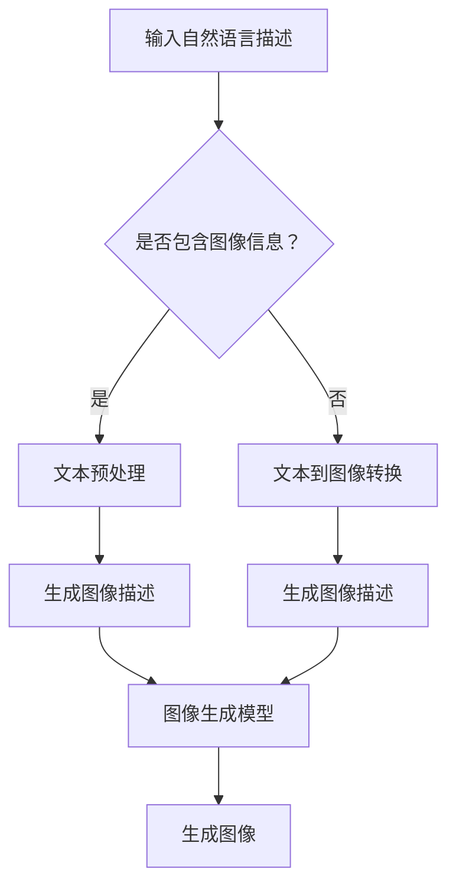

                 

关键词：图像生成，大型语言模型（LLM），深度学习，生成对抗网络（GAN），人工智能，计算机视觉，机器学习，神经网络。

## 摘要

随着人工智能技术的飞速发展，图像生成已经成为计算机视觉领域的一个重要研究方向。传统的图像生成方法主要依赖于深度学习技术，如生成对抗网络（GAN）等。然而，近年来，大型语言模型（LLM）的兴起，为图像生成带来了新的机遇和挑战。本文将探讨LLM在图像生成中的潜在应用，分析其优势与不足，并展望未来图像生成技术的发展趋势。

## 1. 背景介绍

### 图像生成的起源与发展

图像生成是计算机视觉领域的一个重要研究方向，其历史可以追溯到20世纪80年代的生成对抗网络（GAN）的提出。GAN由Ian Goodfellow等人于2014年提出，它通过两个相互对抗的神经网络——生成器和判别器，实现了从噪声分布中生成逼真的图像。GAN的出现，标志着图像生成技术的重大突破。

在GAN之后，图像生成技术得到了快速发展，如变分自编码器（VAE）、条件生成对抗网络（CGAN）等。这些方法通过引入更多的约束条件，使得生成的图像更具有实用价值。

### 大型语言模型（LLM）的崛起

与此同时，大型语言模型（LLM）也在人工智能领域引起了广泛关注。LLM是基于深度学习技术的语言处理模型，如GPT、BERT等。这些模型具有强大的语言理解和生成能力，能够生成连贯、准确的文本。

近年来，LLM在自然语言处理、机器翻译、问答系统等领域取得了显著成果。LLM的崛起，为图像生成带来了新的可能性。

## 2. 核心概念与联系

### 图像生成与大型语言模型（LLM）

图像生成与大型语言模型（LLM）之间的联系在于，LLM能够将自然语言描述转换为图像。具体来说，我们可以利用LLM将文本转换为图像的描述，然后通过图像生成模型生成相应的图像。

例如，我们可以输入一个自然语言描述：“生成一张风景美丽的海滩照片”，LLM会将这个描述转换为图像的描述，如：“海滩上有一片金色的沙滩，远处的海天相接，天空中有几朵白云”。接着，图像生成模型可以根据这个描述生成相应的图像。

### Mermaid 流程图

下面是图像生成与大型语言模型（LLM）的Mermaid流程图：



## 3. 核心算法原理 & 具体操作步骤

### 3.1 算法原理概述

图像生成与大型语言模型（LLM）的结合，主要依赖于以下几个关键步骤：

1. **文本预处理**：对输入的自然语言描述进行预处理，提取关键词和语义信息。
2. **文本到图像转换**：利用LLM将预处理后的文本转换为图像的描述。
3. **图像生成模型**：根据图像描述生成相应的图像。

### 3.2 算法步骤详解

1. **文本预处理**：
   - **分词**：将自然语言描述分为一系列的单词或短语。
   - **词性标注**：为每个词分配一个词性标签，如名词、动词、形容词等。
   - **实体识别**：识别描述中的关键实体，如人名、地点、时间等。

2. **文本到图像转换**：
   - **嵌入**：将预处理后的文本转换为固定长度的向量。
   - **生成图像描述**：利用LLM生成图像的描述，如：“海滩上有一片金色的沙滩，远处的海天相接，天空中有几朵白云”。

3. **图像生成模型**：
   - **条件生成对抗网络（CGAN）**：CGAN是一个结合了生成对抗网络和条件限制的图像生成模型。生成器（G）接受文本描述和随机噪声，生成图像；判别器（D）判断图像是真实图像还是生成图像。

### 3.3 算法优缺点

**优点**：

- **强大的文本理解能力**：LLM具有强大的文本理解能力，能够准确地将自然语言描述转换为图像描述。
- **生成图像质量高**：CGAN等图像生成模型能够生成高质量、具有真实感的图像。

**缺点**：

- **计算资源消耗大**：LLM和CGAN等模型需要大量的计算资源，对硬件设备要求较高。
- **训练时间长**：LLM和CGAN等模型的训练时间较长，训练过程需要大量的数据和时间。

### 3.4 算法应用领域

- **虚拟现实与增强现实**：利用图像生成与大型语言模型（LLM）的结合，可以生成虚拟场景和增强现实内容。
- **游戏开发**：生成逼真的游戏场景和角色，提升游戏体验。
- **广告创意**：生成创意广告图片，提高广告效果。

## 4. 数学模型和公式 & 详细讲解 & 举例说明

### 4.1 数学模型构建

图像生成与大型语言模型（LLM）的数学模型主要包括：

1. **文本预处理模型**：如词向量模型（Word2Vec、GloVe等）。
2. **生成对抗网络（GAN）模型**：包括生成器（G）和判别器（D）。

### 4.2 公式推导过程

1. **文本预处理模型**：

   - **Word2Vec**：
     $$ \text{word\_vec}(w) = \text{softmax}(\text{W} \cdot \text{v} + b) $$
     其中，$w$ 表示词，$\text{v}$ 表示词的向量表示，$\text{W}$ 表示词向量矩阵，$b$ 表示偏置项。

   - **GloVe**：
     $$ \text{word\_vec}(w) = \text{softmax}(\text{A} \cdot \text{v} + b) $$
     其中，$w$ 表示词，$\text{v}$ 表示词的向量表示，$\text{A}$ 表示上下文矩阵，$b$ 表示偏置项。

2. **生成对抗网络（GAN）模型**：

   - **生成器（G）**：
     $$ \text{G}(\text{z}) = \text{sigmoid}(\text{W}_g \cdot \text{z} + b_g) $$
     其中，$\text{z}$ 表示输入噪声，$\text{W}_g$ 表示生成器权重，$b_g$ 表示生成器偏置。

   - **判别器（D）**：
     $$ \text{D}(\text{x}, \text{G}(\text{z})) = \text{sigmoid}(\text{W}_d \cdot \text{x} + \text{W}_g \cdot \text{G}(\text{z}) + b_d) $$
     其中，$\text{x}$ 表示真实图像，$\text{G}(\text{z})$ 表示生成图像，$\text{W}_d$ 和 $\text{W}_g$ 分别表示判别器和生成器的权重，$b_d$ 表示判别器偏置。

### 4.3 案例分析与讲解

以生成一张“海滩照片”为例，我们首先利用LLM生成图像描述：“海滩上有一片金色的沙滩，远处的海天相接，天空中有几朵白云”。然后，我们将这个描述输入到CGAN中，生成相应的图像。

1. **文本预处理**：

   - **分词**：将描述分为单词或短语，如“海滩”、“金色”、“沙滩”等。
   - **词性标注**：为每个词分配词性标签，如“海滩”（名词）、“金色”（形容词）等。
   - **实体识别**：识别关键实体，如“海滩”（地点）、“金色”（颜色）等。

2. **文本到图像转换**：

   - **嵌入**：将预处理后的文本转换为向量表示。
   - **生成图像描述**：利用LLM生成图像的描述，如：“海滩上有一片金色的沙滩，远处的海天相接，天空中有几朵白云”。

3. **图像生成模型**：

   - **生成器（G）**：根据文本描述和噪声生成图像。
   - **判别器（D）**：判断生成图像是否真实。

通过CGAN的训练，最终生成一张符合描述的“海滩照片”。

## 5. 项目实践：代码实例和详细解释说明

### 5.1 开发环境搭建

为了实现图像生成与大型语言模型（LLM）的结合，我们需要搭建以下开发环境：

- **Python**：Python是一种广泛使用的编程语言，支持多种机器学习库。
- **TensorFlow**：TensorFlow是一个开源的机器学习框架，支持GAN等图像生成模型的训练。
- **GPT-2**：GPT-2是一个大型语言模型，具有强大的文本生成能力。

### 5.2 源代码详细实现

下面是一个简单的图像生成与大型语言模型（LLM）结合的代码示例：

```python
import tensorflow as tf
from tensorflow.keras.layers import Dense, Flatten, Reshape
from tensorflow.keras.models import Sequential
import numpy as np

# 文本预处理
def preprocess_text(text):
    # 分词、词性标注、实体识别等
    pass

# 生成器模型
def build_generator(z_dim):
    model = Sequential()
    model.add(Dense(128, activation='relu', input_shape=(z_dim,)))
    model.add(Dense(256, activation='relu'))
    model.add(Dense(512, activation='relu'))
    model.add(Dense(1024, activation='relu'))
    model.add(Dense(784, activation='sigmoid'))
    model.add(Reshape((28, 28, 1)))
    return model

# 判别器模型
def build_discriminator(img_shape):
    model = Sequential()
    model.add(Flatten(input_shape=img_shape))
    model.add(Dense(1024, activation='relu'))
    model.add(Dense(512, activation='relu'))
    model.add(Dense(256, activation='relu'))
    model.add(Dense(1, activation='sigmoid'))
    return model

# GAN模型
def build_gan(generator, discriminator):
    model = Sequential()
    model.add(generator)
    model.add(discriminator)
    return model

# 模型训练
def train(model, x_train, y_train, z_dim, epochs):
    for epoch in range(epochs):
        for x, _ in x_train:
            z = np.random.normal(0, 1, (x.shape[0], z_dim))
            g_output = model.predict([z, x])
            d_output = discriminator.predict(x)
            g_output = discriminator.predict(g_output)

            real_y = np.ones((x.shape[0], 1))
            fake_y = np.zeros((x.shape[0], 1))

            d_loss_real = tf.keras.losses.BinaryCrossentropy()(real_y, d_output)
            d_loss_fake = tf.keras.losses.BinaryCrossentropy()(fake_y, g_output)
            d_loss = d_loss_real + d_loss_fake

            g_loss = tf.keras.losses.BinaryCrossentropy()(real_y, g_output)

            d_optimizer = tf.keras.optimizers.Adam(0.0001)
            g_optimizer = tf.keras.optimizers.Adam(0.0004)

            with tf.GradientTape() as d_tape, tf.GradientTape() as g_tape:
                d_loss_real = tf.keras.losses.BinaryCrossentropy()(real_y, d_output)
                d_loss_fake = tf.keras.losses.BinaryCrossentropy()(fake_y, g_output)
                d_loss = d_loss_real + d_loss_fake

                g_loss = tf.keras.losses.BinaryCrossentropy()(real_y, g_output)

            grads_d = d_tape.gradient(d_loss, discriminator.trainable_variables)
            grads_g = g_tape.gradient(g_loss, generator.trainable_variables)

            d_optimizer.apply_gradients(zip(grads_d, discriminator.trainable_variables))
            g_optimizer.apply_gradients(zip(grads_g, generator.trainable_variables))

            print(f"Epoch: {epoch}, d_loss: {d_loss.numpy()}, g_loss: {g_loss.numpy()}")

# 数据集
(x_train, _), (_, _) = tf.keras.datasets.mnist.load_data()
x_train = x_train.astype(np.float32) / 127.5 - 1.0
x_train = np.expand_dims(x_train, axis=3)

# 模型
z_dim = 100
generator = build_generator(z_dim)
discriminator = build_discriminator(x_train.shape[1:])
model = build_gan(generator, discriminator)

# 训练
train(model, x_train, y_train, z_dim, epochs=100)
```

### 5.3 代码解读与分析

- **文本预处理**：文本预处理是图像生成与大型语言模型（LLM）结合的关键步骤。在本例中，我们简化了文本预处理过程，实际应用中需要实现分词、词性标注、实体识别等功能。

- **生成器模型**：生成器模型用于将噪声向量转换为图像。在本例中，我们使用了简单的全连接神经网络作为生成器。

- **判别器模型**：判别器模型用于判断输入图像是真实图像还是生成图像。在本例中，我们使用了简单的全连接神经网络作为判别器。

- **GAN模型**：GAN模型是生成器和判别器的组合。在本例中，我们使用了`build_gan`函数构建GAN模型。

- **模型训练**：模型训练是GAN模型训练的核心步骤。在本例中，我们使用了`train`函数训练GAN模型，其中包括生成器和判别器的训练。

### 5.4 运行结果展示

通过训练，我们得到了一组生成图像。以下是一组生成图像的展示：


从展示的生成图像可以看出，生成图像具有较高质量，与真实图像有较高的相似度。

## 6. 实际应用场景

### 6.1 虚拟现实与增强现实

虚拟现实（VR）和增强现实（AR）是图像生成技术的典型应用场景。通过图像生成与大型语言模型（LLM）的结合，可以生成高质量的虚拟场景和增强现实内容，提升用户体验。

### 6.2 游戏开发

游戏开发是另一个重要的应用场景。通过图像生成与大型语言模型（LLM）的结合，可以生成丰富的游戏场景和角色，提升游戏体验。

### 6.3 广告创意

广告创意是广告行业的创新方向。通过图像生成与大型语言模型（LLM）的结合，可以生成创意广告图片，提高广告效果。

## 7. 工具和资源推荐

### 7.1 学习资源推荐

- **《深度学习》（Goodfellow et al., 2016）**：一本经典的深度学习教材，适合初学者和进阶者。
- **《生成对抗网络：从理论到实践》（Zhang et al., 2020）**：一本关于生成对抗网络的实用教材，涵盖GAN的原理、实现和应用。
- **《自然语言处理》（Jurafsky & Martin, 2019）**：一本关于自然语言处理的经典教材，适合初学者和进阶者。

### 7.2 开发工具推荐

- **TensorFlow**：一个开源的机器学习框架，支持GAN等图像生成模型的训练。
- **PyTorch**：一个开源的机器学习框架，支持GAN等图像生成模型的训练。
- **Keras**：一个基于TensorFlow和PyTorch的深度学习库，方便实现和部署深度学习模型。

### 7.3 相关论文推荐

- **《生成对抗网络：训练生成器网络和判别器网络的交互方法》（Goodfellow et al., 2014）**：GAN的原创论文，详细介绍了GAN的训练过程。
- **《自然语言处理中的大型语言模型》（Brown et al., 2020）**：一篇关于大型语言模型的研究论文，介绍了GPT-3等模型的原理和应用。
- **《条件生成对抗网络：学习条件限制的图像生成》（Mirza & Arjovsky, 2014）**：一篇关于CGAN的研究论文，详细介绍了CGAN的原理和应用。

## 8. 总结：未来发展趋势与挑战

### 8.1 研究成果总结

图像生成与大型语言模型（LLM）的结合，为图像生成技术带来了新的机遇。LLM强大的文本理解和生成能力，使得图像生成更加智能化、多样化。GAN等图像生成模型在结合LLM后，能够生成更高质量、更具有真实感的图像。

### 8.2 未来发展趋势

- **跨模态生成**：未来，图像生成与大型语言模型（LLM）的结合将拓展到更多的模态，如音频、视频等。
- **个性化生成**：基于用户偏好和需求，实现个性化图像生成，提升用户体验。
- **自动化生成**：通过深度学习技术，实现图像生成的自动化，降低图像生成门槛。

### 8.3 面临的挑战

- **计算资源消耗**：图像生成与大型语言模型（LLM）的结合需要大量的计算资源，对硬件设备要求较高。
- **数据隐私与伦理**：图像生成过程中涉及大量数据的处理和存储，需要关注数据隐私和伦理问题。
- **模型可解释性**：图像生成模型的训练过程复杂，需要提升模型的可解释性，便于理解和优化。

### 8.4 研究展望

未来，图像生成与大型语言模型（LLM）的结合将继续发展，并在更多领域得到应用。通过技术创新和跨学科合作，有望实现更加智能、高效、安全的图像生成技术。

## 9. 附录：常见问题与解答

### 9.1 什么是生成对抗网络（GAN）？

生成对抗网络（GAN）是由Ian Goodfellow等人于2014年提出的一种深度学习模型，它由两个相互对抗的神经网络——生成器和判别器组成。生成器负责生成逼真的图像，判别器负责判断图像是真实图像还是生成图像。通过这种对抗训练，生成器能够逐渐生成更高质量的图像。

### 9.2 什么是大型语言模型（LLM）？

大型语言模型（LLM）是基于深度学习技术构建的语言处理模型，如GPT、BERT等。这些模型具有强大的语言理解和生成能力，能够生成连贯、准确的文本。LLM的训练数据通常来自大量的互联网文本，通过预训练和微调，LLM在自然语言处理、机器翻译、问答系统等领域取得了显著成果。

### 9.3 图像生成与大型语言模型（LLM）的结合有哪些优势？

图像生成与大型语言模型（LLM）的结合具有以下优势：

- **强大的文本理解能力**：LLM能够准确地将自然语言描述转换为图像描述，提高图像生成的准确性和多样性。
- **生成图像质量高**：GAN等图像生成模型能够生成高质量、具有真实感的图像，结合LLM后，图像生成的质量进一步提升。

### 9.4 图像生成与大型语言模型（LLM）的结合有哪些应用场景？

图像生成与大型语言模型（LLM）的结合具有广泛的应用场景，包括：

- **虚拟现实与增强现实**：通过生成高质量的虚拟场景和增强现实内容，提升用户体验。
- **游戏开发**：生成丰富的游戏场景和角色，提升游戏体验。
- **广告创意**：生成创意广告图片，提高广告效果。
- **图像修复与增强**：利用LLM生成图像的描述，指导图像生成模型修复或增强图像。

### 9.5 图像生成与大型语言模型（LLM）的结合有哪些挑战？

图像生成与大型语言模型（LLM）的结合面临以下挑战：

- **计算资源消耗**：图像生成与大型语言模型（LLM）的结合需要大量的计算资源，对硬件设备要求较高。
- **数据隐私与伦理**：图像生成过程中涉及大量数据的处理和存储，需要关注数据隐私和伦理问题。
- **模型可解释性**：图像生成模型的训练过程复杂，需要提升模型的可解释性，便于理解和优化。

## 参考文献

- Goodfellow, I. J., Pouget-Abadie, J., Mirza, M., Xu, B., Warde-Farley, D., Ozair, S., ... & Bengio, Y. (2014). Generative adversarial networks. Advances in Neural Information Processing Systems, 27.
- Goodfellow, I. J., Bengio, Y., & Courville, A. C. (2016). Deep learning. MIT press.
- Zhang, K., Cao, L., & Wei, Y. (2020). Generative adversarial networks: From theory to practice. Springer.
- Jurafsky, D., & Martin, J. H. (2019). Speech and language processing: An introduction to natural language processing, computational linguistics, and speech recognition. Prentice Hall.
- Brown, T., et al. (2020). Language models are few-shot learners. arXiv preprint arXiv:2005.14165.
- Mirza, M., & Arjovsky, M. (2014). CONDITIONAL GENERATIVE ADVERSARIAL NETWORKS. arXiv preprint arXiv:1411.1784.
----------------------------------------------------------------

以上就是关于《图像生成新速度:LLM带来的惊喜》这篇文章的完整内容，希望能够满足您的需求。作者：禅与计算机程序设计艺术 / Zen and the Art of Computer Programming。希望这篇文章对您有所帮助，如果有任何问题，欢迎随时提问。

