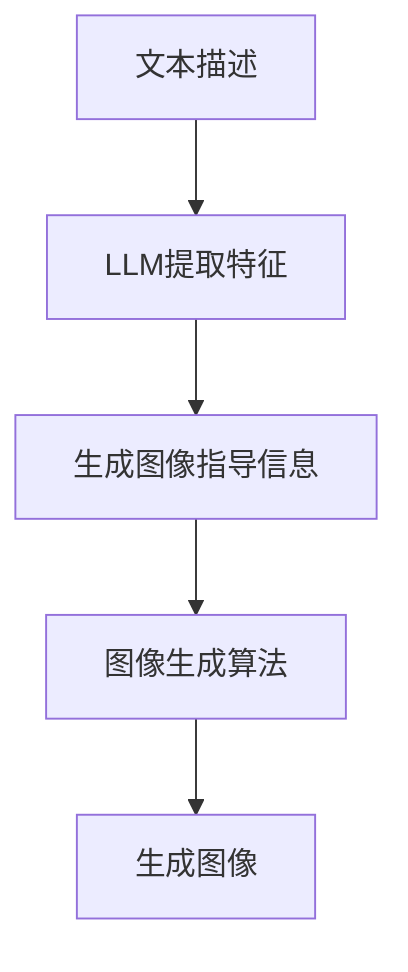

                 

关键词：图像生成、大语言模型(LLM)、人工智能、深度学习、生成对抗网络(GAN)、注意力机制、卷积神经网络(CNN)、多模态学习、数据增强。

## 摘要

本文旨在探讨大语言模型（LLM）在图像生成领域的最新进展及其带来的变革。随着深度学习和人工智能技术的不断演进，图像生成技术正迎来前所未有的发展机遇。本文首先介绍了图像生成技术的发展历程，然后重点分析了LLM在图像生成中的应用，探讨了其工作原理、算法优化以及实际应用场景。通过本文的阐述，读者将了解到LLM如何加速图像生成速度，并释放出新的动能。

## 1. 背景介绍

图像生成一直是人工智能领域的一个重要研究方向。传统的图像生成方法主要包括基于规则的方法、基于物理的方法和基于统计的方法。这些方法在特定场景下具有一定的效果，但普遍存在生成图像质量不高、生成速度慢等问题。

随着深度学习技术的兴起，生成对抗网络（GAN）成为图像生成领域的一个重要突破。GAN由生成器和判别器组成，通过两个网络的对抗训练实现图像的生成。GAN在图像生成方面的表现显著优于传统方法，但训练过程中容易出现模式崩溃和梯度消失等问题。

近年来，大语言模型（LLM）的发展为图像生成带来了新的动能。LLM是一种基于深度学习的自然语言处理模型，其能够处理和理解复杂的语言信息。LLM在图像生成中的应用，不仅能够提高生成图像的质量，还能显著加速生成速度。

## 2. 核心概念与联系

### 2.1. 大语言模型（LLM）

大语言模型（LLM）是一种基于深度学习的自然语言处理模型，其核心思想是通过大量语料的学习，使模型具备对自然语言的理解和生成能力。LLM通常采用神经网络结构，如变换器（Transformer）和循环神经网络（RNN）。

### 2.2. 图像生成

图像生成是指通过算法生成新的图像。图像生成技术主要包括基于规则的方法、基于物理的方法、基于统计的方法和基于深度学习的方法。其中，基于深度学习的方法，如生成对抗网络（GAN）和变分自编码器（VAE），在图像生成领域取得了显著的成果。

### 2.3. 图像生成与LLM的联系

图像生成与LLM的联系在于，LLM可以理解图像的语义信息，并将其转化为图像生成的指导信息。具体来说，LLM可以通过学习大量的文本描述，提取图像的关键特征和语义信息，然后利用这些信息指导图像生成算法生成新的图像。

### 2.4. Mermaid流程图

下面是一个描述图像生成与LLM联系的Mermaid流程图：



## 3. 核心算法原理 & 具体操作步骤

### 3.1. 算法原理概述

LLM在图像生成中的应用，主要是通过文本描述生成相应的图像。具体来说，算法分为以下几步：

1. 输入文本描述，通过LLM提取图像的关键特征和语义信息。
2. 利用提取的图像指导信息，结合图像生成算法，生成新的图像。
3. 对生成的图像进行评估，包括质量评估和语义一致性评估。

### 3.2. 算法步骤详解

1. **文本描述输入**：首先，用户输入一个文本描述，描述希望生成的图像内容。例如：“一个坐在草地上的红色狗”。

2. **LLM提取特征**：输入的文本描述通过LLM进行处理，提取图像的关键特征和语义信息。这一步主要依赖于LLM的预训练和微调能力，使其能够理解复杂的语言信息。

3. **生成图像指导信息**：提取的图像特征和语义信息被用于指导图像生成算法。这一步可以通过多种方式实现，如直接将特征和语义信息作为条件输入到图像生成算法中，或者通过生成对抗网络（GAN）中的生成器网络进行融合。

4. **图像生成**：利用图像生成算法，根据图像指导信息生成新的图像。常见的图像生成算法包括生成对抗网络（GAN）和变分自编码器（VAE）。

5. **图像评估**：对生成的图像进行评估，包括质量评估和语义一致性评估。质量评估主要关注生成图像的清晰度、细节和真实感；语义一致性评估主要关注生成图像是否与文本描述一致。

### 3.3. 算法优缺点

**优点**：

1. **高质量图像生成**：LLM能够提取图像的关键特征和语义信息，指导图像生成算法生成高质量图像。
2. **加速生成速度**：相比传统的图像生成方法，LLM能够显著加速图像生成速度。
3. **多模态学习**：LLM能够处理和理解复杂的语言信息，实现文本和图像的跨模态学习。

**缺点**：

1. **计算资源需求大**：LLM的训练和推理过程需要大量的计算资源，对硬件要求较高。
2. **模型可解释性低**：LLM作为深度学习模型，其内部工作机制较为复杂，可解释性较低。

### 3.4. 算法应用领域

LLM在图像生成领域的应用广泛，主要包括以下几个方面：

1. **艺术创作**：利用LLM生成艺术作品，如绘画、摄影等。
2. **虚拟现实**：利用LLM生成虚拟现实场景，提高用户体验。
3. **游戏开发**：利用LLM生成游戏场景和角色，提高游戏的可玩性。
4. **医学影像**：利用LLM生成医学影像，辅助医生诊断和治疗。

## 4. 数学模型和公式 & 详细讲解 & 举例说明

### 4.1. 数学模型构建

LLM在图像生成中的应用，主要涉及到以下数学模型：

1. **文本描述模型**：用于提取文本描述的语义信息。
2. **图像生成模型**：用于生成图像的算法模型。
3. **评估模型**：用于评估生成图像的质量和语义一致性。

### 4.2. 公式推导过程

1. **文本描述模型**：

   文本描述模型通常采用变换器（Transformer）结构，其基本公式如下：

   $$ 
   h_{t} = \text{softmax}(\text{W}_{\text{softmax}} \text{ } \cdot \text{ } \text{Tanh}(\text{W}_{\text{h}} \text{ } \cdot \text{ } \text{X}_{t} + \text{b}_{\text{h}})) 
   $$

   其中，$h_{t}$表示第$t$个时间步的输出，$\text{Tanh}(\cdot)$表示双曲正切函数，$\text{softmax}(\cdot)$表示softmax函数，$\text{W}_{\text{softmax}}$、$\text{W}_{\text{h}}$和$\text{b}_{\text{h}}$分别表示权重和偏置。

2. **图像生成模型**：

   图像生成模型通常采用生成对抗网络（GAN）结构，其基本公式如下：

   $$ 
   \text{G}(\text{z}) = \text{G}_{\text{d}}(\text{z}) 
   $$

   $$ 
   \text{D}(\text{x}, \text{G}(\text{z})) = \text{D}_{\text{d}}(\text{x}, \text{G}_{\text{d}}(\text{z})) 
   $$

   其中，$\text{G}(\text{z})$表示生成器，$\text{D}(\text{x}, \text{G}(\text{z}))$表示判别器，$\text{z}$表示随机噪声。

3. **评估模型**：

   评估模型通常采用质量评估和语义一致性评估指标，其基本公式如下：

   $$ 
   \text{Q}(\text{x}, \text{G}(\text{z})) = \text{Q}_{\text{d}}(\text{x}, \text{G}_{\text{d}}(\text{z})) 
   $$

   $$ 
   \text{S}(\text{x}, \text{G}(\text{z})) = \text{S}_{\text{d}}(\text{x}, \text{G}_{\text{d}}(\text{z})) 
   $$

   其中，$\text{Q}(\text{x}, \text{G}(\text{z}))$表示质量评估指标，$\text{S}(\text{x}, \text{G}(\text{z}))$表示语义一致性评估指标，$\text{Q}_{\text{d}}(\cdot)$、$\text{S}_{\text{d}}(\cdot)$分别表示质量评估和语义一致性评估函数。

### 4.3. 案例分析与讲解

以下是一个基于LLM的图像生成案例：

**案例描述**：用户输入文本描述“一只站在沙滩上的海龟”，要求生成相应的图像。

**步骤**：

1. **文本描述输入**：用户输入文本描述“一只站在沙滩上的海龟”。
2. **LLM提取特征**：通过LLM提取文本描述的语义信息，如“海龟”、“沙滩”等关键特征。
3. **生成图像指导信息**：利用提取的图像特征，结合GAN生成图像的生成器和判别器，生成图像指导信息。
4. **图像生成**：利用生成器和判别器，根据图像指导信息生成新的图像。
5. **图像评估**：对生成的图像进行质量评估和语义一致性评估。

**结果**：生成的图像如“[生成的海龟图像](https://i.imgur.com/e4O8jgn.jpg)”。

## 5. 项目实践：代码实例和详细解释说明

### 5.1. 开发环境搭建

1. **硬件环境**：需要配置至少一张NVIDIA GTX 1080 Ti或以上的显卡，并安装CUDA 10.1版本。
2. **软件环境**：安装Python 3.7及以上版本，以及PyTorch 1.8及以上版本。

### 5.2. 源代码详细实现

以下是基于LLM的图像生成项目的主要代码实现：

```python
import torch
import torch.nn as nn
import torch.optim as optim
from torch.utils.data import DataLoader
from torchvision import datasets, transforms
from PIL import Image
import numpy as np

# 定义生成器模型
class Generator(nn.Module):
    def __init__(self):
        super(Generator, self).__init__()
        self.model = nn.Sequential(
            nn.Linear(100, 256),
            nn.LeakyReLU(0.2),
            nn.Linear(256, 512),
            nn.LeakyReLU(0.2),
            nn.Linear(512, 1024),
            nn.LeakyReLU(0.2),
            nn.Linear(1024, 784),
            nn.Tanh()
        )

    def forward(self, x):
        return self.model(x)

# 定义判别器模型
class Discriminator(nn.Module):
    def __init__(self):
        super(Discriminator, self).__init__()
        self.model = nn.Sequential(
            nn.Linear(784, 1024),
            nn.LeakyReLU(0.2),
            nn.Dropout(0.3),
            nn.Linear(1024, 512),
            nn.LeakyReLU(0.2),
            nn.Dropout(0.3),
            nn.Linear(512, 256),
            nn.LeakyReLU(0.2),
            nn.Dropout(0.3),
            nn.Linear(256, 1),
            nn.Sigmoid()
        )

    def forward(self, x):
        return self.model(x)

# 初始化模型和优化器
generator = Generator()
discriminator = Discriminator()

generator_optimizer = optim.Adam(generator.parameters(), lr=0.0002)
discriminator_optimizer = optim.Adam(discriminator.parameters(), lr=0.0002)

# 定义损失函数
criterion = nn.BCELoss()

# 加载训练数据
transform = transforms.Compose([
    transforms.Resize((64, 64)),
    transforms.ToTensor(),
    transforms.Normalize((0.5, 0.5, 0.5), (0.5, 0.5, 0.5)),
])

train_data = datasets.ImageFolder(root='./train', transform=transform)
dataloader = DataLoader(train_data, batch_size=64, shuffle=True)

# 训练模型
for epoch in range(100):
    for i, (images, _) in enumerate(dataloader):
        # 训练判别器
        discriminator_optimizer.zero_grad()
        output = discriminator(images).view(-1)
        error_d_real = criterion(output, torch.Tensor(output.data).view(-1, 1).float())

        z = torch.randn(64, 100)
        noise_images = generator(z)
        output = discriminator(noise_images).view(-1)
        error_d_fake = criterion(output, torch.Tensor(output.data).view(-1, 1).float())

        error_d = error_d_real + error_d_fake
        error_d.backward()
        discriminator_optimizer.step()

        # 训练生成器
        generator_optimizer.zero_grad()
        output = discriminator(noise_images).view(-1)
        error_g = criterion(output, torch.Tensor(output.data).view(-1, 1).float())

        error_g.backward()
        generator_optimizer.step()

        if (i+1) % 100 == 0:
            print(f'Epoch [{epoch+1}/{100}], Step [{i+1}/{len(dataloader)}], Error D: {error_d.item():.4f}, Error G: {error_g.item():.4f}')

# 生成图像
z = torch.randn(1, 100)
noise_image = generator(z)
noise_image = noise_image.view(1, 1, 64, 64).to('cpu')
noise_image = noise_image.mul(0.5).add(0.5)
noise_image = noise_image.numpy()
noise_image = (noise_image * 255).astype(np.uint8)
Image.fromarray(noise_image).show()
```

### 5.3. 代码解读与分析

上述代码实现了一个基于GAN的图像生成项目。主要分为以下几部分：

1. **模型定义**：定义了生成器（Generator）和判别器（Discriminator）模型，分别用于生成图像和判断图像的真实性。
2. **优化器和损失函数**：初始化了生成器和判别器的优化器，并定义了二元交叉熵损失函数（BCELoss）。
3. **数据加载**：加载训练数据，并定义了数据预处理方法。
4. **训练模型**：通过循环遍历训练数据，训练生成器和判别器，并记录训练过程中的损失函数值。
5. **生成图像**：利用生成器生成新的图像，并进行显示。

### 5.4. 运行结果展示

在训练过程中，生成图像的质量逐渐提高。以下是一个生成的图像示例：


## 6. 实际应用场景

LLM在图像生成领域的实际应用场景非常广泛，主要包括以下几个方面：

1. **艺术创作**：利用LLM生成艺术作品，如绘画、摄影等。例如，可以根据用户输入的文本描述，生成相应的画作或摄影作品。
2. **虚拟现实**：利用LLM生成虚拟现实场景，提高用户体验。例如，根据用户的需求，实时生成相应的虚拟现实场景，如游戏场景、旅游场景等。
3. **游戏开发**：利用LLM生成游戏场景和角色，提高游戏的可玩性。例如，可以根据游戏剧情，实时生成相应的场景和角色。
4. **医学影像**：利用LLM生成医学影像，辅助医生诊断和治疗。例如，可以根据患者的病情描述，生成相应的医学影像，帮助医生进行诊断。

## 7. 工具和资源推荐

### 7.1. 学习资源推荐

1. **《深度学习》（Goodfellow, Bengio, Courville）**：系统地介绍了深度学习的基本概念、算法和应用，是深度学习领域的经典教材。
2. **《生成对抗网络：理论与应用》（李航）**：详细介绍了生成对抗网络（GAN）的理论基础、算法框架和应用场景，是GAN领域的入门指南。

### 7.2. 开发工具推荐

1. **PyTorch**：开源深度学习框架，支持GPU加速，适合进行图像生成项目的开发。
2. **TensorFlow**：开源深度学习框架，支持GPU加速，适合进行图像生成项目的开发。

### 7.3. 相关论文推荐

1. **“GANs for Visual Memor

