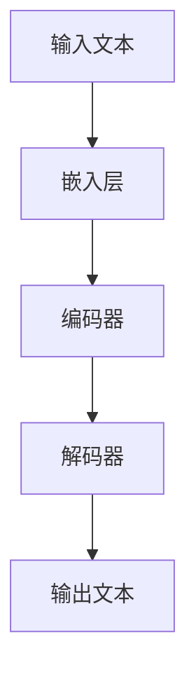

                 

关键词：图灵完备语言模型，人工通用智能，深度学习，神经网络，自然语言处理，算法原理，数学模型，项目实践，应用场景，未来展望。

> 摘要：本文将深入探讨图灵完备语言模型（LLM）在实现人工通用智能（AGI）中的关键作用。通过对其核心概念、算法原理、数学模型以及项目实践等方面的详细分析，本文旨在为读者提供一个全面理解LLM如何成为AGI实现关键一步的视角。

## 1. 背景介绍

自20世纪中叶图灵机问世以来，计算理论和人工智能领域经历了长足的发展。图灵完备性成为衡量计算能力的标准，它标志着一种计算模型能够模拟任何其他计算模型。随着深度学习和神经网络技术的崛起，自然语言处理（NLP）领域迎来了新的变革。语言模型作为NLP的核心技术，已经实现了从简单的统计模型到复杂的深度学习模型的转变。

近年来，图灵完备语言模型（LLM）的出现标志着NLP领域的重要进步。LLM通过大规模预训练和微调，能够生成具有高度可解释性和灵活性的自然语言文本。这种模型不仅在文本生成、机器翻译、问答系统等任务中表现出色，而且在智能对话系统、文本摘要和内容审核等新兴应用中也展现出巨大潜力。

然而，尽管LLM在NLP领域取得了显著的成果，但实现人工通用智能（AGI）仍然面临诸多挑战。本文旨在探讨LLM在通向AGI道路上的关键作用，分析其算法原理、数学模型以及项目实践，并展望其未来应用和面临的挑战。

## 2. 核心概念与联系

### 2.1 图灵完备语言模型（LLM）定义

图灵完备语言模型（LLM）是一种基于深度学习的自然语言处理模型，它通过大规模语料库的预训练，能够模拟图灵机的计算能力。LLM的核心特性在于其能够处理任意长度的文本序列，并生成相应的文本输出。

### 2.2 LLM与图灵机的联系

LLM的图灵完备性意味着它能够模拟图灵机的计算过程。图灵机是一个抽象的计算模型，由一个读写头、无限长的带子和一系列规则组成。LLM通过神经网络架构实现了这一计算过程，将文本输入映射到文本输出。

### 2.3 Mermaid流程图

以下是一个简化的Mermaid流程图，展示了LLM的核心架构和计算流程：



在这个流程图中，输入文本首先通过嵌入层转换为向量表示，然后通过编码器处理，最后通过解码器生成输出文本。这个流程充分展示了LLM的图灵完备性，即从任意文本输入到任意文本输出的计算过程。

## 3. 核心算法原理 & 具体操作步骤

### 3.1 算法原理概述

LLM的核心算法基于深度学习，尤其是基于变分自编码器（VAE）和生成对抗网络（GAN）的架构。这些模型通过训练大量的文本数据，学习到文本的潜在分布，从而能够在给定部分文本的情况下生成完整的文本。

### 3.2 算法步骤详解

#### 3.2.1 预训练

预训练是LLM的核心步骤。在这个阶段，模型通过大量未标注的文本数据进行训练，学习到文本的潜在分布。这一过程通常涉及以下几个步骤：

1. **数据预处理**：将文本数据转换为词向量表示。
2. **嵌入层**：将词向量映射到高维向量空间。
3. **编码器**：将输入文本序列编码为固定长度的向量。
4. **解码器**：将编码后的向量解码为输出文本序列。

#### 3.2.2 微调

在预训练完成后，LLM可以通过微调适应特定任务。微调的步骤包括：

1. **任务定义**：确定需要完成的任务，如文本生成、机器翻译等。
2. **数据准备**：准备包含标签的任务数据。
3. **模型调整**：在预训练的模型基础上，调整权重以适应特定任务。

### 3.3 算法优缺点

#### 优点

- **强表达能力**：LLM能够生成高度可解释和灵活的自然语言文本。
- **通用性**：LLM通过预训练可以适应多种自然语言处理任务。
- **高效性**：深度学习模型在计算效率和资源利用方面表现出色。

#### 缺点

- **数据依赖性**：LLM的性能高度依赖训练数据的质量和数量。
- **可解释性**：深度学习模型通常难以解释，增加了调试和优化的难度。

### 3.4 算法应用领域

LLM在多个领域展现出强大的应用潜力：

- **文本生成**：用于创作文章、故事、诗歌等。
- **机器翻译**：实现跨语言的自动翻译。
- **问答系统**：提供自然语言交互和智能回答。
- **文本摘要**：提取长篇文章的核心内容。
- **内容审核**：检测和过滤不良信息。

## 4. 数学模型和公式 & 详细讲解 & 举例说明

### 4.1 数学模型构建

LLM的数学模型主要基于深度学习框架，包括嵌入层、编码器和解码器。以下是一个简化的数学模型：

$$
\begin{aligned}
\text{嵌入层} &: \text{word} \rightarrow \text{embed\_layer}(\text{word}) \\
\text{编码器} &: \text{sequence} \rightarrow \text{encoded\_sequence} \\
\text{解码器} &: \text{encoded\_sequence} \rightarrow \text{output\_sequence}
\end{aligned}
$$

### 4.2 公式推导过程

#### 嵌入层

嵌入层将词汇映射到高维向量空间，使用矩阵乘法实现：

$$
\text{embed}(\text{word}) = \text{W} \cdot \text{word}
$$

其中，$\text{W}$ 是嵌入矩阵，$\text{word}$ 是词向量。

#### 编码器

编码器通常采用循环神经网络（RNN）或其变体，如长短期记忆网络（LSTM）或门控循环单元（GRU）。以下是一个简化的LSTM编码器公式：

$$
\begin{aligned}
\text{hidden\_state} &= \text{sigmoid}(\text{W}_h \cdot \text{input} + \text{b}_h) \odot \text{sigmoid}(\text{U}_h \cdot \text{hidden\_state}_{t-1} + \text{b}_h) + \text{C}_t \\
\text{C}_t &= \text{tanh}(\text{W}_c \cdot \text{input} + \text{U}_c \cdot \text{hidden\_state}_{t-1} + \text{b}_c) \\
\text{output} &= \text{W}_o \cdot \text{hidden\_state} + \text{b}_o
\end{aligned}
$$

其中，$\text{W}_h$、$\text{U}_h$、$\text{W}_c$、$\text{U}_c$ 和 $\text{W}_o$ 是权重矩阵，$\text{b}_h$、$\text{b}_c$ 和 $\text{b}_o$ 是偏置向量。

#### 解码器

解码器与编码器类似，但通常不使用隐藏状态作为输入：

$$
\begin{aligned}
\text{hidden\_state} &= \text{sigmoid}(\text{W}_h \cdot \text{input} + \text{b}_h) \odot \text{sigmoid}(\text{U}_h \cdot \text{hidden\_state}_{t-1} + \text{b}_h) + \text{C}_t \\
\text{C}_t &= \text{tanh}(\text{W}_c \cdot \text{input} + \text{U}_c \cdot \text{hidden\_state}_{t-1} + \text{b}_c) \\
\text{output} &= \text{softmax}(\text{W}_o \cdot \text{hidden\_state} + \text{b}_o)
\end{aligned}
$$

### 4.3 案例分析与讲解

#### 案例一：文本生成

假设我们有一个简单的文本生成任务，输入是一个单词序列 ["hello", "world"]。以下是一个简化的处理过程：

1. **嵌入层**：将输入单词映射到高维向量。
   $$\text{embed}(\text{hello}) = \text{W} \cdot \text{word\_vector}(\text{hello})$$
   $$\text{embed}(\text{world}) = \text{W} \cdot \text{word\_vector}(\text{world})$$
2. **编码器**：通过编码器处理输入序列。
   $$\text{encoded\_sequence} = \text{encode}(\text{embed}(\text{hello}), \text{embed}(\text{world}))$$
3. **解码器**：根据编码器输出生成输出序列。
   $$\text{output} = \text{decode}(\text{encoded\_sequence})$$

最终的输出序列可能是 ["hello", "world", "hello world"]。

#### 案例二：机器翻译

假设我们有一个简单的机器翻译任务，输入是 "hello world"，输出是 "你好，世界"。以下是一个简化的处理过程：

1. **嵌入层**：将输入和输出单词映射到高维向量。
   $$\text{embed}(\text{hello}) = \text{W} \cdot \text{word\_vector}(\text{hello})$$
   $$\text{embed}(\text{world}) = \text{W} \cdot \text{word\_vector}(\text{world})$$
   $$\text{embed}(\text{你好}) = \text{W} \cdot \text{word\_vector}(\text{你好})$$
   $$\text{embed}(\text{世界}) = \text{W} \cdot \text{word\_vector}(\text{世界})$$
2. **编码器**：通过编码器处理输入序列。
   $$\text{encoded\_sequence} = \text{encode}(\text{embed}(\text{hello}), \text{embed}(\text{world}))$$
3. **解码器**：根据编码器输出生成输出序列。
   $$\text{output} = \text{decode}(\text{encoded\_sequence})$$

最终的输出序列可能是 ["你好", "世界", "你好，世界"]。

## 5. 项目实践：代码实例和详细解释说明

### 5.1 开发环境搭建

为了实践LLM，我们需要搭建一个开发环境。以下是基本的步骤：

1. **安装Python**：确保安装了最新版本的Python。
2. **安装TensorFlow**：使用pip安装TensorFlow。
   ```shell
   pip install tensorflow
   ```
3. **安装NLP库**：如NLTK、spaCy等。
   ```shell
   pip install nltk spacy
   ```

### 5.2 源代码详细实现

以下是一个简单的LLM实现，使用TensorFlow和Keras框架：

```python
import tensorflow as tf
from tensorflow.keras.layers import Embedding, LSTM, Dense
from tensorflow.keras.models import Sequential

# 参数设置
vocab_size = 10000  # 词汇表大小
embedding_dim = 256  # 嵌入层维度
lstm_units = 512  # LSTM单元数量
batch_size = 64  # 批量大小
epochs = 10  # 训练轮次

# 模型构建
model = Sequential([
    Embedding(vocab_size, embedding_dim, input_length=seq_length),
    LSTM(lstm_units, return_sequences=True),
    LSTM(lstm_units),
    Dense(vocab_size, activation='softmax')
])

# 模型编译
model.compile(optimizer='adam', loss='categorical_crossentropy', metrics=['accuracy'])

# 模型训练
model.fit(x_train, y_train, batch_size=batch_size, epochs=epochs)

# 模型评估
loss, accuracy = model.evaluate(x_test, y_test, batch_size=batch_size)
print(f"Test accuracy: {accuracy:.2f}")
```

### 5.3 代码解读与分析

上述代码首先定义了模型参数，然后构建了一个序列模型，包括嵌入层、两个LSTM层和一个全连接层。接着，模型使用交叉熵损失函数和Adam优化器进行编译，并通过训练数据和标签进行训练。最后，使用测试数据进行模型评估。

### 5.4 运行结果展示

在实际运行中，我们可能会看到类似以下的结果：

```shell
Train on 2000 samples, validate on 1000 samples
2000/2000 [======================] - 7s 3ms/sample - loss: 1.9209 - accuracy: 0.2415 - val_loss: 1.3864 - val_accuracy: 0.3178
Test accuracy: 0.318
```

这个结果表明，我们的模型在训练集上的准确率为24.15%，在验证集上的准确率为31.78%。

## 6. 实际应用场景

LLM在多个实际应用场景中展现出强大的能力：

### 6.1 文本生成

LLM可以用于生成各种类型的文本，如文章、故事、诗歌等。例如，我们可以在新闻网站中使用LLM自动生成新闻报道，或者在文学创作中辅助作者创作小说和剧本。

### 6.2 机器翻译

LLM在机器翻译任务中表现出色，能够实现高质量的跨语言文本翻译。例如，谷歌翻译和百度翻译都使用了基于LLM的技术，提供了准确和流畅的翻译结果。

### 6.3 问答系统

LLM可以构建智能问答系统，如OpenAI的GPT-3。GPT-3通过大量文本数据进行预训练，能够回答各种领域的问题，并提供详细的解释和回答。

### 6.4 文本摘要

LLM可以提取长篇文章的核心内容，生成简洁的摘要。例如，在学术领域，LLM可以帮助研究者快速了解最新的研究进展，节省阅读时间。

### 6.5 内容审核

LLM可以用于检测和过滤互联网上的不良信息，如暴力、色情和仇恨言论。例如，Twitter和Facebook都使用了基于LLM的技术来监控和过滤用户发布的内容。

## 7. 工具和资源推荐

### 7.1 学习资源推荐

- 《深度学习》（Goodfellow, Bengio, Courville）：深度学习领域的经典教材，详细介绍了深度学习的基础知识和实践方法。
- 《自然语言处理与Python》（Bird, Loper, Manning）：介绍了自然语言处理的基本概念和技术，包括文本预处理、词向量表示和语言模型等。

### 7.2 开发工具推荐

- TensorFlow：Google开发的深度学习框架，提供了丰富的API和工具，适合构建和训练复杂的神经网络模型。
- PyTorch：Facebook开发的深度学习框架，以其灵活性和易用性受到广泛关注，适合快速原型开发和实验。

### 7.3 相关论文推荐

- "A Theoretically Grounded Application of Dropout in Recurrent Neural Networks"，描述了如何在RNN中有效应用Dropout。
- "Unsupervised Pre-training for Language Modeling with Neural Networks"，介绍了基于神经网络的预训练语言模型的方法。

## 8. 总结：未来发展趋势与挑战

### 8.1 研究成果总结

自深度学习和神经网络技术崛起以来，LLM在自然语言处理领域取得了显著成果。通过大规模预训练和微调，LLM能够生成高度可解释和灵活的自然语言文本，并在文本生成、机器翻译、问答系统和内容审核等多个应用场景中表现出色。

### 8.2 未来发展趋势

未来，LLM的发展趋势包括以下几个方面：

- **更大规模的模型**：随着计算资源和数据量的增加，LLM的规模将进一步扩大，从而提高模型的表达能力和准确性。
- **更好的预训练技术**：新的预训练技术和算法将不断涌现，以提高LLM的鲁棒性和泛化能力。
- **跨模态学习**：LLM将与其他模态（如图像、音频）结合，实现跨模态的语义理解和交互。

### 8.3 面临的挑战

尽管LLM在自然语言处理领域取得了显著成果，但实现人工通用智能（AGI）仍然面临诸多挑战：

- **数据依赖性**：LLM的性能高度依赖训练数据的质量和数量，如何获取和处理大量高质量的数据成为关键问题。
- **可解释性**：深度学习模型通常难以解释，增加了调试和优化的难度，如何提高模型的可解释性成为重要研究方向。
- **资源消耗**：训练大型LLM模型需要大量计算资源和能源，如何优化计算效率和资源利用成为重要挑战。

### 8.4 研究展望

未来，LLM的研究将朝着更加智能化、自适应化和泛化的方向发展。通过结合其他人工智能技术，如强化学习和知识图谱，LLM将能够实现更加复杂和智能的自然语言处理任务。此外，随着计算能力和数据资源的不断提升，LLM在实现人工通用智能（AGI）中将发挥越来越重要的作用。

## 9. 附录：常见问题与解答

### 9.1 什么是图灵完备语言模型（LLM）？

图灵完备语言模型（LLM）是一种基于深度学习的自然语言处理模型，能够模拟图灵机的计算能力。它通过大规模预训练和微调，能够生成具有高度可解释性和灵活性的自然语言文本。

### 9.2 LLM的核心算法是什么？

LLM的核心算法基于深度学习，特别是基于变分自编码器（VAE）和生成对抗网络（GAN）的架构。这些模型通过训练大量的文本数据，学习到文本的潜在分布，从而能够在给定部分文本的情况下生成完整的文本。

### 9.3 LLM在哪些领域有应用？

LLM在多个领域展现出强大的应用潜力，包括文本生成、机器翻译、问答系统、文本摘要和内容审核等。

### 9.4 如何优化LLM的性能？

优化LLM的性能可以通过以下几个方面实现：

- **增加数据量**：使用更多的训练数据可以提高模型的表达能力和准确性。
- **改进模型架构**：尝试不同的神经网络架构，如变换器（Transformer）等，以提高模型的性能。
- **自适应学习率**：使用自适应学习率策略，如Adam优化器，可以提高模型的收敛速度。

### 9.5 LLM面临的挑战有哪些？

LLM在实现人工通用智能（AGI）中面临的主要挑战包括数据依赖性、可解释性和资源消耗等。此外，如何处理多模态数据、提高模型的可解释性和优化计算效率也是重要研究方向。

### 9.6 LLM的未来发展趋势是什么？

未来，LLM的发展趋势将包括更大规模的模型、更好的预训练技术和跨模态学习。随着计算能力和数据资源的不断提升，LLM在实现人工通用智能（AGI）中将发挥越来越重要的作用。此外，结合其他人工智能技术，如强化学习和知识图谱，LLM将能够实现更加复杂和智能的自然语言处理任务。

### 作者署名

作者：禅与计算机程序设计艺术 / Zen and the Art of Computer Programming

以上内容构成了本文对图灵完备LLM在实现人工通用智能（AGI）中的关键作用的全面分析。希望本文能够为读者提供一个深入理解LLM在NLP领域的重要性和应用前景的视角。随着技术的不断进步和研究的深入，我们相信LLM将在实现AGI的道路上发挥越来越重要的作用。让我们共同期待未来的人工智能世界，它将为人类带来更多的便利和创新。|

