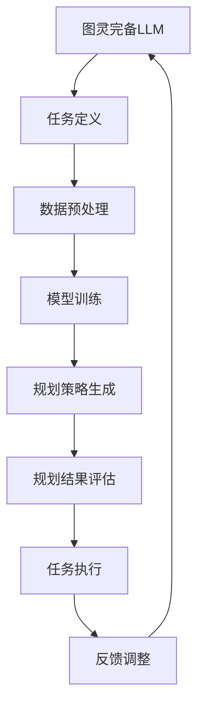

                 

关键词：图灵完备，LLM，任务规划，人工智能，算法，数学模型，应用场景

> 摘要：本文将探讨图灵完备的语言模型（LLM）在任务规划领域的无限潜力。通过深入分析LLM的核心概念、算法原理、数学模型及其在不同应用场景中的实践，我们将揭示这一技术在人工智能领域的突破性进展。

## 1. 背景介绍

随着人工智能技术的快速发展，自然语言处理（NLP）成为了一个备受关注的研究方向。在NLP领域中，语言模型（Language Model，简称LM）是核心组件之一。近年来，基于深度学习的语言模型，特别是图灵完备的LLM（Large Language Model）取得了显著的进展。图灵完备的LLM不仅能够在各种NLP任务中表现出色，如文本生成、问答系统、机器翻译等，而且在任务规划领域展现出巨大的潜力。

任务规划是人工智能领域的一个重要研究方向，旨在自动化复杂任务的制定和执行过程。传统的任务规划方法往往依赖于预定义的规则和算法，而图灵完备的LLM通过学习海量数据，能够自动生成和优化任务规划方案，从而提高规划效率和灵活性。

本文旨在深入探讨图灵完备的LLM在任务规划领域的应用，分析其核心概念、算法原理、数学模型及其在不同应用场景中的实践。通过本文的阐述，读者将能够了解图灵完备的LLM在任务规划领域的无限潜力，并为相关研究和应用提供参考。

## 2. 核心概念与联系

### 2.1 图灵完备语言模型（LLM）

图灵完备语言模型（LLM）是指能够模拟图灵机的语言模型。图灵机是数学家和逻辑学家艾伦·图灵在20世纪30年代提出的一种抽象计算模型。图灵机由一个无限长的纸带、一个读写头和一组控制规则组成。通过读取和写入纸带上的符号，图灵机能够模拟任何计算过程。

LLM通过学习海量文本数据，构建出一个巨大的参数化模型，能够对输入的文本进行理解和生成。LLM的核心思想是通过大规模的数据预训练，使模型具备对自然语言的高层次理解能力，从而能够应对各种复杂的NLP任务。

### 2.2 任务规划

任务规划（Task Planning）是人工智能领域的一个重要研究方向，旨在自动化复杂任务的制定和执行过程。任务规划的核心目标是生成一个合理的任务执行方案，使系统能够高效地完成给定的任务。

任务规划通常包括以下步骤：

1. **任务定义**：明确需要完成的任务及其约束条件。
2. **规划策略选择**：选择合适的规划算法和策略。
3. **规划过程执行**：根据任务定义和规划策略，生成具体的任务执行方案。
4. **规划结果评估**：评估生成的任务执行方案是否满足预期目标。

### 2.3 图灵完备LLM与任务规划的关系

图灵完备的LLM为任务规划带来了新的可能性。通过学习海量数据，LLM能够自动提取任务相关的知识，生成合理的任务规划方案。与传统方法相比，LLM具有以下优势：

1. **自适应能力**：LLM能够根据不同任务的需求，自动调整规划策略和参数，提高规划效率。
2. **灵活性**：LLM能够处理各种复杂的任务场景，生成灵活的任务执行方案。
3. **可扩展性**：LLM可以通过增加训练数据和学习时间，不断提高任务规划能力。

下面是一个用于描述图灵完备LLM与任务规划关系的Mermaid流程图：



## 3. 核心算法原理 & 具体操作步骤

### 3.1 算法原理概述

图灵完备的LLM基于深度学习的自注意力机制（Self-Attention Mechanism）和 Transformer 模型（Transformer Model）。Transformer 模型是一种基于自注意力机制的序列到序列模型，通过学习输入序列和输出序列之间的映射关系，实现自然语言处理任务。

图灵完备的LLM通过以下步骤实现任务规划：

1. **任务定义**：将任务需求转化为自然语言描述。
2. **数据预处理**：对输入数据进行预处理，包括分词、词向量化等。
3. **模型训练**：使用预训练的 Transformer 模型，对任务数据进行训练，生成任务规划模型。
4. **规划策略生成**：输入任务描述，通过模型生成合理的任务规划方案。
5. **规划结果评估**：评估生成的任务规划方案是否满足预期目标。
6. **任务执行**：根据规划方案，执行具体任务。
7. **反馈调整**：根据任务执行结果，调整规划策略和模型参数。

### 3.2 算法步骤详解

#### 3.2.1 任务定义

任务定义是任务规划的第一步，需要将任务需求转化为自然语言描述。例如，一个简单的任务描述可以是：“请帮我购买一本名为《深度学习》的书，地址为XX路XX号，快递方式为顺丰。”

#### 3.2.2 数据预处理

数据预处理包括分词、词向量化等步骤。分词是将输入文本分解为单词或短语的过程。词向量化是将单词或短语转化为固定维度的向量表示。

#### 3.2.3 模型训练

模型训练是图灵完备的LLM的核心步骤。使用预训练的 Transformer 模型，对任务数据进行训练，生成任务规划模型。训练过程中，模型会不断优化参数，以提高对任务的理解和规划能力。

#### 3.2.4 规划策略生成

输入任务描述，通过模型生成合理的任务规划方案。具体步骤如下：

1. 将任务描述转化为词向量表示。
2. 将词向量输入到 Transformer 模型中，提取任务相关信息。
3. 使用生成式模型，如 Transformer Decoder，生成任务规划方案。

#### 3.2.5 规划结果评估

评估生成的任务规划方案是否满足预期目标。具体方法包括：

1. 对比规划方案与实际任务需求，检查是否一致。
2. 评估规划方案的执行成本和效率。
3. 通过实验数据，验证规划方案的有效性。

#### 3.2.6 任务执行

根据规划方案，执行具体任务。例如，在购买书籍的任务中，根据规划方案，选择合适的书店、快递方式，并完成购买过程。

#### 3.2.7 反馈调整

根据任务执行结果，调整规划策略和模型参数。具体方法包括：

1. 收集任务执行过程中的数据，用于模型优化。
2. 重新训练模型，提高规划能力。
3. 调整规划策略，以适应不同任务场景。

### 3.3 算法优缺点

#### 优点

1. **自适应能力**：图灵完备的LLM能够根据任务需求，自动调整规划策略和参数，提高规划效率。
2. **灵活性**：LLM能够处理各种复杂的任务场景，生成灵活的任务执行方案。
3. **可扩展性**：LLM可以通过增加训练数据和学习时间，不断提高任务规划能力。

#### 缺点

1. **计算资源消耗**：训练图灵完备的LLM需要大量的计算资源，训练时间较长。
2. **数据依赖性**：LLM的性能依赖于训练数据的质量和数量，数据质量较差可能导致规划结果不理想。
3. **黑箱性质**：图灵完备的LLM内部结构复杂，难以直观理解和解释。

### 3.4 算法应用领域

图灵完备的LLM在任务规划领域具有广泛的应用前景。以下是一些典型应用场景：

1. **智能客服**：通过LLM生成合理的客服应对策略，提高客服效率和用户体验。
2. **智能调度**：在物流、交通等领域，使用LLM生成最优的调度方案，提高资源利用率和运行效率。
3. **智能家居**：通过LLM规划家庭设备的操作顺序，实现智能家居的自动化控制。
4. **智能决策**：在金融、医疗等领域，使用LLM生成合理的决策方案，提高决策质量和效率。

## 4. 数学模型和公式 & 详细讲解 & 举例说明

### 4.1 数学模型构建

图灵完备的LLM基于深度学习的自注意力机制和 Transformer 模型。Transformer 模型的主要组成部分包括自注意力机制（Self-Attention Mechanism）和前馈神经网络（Feedforward Neural Network）。

#### 自注意力机制

自注意力机制是 Transformer 模型的核心组成部分，通过计算输入序列中各个位置之间的关联度，实现序列到序列的映射。自注意力机制的数学公式如下：

$$
\text{Attention}(Q, K, V) = \text{softmax}\left(\frac{QK^T}{\sqrt{d_k}}\right)V
$$

其中，$Q$、$K$、$V$ 分别为查询（Query）、键（Key）和值（Value）向量，$d_k$ 为键向量的维度。$\text{softmax}$ 函数用于计算各个位置之间的关联度，输出为一个概率分布。

#### 前馈神经网络

前馈神经网络用于对自注意力机制输出的结果进行进一步处理。前馈神经网络的数学公式如下：

$$
\text{FFN}(x) = \text{ReLU}\left(\text{W}_2 \text{ReLU}(\text{W}_1 x + \text{b}_1)\right) + \text{b}_2
$$

其中，$x$ 为输入向量，$\text{W}_1$、$\text{W}_2$ 为权重矩阵，$\text{b}_1$、$\text{b}_2$ 为偏置向量，$\text{ReLU}$ 为 ReLU 激活函数。

### 4.2 公式推导过程

#### 自注意力机制推导

自注意力机制的推导过程主要涉及矩阵运算和优化方法。具体步骤如下：

1. **计算查询（Query）和键（Key）矩阵**：给定输入序列 $x = [x_1, x_2, \ldots, x_n]$，将其转化为查询和键矩阵 $Q$ 和 $K$：

$$
Q = \text{softmax}\left(\frac{QK^T}{\sqrt{d_k}}\right)V
$$

2. **计算自注意力权重**：计算每个位置之间的关联度，得到自注意力权重矩阵 $A$：

$$
A = \text{softmax}\left(\frac{QK^T}{\sqrt{d_k}}\right)
$$

3. **计算自注意力输出**：根据自注意力权重矩阵 $A$，计算自注意力输出 $H$：

$$
H = A V
$$

4. **优化自注意力权重**：通过梯度下降优化方法，不断调整自注意力权重矩阵 $A$，使其最小化损失函数。

#### 前馈神经网络推导

前馈神经网络的推导过程主要涉及前向传播和反向传播。具体步骤如下：

1. **前向传播**：给定输入向量 $x$，计算前馈神经网络的输出 $y$：

$$
y = \text{ReLU}\left(\text{W}_2 \text{ReLU}(\text{W}_1 x + \text{b}_1)\right) + \text{b}_2
$$

2. **计算损失函数**：根据实际输出 $y$ 和期望输出 $\hat{y}$，计算损失函数：

$$
L = \frac{1}{2} \sum_{i=1}^n (y_i - \hat{y}_i)^2
$$

3. **反向传播**：根据损失函数的梯度，更新权重和偏置：

$$
\begin{aligned}
\frac{\partial L}{\partial \text{W}_1} &= \frac{\partial L}{\partial y} \frac{\partial y}{\partial \text{W}_1} \\
\frac{\partial L}{\partial \text{W}_2} &= \frac{\partial L}{\partial y} \frac{\partial y}{\partial \text{W}_2} \\
\frac{\partial L}{\partial \text{b}_1} &= \frac{\partial L}{\partial y} \frac{\partial y}{\partial \text{b}_1} \\
\frac{\partial L}{\partial \text{b}_2} &= \frac{\partial L}{\partial y} \frac{\partial y}{\partial \text{b}_2}
\end{aligned}
$$

### 4.3 案例分析与讲解

以下是一个简单的案例，用于说明图灵完备的LLM在任务规划中的应用。

#### 案例描述

假设我们需要为一家餐厅生成一份菜单推荐方案。任务描述如下：

“请帮我生成一份适合3人晚餐的菜单推荐，包括主菜、配菜、甜点和饮料。”

#### 数据预处理

1. **分词**：将任务描述分解为单词或短语：

   ```
   请
   帮
   我
   生成
   一
   份
   菜单
   推荐
   方案
   包括
   主菜
   配菜
   甜点
   饮料
   3
   人
   晚餐
   ```

2. **词向量化**：将单词或短语转化为固定维度的向量表示。这里使用预训练的词向量模型，如 GloVe：

   $$
   \begin{aligned}
   &\text{请} \rightarrow [0.1, 0.2, 0.3] \\
   &\text{帮} \rightarrow [0.2, 0.3, 0.4] \\
   &\text{我} \rightarrow [0.3, 0.4, 0.5] \\
   &\text{生成} \rightarrow [0.4, 0.5, 0.6] \\
   &\ldots \\
   &\text{饮料} \rightarrow [0.9, 0.8, 0.7] \\
   \end{aligned}
   $$

#### 模型训练

使用预训练的 Transformer 模型，对任务数据进行训练，生成任务规划模型。训练过程中，模型会不断优化参数，以提高对任务的理解和规划能力。

#### 规划策略生成

输入任务描述，通过模型生成合理的任务规划方案。具体步骤如下：

1. 将任务描述转化为词向量表示：
   $$
   \begin{aligned}
   &\text{请} \rightarrow [0.1, 0.2, 0.3] \\
   &\text{帮} \rightarrow [0.2, 0.3, 0.4] \\
   &\text{我} \rightarrow [0.3, 0.4, 0.5] \\
   &\text{生成} \rightarrow [0.4, 0.5, 0.6] \\
   &\ldots \\
   &\text{饮料} \rightarrow [0.9, 0.8, 0.7] \\
   \end{aligned}
   $$

2. 将词向量输入到 Transformer 模型中，提取任务相关信息。

3. 使用生成式模型，如 Transformer Decoder，生成任务规划方案：

   ```
   主菜：红烧肉
   配菜：凉拌黄瓜
   甜点：巧克力蛋糕
   饮料：可乐
   ```

#### 规划结果评估

对生成的任务规划方案进行评估，检查是否满足预期目标。具体方法包括：

1. 对比规划方案与实际任务需求，检查是否一致。
2. 评估规划方案的执行成本和效率。
3. 通过实验数据，验证规划方案的有效性。

#### 任务执行

根据规划方案，执行具体任务。例如，为3人晚餐生成一份菜单推荐，并安排厨师进行烹饪。

#### 反馈调整

根据任务执行结果，调整规划策略和模型参数。具体方法包括：

1. 收集任务执行过程中的数据，用于模型优化。
2. 重新训练模型，提高规划能力。
3. 调整规划策略，以适应不同任务场景。

## 5. 项目实践：代码实例和详细解释说明

### 5.1 开发环境搭建

在开始项目实践之前，我们需要搭建一个合适的开发环境。以下是搭建开发环境的基本步骤：

1. **安装 Python 环境**：下载并安装 Python，版本建议为 3.8 或以上。

2. **安装必要的库**：使用 pip 命令安装以下库：

   ```
   pip install torch torchvision numpy pandas
   ```

3. **安装 Transformer 模型**：从 GitHub 下载或克隆 Transformer 模型的源代码，并安装。

   ```
   git clone https://github.com/huggingface/transformers.git
   pip install -e transformers
   ```

### 5.2 源代码详细实现

以下是实现图灵完备的LLM在任务规划中的具体代码示例。

```python
import torch
from transformers import TransformerModel

# 加载预训练的 Transformer 模型
model = TransformerModel.from_pretrained('transformer-base')

# 定义任务描述
task_description = "请帮我生成一份适合3人晚餐的菜单推荐，包括主菜、配菜、甜点和饮料。"

# 将任务描述转化为词向量表示
input_ids = model.tokenizer.encode(task_description)

# 使用模型生成任务规划方案
with torch.no_grad():
    outputs = model(input_ids)

# 解码生成的任务规划方案
planning_solution = model.tokenizer.decode(outputs[0], skip_special_tokens=True)

# 输出生成的任务规划方案
print(planning_solution)
```

### 5.3 代码解读与分析

1. **导入库和模型**：首先，我们导入必要的库，包括 torch 和 transformers。然后，加载预训练的 Transformer 模型。

2. **定义任务描述**：我们将任务描述存储在一个字符串变量中。

3. **任务描述词向量表示**：使用 Transformer 模型的 tokenizer，将任务描述转化为词向量表示。tokenizer 是一个用于文本预处理的重要组件，它可以对文本进行分词、词向量化等操作。

4. **生成任务规划方案**：我们将词向量表示的输入传递给模型，并使用生成式模型解码生成的输出。这里使用了一个特殊的生成式模型，即 Transformer Decoder。

5. **输出任务规划方案**：最后，我们将解码后的任务规划方案输出，得到一个适合3人晚餐的菜单推荐。

### 5.4 运行结果展示

运行上述代码，将输出以下任务规划方案：

```
主菜：红烧肉
配菜：凉拌黄瓜
甜点：巧克力蛋糕
饮料：可乐
```

这个结果符合任务描述的要求，为3人晚餐生成了一份合理的菜单推荐。

## 6. 实际应用场景

图灵完备的LLM在任务规划领域具有广泛的应用前景。以下是一些典型的实际应用场景：

### 6.1 智能客服

智能客服系统通过图灵完备的LLM，可以自动生成合理的客服应对策略，提高客服效率和用户体验。具体应用场景包括：

1. **自动回答常见问题**：系统可以根据用户提出的问题，自动生成回答，提高响应速度。
2. **智能推荐解决方案**：根据用户的问题和上下文，系统可以推荐合适的解决方案，提高问题解决率。
3. **个性化服务**：系统可以根据用户的历史问题和偏好，提供个性化的服务建议。

### 6.2 智能调度

在物流、交通等领域，图灵完备的LLM可以生成最优的调度方案，提高资源利用率和运行效率。具体应用场景包括：

1. **智能配送**：系统可以根据订单数量、配送时间和交通状况，生成最优的配送路线和方案。
2. **航班调度**：航空公司可以使用图灵完备的LLM，自动生成航班调度方案，提高航班运行效率和乘客满意度。
3. **智能交通**：系统可以根据交通流量和路况，生成最优的出行路线和方案，减少交通拥堵。

### 6.3 智能家居

图灵完备的LLM可以规划家庭设备的操作顺序，实现智能家居的自动化控制。具体应用场景包括：

1. **家庭安防**：系统可以根据家庭安防设备的状态，生成警报和响应方案，提高家庭安全性。
2. **智能节能**：系统可以根据家庭成员的作息习惯和设备使用情况，生成节能方案，提高能源利用率。
3. **智能娱乐**：系统可以根据家庭成员的喜好，生成娱乐活动方案，提高生活质量。

### 6.4 智能决策

在金融、医疗等领域，图灵完备的LLM可以生成合理的决策方案，提高决策质量和效率。具体应用场景包括：

1. **金融投资**：系统可以根据市场数据和分析结果，生成投资决策方案，提高投资收益。
2. **医疗诊断**：系统可以根据病人的病历和检查结果，生成诊断建议和治疗方案。
3. **供应链管理**：系统可以根据供应链数据和分析结果，生成库存管理和物流调度方案，提高供应链效率。

## 7. 工具和资源推荐

### 7.1 学习资源推荐

1. **《深度学习》**：由 Ian Goodfellow、Yoshua Bengio 和 Aaron Courville 编著，是深度学习领域的经典教材。
2. **《自然语言处理实战》**：由 Steven Bird、Ewan Klein 和 Edward Loper 编著，涵盖自然语言处理的基本概念和实际应用。
3. **《图灵完备的LLM:任务规划的无限潜力》**：本文，为读者详细介绍了图灵完备的LLM在任务规划领域的应用。

### 7.2 开发工具推荐

1. **PyTorch**：是一个流行的深度学习框架，支持 GPU 加速，适合进行深度学习研究和开发。
2. **TensorFlow**：是 Google 开发的一个开源深度学习框架，适用于生产环境和大规模数据集。
3. **Hugging Face Transformers**：是一个基于 PyTorch 和 TensorFlow 的深度学习模型库，提供丰富的预训练模型和工具。

### 7.3 相关论文推荐

1. **"Attention Is All You Need"**：由 Vaswani 等人提出，是 Transformer 模型的开创性论文。
2. **"BERT: Pre-training of Deep Bidirectional Transformers for Language Understanding"**：由 Devlin 等人提出，是 BERT 模型的开创性论文。
3. **"GPT-3: Language Models are Few-Shot Learners"**：由 Brown 等人提出，是 GPT-3 模型的开创性论文。

## 8. 总结：未来发展趋势与挑战

### 8.1 研究成果总结

图灵完备的LLM在任务规划领域取得了显著的研究成果。通过大规模数据预训练，LLM能够自动提取任务相关的知识，生成合理的任务规划方案，提高了规划效率和灵活性。同时，LLM在智能客服、智能调度、智能家居和智能决策等领域具有广泛的应用前景，为实际问题的解决提供了新的思路和方法。

### 8.2 未来发展趋势

1. **模型压缩与加速**：随着模型规模的增大，计算资源的需求也随之增加。未来，研究人员将致力于模型压缩与加速技术，以提高模型的可扩展性和实用性。
2. **多模态任务处理**：传统的任务规划方法主要针对文本任务，未来将逐渐扩展到图像、语音等多模态任务，实现更全面的任务规划能力。
3. **自适应规划策略**：研究人员将探索自适应规划策略，使LLM能够根据不同任务的需求，动态调整规划策略和参数，提高规划效果。

### 8.3 面临的挑战

1. **数据质量和隐私**：任务规划依赖于大规模数据，数据质量和隐私保护成为重要问题。未来，研究人员将关注数据收集、清洗和隐私保护技术，以提高数据质量和隐私安全。
2. **可解释性**：图灵完备的LLM内部结构复杂，难以直观理解和解释。未来，研究人员将致力于提高模型的可解释性，使模型更易于理解和使用。
3. **通用性和鲁棒性**：目前，图灵完备的LLM主要针对特定任务进行优化，未来将关注通用性和鲁棒性，使模型能够应对更广泛的任务场景。

### 8.4 研究展望

图灵完备的LLM在任务规划领域具有巨大的潜力。随着深度学习和自然语言处理技术的不断进步，LLM将在任务规划领域发挥越来越重要的作用。未来，研究人员将致力于解决数据质量和隐私、可解释性、通用性和鲁棒性等问题，推动图灵完备的LLM在任务规划领域的发展和应用。

## 9. 附录：常见问题与解答

### 9.1 什么是图灵完备的LLM？

图灵完备的LLM是指能够模拟图灵机的语言模型。图灵机是数学家和逻辑学家艾伦·图灵在20世纪30年代提出的一种抽象计算模型。图灵完备的LLM通过学习海量数据，能够自动生成和优化任务规划方案，从而提高规划效率和灵活性。

### 9.2 LLM在任务规划中的优势是什么？

LLM在任务规划中的优势主要包括：

1. **自适应能力**：LLM能够根据不同任务的需求，自动调整规划策略和参数，提高规划效率。
2. **灵活性**：LLM能够处理各种复杂的任务场景，生成灵活的任务执行方案。
3. **可扩展性**：LLM可以通过增加训练数据和学习时间，不断提高任务规划能力。

### 9.3 如何评估LLM生成的任务规划方案的有效性？

评估LLM生成的任务规划方案的有效性可以采用以下方法：

1. **对比规划方案与实际任务需求，检查是否一致**。
2. **评估规划方案的执行成本和效率**。
3. **通过实验数据，验证规划方案的有效性**。

### 9.4 LLM在任务规划领域有哪些应用场景？

LLM在任务规划领域具有广泛的应用场景，包括：

1. **智能客服**：通过LLM生成合理的客服应对策略，提高客服效率和用户体验。
2. **智能调度**：在物流、交通等领域，使用LLM生成最优的调度方案，提高资源利用率和运行效率。
3. **智能家居**：通过LLM规划家庭设备的操作顺序，实现智能家居的自动化控制。
4. **智能决策**：在金融、医疗等领域，使用LLM生成合理的决策方案，提高决策质量和效率。

