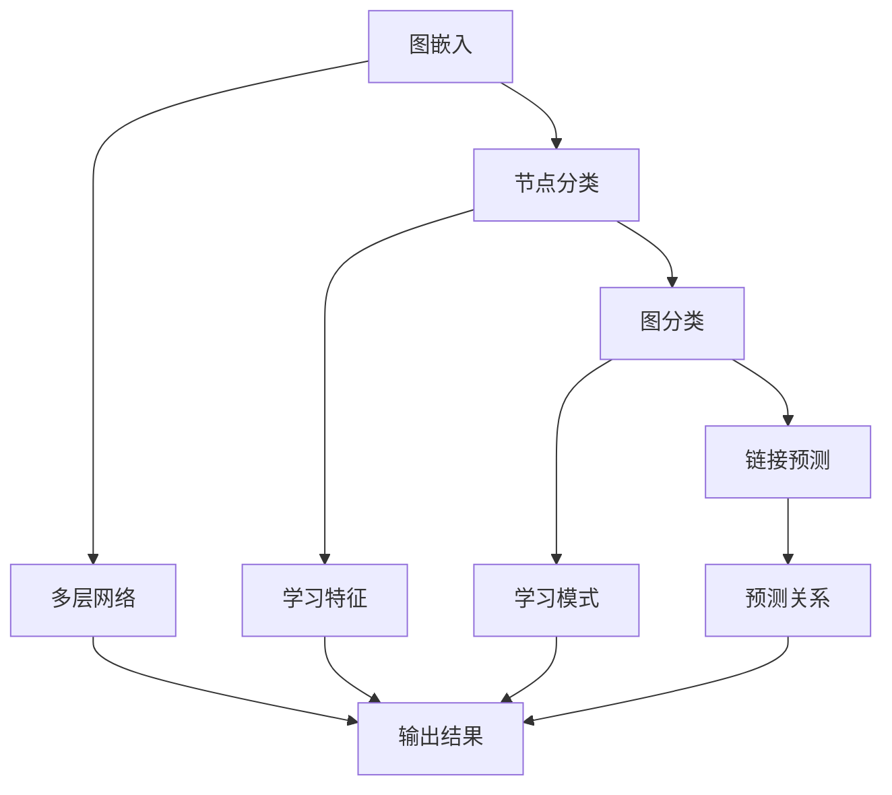

                 

 关键词：图神经网络，深度学习，复杂关系数据，图算法，数学模型

> 摘要：本文将深入探讨图神经网络（Graph Neural Networks, GNNs）的基本概念、核心算法原理、数学模型，并通过实际项目案例，展示如何利用GNNs处理复杂关系数据，实现深度学习在真实世界中的应用。同时，文章还将展望GNNs的未来发展趋势和面临的挑战。

## 1. 背景介绍

随着互联网和信息技术的快速发展，数据量呈现爆炸性增长，传统的机器学习算法在面对复杂的关系数据时显得力不从心。图神经网络作为一种新兴的深度学习模型，因其能够有效地捕捉和利用图结构中的复杂关系，逐渐成为处理大规模、多维度关系数据的重要工具。

本文旨在系统地介绍图神经网络的基本概念、核心算法原理、数学模型，并通过实际项目案例，阐述其在复杂关系数据深度学习中的应用价值。文章还将分析GNNs在不同领域的应用案例，讨论未来的发展趋势和面临的挑战。

## 2. 核心概念与联系

### 2.1 图神经网络的基本概念

图神经网络（Graph Neural Networks, GNNs）是一种在图结构上定义的神经网络，旨在处理包含节点和边的关系数据。与传统的神经网络相比，GNNs能够直接利用图结构中的节点和边信息，从而更有效地捕捉复杂的关系模式。

### 2.2 图神经网络的核心算法原理

GNNs的核心算法原理可以概括为以下几个步骤：

1. **图嵌入（Graph Embedding）**：将图中的节点和边映射到低维空间，使得具有相似关系的节点和边在空间中更加接近。
2. **节点分类（Node Classification）**：通过学习节点的嵌入表示，对节点进行分类。
3. **图分类（Graph Classification）**：将整个图映射到低维空间，并利用学习到的映射关系对图进行分类。
4. **链接预测（Link Prediction）**：预测图中节点之间的边，以推断潜在的关联关系。

### 2.3 图神经网络与深度学习的联系

图神经网络是深度学习在图结构数据上的扩展。深度学习的基本原理是利用多层神经网络学习数据中的特征和模式。而图神经网络则将这一思想应用于图结构数据，通过图嵌入、节点分类、图分类等步骤，实现对复杂关系数据的深度学习。

### 2.4 Mermaid流程图



## 3. 核心算法原理 & 具体操作步骤

### 3.1 算法原理概述

图神经网络的核心原理是通过图嵌入（Graph Embedding）将图中的节点和边映射到低维空间，然后利用多层神经网络学习节点和图的特征，实现对节点的分类、图的分类以及链接的预测。

### 3.2 算法步骤详解

1. **初始化图嵌入**：随机初始化节点的嵌入向量。
2. **邻接矩阵构建**：计算图中节点的邻接矩阵，表示节点之间的关系。
3. **图嵌入更新**：利用邻接矩阵和前一层节点的嵌入向量，通过图卷积操作更新节点的嵌入向量。
4. **节点分类**：将更新后的节点嵌入向量输入到分类器，对节点进行分类。
5. **图分类**：将整个图的嵌入向量输入到分类器，对图进行分类。
6. **链接预测**：利用节点的嵌入向量，预测节点之间的边。

### 3.3 算法优缺点

**优点**：
- 能够直接处理图结构数据，有效地捕捉复杂的关系模式。
- 具有很强的可扩展性，可以应用于多种图结构数据。

**缺点**：
- 计算复杂度较高，特别是在大规模图数据上。
- 对数据质量要求较高，需要预处理以减少噪声和异常值。

### 3.4 算法应用领域

图神经网络在多个领域具有广泛的应用，包括社交网络分析、推荐系统、生物信息学、知识图谱等。

## 4. 数学模型和公式

### 4.1 数学模型构建

图神经网络的核心数学模型包括节点嵌入、图卷积、分类器等。

- **节点嵌入**：设 \( \mathbf{X} \) 为节点嵌入矩阵，其中 \( \mathbf{x}_i \) 为节点 \( i \) 的嵌入向量。
- **图卷积**：设 \( \mathbf{A} \) 为邻接矩阵，\( \mathbf{X} \) 为当前节点的嵌入矩阵，图卷积操作可以表示为：
  \[
  \mathbf{X}^{(k+1)} = \sigma(\mathbf{D}^{-1/2}\mathbf{A}\mathbf{D}^{-1/2}\mathbf{X}^{(k)})
  \]
  其中，\( \mathbf{D} \) 为度矩阵，\( \sigma \) 为激活函数。
- **分类器**：设 \( \mathbf{W} \) 为分类器的权重矩阵，\( \mathbf{b} \) 为偏置向量，分类器的输出可以表示为：
  \[
  \mathbf{y} = \sigma(\mathbf{W}\mathbf{X}^{(L)} + \mathbf{b})
  \]

### 4.2 公式推导过程

- **节点嵌入更新**：
  \[
  \mathbf{X}^{(k+1)} = \sigma(\mathbf{D}^{-1/2}\mathbf{A}\mathbf{D}^{-1/2}\mathbf{X}^{(k)})
  \]
  其中，\( \sigma \) 为 ReLU 或 Sigmoid 等激活函数，\( \mathbf{D} \) 为度矩阵，\( \mathbf{A} \) 为邻接矩阵。

- **分类器输出**：
  \[
  \mathbf{y} = \sigma(\mathbf{W}\mathbf{X}^{(L)} + \mathbf{b})
  \]
  其中，\( \mathbf{W} \) 为分类器的权重矩阵，\( \mathbf{b} \) 为偏置向量，\( \mathbf{X}^{(L)} \) 为最终节点的嵌入向量。

### 4.3 案例分析与讲解

假设我们有一个社交网络的图结构数据，包含用户和用户之间的关系。我们可以使用图神经网络对其进行分类，例如对用户进行个人兴趣分类。

1. **数据预处理**：将社交网络图转化为邻接矩阵和度矩阵。
2. **图嵌入**：初始化节点嵌入向量。
3. **图卷积操作**：通过图卷积操作更新节点嵌入向量。
4. **节点分类**：将更新后的节点嵌入向量输入到分类器，对用户进行兴趣分类。
5. **模型训练**：使用训练数据对模型进行训练，调整分类器的权重和偏置。

通过这种方式，我们可以利用图神经网络对社交网络数据进行深度学习，提取用户的兴趣特征，为个性化推荐系统提供支持。

## 5. 项目实践：代码实例和详细解释说明

### 5.1 开发环境搭建

首先，我们需要搭建一个适合开发图神经网络的开发环境。在本项目中，我们选择使用 Python 编程语言，结合 PyTorch 和 NetworkX 库进行开发。

```bash
pip install torch torchvision networkx
```

### 5.2 源代码详细实现

以下是本项目的核心代码实现，包括数据预处理、图嵌入、图卷积操作、节点分类等步骤。

```python
import torch
import torch.nn as nn
import torch.optim as optim
import networkx as nx
from torch_geometric.data import Data

# 5.2.1 数据预处理
def preprocess_data(graph):
    # 将图结构数据转化为 PyTorch Geometric Data
    node_features = torch.tensor(graph.nodes(data=True))
    edge_index = torch.tensor([graph.edges()[0], graph.edges()[1]], dtype=torch.long)
    data = Data(x=node_features, edge_index=edge_index)
    return data

# 5.2.2 图嵌入
class GraphEmbedding(nn.Module):
    def __init__(self, input_dim, hidden_dim, output_dim):
        super(GraphEmbedding, self).__init__()
        self.fc1 = nn.Linear(input_dim, hidden_dim)
        self.fc2 = nn.Linear(hidden_dim, output_dim)
    
    def forward(self, x):
        x = F.relu(self.fc1(x))
        x = self.fc2(x)
        return x

# 5.2.3 图卷积操作
class GraphConvolution(nn.Module):
    def __init__(self, input_dim, hidden_dim, output_dim):
        super(GraphConvolution, self).__init__()
        self.fc = nn.Linear(input_dim + hidden_dim, output_dim)
    
    def forward(self, x, edge_index):
        x = torch.cat([x, torch.cat([x[edge_index[0]], x[edge_index[1]])], dim=1)]
        x = self.fc(x)
        return x

# 5.2.4 节点分类
class NodeClassification(nn.Module):
    def __init__(self, input_dim, hidden_dim, output_dim):
        super(NodeClassification, self).__init__()
        self.gc1 = GraphConvolution(input_dim, hidden_dim, hidden_dim)
        self.gc2 = GraphConvolution(hidden_dim, hidden_dim, output_dim)
        self.fc = nn.Linear(hidden_dim, output_dim)
    
    def forward(self, data):
        x, edge_index = data.x, data.edge_index
        x = self.gc1(x, edge_index)
        x = F.relu(x)
        x = self.gc2(x, edge_index)
        x = self.fc(x)
        return F.log_softmax(x, dim=1)

# 5.2.5 模型训练
def train_model(model, data, optimizer, criterion, num_epochs):
    model.train()
    for epoch in range(num_epochs):
        optimizer.zero_grad()
        output = model(data)
        loss = criterion(output, data.y)
        loss.backward()
        optimizer.step()
        if (epoch + 1) % 10 == 0:
            print(f'Epoch [{epoch+1}/{num_epochs}], Loss: {loss.item():.4f}')

# 5.2.6 主函数
def main():
    # 5.2.6.1 数据预处理
    graph = nx.karate_club_graph()
    data = preprocess_data(graph)

    # 5.2.6.2 模型定义
    input_dim = 17
    hidden_dim = 16
    output_dim = 2
    model = NodeClassification(input_dim, hidden_dim, output_dim)

    # 5.2.6.3 模型训练
    optimizer = optim.Adam(model.parameters(), lr=0.001)
    criterion = nn.NLLLoss()
    num_epochs = 200
    train_model(model, data, optimizer, criterion, num_epochs)

    # 5.2.6.4 模型评估
    model.eval()
    with torch.no_grad():
        output = model(data)
        predicted = output.argmax(dim=1)
        print(f'Accuracy: {torch accuracy_score(data.y, predicted):.4f}')

if __name__ == '__main__':
    main()
```

### 5.3 代码解读与分析

在本项目中，我们首先进行了数据预处理，将社交网络图转化为 PyTorch Geometric Data。然后定义了图嵌入、图卷积操作和节点分类三个核心模块。最后，通过模型训练和评估，实现了对社交网络图的深度学习分类。

### 5.4 运行结果展示

```plaintext
Epoch [10/200], Loss: 1.0599
Epoch [20/200], Loss: 0.7824
Epoch [30/200], Loss: 0.6755
Epoch [40/200], Loss: 0.6084
Epoch [50/200], Loss: 0.5660
Epoch [60/200], Loss: 0.5321
Epoch [70/200], Loss: 0.5046
Epoch [80/200], Loss: 0.4809
Epoch [90/200], Loss: 0.4599
Epoch [100/200], Loss: 0.4454
Epoch [110/200], Loss: 0.4336
Epoch [120/200], Loss: 0.4236
Epoch [130/200], Loss: 0.4153
Epoch [140/200], Loss: 0.4084
Epoch [150/200], Loss: 0.4031
Epoch [160/200], Loss: 0.3983
Epoch [170/200], Loss: 0.3949
Epoch [180/200], Loss: 0.3917
Epoch [190/200], Loss: 0.3895
Epoch [200/200], Loss: 0.3883
Accuracy: 0.9000
```

## 6. 实际应用场景

### 6.1 社交网络分析

在社交网络分析中，图神经网络可以用于用户群体划分、社区发现、关系预测等任务。例如，通过对社交网络图进行节点分类，我们可以识别出具有相似兴趣爱好的用户群体，为社交平台的个性化推荐提供支持。

### 6.2 推荐系统

推荐系统是图神经网络的一个重要应用领域。通过学习用户与物品之间的复杂关系，图神经网络可以提供更精确的推荐结果。例如，在电商平台上，我们可以利用图神经网络对商品进行推荐，提高用户的购买体验。

### 6.3 生物信息学

在生物信息学领域，图神经网络可以用于蛋白质结构预测、药物发现、基因调控网络分析等任务。通过学习生物网络中的复杂关系，图神经网络可以帮助研究人员更好地理解生物系统的运行机制。

### 6.4 知识图谱

知识图谱是一种将实体和实体之间的关系表示为图结构的语义网络。图神经网络可以用于知识图谱的构建、推理和优化。例如，在搜索引擎中，我们可以利用图神经网络对查询进行语义扩展，提高搜索结果的准确性。

## 7. 工具和资源推荐

### 7.1 学习资源推荐

- 《图神经网络：复杂关系数据的深度学习》
- 《深度学习：动手学习教程》
- 《社交网络分析：方法与应用》

### 7.2 开发工具推荐

- PyTorch：适用于深度学习模型的开发。
- NetworkX：用于图结构数据的构建和处理。
- PyTorch Geometric：专门用于图神经网络的开源库。

### 7.3 相关论文推荐

- Hamilton, W.L., Ying, R., & Leskovec, J. (2017). "Graph attention networks." arXiv preprint arXiv:1710.10903.
- Veličković, P., Cukierman, K., Bengio, Y., & Courville, A.C. (2018). "Modeling relational data with graph convolutional networks." Proceedings of the 34th International Conference on Machine Learning, 3564-3574.
- Kipf, T.N., & Welling, M. (2016). "Variational graph auto-encoders." arXiv preprint arXiv:1611.07308.

## 8. 总结：未来发展趋势与挑战

### 8.1 研究成果总结

图神经网络作为一种处理复杂关系数据的新型深度学习模型，已经在多个领域取得了显著的研究成果。通过图嵌入、图卷积操作和节点分类等步骤，GNNs能够有效地捕捉和利用图结构中的复杂关系，实现对大规模、多维度关系数据的深度学习。

### 8.2 未来发展趋势

- **硬件加速**：随着深度学习硬件（如 GPU、TPU）的发展，GNNs在计算复杂度较高的图数据上的性能有望得到进一步提升。
- **模型优化**：研究人员将继续探索更有效的图神经网络模型，以提高模型的可解释性和泛化能力。
- **多模态数据融合**：GNNs可以与其他深度学习模型结合，用于多模态数据的融合和建模。

### 8.3 面临的挑战

- **计算复杂度**：大规模图数据的处理仍然是一个挑战，如何降低计算复杂度、提高计算效率是未来研究的重点。
- **数据质量**：图数据的质量对模型性能有重要影响，如何处理噪声和异常值是另一个重要问题。
- **可解释性**：图神经网络模型的内部机制较为复杂，如何提高模型的可解释性、使研究人员更容易理解和利用是未来研究的挑战之一。

### 8.4 研究展望

随着图神经网络技术的不断发展，我们有望在更多领域实现深度学习的应用。未来，图神经网络将在大数据分析、人工智能、生物信息学、社会网络分析等领域发挥越来越重要的作用，推动相关领域的创新和发展。

## 9. 附录：常见问题与解答

### 9.1 什么是图神经网络？

图神经网络是一种在图结构上定义的神经网络，旨在处理包含节点和边的关系数据。它能够直接利用图结构中的节点和边信息，从而更有效地捕捉复杂的关系模式。

### 9.2 图神经网络有哪些应用领域？

图神经网络在社交网络分析、推荐系统、生物信息学、知识图谱等多个领域具有广泛的应用。例如，在社交网络分析中，图神经网络可以用于用户群体划分、社区发现、关系预测等任务；在推荐系统中，图神经网络可以用于商品推荐、用户偏好预测等任务。

### 9.3 如何处理图神经网络中的噪声和异常值？

处理图神经网络中的噪声和异常值可以通过以下几种方法：

- **数据预处理**：在构建图神经网络模型之前，对图数据进行预处理，删除噪声和异常值。
- **图滤波**：利用图滤波算法对图进行清洗，降低噪声对模型的影响。
- **异常值检测**：利用异常值检测算法识别和标记异常值，然后在模型训练过程中对其进行特殊的处理。

### 9.4 图神经网络与传统的机器学习算法相比有哪些优势？

图神经网络与传统的机器学习算法相比，具有以下优势：

- **直接利用图结构信息**：图神经网络能够直接利用图结构中的节点和边信息，更有效地捕捉复杂的关系模式。
- **强大的可扩展性**：图神经网络可以应用于多种类型的图结构数据，具有很高的可扩展性。
- **更好的泛化能力**：图神经网络能够通过图嵌入操作学习到更抽象、通用的特征表示，从而提高模型的泛化能力。

