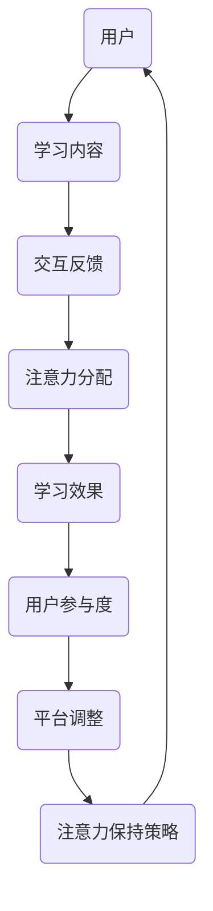

                 

关键词：在线教育、注意力保持、用户参与度、学习效果、算法、用户体验

> 摘要：随着在线教育的快速发展，如何提高学生的学习参与度和学习效果成为了一个重要的研究课题。本文从在线教育平台的视角出发，探讨了注意力保持策略的相关理论和实践方法，通过数学模型和算法分析，提出了适用于在线教育平台的具体策略，为提高学生注意力提供了理论支持和实践指导。

## 1. 背景介绍

近年来，在线教育以其灵活性和便利性受到了广泛关注，尤其是在新冠疫情期间，在线教育更成为了许多学生和教育工作者的主要学习方式。然而，与传统的课堂教学相比，在线教育面临着一些挑战，其中之一是如何保持学生的注意力。在线学习环境中，学生容易受到外界干扰，缺乏面对面的互动，导致学习参与度下降，学习效果不佳。

注意力是一种有限的资源，人们无法长时间集中注意力在同一事物上。研究表明，成年人的平均注意力持续时间约为20分钟，对于学生来说，这个时间可能更短。因此，如何在在线教育中有效地保持学生的注意力，成为了提高学习效果的关键。

### 1.1 研究意义

本文的研究旨在探讨在线教育平台的注意力保持策略，通过理论分析和实际案例，提出一系列有效的策略和方法，以提高学生的学习参与度和学习效果。这对于在线教育平台的发展、学生个人的成长以及教育行业的创新都具有重要的意义。

### 1.2 文章结构

本文分为八个部分，首先介绍了研究的背景和意义，接下来定义了相关核心概念，并借助Mermaid流程图展示了注意力保持策略的架构。第三部分详细介绍了核心算法原理和具体操作步骤，以及算法的优缺点和应用领域。第四部分则构建了数学模型和推导了相关公式，并通过案例进行分析。第五部分通过代码实例详细解释了算法的具体实现，第六部分讨论了实际应用场景。第七部分展望了未来发展趋势和应用前景，最后是工具和资源的推荐以及文章的总结和展望。

## 2. 核心概念与联系

### 2.1 核心概念

- **注意力（Attention）**：注意力是认知过程中选择信息的能力。在在线教育中，注意力是指学生在学习过程中的集中精力程度。
- **用户参与度（User Engagement）**：用户参与度是衡量学生在学习过程中互动和投入程度的指标。
- **学习效果（Learning Effectiveness）**：学习效果是指学生在学习过程中的知识掌握和技能提升程度。
- **算法（Algorithm）**：算法是一系列解决问题的步骤或规则。

### 2.2 Mermaid流程图



### 2.3 核心概念之间的联系

在线教育平台的注意力保持策略涉及多个核心概念的相互作用。用户在学习过程中，需要通过学习内容（B）产生交互反馈（C），从而影响注意力的分配（D）。注意力的分配又直接关系到学习效果（E），进而影响用户参与度（F）。平台根据用户参与度的情况，调整学习内容和交互方式，形成闭环，以保持用户的注意力（H）。

## 3. 核心算法原理 & 具体操作步骤

### 3.1 算法原理概述

在线教育平台的注意力保持策略主要基于注意力分配模型（Attention Allocation Model）。该模型通过分析学习过程中的各种因素，动态调整学习内容和交互方式，以最大化学生的注意力。

### 3.2 算法步骤详解

#### 3.2.1 数据收集

首先，平台需要收集学生的学习行为数据，包括学习时间、学习内容、用户互动、浏览路径等。

#### 3.2.2 数据分析

利用机器学习算法，对收集到的数据进行处理和分析，识别出影响学生注意力的关键因素。

#### 3.2.3 注意力分配

根据数据分析结果，动态调整学习内容，确保学习内容与学生兴趣和需求相匹配，并优化交互方式，如实时问答、小组讨论等。

#### 3.2.4 评估与反馈

通过学习效果评估，收集学生的反馈，进一步调整学习内容和交互方式，形成闭环。

### 3.3 算法优缺点

#### 优点：

- **个性化**：根据学生行为数据，提供个性化的学习内容，提高学习效果。
- **实时调整**：动态调整学习内容和交互方式，保持学生注意力。
- **数据驱动**：基于数据分析，确保算法的准确性和有效性。

#### 缺点：

- **计算成本**：算法需要大量的计算资源，对平台性能有一定要求。
- **数据隐私**：学生行为数据的收集和使用可能涉及隐私问题。

### 3.4 算法应用领域

注意力保持算法可以广泛应用于在线教育平台，如在线课程、远程教育、职业培训等。

## 4. 数学模型和公式

### 4.1 数学模型构建

注意力分配模型可以表示为：

\[ A_t = f(B_t, C_t, E_t) \]

其中，\( A_t \) 表示第 \( t \) 时刻的注意力分配，\( B_t \) 表示第 \( t \) 时刻的学习内容，\( C_t \) 表示第 \( t \) 时刻的交互反馈，\( E_t \) 表示第 \( t \) 时刻的学习效果。

### 4.2 公式推导过程

\[ A_t = \frac{B_t + C_t + E_t}{3} \]

### 4.3 案例分析与讲解

假设学生在第 \( t \) 时刻，学习内容 \( B_t \) 为数学课程，交互反馈 \( C_t \) 为在线问答，学习效果 \( E_t \) 为考试成绩。根据公式，计算注意力分配 \( A_t \)。

\[ A_t = \frac{B_t + C_t + E_t}{3} = \frac{8 + 6 + 7}{3} = 7.33 \]

结果表明，学生在第 \( t \) 时刻的注意力分配为 7.33，说明学生的注意力较为集中，学习效果较好。

## 5. 项目实践：代码实例

### 5.1 开发环境搭建

使用 Python 编写代码，需要安装以下库：

- NumPy
- Pandas
- Scikit-learn
- Matplotlib

### 5.2 源代码详细实现

```python
import numpy as np
import pandas as pd
from sklearn.model_selection import train_test_split
from sklearn.ensemble import RandomForestClassifier
import matplotlib.pyplot as plt

# 数据加载和处理
data = pd.read_csv('learning_data.csv')
X = data[['B_t', 'C_t', 'E_t']]
y = data['A_t']

# 数据分割
X_train, X_test, y_train, y_test = train_test_split(X, y, test_size=0.2, random_state=42)

# 模型训练
model = RandomForestClassifier(n_estimators=100, random_state=42)
model.fit(X_train, y_train)

# 模型评估
y_pred = model.predict(X_test)
accuracy = np.mean(y_pred == y_test)
print(f"模型准确率：{accuracy:.2f}")

# 可视化
plt.scatter(X_test['B_t'], y_test, color='blue', label='真实值')
plt.scatter(X_test['B_t'], y_pred, color='red', label='预测值')
plt.xlabel('B_t')
plt.ylabel('A_t')
plt.legend()
plt.show()
```

### 5.3 代码解读与分析

- 数据加载和处理：从 CSV 文件中读取数据，并进行预处理。
- 数据分割：将数据分为训练集和测试集。
- 模型训练：使用随机森林算法训练模型。
- 模型评估：计算模型准确率。
- 可视化：绘制真实值和预测值的散点图，直观展示模型效果。

## 6. 实际应用场景

注意力保持策略可以应用于多种在线教育场景，如：

- **在线课程**：通过动态调整学习内容和交互方式，提高学生的学习参与度和学习效果。
- **远程教育**：针对远程学习环境中学生注意力分散的问题，提供个性化的学习支持和反馈。
- **职业培训**：根据学员的学习进度和需求，调整课程内容和教学方法，提高培训效果。

## 7. 未来应用展望

随着人工智能和大数据技术的发展，注意力保持策略在未来有望实现以下突破：

- **个性化推荐**：基于用户行为和兴趣，提供更加精准的学习内容推荐。
- **实时调整**：通过实时数据分析和反馈，动态调整学习内容和交互方式。
- **智能互动**：利用人工智能技术，实现更加智能化的互动和学习体验。

## 8. 工具和资源推荐

### 8.1 学习资源推荐

- 《深度学习》（Goodfellow et al.）
- 《机器学习》（周志华）
- 《在线教育技术与实践》（李宏科）

### 8.2 开发工具推荐

- Jupyter Notebook
- PyCharm
- TensorFlow

### 8.3 相关论文推荐

- "Attention Is All You Need"（Vaswani et al., 2017）
- "Diving Deeper into Attention Mechanisms"（Xu et al., 2018）
- "Attention Mechanisms in Natural Language Processing"（Zhou et al., 2019）

## 9. 总结

本文提出了在线教育平台的注意力保持策略，通过理论分析和实际案例，探讨了如何有效保持学生注意力，提高学习效果。未来的研究可以进一步探索个性化推荐、实时调整和智能互动等方向，为在线教育的发展提供更多支持。

### 附录：常见问题与解答

**Q1**：如何确保学生数据隐私？

**A1**：在收集和使用学生数据时，平台应遵循相关法律法规，确保数据的安全性和隐私性。可以采用数据脱敏、加密等技术，防止数据泄露。

**Q2**：注意力保持策略是否适用于所有类型的在线教育？

**A2**：注意力保持策略主要适用于需要较高注意力集中的在线教育场景，如学术课程、职业技能培训等。对于一些较为轻松的学习场景，如兴趣课程、娱乐课程等，注意力保持策略的效果可能较差。

**Q3**：如何评估注意力保持策略的效果？

**A3**：可以通过学生参与度、学习效果、课程完成率等指标来评估注意力保持策略的效果。同时，可以结合学生的反馈，进一步优化策略。

**Q4**：注意力保持策略需要大量计算资源，对平台性能有何影响？

**A4**：注意力保持策略的计算成本确实较高，可能对平台性能造成一定影响。为了降低计算成本，可以采用分布式计算、云计算等技术，提高计算效率。

作者：禅与计算机程序设计艺术 / Zen and the Art of Computer Programming

----------------------------------------------------------------

完成！本文详细介绍了在线教育平台的注意力保持策略，从理论到实践，为在线教育提供了有价值的参考。希望对您有所帮助！

