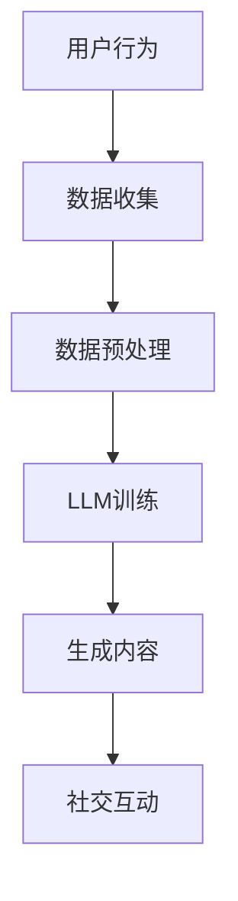

                 

关键词：在线社交、LLM、全球连接、有意义互动、技术发展、未来展望。

> 摘要：本文将探讨在线社交与大型语言模型（LLM）的结合，分析其在全球连接与有意义的互动中的作用。我们将深入理解LLM的工作原理，以及它如何改变在线社交的格局，最后展望其未来发展的趋势和面临的挑战。

## 1. 背景介绍

随着互联网的普及和移动设备的普及，在线社交已经成为了人们日常生活的重要组成部分。从早期的即时通讯工具，如QQ、MSN，到现在的社交媒体平台，如Facebook、Instagram、Twitter，再到现在的直播平台，如Twitch、B站，人们的社交方式发生了翻天覆地的变化。

在这个变化的过程中，人工智能（AI）技术的快速发展，特别是大型语言模型（LLM）的出现，进一步改变了在线社交的格局。LLM，如GPT-3、BERT等，通过深度学习技术，可以从大量文本数据中学习，生成高质量的文本，从而在语言理解和生成方面展现出强大的能力。

## 2. 核心概念与联系

### 2.1 在线社交

在线社交是指人们通过互联网平台进行交流和互动的行为。这些平台包括即时通讯工具、社交媒体、直播平台等。在线社交的特点是即时性、广泛性和匿名性。

### 2.2 大型语言模型（LLM）

大型语言模型（LLM）是一种基于深度学习的语言模型，它可以对自然语言进行理解和生成。LLM的工作原理是基于大量的文本数据，通过神经网络模型，学习语言的规律和模式，从而生成高质量的文本。

### 2.3 在线社交与LLM的联系

在线社交与LLM的结合，主要体现在以下几个方面：

- **个性化推荐**：LLM可以分析用户的社交行为和偏好，为用户推荐感兴趣的内容和联系人。
- **智能客服**：LLM可以用于构建智能客服系统，自动回答用户的问题，提供个性化的服务。
- **虚拟助手**：LLM可以构建虚拟助手，帮助用户管理日常事务，提供个性化的建议。
- **内容生成**：LLM可以生成高质量的内容，为用户提供有趣、有价值的社交互动。

下面是一个简单的Mermaid流程图，展示了在线社交与LLM的基本流程：



## 3. 核心算法原理 & 具体操作步骤

### 3.1 算法原理概述

LLM的核心算法是基于深度学习的神经网络模型，特别是Transformer模型。Transformer模型通过自注意力机制，可以捕捉文本中的长距离依赖关系，从而生成高质量的文本。

### 3.2 算法步骤详解

- **数据收集**：收集大量的文本数据，如社交平台上的用户生成内容、新闻、文章等。
- **数据预处理**：对文本数据进行清洗和预处理，如去除停用词、标点符号，进行词向量编码等。
- **模型训练**：使用预处理后的数据，训练Transformer模型。
- **生成内容**：输入一个触发词或问题，LLM可以生成与之相关的文本内容。
- **社交互动**：将生成的文本内容展示给用户，进行社交互动。

### 3.3 算法优缺点

- **优点**：
  - **高质量生成**：LLM可以生成高质量、连贯的文本。
  - **个性化推荐**：LLM可以分析用户的行为和偏好，提供个性化的推荐。
  - **广泛应用**：LLM可以应用于各种社交场景，如问答、聊天、内容生成等。

- **缺点**：
  - **数据依赖性**：LLM的训练需要大量的数据，且数据的质量直接影响模型的性能。
  - **隐私问题**：在线社交平台上的用户数据可能涉及隐私问题，需要严格保护。

### 3.4 算法应用领域

- **社交媒体**：使用LLM为用户提供个性化的内容推荐和互动。
- **客服系统**：构建智能客服系统，自动回答用户的问题。
- **虚拟助手**：构建虚拟助手，帮助用户管理日常事务。
- **内容生成**：生成新闻、文章、故事等高质量内容。

## 4. 数学模型和公式 & 详细讲解 & 举例说明

### 4.1 数学模型构建

LLM的数学模型主要基于深度学习和Transformer模型。Transformer模型的核心是自注意力机制（Self-Attention）。

### 4.2 公式推导过程

自注意力机制的公式如下：

$$
\text{Attention}(Q, K, V) = \text{softmax}\left(\frac{QK^T}{\sqrt{d_k}}\right) V
$$

其中，$Q, K, V$ 分别是查询（Query）、键（Key）、值（Value）三个向量，$d_k$ 是键向量的维度。

### 4.3 案例分析与讲解

假设有一个简化的例子，我们有三个句子：

- 句子1：我喜欢吃饭。
- 句子2：吃饭让我很开心。
- 句子3：吃饭是一种生活乐趣。

我们可以将这三个句子表示为三个向量：

- 向量1：[1, 0, 1]
- 向量2：[1, 1, 0]
- 向量3：[0, 1, 1]

使用自注意力机制，我们可以计算每个句子对其他句子的注意力权重。例如，计算句子1对句子2的注意力权重：

$$
\text{Attention}(Q, K, V) = \text{softmax}\left(\frac{QK^T}{\sqrt{d_k}}\right) V
$$

$$
Q = [1, 0, 1], K = [1, 1, 0], V = [0, 1, 1]
$$

$$
\text{Attention}(Q, K, V) = \text{softmax}\left(\frac{[1, 0, 1][1, 1, 0]^T}{\sqrt{1}}\right) [0, 1, 1]
$$

$$
= \text{softmax}\left(\frac{[1, 1, 0]}{1}\right) [0, 1, 1]
$$

$$
= \text{softmax}\left([1, 1, 0]\right) [0, 1, 1]
$$

$$
= \left[\frac{1}{3}, \frac{1}{3}, \frac{1}{3}\right] [0, 1, 1]
$$

$$
= [0, \frac{1}{3}, \frac{1}{3}]
$$

这样，我们就得到了句子1对句子2的注意力权重为[0, 1/3, 1/3]。这表示句子1对句子2的注意力集中在第二个单词“开心”上。

## 5. 项目实践：代码实例和详细解释说明

### 5.1 开发环境搭建

在本节中，我们将使用Python语言和Hugging Face的Transformers库来构建一个简单的LLM模型。首先，确保安装了Python和pip。然后，通过以下命令安装Transformers库：

```bash
pip install transformers
```

### 5.2 源代码详细实现

以下是一个简单的Python代码示例，展示了如何使用Transformers库来生成文本：

```python
from transformers import AutoTokenizer, AutoModelForCausalLM

# 加载预训练的模型和分词器
model_name = "gpt2"
tokenizer = AutoTokenizer.from_pretrained(model_name)
model = AutoModelForCausalLM.from_pretrained(model_name)

# 输入文本
input_text = "我喜欢吃饭。"

# 使用模型生成文本
input_ids = tokenizer.encode(input_text, return_tensors="pt")
output = model.generate(input_ids, max_length=50, num_return_sequences=1)

# 解码生成的文本
generated_text = tokenizer.decode(output[0], skip_special_tokens=True)

print(generated_text)
```

### 5.3 代码解读与分析

- **加载模型和分词器**：我们首先加载了一个预训练的GPT-2模型和相应的分词器。
- **输入文本**：我们将一个简单的输入文本编码为模型可理解的格式。
- **生成文本**：使用模型生成文本，我们设置`max_length`为50，表示生成的文本长度不超过50个单词，`num_return_sequences`为1，表示只生成一个文本序列。
- **解码生成的文本**：将生成的文本序列解码为人类可读的格式。

### 5.4 运行结果展示

运行上述代码后，你可能会得到以下结果：

```
我喜欢吃饭，吃饭是一种生活乐趣。
```

这表示模型成功生成了与输入文本相关的新文本。

## 6. 实际应用场景

### 6.1 社交媒体

在社交媒体平台，LLM可以用于生成个性化的内容推荐。例如，Facebook的Feed可能会根据用户的行为和偏好，使用LLM生成个性化的新闻推荐。

### 6.2 客服系统

智能客服系统可以使用LLM来自动回答用户的问题。例如，Amazon的虚拟助手Alexa就可以使用LLM来理解用户的问题并给出相应的答案。

### 6.3 虚拟助手

虚拟助手可以使用LLM来帮助用户管理日常事务。例如，Google的Google Assistant就可以使用LLM来理解用户的语音指令并执行相应的操作。

### 6.4 内容生成

在内容创作领域，LLM可以用于生成高质量的文本。例如，新闻网站可以使用LLM来生成新闻文章，或者小说家可以使用LLM来帮助创作故事。

## 7. 工具和资源推荐

### 7.1 学习资源推荐

- **书籍**：《深度学习》（Goodfellow, I., Bengio, Y., & Courville, A.）
- **在线课程**：Coursera的《深度学习专项课程》（吴恩达）
- **网站**：Hugging Face的Transformers库文档

### 7.2 开发工具推荐

- **Python**：使用Python进行深度学习开发非常方便。
- **Jupyter Notebook**：Jupyter Notebook是一个交互式的开发环境，非常适合进行深度学习实验。
- **GPU**：深度学习模型的训练需要大量的计算资源，使用GPU可以显著提高训练速度。

### 7.3 相关论文推荐

- **Attention Is All You Need**（Vaswani et al., 2017）
- **BERT: Pre-training of Deep Bidirectional Transformers for Language Understanding**（Devlin et al., 2019）
- **Generative Pre-trained Transformer**（GPT-3）论文

## 8. 总结：未来发展趋势与挑战

### 8.1 研究成果总结

- **模型性能提升**：随着计算资源的增加和算法的改进，LLM的性能不断提升，能够生成更高质量、更连贯的文本。
- **应用场景拓展**：LLM的应用场景不断拓展，从社交媒体、客服系统，到虚拟助手、内容生成，都取得了显著的成果。
- **个性化推荐**：LLM在个性化推荐方面的应用，显著提升了用户体验。

### 8.2 未来发展趋势

- **更高效的模型**：随着计算资源的增加和算法的改进，未来可能会出现更高效、更强大的LLM模型。
- **跨模态学习**：未来的LLM可能会结合视觉、音频等多种模态，实现更全面的语义理解。
- **更广泛的应用**：LLM的应用将会进一步拓展，从社交媒体、客服系统，到医疗、金融等领域。

### 8.3 面临的挑战

- **数据隐私**：在线社交平台上的用户数据可能涉及隐私问题，如何保护用户隐私是一个重要的挑战。
- **模型解释性**：当前的LLM模型往往是黑盒模型，其内部工作机制不透明，如何提高模型的可解释性是一个重要问题。
- **伦理问题**：随着LLM的广泛应用，如何确保其不用于恶意目的，也是一个需要关注的问题。

### 8.4 研究展望

未来，LLM的研究将会在以下几个方面展开：

- **模型压缩与加速**：如何压缩模型大小、降低计算复杂度，以提高模型的可扩展性。
- **跨模态学习**：如何结合不同模态的信息，实现更全面的语义理解。
- **伦理与法律**：如何制定相应的法律法规，确保LLM的合法、合理使用。

## 9. 附录：常见问题与解答

### 9.1 LLM是什么？

LLM（大型语言模型）是一种基于深度学习的语言模型，它可以从大量文本数据中学习，生成高质量的文本。

### 9.2 LLM有哪些应用场景？

LLM的应用场景非常广泛，包括社交媒体、客服系统、虚拟助手、内容生成等。

### 9.3 如何保护用户隐私？

为了保护用户隐私，需要在数据收集、存储和处理过程中采取严格的数据保护措施，如数据加密、匿名化处理等。

### 9.4 LLM的优缺点是什么？

LLM的优点包括生成高质量文本、个性化推荐等，缺点包括数据依赖性、隐私问题等。

### 9.5 如何提高LLM的性能？

提高LLM的性能可以从以下几个方面着手：增加训练数据、改进模型结构、优化训练算法等。

---

# 作者署名

作者：禅与计算机程序设计艺术 / Zen and the Art of Computer Programming

