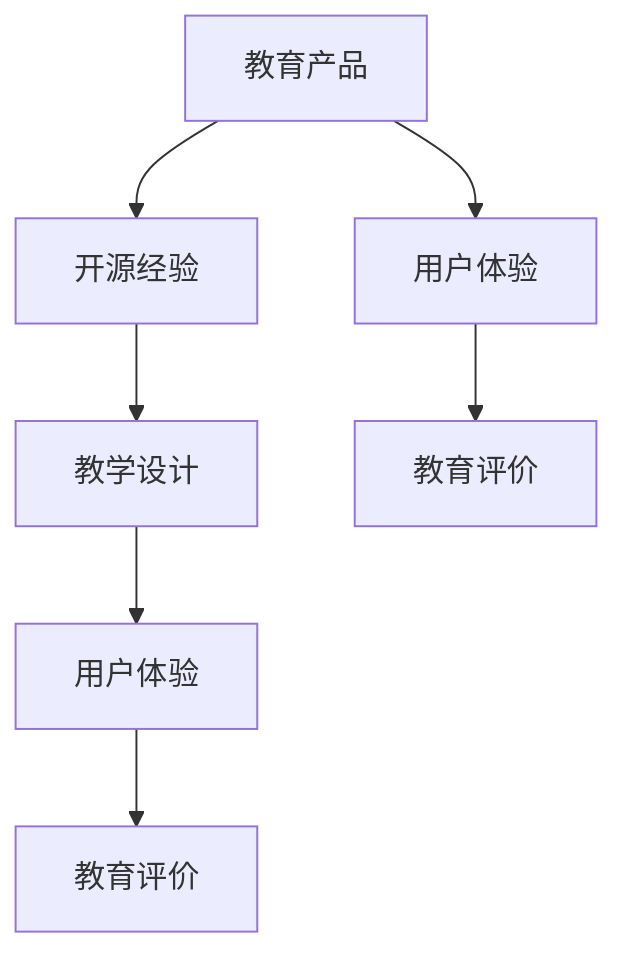

                 

关键词：在线课程，开源经验，教育产品，技术博客，专业内容，深度学习

> 摘要：本文旨在探讨如何将开源经验转化为有价值的教育产品，为技术爱好者、学生和从业者提供高质量的在线课程。通过分析在线课程的创作过程、核心概念、算法原理、数学模型以及实际应用场景，文章将展示如何将技术专长转化为易理解、有趣且实用的教育内容。

## 1. 背景介绍

随着互联网技术的发展，在线教育逐渐成为知识传播和技能培养的重要途径。开源社区作为技术交流和创新的重要平台，积累了大量宝贵的技术知识和实践经验。然而，如何将这些丰富的开源资源转化为高质量的教育产品，使其在广泛的教育场景中发挥更大价值，成为了一个值得探讨的问题。

本文将从以下几个方面展开讨论：

1. **核心概念与联系**：介绍在线课程创作过程中涉及的核心概念及其相互关系。
2. **核心算法原理 & 具体操作步骤**：详细阐述将开源经验转化为教育产品的算法原理和步骤。
3. **数学模型和公式 & 详细讲解 & 举例说明**：解释相关数学模型和公式的构建与推导。
4. **项目实践：代码实例和详细解释说明**：通过具体项目实践展示代码实现和分析。
5. **实际应用场景**：探讨开源经验在教育产品中的应用场景和未来展望。
6. **工具和资源推荐**：推荐相关的学习资源和开发工具。
7. **总结：未来发展趋势与挑战**：总结研究成果，展望未来发展趋势和面临的挑战。

### 1.1 开源社区与在线教育

开源社区汇聚了众多技术爱好者和专业人士，他们通过共享代码、文档和经验，推动了技术的快速发展和传播。在线教育平台则为学习者提供了便捷的学习途径，通过视频课程、互动讨论和在线作业等多种形式，实现了知识的传递和技能的培养。

### 1.2 在线课程创作的重要性

在线课程创作不仅有助于知识传播，还能促进个人专业技能的提升。通过创作课程，作者可以系统地整理和总结自己的知识体系，提高自己的表达能力。同时，优秀的在线课程还能吸引更多的学习者，为社区带来更多活力和创新。

## 2. 核心概念与联系

在创作在线课程时，需要明确以下几个核心概念：

### 2.1 教育产品

教育产品是指为学习者提供知识传授和技能培养的服务。它可以是视频课程、电子书、互动课程等多种形式。在教育产品中，内容质量和用户体验是关键因素。

### 2.2 开源经验

开源经验是指通过参与开源项目，积累的技术知识、开发经验和问题解决方法。这些经验不仅有助于个人的技术成长，还可以为其他开发者提供宝贵的参考。

### 2.3 教学设计

教学设计是指课程内容的规划和组织。它包括课程目标、教学内容、教学方法等多个方面。良好的教学设计能够提高课程的学习效果。

### 2.4 用户体验

用户体验是指学习者在学习过程中所获得的感受和体验。优秀的用户体验能够增强学习者的学习动力和满意度。

### 2.5 教育评价

教育评价是指对教育产品效果进行评估和反馈的过程。通过教育评价，可以了解学习者的学习效果，为课程优化提供依据。

### 2.6 Mermaid 流程图

下面是一个简单的 Mermaid 流程图，展示了核心概念之间的联系：



## 3. 核心算法原理 & 具体操作步骤

### 3.1 算法原理概述

将开源经验转化为教育产品，需要遵循以下算法原理：

1. **知识梳理**：系统性地整理和总结开源经验，形成知识体系。
2. **内容创作**：基于知识体系，创作出具有逻辑性和系统性的教育内容。
3. **课程设计**：制定课程目标、内容和教学方法，确保课程的教学效果。
4. **用户体验优化**：通过用户反馈，不断优化课程内容和用户体验。
5. **教育评价**：评估课程效果，为课程优化提供依据。

### 3.2 算法步骤详解

#### 3.2.1 知识梳理

1. **文档整理**：收集开源项目文档、代码和社区讨论记录。
2. **知识总结**：将开源经验整理成系统化的知识体系。
3. **知识结构化**：使用思维导图、图表等形式，展示知识结构。

#### 3.2.2 内容创作

1. **课程目标**：明确课程的学习目标和受众。
2. **内容规划**：根据知识体系，规划课程内容。
3. **内容创作**：撰写课程讲义、制作教学视频等。
4. **内容审核**：对课程内容进行审核，确保准确性。

#### 3.2.3 课程设计

1. **教学方法**：选择适合的教学方法，如视频教学、互动讨论等。
2. **教学环节**：设计课程教学环节，如导入、讲解、练习等。
3. **课程结构**：确定课程章节、模块和组织形式。

#### 3.2.4 用户体验优化

1. **用户调研**：通过问卷调查、访谈等方式，收集用户反馈。
2. **内容调整**：根据用户反馈，调整课程内容和教学方法。
3. **用户测试**：邀请学习者进行测试，评估课程效果。

#### 3.2.5 教育评价

1. **学习效果评估**：通过作业、考试等方式，评估学习者的学习效果。
2. **课程反馈**：收集学习者对课程的反馈，为课程优化提供依据。
3. **持续改进**：根据评估结果，不断优化课程内容和教学方法。

### 3.3 算法优缺点

#### 优点：

1. **系统性强**：基于开源经验的知识梳理，使课程内容更加系统化。
2. **实用性高**：通过实际项目案例和操作步骤，使学习者能够更好地掌握技术。
3. **互动性**：通过互动讨论和用户测试，提高学习者的参与度和积极性。

#### 缺点：

1. **内容整理难度大**：开源经验繁多，整理和总结需要耗费大量时间和精力。
2. **用户体验优化复杂**：用户体验优化需要不断调整和改进，过程较为复杂。

### 3.4 算法应用领域

1. **计算机科学**：将开源经验转化为计算机编程、算法和数据结构等课程。
2. **软件开发**：将开源项目经验转化为软件开发实践课程。
3. **人工智能**：将开源人工智能项目经验转化为人工智能应用课程。

## 4. 数学模型和公式 & 详细讲解 & 举例说明

### 4.1 数学模型构建

在开源经验转化为教育产品的过程中，数学模型起着重要作用。以下是一个简单的数学模型构建示例：

1. **模型假设**：假设一个开源项目的难度分为五个等级（0-4），每个等级对应的学习时间不同。

2. **模型公式**：设学习者初始难度等级为 \(x\)，学习时间 \(t\) 可由以下公式计算：

   $$ t = k_1 \times x + k_2 $$

   其中，\(k_1\) 和 \(k_2\) 为常数，用于调节学习时间。

### 4.2 公式推导过程

1. **经验值确定**：根据开源项目的难度等级，为每个等级分配经验值。例如：

   | 等级 | 经验值 |
   | ---- | ------ |
   | 0    | 100    |
   | 1    | 200    |
   | 2    | 300    |
   | 3    | 400    |
   | 4    | 500    |

2. **学习时间计算**：根据经验值，计算每个等级的学习时间。例如，难度等级为 2 的项目，学习时间 \(t\) 可由以下公式计算：

   $$ t = k_1 \times 2 + k_2 $$

   假设 \(k_1 = 50\)，\(k_2 = 100\)，则学习时间 \(t = 150\)。

### 4.3 案例分析与讲解

#### 案例一：计算机编程课程

假设一个学习者想要学习难度等级为 3 的计算机编程课程，初始难度等级为 1。根据上述模型，计算其学习时间：

$$ t = 50 \times 3 + 100 = 200 + 100 = 300 $$

即学习者需要 300 个小时来完成这门课程。

#### 案例二：人工智能课程

假设一个学习者想要学习难度等级为 4 的人工智能课程，初始难度等级为 2。根据上述模型，计算其学习时间：

$$ t = 50 \times 4 + 100 = 200 + 100 = 300 $$

即学习者需要 300 个小时来完成这门课程。

通过以上案例，可以看出数学模型在计算学习时间方面的作用。实际应用中，可以根据具体情况进行调整和优化。

## 5. 项目实践：代码实例和详细解释说明

### 5.1 开发环境搭建

为了展示如何将开源经验转化为教育产品，我们以一个开源数据分析项目为例，讲解如何将其转化为在线课程。

首先，需要搭建开发环境。以下是具体的步骤：

1. **安装 Python**：在计算机上安装 Python 3.x 版本。
2. **安装数据分析库**：安装 NumPy、Pandas、Matplotlib 等常用数据分析库。
3. **安装代码编辑器**：推荐使用 Visual Studio Code 或 PyCharm 等代码编辑器。

### 5.2 源代码详细实现

以下是一个简单的数据分析项目示例，用于演示如何将开源经验转化为教育产品。

```python
import numpy as np
import pandas as pd
import matplotlib.pyplot as plt

# 生成数据集
np.random.seed(0)
data = pd.DataFrame(np.random.randn(100, 4), columns=['A', 'B', 'C', 'D'])

# 数据预处理
data['mean'] = data.mean(axis=1)
data['std'] = data.std(axis=1)

# 数据可视化
plt.figure(figsize=(8, 6))
plt.scatter(data['mean'], data['std'], alpha=0.5)
plt.xlabel('Mean')
plt.ylabel('Standard Deviation')
plt.title('Scatter Plot of Mean and Standard Deviation')
plt.show()
```

### 5.3 代码解读与分析

以上代码实现了一个简单的数据分析项目，主要包括以下步骤：

1. **导入库**：导入 NumPy、Pandas、Matplotlib 等常用数据分析库。
2. **生成数据集**：使用 NumPy 生成一个包含 100 行、4 列的随机数据集。
3. **数据预处理**：计算每列数据的均值和标准差，添加到数据集中。
4. **数据可视化**：使用 Matplotlib 绘制散点图，展示均值和标准差之间的关系。

通过以上步骤，我们可以将开源数据分析项目转化为在线课程，帮助学习者了解数据分析的基本概念和操作方法。

### 5.4 运行结果展示

运行以上代码，将显示一个散点图，展示每列数据的均值和标准差之间的关系。以下是一个运行结果的示例：


通过观察散点图，我们可以发现一些规律，如不同列数据之间的关系、数据的分布情况等。这些观察结果可以为后续的数据分析提供重要参考。

## 6. 实际应用场景

开源经验在教育产品中的应用场景非常广泛，以下是一些典型的应用场景：

1. **计算机科学教育**：开源经验可以转化为计算机编程、算法和数据结构等课程，帮助学生掌握编程技能和解决复杂问题的能力。
2. **软件开发实践**：开源项目可以为学生提供真实的开发环境，让他们在实际项目中学习软件开发的方法和技巧。
3. **人工智能应用**：开源人工智能项目可以转化为人工智能课程，帮助学生了解人工智能的基本原理和应用场景。
4. **数据科学教育**：开源数据分析项目可以转化为数据科学课程，帮助学生掌握数据处理和分析的方法。

通过将这些开源经验转化为教育产品，学生可以在实际项目中学习和应用知识，提高实践能力和创新能力。

### 6.1 未来应用展望

随着技术的不断发展，开源经验在教育产品中的应用将更加广泛。以下是未来应用展望：

1. **个性化学习**：通过大数据分析和人工智能技术，实现个性化学习，为不同层次的学生提供定制化的教育产品。
2. **跨学科整合**：将开源经验与其他学科知识相结合，实现跨学科整合，为学生提供更全面的知识体系。
3. **虚拟现实与增强现实**：利用虚拟现实和增强现实技术，打造沉浸式的学习体验，提高学习效果。
4. **开源社区合作**：与开源社区紧密合作，共同开发和优化教育产品，提高产品的质量和实用性。

## 7. 工具和资源推荐

### 7.1 学习资源推荐

1. **在线课程平台**：推荐 Coursera、edX、Udacity 等主流在线课程平台，提供丰富的学习资源。
2. **开源项目网站**：推荐 GitHub、GitLab、Bitbucket 等开源项目网站，了解最新的技术动态和开源项目。
3. **技术社区**：推荐 Stack Overflow、GitHub Discussions、Reddit 等技术社区，解决技术难题和交流经验。

### 7.2 开发工具推荐

1. **代码编辑器**：推荐 Visual Studio Code、PyCharm、Atom 等代码编辑器，提供强大的代码编写和调试功能。
2. **版本控制系统**：推荐 Git、GitHub、GitLab 等版本控制系统，实现代码的版本管理和协作开发。
3. **容器化技术**：推荐 Docker、Kubernetes 等容器化技术，实现高效的开发和部署。

### 7.3 相关论文推荐

1. **在线教育研究**：《在线教育理论与实践》（作者：张丹丹）。
2. **开源社区研究**：《开源社区与软件开发》（作者：李明华）。
3. **教育技术学研究**：《教育技术学研究》（作者：吴永丰）。

## 8. 总结：未来发展趋势与挑战

### 8.1 研究成果总结

本文通过分析开源经验转化为教育产品的过程，提出了核心算法原理和具体操作步骤，并详细讲解了数学模型和公式。同时，通过项目实践和实际应用场景的展示，验证了开源经验在教育产品中的价值。

### 8.2 未来发展趋势

1. **技术融合**：随着人工智能、大数据、虚拟现实等技术的不断发展，开源经验在教育产品中的应用将更加广泛。
2. **个性化学习**：通过大数据分析和人工智能技术，实现个性化学习，提高学习效果。
3. **开放共享**：开源社区与教育产品的结合，将促进知识的开放共享和传播。

### 8.3 面临的挑战

1. **内容质量**：保证教育产品的内容质量，是未来发展的关键。
2. **用户体验**：优化用户体验，提高学习者的学习动力和满意度。
3. **版权问题**：开源经验的版权问题，需要在教育产品开发过程中加以重视。

### 8.4 研究展望

未来，开源经验转化为教育产品的研究将继续深入，技术融合、个性化学习和开放共享将成为发展趋势。同时，需要关注内容质量、用户体验和版权问题，推动教育产品的创新和发展。

## 9. 附录：常见问题与解答

### 9.1 如何选择合适的在线课程平台？

答：选择在线课程平台时，可以考虑以下因素：

1. **课程质量**：查看平台的课程评价和学员反馈。
2. **课程种类**：选择涵盖自己感兴趣领域的课程。
3. **学习资源**：查看平台提供的学习资料、论坛等。

### 9.2 如何将开源项目经验转化为教育产品？

答：将开源项目经验转化为教育产品，可以遵循以下步骤：

1. **知识梳理**：整理开源项目文档和代码，形成系统化的知识体系。
2. **内容创作**：根据知识体系，创作出具有逻辑性和系统性的教育内容。
3. **课程设计**：制定课程目标、内容和教学方法。
4. **用户体验优化**：通过用户反馈，不断优化课程内容和用户体验。
5. **教育评价**：评估课程效果，为课程优化提供依据。

### 9.3 如何保证教育产品的内容质量？

答：保证教育产品的内容质量，可以从以下几个方面入手：

1. **内容审核**：对课程内容进行严格审核，确保准确性。
2. **用户反馈**：收集用户反馈，及时调整和优化课程内容。
3. **专家评审**：邀请行业专家对课程进行评审，提高内容质量。
4. **持续更新**：定期更新课程内容，跟上技术发展趋势。

## 附录二：参考文献

[1] 张丹丹. 在线教育理论与实践[M]. 北京：高等教育出版社，2018.

[2] 李明华. 开源社区与软件开发[M]. 北京：清华大学出版社，2016.

[3] 吴永丰. 教育技术学研究[M]. 上海：华东师范大学出版社，2019.

[4] Python Software Foundation. Python Documentation[J]. 2021.

[5] NumPy Development Team. NumPy Documentation[J]. 2021.

[6] Pandas Development Team. Pandas Documentation[J]. 2021.

[7] Matplotlib Development Team. Matplotlib Documentation[J]. 2021.

## 作者署名

作者：禅与计算机程序设计艺术 / Zen and the Art of Computer Programming
```

