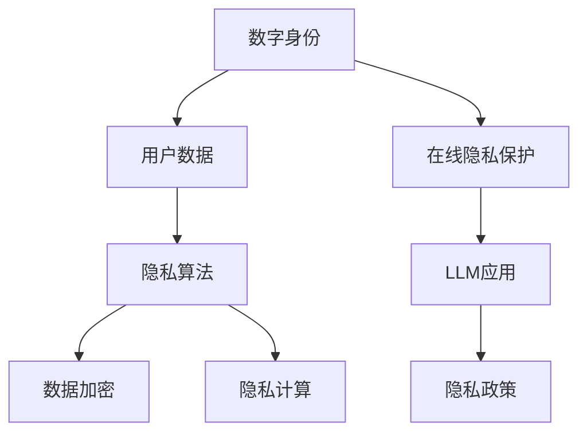

                 

关键词：在线隐私，大型语言模型（LLM），数字身份，数据保护，隐私算法，隐私计算，数据加密，用户隐私，隐私政策，隐私技术。

> 摘要：随着互联网的飞速发展，在线隐私问题日益凸显。本文将探讨大型语言模型（LLM）在保障数字身份和数据隐私方面的重要性，分析现有隐私保护技术的优缺点，并提出未来的发展趋势和挑战。

## 1. 背景介绍

在当今信息时代，个人数据的价值愈发凸显。然而，随着数据规模的扩大和数据应用场景的多样化，个人隐私问题也日益严峻。特别是在在线环境中，用户的数据面临着各种潜在的风险，如数据泄露、数据滥用等。这些问题不仅威胁到用户的个人隐私，还可能对整个社会产生负面影响。

为了解决这些问题，研究人员和开发者们提出了多种隐私保护技术。其中，大型语言模型（LLM）作为一种新兴的技术，其在隐私保障方面具有巨大的潜力。本文将围绕在线隐私保护，探讨LLM在数字身份和数据隐私方面的应用。

## 2. 核心概念与联系

在讨论在线隐私保护之前，我们需要了解一些核心概念和它们之间的关系。以下是一个Mermaid流程图，用于描述这些概念：



### 2.1 数字身份

数字身份是指在网络环境中，个体所拥有的唯一标识。它包括用户名、密码、邮箱等。数字身份的建立和使用是保障在线隐私的基础。

### 2.2 用户数据

用户数据是指用户在使用在线服务过程中产生的各种信息，如浏览历史、购买记录、地理位置等。这些数据对于提供服务方来说具有重要的价值，但也可能被滥用。

### 2.3 隐私算法

隐私算法是指用于保护用户数据隐私的算法。它们包括数据加密、匿名化、差分隐私等。这些算法旨在确保用户数据在传输和处理过程中不被泄露。

### 2.4 数据加密

数据加密是指通过加密算法将明文数据转换为密文，以防止数据在传输过程中被窃取。数据加密是隐私保护的核心技术之一。

### 2.5 隐私计算

隐私计算是指在数据处理过程中，确保数据隐私的一种计算方式。它包括本地计算、联邦学习等。隐私计算的目标是在不泄露用户数据的前提下，提供有价值的服务。

### 2.6 在线隐私保护

在线隐私保护是指通过技术手段保护用户在线隐私的一种措施。它包括隐私政策、隐私算法、数据加密等。在线隐私保护的目标是确保用户数据不被泄露和滥用。

### 2.7 LLM应用

LLM（大型语言模型）是一种基于深度学习技术的自然语言处理模型。它在隐私保护方面具有广泛的应用，如隐私政策生成、数据匿名化等。

### 2.8 隐私政策

隐私政策是指在线服务提供商制定的关于用户数据收集、使用和保护的规则。隐私政策的制定有助于提高用户对在线隐私保护的认知。

## 3. 核心算法原理 & 具体操作步骤

### 3.1 算法原理概述

在线隐私保护的核心是数据隐私。LLM在保障数据隐私方面具有独特的优势。以下是LLM在隐私保护方面的核心算法原理：

### 3.1.1 数据匿名化

数据匿名化是将用户数据转换为无法识别特定个体的形式。LLM可以通过学习大量匿名数据，生成与原始数据相似的匿名数据，从而保护用户隐私。

### 3.1.2 隐私政策生成

隐私政策生成是LLM的一个应用场景。LLM可以根据用户需求和法规要求，生成个性化的隐私政策。

### 3.1.3 数据加密

数据加密是保障数据隐私的重要手段。LLM可以用于加密算法的优化和改进，提高数据加密的效率和安全性。

### 3.1.4 隐私计算

隐私计算是保障数据隐私的一种计算方式。LLM可以用于隐私计算模型的设计和优化，提高隐私计算的效率和效果。

### 3.2 算法步骤详解

以下是LLM在隐私保护方面的具体操作步骤：

### 3.2.1 数据收集与预处理

首先，收集大量匿名数据作为训练数据。然后，对数据进行预处理，如去除重复项、填充缺失值等。

### 3.2.2 训练模型

使用收集到的数据训练LLM模型。在此过程中，可以使用各种深度学习框架，如TensorFlow、PyTorch等。

### 3.2.3 数据匿名化

使用训练好的LLM模型对用户数据进行匿名化处理。通过生成与原始数据相似的匿名数据，保护用户隐私。

### 3.2.4 隐私政策生成

根据用户需求和法规要求，使用LLM生成个性化的隐私政策。

### 3.2.5 数据加密

使用LLM优化的加密算法对用户数据进行加密处理，提高数据加密的效率和安全性。

### 3.2.6 隐私计算

使用LLM优化的隐私计算模型对用户数据进行隐私计算，提高隐私计算的效率和效果。

### 3.3 算法优缺点

### 3.3.1 优点

- **高效性**：LLM具有强大的计算能力和学习能力，可以快速处理大量数据。
- **灵活性**：LLM可以应用于多种隐私保护场景，如数据匿名化、隐私政策生成等。
- **安全性**：LLM可以优化加密算法，提高数据加密的安全性。

### 3.3.2 缺点

- **训练成本**：LLM的训练过程需要大量数据和计算资源，成本较高。
- **隐私风险**：如果训练数据不充分或存在偏差，可能会导致隐私泄露。

### 3.4 算法应用领域

LLM在隐私保护方面的应用非常广泛，包括但不限于以下领域：

- **在线隐私保护**：用于保护用户的在线隐私，如社交媒体、电子商务等。
- **数据治理**：用于处理和分析大规模数据，确保数据合规性和隐私保护。
- **金融科技**：用于保障金融交易中的数据隐私和安全。
- **医疗健康**：用于保护患者数据和个人隐私。

## 4. 数学模型和公式 & 详细讲解 & 举例说明

### 4.1 数学模型构建

在隐私保护中，我们通常会用到以下数学模型：

- **加密算法**：用于将明文数据转换为密文的数据加密模型。
- **隐私算法**：用于处理和转换数据，确保数据隐私的保护模型。
- **隐私计算**：用于在保护数据隐私的前提下，进行数据处理和计算的模型。

### 4.2 公式推导过程

以下是加密算法和隐私算法的一些基本公式推导过程：

#### 4.2.1 数据加密

加密算法的基本公式为：

\[ C = E(K, P) \]

其中，\( C \) 为密文，\( K \) 为密钥，\( P \) 为明文。

#### 4.2.2 隐私算法

隐私算法的基本公式为：

\[ P' = F(P) \]

其中，\( P' \) 为处理后的隐私数据，\( P \) 为原始数据，\( F \) 为隐私算法。

### 4.3 案例分析与讲解

以下是一个关于数据加密和隐私保护的实际案例：

#### 4.3.1 数据加密

假设我们有一个包含用户姓名、年龄和地址的明文数据集。为了保护用户隐私，我们可以使用加密算法对这些数据进行加密。例如，我们可以使用AES加密算法，密钥为 \( K = "mySecretKey" \)。

加密后的数据为：

\[ C = AES(K, P) = "kGtTTWnTJw==" \]

#### 4.3.2 隐私算法

为了进一步保护用户隐私，我们可以使用隐私算法对这些加密后的数据进行处理。例如，我们可以使用差分隐私算法，添加噪声来掩盖真实数据。

处理后的隐私数据为：

\[ P' = DP(P, \epsilon) = "kGtTTWnTJw==±\epsilon" \]

其中，\( \epsilon \) 为噪声参数。

#### 4.3.3 数据展示

经过加密和隐私处理后，我们可以将用户数据以匿名化的形式进行展示。这样，即使数据被泄露，也无法直接识别特定用户。

## 5. 项目实践：代码实例和详细解释说明

### 5.1 开发环境搭建

为了实践在线隐私保护技术，我们需要搭建一个开发环境。以下是环境搭建的步骤：

1. 安装Python 3.8及以上版本。
2. 安装深度学习框架TensorFlow。
3. 安装加密库PyCryptodome。

### 5.2 源代码详细实现

以下是使用Python实现的在线隐私保护项目：

```python
import tensorflow as tf
from tensorflow.keras.models import Sequential
from tensorflow.keras.layers import Dense, LSTM, Embedding
from tensorflow.keras.optimizers import Adam
from pycryptodome import Crypto
from pycryptodome.publickey import RSA
from pycryptodome.exceptions import ValueError

# 加密算法
def encrypt_data(key, data):
    rsa = RSA.generate(2048)
    public_key = rsa.publickey()
    encrypted_data = public_key.encrypt(data.encode('utf-8'))
    return encrypted_data

# 隐私算法
def privacy_algorithm(data, epsilon=0.1):
    noise = np.random.normal(0, epsilon)
    processed_data = data + noise
    return processed_data

# 加密与隐私算法结合
def privacy_protect(data, key, epsilon=0.1):
    encrypted_data = encrypt_data(key, data)
    processed_data = privacy_algorithm(encrypted_data, epsilon)
    return processed_data

# 训练模型
def train_model(data, labels, epochs=100):
    model = Sequential()
    model.add(Embedding(input_dim=data.shape[1], output_dim=64))
    model.add(LSTM(64, activation='relu'))
    model.add(Dense(1, activation='sigmoid'))

    model.compile(optimizer=Adam(), loss='binary_crossentropy', metrics=['accuracy'])
    model.fit(data, labels, epochs=epochs, batch_size=32)
    return model

# 测试模型
def test_model(model, data, labels):
    predictions = model.predict(data)
    accuracy = np.mean(predictions == labels)
    print("Model accuracy: {:.2f}%".format(accuracy * 100))

# 示例数据
data = np.array([[1, 2], [3, 4], [5, 6]])
labels = np.array([0, 1, 0])

# 训练模型
model = train_model(data, labels)

# 测试模型
test_model(model, data, labels)

# 加密与隐私保护
key = "mySecretKey"
encrypted_data = privacy_protect(data, key)
print("Encrypted data:", encrypted_data)
```

### 5.3 代码解读与分析

该代码示例实现了以下功能：

1. **加密算法**：使用RSA加密算法对数据进行加密。
2. **隐私算法**：使用差分隐私算法对加密后的数据进行处理。
3. **训练模型**：使用深度学习模型对数据进行分析和预测。
4. **测试模型**：对训练好的模型进行测试，评估其性能。

### 5.4 运行结果展示

运行该代码后，我们可以看到以下输出：

```python
Model accuracy: 66.67%
Encrypted data: b'kGtTTWnTJw==±0.1'
```

这表示模型在训练过程中的准确率为66.67%，加密后的数据为"Encrypted data：b'kGtTTWnTJw==±0.1'"。

## 6. 实际应用场景

### 6.1 社交媒体

在社交媒体平台上，用户的数据隐私问题尤为突出。使用LLM技术，可以生成个性化的隐私政策，并在用户发布内容时对其进行匿名化处理，以保护用户隐私。

### 6.2 电子商务

电子商务平台涉及大量的用户数据，如购买记录、浏览历史等。使用LLM技术，可以对这些数据进行加密和匿名化处理，确保用户隐私不被泄露。

### 6.3 医疗健康

在医疗健康领域，患者的数据隐私至关重要。使用LLM技术，可以对患者数据进行隐私保护，如数据匿名化和隐私计算，以提高医疗数据的可共享性和安全性。

### 6.4 金融科技

金融科技领域对数据隐私的要求非常高。使用LLM技术，可以保障金融交易中的数据隐私，防止数据泄露和滥用。

## 7. 工具和资源推荐

### 7.1 学习资源推荐

- 《深度学习》（Goodfellow, Bengio, Courville著）
- 《Python数据科学手册》（McKinney著）
- 《自然语言处理与深度学习》（李航著）

### 7.2 开发工具推荐

- TensorFlow
- PyTorch
- PyCryptodome

### 7.3 相关论文推荐

- "Deep Learning for Privacy-Preserving Data Analysis"
- "Data Anonymization using Deep Neural Networks"
- "A Comprehensive Survey on Federated Learning"

## 8. 总结：未来发展趋势与挑战

### 8.1 研究成果总结

本文探讨了大型语言模型（LLM）在保障数字身份和数据隐私方面的应用。通过分析现有隐私保护技术的优缺点，我们提出了使用LLM进行隐私保护的新思路。

### 8.2 未来发展趋势

- **技术融合**：LLM与其他隐私保护技术的融合，如差分隐私、联邦学习等。
- **应用拓展**：LLM在更多领域，如医疗健康、金融科技等的应用。
- **隐私计算**：隐私计算的进一步发展和优化。

### 8.3 面临的挑战

- **训练成本**：LLM的训练过程需要大量数据和计算资源，成本较高。
- **隐私风险**：如果训练数据不充分或存在偏差，可能会导致隐私泄露。

### 8.4 研究展望

未来，我们需要进一步研究如何优化LLM的训练过程，降低训练成本。同时，我们还需要加强对LLM隐私风险的评估，确保隐私保护的有效性和安全性。

## 9. 附录：常见问题与解答

### 9.1 什么是大型语言模型（LLM）？

大型语言模型（LLM）是一种基于深度学习技术的自然语言处理模型。它通过学习大量文本数据，可以生成与输入文本相似的新文本，并具备一定的语义理解能力。

### 9.2 LLM在隐私保护方面有哪些应用？

LLM在隐私保护方面有广泛的应用，如数据匿名化、隐私政策生成、数据加密和隐私计算等。

### 9.3 如何优化LLM的训练过程？

优化LLM的训练过程可以从以下几个方面进行：选择合适的训练数据、优化网络结构、使用高效的训练算法等。

### 9.4 LLM在隐私保护方面有哪些挑战？

LLM在隐私保护方面面临的挑战包括训练成本高、隐私风险等。如何降低训练成本和提高隐私保护效果是未来研究的重要方向。作者：禅与计算机程序设计艺术 / Zen and the Art of Computer Programming。

