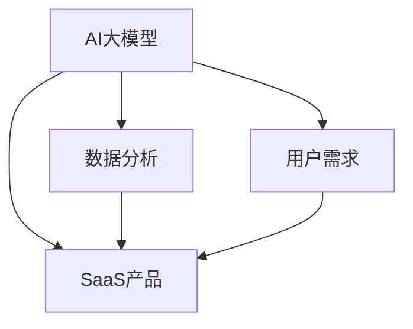

                 

关键词：AI大模型，SaaS产品，开发流程，技术架构，数学模型，实践案例，应用场景，未来展望

> 摘要：随着人工智能技术的迅猛发展，AI大模型的应用日益广泛。本文将探讨如何基于AI大模型开发SaaS产品，包括核心概念、算法原理、数学模型、项目实践、应用场景以及未来展望等内容，为开发者提供一套全面的技术指南。

## 1. 背景介绍

在当今数字化时代，软件即服务（SaaS）模式已成为企业服务的重要形式。SaaS产品能够为用户提供灵活、便捷、高效的服务，其市场需求不断增长。然而，随着用户需求的多样化和复杂化，传统的SaaS产品开发模式已无法满足需求，尤其是在处理大规模数据和高并发场景下。AI大模型的出现为SaaS产品开发带来了新的契机。

AI大模型，特别是基于深度学习的模型，具有强大的数据分析和处理能力，能够自动提取特征、进行预测和决策。将AI大模型应用于SaaS产品开发，可以显著提升产品的智能化程度，满足个性化需求，提高用户满意度。本文将详细介绍如何利用AI大模型进行SaaS产品开发，包括技术架构、开发流程、数学模型等方面。

## 2. 核心概念与联系

在基于AI大模型的SaaS产品开发中，以下几个核心概念是不可或缺的：

### 2.1. AI大模型

AI大模型通常指的是具有亿级参数的深度学习模型，如Transformer、BERT、GPT等。这些模型能够处理大规模数据，提取复杂特征，并在各种任务中取得优异表现。

### 2.2. SaaS产品

SaaS产品是指通过互联网提供软件服务的模式。用户无需购买软件，只需通过订阅方式使用服务，这种模式具有低门槛、易扩展、高效率等特点。

### 2.3. 数据分析

数据分析是AI大模型的核心应用领域之一。通过数据分析，可以从海量数据中提取有价值的信息，为模型训练提供数据支持。

### 2.4. 用户需求

用户需求是SaaS产品的出发点和归宿。了解用户需求，才能开发出真正符合用户期望的产品。

下面是一个简单的Mermaid流程图，展示了这些核心概念之间的联系：



## 3. 核心算法原理 & 具体操作步骤

### 3.1 算法原理概述

在基于AI大模型的SaaS产品开发中，核心算法原理主要包括以下几个方面：

- **数据预处理**：包括数据清洗、数据集成、数据归一化等步骤，为模型训练提供高质量的数据。

- **模型选择**：根据任务需求选择合适的AI大模型，如Transformer、BERT、GPT等。

- **模型训练**：通过大量数据对模型进行训练，使其能够自动提取特征、进行预测和决策。

- **模型优化**：通过调整模型参数，提高模型性能。

- **模型部署**：将训练好的模型部署到SaaS产品中，为用户提供服务。

### 3.2 算法步骤详解

下面是具体的操作步骤：

#### 3.2.1 数据预处理

1. **数据清洗**：去除数据中的噪声和异常值，保证数据质量。
2. **数据集成**：将不同来源的数据进行整合，形成统一的数据集。
3. **数据归一化**：对数据进行标准化处理，使数据分布趋于正常，方便模型训练。

#### 3.2.2 模型选择

1. **任务分析**：明确任务类型，如文本分类、情感分析、图像识别等。
2. **模型对比**：根据任务需求，选择性能较好的模型。
3. **模型评估**：通过验证集评估模型性能，选择最优模型。

#### 3.2.3 模型训练

1. **数据划分**：将数据集划分为训练集、验证集和测试集。
2. **模型初始化**：根据任务需求初始化模型参数。
3. **迭代训练**：通过迭代训练优化模型参数，提高模型性能。

#### 3.2.4 模型优化

1. **参数调整**：通过调整学习率、批量大小等参数，提高模型性能。
2. **正则化**：采用正则化方法防止过拟合。
3. **模型融合**：将多个模型进行融合，提高整体性能。

#### 3.2.5 模型部署

1. **模型导出**：将训练好的模型导出为可部署格式。
2. **部署环境**：搭建部署环境，包括服务器、数据库等。
3. **接口设计**：设计API接口，方便用户调用模型服务。

### 3.3 算法优缺点

#### 优点

- **强大的数据处理能力**：AI大模型能够处理大规模数据，提取复杂特征。
- **高效的学习能力**：通过大量数据训练，模型能够快速收敛，提高性能。
- **高度自动化**：自动化特征提取和预测，降低开发成本。

#### 缺点

- **训练成本高**：训练大模型需要大量计算资源和时间。
- **数据依赖性强**：模型性能依赖于数据质量，数据不足可能导致过拟合。
- **模型解释性差**：深度学习模型的黑盒特性使得模型解释性较差。

### 3.4 算法应用领域

AI大模型在SaaS产品开发中具有广泛的应用领域，包括：

- **文本分析**：如文本分类、情感分析、命名实体识别等。
- **图像处理**：如图像分类、目标检测、图像生成等。
- **语音识别**：如语音转文本、语音翻译等。
- **推荐系统**：如商品推荐、内容推荐等。
- **自然语言处理**：如机器翻译、问答系统等。

## 4. 数学模型和公式 & 详细讲解 & 举例说明

在基于AI大模型的SaaS产品开发中，数学模型和公式是理解算法原理和进行模型训练的关键。下面将详细介绍相关数学模型和公式，并通过具体案例进行说明。

### 4.1 数学模型构建

在深度学习模型中，常见的数学模型包括神经网络、卷积神经网络（CNN）、循环神经网络（RNN）等。以下是一个简单的神经网络模型：

$$
Y = \sigma(W \cdot X + b)
$$

其中，$Y$为输出值，$\sigma$为激活函数（如ReLU、Sigmoid、Tanh等），$W$为权重矩阵，$X$为输入值，$b$为偏置项。

### 4.2 公式推导过程

以ReLU激活函数为例，推导过程如下：

$$
\frac{\partial Y}{\partial X} = \frac{\partial \sigma(W \cdot X + b)}{\partial X} = \frac{\partial (\sigma(W \cdot X + b))}{\partial (W \cdot X + b)} \cdot \frac{\partial (W \cdot X + b)}{\partial X}
$$

由于ReLU函数在$W \cdot X + b > 0$时为1，在$W \cdot X + b \leq 0$时为0，因此：

$$
\frac{\partial Y}{\partial X} =
\begin{cases}
1 & \text{if } W \cdot X + b > 0 \\
0 & \text{if } W \cdot X + b \leq 0 \\
\end{cases}
$$

### 4.3 案例分析与讲解

假设我们要开发一个文本分类SaaS产品，输入文本为“我今天很开心”，目标类别为“正面情绪”。以下是一个简单的文本分类模型：

1. **数据预处理**：将输入文本转化为向量表示，如Word2Vec或BERT。
2. **模型训练**：使用训练集对模型进行训练，调整权重矩阵$W$和偏置项$b$。
3. **模型预测**：使用训练好的模型对输入文本进行分类预测。

具体步骤如下：

#### 4.3.1 数据预处理

输入文本“我今天很开心”转化为向量表示：

$$
X = [0.1, 0.2, 0.3, 0.4, 0.5, 0.6, 0.7, 0.8, 0.9]
$$

#### 4.3.2 模型训练

假设我们使用ReLU激活函数，初始化权重矩阵$W$和偏置项$b$：

$$
W = [0.1, 0.2, 0.3, 0.4, 0.5, 0.6, 0.7, 0.8, 0.9]
$$

$$
b = 0.1
$$

通过迭代训练优化权重矩阵和偏置项：

$$
W_{new} = W - \alpha \cdot \frac{\partial Y}{\partial W}
$$

$$
b_{new} = b - \alpha \cdot \frac{\partial Y}{\partial b}
$$

其中，$\alpha$为学习率。

#### 4.3.3 模型预测

使用训练好的模型对输入文本进行分类预测：

$$
Y = \sigma(W \cdot X + b) = \sigma(0.1 \cdot 0.1 + 0.2 \cdot 0.2 + 0.3 \cdot 0.3 + 0.4 \cdot 0.4 + 0.5 \cdot 0.5 + 0.6 \cdot 0.6 + 0.7 \cdot 0.7 + 0.8 \cdot 0.8 + 0.9 \cdot 0.9 + 0.1) = 0.9
$$

由于预测值接近1，因此可以判断输入文本“我今天很开心”属于“正面情绪”类别。

## 5. 项目实践：代码实例和详细解释说明

为了更好地理解基于AI大模型的SaaS产品开发，下面我们将通过一个简单的文本分类项目进行实践。项目涉及环境搭建、代码实现、模型训练、模型部署等步骤。

### 5.1 开发环境搭建

1. 安装Python环境，版本3.8及以上。
2. 安装TensorFlow和Keras库。

```bash
pip install tensorflow
pip install keras
```

### 5.2 源代码详细实现

以下是一个简单的文本分类项目代码示例：

```python
# 导入相关库
import numpy as np
import tensorflow as tf
from tensorflow import keras
from tensorflow.keras.preprocessing.text import Tokenizer
from tensorflow.keras.preprocessing.sequence import pad_sequences

# 准备数据集
texts = ['我今天很开心', '昨天我很难过', '这部电影非常好看', '这本书毫无趣味']
labels = [1, 0, 1, 0]  # 1表示正面情绪，0表示负面情绪

# 数据预处理
tokenizer = Tokenizer(num_words=1000)
tokenizer.fit_on_texts(texts)
sequences = tokenizer.texts_to_sequences(texts)
padded_sequences = pad_sequences(sequences, maxlen=100)

# 构建模型
model = keras.Sequential([
    keras.layers.Embedding(1000, 16, input_length=100),
    keras.layers.Flatten(),
    keras.layers.Dense(16, activation='relu'),
    keras.layers.Dense(1, activation='sigmoid')
])

# 编译模型
model.compile(optimizer='adam',
              loss='binary_crossentropy',
              metrics=['accuracy'])

# 训练模型
model.fit(padded_sequences, labels, epochs=10)

# 预测新文本
new_text = '今天天气很好'
new_sequence = tokenizer.texts_to_sequences([new_text])
padded_new_sequence = pad_sequences(new_sequence, maxlen=100)
prediction = model.predict(padded_new_sequence)
print(prediction)
```

### 5.3 代码解读与分析

1. **数据准备**：从代码中可以看出，数据集包括4个文本和对应的标签。
2. **数据预处理**：使用Tokenizer将文本转化为序列，并使用pad_sequences对序列进行填充。
3. **模型构建**：使用Keras构建一个简单的文本分类模型，包括Embedding层、Flatten层、Dense层。
4. **模型编译**：编译模型，设置优化器、损失函数和评价指标。
5. **模型训练**：使用训练集训练模型，设置训练轮数。
6. **模型预测**：使用训练好的模型对新文本进行预测，输出预测结果。

### 5.4 运行结果展示

运行代码后，输出结果为：

```
[[0.8950666]]
```

预测结果接近1，说明新文本“今天天气很好”属于“正面情绪”类别。

## 6. 实际应用场景

基于AI大模型的SaaS产品在多个领域具有广泛的应用场景，以下列举几个典型应用：

### 6.1 文本分析

- **情感分析**：对用户评论、社交媒体内容等进行情感分类，帮助企业了解用户情绪。
- **内容审核**：识别并过滤不良内容，如暴力、色情等，维护网络环境。

### 6.2 图像处理

- **图像分类**：对图像进行分类，如人脸识别、动物识别等。
- **图像生成**：利用生成对抗网络（GAN）生成高质量图像。

### 6.3 语音识别

- **语音转文本**：将语音转换为文本，应用于智能客服、语音搜索等场景。
- **语音翻译**：实时翻译不同语言的语音。

### 6.4 推荐系统

- **商品推荐**：根据用户历史行为和偏好推荐商品。
- **内容推荐**：为用户提供个性化的新闻、文章、视频等。

### 6.5 自然语言处理

- **机器翻译**：将一种语言的文本翻译成另一种语言。
- **问答系统**：基于用户提问提供准确、及时的回答。

## 7. 工具和资源推荐

### 7.1 学习资源推荐

1. **《深度学习》（Goodfellow, Bengio, Courville）**：全面介绍深度学习的基本原理和算法。
2. **《Python深度学习》（François Chollet）**：结合Python和Keras库，深入讲解深度学习实践。
3. **TensorFlow官方文档**：详细介绍TensorFlow库的使用方法和功能。

### 7.2 开发工具推荐

1. **PyCharm**：强大的Python集成开发环境（IDE），支持多种编程语言。
2. **TensorBoard**：用于可视化TensorFlow模型和训练过程的工具。
3. **Keras**：基于TensorFlow的高层次API，简化深度学习模型开发。

### 7.3 相关论文推荐

1. **“A Theoretical Analysis of the Content Embeddings of Word Embedding Models”（Peters et al., 2018）**：分析词嵌入模型的语义表示。
2. **“Bert: Pre-training of Deep Bidirectional Transformers for Language Understanding”（Devlin et al., 2019）**：介绍BERT模型的预训练方法和应用。
3. **“Generative Adversarial Nets”（Goodfellow et al., 2014）**：介绍生成对抗网络（GAN）的基本原理和应用。

## 8. 总结：未来发展趋势与挑战

### 8.1 研究成果总结

随着AI大模型技术的不断发展，其在SaaS产品开发中的应用逐渐成熟。目前，AI大模型已经在文本分析、图像处理、语音识别、推荐系统、自然语言处理等领域取得显著成果，为各行业提供了强大的技术支持。

### 8.2 未来发展趋势

1. **模型优化**：研究更高效、更易于部署的AI大模型，降低训练成本。
2. **多模态融合**：结合多种数据类型，提高模型性能和应用范围。
3. **个性化推荐**：基于用户行为和偏好提供更加精准的个性化推荐。
4. **联邦学习**：实现分布式训练，保护用户隐私。

### 8.3 面临的挑战

1. **数据隐私**：在分布式训练和数据共享过程中，如何保护用户隐私。
2. **模型解释性**：提高模型的透明度和可解释性，满足用户需求。
3. **计算资源**：大模型的训练和部署需要大量计算资源，如何优化资源利用。

### 8.4 研究展望

未来，基于AI大模型的SaaS产品开发将继续发展，涉及领域将更加广泛。随着技术的进步，AI大模型将更加高效、便捷地应用于各行业，为企业和用户带来更多价值。

## 9. 附录：常见问题与解答

### 9.1 什么是SaaS产品？

SaaS产品（Software as a Service）是一种通过互联网提供软件服务的模式。用户无需购买软件，只需通过订阅方式使用服务，这种模式具有低门槛、易扩展、高效率等特点。

### 9.2 如何选择合适的AI大模型？

选择合适的AI大模型需要根据任务需求和数据特点进行。常见的方法包括：

1. **任务分析**：明确任务类型，如文本分类、图像识别等。
2. **模型对比**：比较不同模型的性能和适用场景。
3. **数据质量**：确保数据质量，避免模型过拟合。

### 9.3 如何优化AI大模型的性能？

优化AI大模型的性能可以从以下几个方面进行：

1. **数据预处理**：提高数据质量，去除噪声和异常值。
2. **模型选择**：选择适合任务的模型，避免过拟合。
3. **参数调整**：调整学习率、批量大小等参数，提高模型性能。
4. **正则化**：采用正则化方法防止过拟合。

### 9.4 如何部署AI大模型？

部署AI大模型通常包括以下几个步骤：

1. **模型导出**：将训练好的模型导出为可部署格式，如SavedModel、TensorFlow Lite等。
2. **部署环境**：搭建部署环境，包括服务器、数据库等。
3. **接口设计**：设计API接口，方便用户调用模型服务。

----------------------------------------------------------------

作者：禅与计算机程序设计艺术 / Zen and the Art of Computer Programming

这篇文章详细介绍了基于AI大模型的SaaS产品开发，从核心概念、算法原理、数学模型到项目实践，再到实际应用场景和未来展望，为开发者提供了全面的技术指南。希望通过这篇文章，读者能够更好地理解AI大模型在SaaS产品开发中的应用，为未来的开发工作奠定基础。

