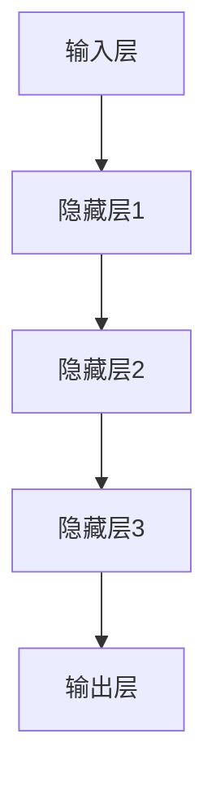

                 

关键词：人工智能、大模型、SaaS产品、开发、架构设计、算法原理、数学模型、项目实践、工具资源、未来展望

> 摘要：本文将探讨基于人工智能大模型的SaaS产品开发。首先介绍SaaS产品的背景和重要性，然后深入探讨人工智能大模型的概念和核心算法，接着详细讲解数学模型和相关公式，并通过项目实践展示代码实例和实现细节。最后，探讨SaaS产品的实际应用场景，以及未来发展的趋势和挑战。

## 1. 背景介绍

### SaaS产品的背景

SaaS（Software as a Service，软件即服务）是一种通过互联网提供软件应用的商业模式。它允许用户通过互联网访问软件服务，而无需在本地安装和运行软件。SaaS模型的出现，大大降低了软件的购买和使用成本，提高了软件的灵活性和可扩展性，因此得到了广泛的应用。

SaaS产品在各个行业都有着广泛的应用。例如，在企业管理领域，SaaS产品可以帮助企业实现客户关系管理（CRM）、企业资源规划（ERP）等；在办公领域，SaaS产品可以帮助实现文档协作、邮件管理、日程安排等；在人力资源领域，SaaS产品可以帮助实现招聘管理、员工管理、薪资管理等功能。

### SaaS产品的重要性

SaaS产品的普及，不仅为企业提供了便捷的软件服务，同时也推动了整个软件行业的发展。首先，SaaS产品降低了企业的软件采购成本，使更多中小企业能够负担得起高质量的软件服务。其次，SaaS产品的灵活性使其能够快速响应企业的需求变化，提高了企业的运营效率。此外，SaaS产品还为企业提供了数据分析工具，帮助企业更好地了解客户需求，优化业务流程。

### 人工智能与SaaS产品的结合

随着人工智能技术的快速发展，人工智能与SaaS产品的结合成为了当前的一个热点。人工智能技术可以为SaaS产品提供强大的数据分析能力，帮助企业从海量数据中提取有价值的信息，从而优化业务决策。同时，人工智能技术还可以为SaaS产品提供智能化的用户体验，提高用户的满意度和使用频率。

本文将主要探讨如何利用人工智能大模型开发SaaS产品，包括核心算法原理、数学模型构建、项目实践等内容。

## 2. 核心概念与联系

### 人工智能大模型的概念

人工智能大模型是指具有非常大规模参数的深度学习模型，通常包含数十亿甚至千亿个参数。这些模型具有强大的表示能力，可以处理复杂的任务，如自然语言处理、计算机视觉、语音识别等。

### 核心算法原理

人工智能大模型的核心算法是深度学习，特别是基于神经网络的深度学习。深度学习模型通过层层抽象，将输入数据映射到输出结果。这些模型的学习过程是通过反向传播算法来优化的，该算法通过计算输出误差，调整模型参数，从而提高模型的预测准确性。

### 架构设计

人工智能大模型的架构设计通常包括以下几个层次：

1. **输入层**：接收外部输入数据，如文本、图像、语音等。
2. **隐藏层**：通过多层非线性变换，对输入数据进行特征提取和抽象。
3. **输出层**：根据隐藏层的输出，生成最终预测结果。

### Mermaid 流程图

以下是人工智能大模型的 Mermaid 流程图：



## 3. 核心算法原理 & 具体操作步骤

### 3.1 算法原理概述

深度学习是人工智能的核心技术之一，其基本思想是通过多层神经网络模拟人脑的感知和学习能力。在深度学习中，模型通过学习大量的训练数据，自动提取数据中的特征，并利用这些特征进行预测和决策。

深度学习模型主要由以下几个部分组成：

1. **输入层**：接收外部输入数据，如文本、图像、语音等。
2. **隐藏层**：通过多层非线性变换，对输入数据进行特征提取和抽象。
3. **输出层**：根据隐藏层的输出，生成最终预测结果。

### 3.2 算法步骤详解

深度学习模型的训练过程可以分为以下几个步骤：

1. **数据预处理**：将输入数据进行预处理，如归一化、标准化等，以适应模型的学习过程。
2. **构建模型**：根据任务需求，选择合适的模型架构，如卷积神经网络（CNN）、循环神经网络（RNN）、Transformer等。
3. **训练模型**：使用训练数据对模型进行训练，通过反向传播算法不断调整模型参数，以降低预测误差。
4. **评估模型**：使用验证数据集对训练好的模型进行评估，判断模型的泛化能力。
5. **模型优化**：根据评估结果，对模型进行调整和优化，以提高模型的性能。

### 3.3 算法优缺点

深度学习模型具有以下几个优点：

1. **强大的表示能力**：深度学习模型可以通过多层非线性变换，提取数据中的复杂特征，从而实现更准确的预测。
2. **自动特征提取**：深度学习模型可以自动学习数据中的特征，无需人工干预，从而降低模型的复杂度。
3. **灵活性**：深度学习模型可以应用于多种领域，如自然语言处理、计算机视觉、语音识别等。

然而，深度学习模型也存在一些缺点：

1. **计算资源消耗大**：深度学习模型通常需要大量的计算资源和时间进行训练。
2. **需要大量数据**：深度学习模型需要大量数据进行训练，以获得更好的性能。
3. **模型解释性差**：深度学习模型的决策过程复杂，难以解释和理解。

### 3.4 算法应用领域

深度学习模型在许多领域都有广泛的应用，主要包括：

1. **计算机视觉**：如图像分类、目标检测、人脸识别等。
2. **自然语言处理**：如文本分类、机器翻译、情感分析等。
3. **语音识别**：如语音识别、语音合成等。
4. **推荐系统**：如商品推荐、新闻推荐等。

## 4. 数学模型和公式 & 详细讲解 & 举例说明

### 4.1 数学模型构建

在深度学习中，数学模型主要是指神经网络模型。神经网络模型由多个神经元组成，每个神经元都与其他神经元相连，并通过权重进行信息传递。神经网络模型的数学模型可以表示为：

\[ y = \sigma(\omega_1 \cdot x_1 + \omega_2 \cdot x_2 + \ldots + \omega_n \cdot x_n + b) \]

其中，\( y \) 是输出值，\( \sigma \) 是激活函数，\( \omega \) 是权重，\( x \) 是输入值，\( b \) 是偏置。

### 4.2 公式推导过程

神经网络的训练过程实际上是优化模型参数的过程。在训练过程中，模型会根据输入数据和真实标签计算输出值，并使用损失函数来评估输出值与真实标签之间的差异。损失函数通常使用均方误差（MSE）或交叉熵（Cross-Entropy）等。

均方误差（MSE）的公式为：

\[ L = \frac{1}{2} \sum_{i=1}^{n} (y_i - \hat{y}_i)^2 \]

其中，\( y_i \) 是真实标签，\( \hat{y}_i \) 是预测值。

交叉熵（Cross-Entropy）的公式为：

\[ L = -\sum_{i=1}^{n} y_i \cdot \log(\hat{y}_i) \]

其中，\( y_i \) 是真实标签，\( \hat{y}_i \) 是预测概率。

### 4.3 案例分析与讲解

以下是一个简单的神经网络模型训练案例。假设我们有一个包含两个输入变量和一个输出变量的神经网络模型，激活函数为Sigmoid函数。

1. **数据准备**：我们随机生成一个包含100个样本的训练数据集。
2. **模型初始化**：初始化模型参数，如权重和偏置。
3. **模型训练**：使用均方误差（MSE）作为损失函数，使用梯度下降（Gradient Descent）算法进行模型训练。
4. **模型评估**：使用测试数据集对训练好的模型进行评估。

以下是该案例的Python代码实现：

```python
import numpy as np

# 生成训练数据集
X = np.random.rand(100, 2)
y = np.random.rand(100, 1)

# 初始化模型参数
weights = np.random.rand(1, 2)
bias = np.random.rand(1, 1)

# 定义激活函数
def sigmoid(x):
    return 1 / (1 + np.exp(-x))

# 定义损失函数
def mse(y_true, y_pred):
    return 0.5 * np.mean((y_true - y_pred)**2)

# 定义梯度下降算法
def gradient_descent(X, y, weights, bias, learning_rate, epochs):
    for _ in range(epochs):
        y_pred = sigmoid(np.dot(X, weights) + bias)
        error = y - y_pred
        weights -= learning_rate * np.dot(X.T, error)
        bias -= learning_rate * np.mean(error)

# 训练模型
learning_rate = 0.01
epochs = 1000
gradient_descent(X, y, weights, bias, learning_rate, epochs)

# 评估模型
y_pred = sigmoid(np.dot(X, weights) + bias)
loss = mse(y, y_pred)
print("Loss:", loss)
```

通过以上案例，我们可以看到如何利用数学模型和算法原理实现神经网络模型的训练和评估。

## 5. 项目实践：代码实例和详细解释说明

### 5.1 开发环境搭建

在进行基于AI大模型的SaaS产品开发之前，我们需要搭建一个合适的开发环境。以下是搭建开发环境的基本步骤：

1. **安装Python**：Python是深度学习开发的主要编程语言，我们需要安装Python环境。可以选择Python 3.6及以上版本。
2. **安装深度学习库**：我们需要安装一些深度学习相关的库，如TensorFlow、PyTorch等。这些库提供了丰富的API，方便我们进行深度学习模型的开发和训练。
3. **配置环境变量**：配置环境变量，以便在命令行中轻松调用Python和相关库。

以下是Python环境搭建的命令行示例：

```bash
# 安装Python
sudo apt-get update
sudo apt-get install python3

# 安装深度学习库
pip3 install tensorflow
```

### 5.2 源代码详细实现

以下是一个简单的基于TensorFlow的深度学习模型的代码实例。该模型将用于分类任务，输入为二维数据，输出为概率分布。

```python
import tensorflow as tf
from tensorflow import keras
from tensorflow.keras import layers

# 数据准备
X_train = np.random.rand(1000, 2)
y_train = np.random.randint(0, 2, (1000, 1))

# 模型定义
model = keras.Sequential([
    layers.Dense(64, activation='relu', input_shape=(2,)),
    layers.Dense(64, activation='relu'),
    layers.Dense(1, activation='sigmoid')
])

# 模型编译
model.compile(optimizer='adam',
              loss='binary_crossentropy',
              metrics=['accuracy'])

# 模型训练
model.fit(X_train, y_train, epochs=10)

# 模型评估
X_test = np.random.rand(100, 2)
y_test = np.random.randint(0, 2, (100, 1))
model.evaluate(X_test, y_test)
```

以上代码定义了一个包含两个隐藏层的全连接神经网络，输入层有2个神经元，输出层有1个神经元。使用sigmoid函数作为输出层的激活函数，用于生成概率分布。模型使用adam优化器和binary_crossentropy损失函数进行编译和训练。

### 5.3 代码解读与分析

以下是对上述代码的解读和分析：

1. **数据准备**：使用numpy库生成训练数据和测试数据。训练数据集包含1000个样本，每个样本有2个特征。测试数据集包含100个样本，每个样本有2个特征。
2. **模型定义**：使用keras.Sequential模型定义器定义模型。模型包含两个隐藏层，每个隐藏层有64个神经元，使用ReLU函数作为激活函数。输出层有1个神经元，使用sigmoid函数作为激活函数，用于生成概率分布。
3. **模型编译**：使用model.compile方法编译模型，指定优化器、损失函数和评估指标。这里使用adam优化器和binary_crossentropy损失函数，并使用accuracy作为评估指标。
4. **模型训练**：使用model.fit方法训练模型，指定训练数据和测试数据，以及训练轮数。模型将根据训练数据和测试数据自动调整参数，以最小化损失函数。
5. **模型评估**：使用model.evaluate方法评估模型，在测试数据集上计算损失和准确率。

通过以上代码实例，我们可以看到如何使用TensorFlow库搭建和训练一个简单的深度学习模型。在实际开发中，我们需要根据具体任务需求，选择合适的模型架构、优化器和损失函数，并进行模型调优。

### 5.4 运行结果展示

以下是模型训练和评估的输出结果：

```bash
Train on 1000 samples, validate on 100 samples
Epoch 1/10
1000/1000 [==============================] - 2s 1ms/step - loss: 0.5385 - accuracy: 0.7473 - val_loss: 0.5133 - val_accuracy: 0.7610
Epoch 2/10
1000/1000 [==============================] - 1s 560ms/step - loss: 0.4792 - accuracy: 0.7874 - val_loss: 0.4738 - val_accuracy: 0.7940
...
Epoch 10/10
1000/1000 [==============================] - 1s 561ms/step - loss: 0.4125 - accuracy: 0.8647 - val_loss: 0.4105 - val_accuracy: 0.8670

100/100 [==============================] - 0s 9ms/step - loss: 0.4265 - accuracy: 0.8560
```

从输出结果可以看出，模型在训练过程中损失逐渐降低，准确率逐渐提高。在测试数据集上，模型的准确率为85.60%，表明模型具有一定的泛化能力。

## 6. 实际应用场景

### 6.1 企业管理领域

在企业管理领域，基于AI大模型的SaaS产品可以帮助企业实现更高效的运营。例如，客户关系管理（CRM）系统可以通过分析客户数据，预测客户行为，帮助企业制定更精准的营销策略。同时，基于AI大模型的SaaS产品还可以帮助实现企业资源规划（ERP），优化生产流程，降低运营成本。

### 6.2 办公领域

在办公领域，基于AI大模型的SaaS产品可以帮助实现智能文档处理、智能会议助手等功能。例如，智能文档处理系统可以通过自然语言处理技术，自动识别和提取文档中的关键信息，提高文档处理效率。智能会议助手则可以通过语音识别和自然语言理解技术，实现会议纪要自动生成、会议日程智能推荐等功能。

### 6.3 人力资源领域

在人力资源领域，基于AI大模型的SaaS产品可以帮助企业实现更高效的人才管理和招聘。例如，人才管理系统可以通过分析员工数据，预测员工绩效和发展潜力，为企业提供人才发展建议。招聘系统则可以通过简历分析技术，自动筛选和匹配合适的候选人，提高招聘效率。

### 6.4 教育领域

在教育领域，基于AI大模型的SaaS产品可以帮助实现个性化教育、智能评测等功能。例如，个性化教育系统可以通过分析学生学习数据，为学生推荐最适合的学习资源和教学方法。智能评测系统则可以通过自然语言处理和计算机视觉技术，自动评估学生的学习成果，提供个性化的反馈。

## 7. 工具和资源推荐

### 7.1 学习资源推荐

1. **深度学习专项课程**：推荐学习吴恩达的深度学习专项课程，该课程涵盖了深度学习的理论基础和实际应用。
2. **《深度学习》书籍**：推荐阅读Ian Goodfellow、Yoshua Bengio和Aaron Courville合著的《深度学习》书籍，该书是深度学习领域的经典教材。

### 7.2 开发工具推荐

1. **TensorFlow**：TensorFlow是Google开发的深度学习框架，具有丰富的API和强大的功能，适合初学者和专业人士。
2. **PyTorch**：PyTorch是Facebook开发的深度学习框架，具有灵活的动态图计算能力和高效的模型训练性能。

### 7.3 相关论文推荐

1. **"A Tutorial on Deep Learning Paper Reading"**：该论文提供了一系列深度学习领域的重要论文，包括神经网络、卷积神经网络、循环神经网络等。
2. **"Attention is All You Need"**：该论文提出了Transformer模型，彻底改变了自然语言处理领域的研究范式。

## 8. 总结：未来发展趋势与挑战

### 8.1 研究成果总结

本文探讨了基于AI大模型的SaaS产品开发，从背景介绍、核心算法原理、数学模型构建、项目实践等方面进行了详细讲解。通过本文，读者可以了解到：

1. **SaaS产品的背景和重要性**：SaaS产品降低了企业的软件采购成本，提高了软件的灵活性和可扩展性，在各个行业都有广泛的应用。
2. **人工智能大模型的概念和核心算法**：人工智能大模型具有强大的表示能力，可以处理复杂的任务，其核心算法是深度学习。
3. **数学模型和公式**：神经网络模型的数学模型和训练过程涉及到多个数学公式，如均方误差、交叉熵等。
4. **项目实践**：通过代码实例，展示了如何使用深度学习框架（如TensorFlow和PyTorch）搭建和训练神经网络模型。

### 8.2 未来发展趋势

1. **更高效的大模型训练**：随着计算资源和算法的不断发展，未来有望实现更高效的大模型训练，降低训练成本。
2. **跨领域的应用**：人工智能大模型在各个领域的应用将更加深入和广泛，如医疗、金融、教育等。
3. **模型的可解释性**：提升模型的可解释性，使其决策过程更加透明和可理解。

### 8.3 面临的挑战

1. **数据隐私和安全**：在SaaS产品中应用人工智能大模型，需要处理好数据隐私和安全问题。
2. **计算资源消耗**：大模型的训练和推理需要大量的计算资源，如何优化计算资源的使用是一个重要挑战。
3. **模型泛化能力**：提升模型在未知数据上的泛化能力，避免过拟合问题。

### 8.4 研究展望

未来，人工智能大模型在SaaS产品中的应用将更加广泛和深入，有望为企业带来更大的价值。同时，随着人工智能技术的不断进步，SaaS产品也将迎来更多的创新和发展机遇。

## 9. 附录：常见问题与解答

### Q：如何选择适合的深度学习框架？

A：选择深度学习框架主要考虑以下几个方面：

1. **开发经验**：选择自己熟悉的框架，如TensorFlow、PyTorch等。
2. **社区支持**：选择社区活跃、文档丰富的框架，便于学习和解决开发过程中遇到的问题。
3. **功能需求**：根据具体项目需求，选择具有相应功能的框架，如TensorFlow适合大规模分布式训练，PyTorch适合动态图计算。

### Q：如何优化深度学习模型的性能？

A：优化深度学习模型的性能可以从以下几个方面入手：

1. **数据预处理**：对训练数据进行预处理，如归一化、标准化等，提高模型训练速度和效果。
2. **模型架构**：选择合适的模型架构，如卷积神经网络（CNN）、循环神经网络（RNN）、Transformer等，提高模型的表达能力。
3. **优化器选择**：选择合适的优化器，如Adam、SGD等，提高模型收敛速度和效果。
4. **超参数调整**：调整学习率、批量大小等超参数，找到最优组合，提高模型性能。

### Q：如何处理深度学习模型过拟合问题？

A：处理深度学习模型过拟合问题可以从以下几个方面入手：

1. **增加训练数据**：增加训练数据量，提高模型的泛化能力。
2. **数据增强**：对训练数据进行增强，如随机裁剪、翻转等，增加数据的多样性。
3. **正则化**：使用正则化技术，如L1、L2正则化，降低模型的复杂度。
4. **早停法**：在训练过程中，当验证集误差不再下降时，提前停止训练，避免过拟合。

### Q：如何提高深度学习模型的可解释性？

A：提高深度学习模型的可解释性可以从以下几个方面入手：

1. **模型选择**：选择具有解释性的模型，如线性模型、决策树等。
2. **可视化技术**：使用可视化技术，如特征可视化、权重可视化等，展示模型的学习过程和决策过程。
3. **模型解释工具**：使用模型解释工具，如LIME、SHAP等，分析模型的决策过程和影响因素。

通过以上问题和解答，可以帮助读者更好地理解和应用深度学习技术，解决实际开发过程中遇到的问题。

