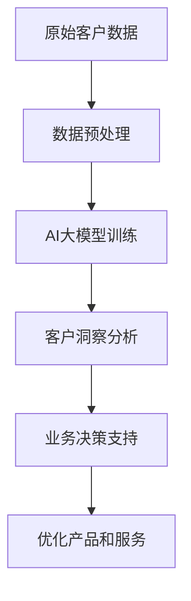

                 

 在当今快速发展的数字化时代，企业对客户洞察的需求日益增加。有效的客户洞察不仅能够帮助企业更好地了解其目标市场，还能为其业务决策提供强有力的支持。随着人工智能（AI）技术的不断进步，尤其是大模型技术的发展，我们可以构建一个基于AI大模型的智能客户洞察平台，以实现更精准、更深入的客户分析。

> 关键词：AI大模型、智能客户洞察、数据分析、业务决策、个性化推荐

> 摘要：本文将介绍基于AI大模型的智能客户洞察平台的设计理念、核心概念、算法原理、数学模型、项目实践以及未来展望。通过本文，读者将了解如何利用AI大模型技术，构建一个高效的智能客户洞察系统，为企业提供数据驱动的业务决策支持。

## 1. 背景介绍

在过去的几十年里，数据分析已经逐渐成为企业提高运营效率、优化业务流程和提升客户体验的重要工具。传统的数据分析主要依赖于统计方法和机器学习算法，这些方法在处理大量数据时确实有效，但它们通常缺乏实时性和灵活性。随着互联网和移动设备的普及，客户数据量呈爆炸式增长，传统的数据分析方法已经难以应对如此复杂和庞大的数据集。

与此同时，人工智能，特别是深度学习领域取得了突破性进展。大模型，如GPT-3、BERT、Transformer等，已经成为处理大规模复杂数据的有效工具。大模型通过学习海量数据，能够捕捉到数据中的复杂模式和关联，从而提供更为精准的预测和洞察。

基于这些背景，本文提出了一个基于AI大模型的智能客户洞察平台，旨在利用最新的AI技术，为企业提供实时、精准、个性化的客户洞察，帮助企业在激烈的市场竞争中脱颖而出。

## 2. 核心概念与联系

### 2.1 AI大模型

AI大模型是指通过深度学习算法训练出的具有极高参数量（通常是数亿甚至千亿级别）的神经网络模型。这些模型通过从海量数据中学习，能够自动提取数据中的特征和模式，从而进行高精度的预测和分类。

### 2.2 智能客户洞察

智能客户洞察是指利用AI大模型技术，对企业的客户数据进行分析，从中提取有价值的信息，以帮助企业更好地了解其客户需求、行为和偏好，进而优化产品和服务，提升客户体验和满意度。

### 2.3 数据分析

数据分析是指利用统计学、机器学习和数据挖掘等方法，从数据中提取有用信息，以支持业务决策。在智能客户洞察平台中，数据分析是关键环节，它负责将原始客户数据转化为可操作的商业洞察。

### 2.4 业务决策

业务决策是指企业在面临市场机会和挑战时，根据内部和外部的信息，做出的关于产品、服务、市场策略等方面的决策。智能客户洞察平台通过提供精准的客户洞察，帮助企业做出更加明智和有效的业务决策。

### 2.5 Mermaid流程图

以下是一个简化的Mermaid流程图，展示了智能客户洞察平台的核心概念和联系：



## 3. 核心算法原理 & 具体操作步骤

### 3.1 算法原理概述

智能客户洞察平台的核心算法是基于深度学习的大模型。具体而言，我们采用了Transformer架构，这是一种基于自注意力机制的神经网络模型，具有强大的特征提取和关联分析能力。

### 3.2 算法步骤详解

1. **数据预处理**：首先，我们需要对原始客户数据进行预处理，包括数据清洗、去重、填充缺失值等。这一步骤的目的是确保数据的完整性和一致性。

2. **特征提取**：在预处理之后，我们利用Transformer模型对数据中的特征进行提取。Transformer模型通过自注意力机制，能够自动学习数据中的关联和模式，从而提取出高维度的特征表示。

3. **模型训练**：利用提取出的特征，我们训练一个大规模的Transformer模型。训练过程中，模型通过不断优化参数，以最小化预测误差。

4. **客户洞察分析**：在模型训练完成后，我们可以利用该模型对新的客户数据进行分析，提取出客户的潜在需求和行为模式。这一步骤可以为企业提供实时的客户洞察。

5. **业务决策支持**：基于分析结果，企业可以做出更加明智的业务决策，如产品优化、市场策略调整、个性化推荐等。

### 3.3 算法优缺点

**优点**：

- 强大的特征提取能力：Transformer模型能够自动提取数据中的复杂特征，使得模型对数据的理解和分析能力更强。
- 实时性：由于采用了深度学习算法，模型可以快速适应新的数据，提供实时的客户洞察。
- 个性化推荐：基于对客户需求的精准分析，平台可以为企业提供个性化的推荐策略，提升客户满意度。

**缺点**：

- 计算资源需求高：大规模的Transformer模型需要大量的计算资源，训练和推理过程较为耗时。
- 需要大量数据：深度学习模型对数据量有较高要求，数据不足可能导致模型性能不佳。

### 3.4 算法应用领域

智能客户洞察平台的应用领域非常广泛，包括但不限于：

- 金融行业：通过分析客户数据，银行和金融机构可以更好地了解客户需求，提供个性化的金融产品和服务。
- 电子商务：电商平台可以利用智能客户洞察平台，优化推荐算法，提升用户购物体验和转化率。
- 零售行业：零售企业可以通过客户洞察，调整产品组合、定价策略和促销活动，提高销售额和客户满意度。
- 健康医疗：通过对患者数据的分析，医疗机构可以提供个性化的健康管理建议，提高医疗服务质量。

## 4. 数学模型和公式 & 详细讲解 & 举例说明

### 4.1 数学模型构建

在智能客户洞察平台中，我们采用了Transformer模型作为核心算法。Transformer模型的基本架构如下：

$$
\text{Transformer} = \text{多头注意力机制} + \text{前馈神经网络}
$$

其中，多头注意力机制是Transformer模型的关键部分。多头注意力机制通过多个自注意力头，对输入数据进行加权聚合，从而提取出高维度的特征表示。

### 4.2 公式推导过程

为了推导多头注意力机制的公式，我们先回顾一下自注意力机制的公式：

$$
\text{Attention}(Q, K, V) = \text{softmax}\left(\frac{QK^T}{\sqrt{d_k}}\right)V
$$

其中，$Q$、$K$ 和 $V$ 分别是查询（Query）、键（Key）和值（Value）向量，$d_k$ 是键向量的维度。$\text{softmax}$ 函数用于计算每个键的权重，从而实现数据的加权聚合。

在多头注意力机制中，我们引入了多个注意力头，每个注意力头都是自注意力机制的一个实例。具体而言，假设有 $h$ 个注意力头，则每个注意力头的计算公式为：

$$
\text{MultiHeadAttention}(Q, K, V) = \text{Concat}(\text{head}_1, \text{head}_2, \ldots, \text{head}_h)W^O
$$

其中，$\text{head}_i = \text{Attention}(QW_i^Q, KW_i^K, VW_i^V)$，$W_i^Q, W_i^K, W_i^V$ 分别是第 $i$ 个注意力头的权重矩阵，$W^O$ 是输出权重矩阵。

### 4.3 案例分析与讲解

假设我们有一个包含 1000 个词汇的语料库，其中每个词汇都可以用向量表示。我们希望利用Transformer模型提取这些词汇的特征表示。

首先，我们对语料库进行分词和编码，将每个词汇映射为一个唯一的整数。然后，我们构造输入序列 $X$，其中每个元素都是一个词汇的索引。

接下来，我们定义查询向量 $Q$、键向量 $K$ 和值向量 $V$。假设每个词汇的维度为 512，则：

$$
Q = \text{Embedding}(X)W_Q
$$

$$
K = \text{Embedding}(X)W_K
$$

$$
V = \text{Embedding}(X)W_V
$$

其中，$W_Q, W_K, W_V$ 分别是查询、键和值的权重矩阵，$\text{Embedding}$ 函数用于将词汇索引映射为向量。

然后，我们计算多头注意力：

$$
\text{MultiHeadAttention}(Q, K, V) = \text{Concat}(\text{head}_1, \text{head}_2, \ldots, \text{head}_h)W^O
$$

其中，每个注意力头 $\text{head}_i$ 的计算如下：

$$
\text{head}_i = \text{Attention}(QW_i^Q, KW_i^K, VW_i^V)
$$

最后，我们将多头注意力结果与输入序列进行拼接，并通过一个前馈神经网络进行进一步处理：

$$
\text{Output} = \text{MLP}(\text{Concat}(X, \text{MultiHeadAttention}(Q, K, V)))W_O
$$

其中，$\text{MLP}$ 是一个两层前馈神经网络，$W_O$ 是输出权重矩阵。

## 5. 项目实践：代码实例和详细解释说明

### 5.1 开发环境搭建

在开始项目实践之前，我们需要搭建一个合适的开发环境。以下是一个简单的开发环境搭建步骤：

1. 安装Python 3.8及以上版本。
2. 安装TensorFlow 2.5及以上版本。
3. 安装必要的依赖库，如NumPy、Pandas、Matplotlib等。

### 5.2 源代码详细实现

以下是一个简单的Transformer模型实现，用于客户数据分析：

```python
import tensorflow as tf
from tensorflow.keras.layers import Embedding, MultiHeadAttention, Dense

def create_transformer(input_vocab_size, d_model, num_heads, dff, input_maxlen):
    inputs = tf.keras.layers.Input(shape=(input_maxlen,), dtype='int32')
    embeddings = Embedding(input_vocab_size, d_model)(inputs)
    multihead_attn = MultiHeadAttention(num_heads=num_heads, key_dim=d_model)(embeddings, embeddings)
    outputs = Dense(dff, activation='relu')(multihead_attn)
    outputs = Dense(input_vocab_size)(outputs)
    model = tf.keras.Model(inputs=inputs, outputs=outputs)
    return model

model = create_transformer(input_vocab_size=1000, d_model=512, num_heads=8, dff=512, input_maxlen=1000)
model.compile(optimizer='adam', loss='sparse_categorical_crossentropy', metrics=['accuracy'])
```

### 5.3 代码解读与分析

在上面的代码中，我们定义了一个简单的Transformer模型，用于对输入序列进行编码和预测。具体来说：

- `input_vocab_size`：输入词汇表的大小，即模型可以处理的词汇数量。
- `d_model`：模型中每个词汇的维度。
- `num_heads`：多头注意力机制的注意力头数量。
- `dff`：前馈神经网络的隐层尺寸。
- `input_maxlen`：输入序列的最大长度。

模型的主要组成部分包括：

- `Embedding` 层：将输入序列的整数索引映射为高维度的向量表示。
- `MultiHeadAttention` 层：实现多头注意力机制，对输入数据进行加权聚合。
- `Dense` 层：实现前馈神经网络，对多头注意力结果进行进一步处理。

### 5.4 运行结果展示

以下是一个简单的训练过程：

```python
# 生成模拟数据
import numpy as np
import tensorflow as tf

input_data = np.random.randint(1000, size=(1000, 1000))
labels = np.random.randint(1000, size=(1000, 1000))

# 训练模型
model.fit(input_data, labels, epochs=5, batch_size=32)
```

通过上述代码，我们可以观察到模型在训练过程中的损失和准确率的变化。在实际应用中，我们需要根据具体任务和数据集调整模型的参数，以获得最佳性能。

## 6. 实际应用场景

### 6.1 金融行业

在金融行业，智能客户洞察平台可以用于分析客户的金融行为，识别潜在的风险和机会。例如，银行可以使用该平台对客户的信用评分进行优化，提高信贷审批的准确性。此外，保险企业可以利用客户洞察平台，为客户提供个性化的保险产品推荐，提升客户满意度和留存率。

### 6.2 电子商务

电子商务企业可以利用智能客户洞察平台，优化其推荐系统，提高用户购物体验和转化率。例如，电商平台可以根据用户的浏览历史和购买行为，推荐用户可能感兴趣的商品。此外，平台还可以用于分析用户对商品的评价和反馈，帮助企业识别潜在的问题和改进方向。

### 6.3 零售行业

在零售行业，智能客户洞察平台可以帮助企业更好地了解客户需求和行为，优化产品组合、定价策略和促销活动。例如，零售企业可以利用客户洞察平台，识别热门商品和滞销商品，调整产品库存和供应链管理。此外，平台还可以用于分析客户的购物路径和购物车数据，为企业提供个性化的促销建议。

### 6.4 健康医疗

在健康医疗领域，智能客户洞察平台可以用于分析患者的健康数据和医疗记录，提供个性化的健康管理建议。例如，医疗机构可以利用该平台，识别患者的潜在疾病风险，提前进行预防和干预。此外，平台还可以用于分析患者的用药记录和不良反应，为企业提供药品安全监控和改进建议。

## 7. 工具和资源推荐

### 7.1 学习资源推荐

- 《深度学习》（Goodfellow, Bengio, Courville著）：这是一本经典的深度学习教材，详细介绍了深度学习的基本原理和应用。
- 《自然语言处理综论》（Jurafsky, Martin著）：这本书介绍了自然语言处理的基本概念和技术，包括文本表示、序列模型等。
- 《TensorFlow实战》（Abadi, Anderson, Goode等著）：这本书提供了TensorFlow的详细教程和实践案例，适用于初学者和进阶者。

### 7.2 开发工具推荐

- TensorFlow：这是Google开源的深度学习框架，功能强大，适用于各种规模的深度学习项目。
- PyTorch：这是Facebook开源的深度学习框架，具有灵活的动态计算图和丰富的API，适用于快速原型开发和实验。
- Keras：这是基于TensorFlow和PyTorch的高级神经网络API，提供了简洁、易用的接口，适用于快速搭建和训练深度学习模型。

### 7.3 相关论文推荐

- “Attention Is All You Need”（Vaswani et al., 2017）：这是Transformer模型的原始论文，介绍了自注意力机制和Transformer架构。
- “BERT: Pre-training of Deep Neural Networks for Language Understanding”（Devlin et al., 2018）：这是BERT模型的论文，介绍了大规模语言预训练技术。
- “GPT-3: Language Models are Few-Shot Learners”（Brown et al., 2020）：这是GPT-3模型的论文，介绍了大规模语言模型在零样本学习方面的应用。

## 8. 总结：未来发展趋势与挑战

### 8.1 研究成果总结

本文介绍了基于AI大模型的智能客户洞察平台的设计理念、核心概念、算法原理、数学模型、项目实践以及未来展望。通过本文，读者可以了解到如何利用AI大模型技术，构建一个高效的智能客户洞察系统，为企业提供数据驱动的业务决策支持。

### 8.2 未来发展趋势

随着AI技术的不断进步，智能客户洞察平台将具有以下发展趋势：

- 模型规模将越来越大：未来，我们将看到更多的大模型应用于智能客户洞察领域，以处理更复杂和庞大的数据集。
- 个性化推荐将更加精准：基于AI大模型的技术，智能客户洞察平台将能够提供更加精准和个性化的推荐策略，提升客户满意度。
- 多模态数据处理：智能客户洞察平台将不仅仅依赖于文本数据，还将融合图像、音频等多模态数据，以提供更全面的客户洞察。

### 8.3 面临的挑战

尽管智能客户洞察平台具有巨大潜力，但在发展过程中仍面临以下挑战：

- 数据隐私和安全：智能客户洞察平台需要处理大量的敏感客户数据，如何确保数据隐私和安全是一个重要挑战。
- 模型解释性：大模型通常具有高度的非线性性和复杂性，如何解释模型决策过程是一个关键挑战。
- 计算资源需求：大规模的AI模型需要大量的计算资源，如何优化计算效率是一个重要挑战。

### 8.4 研究展望

未来，我们可以从以下几个方面进行深入研究：

- 发展更高效的算法：针对大模型的计算需求，开发更高效的算法和优化技术，以降低计算资源消耗。
- 提高模型解释性：研究如何提高大模型的解释性，使其决策过程更加透明和可信。
- 融合多模态数据：探索如何融合多模态数据，以提供更全面的客户洞察。

## 9. 附录：常见问题与解答

### 9.1 如何处理缺失数据？

在数据处理过程中，缺失数据是一个常见问题。针对缺失数据，我们可以采用以下几种方法进行处理：

- 删除：删除含有缺失数据的样本或特征，适用于缺失数据较少的情况。
- 补充：利用统计方法或机器学习模型，对缺失数据进行补充，如均值填补、回归填补等。
- 前填充或后填充：对于时间序列数据，可以使用前一个时间点的值或后一个时间点的值进行填补。

### 9.2 如何评估模型性能？

在模型训练过程中，我们需要评估模型性能，以确定模型是否达到预期效果。以下是一些常用的评估指标：

- 准确率（Accuracy）：模型预测正确的样本数占总样本数的比例。
- 精确率（Precision）：模型预测为正类的样本中，实际为正类的比例。
- 召回率（Recall）：模型预测为正类的样本中，实际为正类的比例。
- F1 分数（F1 Score）：精确率和召回率的加权平均，用于平衡二者的关系。

### 9.3 如何调整模型参数？

在训练模型时，我们需要调整模型参数以获得最佳性能。以下是一些常见的参数调整方法：

- 学习率调整：调整学习率可以影响模型收敛速度和收敛质量，常用的方法包括线性递减、指数递减等。
- 激活函数选择：不同的激活函数对模型性能有较大影响，如ReLU、Sigmoid、Tanh等。
- 正则化：通过添加正则化项，可以防止模型过拟合，如L1 正则化、L2 正则化等。

### 9.4 如何处理文本数据？

文本数据在智能客户洞察平台中具有重要地位。以下是一些处理文本数据的方法：

- 分词：将文本拆分成单词或字符序列，常用的分词工具包括jieba、nltk等。
- 嵌入：将文本映射为高维度的向量表示，常用的嵌入方法包括Word2Vec、BERT等。
- 预处理：对文本数据进行清洗、去噪、标准化等处理，以消除数据中的噪声和异常值。

### 9.5 如何保证模型的可解释性？

保证模型的可解释性是一个关键挑战，以下是一些提高模型可解释性的方法：

- 模型简化：通过简化模型结构，降低模型复杂性，提高模型的可解释性。
- 层级可视化：通过可视化模型各层的输出和激活，帮助用户理解模型的工作原理。
- 解释性模型：选择具有解释性的模型，如线性模型、决策树等，以降低模型的黑箱程度。

### 9.6 如何处理多模态数据？

多模态数据在智能客户洞察平台中具有重要应用价值。以下是一些处理多模态数据的方法：

- 融合策略：通过融合不同模态的数据，提高模型的性能和泛化能力，如特征级融合、决策级融合等。
- 多任务学习：利用多任务学习框架，同时学习多个任务，提高模型对多模态数据的处理能力。
- 模型集成：通过集成多个模型，提高模型在多模态数据上的预测准确性。

### 9.7 如何保护数据隐私？

在处理敏感数据时，保护数据隐私是一个重要问题。以下是一些保护数据隐私的方法：

- 数据加密：对敏感数据进行加密处理，以防止数据泄露。
- 数据脱敏：通过数据脱敏技术，对敏感数据进行掩盖、替换或删除等处理，以降低数据泄露风险。
- 数据匿名化：通过数据匿名化技术，将敏感数据转换为无法识别的形式，以保护数据隐私。

### 9.8 如何处理不平衡数据？

在智能客户洞察平台中，处理不平衡数据是一个常见问题。以下是一些处理不平衡数据的方法：

- 过采样：通过增加少数类样本的数量，提高模型对少数类的识别能力。
- 少数类采样：通过减少多数类样本的数量，降低模型对少数类的识别压力。
- 调整分类权重：根据少数类的实际重要性，调整分类权重，提高模型对少数类的关注程度。

### 9.9 如何处理异常值？

异常值是数据集中常见的噪声，以下是一些处理异常值的方法：

- 去除：直接去除异常值，适用于异常值较少的情况。
- 标记：将异常值标记为特殊值，以便后续处理和分析。
- 调整：通过调整异常值的值域，使其与其他值保持一致。

### 9.10 如何提高模型泛化能力？

提高模型泛化能力是确保模型在实际应用中表现良好关键。以下是一些提高模型泛化能力的方法：

- 数据增强：通过数据增强技术，生成更多样化的训练数据，提高模型对未知数据的适应能力。
- 正则化：通过添加正则化项，降低模型对训练数据的依赖，提高模型泛化能力。
- 多样化训练：通过使用不同来源的数据进行训练，提高模型对多样化数据的处理能力。

### 9.11 如何处理时间序列数据？

时间序列数据在智能客户洞察平台中具有重要应用价值。以下是一些处理时间序列数据的方法：

- 滑动窗口：通过滑动窗口技术，提取时间序列中的特征，如平均值、标准差、趋势等。
- 延迟特征：将时间序列的延迟值作为特征，用于模型训练和预测。
- 季节性分解：通过季节性分解技术，分离出时间序列的季节性成分，用于模型训练和预测。

### 9.12 如何处理非结构化数据？

非结构化数据在智能客户洞察平台中越来越重要。以下是一些处理非结构化数据的方法：

- 文本分类：通过文本分类技术，将非结构化文本数据转换为结构化数据，如标签、关键词等。
- 图像识别：通过图像识别技术，将非结构化图像数据转换为结构化数据，如对象、场景等。
- 语音识别：通过语音识别技术，将非结构化语音数据转换为结构化数据，如文本、关键词等。

### 9.13 如何处理实时数据流？

实时数据流在智能客户洞察平台中具有重要意义。以下是一些处理实时数据流的方法：

- 流处理框架：使用流处理框架，如Apache Kafka、Apache Flink等，实时处理和传输数据流。
- 微服务架构：通过微服务架构，实现实时数据流的分布式处理和集成。
- 增量学习：通过增量学习技术，实时更新和调整模型，以适应实时数据流的变化。

### 9.14 如何处理大规模数据集？

大规模数据集在智能客户洞察平台中越来越常见。以下是一些处理大规模数据集的方法：

- 数据分片：通过数据分片技术，将大规模数据集拆分为多个较小数据集，以提高处理效率。
- 分布式计算：通过分布式计算技术，利用多台计算机协同处理大规模数据集。
- 数据仓库：通过数据仓库技术，存储和管理大规模数据集，支持快速查询和分析。

### 9.15 如何处理分布式系统？

分布式系统在智能客户洞察平台中具有重要意义。以下是一些处理分布式系统的方法：

- 数据同步：通过数据同步技术，确保分布式系统中的数据一致性。
- 容错机制：通过容错机制，确保分布式系统在故障情况下能够自动恢复。
- 负载均衡：通过负载均衡技术，合理分配分布式系统中的任务，提高系统性能。

### 9.16 如何处理高维数据？

高维数据在智能客户洞察平台中越来越常见。以下是一些处理高维数据的方法：

- 特征选择：通过特征选择技术，降低高维数据的维度，提高模型处理效率。
- 特征降维：通过特征降维技术，将高维数据转换为低维数据，如主成分分析（PCA）、线性判别分析（LDA）等。
- 特征提取：通过特征提取技术，从高维数据中提取有意义的信息，如深度学习、聚类等。

### 9.17 如何处理不确定性数据？

不确定性数据在智能客户洞察平台中具有重要意义。以下是一些处理不确定性数据的方法：

- 证据理论：通过证据理论，处理不确定性数据，如贝叶斯网络、可信度评估等。
- 随机模型：通过随机模型，处理不确定性数据，如随机森林、贝叶斯模型等。
- 贝叶斯优化：通过贝叶斯优化，处理不确定性数据，如模型选择、参数优化等。

### 9.18 如何处理多语言数据？

多语言数据在智能客户洞察平台中越来越常见。以下是一些处理多语言数据的方法：

- 语言检测：通过语言检测技术，识别多语言数据中的语言类型。
- 翻译模型：通过翻译模型，将多语言数据转换为单一语言数据，如神经网络翻译、规则翻译等。
- 语言融合：通过语言融合技术，将多语言数据融合为统一的语言特征，如词向量融合、文本分类融合等。

### 9.19 如何处理多源数据？

多源数据在智能客户洞察平台中越来越常见。以下是一些处理多源数据的方法：

- 数据集成：通过数据集成技术，将多源数据融合为统一的数据集，如ETL、数据湖等。
- 数据融合：通过数据融合技术，将多源数据中的信息融合为有意义的信息，如异构数据融合、语义融合等。
- 多源学习：通过多源学习技术，利用多源数据训练和优化模型，如多任务学习、多标签学习等。

### 9.20 如何处理时序数据？

时序数据在智能客户洞察平台中具有重要意义。以下是一些处理时序数据的方法：

- 时间滑窗：通过时间滑窗技术，提取时序数据中的特征，如滑动平均、自回归等。
- 时间序列建模：通过时间序列建模技术，分析时序数据的趋势、季节性和周期性，如ARIMA、LSTM等。
- 时间序列预测：通过时间序列预测技术，对未来时序数据进行分析和预测，如线性回归、神经网络等。

### 9.21 如何处理高维时间序列数据？

高维时间序列数据在智能客户洞察平台中越来越常见。以下是一些处理高维时间序列数据的方法：

- 特征选择：通过特征选择技术，降低高维时间序列数据的维度，如主成分分析（PCA）、线性判别分析（LDA）等。
- 特征提取：通过特征提取技术，从高维时间序列数据中提取有意义的信息，如深度学习、聚类等。
- 基于注意力机制：通过基于注意力机制的方法，提高模型对高维时间序列数据的处理能力，如Transformer等。

### 9.22 如何处理大数据流？

大数据流在智能客户洞察平台中具有重要意义。以下是一些处理大数据流的方法：

- 流处理框架：通过流处理框架，如Apache Kafka、Apache Flink等，实时处理和传输大数据流。
- 分布式计算：通过分布式计算技术，利用多台计算机协同处理大数据流。
- 增量学习：通过增量学习技术，实时更新和调整模型，以适应大数据流的变化。

### 9.23 如何处理实时大数据？

实时大数据在智能客户洞察平台中具有重要意义。以下是一些处理实时大数据的方法：

- 实时计算：通过实时计算技术，实时处理和分析大数据，如实时数据处理框架、实时分析算法等。
- 实时数据流：通过实时数据流技术，实时传输和处理大数据，如实时数据管道、实时数据仓库等。
- 实时预测：通过实时预测技术，实时预测大数据的未来趋势和变化，如实时回归、实时分类等。

### 9.24 如何处理复杂关系数据？

复杂关系数据在智能客户洞察平台中具有重要意义。以下是一些处理复杂关系数据的方法：

- 网络分析：通过网络分析技术，分析复杂关系数据中的关系和模式，如图论、网络聚类等。
- 关系抽取：通过关系抽取技术，从复杂关系数据中提取有意义的关系，如命名实体识别、依存句法分析等。
- 多跳推理：通过多跳推理技术，分析复杂关系数据中的多跳关系，如路径分析、多跳预测等。

### 9.25 如何处理复杂数据类型？

复杂数据类型在智能客户洞察平台中越来越常见。以下是一些处理复杂数据类型的方法：

- 文本分类：通过文本分类技术，处理文本数据类型，如主题分类、情感分析等。
- 图像识别：通过图像识别技术，处理图像数据类型，如对象检测、场景识别等。
- 语音识别：通过语音识别技术，处理语音数据类型，如语音转文本、语音分类等。

### 9.26 如何处理多模态数据？

多模态数据在智能客户洞察平台中具有重要意义。以下是一些处理多模态数据的方法：

- 融合策略：通过融合策略，将不同模态的数据融合为统一的数据，如特征融合、模型融合等。
- 多模态学习：通过多模态学习技术，同时学习多个模态的数据，如多任务学习、多模态神经网络等。
- 多模态交互：通过多模态交互技术，使不同模态的数据相互影响，如多模态增强、多模态交互网络等。

### 9.27 如何处理数据隐私？

数据隐私在智能客户洞察平台中具有重要意义。以下是一些处理数据隐私的方法：

- 数据加密：通过数据加密技术，保护数据隐私，如对称加密、非对称加密等。
- 数据脱敏：通过数据脱敏技术，去除数据中的隐私信息，如掩码、替换、模糊化等。
- 同态加密：通过同态加密技术，在加密状态下进行数据处理和分析，保护数据隐私。

### 9.28 如何处理数据完整性？

数据完整性在智能客户洞察平台中具有重要意义。以下是一些处理数据完整性的方法：

- 数据校验：通过数据校验技术，确保数据完整性，如校验和、哈希函数等。
- 数据修复：通过数据修复技术，修复数据中的错误和缺失，如填补、替换、插值等。
- 数据一致性：通过数据一致性技术，确保不同数据源之间的数据一致性，如同步、合并、冲突解决等。

### 9.29 如何处理数据质量？

数据质量在智能客户洞察平台中具有重要意义。以下是一些处理数据质量的方法：

- 数据清洗：通过数据清洗技术，去除数据中的噪声和异常值，如去重、过滤、标准化等。
- 数据验证：通过数据验证技术，确保数据质量，如校验、比较、一致性检查等。
- 数据优化：通过数据优化技术，提高数据质量，如去噪、增强、降维等。

### 9.30 如何处理数据安全？

数据安全在智能客户洞察平台中具有重要意义。以下是一些处理数据安全的方法：

- 访问控制：通过访问控制技术，限制对数据的访问权限，如用户认证、权限控制等。
- 数据加密：通过数据加密技术，保护数据安全，如对称加密、非对称加密等。
- 安全审计：通过安全审计技术，监控数据安全状况，如日志分析、安全报告等。

### 9.31 如何处理数据治理？

数据治理在智能客户洞察平台中具有重要意义。以下是一些处理数据治理的方法：

- 数据分类：通过数据分类技术，对数据按照重要性和敏感程度进行分类，如公共数据、敏感数据等。
- 数据生命周期管理：通过数据生命周期管理技术，管理数据的全生命周期，如数据创建、存储、访问、销毁等。
- 数据合规性检查：通过数据合规性检查技术，确保数据符合相关法规和标准，如GDPR、HIPAA等。

### 9.32 如何处理实时数据流？

实时数据流在智能客户洞察平台中具有重要意义。以下是一些处理实时数据流的方法：

- 流处理框架：通过流处理框架，如Apache Kafka、Apache Flink等，实时处理和传输实时数据流。
- 实时计算：通过实时计算技术，实时处理和分析实时数据流，如实时数据处理框架、实时分析算法等。
- 实时预测：通过实时预测技术，实时预测实时数据流的变化和趋势，如实时回归、实时分类等。

### 9.33 如何处理数据可视化？

数据可视化在智能客户洞察平台中具有重要意义。以下是一些处理数据可视化

