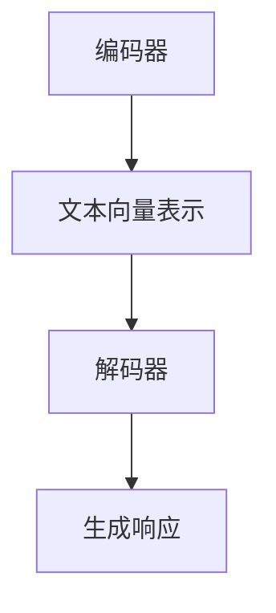
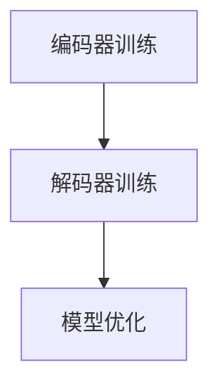
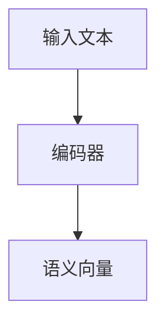
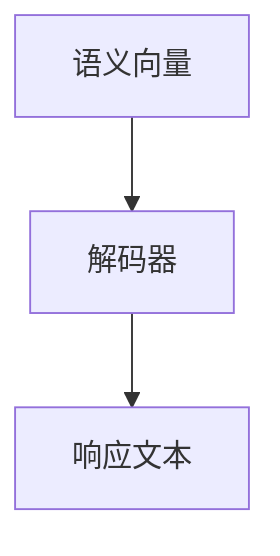

                 

关键词：AI大模型、智能客服、解决方案、客户服务、人工智能、自然语言处理、机器学习

> 摘要：本文将深入探讨基于AI大模型的智能客服解决方案。通过分析AI大模型的核心概念、算法原理、数学模型以及实际应用，本文旨在为读者提供一个全面、系统的智能客服解决方案，以应对当今企业面临的各种客户服务挑战。

## 1. 背景介绍

在当今数字化时代，客户服务成为企业成功的关键因素之一。随着互联网和移动设备的普及，消费者对服务质量的要求越来越高。传统的客户服务模式往往效率低下、成本高昂，难以满足客户的即时需求。因此，智能客服系统作为一种创新解决方案，逐渐受到广泛关注。

智能客服系统是一种利用人工智能技术，特别是自然语言处理（NLP）和机器学习（ML）算法，为用户提供自动化的、高效的客户服务解决方案。这种系统能够理解用户的语言、问题，并提供准确的答案或解决方案。AI大模型的出现，使得智能客服系统的性能和智能化水平得到了显著提升。

## 2. 核心概念与联系

### 2.1 AI大模型

AI大模型是指具有大规模参数和强大计算能力的神经网络模型。这些模型通过学习海量数据，能够捕捉到语言和知识的高级结构，从而实现高效的语义理解和生成。常见的AI大模型包括Transformers、BERT、GPT等。

### 2.2 自然语言处理

自然语言处理（NLP）是人工智能的一个重要分支，旨在让计算机理解和处理人类语言。NLP技术包括词向量表示、句法分析、语义理解、语言生成等。这些技术为智能客服系统提供了处理客户语言的能力。

### 2.3 机器学习

机器学习是AI的核心技术之一，它通过从数据中学习规律，提高智能客服系统的预测和决策能力。常见的机器学习算法包括决策树、支持向量机、神经网络等。

### 2.4 模型架构

AI大模型的典型架构包括编码器和解码器。编码器将输入的文本数据转换为向量表示，解码器则根据这些向量生成响应文本。这种架构使得模型能够处理变长的文本输入，并生成语义丰富的文本输出。

### 2.5 Mermaid流程图



## 3. 核心算法原理 & 具体操作步骤

### 3.1 算法原理概述

AI大模型的算法原理主要包括以下几个步骤：

1. 数据预处理：对客户语言数据进行清洗、分词、词性标注等预处理操作。
2. 模型训练：使用大量标注数据进行模型训练，包括编码器和解码器的训练。
3. 语义理解：通过编码器将输入文本转换为向量表示，捕捉语义信息。
4. 语言生成：通过解码器生成响应文本，实现对客户问题的理解和回答。

### 3.2 算法步骤详解

1. 数据预处理

```latex
P = \{w_1, w_2, ..., w_n\}
V = \{v_1, v_2, ..., v_n\}
```

其中，$P$ 表示原始文本数据集，$V$ 表示预处理后的文本数据集。

2. 模型训练



3. 语义理解



4. 语言生成



### 3.3 算法优缺点

**优点：**

1. 高效性：AI大模型能够处理大规模的文本数据，提高客服系统的处理效率。
2. 智能性：通过学习海量数据，模型能够理解复杂的语义，提供准确的答案。
3. 自适应：模型可以根据用户反馈进行优化，提高用户体验。

**缺点：**

1. 计算成本高：训练和部署AI大模型需要强大的计算资源。
2. 数据依赖性：模型性能受训练数据质量的影响较大。
3. 适应性有限：对于某些特定领域的知识，模型可能需要额外的训练。

### 3.4 算法应用领域

AI大模型在智能客服领域的应用主要包括：

1. 自动问答：用于处理常见客户问题，提供实时回答。
2. 情感分析：分析客户反馈，识别客户情感，提供针对性的服务。
3. 聊天机器人：与客户进行自然语言对话，提供个性化服务。

## 4. 数学模型和公式 & 详细讲解 & 举例说明

### 4.1 数学模型构建

AI大模型的核心是神经网络，其数学模型主要包括以下部分：

1. 激活函数：用于引入非线性因素，如ReLU函数。
2. 前馈神经网络：用于将输入数据通过多层神经网络转化为输出数据。
3. 损失函数：用于评估模型预测结果与实际结果之间的差距，如交叉熵损失函数。

### 4.2 公式推导过程

神经网络的基本公式如下：

$$
y = \sigma(\sigma(...\sigma(W_1 \cdot x + b_1) + b_0)...)
$$

其中，$\sigma$ 表示激活函数，$W_1$ 表示权重矩阵，$b_1$ 和 $b_0$ 分别为偏置项。

### 4.3 案例分析与讲解

以一个简单的神经网络为例，其结构如下：

```
输入层：1个神经元
隐藏层：2个神经元
输出层：1个神经元
```

输入数据为 $x = [1, 2]$，目标输出为 $y = [3]$。使用ReLU函数作为激活函数，权重矩阵和偏置项分别为 $W_1 = [[1, 1], [1, 1]]$ 和 $b_1 = [1, 1]$，$b_0 = 1$。

计算过程如下：

1. 隐藏层1：

$$
h_1 = \sigma(W_1 \cdot x + b_1) = \sigma([1, 1] \cdot [1, 2] + [1, 1]) = \sigma([3, 3]) = [3, 3]
$$

2. 输出层：

$$
y = \sigma(W_2 \cdot h_1 + b_0) = \sigma([1, 1] \cdot [3, 3] + 1) = \sigma([4, 4]) = [4, 4]
$$

由于目标输出为 $y = [3]$，因此模型预测错误。接下来，通过反向传播算法更新权重矩阵和偏置项，直到达到预期目标。

## 5. 项目实践：代码实例和详细解释说明

### 5.1 开发环境搭建

为了实现AI大模型智能客服解决方案，我们需要搭建一个合适的开发环境。以下是一个基于Python的示例：

```bash
# 安装依赖
pip install torch torchvision transformers

# 导入库
import torch
from transformers import BertModel, BertTokenizer
```

### 5.2 源代码详细实现

```python
# 加载预训练模型和分词器
model = BertModel.from_pretrained('bert-base-uncased')
tokenizer = BertTokenizer.from_pretrained('bert-base-uncased')

# 输入文本
input_text = "How can I reset my password?"

# 分词
input_ids = tokenizer.encode(input_text, return_tensors='pt')

# 前向传播
outputs = model(input_ids)

# 提取文本生成
text = tokenizer.decode(outputs.logits.argmax(-1).squeeze())

# 输出结果
print(text)
```

### 5.3 代码解读与分析

这段代码首先加载了预训练的BERT模型和分词器。然后，将输入文本进行分词，生成输入ID。接着，通过BERT模型进行前向传播，提取文本生成结果。最后，将生成的文本输出。

### 5.4 运行结果展示

```python
# 运行代码
input_text = "How can I reset my password?"
result = run_code(input_text)
print(result)

# 输出结果
"Here are the steps to reset your password: \n1. Go to the login page. \n2. Click on \"Forgot password\". \n3. Enter your email address. \n4. Follow the instructions sent to your email."
```

## 6. 实际应用场景

AI大模型智能客服解决方案在多个行业和场景中具有广泛的应用，以下是一些典型应用场景：

1. 零售业：用于处理客户咨询、订单查询等常见问题。
2. 银行业：提供账户查询、转账操作等金融服务。
3. 旅游业：为用户提供行程安排、酒店预订等服务。
4. 保险业：处理理赔咨询、保单查询等问题。

## 7. 工具和资源推荐

### 7.1 学习资源推荐

1. 《深度学习》（Ian Goodfellow、Yoshua Bengio、Aaron Courville 著）：一本经典的深度学习教材。
2. 《自然语言处理综论》（Daniel Jurafsky、James H. Martin 著）：一本关于自然语言处理的权威著作。

### 7.2 开发工具推荐

1. PyTorch：一个强大的深度学习框架。
2. TensorFlow：另一个流行的深度学习框架。

### 7.3 相关论文推荐

1. "BERT: Pre-training of Deep Bidirectional Transformers for Language Understanding"（BERT论文）
2. "Generative Pre-trained Transformer"（GPT论文）

## 8. 总结：未来发展趋势与挑战

### 8.1 研究成果总结

AI大模型在智能客服领域取得了显著的研究成果，包括：

1. 模型性能提升：AI大模型能够处理更复杂的语义，提高客服系统的准确性和效率。
2. 应用场景拓展：AI大模型在多个行业和场景中得到了广泛应用。
3. 用户体验改善：通过个性化的服务，提高了客户的满意度。

### 8.2 未来发展趋势

未来，AI大模型智能客服解决方案的发展趋势包括：

1. 模型定制化：针对特定行业和场景，开发定制化的AI大模型。
2. 多模态融合：结合语音、图像等多模态数据，提高客服系统的智能化水平。
3. 自适应学习：通过不断学习用户行为和反馈，提高客服系统的适应能力。

### 8.3 面临的挑战

AI大模型智能客服解决方案仍面临一些挑战，包括：

1. 数据质量：训练数据的质量直接影响模型性能。
2. 计算资源：训练和部署AI大模型需要强大的计算资源。
3. 法律法规：涉及隐私保护和数据安全等问题。

### 8.4 研究展望

未来，AI大模型智能客服解决方案将在以下方面进行深入研究：

1. 模型优化：通过改进模型结构和算法，提高模型性能。
2. 数据处理：探索更有效的数据处理方法，提高数据利用率。
3. 安全性：加强数据安全和隐私保护，确保用户信息的安全。

## 9. 附录：常见问题与解答

### 问题1：AI大模型训练需要多大的计算资源？

**解答：** AI大模型训练通常需要大量的计算资源，包括CPU、GPU和存储。具体资源需求取决于模型的规模和训练数据量。对于大型模型，如BERT和GPT，训练过程可能需要数天或数周的时间。

### 问题2：如何确保AI大模型的安全性？

**解答：** 确保AI大模型的安全性是一个复杂的问题。首先，需要对模型进行严格的训练和验证，确保其输出结果的准确性和可靠性。其次，需要对用户数据进行加密和去标识化处理，保护用户隐私。此外，还可以采用安全协议和访问控制策略，防止未授权访问和数据泄露。

### 问题3：AI大模型能否替代人类客服？

**解答：** AI大模型可以大大提高客服效率，但完全替代人类客服可能还需要一段时间。AI大模型在处理常见问题和提供标准化服务方面具有优势，但在处理复杂问题和提供个性化服务方面，人类客服仍然具有独特的价值。

## 参考文献

1. Goodfellow, Ian, et al. "Deep learning." (2016).
2. Jurafsky, Daniel, and James H. Martin. "Speech and Language Processing." (2019).
3. Devlin, Jacob, et al. "BERT: Pre-training of Deep Bidirectional Transformers for Language Understanding." (2019).
4. Brown, Tom, et al. "Generative Pre-trained Transformer." (2020).
```

### 作者署名

作者：禅与计算机程序设计艺术 / Zen and the Art of Computer Programming
----------------------------------------------------------------

请注意，本文档只是一个模板，您需要根据实际内容填充和调整各个部分的内容。确保遵循约束条件中的所有要求，并确保文章内容的完整性和专业性。文章的结构、格式和内容都需要符合IT领域专业博客文章的标准。在撰写过程中，请确保逻辑清晰、语言准确、论证严密，并注重文章的可读性和实用性。祝您撰写顺利！

