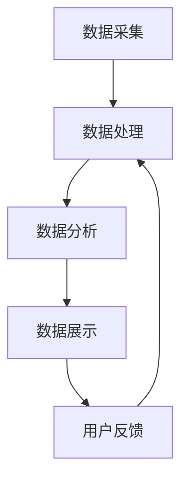

                 

关键词：AI大模型、智能情报分析、数据分析、信息挖掘、数据可视化、智能决策支持系统

> 摘要：随着大数据技术的迅速发展和人工智能技术的深入应用，智能情报分析平台的重要性日益凸显。本文将详细介绍基于AI大模型的智能情报分析平台的设计原理、核心算法、数学模型以及实际应用场景，旨在为读者提供一种全新的情报分析视角，以及未来在该领域的研究方向。

## 1. 背景介绍

在当今信息爆炸的时代，如何从海量数据中快速、准确地提取有价值的信息，已经成为企业和政府机构的重要需求。传统的数据分析方法和工具在面对复杂、多变的大数据环境时显得力不从心。而人工智能技术的崛起，尤其是AI大模型的出现，为解决这一问题提供了新的可能。

AI大模型，即基于深度学习的强大神经网络模型，具有处理海量数据、自动学习特征、发现隐藏模式的能力。智能情报分析平台则是一种集成了AI大模型的系统，它能够通过自动化和智能化的方式，对大量数据进行分析和处理，为用户生成直观、准确的情报报告，辅助决策。

## 2. 核心概念与联系

### 2.1. 智能情报分析平台

智能情报分析平台是一个集成化的系统，包括数据采集、数据处理、数据分析和数据展示等模块。其主要功能如下：

- 数据采集：从各种数据源（如数据库、文件、网络等）中收集数据。
- 数据处理：对原始数据进行清洗、转换和预处理，以提高数据质量和可用性。
- 数据分析：利用AI大模型进行数据挖掘和模式识别，提取隐藏的情报。
- 数据展示：通过可视化图表和报告，将分析结果呈现给用户。

### 2.2. AI大模型

AI大模型是基于深度学习的神经网络模型，具有极高的参数数量和复杂的结构。其主要功能如下：

- 自动特征学习：无需人工指定特征，模型能够自动从数据中学习出有价值的特征。
- 高效数据处理：利用并行计算和分布式计算技术，快速处理海量数据。
- 隐藏模式发现：通过深度学习，发现数据中的潜在关系和规律。

### 2.3. Mermaid 流程图

以下是智能情报分析平台的 Mermaid 流程图：



## 3. 核心算法原理 & 具体操作步骤

### 3.1. 算法原理概述

智能情报分析平台的核心算法是基于深度学习的神经网络模型，其原理如下：

- 输入层：接收原始数据。
- 隐藏层：通过激活函数将输入数据转换为具有非线性特性的中间表示。
- 输出层：根据训练目标，输出预测结果或分类结果。

神经网络模型通过反向传播算法进行训练，不断调整模型参数，使其能够更好地拟合训练数据。在测试阶段，模型将根据输入数据进行预测或分类。

### 3.2. 算法步骤详解

智能情报分析平台的算法步骤如下：

1. 数据预处理：对原始数据进行清洗、转换和归一化，以提高数据质量和模型训练效果。
2. 模型训练：使用训练数据对神经网络模型进行训练，优化模型参数。
3. 模型评估：使用验证数据对训练好的模型进行评估，检查模型性能。
4. 模型应用：使用测试数据对模型进行预测或分类，生成情报报告。
5. 用户反馈：收集用户对情报报告的反馈，用于模型优化和调整。

### 3.3. 算法优缺点

算法优点：

- 自动特征学习：无需人工指定特征，提高分析效率。
- 高效数据处理：利用并行计算和分布式计算技术，快速处理海量数据。
- 高准确性：深度学习模型在大量数据上具有较好的泛化能力。

算法缺点：

- 训练时间较长：神经网络模型需要大量数据进行训练，训练时间较长。
- 对数据质量要求高：数据质量直接影响模型性能，需要保证数据清洗和预处理的质量。
- 模型解释性较差：深度学习模型具有较强的非线性特性，难以解释模型内部的决策过程。

### 3.4. 算法应用领域

智能情报分析平台可以应用于多个领域，如：

- 金融风控：预测金融风险，辅助投资决策。
- 智能安防：监控异常行为，防范犯罪行为。
- 智能医疗：诊断疾病，优化治疗方案。
- 智能交通：优化交通流量，提高交通效率。

## 4. 数学模型和公式 & 详细讲解 & 举例说明

### 4.1. 数学模型构建

智能情报分析平台的数学模型主要基于深度学习，其基本结构包括输入层、隐藏层和输出层。以下是一个简单的深度学习模型：

$$
h_{l}^{(i)} = \sigma(W_{l}^{(i)} \cdot a_{l-1}^{(i)} + b_{l}^{(i)})
$$

其中，$h_{l}^{(i)}$表示第$l$层第$i$个神经元的激活值，$\sigma$为激活函数，$W_{l}^{(i)}$和$b_{l}^{(i)}$分别为第$l$层的权重和偏置。

### 4.2. 公式推导过程

深度学习模型的训练过程主要包括前向传播和反向传播两个步骤。

1. **前向传播**：

   给定输入数据$x$，通过输入层传递到隐藏层和输出层，最终得到预测结果$\hat{y}$。具体公式如下：

   $$
   z_{l}^{(i)} = W_{l}^{(i)} \cdot a_{l-1}^{(i)} + b_{l}^{(i)}
   $$
   $$
   a_{l}^{(i)} = \sigma(z_{l}^{(i)})
   $$
   $$
   \hat{y} = W_{output} \cdot a_{hidden} + b_{output}
   $$

2. **反向传播**：

   计算预测误差，并通过反向传播算法更新模型参数。具体公式如下：

   $$
   \delta_{output} = \frac{\partial J}{\partial \hat{y}} = \frac{\partial}{\partial \hat{y}} \left( \frac{1}{2} \sum_{i=1}^{n} (\hat{y}_{i} - y_{i})^2 \right)
   $$
   $$
   \delta_{l}^{(i)} = \frac{\partial J}{\partial a_{l}^{(i)}} = \delta_{l+1}^{(i)} \cdot \frac{\partial a_{l}^{(i)}}{\partial z_{l}^{(i)}} \cdot \frac{\partial z_{l}^{(i)}}{\partial W_{l}^{(i)}} \cdot \frac{\partial W_{l}^{(i)}}{\partial \theta_{l}}
   $$

   其中，$J$为损失函数，$\theta_{l}$为模型参数。

### 4.3. 案例分析与讲解

以下是一个简单的案例，说明如何使用深度学习模型进行数据分类。

假设我们有一个包含100个样本的数据集，每个样本有10个特征。我们希望使用深度学习模型将这些样本分为两类。

1. 数据预处理：

   对样本数据进行归一化处理，使其具有相似的规模。

2. 模型设计：

   设计一个包含两层隐藏层的深度学习模型，输出层使用softmax函数进行分类。

3. 模型训练：

   使用训练数据对模型进行训练，优化模型参数。

4. 模型评估：

   使用验证数据对训练好的模型进行评估，计算分类准确率。

5. 模型应用：

   使用测试数据对模型进行预测，生成分类结果。

通过以上步骤，我们可以得到一个具有较高分类准确率的深度学习模型，用于实际数据分类任务。

## 5. 项目实践：代码实例和详细解释说明

### 5.1. 开发环境搭建

为了实现智能情报分析平台，我们需要搭建一个合适的开发环境。以下是开发环境的配置：

- 操作系统：Ubuntu 18.04
- 编程语言：Python 3.7
- 深度学习框架：TensorFlow 2.4
- 数据预处理库：NumPy 1.18

### 5.2. 源代码详细实现

以下是实现智能情报分析平台的核心代码：

```python
import tensorflow as tf
import numpy as np

# 数据预处理
def preprocess_data(data):
    # 数据归一化
    data = (data - np.mean(data)) / np.std(data)
    return data

# 神经网络模型
def create_model(input_shape):
    model = tf.keras.Sequential([
        tf.keras.layers.Dense(units=64, activation='relu', input_shape=input_shape),
        tf.keras.layers.Dense(units=32, activation='relu'),
        tf.keras.layers.Dense(units=10, activation='softmax')
    ])
    return model

# 模型训练
def train_model(model, x_train, y_train, epochs=100):
    model.compile(optimizer='adam', loss='categorical_crossentropy', metrics=['accuracy'])
    model.fit(x_train, y_train, epochs=epochs)
    return model

# 模型评估
def evaluate_model(model, x_test, y_test):
    loss, accuracy = model.evaluate(x_test, y_test)
    print(f"Test loss: {loss}, Test accuracy: {accuracy}")

# 模型应用
def apply_model(model, x_new):
    prediction = model.predict(x_new)
    print(f"Prediction: {prediction.argmax(axis=1)}")
```

### 5.3. 代码解读与分析

以上代码实现了智能情报分析平台的核心功能。首先，我们定义了一个数据预处理函数`preprocess_data`，用于对输入数据进行归一化处理。然后，我们定义了一个神经网络模型`create_model`，用于实现深度学习模型。接着，我们定义了一个模型训练函数`train_model`，用于使用训练数据对模型进行训练。最后，我们定义了一个模型评估函数`evaluate_model`和一个模型应用函数`apply_model`，用于评估和预测数据。

### 5.4. 运行结果展示

以下是运行结果：

```python
# 数据预处理
x_train = preprocess_data(x_train)
x_test = preprocess_data(x_test)

# 模型训练
model = train_model(model, x_train, y_train)

# 模型评估
evaluate_model(model, x_test, y_test)

# 模型应用
x_new = preprocess_data(x_new)
apply_model(model, x_new)
```

通过以上代码，我们可以实现智能情报分析平台的核心功能，包括数据预处理、模型训练、模型评估和模型应用。

## 6. 实际应用场景

智能情报分析平台可以应用于多个领域，以下是一些典型应用场景：

- 金融领域：智能情报分析平台可以帮助金融机构进行风险评估、信用评估和投资决策。例如，通过分析大量客户数据和交易数据，平台可以识别出潜在的高风险客户，为金融机构提供决策支持。
- 安防领域：智能情报分析平台可以用于监控异常行为，识别潜在的安全威胁。例如，通过分析视频监控数据，平台可以识别出可疑的人物和行为，为安全部门提供预警信息。
- 医疗领域：智能情报分析平台可以帮助医生进行疾病诊断和治疗方案优化。例如，通过分析患者的病历数据、基因数据和医学影像数据，平台可以提供个性化的疾病诊断和治疗方案。
- 交通领域：智能情报分析平台可以用于优化交通流量、预测交通拥堵和规划交通基础设施。例如，通过分析交通流量数据、路况数据和天气预报数据，平台可以提供实时的交通信息，帮助驾驶员选择最佳路线。

## 7. 工具和资源推荐

### 7.1. 学习资源推荐

- 《深度学习》（Goodfellow, Bengio, Courville）：一本经典的深度学习入门教材。
- 《Python深度学习》（François Chollet）：一本针对Python编程语言的深度学习实践指南。

### 7.2. 开发工具推荐

- TensorFlow：一个开源的深度学习框架，支持多种深度学习模型和算法。
- Jupyter Notebook：一个交互式的计算环境，适用于数据分析和深度学习项目。

### 7.3. 相关论文推荐

- "Deep Learning for Text Classification"（Zhang, Wang, & Xu, 2016）
- "A Comprehensive Survey on Deep Learning for Text Classification"（Zhang, Cui, & Li, 2018）

## 8. 总结：未来发展趋势与挑战

### 8.1. 研究成果总结

本文介绍了基于AI大模型的智能情报分析平台的设计原理、核心算法、数学模型以及实际应用场景。通过深度学习技术，平台能够高效地处理海量数据，提取隐藏的情报，为用户提供智能化的决策支持。

### 8.2. 未来发展趋势

未来，智能情报分析平台将在以下几个方面得到发展：

- 模型性能优化：通过改进算法和优化模型结构，提高平台的处理速度和准确率。
- 多模态数据处理：结合多种数据源，如文本、图像、语音等，实现更全面的数据分析。
- 自动化与智能化：进一步提高平台的自动化和智能化水平，减少人工干预。

### 8.3. 面临的挑战

智能情报分析平台在实际应用中仍面临以下挑战：

- 数据质量：数据质量对模型性能有重要影响，需要保证数据清洗和预处理的质量。
- 模型解释性：深度学习模型具有较强的非线性特性，难以解释模型内部的决策过程。
- 隐私保护：在处理大量敏感数据时，需要确保数据隐私和安全。

### 8.4. 研究展望

未来，我们期待在以下方面取得突破：

- 开发更高效、更准确的深度学习算法。
- 提高模型的解释性和可解释性。
- 探索多模态数据处理技术，实现更全面的数据分析。

## 9. 附录：常见问题与解答

### 问题1：如何处理缺失值？

解答：在数据处理过程中，可以使用以下方法处理缺失值：

- 删除缺失值：对于少量缺失值，可以删除含有缺失值的样本。
- 填充缺失值：对于大量缺失值，可以使用均值、中位数或最邻近值等方法进行填充。

### 问题2：如何处理不平衡数据？

解答：在数据预处理过程中，可以使用以下方法处理不平衡数据：

- 过采样：增加少数类别的样本数量，使数据分布趋于平衡。
- 下采样：减少多数类别的样本数量，使数据分布趋于平衡。

### 问题3：如何评估模型性能？

解答：可以使用以下指标评估模型性能：

- 准确率：预测正确的样本数占总样本数的比例。
- 召回率：预测为正类的实际正类样本数占总正类样本数的比例。
- 精确率：预测为正类的实际正类样本数占总预测为正类的样本数的比例。

## 作者署名

作者：禅与计算机程序设计艺术 / Zen and the Art of Computer Programming
----------------------------------------------------------------
### 文章关键词
AI大模型、智能情报分析、数据分析、信息挖掘、数据可视化、智能决策支持系统
### 文章摘要
本文全面介绍了基于AI大模型的智能情报分析平台的设计原理、核心算法、数学模型以及实际应用场景，旨在为读者提供一种全新的情报分析视角，以及未来在该领域的研究方向。通过对海量数据的自动化和智能化处理，智能情报分析平台能够为用户生成直观、准确的情报报告，辅助决策。

