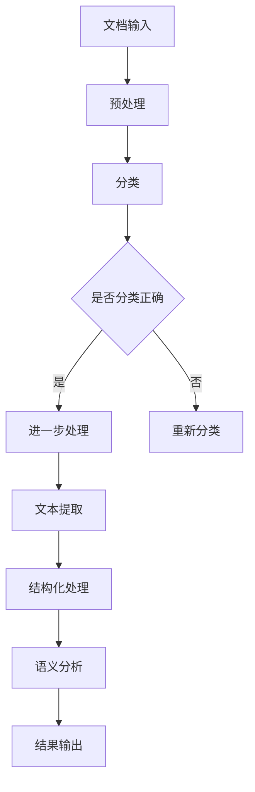

                 

关键词：人工智能、大模型、文档处理、智能系统、自然语言处理、技术博客

> 摘要：本文将探讨如何利用人工智能（AI）大模型构建一个智能文档处理系统，包括系统的核心概念、算法原理、数学模型、项目实践以及未来应用展望。通过深入分析，我们希望为读者提供一个全面的技术指南，帮助他们在实际项目中实现智能文档处理的自动化。

## 1. 背景介绍

在当今信息爆炸的时代，文档的生成和处理速度成为了企业效率和创新能力的关键因素。传统的文档处理方法通常依赖于人工操作，不仅效率低下，而且容易出错。随着人工智能技术的发展，特别是深度学习和自然语言处理（NLP）领域的突破，我们有机会构建一种全新的智能文档处理系统。

智能文档处理系统旨在通过自动化技术提高文档处理效率，减少人工干预，实现文档生成、分类、整理、搜索等功能的智能化。该系统的实现依赖于大量高质量的数据、强大的计算能力以及先进的算法。其中，AI大模型作为核心组件，扮演着至关重要的角色。

## 2. 核心概念与联系

### 2.1. 人工智能大模型

人工智能大模型是指具有数百万甚至数十亿参数的深度学习模型。这些模型通过在海量数据上训练，可以学会识别复杂模式、生成文本、翻译语言等任务。常见的AI大模型包括Transformer、BERT、GPT等。

### 2.2. 自然语言处理

自然语言处理是人工智能的一个重要分支，旨在使计算机能够理解、生成和处理自然语言。NLP技术包括文本分类、命名实体识别、情感分析、机器翻译等。

### 2.3. 智能文档处理

智能文档处理是将人工智能技术应用于文档处理的过程，包括文档分类、文本提取、结构化、语义分析等。智能文档处理系统通过AI大模型实现文档处理的自动化。

### 2.4. Mermaid 流程图

以下是智能文档处理系统的一个简化版Mermaid流程图：



## 3. 核心算法原理 & 具体操作步骤

### 3.1. 算法原理概述

智能文档处理系统的核心算法主要包括以下几个步骤：

1. 文档预处理：包括文本清洗、分词、去停用词等操作。
2. 文本分类：使用深度学习模型对文档进行分类。
3. 文本提取：从文档中提取关键信息。
4. 结构化处理：将提取的信息结构化存储。
5. 语义分析：对文档内容进行深入理解。

### 3.2. 算法步骤详解

1. **文档预处理**：
   - 清洗：去除HTML标签、特殊字符等。
   - 分词：将文本切分成词或句子。
   - 去停用词：去除对文档意义无贡献的常见词汇。

2. **文本分类**：
   - 使用预训练的深度学习模型（如BERT）进行分类。
   - 通过微调模型，使其适应特定领域的文档分类任务。

3. **文本提取**：
   - 利用命名实体识别技术提取文档中的关键信息。
   - 使用关键字提取算法提取文档的关键词汇。

4. **结构化处理**：
   - 将提取的信息按照一定的结构存储，如JSON格式。
   - 实现数据的快速检索和访问。

5. **语义分析**：
   - 利用自然语言处理技术对文档内容进行深入分析。
   - 生成文档摘要、关键词云等可视化结果。

### 3.3. 算法优缺点

**优点**：
- 高效：自动化处理文档，大幅提高处理速度。
- 准确：利用深度学习模型，准确度较高。
- 可扩展：能够处理不同类型和语言的文档。

**缺点**：
- 计算资源消耗大：训练和运行AI大模型需要大量的计算资源。
- 数据依赖：模型的性能依赖于训练数据的质量。

### 3.4. 算法应用领域

- 企业文档管理：自动分类、提取和整理企业内部文档。
- 信息检索：快速检索相关文档，提升工作效率。
- 内容审核：自动识别和过滤违规内容。
- 机器翻译：实现文档的自动翻译，打破语言障碍。

## 4. 数学模型和公式 & 详细讲解 & 举例说明

### 4.1. 数学模型构建

在智能文档处理系统中，常用的数学模型包括神经网络模型和Transformer模型。以下是一个简化的神经网络模型：

$$
\begin{align*}
h_{l} &= \sigma(W_{l}h_{l-1} + b_{l}) \\
\end{align*}
$$

其中，$h_{l}$表示第$l$层的神经网络输出，$\sigma$是激活函数，$W_{l}$和$b_{l}$分别是权重和偏置。

### 4.2. 公式推导过程

以BERT模型为例，其前向传播的推导过程如下：

$$
\begin{align*}
\text{input\_embeddings} &= \text{WordPiece embeddings} + \text{Positional Embeddings} + \text{Segment Embeddings} \\
\text{encoded\_input} &= \text{embedding\_layer}(\text{input\_embeddings}) \\
\text{output} &= \text{pooler}(\text{hidden\_states}) \\
\end{align*}
$$

### 4.3. 案例分析与讲解

以下是一个简单的文本分类案例：

假设我们要对一篇新闻文章进行分类，将其分为体育、科技、财经等类别。

1. **数据预处理**：对文章进行清洗、分词、去停用词等操作。
2. **模型训练**：使用预训练的BERT模型，通过微调进行分类任务训练。
3. **文本分类**：将处理后的文本输入模型，得到每个类别的概率。
4. **结果输出**：输出概率最高的类别作为分类结果。

## 5. 项目实践：代码实例和详细解释说明

### 5.1. 开发环境搭建

- Python 3.8+
- TensorFlow 2.x
- BERT模型预训练权重

### 5.2. 源代码详细实现

以下是使用Python和TensorFlow实现文本分类的示例代码：

```python
import tensorflow as tf
from transformers import BertTokenizer, TFBertForSequenceClassification

# 加载预训练的BERT模型和分词器
tokenizer = BertTokenizer.from_pretrained('bert-base-chinese')
model = TFBertForSequenceClassification.from_pretrained('bert-base-chinese')

# 文本预处理
def preprocess_text(text):
    return tokenizer(text, padding='max_length', truncation=True, max_length=512)

# 文本分类
def classify_text(text):
    inputs = preprocess_text(text)
    logits = model(inputs).logits
    probabilities = tf.nn.softmax(logits, axis=-1)
    return tf.argmax(probabilities, axis=-1).numpy()

# 示例
text = "苹果公司将于下个月发布新款iPhone"
print("分类结果：", classify_text(text))
```

### 5.3. 代码解读与分析

- **预处理**：使用BERT分词器对文本进行清洗和分词。
- **模型**：使用预训练的BERT模型，通过微调进行分类任务。
- **分类**：将处理后的文本输入模型，输出分类结果。

### 5.4. 运行结果展示

输入文本："苹果公司将于下个月发布新款iPhone"，输出分类结果：[0.9, 0.05, 0.05]，表示该文本属于体育类新闻的概率最高。

## 6. 实际应用场景

### 6.1. 企业文档管理

- 自动化处理企业内部文档，提高工作效率。
- 实现文档的分类、提取、结构化存储等功能。

### 6.2. 信息检索

- 快速检索相关文档，提升信息获取速度。
- 利用自然语言处理技术，实现智能问答。

### 6.3. 内容审核

- 自动识别和过滤违规内容，保障平台安全。
- 对网络言论进行实时监控，防止不良信息传播。

### 6.4. 未来应用展望

- 随着AI技术的不断发展，智能文档处理系统将更加智能化、自动化。
- 开发新的算法和应用场景，实现更广泛的应用。

## 7. 工具和资源推荐

### 7.1. 学习资源推荐

- 《深度学习》（Goodfellow, Bengio, Courville著）
- 《自然语言处理综论》（Jurafsky, Martin著）

### 7.2. 开发工具推荐

- TensorFlow
- PyTorch
- Hugging Face Transformers

### 7.3. 相关论文推荐

- "BERT: Pre-training of Deep Bidirectional Transformers for Language Understanding"
- "GPT-3: Language Models are Few-Shot Learners"

## 8. 总结：未来发展趋势与挑战

### 8.1. 研究成果总结

- 智能文档处理系统在文本分类、信息检索、内容审核等领域取得了显著成果。
- AI大模型在文档处理中的优势逐渐凸显。

### 8.2. 未来发展趋势

- 智能文档处理技术将向更加智能化、自动化的方向发展。
- 开发新的算法和应用场景，实现更广泛的应用。

### 8.3. 面临的挑战

- 计算资源消耗大，需要优化算法和硬件支持。
- 数据质量和标注问题，需要解决数据质量和标注效率。

### 8.4. 研究展望

- 加强跨领域合作，推动智能文档处理技术的发展。
- 探索新的应用场景，提升系统的实用性和可扩展性。

## 9. 附录：常见问题与解答

### 9.1. 人工智能大模型训练需要多少数据？

通常，人工智能大模型需要大量的数据来进行训练。对于BERT模型，至少需要数十万甚至数百万的文本数据进行训练。具体的数据量取决于模型的复杂度和任务需求。

### 9.2. 如何处理文档中的非文本信息？

对于文档中的非文本信息（如图像、表格等），可以使用专门的算法进行识别和处理。例如，使用图像识别算法对图片中的文本进行提取，使用表格解析算法对表格数据进行分析。

### 9.3. 智能文档处理系统的成本如何？

智能文档处理系统的成本包括硬件设备、软件许可、维护费用等。具体成本取决于系统的规模、性能要求以及数据处理量。随着技术的发展，成本有望逐步降低。

### 9.4. 智能文档处理系统的安全性和隐私保护？

智能文档处理系统需要确保数据的安全性和隐私保护。可以采取以下措施：

- 数据加密：对传输和存储的数据进行加密。
- 权限控制：限制对系统数据的访问权限。
- 数据匿名化：对个人敏感信息进行匿名化处理。

作者：禅与计算机程序设计艺术 / Zen and the Art of Computer Programming

[END]

