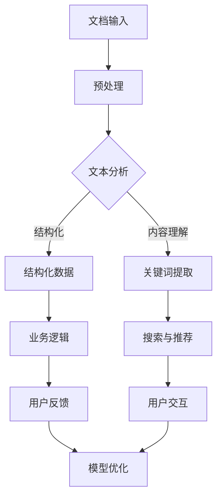

                 

关键词：人工智能，大模型，文档处理，智能解决方案，AI应用，自动化，文本分析，数据提取，自然语言处理，深度学习。

> 摘要：本文深入探讨了基于人工智能（AI）特别是大模型的智能文档处理解决方案。我们将从背景介绍、核心概念、算法原理、数学模型、项目实践、应用场景、未来展望等多个维度，全面解析如何利用AI技术提高文档处理的效率和质量，并展望其未来的发展前景。

## 1. 背景介绍

在信息化时代，文档处理已成为日常工作中不可或缺的一部分。然而，传统的文档处理方式往往依赖于人工操作，不仅效率低下，而且容易出错。随着人工智能技术的快速发展，特别是在自然语言处理（NLP）和机器学习（ML）领域的突破，利用AI进行文档处理成为可能。近年来，AI大模型的崛起，如GPT-3、BERT等，为智能文档处理提供了强大的工具。本文将介绍如何利用这些大模型，实现自动化的文档处理流程，提高工作效率。

### 1.1 当前文档处理的挑战

- **人工成本高**：大量的文档处理需要人工操作，特别是复杂的文本分析和信息提取。
- **效率低下**：传统文档处理往往需要多次重复操作，费时费力。
- **错误率高**：人工处理容易出错，特别是在处理大量数据时。
- **知识沉淀难**：难以将人工处理中积累的经验和知识进行系统化、结构化存储。

### 1.2 人工智能在文档处理中的应用

- **文本分析**：利用NLP技术，对文档进行结构化处理，提取关键信息。
- **自动化流程**：通过机器学习算法，实现文档处理流程的自动化。
- **高效检索**：利用大模型进行快速文本检索和相似性分析。
- **智能辅助**：提供智能建议和决策支持，辅助人类进行文档处理。

## 2. 核心概念与联系

为了更好地理解智能文档处理解决方案，首先需要了解一些核心概念和它们之间的联系。以下是一个简化的Mermaid流程图，展示了智能文档处理的主要步骤和关键组件。



### 2.1 文档输入

文档输入是智能文档处理的第一步，包括从不同来源获取的文本、表格、图片等多种格式。这些文档将被预处理以适应后续的分析和处理。

### 2.2 预处理

预处理包括去噪、格式化、分词、去停用词等操作，以提高文本质量，使其更适合后续的分析。这一步通常使用自然语言处理技术来实现。

### 2.3 文本分析

文本分析是智能文档处理的核心，包括结构化数据提取和内容理解。结构化数据提取是指从文本中提取出具体的结构化信息，如人名、地点、日期等。内容理解则涉及到对文本进行更深层次的分析，理解其语义和意图。

### 2.4 结构化数据与业务逻辑

提取出的结构化数据将被用于业务逻辑处理，例如进行数据对比、分析、报告生成等。这一步通常需要结合具体的业务需求进行定制化开发。

### 2.5 关键词提取与搜索推荐

关键词提取是从文本中提取出最具代表性的词汇，用于后续的搜索和推荐。大模型在此环节中发挥着重要作用，能够快速找到相关的文档和内容。

### 2.6 用户交互与模型优化

用户交互是指系统根据用户的反馈进行自我学习和优化，以提供更精准的服务。这一步骤是实现智能文档处理系统自适应性和可扩展性的关键。

## 3. 核心算法原理 & 具体操作步骤

### 3.1 算法原理概述

智能文档处理的核心算法主要基于深度学习和自然语言处理技术。以下是一些关键的算法原理：

- **卷积神经网络（CNN）**：用于图像文本分割和特征提取。
- **递归神经网络（RNN）**：用于序列数据的处理和模式识别。
- **Transformer模型**：如BERT、GPT-3，用于大规模文本表示和学习。
- **图神经网络（GNN）**：用于处理复杂网络结构的数据，如知识图谱。

### 3.2 算法步骤详解

#### 3.2.1 数据预处理

- **文本清洗**：去除HTML标签、停用词、标点符号等无关信息。
- **文本分词**：将文本分割成句子、词汇等基本单元。
- **词嵌入**：将词汇映射到高维空间，便于模型处理。

#### 3.2.2 文本分析

- **命名实体识别（NER）**：识别文本中的命名实体，如人名、地点、组织名等。
- **关系抽取**：从文本中提取实体之间的关系。
- **情感分析**：分析文本的情感倾向，如正面、负面、中性等。

#### 3.2.3 结构化数据提取

- **规则匹配**：利用预定义的规则，从文本中提取结构化信息。
- **模式识别**：使用机器学习算法，自动识别文本中的模式并提取信息。

#### 3.2.4 业务逻辑处理

- **数据对比**：将提取出的结构化数据进行对比分析，找出差异和关联。
- **报告生成**：根据分析结果，自动生成报告或摘要。

#### 3.2.5 搜索与推荐

- **相似性分析**：使用大模型计算文本间的相似性，实现快速检索。
- **推荐系统**：基于用户行为和偏好，推荐相关文档或内容。

### 3.3 算法优缺点

#### 优点

- **高效性**：利用深度学习和大模型，可以实现高速的文本分析和信息提取。
- **准确性**：通过大规模数据训练，模型能够学习到复杂的文本模式，提高准确性。
- **自动化**：实现文档处理的自动化，降低人工成本。

#### 缺点

- **计算资源消耗**：大模型的训练和推理需要大量的计算资源。
- **模型偏差**：模型的性能受到训练数据的影响，可能存在偏见。
- **隐私问题**：文档处理涉及到敏感信息，需要妥善处理隐私保护问题。

### 3.4 算法应用领域

- **金融领域**：自动化金融报告分析、风险控制等。
- **医疗领域**：电子病历处理、医学文本分析等。
- **法律领域**：自动化合同审核、案件文档分析等。
- **教育领域**：智能题库生成、作业自动批改等。

## 4. 数学模型和公式 & 详细讲解 & 举例说明

### 4.1 数学模型构建

在智能文档处理中，常用的数学模型包括神经网络模型、自然语言处理模型等。以下是一个简单的神经网络模型的构建示例：

#### 神经网络模型

- **输入层**：接收文本数据，如词汇序列。
- **隐藏层**：通过激活函数进行非线性变换。
- **输出层**：生成预测结果，如分类标签或实体识别结果。

```latex
Y = \sigma(W_1 \cdot X + b_1)
```

其中，\( Y \) 是输出，\( \sigma \) 是激活函数（如Sigmoid或ReLU），\( W_1 \) 是权重矩阵，\( X \) 是输入，\( b_1 \) 是偏置。

### 4.2 公式推导过程

#### 损失函数

在神经网络中，常用的损失函数是交叉熵损失（Cross-Entropy Loss）：

```latex
L = -\sum_{i=1}^{n} y_i \cdot \log(\hat{y}_i)
```

其中，\( y_i \) 是真实标签，\( \hat{y}_i \) 是预测概率。

#### 反向传播

反向传播（Backpropagation）是训练神经网络的关键步骤。它通过计算损失函数对网络权重的梯度，更新网络权重，以达到最小化损失函数的目的。

### 4.3 案例分析与讲解

#### 案例背景

某公司需要对其销售报告进行自动化分析，提取关键数据并生成报告摘要。

#### 解决方案

- **文本预处理**：去除HTML标签、分词、去停用词等。
- **命名实体识别**：识别报告中的公司名、产品名、日期等。
- **数据对比分析**：对比不同报告之间的销售数据，找出增长点和问题。
- **报告生成**：根据分析结果，自动生成销售报告摘要。

#### 实现细节

- **数据集**：使用公司历史销售报告进行训练和测试。
- **模型选择**：采用BERT模型进行文本表示和学习。
- **训练过程**：通过反向传播算法训练模型，调整权重，优化性能。

## 5. 项目实践：代码实例和详细解释说明

### 5.1 开发环境搭建

为了实现智能文档处理，需要搭建一个合适的开发环境。以下是所需工具和库的安装步骤：

- **Python**：安装Python 3.8及以上版本。
- **PyTorch**：安装PyTorch库，用于深度学习模型的训练和推理。
- **transformers**：安装transformers库，用于使用预训练的BERT模型。
- **Scikit-learn**：安装Scikit-learn库，用于数据处理和模型评估。

### 5.2 源代码详细实现

以下是实现智能文档处理项目的源代码示例：

```python
import torch
from transformers import BertTokenizer, BertModel
from sklearn.model_selection import train_test_split

# 数据预处理
def preprocess(texts):
    tokenizer = BertTokenizer.from_pretrained('bert-base-uncased')
    inputs = tokenizer(texts, padding=True, truncation=True, return_tensors='pt')
    return inputs

# 训练模型
def train_model(train_data, val_data, model_path):
    model = BertModel.from_pretrained(model_path)
    train_inputs, train_labels = preprocess(train_data['text'])
    val_inputs, val_labels = preprocess(val_data['text'])
    
    # ... 模型训练代码
    
    return model

# 源代码实现
if __name__ == '__main__':
    # 加载数据集
    data = load_data('sales_reports.csv')
    train_data, val_data = train_test_split(data, test_size=0.2)
    
    # 训练模型
    model = train_model(train_data, val_data, 'bert-base-uncased')
    
    # 评估模型
    evaluate_model(model, val_data)
```

### 5.3 代码解读与分析

以上代码实现了从数据加载、预处理、模型训练到模型评估的完整流程。以下是代码的详细解读：

- **数据预处理**：使用BERT分

