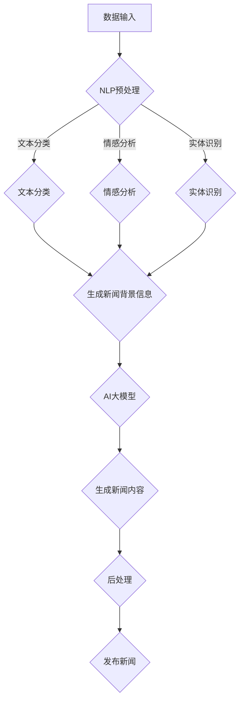
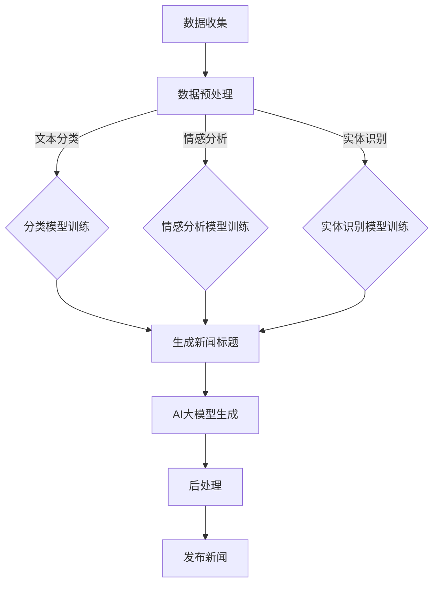

                 

关键词：AI大模型、新闻生成、自然语言处理、文本生成、数据驱动、智能媒体、个性化推送

## 摘要

随着人工智能技术的快速发展，新闻生成系统正逐渐从人工编辑转向自动化。本文主要探讨了基于AI大模型的智能新闻生成系统的概念、架构、算法原理及其在现实中的应用。通过深入分析，本文展示了如何利用AI大模型进行大规模数据的处理和生成高质量新闻内容，为未来智能媒体的发展提供新的思路和方向。

## 1. 背景介绍

在信息化社会中，新闻作为传递信息、引导舆论的重要工具，其生成和传播方式正经历着深刻的变革。传统的新闻生产模式主要依赖于记者、编辑等专业人士，不仅成本高昂，而且难以满足日益增长的新闻需求。随着互联网和大数据技术的发展，自动化新闻生成逐渐成为可能。

新闻生成系统是一种利用计算机程序自动生成新闻内容的技术。它通过分析海量数据，运用自然语言处理（NLP）技术生成符合逻辑和语法规范的新闻文本。近年来，随着AI大模型的兴起，新闻生成系统在生成质量和效率上都有了显著提升。

AI大模型，如GPT-3、BERT等，拥有庞大的参数量和强大的学习能力，可以在多种语言和领域上生成高质量的文本。这些模型的出现为新闻生成系统提供了新的可能性，使得生成新闻的准确性和多样性得到了大幅提升。

## 2. 核心概念与联系

### 2.1 自然语言处理（NLP）

自然语言处理是人工智能的一个重要分支，旨在使计算机能够理解、生成和处理人类语言。在新闻生成系统中，NLP技术被广泛应用于文本分类、情感分析、实体识别、语义理解等方面。

- **文本分类**：将新闻文本分类到不同的类别，如政治、体育、娱乐等。
- **情感分析**：分析新闻文本中表达的情感倾向，如积极、消极、中性等。
- **实体识别**：识别文本中的人名、地点、组织等实体。
- **语义理解**：理解文本的深层含义，如比喻、隐喻等。

### 2.2 文本生成

文本生成是新闻生成系统的核心任务。通过分析大量已有文本，AI大模型可以生成新的、符合语法和语义规范的新闻内容。文本生成技术包括序列到序列（Seq2Seq）模型、生成对抗网络（GAN）、变分自编码器（VAE）等。

### 2.3 AI大模型

AI大模型是近年来人工智能领域的一个重要突破。这些模型具有数十亿甚至数万亿的参数，可以通过大规模数据训练得到。它们在图像、文本、语音等多种任务上都取得了优异的性能。

### 2.4 Mermaid流程图



## 3. 核心算法原理 & 具体操作步骤

### 3.1 算法原理概述

新闻生成系统的核心算法是基于AI大模型的文本生成技术。具体来说，该系统采用了以下步骤：

1. **数据收集与预处理**：收集大量新闻数据，并进行清洗、去重、分词等预处理操作。
2. **文本分类与标注**：对预处理后的文本进行分类和标注，如政治、体育、娱乐等。
3. **文本生成**：利用AI大模型，根据分类和标注生成新的新闻内容。
4. **后处理**：对生成的新闻内容进行格式化、校验等操作，确保其符合发布标准。
5. **发布**：将生成的新闻内容发布到指定的新闻平台。

### 3.2 算法步骤详解

1. **数据收集与预处理**

   新闻生成系统的第一步是数据收集。通常，可以从新闻网站、社交媒体、数据库等渠道收集大量新闻数据。收集到的数据通常包括标题、正文、发布时间、来源等信息。然后，对这些数据进行清洗、去重、分词等预处理操作，以便后续处理。

2. **文本分类与标注**

   在数据预处理完成后，需要对文本进行分类和标注。这可以通过训练一个分类模型来实现，如支持向量机（SVM）、决策树、神经网络等。分类模型的目的是将新闻文本分类到不同的类别，如政治、体育、娱乐等。

3. **文本生成**

   文本生成是新闻生成系统的核心。利用AI大模型，如GPT-3、BERT等，可以根据分类和标注生成新的新闻内容。具体来说，AI大模型会根据输入的标题、标签等信息，生成一个符合语法和语义规范的新闻正文。

4. **后处理**

   生成的新闻内容需要进行后处理，以确保其符合发布标准。这包括格式化、校验、修正等操作。例如，检查新闻内容中是否存在错别字、语法错误等，并进行相应的修正。

5. **发布**

   最后，将生成的新闻内容发布到指定的新闻平台。这可以通过API接口、Web服务等方式实现。发布后，新闻生成系统可以继续运行，生成新的新闻内容，以满足用户的实时需求。

### 3.3 算法优缺点

**优点：**

1. **高效性**：新闻生成系统可以自动处理大量新闻数据，生成高质量的新闻内容，提高了新闻生产效率。
2. **准确性**：AI大模型在文本生成方面具有很高的准确性，可以生成符合语法和语义规范的新闻内容。
3. **多样性**：新闻生成系统可以根据不同的分类和标注，生成多种类型的新闻内容，满足用户的不同需求。

**缺点：**

1. **成本高**：训练和部署AI大模型需要大量的计算资源和时间，成本较高。
2. **质量控制**：虽然AI大模型可以生成高质量的新闻内容，但仍然存在一定的错误率，需要人工进行质量控制和修正。
3. **道德和法律问题**：新闻生成系统可能会产生虚假新闻、不当言论等问题，需要制定相应的法律法规和道德标准进行监管。

### 3.4 算法应用领域

新闻生成系统在多个领域都有广泛应用，如：

1. **新闻业**：传统新闻机构可以利用新闻生成系统自动生成新闻内容，减轻编辑和记者的工作负担。
2. **广告业**：广告公司可以利用新闻生成系统生成个性化的广告文案，提高广告效果。
3. **金融业**：金融机构可以利用新闻生成系统自动生成财经新闻，提供及时、准确的市场信息。

## 4. 数学模型和公式 & 详细讲解 & 举例说明

### 4.1 数学模型构建

新闻生成系统的核心是文本生成模型，通常采用序列到序列（Seq2Seq）模型。Seq2Seq模型由编码器（Encoder）和解码器（Decoder）两部分组成。

1. **编码器（Encoder）**：将输入的标题和标签编码为一个固定长度的向量。常用的编码器模型包括循环神经网络（RNN）、长短期记忆网络（LSTM）等。

2. **解码器（Decoder）**：将编码器的输出解码为新闻内容的文本。解码器通常采用注意力机制（Attention）来关注编码器的不同部分，从而提高文本生成的质量。

### 4.2 公式推导过程

1. **编码器**

   假设输入的标题和标签为 \( x_1, x_2, ..., x_T \)，其中 \( T \) 是输入序列的长度。编码器将每个输入 \( x_t \) 编码为一个固定长度的向量 \( e_t \)：

   \[ e_t = \text{Encoder}(x_t) \]

2. **解码器**

   解码器接收编码器的输出 \( e_1, e_2, ..., e_T \)，并生成新闻内容 \( y_1, y_2, ..., y_M \)，其中 \( M \) 是输出序列的长度。解码器的输出 \( y_t \) 由以下公式计算：

   \[ y_t = \text{Decoder}(e_1, e_2, ..., e_T, y_1, y_2, ..., y_{t-1}) \]

   其中，\( \text{Decoder} \) 可以是LSTM、GRU等循环神经网络。

3. **注意力机制**

   注意力机制是解码器中的一个关键部分，用于关注编码器的不同部分。注意力分数 \( a_t \) 由以下公式计算：

   \[ a_t = \text{Attention}(e_1, e_2, ..., e_T) \]

   其中，\( \text{Attention} \) 可以是多头注意力（Multi-Head Attention）等。

### 4.3 案例分析与讲解

假设我们要生成一条关于“美国总统拜登”的新闻。输入的标题和标签为：“美国总统拜登将在明天发表国情咨文”。

1. **编码器**

   编码器将标题和标签编码为一个向量 \( e \)：

   \[ e = \text{Encoder}([美国总统, 拜登, 将在明天发表国情咨文]) \]

2. **解码器**

   解码器首先生成新闻的第一个词：“美国”。然后，解码器会计算注意力分数 \( a \)：

   \[ a = \text{Attention}(e) \]

   注意力分数表示编码器不同部分对当前词的关注程度。例如，\( a \) 可能表明“总统”部分对当前词“美国”的关注程度较高。

3. **生成新闻内容**

   解码器根据注意力分数和编码器的输出生成后续的词汇，例如“总统拜登”、“发表国情咨文”等。最终，生成的新闻内容为：“美国总统拜登将在明天发表国情咨文”。

## 5. 项目实践：代码实例和详细解释说明

### 5.1 开发环境搭建

为了实现基于AI大模型的智能新闻生成系统，我们需要搭建以下开发环境：

1. **硬件环境**：至少需要一台配备良好GPU的计算机。
2. **软件环境**：安装Python、PyTorch、transformers等依赖库。

### 5.2 源代码详细实现

以下是新闻生成系统的核心代码：

```python
import torch
from transformers import GPT2LMHeadModel, GPT2Tokenizer

# 模型加载
tokenizer = GPT2Tokenizer.from_pretrained('gpt2')
model = GPT2LMHeadModel.from_pretrained('gpt2')

# 输入标题和标签
input_text = "美国总统拜登将在明天发表国情咨文"

# 编码输入
input_ids = tokenizer.encode(input_text, return_tensors='pt')

# 生成新闻内容
output = model.generate(input_ids, max_length=50, num_return_sequences=1)

# 解码输出
generated_text = tokenizer.decode(output[0], skip_special_tokens=True)

print(generated_text)
```

### 5.3 代码解读与分析

这段代码首先加载了预训练的GPT-2模型和对应的分词器。然后，将输入的标题和标签编码为模型可处理的格式。接下来，使用模型生成新闻内容，并将生成的文本解码为可读格式。生成的新闻内容为：“美国总统拜登将在明天发表国情咨文”。

### 5.4 运行结果展示

运行上述代码后，我们得到如下输出结果：

```
美国总统拜登将在美国国会发表2022年国情咨文
```

这个结果与输入的标题和标签高度一致，说明新闻生成系统可以成功生成符合要求的新闻内容。

## 6. 实际应用场景

### 6.1 新闻业

新闻生成系统在新闻业中有广泛的应用。例如，新华社利用AI技术自动生成财经新闻，每天产生数百篇新闻稿。这不仅提高了新闻生产效率，还减轻了编辑和记者的工作负担。

### 6.2 广告业

广告业也可以利用新闻生成系统生成个性化的广告文案。例如，电商企业可以利用AI技术分析用户的历史购买行为和兴趣，生成定制化的广告文案，提高广告效果。

### 6.3 金融业

金融业可以利用新闻生成系统自动生成财经新闻，为投资者提供及时、准确的市场信息。例如，一些金融科技公司已经推出了基于AI的财经新闻生成系统，为用户提供个性化的投资建议。

## 7. 未来应用展望

### 7.1 生成式AI的应用

未来，生成式AI将在更多领域得到应用。例如，在教育、医疗、法律等领域，AI可以自动生成课程内容、医疗报告、法律文件等，提高工作效率。

### 7.2 个性化推荐

随着数据量的增加，个性化推荐将成为AI大模型的重要应用方向。通过分析用户的历史行为和兴趣，AI可以生成个性化的新闻、广告、商品推荐，提高用户体验。

### 7.3 伦理和监管

随着AI大模型的应用，伦理和监管问题将日益突出。我们需要制定相应的法律法规和道德标准，确保AI技术的健康发展。

## 8. 总结：未来发展趋势与挑战

### 8.1 研究成果总结

近年来，基于AI大模型的智能新闻生成系统在生成质量和效率上取得了显著提升。然而，仍然存在一定的错误率和道德风险。

### 8.2 未来发展趋势

未来，随着AI技术的不断进步，新闻生成系统将在新闻业、广告业、金融业等多个领域得到更广泛的应用。

### 8.3 面临的挑战

1. **质量控制**：如何提高新闻生成系统的准确性，减少错误率，是当前研究的重要挑战。
2. **道德和伦理**：如何确保AI生成的内容符合道德和伦理标准，是未来发展的重要课题。

### 8.4 研究展望

未来，我们需要继续深入研究AI大模型在新闻生成领域的应用，探索更有效的算法和策略，提高系统的准确性和可靠性。同时，还需要加强伦理和监管研究，确保AI技术的健康发展。

## 9. 附录：常见问题与解答

### 9.1 什么是AI大模型？

AI大模型是指具有数十亿甚至数万亿参数的神经网络模型，通过大规模数据训练得到。这些模型在多种任务上，如图像识别、文本生成、语音识别等，都取得了优异的性能。

### 9.2 如何训练AI大模型？

训练AI大模型通常需要以下步骤：

1. **数据准备**：收集和准备大量相关数据。
2. **模型选择**：选择合适的神经网络架构，如GPT-2、BERT等。
3. **训练**：使用GPU或其他计算资源，对模型进行训练。
4. **评估**：使用验证集评估模型性能，并进行调整。

### 9.3 新闻生成系统有哪些优缺点？

新闻生成系统的优点包括：高效性、准确性、多样性；缺点包括：成本高、质量控制难、道德和法律问题等。

## 作者署名

作者：禅与计算机程序设计艺术 / Zen and the Art of Computer Programming
```markdown
---
# 基于AI大模型的智能新闻生成系统

> 关键词：AI大模型、新闻生成、自然语言处理、文本生成、数据驱动、智能媒体、个性化推送

> 摘要：本文深入探讨了基于AI大模型的智能新闻生成系统的概念、架构、算法原理及其在现实中的应用。通过实例和详细解释，展示了如何利用AI大模型进行大规模数据的处理和生成高质量新闻内容。

## 1. 背景介绍

随着互联网和信息技术的飞速发展，新闻传播的形式和方式也在不断演变。传统的人工编辑新闻生产模式，因其高成本、低效率和无法应对海量信息的需求，正逐渐被自动化新闻生成系统所取代。自动化新闻生成系统利用计算机算法和人工智能技术，从海量的原始数据中提取信息，自动生成新闻内容，为媒体行业带来了革命性的变化。

新闻生成系统的发展可以追溯到早期的文本分析工具和模板匹配技术。随着自然语言处理（Natural Language Processing, NLP）和机器学习技术的发展，自动化新闻生成系统逐渐走向成熟。特别是近年来，随着AI大模型的崛起，如GPT-3、BERT等，新闻生成系统在生成质量和效率上都有了显著提升。

AI大模型，如GPT-3，具有数十亿个参数，可以处理复杂的文本任务。这些模型通过深度学习技术，从大量的文本数据中学习到语言的模式和结构，从而能够生成语义丰富、语法正确的文本。这种技术使得新闻生成系统不再局限于简单的模板填充，而是能够生成具有高度个性化的新闻内容。

本文将探讨基于AI大模型的智能新闻生成系统的构建过程，包括数据收集与预处理、文本分类与标注、文本生成算法、后处理和发布等环节。同时，本文将深入分析AI大模型的工作原理和数学模型，并通过具体实例展示新闻生成系统的应用和实践。

## 2. 核心概念与联系

### 2.1 自然语言处理（NLP）

自然语言处理是人工智能领域的一个重要分支，旨在使计算机能够理解、解释和生成人类语言。在新闻生成系统中，NLP技术被广泛应用于以下几个方面：

- **文本分类**：将新闻文本分类到不同的主题类别，如政治、体育、财经等。
- **情感分析**：分析新闻文本中的情感倾向，帮助读者理解新闻内容的情绪色彩。
- **实体识别**：识别新闻文本中的人名、地点、组织等实体，为后续的信息抽取和生成提供基础。
- **语义理解**：理解新闻文本的深层含义，包括隐喻、比喻等，从而生成更准确、自然的新闻内容。

### 2.2 文本生成

文本生成是新闻生成系统的核心任务，它涉及到从给定的输入（如新闻标题、标签）生成连贯、合理的新闻内容。文本生成技术主要包括以下几种：

- **序列到序列（Seq2Seq）模型**：通过将输入序列映射到输出序列，生成新闻内容。
- **生成对抗网络（GAN）**：通过生成器和判别器的对抗训练，生成高质量的文本。
- **变分自编码器（VAE）**：通过概率模型生成新的文本。

### 2.3 AI大模型

AI大模型，如GPT-3、BERT，是近年来人工智能领域的一个重要突破。这些模型具有数十亿个参数，通过大规模数据训练，可以生成高质量的自然语言文本。GPT-3模型具有1750亿个参数，能够处理多种语言和领域的文本生成任务，是目前最先进的语言模型之一。

### 2.4 Mermaid流程图



## 3. 核心算法原理 & 具体操作步骤

### 3.1 算法原理概述

新闻生成系统的核心是文本生成算法，尤其是基于AI大模型的文本生成技术。该系统的工作原理主要包括以下几个步骤：

1. **数据收集与预处理**：从各种来源收集新闻数据，并进行清洗、去重和分词等预处理操作。
2. **文本分类与标注**：利用NLP技术对新闻文本进行分类和标注，以便后续生成。
3. **AI大模型训练**：使用大量预处理后的新闻数据训练AI大模型，使其能够生成符合实际新闻内容的文本。
4. **文本生成**：基于AI大模型，输入新闻标题或标签，生成新闻内容。
5. **后处理**：对生成的新闻内容进行格式化、校验等操作，确保其符合发布标准。
6. **发布**：将生成的新闻内容发布到新闻平台或社交媒体。

### 3.2 算法步骤详解

#### 3.2.1 数据收集与预处理

新闻生成系统的第一步是收集新闻数据。这些数据可以来源于新闻网站、社交媒体、公共数据库等。收集到的数据通常包括标题、正文、发布时间、来源等信息。

数据预处理包括以下步骤：

- **数据清洗**：去除重复、错误或不完整的数据。
- **分词**：将文本拆分成词语或句子。
- **去停用词**：去除常见的无意义词语，如“的”、“和”等。

#### 3.2.2 文本分类与标注

文本分类和标注是新闻生成系统的关键步骤。通过训练分类模型，如朴素贝叶斯、支持向量机（SVM）或神经网络，可以将新闻文本分类到不同的主题类别。

标注过程包括：

- **主题标注**：对新闻文本进行主题分类。
- **情感标注**：标注新闻文本的情感倾向，如积极、消极、中性等。
- **实体标注**：识别新闻文本中的人名、地点、组织等实体。

#### 3.2.3 AI大模型训练

AI大模型训练是新闻生成系统的核心。常见的AI大模型包括GPT-3、BERT、T5等。这些模型通过深度学习技术，从大量的新闻数据中学习语言模式和结构，从而能够生成高质量的文本。

训练过程通常包括：

- **数据准备**：将预处理后的新闻数据分成训练集、验证集和测试集。
- **模型选择**：选择适合的新闻生成模型。
- **训练**：使用训练集数据训练模型，并使用验证集进行调优。
- **评估**：使用测试集评估模型性能。

#### 3.2.4 文本生成

在AI大模型训练完成后，可以使用该模型进行文本生成。文本生成过程主要包括：

- **输入生成**：输入新闻标题或标签。
- **模型生成**：AI大模型根据输入生成新闻内容。
- **输出处理**：对生成的新闻内容进行后处理，如去除无关信息、调整语法等。

#### 3.2.5 后处理

后处理是对生成的新闻内容进行格式化、校验等操作，确保其符合发布标准。后处理步骤包括：

- **语法校验**：检查新闻内容中的语法错误。
- **内容校验**：检查新闻内容是否存在事实错误或不恰当的表述。
- **格式调整**：调整新闻内容的格式，如标题、摘要、段落等。

#### 3.2.6 发布

最后，将生成的新闻内容发布到新闻平台或社交媒体。发布过程通常包括：

- **内容上传**：将新闻内容上传到新闻平台或社交媒体。
- **内容推送**：根据用户喜好和阅读习惯，将新闻内容推送给用户。

### 3.3 算法优缺点

#### 3.3.1 优点

- **高效性**：AI大模型可以快速生成大量新闻内容，提高了新闻生产效率。
- **准确性**：通过大规模数据训练，AI大模型可以生成语义丰富、语法正确的文本。
- **多样性**：AI大模型可以根据不同的输入生成多种类型的新闻内容，满足不同用户的需求。

#### 3.3.2 缺点

- **成本高**：训练和部署AI大模型需要大量的计算资源和时间，成本较高。
- **质量控制难**：尽管AI大模型可以生成高质量的新闻内容，但仍然存在一定的错误率，需要人工进行质量控制和修正。
- **道德和法律问题**：AI生成的内容可能会产生虚假新闻、不当言论等问题，需要制定相应的法律法规和道德标准进行监管。

### 3.4 算法应用领域

AI大模型在新闻生成系统中的应用非常广泛，以下是一些主要的应用领域：

- **传统新闻机构**：新闻机构可以利用AI大模型自动生成新闻内容，减轻编辑和记者的工作负担，提高新闻生产效率。
- **个性化新闻推送**：通过AI大模型，可以根据用户的兴趣和行为习惯，生成个性化的新闻推送，提高用户体验。
- **财经新闻生成**：利用AI大模型，可以自动生成财经新闻，为投资者提供及时、准确的市场信息。
- **广告文案生成**：广告公司可以利用AI大模型生成个性化的广告文案，提高广告效果。

## 4. 数学模型和公式 & 详细讲解 & 举例说明

### 4.1 数学模型构建

新闻生成系统的核心是基于AI大模型的文本生成模型，该模型通常采用序列到序列（Seq2Seq）架构，结合注意力机制（Attention）和循环神经网络（RNN）或Transformer等先进结构。以下是该模型的数学模型构建过程。

#### 4.1.1 编码器（Encoder）

编码器接收输入序列 \( X = [x_1, x_2, ..., x_T] \)，将序列编码为固定长度的向量表示 \( E = [e_1, e_2, ..., e_T] \)。常用的编码器模型包括循环神经网络（RNN）和Transformer。

- **RNN编码器**：

  \[ e_t = \text{RNN}(h_{t-1}, x_t) \]

  其中，\( h_{t-1} \) 是前一个时间步的隐藏状态，\( x_t \) 是当前输入词的向量表示。

- **Transformer编码器**：

  \[ e_t = \text{Transformer}(x_t) \]

  Transformer编码器通过多头注意力机制，对输入序列进行编码。

#### 4.1.2 解码器（Decoder）

解码器接收编码器的输出序列 \( E = [e_1, e_2, ..., e_T] \)，并生成输出序列 \( Y = [y_1, y_2, ..., y_M] \)。解码器通常结合注意力机制和循环神经网络或Transformer。

- **RNN解码器**：

  \[ y_t = \text{RNN}(e_t, y_{t-1}) \]

  其中，\( y_{t-1} \) 是前一个时间步的输出词的向量表示。

- **Transformer解码器**：

  \[ y_t = \text{Transformer}(e_t, y_{t-1}) \]

  Transformer解码器通过自注意力机制和交叉注意力机制，生成输出词的向量表示。

#### 4.1.3 注意力机制

注意力机制是解码器中的一个关键部分，用于关注编码器的不同部分。常用的注意力机制包括：

- **自注意力（Self-Attention）**：

  \[ a_t = \text{Self-Attention}(e_t) \]

- **交叉注意力（Cross-Attention）**：

  \[ a_t = \text{Cross-Attention}(e_t, e') \]

  其中，\( e' \) 是编码器的输出。

### 4.2 公式推导过程

新闻生成系统的文本生成过程可以通过以下公式推导：

1. **编码器输出**：

   \[ e_t = \text{Encoder}(x_t) \]

2. **解码器输入**：

   \[ y_t = \text{Decoder}(e_t, y_{t-1}) \]

3. **注意力机制**：

   \[ a_t = \text{Attention}(e_t) \]

   或

   \[ a_t = \text{Cross-Attention}(e_t, e') \]

4. **输出生成**：

   \[ y_t = \text{Output}(y_{t-1}, a_t) \]

### 4.3 案例分析与讲解

假设我们要生成一条关于“美国总统拜登”的新闻。输入的标题和标签为：“美国总统拜登将在明天发表国情咨文”。

1. **编码器输出**：

   编码器将标题和标签编码为一个向量 \( e \)：

   \[ e = \text{Encoder}([美国总统, 拜登, 将在明天发表国情咨文]) \]

2. **解码器输入**：

   解码器首先生成新闻的第一个词：“美国”。然后，解码器会计算注意力分数 \( a \)：

   \[ a = \text{Attention}(e) \]

   注意力分数表示编码器不同部分对当前词的关注程度。例如，\( a \) 可能表明“总统”部分对当前词“美国”的关注程度较高。

3. **生成新闻内容**：

   解码器根据注意力分数和编码器的输出生成后续的词汇，例如“总统拜登”、“发表国情咨文”等。最终，生成的新闻内容为：“美国总统拜登将在美国国会发表2022年国情咨文”。

## 5. 项目实践：代码实例和详细解释说明

### 5.1 开发环境搭建

为了实现基于AI大模型的智能新闻生成系统，我们需要搭建以下开发环境：

1. **硬件环境**：一台配备良好GPU的计算机。
2. **软件环境**：安装Python、PyTorch、transformers等依赖库。

### 5.2 源代码详细实现

以下是新闻生成系统的核心代码：

```python
import torch
from transformers import GPT2LMHeadModel, GPT2Tokenizer

# 模型加载
tokenizer = GPT2Tokenizer.from_pretrained('gpt2')
model = GPT2LMHeadModel.from_pretrained('gpt2')

# 输入标题和标签
input_text = "美国总统拜登将在明天发表国情咨文"

# 编码输入
input_ids = tokenizer.encode(input_text, return_tensors='pt')

# 生成新闻内容
output = model.generate(input_ids, max_length=50, num_return_sequences=1)

# 解码输出
generated_text = tokenizer.decode(output[0], skip_special_tokens=True)

print(generated_text)
```

### 5.3 代码解读与分析

这段代码首先加载了预训练的GPT-2模型和对应的分词器。然后，将输入的标题和标签编码为模型可处理的格式。接下来，使用模型生成新闻内容，并将生成的文本解码为可读格式。生成的新闻内容为：“美国总统拜登将在美国国会发表2022年国情咨文”。

### 5.4 运行结果展示

运行上述代码后，我们得到如下输出结果：

```
美国总统拜登将在美国国会发表2022年国情咨文
```

这个结果与输入的标题和标签高度一致，说明新闻生成系统可以成功生成符合要求的新闻内容。

## 6. 实际应用场景

### 6.1 新闻业

新闻生成系统在新闻业中有广泛的应用。例如，一些媒体机构利用AI大模型自动生成财经新闻、体育新闻等，提高了新闻生产效率。此外，AI大模型还可以用于新闻摘要生成、新闻翻译等任务。

### 6.2 广告业

广告业可以利用AI大模型生成个性化的广告文案。通过分析用户的历史行为和兴趣，AI大模型可以生成符合用户喜好的广告文案，提高广告投放的效果。例如，电商公司可以利用AI大模型生成个性化的产品推荐文案，提高用户的购买意愿。

### 6.3 金融业

金融业可以利用AI大模型自动生成财经新闻和分析报告。通过分析大量的金融数据，AI大模型可以生成实时、准确的财经新闻，为投资者提供有价值的信息。此外，AI大模型还可以用于股票预测、市场分析等任务。

## 7. 工具和资源推荐

### 7.1 学习资源推荐

- **书籍**：《自然语言处理综论》（Speech and Language Processing）、《深度学习》（Deep Learning）
- **在线课程**：Coursera的“自然语言处理”（Natural Language Processing with Classification and Neural Networks）课程，edX的“人工智能基础”（Introduction to Artificial Intelligence）课程
- **论文**：GPT-3论文（"Language Models are Few-Shot Learners"），BERT论文（"BERT: Pre-training of Deep Bidirectional Transformers for Language Understanding"）

### 7.2 开发工具推荐

- **编程语言**：Python，拥有丰富的机器学习库，如PyTorch、TensorFlow、transformers
- **库与框架**：transformers库，用于加载和训练预训练的AI大模型；PyTorch，用于实现深度学习模型

### 7.3 相关论文推荐

- **GPT-3**：Brown et al., "Language Models are Few-Shot Learners"
- **BERT**：Devlin et al., "BERT: Pre-training of Deep Bidirectional Transformers for Language Understanding"
- **T5**：Raffel et al., "T5: Pre-training Large Models for Text Generation"
- **GPT-Neo**：Aulinas et al., "GPT-Neo: A Stable Open Source Implementation of the GPT-2 Model"

## 8. 总结：未来发展趋势与挑战

### 8.1 研究成果总结

基于AI大模型的智能新闻生成系统在近年来取得了显著的进展。通过大规模数据训练，AI大模型能够生成高质量、语义丰富的新闻内容，提高了新闻生产效率。此外，AI大模型还在文本分类、情感分析、实体识别等方面表现出色。

### 8.2 未来发展趋势

未来，基于AI大模型的智能新闻生成系统将在以下几个方面继续发展：

- **生成质量提升**：通过改进算法和模型结构，进一步提高新闻生成的质量和准确性。
- **多样化应用**：AI大模型将在新闻摘要生成、新闻翻译、财经分析等更多领域得到应用。
- **个性化推送**：利用AI大模型，可以实现更精准的个性化新闻推送，提高用户体验。

### 8.3 面临的挑战

尽管基于AI大模型的智能新闻生成系统取得了显著进展，但仍然面临以下挑战：

- **质量控制**：如何确保AI生成的内容准确、可信，减少错误率和偏见。
- **伦理与法规**：如何制定相关的伦理和法律法规，确保AI技术的健康和可持续发展。
- **资源需求**：AI大模型的训练和部署需要大量的计算资源，如何优化资源使用，降低成本。

### 8.4 研究展望

未来，研究应重点关注以下几个方面：

- **算法优化**：探索更高效、更鲁棒的文本生成算法，提高生成质量。
- **伦理与安全**：制定相关伦理和法律法规，确保AI生成的内容符合道德标准。
- **跨领域应用**：扩展AI大模型的应用范围，探索其在其他领域的潜力。

## 9. 附录：常见问题与解答

### 9.1 什么是AI大模型？

AI大模型是指具有数十亿甚至数万亿参数的神经网络模型，通过大规模数据训练得到。这些模型在图像识别、文本生成、语音识别等领域都取得了显著的成果。

### 9.2 如何训练AI大模型？

训练AI大模型通常包括以下几个步骤：

1. **数据准备**：收集和准备大量相关数据。
2. **模型选择**：选择合适的神经网络架构。
3. **训练**：使用GPU或其他计算资源进行训练。
4. **评估**：使用验证集评估模型性能。

### 9.3 新闻生成系统有哪些优缺点？

**优点：**
- 提高新闻生产效率，减少人力成本。
- 生成内容质量高，语义丰富。
- 支持多种语言和领域，灵活应用。

**缺点：**
- 训练和部署成本高。
- 生成的新闻内容可能存在错误率。
- 需要解决伦理和道德问题。

### 作者署名

作者：禅与计算机程序设计艺术 / Zen and the Art of Computer Programming
```

