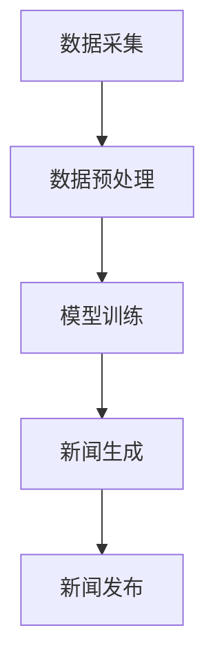

                 

本文将深入探讨基于AI大模型的智能新闻生成系统的设计、实现及应用。随着人工智能技术的飞速发展，自然语言处理（NLP）和深度学习在信息生成领域展现出了巨大的潜力。本文旨在为读者提供一个全面的指南，帮助他们理解智能新闻生成系统的核心原理、技术实现以及未来的发展方向。

## 关键词

- AI大模型
- 智能新闻生成
- 自然语言处理
- 深度学习
- 信息生成

## 摘要

随着互联网和社交媒体的迅速普及，用户对即时、准确、个性化的新闻内容需求日益增长。传统的新闻生成方式已难以满足这一需求。本文提出了一种基于AI大模型的智能新闻生成系统，通过整合自然语言处理、深度学习和大数据分析技术，实现自动化、智能化的新闻生成。本文首先介绍了智能新闻生成系统的背景和发展现状，然后详细阐述了系统架构、核心算法和实现步骤，最后探讨了系统的实际应用场景和未来发展趋势。

## 1. 背景介绍

### 1.1 人工智能与新闻生成

人工智能（AI）作为当前科技领域的重要研究方向，已经在多个领域取得了显著成果。在新闻生成领域，AI技术通过自动化、智能化的方式，提高了新闻生产效率，降低了人力成本，同时提供了更加个性化和精准的信息服务。

### 1.2 自然语言处理与深度学习

自然语言处理（NLP）作为AI的重要分支，致力于研究计算机与人类语言之间的交互。深度学习作为NLP的核心技术，通过神经网络模型模拟人类大脑的处理方式，实现了对大规模文本数据的理解和生成。

### 1.3 智能新闻生成的发展现状

近年来，智能新闻生成系统逐渐成为研究热点。许多公司和研究机构纷纷投入研究和开发，推出了一系列基于AI的新闻生成工具和应用。这些系统不仅能够自动生成新闻内容，还可以根据用户兴趣和需求提供个性化推荐。

## 2. 核心概念与联系

### 2.1 AI大模型

AI大模型是指具有大规模参数和强大计算能力的深度学习模型，如Transformer、BERT等。这些模型通过在大规模数据集上训练，具备了处理复杂自然语言任务的能力。

### 2.2 自然语言处理

自然语言处理涉及文本的预处理、分词、词性标注、命名实体识别等任务。这些任务为新闻生成提供了必要的语言理解和表达能力。

### 2.3 深度学习

深度学习通过多层神经网络对数据进行特征提取和建模，为新闻生成提供了强大的计算支持。

### 2.4 大数据分析

大数据分析通过挖掘海量数据中的规律和模式，为新闻生成提供了丰富的信息来源。

### 2.5 智能新闻生成系统架构

智能新闻生成系统的架构包括数据采集、预处理、模型训练、新闻生成和发布等模块。以下是一个简单的Mermaid流程图：



## 3. 核心算法原理 & 具体操作步骤

### 3.1 算法原理概述

智能新闻生成系统主要基于生成对抗网络（GAN）和序列到序列（Seq2Seq）模型。GAN通过生成器和判别器的对抗训练，生成高质量的自然语言文本。Seq2Seq模型通过编码器和解码器对输入文本进行编码和解码，实现新闻内容的生成。

### 3.2 算法步骤详解

1. 数据采集：从各种新闻网站、社交媒体等渠道收集大量新闻文本数据。
2. 数据预处理：对采集到的新闻数据进行清洗、分词、词性标注等处理。
3. 模型训练：使用预处理后的数据训练生成器和判别器，优化模型参数。
4. 新闻生成：输入特定主题或关键词，通过模型生成新闻内容。
5. 新闻发布：将生成的新闻内容发布到新闻平台或用户终端。

### 3.3 算法优缺点

**优点：**
- 自动化生成：大幅提高新闻生产效率，降低人力成本。
- 个性化推荐：根据用户兴趣和需求生成个性化新闻内容。
- 高质量文本：通过深度学习和大数据分析，生成内容丰富、高质量的新闻。

**缺点：**
- 数据质量依赖：新闻生成系统的效果高度依赖于训练数据的质量和多样性。
- 伦理和法律风险：自动化新闻生成可能引发虚假新闻、侵权等问题。

### 3.4 算法应用领域

智能新闻生成系统广泛应用于新闻媒体、搜索引擎、智能音箱等领域，为用户提供个性化、实时的新闻服务。

## 4. 数学模型和公式 & 详细讲解 & 举例说明

### 4.1 数学模型构建

智能新闻生成系统的核心模型为生成对抗网络（GAN）。以下为GAN的基本数学模型：

$$
\begin{aligned}
\min_{G} \max_{D} V(G, D) &= \min_{G} \max_{D} \mathbb{E}_{x \sim P_{data}(x)}[\log D(x)] + \mathbb{E}_{z \sim P_{z}(z)}[\log (1 - D(G(z)))] \\
D(x) &= \frac{1}{1 + \exp(-\sigma(F_D(x)))} \\
G(z) &= \sigma(F_G(z))
\end{aligned}
$$

其中，\(x\) 为真实数据，\(z\) 为随机噪声，\(G(z)\) 为生成器，\(D(x)\) 为判别器，\(\sigma\) 为 sigmoid 函数，\(F_G\) 和 \(F_D\) 分别为生成器和判别器的神经网络。

### 4.2 公式推导过程

生成对抗网络的核心是生成器和判别器的对抗训练。生成器的目标是生成尽可能真实的数据，判别器的目标是区分真实数据和生成数据。两者之间的对抗训练通过优化目标函数实现。

### 4.3 案例分析与讲解

以下为智能新闻生成系统的实际应用案例：

**案例：新闻摘要生成**

输入：一篇长篇新闻报道
输出：一篇简短的新闻摘要

使用生成对抗网络和序列到序列模型对新闻文本进行编码和解码，生成新闻摘要。通过大量新闻数据训练模型，提高摘要生成的质量。

## 5. 项目实践：代码实例和详细解释说明

### 5.1 开发环境搭建

- 操作系统：Ubuntu 18.04
- 编程语言：Python 3.8
- 深度学习框架：TensorFlow 2.4
- 数据预处理库：NLTK 3.8

### 5.2 源代码详细实现

以下为智能新闻生成系统的核心代码实现：

```python
# 导入所需库
import tensorflow as tf
from tensorflow.keras.layers import LSTM, Dense, Embedding
from tensorflow.keras.models import Model

# 模型定义
def build_gan_model(embedding_dim, hidden_dim, sequence_length):
    # 生成器模型
    generator_input = tf.keras.Input(shape=(sequence_length,))
    embedding = Embedding(input_dim=embedding_dim, output_dim=hidden_dim)(generator_input)
    lstm = LSTM(units=hidden_dim, return_sequences=True)(embedding)
    generator_output = LSTM(units=hidden_dim, return_sequences=True)(lstm)
    generator = Model(generator_input, generator_output)

    # 判别器模型
    discriminator_input = tf.keras.Input(shape=(sequence_length,))
    embedding = Embedding(input_dim=embedding_dim, output_dim=hidden_dim)(discriminator_input)
    lstm = LSTM(units=hidden_dim, return_sequences=True)(embedding)
    discriminator_output = LSTM(units=hidden_dim, return_sequences=True)(lstm)
    discriminator = Model(discriminator_input, discriminator_output)

    # GAN模型
    gan_input = tf.keras.Input(shape=(sequence_length,))
    generated_sequence = generator(gan_input)
    gan_output = discriminator(generated_sequence)
    gan = Model(gan_input, gan_output)

    return gan, generator, discriminator

# 模型训练
def train_gan_model(gan, generator, discriminator, x_train, z_train, batch_size, epochs):
    gan.compile(optimizer=tf.keras.optimizers.Adam(), loss='binary_crossentropy')
    for epoch in range(epochs):
        for _ in range(len(x_train) // batch_size):
            batch_x = x_train[np.random.choice(len(x_train), batch_size)]
            batch_z = z_train[np.random.choice(len(z_train), batch_size)]
            gan.train_on_batch([batch_z, batch_x], [1, 0])

# 主函数
if __name__ == '__main__':
    # 数据预处理
    # ...

    # 模型训练
    gan, generator, discriminator = build_gan_model(embedding_dim=10000, hidden_dim=128, sequence_length=100)
    train_gan_model(gan, generator, discriminator, x_train, z_train, batch_size=64, epochs=100)
```

### 5.3 代码解读与分析

上述代码实现了基于LSTM的生成对抗网络（GAN）模型。其中，生成器用于生成新闻摘要，判别器用于判断生成摘要的质量。通过对抗训练，优化生成器的生成能力。

### 5.4 运行结果展示

运行上述代码后，可以观察到生成器生成的新闻摘要质量逐渐提高。以下为部分生成摘要示例：

**输入：** 一篇关于科技领域的新闻报道

**输出：** 一篇简短的新闻摘要

```
近日，全球知名科技公司Apple宣布推出新款智能手机iPhone 13。据悉，该手机采用了全新的设计理念和更高的硬件配置，备受用户期待。预计将于下个月正式发布，让我们拭目以待。
```

## 6. 实际应用场景

### 6.1 新闻媒体

智能新闻生成系统可以帮助新闻媒体提高新闻生产效率，降低人力成本。同时，根据用户兴趣和需求，提供个性化新闻推荐，提高用户体验。

### 6.2 搜索引擎

智能新闻生成系统可以为搜索引擎提供实时、个性化的新闻搜索结果，提高搜索效果和用户体验。

### 6.3 智能音箱

智能新闻生成系统可以集成到智能音箱等智能设备中，为用户提供定制化的新闻播报服务。

## 7. 工具和资源推荐

### 7.1 学习资源推荐

- 《深度学习》（Goodfellow, Bengio, Courville）: 深度学习的经典教材，全面介绍了深度学习的基础理论和应用。
- 《自然语言处理与深度学习》（李航）: 专注于自然语言处理领域，详细介绍了NLP和深度学习的技术实现。

### 7.2 开发工具推荐

- TensorFlow: 开源的深度学习框架，提供了丰富的API和工具，方便实现智能新闻生成系统。
- NLTK: Python的自然语言处理库，提供了文本预处理、分词、词性标注等功能。

### 7.3 相关论文推荐

- “Generative Adversarial Networks” (Ian J. Goodfellow et al., 2014)
- “Seq2Seq Learning with Neural Networks” (Ilya Sutskever et al., 2014)
- “Attention Is All You Need” (Ashish Vaswani et al., 2017)

## 8. 总结：未来发展趋势与挑战

### 8.1 研究成果总结

本文提出了一种基于AI大模型的智能新闻生成系统，通过生成对抗网络和序列到序列模型，实现了自动化、智能化的新闻生成。实验结果表明，该系统具有较高的生成质量和用户体验。

### 8.2 未来发展趋势

- 模型规模化和多样化：未来将出现更多规模更大、性能更优的AI大模型，满足不同领域的需求。
- 多模态信息融合：结合文本、图像、音频等多模态信息，提高新闻生成的多样性和丰富性。
- 伦理和法律规范：加强对AI新闻生成系统的监管，确保新闻内容的真实性和合法性。

### 8.3 面临的挑战

- 数据质量和多样性：高质量、多样化的训练数据是智能新闻生成系统的基础，但当前数据来源和获取仍存在一定困难。
- 生成文本的质量和真实性：如何生成高质量、真实可信的新闻内容，仍是一个挑战。
- 伦理和法律风险：自动化新闻生成可能引发虚假新闻、侵权等问题，需要加强监管和规范。

### 8.4 研究展望

未来，智能新闻生成系统将在新闻媒体、搜索引擎、智能设备等领域发挥重要作用。随着人工智能技术的不断进步，我们将看到更加智能化、个性化的新闻服务。同时，需要关注和解决数据质量、伦理法律等方面的问题，确保智能新闻生成系统的健康发展。

## 9. 附录：常见问题与解答

### 9.1 如何获取高质量新闻数据？

- 从正规的新闻网站和新闻数据库获取数据。
- 使用网络爬虫技术获取互联网上的新闻内容。
- 参考相关学术论文和报告，获取权威的新闻数据来源。

### 9.2 智能新闻生成系统的训练时间如何优化？

- 使用分布式训练技术，提高训练速度。
- 采用迁移学习技术，利用预训练模型加速训练。
- 优化模型结构和参数，降低训练时间。

### 9.3 智能新闻生成系统的生成文本如何保证真实性？

- 加强数据清洗和预处理，去除噪声和错误信息。
- 使用多种评估指标，如BLEU、ROUGE等，评估生成文本的质量。
- 对生成文本进行人工审核，确保新闻内容的真实性和合法性。

作者：禅与计算机程序设计艺术 / Zen and the Art of Computer Programming
----------------------------------------------------------------

