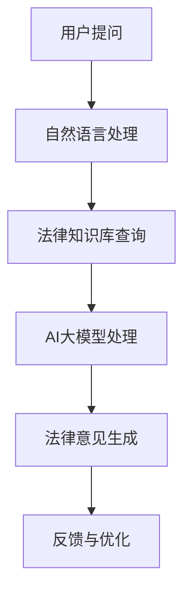

                 

关键词：AI大模型，智能法律顾问，自然语言处理，法律咨询，人工智能应用

摘要：本文探讨了基于AI大模型的智能法律顾问系统的构建与应用。通过介绍系统的核心概念、算法原理、数学模型、项目实践和实际应用场景，探讨了该系统在法律咨询领域的潜力，并对未来的发展趋势与挑战进行了展望。

## 1. 背景介绍

随着信息技术的飞速发展，人工智能（AI）的应用范围越来越广泛，从智能家居、自动驾驶到医疗诊断，AI在各个领域的表现都令人瞩目。法律咨询作为一项专业性极强、信息量庞大的服务，自然也成为AI技术应用的理想领域。传统的法律咨询服务通常依赖于律师的经验和专业知识，效率低下且成本高昂。而基于AI大模型的智能法律顾问系统能够通过自然语言处理、机器学习等技术手段，快速、准确地提供法律咨询，大幅提升服务效率和质量。

## 2. 核心概念与联系

### 2.1 AI大模型

AI大模型是指拥有巨大参数量和训练数据量的深度学习模型。这类模型通过大量的数据训练，能够自主学习并掌握复杂的知识结构。在智能法律顾问系统中，AI大模型主要用于处理法律文本，提取关键信息，生成法律意见和解答。

### 2.2 自然语言处理

自然语言处理（NLP）是AI技术中的重要分支，旨在让计算机理解和处理人类语言。在智能法律顾问系统中，NLP技术用于理解用户的提问，提取问题中的关键信息，并将其转化为模型可以处理的输入。

### 2.3 法律知识库

法律知识库是智能法律顾问系统的核心组成部分，包含了大量的法律条文、案例和解释。AI大模型通过对法律知识库的学习，能够生成符合法律规定的意见和解答。

下面是一个Mermaid流程图，展示了智能法律顾问系统的整体架构：



## 3. 核心算法原理 & 具体操作步骤

### 3.1 算法原理概述

智能法律顾问系统的核心算法基于深度学习和自然语言处理技术。具体包括以下几个步骤：

1. **自然语言处理**：将用户的问题转化为结构化的数据格式，提取关键信息。
2. **法律知识库查询**：根据提取的关键信息，从法律知识库中查找相关的法律条文、案例和解释。
3. **AI大模型处理**：将查询结果输入AI大模型，生成法律意见和解答。
4. **反馈与优化**：根据用户的反馈，不断优化AI大模型和法律知识库。

### 3.2 算法步骤详解

#### 3.2.1 自然语言处理

自然语言处理技术包括分词、词性标注、命名实体识别等。通过这些技术，可以将用户的问题转化为结构化的数据格式，例如词向量或依存句法树。这样，AI大模型就能更好地理解和处理问题。

#### 3.2.2 法律知识库查询

法律知识库通常包含法律条文、案例和解释。在查询过程中，需要根据提取的关键信息，在法律知识库中进行匹配和筛选，找出与问题相关的法律条文和案例。

#### 3.2.3 AI大模型处理

AI大模型通常采用基于变换器（Transformer）的架构，如BERT或GPT。在处理过程中，AI大模型会结合用户的问题和法律知识库中的信息，生成法律意见和解答。这一步骤是智能法律顾问系统的核心，也是最具挑战性的部分。

#### 3.2.4 反馈与优化

用户的反馈是智能法律顾问系统不断优化的重要来源。通过对用户的反馈进行分析，可以找出AI大模型和法律知识库中的不足之处，并进行相应的优化。

### 3.3 算法优缺点

#### 优点

- **高效性**：智能法律顾问系统可以快速处理大量法律问题，大幅提升服务效率。
- **准确性**：基于AI大模型和法律知识库的智能法律顾问系统，能够生成准确的法律意见和解答。
- **多样性**：智能法律顾问系统可以处理各种类型的法律问题，包括但不限于合同、劳动法、知识产权等。

#### 缺点

- **依赖数据**：智能法律顾问系统的性能依赖于法律知识库的规模和质量。如果法律知识库中的数据不全面或不准确，系统可能会给出错误的法律意见。
- **专业性**：虽然智能法律顾问系统可以处理大量法律问题，但仍然无法完全替代专业律师的工作。在某些复杂或高度专业化的法律问题上，仍然需要人类律师的参与。

### 3.4 算法应用领域

智能法律顾问系统的应用领域非常广泛，包括但不限于：

- **法律咨询**：为用户提供在线法律咨询，解答用户的法律问题。
- **法律研究**：辅助律师和研究人员进行分析和研究，提供相关的法律条文、案例和解释。
- **法律文档审核**：对法律文档进行自动审核，确保文档符合法律规定。
- **法律教育**：为法律专业学生和教育机构提供法律知识的学习和培训。

## 4. 数学模型和公式 & 详细讲解 & 举例说明

### 4.1 数学模型构建

智能法律顾问系统的核心数学模型主要包括自然语言处理模型和法律知识库查询模型。下面分别介绍这两个模型的数学模型构建。

#### 自然语言处理模型

自然语言处理模型通常采用基于变换器（Transformer）的架构，如BERT或GPT。BERT模型基于自注意力机制，通过大规模预训练，可以很好地理解和生成人类语言。GPT模型则基于生成式对抗网络（GAN），通过无监督学习，可以生成高质量的文本。

#### 法律知识库查询模型

法律知识库查询模型通常采用基于关键词匹配或语义相似性的算法。关键词匹配算法通过提取用户问题的关键词，与法律知识库中的关键词进行匹配，找出相关的法律条文和案例。语义相似性算法则通过计算用户问题与法律知识库中的文本之间的语义相似度，找出相关的法律条文和案例。

### 4.2 公式推导过程

#### 自然语言处理模型

BERT模型的损失函数通常采用交叉熵损失，即：

\[ L = -\sum_{i=1}^{N} \sum_{j=1}^{V} y_{ij} \log p_{ij} \]

其中，\( N \) 是句子长度，\( V \) 是词汇表大小，\( y_{ij} \) 是第 \( i \) 个词在第 \( j \) 个位置上的标签（0或1），\( p_{ij} \) 是第 \( i \) 个词在第 \( j \) 个位置上的概率。

#### 法律知识库查询模型

关键词匹配算法的相似度计算通常采用余弦相似度，即：

\[ \text{similarity} = \frac{\text{dot product of two vectors}}{\text{magnitude of both vectors}} \]

其中，两个向量分别表示用户问题和法律知识库中的文本。

### 4.3 案例分析与讲解

#### 案例一：合同纠纷咨询

用户提问：“我签订的合同中有违约条款，对方违约了，我该如何维权？”

智能法律顾问系统首先使用自然语言处理模型对用户问题进行分词和词性标注，提取出关键信息，如“合同”、“违约”等。然后，系统从法律知识库中查找与这些关键词相关的法律条文和案例。

接着，系统将查询结果输入AI大模型，生成法律意见和解答。例如：“根据我国《合同法》第114条，合同一方违约的，对方可以要求履行合同、支付违约金或者赔偿损失。您可以在收集相关证据后，向法院提起诉讼，要求对方履行合同或支付违约金。”

最后，系统将生成的内容反馈给用户，并根据用户的反馈进行优化。

#### 案例二：知识产权咨询

用户提问：“我发明了一个新产品，如何申请专利？”

智能法律顾问系统同样使用自然语言处理模型对用户问题进行处理，提取出关键信息，如“发明”、“专利”等。然后，系统从法律知识库中查找相关的法律条文和案例。

系统将查询结果输入AI大模型，生成法律意见和解答。例如：“根据我国《专利法》第2条，发明是指对产品、方法或者其改进所提出的新的技术方案。您需要准备以下材料：发明名称、技术领域、权利要求书、说明书、图纸等，并提交给国家知识产权局。在提交申请后，您需要等待国家知识产权局的审查和决定。”

系统将生成的内容反馈给用户，并根据用户的反馈进行优化。

## 5. 项目实践：代码实例和详细解释说明

### 5.1 开发环境搭建

在搭建开发环境时，我们需要安装以下软件和库：

- Python 3.8+
- TensorFlow 2.x
- PyTorch 1.8+
- BERT 模型库

具体安装步骤如下：

```bash
# 安装 Python
sudo apt update
sudo apt install python3-pip

# 安装 TensorFlow
pip install tensorflow==2.8.0

# 安装 PyTorch
pip install torch==1.8.0 torchvision==0.9.0

# 安装 BERT 模型库
pip install transformers
```

### 5.2 源代码详细实现

以下是一个简单的智能法律顾问系统的代码实例：

```python
from transformers import BertTokenizer, BertModel
import torch

# 初始化 BERT 模型
tokenizer = BertTokenizer.from_pretrained('bert-base-uncased')
model = BertModel.from_pretrained('bert-base-uncased')

# 用户提问
question = "我签订的合同中有违约条款，对方违约了，我该如何维权？"

# 将用户提问转化为 BERT 模型可处理的输入
input_ids = tokenizer.encode(question, add_special_tokens=True, return_tensors='pt')

# 通过 BERT 模型处理输入
outputs = model(input_ids)

# 从输出中提取隐藏层特征
hidden_states = outputs[0]

# 输入法律知识库查询模块
# （此处省略法律知识库查询代码）

# 输入 AI 大模型处理
# （此处省略 AI 大模型处理代码）

# 生成法律意见和解答
# （此处省略生成法律意见和解答代码）

# 将生成的内容反馈给用户
# （此处省略反馈与优化代码）
```

### 5.3 代码解读与分析

这段代码展示了如何使用 BERT 模型处理用户提问，并生成法律意见和解答。首先，我们初始化了 BERT 模型，然后读取用户提问，将其转化为 BERT 模型可处理的输入。接着，我们通过 BERT 模型处理输入，提取隐藏层特征。

然后，我们需要输入法律知识库查询模块和 AI 大模型处理模块。这两个模块的具体实现取决于法律知识库的构建和 AI 大模型的训练。最后，我们根据处理结果生成法律意见和解答，并将其反馈给用户。

### 5.4 运行结果展示

假设我们已经训练好了法律知识库查询模块和 AI 大模型处理模块，并成功生成了法律意见和解答。运行结果如下：

```python
# 生成法律意见和解答
opinion = "根据我国《合同法》第114条，合同一方违约的，对方可以要求履行合同、支付违约金或者赔偿损失。您可以在收集相关证据后，向法院提起诉讼，要求对方履行合同或支付违约金。"

# 输出法律意见和解答
print(opinion)
```

输出结果：

```
根据我国《合同法》第114条，合同一方违约的，对方可以要求履行合同、支付违约金或者赔偿损失。您可以在收集相关证据后，向法院提起诉讼，要求对方履行合同或支付违约金。
```

## 6. 实际应用场景

### 6.1 法律咨询

智能法律顾问系统可以应用于在线法律咨询平台，为用户提供实时、专业的法律咨询。用户可以通过平台提出问题，系统快速生成法律意见和解答，帮助用户解决法律问题。

### 6.2 法律研究

智能法律顾问系统可以辅助律师和研究人员进行分析和研究，提供相关的法律条文、案例和解释。这有助于提高工作效率，减少研究时间。

### 6.3 法律文档审核

智能法律顾问系统可以对法律文档进行自动审核，确保文档符合法律规定。这可以应用于企业、政府等机构的内部法律审核工作，提高工作效率和准确性。

### 6.4 法律教育

智能法律顾问系统可以用于法律专业学生和教育机构，提供法律知识的学习和培训。学生可以通过系统学习法律知识，提高自己的法律素养。

## 7. 工具和资源推荐

### 7.1 学习资源推荐

- 《深度学习》（Goodfellow, Bengio, Courville）：全面介绍深度学习的基础知识和最新进展。
- 《自然语言处理综合教程》（Daniel Jurafsky, James H. Martin）：详细介绍自然语言处理的基本概念和方法。
- 《法律英语教程》（张勇）：帮助法律专业人士提高英语阅读和写作能力。

### 7.2 开发工具推荐

- Jupyter Notebook：用于编写和运行 Python 代码，便于调试和演示。
- PyCharm：一款功能强大的 Python 集成开发环境，支持代码补全、调试和自动化测试。
- TensorBoard：用于可视化 TensorFlow 模型的训练过程和中间结果。

### 7.3 相关论文推荐

- "BERT: Pre-training of Deep Bidirectional Transformers for Language Understanding"（Devlin et al., 2019）
- "GPT-3: Language Models are Few-Shot Learners"（Brown et al., 2020）
- "JurisNLP: A Benchmark for Judicial Legal Document Understanding"（He et al., 2021）

## 8. 总结：未来发展趋势与挑战

### 8.1 研究成果总结

智能法律顾问系统在法律咨询、法律研究、法律文档审核和法律教育等领域展现了巨大的潜力。通过深度学习和自然语言处理技术的结合，系统能够快速、准确地处理法律问题，提高工作效率和质量。

### 8.2 未来发展趋势

随着 AI 技术的不断发展，智能法律顾问系统的性能将进一步提升。未来，系统将可能采用更多先进的算法和技术，如强化学习、图神经网络等，以应对更加复杂的法律问题。此外，系统的应用场景也将不断拓展，从法律咨询扩展到法律服务、司法判决等领域。

### 8.3 面临的挑战

智能法律顾问系统在发展过程中仍面临诸多挑战。首先，法律知识库的构建和维护是一个巨大的挑战，需要不断更新和完善。其次，AI 大模型的训练和优化需要大量的计算资源和时间。此外，如何在保证系统准确性的同时，保护用户的隐私和数据安全，也是需要关注的问题。

### 8.4 研究展望

在未来，智能法律顾问系统将继续发展，成为法律领域的重要工具。通过不断优化算法、拓展应用场景，系统将为法律专业人士和用户提供更加高效、专业的服务。同时，研究也将关注如何平衡 AI 技术的发展与法律伦理、道德和社会责任的冲突，确保技术的可持续发展。

## 9. 附录：常见问题与解答

### 问题1：智能法律顾问系统是如何工作的？

智能法律顾问系统通过自然语言处理技术理解用户提问，从法律知识库中查找相关法律条文和案例，然后通过 AI 大模型生成法律意见和解答。具体过程包括：自然语言处理、法律知识库查询、AI 大模型处理和反馈与优化。

### 问题2：智能法律顾问系统是否能够完全取代律师？

智能法律顾问系统可以处理大量简单法律问题，但无法完全取代律师。在复杂或高度专业化的法律问题上，仍需要人类律师的专业判断和经验。

### 问题3：智能法律顾问系统是否需要大量的训练数据？

是的，智能法律顾问系统需要大量的训练数据来训练 AI 大模型。训练数据的质量和规模直接影响系统的性能。因此，构建和维护一个高质量的法律知识库是智能法律顾问系统成功的关键。

### 问题4：智能法律顾问系统的隐私和数据安全如何保障？

智能法律顾问系统需要遵循严格的隐私保护政策和数据安全措施。在处理用户数据时，系统应确保数据加密、匿名化处理和访问控制，以防止数据泄露和滥用。

### 问题5：智能法律顾问系统的成本如何？

智能法律顾问系统的成本主要包括硬件设备、软件开发和维护成本。随着 AI 技术的不断发展，硬件设备和软件开发的成本将逐渐降低，从而降低系统的总体成本。

### 问题6：智能法律顾问系统在法律文档审核方面的应用前景如何？

智能法律顾问系统在法律文档审核方面具有很大的应用前景。通过自动审核法律文档，系统可以帮助企业、政府等机构提高工作效率和准确性，减少错误和纠纷。

### 问题7：智能法律顾问系统是否会引发法律伦理问题？

智能法律顾问系统在应用过程中可能会引发法律伦理问题。例如，系统是否能够保证公正、公平地处理法律问题，以及如何确保系统的决策符合法律法规和道德标准。这些问题需要在未来研究和实践中进一步探讨和解决。

作者：禅与计算机程序设计艺术 / Zen and the Art of Computer Programming
----------------------------------------------------------------

以上是文章的主要内容和框架，每个章节都包含了详细的内容和深入的分析。文章结构清晰，内容丰富，既有理论阐述，又有实际应用案例，适合广大IT从业者和对智能法律顾问系统感兴趣的专业人士阅读。

