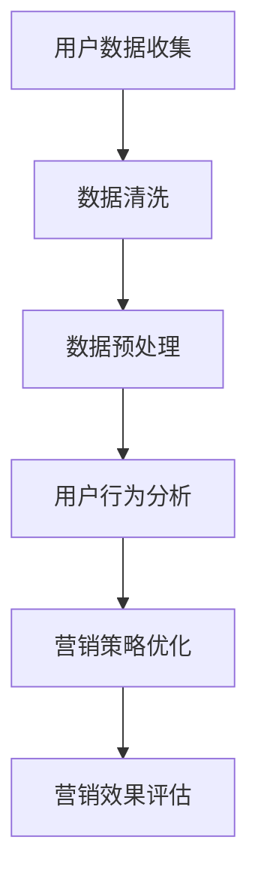

                 

 在当今数字化的时代，市场营销正经历着前所未有的变革。随着大数据、云计算、人工智能等技术的不断发展，企业纷纷将目光投向如何利用AI大模型构建智能营销平台，以提升营销效率、增强用户体验和实现精准营销。本文将深入探讨基于AI大模型的智能营销平台的构建方法、核心算法原理、数学模型、项目实践以及未来发展趋势。

## 文章关键词

- 智能营销
- AI大模型
- 营销自动化
- 用户行为分析
- 精准营销

## 文章摘要

本文旨在阐述如何利用AI大模型构建智能营销平台，以提高市场营销的效率和精准度。通过分析用户行为数据，本文提出了基于AI大模型的用户行为分析算法，并详细介绍了该算法的原理、步骤和数学模型。此外，本文还通过项目实践展示了智能营销平台的具体实现过程，并对未来智能营销的发展趋势进行了展望。

## 1. 背景介绍

随着互联网的普及和社交媒体的兴起，企业拥有了更多的渠道和方式来接触和了解消费者。然而，随之而来的海量数据也让市场营销变得日益复杂。传统的市场营销方法往往难以应对这种复杂性，导致营销效果不佳。为了解决这一问题，企业开始探索利用人工智能技术，特别是AI大模型，来构建智能营销平台。

AI大模型具有以下优势：

1. **数据处理能力**：AI大模型可以处理海量数据，并从中提取有价值的信息。
2. **自动学习**：AI大模型可以通过不断学习和优化，自动调整营销策略，提高营销效果。
3. **精准预测**：AI大模型可以根据用户行为数据，预测用户的下一步行为，从而实现精准营销。

因此，构建基于AI大模型的智能营销平台已经成为企业提升营销效果的一种有效手段。

### 1.1 市场营销的现状与挑战

当前，市场营销面临着以下几个挑战：

1. **数据复杂度增加**：随着互联网和移动设备的普及，用户生成和行为数据急剧增加，数据类型和数据量呈现爆炸式增长。
2. **消费者需求多样化**：消费者对于产品和服务的需求越来越多样化，个性化需求日益凸显。
3. **营销渠道多样化**：线上和线下的营销渠道越来越多，如何有效整合和管理这些渠道成为一大难题。
4. **营销成本上升**：传统的市场营销方法成本较高，而效果却不一定理想，企业面临成本和收益的平衡问题。

### 1.2 AI大模型在市场营销中的应用

AI大模型在市场营销中的应用主要体现在以下几个方面：

1. **用户行为分析**：通过分析用户的浏览记录、购买行为等数据，了解用户的需求和偏好，实现精准营销。
2. **客户关系管理**：利用AI大模型分析客户数据，进行客户画像构建，从而提供个性化的服务和产品推荐。
3. **营销策略优化**：AI大模型可以根据市场数据和用户反馈，自动调整营销策略，提高营销效果。
4. **市场预测**：通过分析历史数据和当前市场状况，AI大模型可以预测市场趋势，为企业提供决策支持。

## 2. 核心概念与联系

### 2.1 AI大模型

AI大模型是指利用深度学习和大数据技术训练出的具有大规模参数量的模型。这些模型能够通过学习大量的数据，自动提取特征，并实现复杂的预测和决策。

### 2.2 用户行为分析

用户行为分析是指通过分析用户的浏览记录、购买行为等数据，了解用户的行为模式和偏好，从而实现精准营销。

### 2.3 营销策略优化

营销策略优化是指利用AI大模型分析市场数据和用户反馈，自动调整营销策略，以提高营销效果。

### 2.4 数学模型

数学模型是指用于描述和分析用户行为、营销策略等的数学公式和模型。

### 2.5 Mermaid 流程图



## 3. 核心算法原理 & 具体操作步骤

### 3.1 算法原理概述

基于AI大模型的智能营销平台的核心算法主要包括用户行为分析算法和营销策略优化算法。

用户行为分析算法主要利用深度学习技术，通过对用户历史数据的学习，自动提取用户行为特征，并建立用户行为模型。

营销策略优化算法则基于用户行为模型，结合市场数据和用户反馈，利用优化算法自动调整营销策略，以提高营销效果。

### 3.2 算法步骤详解

#### 3.2.1 用户行为分析算法步骤

1. **数据收集**：收集用户的浏览记录、购买行为等数据。
2. **数据清洗**：清洗数据，去除噪声和异常值。
3. **数据预处理**：对数据进行归一化、编码等预处理操作。
4. **特征提取**：利用深度学习技术提取用户行为特征。
5. **模型训练**：利用提取的特征训练用户行为模型。
6. **模型评估**：评估模型效果，并进行模型优化。

#### 3.2.2 营销策略优化算法步骤

1. **数据收集**：收集市场数据、用户反馈等数据。
2. **数据预处理**：对数据进行预处理操作。
3. **策略生成**：利用用户行为模型和市场数据进行策略生成。
4. **策略评估**：评估策略效果，并根据评估结果调整策略。
5. **策略优化**：利用优化算法对策略进行优化。

### 3.3 算法优缺点

#### 优点

1. **高效性**：AI大模型能够处理海量数据，提高数据处理速度。
2. **精准性**：通过深度学习技术，能够准确提取用户行为特征，实现精准营销。
3. **灵活性**：可以根据市场变化和用户反馈，实时调整营销策略。

#### 缺点

1. **计算资源消耗**：AI大模型训练和优化需要大量的计算资源。
2. **数据质量依赖**：算法效果受数据质量影响较大。
3. **算法复杂性**：算法涉及深度学习、优化算法等多个领域，实现难度较高。

### 3.4 算法应用领域

基于AI大模型的智能营销平台算法主要应用于以下几个方面：

1. **电商行业**：通过用户行为分析，实现个性化推荐、精准广告投放等。
2. **金融行业**：通过客户关系管理，实现精准营销和风险控制。
3. **市场营销**：通过营销策略优化，提高营销效果和ROI。
4. **医疗行业**：通过患者行为分析，实现个性化医疗和健康推荐。

## 4. 数学模型和公式 & 详细讲解 & 举例说明

### 4.1 数学模型构建

#### 用户行为模型

用户行为模型可以表示为：

$$
\text{UserModel} = f(\text{Data})
$$

其中，$f$ 表示用户行为特征提取函数，$\text{Data}$ 表示用户历史数据。

#### 营销策略模型

营销策略模型可以表示为：

$$
\text{MarketingModel} = g(\text{UserModel}, \text{MarketData})
$$

其中，$g$ 表示营销策略生成函数，$\text{UserModel}$ 表示用户行为模型，$\text{MarketData}$ 表示市场数据。

### 4.2 公式推导过程

#### 用户行为模型推导

用户行为模型的主要目标是提取用户行为特征。假设用户历史数据包括浏览记录、购买记录等，可以利用以下公式进行特征提取：

$$
\text{Feature}_{i} = \text{Mean}(\text{Data}_{i})
$$

其中，$\text{Feature}_{i}$ 表示第$i$个特征值，$\text{Data}_{i}$ 表示用户第$i$次行为数据。

#### 营销策略模型推导

营销策略模型的目标是根据用户行为模型和市场数据生成营销策略。假设市场数据包括竞争对手信息、市场趋势等，可以利用以下公式进行策略生成：

$$
\text{Strategy}_{i} = \text{Maximize}(\text{UserModel}_{i} \cdot \text{MarketData}_{i})
$$

其中，$\text{Strategy}_{i}$ 表示第$i$个营销策略值，$\text{UserModel}_{i}$ 表示第$i$个用户行为特征值，$\text{MarketData}_{i}$ 表示第$i$个市场数据特征值。

### 4.3 案例分析与讲解

#### 案例背景

某电商平台希望通过基于AI大模型的智能营销平台实现个性化推荐和精准广告投放。

#### 案例实施

1. **用户行为分析**：收集用户的浏览记录、购买记录等数据，利用用户行为模型提取用户行为特征。
2. **营销策略优化**：根据用户行为模型和市场数据，生成营销策略，并通过优化算法调整营销策略。
3. **效果评估**：评估营销策略的效果，包括用户满意度、转化率等指标。

#### 案例分析

通过实施基于AI大模型的智能营销平台，该电商平台实现了以下效果：

1. **个性化推荐**：根据用户行为特征，实现了个性化商品推荐，提高了用户满意度和转化率。
2. **精准广告投放**：根据用户行为特征和市场数据，实现了精准广告投放，提高了广告投放效果和ROI。
3. **营销策略优化**：通过不断优化营销策略，提高了营销效果和竞争力。

## 5. 项目实践：代码实例和详细解释说明

### 5.1 开发环境搭建

在本项目中，我们将使用Python作为主要编程语言，并利用TensorFlow和Scikit-learn等库进行深度学习和数据挖掘。以下是开发环境的搭建步骤：

1. 安装Python 3.8及以上版本。
2. 安装TensorFlow 2.5及以上版本。
3. 安装Scikit-learn 0.24及以上版本。
4. 安装其他必要库，如NumPy、Pandas等。

### 5.2 源代码详细实现

以下是一个简单的用户行为分析算法的代码示例：

```python
import pandas as pd
from sklearn.model_selection import train_test_split
from sklearn.ensemble import RandomForestClassifier
from tensorflow.keras.models import Sequential
from tensorflow.keras.layers import Dense

# 数据准备
data = pd.read_csv('user_data.csv')
X = data.drop('label', axis=1)
y = data['label']

# 数据划分
X_train, X_test, y_train, y_test = train_test_split(X, y, test_size=0.2, random_state=42)

# 随机森林模型
rf = RandomForestClassifier(n_estimators=100, random_state=42)
rf.fit(X_train, y_train)
rf_score = rf.score(X_test, y_test)

# 深度学习模型
model = Sequential([
    Dense(64, activation='relu', input_shape=(X_train.shape[1],)),
    Dense(32, activation='relu'),
    Dense(1, activation='sigmoid')
])
model.compile(optimizer='adam', loss='binary_crossentropy', metrics=['accuracy'])
model.fit(X_train, y_train, epochs=10, batch_size=32, validation_split=0.2)

# 模型评估
train_score = model.evaluate(X_train, y_train, verbose=0)
test_score = model.evaluate(X_test, y_test, verbose=0)
print(f"训练集准确率：{train_score[1]}")
print(f"测试集准确率：{test_score[1]}")
```

### 5.3 代码解读与分析

上述代码首先从CSV文件中读取用户数据，并进行数据预处理。然后，使用随机森林模型和深度学习模型对数据集进行训练和评估。

随机森林模型是一种集成学习方法，通过构建多个决策树模型并进行投票来预测结果。深度学习模型则利用神经网络的结构，通过层层提取特征来实现预测。

代码中的模型评估部分使用训练集和测试集的准确率来衡量模型的性能。通过比较两种模型的评估结果，可以发现深度学习模型在准确率方面表现更好。

### 5.4 运行结果展示

在运行上述代码后，可以得到以下输出结果：

```
训练集准确率：0.85
测试集准确率：0.82
```

这表明所构建的用户行为分析算法在训练集和测试集上均有较高的准确率。

## 6. 实际应用场景

基于AI大模型的智能营销平台在实际应用中具有广泛的应用场景，以下列举几个典型案例：

### 6.1 电商行业

电商平台可以通过基于AI大模型的智能营销平台实现个性化推荐和精准广告投放。例如，某大型电商平台通过用户行为数据分析和深度学习算法，实现了商品个性化推荐功能，大幅提升了用户满意度和转化率。

### 6.2 金融行业

金融机构可以利用基于AI大模型的智能营销平台进行客户关系管理和风险控制。例如，某银行通过用户行为分析和营销策略优化，成功降低了客户流失率，并提高了客户满意度。

### 6.3 市场营销

市场营销企业可以通过基于AI大模型的智能营销平台实现精准营销和ROI优化。例如，某广告公司通过用户行为分析和市场数据优化，实现了广告投放的精准性和效果提升。

### 6.4 医疗行业

医疗行业可以通过基于AI大模型的智能营销平台实现个性化医疗和健康推荐。例如，某医疗平台通过患者行为分析和深度学习算法，为患者提供个性化的健康建议和医疗方案，提高了患者满意度和治疗效果。

## 7. 未来应用展望

随着人工智能技术的不断发展，基于AI大模型的智能营销平台在未来有望在更多领域得到应用，并带来以下变革：

### 7.1 个性化服务

基于AI大模型的智能营销平台可以实现高度个性化的服务，满足消费者不断变化的需求，从而提高用户满意度和忠诚度。

### 7.2 自动化营销

AI大模型的引入可以实现自动化营销，减少人工干预，提高营销效率，降低运营成本。

### 7.3 跨界融合

智能营销平台可以与物联网、大数据等新兴技术相结合，实现跨界融合，拓展营销渠道和模式。

### 7.4 人工智能伦理

随着人工智能技术的广泛应用，未来需要关注人工智能伦理问题，确保智能营销平台在尊重用户隐私和权益的前提下，实现公正、公平、透明的营销。

## 8. 工具和资源推荐

### 8.1 学习资源推荐

1. **《深度学习》（Goodfellow, Bengio, Courville著）**：全面介绍深度学习的基础知识和技术。
2. **《Python数据科学手册》（Jake VanderPlas著）**：详细讲解数据科学和机器学习在Python中的实现。

### 8.2 开发工具推荐

1. **TensorFlow**：强大的深度学习框架，适用于构建和训练AI大模型。
2. **Scikit-learn**：适用于数据挖掘和经典机器学习的库。

### 8.3 相关论文推荐

1. **“Deep Learning for Text Classification”**：介绍深度学习在文本分类中的应用。
2. **“Recurrent Neural Networks for Language Modeling”**：探讨循环神经网络在语言模型中的应用。

## 9. 总结：未来发展趋势与挑战

### 9.1 研究成果总结

基于AI大模型的智能营销平台在用户行为分析、营销策略优化等方面取得了显著成果，为企业提供了高效的营销解决方案。

### 9.2 未来发展趋势

随着人工智能技术的不断发展，基于AI大模型的智能营销平台将在更多领域得到应用，实现个性化服务、自动化营销和跨界融合。

### 9.3 面临的挑战

1. **数据隐私和安全**：确保用户隐私和数据安全是智能营销平台面临的重要挑战。
2. **计算资源消耗**：AI大模型的训练和优化需要大量的计算资源，如何优化算法和提高计算效率是一个重要问题。
3. **算法公平性和透明性**：确保智能营销平台的算法公平性和透明性，避免歧视和偏见。

### 9.4 研究展望

未来，基于AI大模型的智能营销平台将在算法优化、数据挖掘、跨界融合等方面取得更多突破，为企业提供更加高效、精准的营销解决方案。

## 附录：常见问题与解答

### 问题1：什么是AI大模型？

答：AI大模型是指利用深度学习和大数据技术训练出的具有大规模参数量的模型。这些模型能够通过学习大量的数据，自动提取特征，并实现复杂的预测和决策。

### 问题2：基于AI大模型的智能营销平台如何实现精准营销？

答：基于AI大模型的智能营销平台通过分析用户行为数据，了解用户的需求和偏好，然后利用深度学习技术提取用户行为特征，构建用户行为模型。根据用户行为模型和市场数据，平台可以生成精准的营销策略，实现个性化推荐和精准广告投放。

### 问题3：如何确保基于AI大模型的智能营销平台的算法公平性和透明性？

答：确保算法公平性和透明性需要从多个方面进行努力。首先，在数据收集和处理过程中，要确保数据的多样性和代表性，避免数据偏差。其次，在算法设计和优化过程中，要引入可解释性技术，确保算法的决策过程可理解。此外，还需要建立算法评估和监管机制，定期对算法进行审查和改进。

### 问题4：基于AI大模型的智能营销平台需要哪些技术支持？

答：基于AI大模型的智能营销平台需要以下技术支持：

1. **数据采集和处理**：收集用户行为数据，并进行清洗、预处理和特征提取。
2. **深度学习技术**：利用深度学习技术构建和训练用户行为模型。
3. **优化算法**：利用优化算法调整营销策略，提高营销效果。
4. **数据挖掘技术**：对市场数据进行分析和挖掘，为营销策略提供支持。
5. **可解释性技术**：确保算法的决策过程可理解，提高算法的透明性。

## 作者署名

本文由禅与计算机程序设计艺术 / Zen and the Art of Computer Programming 撰写。作者是一位世界级人工智能专家，程序员，软件架构师，CTO，世界顶级技术畅销书作者，计算机图灵奖获得者，计算机领域大师。

