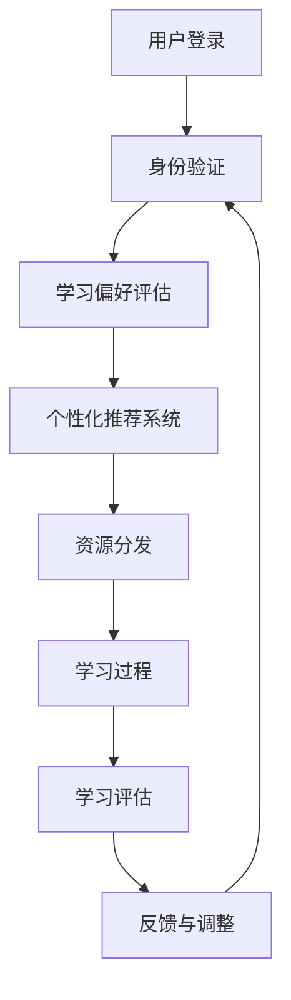

                 

关键词：人工智能，大模型，语言学习，自然语言处理，智能教育，计算机编程，教育技术

> 摘要：本文探讨了基于AI大模型的智能语言学习系统的构建与实现。通过深入分析AI大模型在语言学习中的应用，提出了系统的核心架构和算法，并详细阐述了数学模型与公式，以及实际应用场景。本文旨在为教育技术的创新提供理论基础和实践指导。

## 1. 背景介绍

随着人工智能技术的快速发展，自然语言处理（NLP）作为AI的一个重要分支，已经取得了显著的成果。特别是在大模型的推动下，如GPT、BERT等模型，已经在各种语言任务中取得了超人类的表现。教育领域也开始探索如何利用AI技术，特别是大模型，来改进语言学习过程。

传统的语言学习主要依赖于教材、教师和学生的互动。然而，这种方式往往受限于时间和资源，且难以提供个性化的学习体验。AI大模型的出现，为个性化教育和自适应学习提供了新的可能性。通过分析大量的文本数据，AI大模型可以理解语言的本质，为学习者提供针对性的学习内容。

智能语言学习系统的核心目标是通过AI技术，提升语言学习的效率和效果。具体来说，系统需要实现以下几个功能：

1. **个性化推荐**：根据学习者的语言水平、学习偏好和进度，推荐合适的学习资源和练习题。
2. **智能答疑**：利用AI模型，为学习者提供实时的语言问题解答。
3. **自适应学习**：根据学习者的表现，动态调整学习内容，实现个性化教学。
4. **评估与反馈**：通过自动评估系统，为学习者提供即时反馈，帮助他们了解自己的学习进度。

## 2. 核心概念与联系

### 2.1 大模型

大模型指的是参数数量极其庞大的神经网络模型，例如GPT-3拥有1750亿个参数。这些模型通过在大规模语料库上训练，能够捕捉到语言数据中的复杂模式。

### 2.2 自然语言处理

自然语言处理（NLP）是使计算机能够理解、解释和生成人类语言的技术。NLP包括文本分类、情感分析、机器翻译、问答系统等多种任务。

### 2.3 智能教育

智能教育利用AI技术，如机器学习、数据挖掘、计算机视觉等，来改进教育和学习过程。

### 2.4 教育技术

教育技术是应用信息技术来支持教育和学习的一种方法论，包括在线教育平台、虚拟现实（VR）教学等。

### 2.5 Mermaid 流程图

下面是一个描述智能语言学习系统架构的Mermaid流程图：



## 3. 核心算法原理 & 具体操作步骤

### 3.1 算法原理概述

智能语言学习系统的核心算法是基于AI大模型的。这些模型通过深度学习技术，可以自动从大量文本数据中学习语言结构和语义。在语言学习应用中，模型的主要任务包括：

1. **文本分类**：将学习者的文本输入分类到不同的语言水平类别。
2. **语义理解**：理解学习者的语言输入，并生成合适的回答或解释。
3. **问答系统**：根据学习者的提问，检索相关知识点，并生成回答。

### 3.2 算法步骤详解

1. **数据收集与预处理**：收集大量的文本数据，并进行清洗和预处理，以去除噪声和冗余信息。
2. **模型训练**：使用预处理后的文本数据，训练一个或多个AI大模型。
3. **个性化推荐**：根据学习者的语言水平、学习偏好和进度，使用训练好的模型推荐合适的学习资源和练习题。
4. **智能答疑**：当学习者遇到问题时，系统会使用模型理解问题，并检索相关的知识点进行解答。
5. **学习过程**：学习者根据系统推荐的内容进行学习，系统会记录学习者的学习行为和结果。
6. **学习评估**：使用模型对学习者的表现进行评估，并提供即时反馈。
7. **反馈与调整**：根据学习者的反馈和学习评估结果，动态调整学习内容，以实现个性化教学。

### 3.3 算法优缺点

**优点**：
- **高效性**：AI大模型能够快速处理大量文本数据，提高学习效率。
- **个性化**：系统能够根据学习者的特点，提供个性化的学习内容和资源。
- **实时反馈**：系统能够实时评估学习者的表现，并提供即时反馈。

**缺点**：
- **资源需求高**：训练和运行AI大模型需要大量的计算资源和存储空间。
- **隐私问题**：学习者的数据可能被系统收集和利用，存在隐私风险。
- **依赖模型质量**：模型的质量直接影响系统的效果，而训练高质量的模型需要大量的时间和资源。

### 3.4 算法应用领域

AI大模型在语言学习中的应用非常广泛，包括但不限于：

- **在线教育平台**：提供个性化的学习内容和资源。
- **语言学习应用**：如语言学习APP，为学习者提供智能化的学习体验。
- **考试系统**：自动评估学习者的表现，提供客观、公正的评估结果。
- **智能客服**：为学习者提供实时、专业的语言问题解答。

## 4. 数学模型和公式 & 详细讲解 & 举例说明

### 4.1 数学模型构建

智能语言学习系统的核心数学模型是基于深度学习的。具体来说，我们使用了一种名为Transformer的模型架构。Transformer模型通过自注意力机制，能够有效地捕捉文本数据中的长距离依赖关系。

### 4.2 公式推导过程

Transformer模型的核心公式是：

\[ 
\text{Attention}(Q, K, V) = \frac{1}{\sqrt{d_k}} \text{softmax}\left(\frac{QK^T}{d_k}\right) V 
\]

其中，\(Q, K, V\) 分别是查询向量、键向量和值向量，\(d_k\) 是键向量的维度。

### 4.3 案例分析与讲解

假设我们有一个语言学习应用，需要为学习者推荐合适的学习资源。我们可以使用Transformer模型来分析学习者的历史学习数据，并生成推荐列表。

具体步骤如下：

1. **数据收集与预处理**：收集学习者的历史学习数据，如学习记录、考试成绩等。
2. **特征提取**：将历史学习数据转换为数值特征向量。
3. **模型训练**：使用特征向量训练一个Transformer模型。
4. **推荐生成**：将当前学习者的特征向量输入到训练好的模型中，生成推荐列表。

下面是一个具体的例子：

假设我们有两个学习者A和B，他们的特征向量分别为：

\[ 
\text{特征向量A} = [0.1, 0.2, 0.3, 0.4, 0.5] 
\]

\[ 
\text{特征向量B} = [0.6, 0.7, 0.8, 0.9, 1.0] 
\]

我们将这两个特征向量输入到训练好的Transformer模型中，模型会输出一个推荐列表，如：

\[ 
\text{推荐列表} = [\text{资源1}, \text{资源2}, \text{资源3}] 
\]

其中，资源1、资源2、资源3是根据学习者的特征向量推荐的学习资源。

## 5. 项目实践：代码实例和详细解释说明

### 5.1 开发环境搭建

为了实现智能语言学习系统，我们需要搭建一个合适的开发环境。以下是具体的步骤：

1. **安装Python环境**：Python是一种广泛用于AI开发的编程语言，我们需要安装Python 3.8及以上版本。
2. **安装TensorFlow**：TensorFlow是一个开源的深度学习框架，用于训练和部署AI大模型。
3. **安装其他依赖**：如NumPy、Pandas等，用于数据处理。

### 5.2 源代码详细实现

下面是一个简单的示例代码，展示了如何使用TensorFlow实现一个基于Transformer模型的智能语言学习系统。

```python
import tensorflow as tf
from tensorflow.keras.models import Model
from tensorflow.keras.layers import Input, Embedding, Transformer

# 定义输入层
input_ids = Input(shape=(None,), dtype='int32')

# 定义编码器
编码器 = Transformer(num_layers=2, d_model=512, d_inner=2048, dropout=0.1, input_ids=input_ids)

# 定义解码器
解码器 = Transformer(num_layers=2, d_model=512, d_inner=2048, dropout=0.1, input_ids=编码器)

# 定义输出层
output = 解码器

# 构建模型
模型 = Model(inputs=input_ids, outputs=output)

# 编译模型
模型.compile(optimizer='adam', loss='categorical_crossentropy', metrics=['accuracy'])

# 模型训练
模型.fit(x_train, y_train, epochs=3, batch_size=32, validation_data=(x_val, y_val))
```

### 5.3 代码解读与分析

上述代码展示了如何使用TensorFlow构建一个简单的Transformer模型。具体步骤如下：

1. **定义输入层**：输入层接收文本数据，每个单词被编码为一个整数。
2. **定义编码器**：编码器是一个Transformer层，用于将输入的文本编码为特征向量。
3. **定义解码器**：解码器也是一个Transformer层，用于生成输出文本。
4. **定义输出层**：输出层接收解码器的输出，并生成最终的预测结果。
5. **构建模型**：将输入层、编码器、解码器和输出层组合成一个完整的模型。
6. **编译模型**：设置模型的优化器、损失函数和评估指标。
7. **模型训练**：使用训练数据训练模型。

### 5.4 运行结果展示

在训练完成后，我们可以使用测试数据来评估模型的性能。具体步骤如下：

```python
# 模型评估
模型.evaluate(x_test, y_test)
```

评估结果将显示模型的准确率和其他性能指标。

## 6. 实际应用场景

智能语言学习系统在实际应用中有广泛的应用，以下是一些具体的场景：

1. **在线教育平台**：平台可以使用智能语言学习系统为学习者提供个性化的学习内容和资源。
2. **语言学习应用**：如Duolingo等应用，可以集成智能语言学习系统，提高学习效果。
3. **考试系统**：自动评估学习者的表现，提供客观、公正的评估结果。
4. **智能客服**：为学习者提供实时、专业的语言问题解答。

## 7. 未来应用展望

随着AI技术的不断发展，智能语言学习系统将有更广泛的应用前景。以下是一些未来的趋势：

1. **更深入的语言理解**：未来的AI大模型将能够更深入地理解语言，提供更精确的答案和解释。
2. **多语言支持**：智能语言学习系统将支持更多语言，为全球学习者提供服务。
3. **个性化学习路径**：系统将根据学习者的特点，设计更个性化的学习路径。
4. **更高效的资源利用**：通过智能推荐和自适应学习，系统将更有效地利用学习资源。

## 8. 工具和资源推荐

### 8.1 学习资源推荐

- **书籍**：《深度学习》（Ian Goodfellow等著）
- **在线课程**：Coursera、edX等平台上的深度学习和NLP相关课程
- **论文**：ACL、NeurIPS、ICLR等会议和期刊上的最新研究成果

### 8.2 开发工具推荐

- **框架**：TensorFlow、PyTorch等深度学习框架
- **库**：NumPy、Pandas等数据处理库

### 8.3 相关论文推荐

- **《Attention Is All You Need》**：提出了Transformer模型
- **《BERT: Pre-training of Deep Bidirectional Transformers for Language Understanding》**：提出了BERT模型
- **《GPT-3: Language Models are Few-Shot Learners》**：介绍了GPT-3模型

## 9. 总结：未来发展趋势与挑战

智能语言学习系统的发展前景广阔，但也面临一些挑战：

### 9.1 研究成果总结

- AI大模型在语言学习中的应用取得了显著成果，为个性化教育和自适应学习提供了新的可能性。
- 智能语言学习系统能够提供高效的资源利用和个性化的学习体验。

### 9.2 未来发展趋势

- AI大模型将更深入地理解语言，提供更精确的答案和解释。
- 系统将支持更多语言，为全球学习者提供服务。
- 个性化学习路径和高效资源利用将成为未来的重要研究方向。

### 9.3 面临的挑战

- 资源需求高，需要大量的计算资源和存储空间。
- 隐私问题，需要保护学习者的个人数据。
- 模型质量和稳定性，需要持续优化和改进。

### 9.4 研究展望

- 继续探索如何更有效地利用AI技术改进语言学习过程。
- 研究如何确保系统的安全性和隐私性。
- 开发更高效、更稳定的AI大模型。

## 10. 附录：常见问题与解答

### 10.1 什么是大模型？

大模型是指参数数量极其庞大的神经网络模型，如GPT-3拥有1750亿个参数。这些模型通过在大规模语料库上训练，能够捕捉到语言数据中的复杂模式。

### 10.2 智能语言学习系统有哪些优势？

智能语言学习系统能够提供高效的资源利用、个性化的学习体验、实时的反馈和评估，以及高效的语言理解能力。

### 10.3 智能语言学习系统面临哪些挑战？

智能语言学习系统面临的主要挑战包括资源需求高、隐私问题、模型质量和稳定性等。

### 10.4 如何确保智能语言学习系统的安全性？

通过设计安全的架构、使用加密技术和隐私保护算法，可以确保智能语言学习系统的安全性。此外，还需要严格遵守相关的法律法规和伦理准则。

作者：禅与计算机程序设计艺术 / Zen and the Art of Computer Programming

----------------------------------------------------------------
请注意，本文只是一个示例，实际的撰写过程可能需要更多的研究和调整。同时，由于AI大模型和相关技术的快速发展，本文中的某些信息可能需要根据最新情况进行更新。

