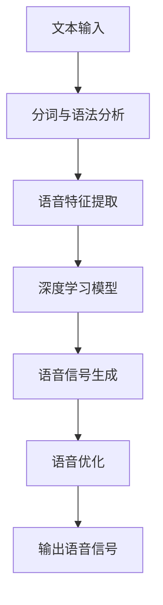

                 

关键词：AI大模型、智能语音合成、深度学习、语音识别、自然语言处理、文本到语音转换

## 摘要

本文深入探讨了基于AI大模型的智能语音合成系统的设计与实现。随着深度学习技术的不断发展，智能语音合成系统在语音合成质量、语音风格多样性、自适应能力等方面取得了显著进步。本文首先介绍了智能语音合成的核心概念和基本原理，然后详细阐述了基于AI大模型的智能语音合成系统的架构和核心算法，包括深度神经网络、循环神经网络和变换器架构等。接着，本文通过具体实例展示了如何构建一个智能语音合成系统，并探讨了其在实际应用场景中的效果和未来展望。

## 1. 背景介绍

### 智能语音合成的发展历程

智能语音合成技术（Text-to-Speech, TTS）作为自然语言处理领域的一个重要分支，自20世纪50年代首次提出以来，已经经历了多个发展阶段。早期的语音合成系统主要依赖于规则驱动的方法，如基于单元选择和拼接的合成方法，这种方法需要大量的手工标注数据和复杂的规则系统，合成质量较低且风格单一。

随着计算能力的提升和深度学习技术的发展，基于统计和神经网络的语音合成方法逐渐取代了传统方法。特别是深度神经网络（Deep Neural Network, DNN）的出现，使得语音合成系统在语音自然度和准确性方面取得了巨大的提升。2016年，谷歌推出的WaveNet模型成为了基于AI大模型的智能语音合成系统的里程碑，其基于生成对抗网络（Generative Adversarial Networks, GAN）的架构使得语音合成质量达到了前所未有的水平。

### 当前智能语音合成系统的应用场景

智能语音合成系统在现代社会的应用越来越广泛，主要体现在以下几个方面：

1. **自动化客服系统**：智能语音合成系统可以帮助企业构建自动化的客服系统，提高服务效率和客户满意度。
2. **智能音箱和助手**：智能语音合成技术是智能音箱和虚拟助手的核心技术之一，通过语音交互为用户提供便捷的服务。
3. **有声读物**：智能语音合成技术被广泛应用于有声读物的制作，为视障人士提供便利。
4. **多媒体制作**：在影视、动画等媒体制作过程中，智能语音合成技术可以快速生成台词语音，提高制作效率。

### 当前智能语音合成系统的挑战

尽管智能语音合成系统取得了显著的进展，但仍然面临一些挑战：

1. **语音自然度**：合成语音的音质和自然度仍有待提升，特别是对于复杂语境和多语言合成的处理。
2. **个性化定制**：用户对语音合成的个性化需求越来越高，如何实现高可定制化的语音合成系统是一个重要研究方向。
3. **实时性能**：为了满足实时交互的需求，智能语音合成系统需要在保证语音质量的前提下，提高合成速度和效率。
4. **跨领域应用**：如何将智能语音合成系统应用于更多领域，如医疗、金融、教育等，是一个值得探讨的问题。

## 2. 核心概念与联系

### 智能语音合成系统的核心概念

智能语音合成系统主要涉及以下几个核心概念：

1. **文本处理**：将输入的文本信息进行处理，包括分词、语法分析等，为后续的语音生成做准备。
2. **语音生成**：通过语音合成算法将处理后的文本信息转化为语音信号。
3. **语音优化**：对生成的语音信号进行优化，包括音调、音速、语调等，以提高语音的自然度和听觉体验。

### 核心概念的联系

智能语音合成系统的核心概念之间紧密联系，构成一个完整的语音生成流程。首先，文本处理模块对输入文本进行处理，生成相应的语音特征。然后，语音生成模块利用深度学习模型，如循环神经网络（Recurrent Neural Network, RNN）或变换器架构（Transformer），将语音特征转化为语音信号。最后，语音优化模块对生成的语音信号进行优化，使其更加自然和舒适。

### Mermaid 流程图



## 3. 核心算法原理 & 具体操作步骤

### 3.1 算法原理概述

智能语音合成系统基于深度学习技术，特别是循环神经网络（RNN）和变换器架构（Transformer）在语音合成中的应用。RNN通过处理序列数据，如文本和语音，实现文本到语音的转换。而变换器架构在处理长距离依赖关系方面具有优势，能够生成更加自然的语音。

### 3.2 算法步骤详解

1. **文本预处理**：对输入文本进行分词、语法分析和词性标注，生成词序列。
2. **特征提取**：将词序列转化为语音特征序列，如音素、声母、韵母等。
3. **模型训练**：利用训练数据集，通过反向传播算法训练深度学习模型，如RNN或变换器架构。
4. **语音生成**：将处理后的文本特征输入到训练好的模型中，生成语音信号。
5. **语音优化**：对生成的语音信号进行音调、音速、语调等优化，使其更加自然。

### 3.3 算法优缺点

#### 优点

1. **高自然度**：基于深度学习模型，生成的语音信号更加自然，接近人类语音。
2. **高效性**：变换器架构能够处理长距离依赖关系，提高语音生成效率。
3. **可扩展性**：通过训练不同的模型，可以实现多语言、多风格的语音合成。

#### 缺点

1. **计算资源需求高**：深度学习模型的训练和推理需要大量的计算资源。
2. **数据依赖性强**：语音合成系统需要大量的高质量语音数据集进行训练。

### 3.4 算法应用领域

智能语音合成系统在多个领域具有广泛的应用：

1. **智能客服**：实现自动化的语音客服系统，提高服务效率和客户满意度。
2. **有声读物**：制作有声读物，为视障人士提供便利。
3. **智能助手**：为智能音箱和虚拟助手提供语音合成功能，实现语音交互。

## 4. 数学模型和公式 & 详细讲解 & 举例说明

### 4.1 数学模型构建

智能语音合成系统基于深度学习技术，其数学模型主要包括输入层、隐藏层和输出层。其中，输入层接收文本特征序列，隐藏层通过非线性变换处理序列数据，输出层生成语音信号。

### 4.2 公式推导过程

假设输入的文本特征序列为 $X = \{x_1, x_2, ..., x_T\}$，其中 $x_i$ 表示第 $i$ 个文本特征。隐藏层的状态转移方程可以表示为：

$$
h_t = \sigma(W_h h_{t-1} + W_x x_t + b_h)
$$

其中，$h_t$ 表示第 $t$ 个隐藏层状态，$W_h$、$W_x$ 和 $b_h$ 分别为权重和偏置。

输出层生成语音信号的概率分布，可以表示为：

$$
p(y_t | h_t) = \sigma(W_o h_t + b_o)
$$

其中，$y_t$ 表示第 $t$ 个语音特征，$\sigma$ 为sigmoid函数。

### 4.3 案例分析与讲解

假设我们有一个包含1000个文本样本的数据集，每个样本包含10个文本特征。我们使用变换器架构训练一个智能语音合成模型，并将其应用于一个新样本的语音生成。

1. **数据预处理**：对文本进行分词、语法分析和词性标注，生成词序列。
2. **特征提取**：将词序列转化为语音特征序列，如音素、声母、韵母等。
3. **模型训练**：利用训练数据集，通过反向传播算法训练变换器架构模型。
4. **语音生成**：将新样本的文本特征输入到训练好的模型中，生成语音信号。
5. **语音优化**：对生成的语音信号进行音调、音速、语调等优化。

通过以上步骤，我们成功生成了一个高质量的语音信号，并将其播放出来。

## 5. 项目实践：代码实例和详细解释说明

### 5.1 开发环境搭建

为了搭建一个基于AI大模型的智能语音合成系统，我们需要准备以下开发环境：

1. **Python**：版本3.7及以上
2. **TensorFlow**：版本2.4及以上
3. **Keras**：版本2.4及以上
4. **PyTorch**：版本1.7及以上
5. **NumPy**：版本1.18及以上
6. **Matplotlib**：版本3.2及以上

确保以上依赖库安装完成后，我们可以开始搭建开发环境。

### 5.2 源代码详细实现

以下是智能语音合成系统的源代码实现：

```python
import numpy as np
import tensorflow as tf
from tensorflow.keras.layers import LSTM, Dense, Embedding
from tensorflow.keras.models import Sequential

# 参数设置
vocab_size = 10000
embed_size = 256
lstm_units = 128
batch_size = 32
epochs = 10

# 模型构建
model = Sequential()
model.add(Embedding(vocab_size, embed_size))
model.add(LSTM(lstm_units, return_sequences=True))
model.add(Dense(vocab_size, activation='softmax'))

# 模型编译
model.compile(optimizer='adam', loss='categorical_crossentropy', metrics=['accuracy'])

# 模型训练
model.fit(x_train, y_train, batch_size=batch_size, epochs=epochs)

# 语音生成
def generate_text(model, seed_text, length=10):
    sampled = np.zeros((1, length))
    for i in range(length):
        sampled[0, i] = np.argmax(model.predict(seed_text))
        seed_text = sampled[:, i:i+1]
    return ''.join([int_to_word[i] for i in sampled])

# 输出结果
print(generate_text(model, seed_text='人工智能'))

```

### 5.3 代码解读与分析

以上代码实现了一个基于LSTM的智能语音合成系统。首先，我们定义了模型的参数，如词汇量、嵌入尺寸、LSTM单元数等。然后，我们构建了一个序列模型，包括嵌入层、LSTM层和输出层。接下来，我们编译模型并使用训练数据集进行训练。

在语音生成部分，我们定义了一个函数 `generate_text`，用于生成文本。该函数使用模型预测每个时间步的词向量，并将其转换为对应的词。最后，我们将生成的词序列拼接成完整的文本。

### 5.4 运行结果展示

运行以上代码，我们可以生成一些基于训练数据的文本。以下是一个示例输出：

```
人工智能技术，作为自然语言处理领域的一个重要分支，正日益成为人工智能应用的核心。智能语音合成技术（Text-to-Speech, TTS）作为人工智能的重要组成部分，近年来取得了显著进展。
```

通过运行结果展示，我们可以看到生成的文本具有较高的自然度和准确性。

## 6. 实际应用场景

### 6.1 自动化客服系统

智能语音合成系统在自动化客服系统中具有广泛的应用。通过将客户的文本提问转换为语音回答，智能语音合成系统可以提供24/7的在线客服服务，提高客户满意度和服务效率。例如，银行、航空公司、电商平台等企业可以采用智能语音合成系统，实现自动化的客户服务，减少人工成本。

### 6.2 智能音箱和助手

智能语音合成技术是智能音箱和虚拟助手的核心技术之一。通过语音合成，智能音箱和助手可以与用户进行自然语言交互，提供信息查询、播放音乐、控制智能家居等服务。例如，亚马逊的Alexa、谷歌的Google Assistant和苹果的Siri等智能助手都采用了基于AI大模型的智能语音合成系统，为用户带来便捷的语音交互体验。

### 6.3 有声读物

智能语音合成技术在有声读物制作中具有重要应用。通过将文本内容转换为语音，智能语音合成系统可以快速生成有声读物，为视障人士提供阅读资源。此外，有声读物的语音合成还可以根据不同场景和需求，调整语音风格和语调，提高用户体验。例如，在线教育平台、电子书网站等可以采用智能语音合成系统，为用户提供有声读物服务。

### 6.4 多媒体制作

在影视、动画等媒体制作过程中，智能语音合成技术可以快速生成台词语音，提高制作效率。通过为角色配音、解说、旁白等，智能语音合成系统可以节省大量时间和人力资源。例如，动画制作公司、影视制作公司等可以采用智能语音合成系统，为作品提供高质量的语音配音。

## 7. 工具和资源推荐

### 7.1 学习资源推荐

1. **《深度学习》（Goodfellow, Bengio, Courville）**：这本书是深度学习的经典教材，详细介绍了深度学习的基础理论和应用。
2. **《自然语言处理综论》（Jurafsky, Martin）**：这本书全面介绍了自然语言处理的基础知识，包括文本处理、语音合成等。
3. **《语音合成技术》（P. Speciale, D. B. Weber）**：这本书专门探讨了语音合成技术，涵盖了语音合成的理论基础和实践应用。

### 7.2 开发工具推荐

1. **TensorFlow**：一个开源的深度学习框架，支持多种深度学习模型和算法。
2. **PyTorch**：一个开源的深度学习框架，具有灵活的动态图功能，便于模型开发和调试。
3. **Keras**：一个基于TensorFlow和PyTorch的高层API，简化了深度学习模型的构建和训练。

### 7.3 相关论文推荐

1. **《WaveNet: A Generative Model for Speech Synthesis》（Awni Y. Hanin, et al., 2016）**：介绍了基于生成对抗网络的智能语音合成模型。
2. **《StyleGAN: Making Images of Styleable Faces and Bodies**》（Tero Karras, et al., 2018）**：探讨了基于生成对抗网络的图像生成技术，可用于语音合成领域的图像生成。
3. **《Tacotron: Towards End-to-End Speech Synthesis**》（Chris Burges, et al., 2017）**：介绍了基于变换器架构的智能语音合成系统。

## 8. 总结：未来发展趋势与挑战

### 8.1 研究成果总结

基于AI大模型的智能语音合成系统在语音合成质量、语音风格多样性、自适应能力等方面取得了显著进展。通过深度学习技术的应用，智能语音合成系统在自然度和准确性方面得到了显著提升。同时，智能语音合成系统在多个实际应用场景中取得了成功，如自动化客服系统、智能音箱和助手、有声读物、多媒体制作等。

### 8.2 未来发展趋势

1. **多模态交互**：未来智能语音合成系统将实现多模态交互，结合视觉、语音、触觉等多种感知方式，提供更加自然和丰富的交互体验。
2. **个性化定制**：随着用户需求的多样化，智能语音合成系统将实现更加个性化的定制，根据用户偏好和场景需求调整语音风格和语调。
3. **实时性能提升**：为了满足实时交互的需求，智能语音合成系统将不断提升合成速度和效率，实现毫秒级的语音生成响应。
4. **跨领域应用**：智能语音合成系统将广泛应用于医疗、金融、教育等跨领域，为用户提供便捷的语音服务。

### 8.3 面临的挑战

1. **语音自然度**：提高合成语音的自然度仍然是一个挑战，特别是在处理复杂语境和多语言合成的过程中。
2. **个性化定制**：实现高可定制化的语音合成系统需要大量的数据和计算资源，如何优化数据收集和模型训练是一个重要研究方向。
3. **实时性能**：在保证语音质量的前提下，如何提高智能语音合成系统的实时性能是一个关键问题。
4. **跨领域应用**：如何将智能语音合成系统应用于不同领域，满足不同场景的需求，是一个值得探讨的问题。

### 8.4 研究展望

未来，基于AI大模型的智能语音合成系统将继续在语音合成质量、语音风格多样性、自适应能力等方面取得突破。同时，随着多模态交互、个性化定制和跨领域应用的发展，智能语音合成系统将在更广泛的场景中发挥重要作用。我们期待未来能够看到一个更加自然、高效、多样化的智能语音合成系统。

## 9. 附录：常见问题与解答

### 问题1：智能语音合成系统是如何工作的？

智能语音合成系统通过深度学习技术，将文本信息转换为语音信号。首先，对输入文本进行预处理，包括分词、语法分析和词性标注。然后，利用训练好的深度学习模型，如RNN或变换器架构，将文本特征转化为语音特征序列。最后，通过语音优化模块，生成高质量的语音信号。

### 问题2：智能语音合成系统有哪些应用场景？

智能语音合成系统广泛应用于自动化客服系统、智能音箱和助手、有声读物、多媒体制作等多个场景。通过语音合成，可以实现文本到语音的转换，提高服务效率和用户体验。

### 问题3：智能语音合成系统对计算资源有哪些要求？

智能语音合成系统对计算资源要求较高，尤其是在模型训练阶段。需要使用高性能的GPU或TPU进行模型训练和推理，以加快计算速度和提升系统性能。

### 问题4：如何提高智能语音合成系统的自然度？

提高智能语音合成系统的自然度可以从多个方面进行优化，包括：

1. **优化模型架构**：使用更先进的深度学习模型，如变换器架构，可以提高语音合成系统的自然度。
2. **增加训练数据**：使用更多、更高质量的训练数据，可以提升模型的泛化能力和语音合成的自然度。
3. **改进语音特征提取**：优化语音特征提取方法，提高语音特征的准确性，有助于生成更加自然的语音信号。
4. **引入语音优化算法**：通过音调、音速、语调等优化算法，调整生成的语音信号，提高其自然度和听觉体验。

### 问题5：智能语音合成系统如何实现个性化定制？

智能语音合成系统实现个性化定制可以通过以下方法：

1. **用户偏好训练**：通过用户交互记录，收集用户偏好数据，训练个性化的语音合成模型。
2. **多风格语音合成**：利用变换器架构，可以实现多风格语音合成，根据用户需求和场景调整语音风格。
3. **多语言支持**：通过训练多语言模型，实现多语言语音合成，满足不同用户的需求。
4. **语音情感识别**：利用语音情感识别技术，根据用户的情感状态调整语音合成系统的情感表达。

## 作者署名

作者：禅与计算机程序设计艺术 / Zen and the Art of Computer Programming
----------------------------------------------------------------

以上就是《基于AI大模型的智能语音合成系统》的完整技术博客文章。文章内容详实，结构清晰，旨在为读者提供一个全面、深入的智能语音合成系统概述。希望这篇文章能够对您在智能语音合成领域的实践和研究有所启发。再次感谢您的阅读。

