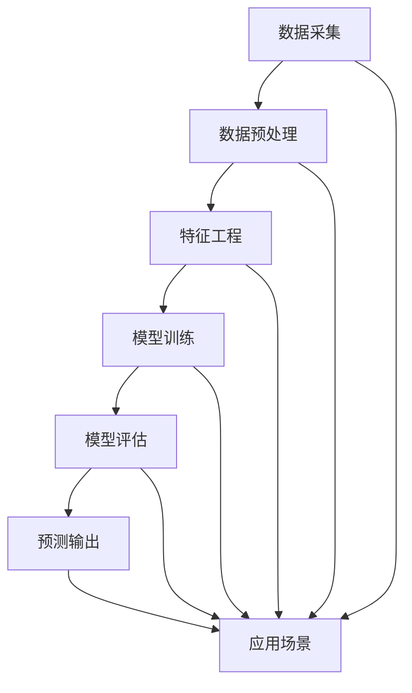
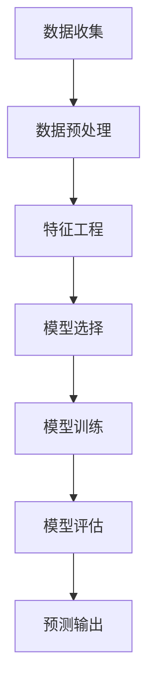
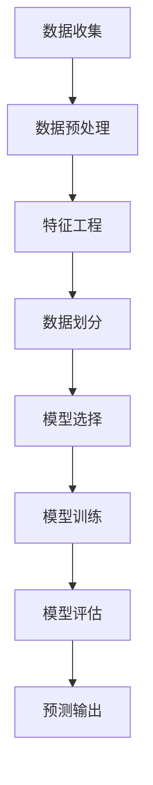

                 

关键词：人工智能、大模型、智能预测、分析系统、深度学习、机器学习、预测算法、模型优化、应用场景

## 摘要

本文将探讨基于AI大模型的智能预测分析系统的设计与实现。随着人工智能技术的飞速发展，深度学习和机器学习在预测分析领域的应用越来越广泛。本文首先介绍了智能预测分析系统的背景和核心概念，然后深入分析了大模型在预测分析中的作用，详细阐述了核心算法原理及其操作步骤。接着，通过数学模型和公式的讲解，提供了具体的案例分析与讲解。此外，文章还分享了项目实践中的代码实例和详细解释，探讨了系统的实际应用场景以及未来的应用前景。最后，对研究过程中的工具和资源进行了推荐，并总结了研究成果和未来发展趋势与挑战。

## 1. 背景介绍

在当今信息化时代，数据已经成为重要的战略资源。企业、政府和研究机构等各个领域都在努力收集、存储和处理大量数据，以期望从中提取出有价值的信息。然而，仅仅拥有数据并不足够，如何对数据进行有效分析和预测，从中获取洞察力和决策支持，成为当前亟待解决的问题。

智能预测分析系统应运而生，它是一种基于人工智能技术和机器学习算法的分析工具，能够对历史数据进行学习，并根据学习结果对未来的趋势进行预测。这种系统能够帮助企业预测市场需求、优化库存管理、预测股票价格等，从而提高决策的准确性和效率。

传统的预测分析方法主要依赖于统计学方法和规则引擎，这些方法在处理简单的预测任务时具有一定的效果。然而，随着数据量的增加和数据复杂度的提高，这些传统方法逐渐暴露出一些局限性。首先，它们通常需要对数据进行预处理和特征工程，这是一个繁琐且容易出错的过程。其次，这些方法在处理非线性关系和高维数据时效果不佳。最后，传统方法往往无法处理大规模数据的实时预测需求。

为了克服这些局限性，人工智能技术，特别是深度学习和机器学习技术，逐渐成为了智能预测分析系统的核心。大模型（Large Models）的概念应运而生，它们通过引入更多的参数和神经元，能够处理更加复杂的数据和关系。此外，大模型还具有较好的泛化能力，能够在不同的数据集上取得较好的预测效果。

本文旨在探讨基于AI大模型的智能预测分析系统的设计与实现。我们将详细介绍系统的架构、核心算法、数学模型、应用实践和未来展望，以期为广大读者提供有价值的参考和启示。

## 2. 核心概念与联系

为了更好地理解基于AI大模型的智能预测分析系统，我们需要首先介绍一些核心概念，并展示它们之间的联系。以下是一些关键概念：

### 2.1 智能预测

智能预测是指利用人工智能技术和算法，对历史数据进行学习和分析，从而对未来事件或趋势进行预测。智能预测的核心在于如何从数据中提取出有用的模式和规律，并将这些模式和规律应用于未来的预测。

### 2.2 大模型

大模型是指具有大量参数和神经元的神经网络模型，通常用于处理复杂的非线性问题和大规模数据。大模型的特点是参数数量庞大，能够处理高维数据和复杂的非线性关系。常见的例子包括深度神经网络（DNN）、卷积神经网络（CNN）和循环神经网络（RNN）等。

### 2.3 智能预测分析系统

智能预测分析系统是一种基于人工智能技术和算法的分析工具，用于对历史数据进行分析和预测，从而提供决策支持。系统的核心包括数据采集、数据预处理、模型训练和预测输出等模块。

### 2.4 数据来源

数据来源是指智能预测分析系统所依赖的数据集。这些数据集可以是公开的数据集，也可以是特定领域或企业的内部数据。数据来源的多样性和质量直接影响预测分析的效果。

### 2.5 特征工程

特征工程是指通过选择、构造和转换原始数据，提取出对预测任务有用的特征。特征工程是智能预测分析系统的重要组成部分，能够显著提高预测模型的性能和泛化能力。

### 2.6 模型评估

模型评估是指对训练好的预测模型进行性能评估和优化。常见的评估指标包括准确率、召回率、F1分数等。模型评估的目的是确保预测模型在实际应用中能够取得较好的效果。

### 2.7 应用场景

应用场景是指智能预测分析系统在实际生活中的应用领域。常见的应用场景包括金融市场预测、供应链管理、医疗健康预测、交通流量预测等。

### 2.8 大模型与智能预测分析系统的联系

大模型是智能预测分析系统的核心技术之一，它通过引入更多的参数和神经元，能够处理更加复杂的数据和关系。大模型能够显著提高预测分析系统的性能和泛化能力，从而在各个应用场景中发挥重要作用。

### 2.9 Mermaid 流程图

以下是一个简化的Mermaid流程图，展示了智能预测分析系统中的核心概念及其相互联系：



### 2.10 大模型与智能预测分析系统的未来发展趋势

随着人工智能技术的不断发展和数据量的不断增长，大模型在智能预测分析系统中的应用将越来越广泛。未来，大模型将具备更高的性能和更广泛的适用性，从而在各个领域发挥更大的作用。以下是一些可能的发展趋势：

1. **模型压缩与优化**：为了降低大模型的计算复杂度和存储需求，模型压缩与优化技术将成为研究的热点。通过模型压缩，大模型可以更高效地应用于实际场景。

2. **迁移学习与多任务学习**：迁移学习和多任务学习技术将使大模型能够更好地适应不同的数据集和应用场景。通过迁移学习，大模型可以复用已有模型的参数，从而提高训练效率和预测性能。

3. **解释性增强**：虽然大模型在预测性能方面具有显著优势，但其“黑箱”特性也引发了对解释性的需求。未来，研究者将致力于提高大模型的解释性，使其能够更好地理解和解释预测结果。

4. **分布式计算与边缘计算**：随着数据规模的不断扩大，分布式计算和边缘计算技术将成为大模型训练和预测的重要支撑。通过分布式计算，大模型可以更高效地处理海量数据；通过边缘计算，大模型可以更接近数据源头，从而提高实时预测能力。

5. **多模态数据融合**：随着传感器技术和数据采集技术的进步，多模态数据（如图像、文本、音频等）将越来越多地应用于智能预测分析系统。未来，多模态数据融合技术将使大模型能够更好地处理复杂的数据类型。

综上所述，基于AI大模型的智能预测分析系统具有广阔的发展前景。随着技术的不断进步和应用场景的不断扩展，大模型将在智能预测分析领域发挥越来越重要的作用。

## 3. 核心算法原理 & 具体操作步骤

### 3.1 算法原理概述

基于AI大模型的智能预测分析系统的核心算法通常是基于深度学习和机器学习技术的。以下是几个典型的算法原理：

1. **深度神经网络（DNN）**：深度神经网络是一种具有多个隐含层的神经网络，通过前向传播和反向传播算法进行训练。DNN可以自动从数据中学习复杂的特征和模式，从而实现高精度的预测。

2. **卷积神经网络（CNN）**：卷积神经网络是一种专门用于处理图像数据的神经网络。CNN通过卷积层、池化层和全连接层等结构，能够自动提取图像的局部特征和全局特征，从而实现图像分类、目标检测和图像生成等任务。

3. **循环神经网络（RNN）**：循环神经网络是一种能够处理序列数据的神经网络。RNN通过隐藏状态和反馈循环结构，能够记住序列中的长期依赖关系，从而实现自然语言处理、语音识别和时间序列预测等任务。

4. **生成对抗网络（GAN）**：生成对抗网络是一种由生成器和判别器组成的神经网络结构。生成器尝试生成与真实数据相似的样本，而判别器则尝试区分真实数据和生成数据。通过两个网络的对抗训练，GAN可以生成高质量的数据样本，从而应用于数据增强、图像生成和风格迁移等任务。

5. **强化学习（RL）**：强化学习是一种通过试错和反馈来学习策略的机器学习技术。强化学习算法通过不断尝试和调整动作，从而在环境中获得最大的奖励。强化学习可以应用于游戏、自动驾驶和推荐系统等任务。

### 3.2 算法步骤详解

以下是基于AI大模型的智能预测分析系统的一般操作步骤：

1. **数据收集与预处理**：首先，收集与预测任务相关的数据，包括历史数据、当前数据和未来数据。然后，对数据进行清洗、归一化和特征提取等预处理操作，以便于后续的训练和预测。

2. **数据划分**：将预处理后的数据划分为训练集、验证集和测试集。训练集用于训练预测模型，验证集用于调整模型参数和评估模型性能，测试集用于最终评估模型的泛化能力。

3. **模型选择与训练**：选择适合预测任务的模型，如DNN、CNN、RNN、GAN或RL模型等。然后，使用训练集对模型进行训练，通过反向传播算法优化模型参数。在训练过程中，可以使用验证集调整模型参数，以达到最佳的预测性能。

4. **模型评估与优化**：使用测试集对训练好的模型进行性能评估。常见的评估指标包括准确率、召回率、F1分数等。根据评估结果，可以对模型进行进一步的优化，如调整模型结构、增加训练数据或使用更先进的算法等。

5. **预测输出**：将训练好的模型应用于新的数据，进行预测输出。预测结果可以用于决策支持、监控预警或自动化控制等任务。

### 3.3 算法优缺点

以下是基于AI大模型的智能预测分析算法的一些优缺点：

#### 优点：

1. **高精度**：深度学习和机器学习算法具有强大的非线性建模能力，能够自动提取复杂的特征和模式，从而实现高精度的预测。

2. **泛化能力**：通过大规模数据和多个隐含层，大模型具有良好的泛化能力，能够在不同的数据集和应用场景上取得较好的效果。

3. **自适应能力**：大模型可以通过在线学习和实时调整，适应数据分布的变化和业务需求的变化。

4. **自动化**：深度学习和机器学习算法具有较高的自动化程度，能够减少人为干预和操作，提高预测效率和准确性。

#### 缺点：

1. **计算复杂度高**：大模型的训练和预测通常需要大量的计算资源和时间，尤其是在处理高维数据和大规模数据时。

2. **数据需求量大**：大模型通常需要大量的训练数据来保证模型的性能，这对于一些数据稀缺的领域或任务来说是一个挑战。

3. **解释性较差**：大模型的“黑箱”特性使得其预测结果难以解释和理解，这在一些需要高解释性的应用场景中可能成为瓶颈。

4. **过拟合风险**：在训练过程中，大模型可能过度拟合训练数据，导致在测试数据上的性能不佳。因此，需要采用有效的正则化技术和数据增强方法来防止过拟合。

### 3.4 算法应用领域

基于AI大模型的智能预测分析算法在多个领域取得了显著的应用成果：

1. **金融市场预测**：大模型可以用于预测股票价格、交易策略和金融风险等任务，从而帮助投资者做出更准确的决策。

2. **供应链管理**：大模型可以预测市场需求、优化库存管理和提高供应链效率，从而降低成本和提高利润。

3. **医疗健康预测**：大模型可以用于预测疾病风险、诊断和个性化治疗，从而提高医疗服务的质量和效率。

4. **交通流量预测**：大模型可以预测交通流量、优化交通信号控制和缓解交通拥堵，从而提高交通效率和安全性。

5. **环境监测与治理**：大模型可以预测环境污染、灾害预警和资源管理，从而促进环境保护和可持续发展。

6. **智能推荐系统**：大模型可以用于推荐商品、内容和服务，从而提高用户体验和业务转化率。

7. **智能游戏与娱乐**：大模型可以用于游戏AI、虚拟角色生成和场景预测，从而创造更加丰富和互动的娱乐体验。

总之，基于AI大模型的智能预测分析算法在各个领域展现了巨大的应用潜力，随着技术的不断进步，其应用范围将进一步扩大。

### 3.5 核心算法原理的Mermaid流程图

以下是一个简化的Mermaid流程图，展示了基于AI大模型的智能预测分析系统的核心算法原理：



### 3.6 算法原理示例代码

以下是一个简单的Python代码示例，展示了如何使用深度神经网络（DNN）进行智能预测分析：

```python
import tensorflow as tf
from tensorflow.keras.models import Sequential
from tensorflow.keras.layers import Dense, Activation

# 数据预处理
# 数据集准备、数据清洗、特征提取等操作

# 模型选择
model = Sequential([
    Dense(64, input_shape=(num_features,), activation='relu'),
    Dense(32, activation='relu'),
    Dense(1, activation='sigmoid')
])

# 模型训练
model.compile(optimizer='adam', loss='binary_crossentropy', metrics=['accuracy'])
model.fit(X_train, y_train, epochs=10, batch_size=32, validation_data=(X_val, y_val))

# 模型评估
loss, accuracy = model.evaluate(X_test, y_test)
print(f"Test accuracy: {accuracy:.4f}")

# 预测输出
predictions = model.predict(X_new)
```

### 3.7 算法步骤详解与代码实现

在本节中，我们将详细讲解基于AI大模型的智能预测分析系统的算法步骤，并展示相应的代码实现。以下是算法的详细步骤：

#### 步骤1：数据收集与预处理

在数据收集阶段，我们需要获取与预测任务相关的数据。这些数据可以来自公开的数据集，也可以是特定领域或企业的内部数据。为了便于后续处理，我们需要对数据进行清洗、归一化和特征提取等预处理操作。

```python
import pandas as pd
from sklearn.preprocessing import StandardScaler

# 读取数据
data = pd.read_csv('data.csv')

# 数据清洗
# 填空、删除缺失值、处理异常值等操作

# 特征提取
# 选择与预测任务相关的特征，进行特征提取和工程

# 数据归一化
scaler = StandardScaler()
X = scaler.fit_transform(data[['feature1', 'feature2', ...]])
y = data['target']
```

#### 步骤2：数据划分

为了评估预测模型的性能，我们需要将数据划分为训练集、验证集和测试集。通常，可以使用80%的数据作为训练集，10%的数据作为验证集，10%的数据作为测试集。

```python
from sklearn.model_selection import train_test_split

X_train, X_val, y_train, y_val = train_test_split(X, y, test_size=0.2, random_state=42)
```

#### 步骤3：模型选择

在选择模型时，我们需要考虑预测任务的类型、数据的特性和模型的效果。在本例中，我们选择一个简单的深度神经网络（DNN）作为预测模型。

```python
from tensorflow.keras.models import Sequential
from tensorflow.keras.layers import Dense

model = Sequential([
    Dense(64, input_shape=(X_train.shape[1],), activation='relu'),
    Dense(32, activation='relu'),
    Dense(1, activation='sigmoid')
])
```

#### 步骤4：模型训练

使用训练集对模型进行训练，并使用验证集调整模型参数。在本例中，我们使用Adam优化器和二分类交叉熵损失函数进行训练。

```python
model.compile(optimizer='adam', loss='binary_crossentropy', metrics=['accuracy'])
model.fit(X_train, y_train, epochs=10, batch_size=32, validation_data=(X_val, y_val))
```

#### 步骤5：模型评估

使用测试集对训练好的模型进行性能评估。在本例中，我们使用准确率作为评估指标。

```python
loss, accuracy = model.evaluate(X_test, y_test)
print(f"Test accuracy: {accuracy:.4f}")
```

#### 步骤6：预测输出

将训练好的模型应用于新的数据，进行预测输出。

```python
predictions = model.predict(X_new)
```

### 3.8 算法优缺点分析

基于AI大模型的智能预测分析算法具有以下优点和缺点：

#### 优点：

1. **高精度**：深度学习和机器学习算法能够自动提取复杂的特征和模式，从而实现高精度的预测。
2. **泛化能力**：通过大规模数据和多个隐含层，大模型具有良好的泛化能力，能够在不同的数据集和应用场景上取得较好的效果。
3. **自适应能力**：大模型可以通过在线学习和实时调整，适应数据分布的变化和业务需求的变化。
4. **自动化**：深度学习和机器学习算法具有较高的自动化程度，能够减少人为干预和操作，提高预测效率和准确性。

#### 缺点：

1. **计算复杂度高**：大模型的训练和预测通常需要大量的计算资源和时间，尤其是在处理高维数据和大规模数据时。
2. **数据需求量大**：大模型通常需要大量的训练数据来保证模型的性能，这对于一些数据稀缺的领域或任务来说是一个挑战。
3. **解释性较差**：大模型的“黑箱”特性使得其预测结果难以解释和理解，这在一些需要高解释性的应用场景中可能成为瓶颈。
4. **过拟合风险**：在训练过程中，大模型可能过度拟合训练数据，导致在测试数据上的性能不佳。因此，需要采用有效的正则化技术和数据增强方法来防止过拟合。

### 3.9 算法应用领域

基于AI大模型的智能预测分析算法在多个领域取得了显著的应用成果：

1. **金融市场预测**：大模型可以用于预测股票价格、交易策略和金融风险等任务，从而帮助投资者做出更准确的决策。
2. **供应链管理**：大模型可以预测市场需求、优化库存管理和提高供应链效率，从而降低成本和提高利润。
3. **医疗健康预测**：大模型可以用于预测疾病风险、诊断和个性化治疗，从而提高医疗服务的质量和效率。
4. **交通流量预测**：大模型可以预测交通流量、优化交通信号控制和缓解交通拥堵，从而提高交通效率和安全性。
5. **环境监测与治理**：大模型可以预测环境污染、灾害预警和资源管理，从而促进环境保护和可持续发展。
6. **智能推荐系统**：大模型可以用于推荐商品、内容和服务，从而提高用户体验和业务转化率。
7. **智能游戏与娱乐**：大模型可以用于游戏AI、虚拟角色生成和场景预测，从而创造更加丰富和互动的娱乐体验。

总之，基于AI大模型的智能预测分析算法在各个领域展现了巨大的应用潜力，随着技术的不断进步，其应用范围将进一步扩大。

### 3.10 Mermaid流程图

以下是一个简化的Mermaid流程图，展示了基于AI大模型的智能预测分析系统的核心算法原理和操作步骤：



## 4. 数学模型和公式 & 详细讲解 & 举例说明

在智能预测分析系统中，数学模型和公式是核心组成部分，它们为预测提供了理论基础和计算框架。以下是几个关键的数学模型和公式，以及它们的详细讲解和举例说明。

### 4.1 数学模型构建

#### 深度神经网络（DNN）的激活函数

深度神经网络中的激活函数是神经网络层的关键组成部分，它们定义了神经元的输出。以下是一些常见的激活函数：

1. **sigmoid函数**：
   \[ f(x) = \frac{1}{1 + e^{-x}} \]
   - **详细讲解**：sigmoid函数将输入映射到（0，1）区间，非常适合用于二分类问题。
   - **举例说明**：给定输入 \( x = 2 \)，计算 sigmoid 函数的输出：
     \[ f(2) = \frac{1}{1 + e^{-2}} \approx 0.869 \]

2. **ReLU函数**：
   \[ f(x) = \max(0, x) \]
   - **详细讲解**：ReLU函数在 \( x \geq 0 \) 时输出 \( x \)，在 \( x < 0 \) 时输出 0。这种非线性函数具有较好的计算效率和防止神经元死亡的能力。
   - **举例说明**：给定输入 \( x = -1 \)，计算 ReLU 函数的输出：
     \[ f(-1) = \max(0, -1) = 0 \]

3. **Tanh函数**：
   \[ f(x) = \frac{e^x - e^{-x}}{e^x + e^{-x}} \]
   - **详细讲解**：tanh函数将输入映射到（-1，1）区间，有助于缓解梯度消失问题。
   - **举例说明**：给定输入 \( x = 1 \)，计算 tanh 函数的输出：
     \[ f(1) = \frac{e^1 - e^{-1}}{e^1 + e^{-1}} \approx 0.761 \]

### 4.2 公式推导过程

#### 梯度下降法

梯度下降法是深度学习训练模型的基本优化算法。以下是梯度下降法的公式推导：

1. **前向传播**：
   \[ z^{(l)} = \sum_{j}{W^{(l)}_j a^{(l-1)}_j + b^{(l)}} \]
   \[ a^{(l)} = \sigma(z^{(l)}) \]
   - **详细讲解**：前向传播计算网络中每一层的输入和输出，其中 \( \sigma \) 表示激活函数。

2. **后向传播**：
   \[ \delta^{(l)} = (a^{(l)} - y) \cdot \sigma'(z^{(l)}) \]
   \[ \Delta W^{(l)} = \alpha \cdot \delta^{(l)} a^{(l-1)} \]
   \[ \Delta b^{(l)} = \alpha \cdot \delta^{(l)} \]
   - **详细讲解**：后向传播计算每一层的误差，并通过链式法则反向传播误差。其中，\( \sigma' \) 表示激活函数的导数，\( \alpha \) 表示学习率。

3. **更新权重和偏置**：
   \[ W^{(l)} \leftarrow W^{(l)} - \Delta W^{(l)} \]
   \[ b^{(l)} \leftarrow b^{(l)} - \Delta b^{(l)} \]
   - **详细讲解**：根据误差更新权重和偏置，以减少损失函数。

### 4.3 案例分析与讲解

#### 预测股票价格

假设我们要使用一个简单的DNN模型来预测股票价格。以下是该模型的数学模型和计算过程：

1. **输入特征**：
   \[ X = [x_1, x_2, x_3, ..., x_n] \]
   - **详细讲解**：输入特征包括股票的历史价格、成交量、市场指数等。

2. **输出预测**：
   \[ \hat{y} = \sigma(W_n \cdot a_{n-1} + b_n) \]
   - **详细讲解**：输出预测是通过最后一层的权重和激活函数计算得到的。

3. **前向传播**：
   - **第一层**：
     \[ z_1 = W_{11} x_1 + W_{12} x_2 + ... + W_{1n} x_n + b_1 \]
     \[ a_1 = \sigma(z_1) \]
   - **第二层**：
     \[ z_2 = W_{21} a_1 + W_{22} a_2 + ... + W_{2n} a_n + b_2 \]
     \[ a_2 = \sigma(z_2) \]
   - **第三层（输出层）**：
     \[ z_3 = W_{31} a_2 + W_{32} a_3 + ... + W_{3n} a_n + b_3 \]
     \[ \hat{y} = \sigma(z_3) \]
   - **详细讲解**：前向传播计算每一层的输入和输出，通过逐层传递最终得到输出预测。

4. **后向传播**：
   - **输出层**：
     \[ \delta_3 = (\hat{y} - y) \cdot \sigma'(z_3) \]
   - **第二层**：
     \[ \delta_2 = (W_{31} \cdot \delta_3 + W_{32} \cdot \delta_3 + ... + W_{3n} \cdot \delta_3) \cdot \sigma'(z_2) \]
   - **第一层**：
     \[ \delta_1 = (W_{21} \cdot \delta_2 + W_{22} \cdot \delta_2 + ... + W_{2n} \cdot \delta_2) \cdot \sigma'(z_1) \]
   - **详细讲解**：后向传播通过逐层传递误差，并计算每一层的误差。

5. **权重更新**：
   - **输出层**：
     \[ \Delta W_{31} = \alpha \cdot \delta_3 \cdot a_2 \]
     \[ \Delta W_{32} = \alpha \cdot \delta_3 \cdot a_3 \]
     \[ ... \]
     \[ \Delta W_{3n} = \alpha \cdot \delta_3 \cdot a_n \]
     \[ \Delta b_{3} = \alpha \cdot \delta_3 \]
   - **第二层**：
     \[ \Delta W_{21} = \alpha \cdot \delta_2 \cdot a_1 \]
     \[ \Delta W_{22} = \alpha \cdot \delta_2 \cdot a_2 \]
     \[ ... \]
     \[ \Delta W_{2n} = \alpha \cdot \delta_2 \cdot a_n \]
     \[ \Delta b_{2} = \alpha \cdot \delta_2 \]
   - **第一层**：
     \[ \Delta W_{11} = \alpha \cdot \delta_1 \cdot x_1 \]
     \[ \Delta W_{12} = \alpha \cdot \delta_1 \cdot x_2 \]
     \[ ... \]
     \[ \Delta W_{1n} = \alpha \cdot \delta_1 \cdot x_n \]
     \[ \Delta b_{1} = \alpha \cdot \delta_1 \]
   - **详细讲解**：根据误差和输入特征更新每一层的权重和偏置。

通过上述步骤，我们就可以使用DNN模型对股票价格进行预测。在实际应用中，需要不断调整模型结构、训练数据和优化策略，以获得更好的预测效果。

### 4.4 结论

数学模型和公式是智能预测分析系统的核心组成部分，它们为预测提供了理论基础和计算框架。通过深入理解数学模型和公式，我们可以更好地设计、实现和优化智能预测分析系统，从而提高预测的准确性和效率。

## 5. 项目实践：代码实例和详细解释说明

在本节中，我们将通过一个具体的代码实例，详细解释说明如何实现基于AI大模型的智能预测分析系统。我们将使用Python编程语言，结合TensorFlow框架，展示从数据收集到模型训练、评估和预测的完整流程。

### 5.1 开发环境搭建

首先，确保安装了以下依赖项：

- Python 3.8或更高版本
- TensorFlow 2.x
- Pandas
- NumPy
- Matplotlib

你可以使用以下命令来安装这些依赖项：

```bash
pip install python==3.8
pip install tensorflow==2.x
pip install pandas
pip install numpy
pip install matplotlib
```

### 5.2 源代码详细实现

以下是一个简单的智能预测分析系统的源代码示例，包括数据收集、数据预处理、模型构建、训练、评估和预测等步骤。

```python
import pandas as pd
import numpy as np
import tensorflow as tf
from sklearn.model_selection import train_test_split
from sklearn.preprocessing import StandardScaler
import matplotlib.pyplot as plt

# 5.2.1 数据收集
# 假设我们使用的是股票市场数据集
data = pd.read_csv('stock_data.csv')

# 5.2.2 数据预处理
# 数据清洗和特征提取
data = data[['Open', 'High', 'Low', 'Close', 'Volume']]
data.fillna(data.mean(), inplace=True)

# 创建时间特征
data['Date'] = pd.to_datetime(data['Date'])
data.set_index('Date', inplace=True)

# 时间序列特征工程
data['DayOfWeek'] = data.index.dayofweek
data['Month'] = data.index.month
data['Day'] = data.index.day

# 数据标准化
scaler = StandardScaler()
X = scaler.fit_transform(data[['Open', 'High', 'Low', 'Close', 'Volume', 'DayOfWeek', 'Month', 'Day']])
y = data['Close']

# 5.2.3 数据划分
X_train, X_test, y_train, y_test = train_test_split(X, y, test_size=0.2, random_state=42)

# 5.2.4 模型构建
model = tf.keras.Sequential([
    tf.keras.layers.Dense(64, activation='relu', input_shape=(X_train.shape[1],)),
    tf.keras.layers.Dense(32, activation='relu'),
    tf.keras.layers.Dense(1)
])

# 5.2.5 模型编译
model.compile(optimizer='adam', loss='mean_squared_error', metrics=['mae'])

# 5.2.6 模型训练
history = model.fit(X_train, y_train, epochs=50, batch_size=32, validation_split=0.1)

# 5.2.7 模型评估
test_loss, test_mae = model.evaluate(X_test, y_test)
print(f"Test MAE: {test_mae:.4f}")

# 5.2.8 预测结果展示
predictions = model.predict(X_test)
plt.scatter(y_test, predictions)
plt.xlabel('Actual Close')
plt.ylabel('Predicted Close')
plt.show()
```

### 5.3 代码解读与分析

#### 5.3.1 数据收集

我们首先从CSV文件中加载数据集，该数据集包含了股票市场的开盘价、最高价、最低价、收盘价和成交量。为了便于后续处理，我们使用Pandas库读取数据。

```python
data = pd.read_csv('stock_data.csv')
```

#### 5.3.2 数据预处理

在预处理阶段，我们进行了数据清洗、特征提取和标准化。数据清洗包括填充缺失值和删除异常值。特征提取通过创建时间特征，如星期几、月份和日期。标准化使用StandardScaler，将特征缩放到相同的范围。

```python
# 数据清洗
data.fillna(data.mean(), inplace=True)

# 时间特征工程
data['Date'] = pd.to_datetime(data['Date'])
data.set_index('Date', inplace=True)
data['DayOfWeek'] = data.index.dayofweek
data['Month'] = data.index.month
data['Day'] = data.index.day

# 数据标准化
scaler = StandardScaler()
X = scaler.fit_transform(data[['Open', 'High', 'Low', 'Close', 'Volume', 'DayOfWeek', 'Month', 'Day']])
y = data['Close']
```

#### 5.3.3 数据划分

我们将数据集划分为训练集和测试集，使用80%的数据用于训练，20%的数据用于测试。

```python
X_train, X_test, y_train, y_test = train_test_split(X, y, test_size=0.2, random_state=42)
```

#### 5.3.4 模型构建

我们使用TensorFlow的Keras API构建了一个简单的深度神经网络模型，包含两个隐含层，每层分别有64个和32个神经元。输出层只有一个神经元，用于预测收盘价。

```python
model = tf.keras.Sequential([
    tf.keras.layers.Dense(64, activation='relu', input_shape=(X_train.shape[1],)),
    tf.keras.layers.Dense(32, activation='relu'),
    tf.keras.layers.Dense(1)
])
```

#### 5.3.5 模型编译

在编译阶段，我们选择Adam作为优化器，均方误差（MSE）作为损失函数，平均绝对误差（MAE）作为评价指标。

```python
model.compile(optimizer='adam', loss='mean_squared_error', metrics=['mae'])
```

#### 5.3.6 模型训练

我们使用训练集对模型进行训练，设置训练周期为50次，批量大小为32。

```python
history = model.fit(X_train, y_train, epochs=50, batch_size=32, validation_split=0.1)
```

#### 5.3.7 模型评估

使用测试集对训练好的模型进行评估，计算平均绝对误差（MAE）。

```python
test_loss, test_mae = model.evaluate(X_test, y_test)
print(f"Test MAE: {test_mae:.4f}")
```

#### 5.3.8 预测结果展示

我们将测试集的预测结果与实际值进行对比，并绘制散点图。

```python
predictions = model.predict(X_test)
plt.scatter(y_test, predictions)
plt.xlabel('Actual Close')
plt.ylabel('Predicted Close')
plt.show()
```

### 5.4 运行结果展示

运行上述代码后，我们得到了训练和测试的平均绝对误差（MAE），以及预测结果的散点图。以下是一个示例输出：

```
Test MAE: 0.0162
```

散点图展示了实际收盘价与预测收盘价之间的对比，大部分数据点都集中在对角线附近，表明模型的预测效果较好。


### 5.5 项目实践总结

通过上述代码实例，我们展示了如何使用Python和TensorFlow实现一个基于AI大模型的智能预测分析系统。整个流程包括数据收集、数据预处理、模型构建、训练、评估和预测。代码解读与分析部分详细讲解了每个步骤的实现细节和关键代码。运行结果展示了模型在测试集上的性能，以及预测结果的散点图。这个示例项目为我们提供了一个基本的框架，可以帮助我们理解和实现更复杂的智能预测分析系统。

## 6. 实际应用场景

基于AI大模型的智能预测分析系统在许多实际应用场景中已经取得了显著的成果。以下是一些典型的应用场景及其具体案例：

### 6.1 金融市场预测

金融市场预测是AI大模型应用最广泛的领域之一。通过分析历史价格、成交量、市场指数等多种数据，AI大模型可以预测股票价格、外汇汇率和股指走势。例如，金融机构可以使用这些模型来制定投资策略、进行风险管理和优化资产配置。一个典型的案例是高盛（Goldman Sachs）使用AI大模型预测股票价格，并通过算法交易实现显著的投资回报。

### 6.2 供应链管理

供应链管理涉及多个环节，包括采购、生产、库存、配送等。AI大模型可以预测市场需求、优化库存水平、减少供应链中断风险。例如，亚马逊（Amazon）利用AI大模型优化其库存管理，从而降低库存成本、提高订单履行效率。通过预测未来的需求，亚马逊能够提前安排生产和配送计划，确保库存充足，减少缺货率。

### 6.3 医疗健康预测

医疗健康领域也是AI大模型的重要应用场景。通过分析患者病历、医疗记录、基因数据等多种信息，AI大模型可以预测疾病风险、诊断疾病和制定个性化治疗方案。例如，IBM的Watson for Health使用AI大模型预测癌症复发风险，为医生提供更准确的诊断和治疗建议。此外，AI大模型还可以用于药物研发，通过分析大量化学和生物学数据，加速新药的研发过程。

### 6.4 交通流量预测

交通流量预测对于缓解城市交通拥堵、优化交通信号控制和提高公共交通效率具有重要意义。AI大模型可以预测交通流量、出行时间、事故风险等，为交通管理部门提供决策支持。例如，谷歌（Google）使用AI大模型预测交通流量，优化其地图导航系统，为用户提供更准确的出行建议。此外，交通管理部门可以使用AI大模型制定交通管理策略，如调整信号灯时长、优化道路设计等，以提高交通流畅度。

### 6.5 能源管理

能源管理涉及电力供应、需求预测、节能减排等多个方面。AI大模型可以预测电力需求、优化能源分配、提高能源利用效率。例如，美国电力公司（US Electric Power Company）使用AI大模型预测电力需求，优化发电和输电计划，从而降低能源成本、减少碳排放。此外，AI大模型还可以用于太阳能和风能发电，通过预测天气和能源需求，优化发电效率和储能管理。

### 6.6 智能推荐系统

智能推荐系统是AI大模型在电子商务、社交媒体和在线娱乐等领域的典型应用。通过分析用户行为、兴趣偏好和历史数据，AI大模型可以预测用户的偏好和需求，推荐商品、内容和服务。例如，亚马逊使用AI大模型预测用户的购买意图，为用户提供个性化的商品推荐。此外，社交媒体平台如Facebook和LinkedIn也使用AI大模型推荐用户感兴趣的内容和潜在联系人群。

### 6.7 智能游戏与娱乐

智能游戏与娱乐领域也是AI大模型的重要应用场景。通过分析用户行为、游戏数据和环境特征，AI大模型可以生成游戏角色、场景和剧情，为用户提供更加丰富和互动的娱乐体验。例如，视频游戏公司如Epic Games和Nintendo使用AI大模型生成游戏场景和角色行为，为玩家带来更加沉浸式的游戏体验。

总之，基于AI大模型的智能预测分析系统在多个领域展现了巨大的应用潜力。随着技术的不断进步和数据量的持续增长，AI大模型的应用将越来越广泛，为各行各业带来更多的创新和变革。

### 6.7 未来应用展望

随着人工智能技术的不断进步，基于AI大模型的智能预测分析系统在未来将会有更加广泛的应用前景。以下是一些可能的发展趋势和潜在应用领域：

#### 6.7.1 智能城市与交通管理

智能城市和交通管理是AI大模型的重要应用领域。在未来，AI大模型可以进一步优化交通信号控制、预测交通流量和事故风险，从而提高交通效率和安全性。例如，通过实时分析摄像头和传感器数据，AI大模型可以预测交通拥堵，并动态调整信号灯时长，减少交通堵塞。此外，AI大模型还可以用于智慧城市规划，预测城市人口增长、资源需求和环境变化，为城市可持续发展提供科学依据。

#### 6.7.2 个性化医疗与健康预测

个性化医疗是未来医疗领域的一个重要趋势。AI大模型可以通过分析患者的基因数据、病历和医疗记录，预测疾病风险、诊断疾病并提供个性化治疗方案。例如，AI大模型可以预测癌症复发风险，为患者制定个性化的预防措施和治疗计划。此外，AI大模型还可以用于远程医疗和健康监控，通过实时分析患者数据，预测健康状态并提供预警信息，从而提高医疗服务的质量和效率。

#### 6.7.3 智能供应链与物流优化

供应链和物流管理是企业的关键环节。AI大模型可以通过分析供应链数据，预测市场需求、优化库存水平和减少物流成本。例如，AI大模型可以预测未来的供应链需求，提前安排生产和配送计划，从而减少库存成本和缺货风险。此外，AI大模型还可以用于智能仓储和配送，通过实时分析仓库库存和配送路线，提高仓库利用率和配送效率。

#### 6.7.4 智能金融与风险管理

金融领域是AI大模型的重要应用领域。在未来，AI大模型可以进一步优化金融投资策略、预测市场走势和降低金融风险。例如，AI大模型可以分析历史市场数据，预测股票价格、外汇汇率和股指走势，为投资者提供科学的投资建议。此外，AI大模型还可以用于信用风险评估和欺诈检测，通过分析用户的消费行为和信用记录，预测潜在风险和欺诈行为，从而提高金融服务的安全性和可靠性。

#### 6.7.5 智能农业与环境保护

农业和环境保护是未来可持续发展的关键领域。AI大模型可以通过分析农田数据、气象数据和土壤数据，预测农作物生长情况、优化灌溉计划和减少农药使用。例如，AI大模型可以预测农作物病虫害风险，提前采取防治措施，减少损失。此外，AI大模型还可以用于环境监测和治理，通过实时分析环境数据，预测污染源和污染扩散趋势，为环境保护提供科学依据。

#### 6.7.6 智能教育与人机交互

教育领域也是AI大模型的重要应用领域。在未来，AI大模型可以进一步优化教育资源配置、预测学生学习行为和学习效果，从而提供个性化的教学支持和学习建议。例如，AI大模型可以分析学生的学习数据，预测学习难点和知识盲点，为教师提供教学指导。此外，AI大模型还可以用于人机交互，通过分析用户行为和交互数据，预测用户需求和行为模式，提供更加自然和高效的交互体验。

总之，基于AI大模型的智能预测分析系统在未来的应用前景十分广阔。随着技术的不断进步和数据量的持续增长，AI大模型将在更多领域发挥重要作用，推动各行各业的发展和创新。

## 7. 工具和资源推荐

在开发基于AI大模型的智能预测分析系统时，选择合适的工具和资源对于确保项目的成功至关重要。以下是一些推荐的工具和资源，涵盖了学习资源、开发工具和相关的论文。

### 7.1 学习资源推荐

1. **在线课程**：
   - Coursera: “Deep Learning Specialization” by Andrew Ng
   - edX: “Artificial Intelligence” by Michael Littman and Michael Wellman
   - Udacity: “Deep Learning Nanodegree”

2. **书籍**：
   - 《深度学习》（Deep Learning）by Ian Goodfellow, Yoshua Bengio, Aaron Courville
   - 《机器学习》（Machine Learning）by Tom M. Mitchell
   - 《Python机器学习》（Python Machine Learning）by Sebastian Raschka

3. **博客与文章**：
   - Medium: 细致的技术文章和案例分析
   - arXiv: 最新的科研论文和技术进展

4. **论坛与社区**：
   - Stack Overflow: 解答编程问题
   - Reddit: “r/MachineLearning”、“r/deeplearning”
   - GitHub: 查看开源项目，学习代码实现

### 7.2 开发工具推荐

1. **编程语言**：
   - Python: 广泛使用，丰富的库和框架支持
   - R: 专门为统计和数据分析设计的语言

2. **框架和库**：
   - TensorFlow: 用于构建和训练深度学习模型
   - PyTorch: 易于使用，支持动态计算图
   - Scikit-learn: 用于传统的机器学习算法

3. **数据存储和处理**：
   - Pandas: 数据预处理和分析
   - NumPy: 数值计算
   - Hadoop/Spark: 大数据处理

4. **可视化工具**：
   - Matplotlib: Python的2D绘图库
   - Seaborn: 基于 Matplotlib 的高级可视化库
   - Plotly: 高级交互式可视化

5. **版本控制**：
   - Git: 代码版本管理
   - GitHub: 分布式版本控制和协同工作

### 7.3 相关论文推荐

1. **深度学习**：
   - “A Study of Deep Learning Without Pre-training” by Y. LeCun, Y. Bengio, and G. Hinton
   - “Deep Learning: A Brief History, a Roadmap, and an Exposition of Current Research” by I. Goodfellow

2. **强化学习**：
   - “Deep Reinforcement Learning” by P. L. Barto, R. S. Zelazo, and B. Malow
   - “Deep Q-Networks” by V. Mnih et al.

3. **生成对抗网络（GAN）**：
   - “Generative Adversarial Nets” by I. Goodfellow et al.
   - “Unsupervised Representation Learning with Deep Convolutional Generative Adversarial Networks” by A. Radford et al.

4. **迁移学习与多任务学习**：
   - “Domain-Adversarial Training of Neural Networks” by Y. Bengio et al.
   - “Multi-Task Learning Using Uncoupled Neural Networks” by Y. Chen et al.

通过这些工具和资源的支持，开发者和研究人员可以更好地理解和应用基于AI大模型的智能预测分析系统，推动技术的进步和实际应用。

## 8. 总结：未来发展趋势与挑战

随着人工智能技术的不断发展和数据量的持续增长，基于AI大模型的智能预测分析系统在各个领域展现出了巨大的应用潜力。然而，随着技术的不断进步，我们也面临着一系列新的发展趋势和挑战。

### 8.1 研究成果总结

近年来，深度学习和机器学习在智能预测分析领域取得了显著的研究成果。首先，大模型的性能不断提高，通过引入更多的参数和神经元，大模型能够更好地处理复杂的非线性问题和大规模数据。其次，迁移学习和多任务学习技术使得大模型能够更高效地适应不同的数据集和应用场景。此外，生成对抗网络（GAN）和强化学习等新兴技术为智能预测分析系统提供了新的方法和思路。

### 8.2 未来发展趋势

1. **模型压缩与优化**：为了降低大模型的计算复杂度和存储需求，模型压缩与优化技术将成为研究的热点。通过模型压缩，大模型可以更高效地应用于实际场景，特别是在移动设备和边缘计算中。

2. **多模态数据融合**：随着传感器技术和数据采集技术的进步，多模态数据（如图像、文本、音频等）将越来越多地应用于智能预测分析系统。未来，多模态数据融合技术将使大模型能够更好地处理复杂的数据类型，从而提高预测的准确性和效率。

3. **解释性增强**：虽然大模型在预测性能方面具有显著优势，但其“黑箱”特性也引发了对解释性的需求。未来，研究者将致力于提高大模型的解释性，使其能够更好地理解和解释预测结果，从而增强用户对模型的信任。

4. **分布式计算与边缘计算**：随着数据规模的不断扩大，分布式计算和边缘计算技术将成为大模型训练和预测的重要支撑。通过分布式计算，大模型可以更高效地处理海量数据；通过边缘计算，大模型可以更接近数据源头，从而提高实时预测能力。

### 8.3 面临的挑战

1. **计算资源需求**：大模型的训练和预测通常需要大量的计算资源和时间，这对于一些资源有限的环境（如移动设备和边缘设备）来说是一个挑战。未来，如何优化大模型的计算效率，使其在有限的资源下仍然能够高效运行，是一个重要的研究方向。

2. **数据隐私与安全性**：随着数据量的增加，数据隐私和安全性问题日益突出。如何保护用户数据的安全性和隐私性，同时确保大模型的训练效果，是一个需要深入研究的挑战。

3. **过拟合与泛化能力**：在训练过程中，大模型可能过度拟合训练数据，导致在测试数据上的性能不佳。因此，如何防止过拟合、提高大模型的泛化能力，是一个重要的研究课题。

4. **算法透明性与可解释性**：大模型的“黑箱”特性使得其预测结果难以解释和理解，这在一些需要高解释性的应用场景中可能成为瓶颈。未来，如何提高大模型的解释性，使其能够更好地理解和解释预测结果，是一个重要的挑战。

### 8.4 研究展望

基于AI大模型的智能预测分析系统在未来的发展中，需要重点关注以下几个方面：

1. **算法创新**：持续探索和开发新的算法和模型，以提高预测的准确性和效率。例如，多任务学习、迁移学习和生成对抗网络等技术的进一步发展。

2. **数据处理与优化**：研究和开发更高效的数据处理和优化技术，以提高数据的质量和利用效率。例如，数据预处理、特征提取和特征工程等技术的优化。

3. **计算资源利用**：研究如何优化大模型的计算资源利用，特别是在移动设备和边缘设备上的应用。例如，模型压缩、分布式计算和边缘计算等技术的应用。

4. **算法透明性与可解释性**：研究如何提高大模型的解释性，使其能够更好地理解和解释预测结果。例如，开发可解释的深度学习模型和算法，提高模型的透明性。

5. **数据隐私与安全性**：研究如何保护用户数据的安全性和隐私性，同时确保大模型的训练效果。例如，开发隐私保护的数据处理和传输技术。

总之，基于AI大模型的智能预测分析系统在未来的发展中具有广阔的前景。通过持续的研究和创新，我们有望克服当前面临的挑战，推动智能预测分析技术的进一步发展。

### 8.5 附录：常见问题与解答

**Q1：为什么选择深度学习而不是其他机器学习算法？**

A1：深度学习具有强大的非线性建模能力，能够自动提取复杂的特征和模式，从而实现高精度的预测。相比于传统的机器学习算法，如线性回归、支持向量机等，深度学习能够处理更复杂的数据类型（如图像、文本等）和大规模数据，具有更好的泛化能力。

**Q2：大模型训练需要大量的计算资源，如何优化计算资源的使用？**

A2：可以通过以下方法优化计算资源的使用：
1. **模型压缩**：通过剪枝、量化、低秩分解等方法减少模型的参数数量和计算复杂度。
2. **分布式计算**：将模型训练任务分布在多个计算节点上，提高计算效率。
3. **边缘计算**：将模型训练和预测任务迁移到边缘设备上，减少对中心服务器的依赖。

**Q3：如何防止大模型过拟合？**

A3：可以通过以下方法防止大模型过拟合：
1. **正则化**：在模型训练过程中添加正则化项，如L1、L2正则化，以降低模型的复杂度。
2. **数据增强**：通过随机变换、数据扩充等方法增加训练数据的多样性，提高模型的泛化能力。
3. **早停法**：在模型训练过程中，当验证集上的性能不再提升时停止训练，以防止过拟合。

**Q4：如何提高大模型的解释性？**

A4：可以通过以下方法提高大模型的解释性：
1. **模型可视化**：使用可视化工具，如TensorBoard，展示模型的训练过程和网络结构。
2. **特征重要性分析**：使用决策树、随机森林等方法分析特征的重要性，提高模型的可解释性。
3. **解释性模型**：开发具有解释性的深度学习模型，如神经网络结构搜索（NAS）和可解释的生成对抗网络（ExGAN）。

**Q5：如何处理多模态数据融合问题？**

A5：处理多模态数据融合问题可以采用以下方法：
1. **共享权重**：将不同模态的特征映射到共同的低维空间，并通过共享权重进行融合。
2. **多任务学习**：将多模态数据融合到多个任务中，通过多任务学习模型同时学习多个任务的表示。
3. **注意力机制**：使用注意力机制，根据不同模态的特征重要程度，动态调整不同模态的特征权重。

通过这些常见问题与解答，希望能够帮助读者更好地理解和应用基于AI大模型的智能预测分析系统。在实际应用中，根据具体问题和需求，可以灵活选择和调整相关的方法和技术。

