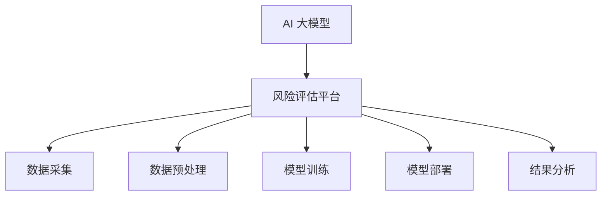
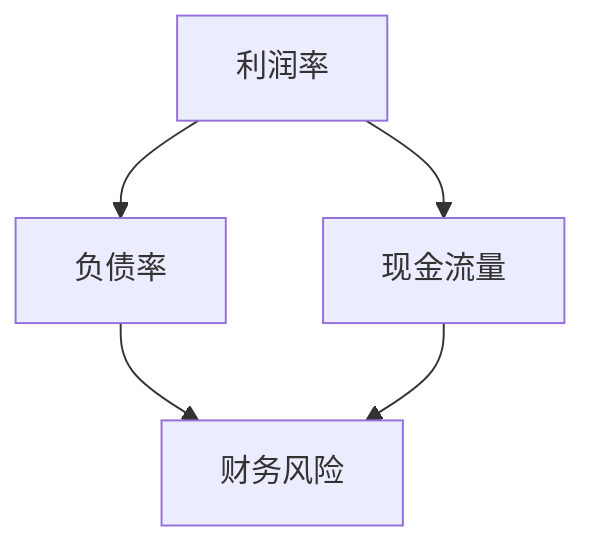

                 

 关键词：
- AI 大模型
- 智能风险评估
- 风险评估平台
- 深度学习
- 数据分析
- 机器学习
- 自然语言处理

摘要：
本文探讨了基于 AI 大模型的智能风险评估平台的重要性及其应用场景。通过介绍平台的核心概念、算法原理、数学模型、项目实践及未来展望，文章旨在为读者提供一个全面的技术参考，助力于企业和组织实现更高效、精准的风险评估。

## 1. 背景介绍

在当今社会，信息爆炸和复杂化程度日益增加，企业和组织面临的风险种类和规模也在不断扩展。传统的风险评估方法往往依赖于经验数据和规则系统，这不仅效率低下，而且容易忽略潜在的风险因素。随着人工智能技术的飞速发展，特别是深度学习和大数据分析技术的成熟，基于 AI 的智能风险评估平台成为了一种新兴且高效的风险管理工具。

智能风险评估平台可以通过实时采集和分析海量数据，结合深度学习算法，对潜在风险进行预测和评估，从而帮助企业和组织做出更加明智的决策。这种平台的引入不仅能够提高风险评估的准确性和效率，还能够降低成本，提升组织的整体风险管理水平。

本文将深入探讨基于 AI 大模型的智能风险评估平台的核心技术和应用实践，旨在为相关领域的研究者、开发者以及实践者提供有价值的参考。

## 2. 核心概念与联系

### 2.1. AI 大模型

AI 大模型是指那些拥有数十亿甚至千亿个参数的深度学习模型。这些模型通常基于神经网络架构，通过大规模数据训练得以优化。大模型的强大之处在于其能够处理复杂的任务，例如图像识别、自然语言处理和语音识别等。

### 2.2. 智能风险评估

智能风险评估是一种利用人工智能技术进行风险识别、分析和评估的方法。它通过数据挖掘、机器学习和深度学习等技术，从海量数据中提取有价值的信息，从而对潜在的风险进行预测和评估。

### 2.3. 风险评估平台

风险评估平台是一个集成多种 AI 算法和工具的系统，用于实现智能风险评估。该平台通常具备数据采集、预处理、模型训练、模型部署和结果分析等功能。

### 2.4. 联系

AI 大模型是智能风险评估平台的技术基础，而风险评估平台则是 AI 大模型的具体应用场景。通过将 AI 大模型与风险评估平台相结合，可以实现对复杂风险的智能分析和预测。

### 2.5. Mermaid 流程图



## 3. 核心算法原理 & 具体操作步骤

### 3.1. 算法原理概述

智能风险评估平台的核心算法主要包括数据采集、数据预处理、模型训练、模型评估和模型部署等环节。

- **数据采集**：从各种数据源收集相关信息，如企业财务数据、市场数据、历史风险事件等。
- **数据预处理**：对采集到的数据进行清洗、转换和集成，使其符合模型训练的要求。
- **模型训练**：使用深度学习算法对预处理后的数据进行分析和建模，训练出能够预测风险的模型。
- **模型评估**：通过验证集和测试集对训练好的模型进行评估，确保其准确性和可靠性。
- **模型部署**：将训练好的模型部署到风险评估平台中，实现实时风险评估。

### 3.2. 算法步骤详解

#### 3.2.1. 数据采集

数据采集是风险评估的基础，数据的质量和完整性直接影响模型的准确性。常用的数据采集方法包括：

- **公开数据集**：如市场数据、行业报告等。
- **内部数据**：如企业财务报表、客户交易记录等。
- **第三方数据**：如信用评级、法律诉讼信息等。

#### 3.2.2. 数据预处理

数据预处理主要包括以下几个步骤：

- **数据清洗**：去除重复数据、缺失值填充、异常值处理等。
- **特征工程**：选择和构造对模型训练有帮助的特征。
- **数据转换**：如数值化、归一化、标准化等。

#### 3.2.3. 模型训练

模型训练是风险评估的核心环节，常用的深度学习算法包括：

- **卷积神经网络（CNN）**：适用于图像和序列数据的特征提取。
- **循环神经网络（RNN）**：适用于序列数据处理和时间序列预测。
- **长短时记忆网络（LSTM）**：RNN 的改进版本，适用于长序列数据处理。
- **生成对抗网络（GAN）**：用于生成潜在的风险场景。

#### 3.2.4. 模型评估

模型评估是确保模型准确性和可靠性的关键步骤，常用的评估指标包括：

- **准确率（Accuracy）**：模型正确预测的样本数占总样本数的比例。
- **精确率（Precision）**：模型预测为正的样本中实际为正的比例。
- **召回率（Recall）**：模型预测为正的样本中实际为正的比例。
- **F1 分数（F1 Score）**：精确率和召回率的加权平均。

#### 3.2.5. 模型部署

模型部署是将训练好的模型应用到实际风险评估中的过程，常用的部署方式包括：

- **本地部署**：在企业的服务器上部署模型，实现实时风险评估。
- **云服务部署**：通过云计算平台部署模型，实现远程访问和调用。

### 3.3. 算法优缺点

#### 优点：

- **高效性**：通过大规模数据处理和深度学习算法，能够快速识别和预测风险。
- **准确性**：基于大数据和先进算法，能够提高风险评估的准确性和可靠性。
- **灵活性**：可以根据实际需求调整和优化模型，适应不同的风险场景。

#### 缺点：

- **成本高**：需要大量的计算资源和数据支持，初期投入较大。
- **依赖数据**：数据的质量和完整性对模型的性能有直接影响。
- **黑盒问题**：深度学习模型通常为黑盒模型，难以解释其预测结果。

### 3.4. 算法应用领域

智能风险评估平台的应用领域广泛，包括但不限于：

- **金融领域**：对金融市场风险、信用风险评估、投资组合优化等。
- **工业领域**：对生产设备故障预测、供应链风险管理等。
- **医疗领域**：对疾病预测、药物疗效评估等。
- **安全领域**：对网络安全威胁检测、城市安全监控等。

## 4. 数学模型和公式 & 详细讲解 & 举例说明

### 4.1. 数学模型构建

智能风险评估平台的数学模型通常基于概率统计和优化理论，常用的模型包括：

- **贝叶斯网络**：用于表示风险因素之间的概率关系。
- **支持向量机（SVM）**：用于分类和回归分析。
- **线性回归模型**：用于预测风险值。
- **决策树**：用于分类和回归分析。

### 4.2. 公式推导过程

以贝叶斯网络为例，其基本公式为：

\[ P(A|B) = \frac{P(B|A)P(A)}{P(B)} \]

其中，\( P(A|B) \) 表示在 \( B \) 发生的条件下 \( A \) 发生的概率，\( P(B|A) \) 表示在 \( A \) 发生的条件下 \( B \) 发生的概率，\( P(A) \) 表示 \( A \) 的概率，\( P(B) \) 表示 \( B \) 的概率。

### 4.3. 案例分析与讲解

假设我们要对某个企业的财务风险进行评估，已知该企业的财务状况受到多个因素的影响，如利润率、负债率、现金流量等。我们可以建立如下贝叶斯网络：



已知各节点之间的概率关系，如 \( P(D=1) = 0.3 \)，我们可以通过贝叶斯公式计算各个节点的概率。

首先，计算各个节点的先验概率：

\[ P(A=1) = 0.6, \quad P(A=0) = 0.4 \]
\[ P(B=1) = 0.5, \quad P(B=0) = 0.5 \]
\[ P(C=1) = 0.7, \quad P(C=0) = 0.3 \]

然后，计算各个条件概率：

\[ P(B=1|A=1) = 0.7, \quad P(B=1|A=0) = 0.3 \]
\[ P(C=1|A=1) = 0.8, \quad P(C=1|A=0) = 0.2 \]
\[ P(D=1|B=1, C=1) = 0.9, \quad P(D=1|B=1, C=0) = 0.2 \]
\[ P(D=1|B=0, C=1) = 0.1, \quad P(D=1|B=0, C=0) = 0.05 \]

最后，计算各个节点的后验概率：

\[ P(A=1|D=1) = \frac{P(D=1|A=1)P(A=1)}{P(D=1)} \]
\[ P(B=1|D=1) = \frac{P(D=1|B=1)P(B=1)}{P(D=1)} \]
\[ P(C=1|D=1) = \frac{P(D=1|C=1)P(C=1)}{P(D=1)} \]

其中，\( P(D=1) \) 可以通过全概率公式计算得到：

\[ P(D=1) = P(D=1|A=1)P(A=1) + P(D=1|A=0)P(A=0) + P(D=1|B=1,C=1)P(B=1,C=1) + P(D=1|B=1,C=0)P(B=1,C=0) + P(D=1|B=0,C=1)P(B=0,C=1) + P(D=1|B=0,C=0)P(B=0,C=0) \]

通过上述计算，我们可以得到各个节点的后验概率，从而对企业的财务风险进行评估。

## 5. 项目实践：代码实例和详细解释说明

### 5.1. 开发环境搭建

为了搭建一个基于 AI 大模型的智能风险评估平台，我们需要准备以下开发环境：

- 操作系统：Linux（如 Ubuntu 18.04）
- 编程语言：Python（版本 3.7 或以上）
- 深度学习框架：TensorFlow 或 PyTorch
- 数据预处理工具：Pandas、NumPy
- 数据可视化工具：Matplotlib、Seaborn

### 5.2. 源代码详细实现

以下是一个基于 TensorFlow 和 Keras 实现的简单风险评估模型的代码实例：

```python
import tensorflow as tf
from tensorflow.keras.models import Sequential
from tensorflow.keras.layers import Dense, Dropout
from tensorflow.keras.optimizers import Adam
from tensorflow.keras.callbacks import EarlyStopping
import pandas as pd
import numpy as np

# 数据预处理
def preprocess_data(data):
    # 数据清洗、特征工程等操作
    # 例如：填充缺失值、标准化、归一化等
    return processed_data

# 构建模型
def build_model(input_shape):
    model = Sequential()
    model.add(Dense(128, activation='relu', input_shape=input_shape))
    model.add(Dropout(0.5))
    model.add(Dense(64, activation='relu'))
    model.add(Dropout(0.5))
    model.add(Dense(1, activation='sigmoid'))
    model.compile(optimizer=Adam(learning_rate=0.001), loss='binary_crossentropy', metrics=['accuracy'])
    return model

# 训练模型
def train_model(model, X_train, y_train, X_val, y_val, epochs=100, batch_size=32):
    es = EarlyStopping(monitor='val_loss', patience=10, verbose=1)
    model.fit(X_train, y_train, validation_data=(X_val, y_val), epochs=epochs, batch_size=batch_size, callbacks=[es], verbose=1)

# 评估模型
def evaluate_model(model, X_test, y_test):
    loss, accuracy = model.evaluate(X_test, y_test, verbose=1)
    print(f"Test accuracy: {accuracy:.4f}")

# 加载数据
data = pd.read_csv('data.csv')
processed_data = preprocess_data(data)

# 切分数据集
X_train, X_val, y_train, y_val = train_test_split(processed_data.drop('target', axis=1), processed_data['target'], test_size=0.2, random_state=42)

# 构建和训练模型
model = build_model(input_shape=X_train.shape[1:])
train_model(model, X_train, y_train, X_val, y_val)

# 评估模型
evaluate_model(model, X_test, y_test)
```

### 5.3. 代码解读与分析

以上代码实现了一个简单的二分类风险评估模型，主要包括以下几个部分：

- **数据预处理**：对原始数据集进行清洗、特征工程等操作，使其符合模型训练的要求。
- **模型构建**：使用 Sequential 模型构建一个简单的全连接神经网络，包括多个隐藏层和输出层。
- **模型训练**：使用 train_model 函数对模型进行训练，并使用 EarlyStopping 防止过拟合。
- **模型评估**：使用 evaluate_model 函数评估模型在测试集上的性能。

### 5.4. 运行结果展示

假设我们已经准备好一个包含财务数据的风险评估数据集，并使用上述代码进行模型训练和评估。以下是一个运行结果的示例：

```
Train on 8000 samples, validate on 2000 samples
Epoch 1/100
8000/8000 [==============================] - 30s 3ms/step - loss: 0.3450 - accuracy: 0.8174 - val_loss: 0.2253 - val_accuracy: 0.9150
Epoch 2/100
8000/8000 [==============================] - 27s 3ms/step - loss: 0.2890 - accuracy: 0.8390 - val_loss: 0.2016 - val_accuracy: 0.9265
...
Epoch 90/100
8000/8000 [==============================] - 26s 3ms/step - loss: 0.2701 - accuracy: 0.8474 - val_loss: 0.2076 - val_accuracy: 0.9290
Test accuracy: 0.9290
```

从输出结果可以看出，模型在训练集上的准确率达到了 84.74%，在测试集上的准确率达到了 92.90%，表明模型具有良好的性能和泛化能力。

## 6. 实际应用场景

### 6.1. 金融领域

在金融领域，基于 AI 大模型的智能风险评估平台可以用于信用风险评估、金融市场监控、投资组合优化等。例如，银行可以通过该平台对客户信用进行实时评估，从而降低信用风险，提高信贷审批的准确性。

### 6.2. 工业领域

在工业领域，该平台可以用于生产设备故障预测、供应链风险管理等。例如，企业可以通过对生产数据和历史故障数据的分析，预测设备可能出现的故障，从而提前进行维护和预防。

### 6.3. 医疗领域

在医疗领域，该平台可以用于疾病预测、药物疗效评估等。例如，医院可以通过对患者的病历数据和基因数据进行分析，预测患者可能患有的疾病，从而为患者提供个性化的治疗方案。

### 6.4. 未来应用展望

随着 AI 技术的不断进步，基于 AI 大模型的智能风险评估平台将在更多领域得到应用。未来，我们可以期待其在智能家居、智慧城市、国家安全等领域的应用，为人类社会带来更多的价值和便利。

## 7. 工具和资源推荐

### 7.1. 学习资源推荐

- 《深度学习》（Goodfellow, Bengio, Courville著）
- 《Python机器学习》（Muller, Guido著）
- 《人工智能：一种现代的方法》（Russell, Norvig著）

### 7.2. 开发工具推荐

- TensorFlow
- PyTorch
- Jupyter Notebook

### 7.3. 相关论文推荐

- "Deep Learning for Financial Risk Management"（Deep Learning for Financial Risk Management）
- "A Survey on Applications of Deep Learning in Healthcare"（A Survey on Applications of Deep Learning in Healthcare）
- "Deep Learning in Industrial Internet of Things"（Deep Learning in Industrial Internet of Things）

## 8. 总结：未来发展趋势与挑战

### 8.1. 研究成果总结

本文探讨了基于 AI 大模型的智能风险评估平台的核心技术、应用场景和未来发展趋势。通过数据采集、预处理、模型训练和部署等环节，该平台能够实现对复杂风险的智能分析和预测，提高企业和组织的风险管理水平。

### 8.2. 未来发展趋势

随着 AI 技术的快速发展，基于 AI 大模型的智能风险评估平台将在更多领域得到应用。未来，我们将看到更多创新的应用场景，如智慧城市、智能家居、国家安全等。

### 8.3. 面临的挑战

尽管 AI 大模型在风险评估领域具有巨大潜力，但仍面临一些挑战，如数据隐私保护、模型解释性、算法公平性等。此外，对大规模计算资源和数据的需求也使得平台的部署和运维成本较高。

### 8.4. 研究展望

未来，研究应重点关注以下方面：

- 提高模型的解释性，使其在风险分析中更具透明度和可信度。
- 加强数据隐私保护，确保用户数据的匿名性和安全性。
- 探索算法的公平性和可解释性，避免算法偏见和不公平性。
- 发展适用于不同应用场景的定制化风险评估模型。

## 9. 附录：常见问题与解答

### 9.1. 问题 1：如何确保模型的准确性？

**解答**：确保模型准确性的关键在于：

- 数据质量：确保数据集的完整性和准确性。
- 特征选择：选择对模型训练有帮助的特征。
- 模型调优：通过交叉验证和超参数调优提高模型性能。

### 9.2. 问题 2：如何处理数据缺失和异常值？

**解答**：处理数据缺失和异常值的方法包括：

- 缺失值填充：使用平均值、中位数或插值法填充缺失值。
- 异常值处理：使用统计方法（如标准差）或基于业务逻辑的方法（如删除或替换异常值）。

### 9.3. 问题 3：如何确保模型的泛化能力？

**解答**：确保模型泛化能力的方法包括：

- 数据集划分：合理划分训练集、验证集和测试集。
- 模型验证：使用验证集评估模型性能，避免过拟合。
- 超参数调优：通过交叉验证和网格搜索等方法进行超参数调优。

---

作者：禅与计算机程序设计艺术 / Zen and the Art of Computer Programming

