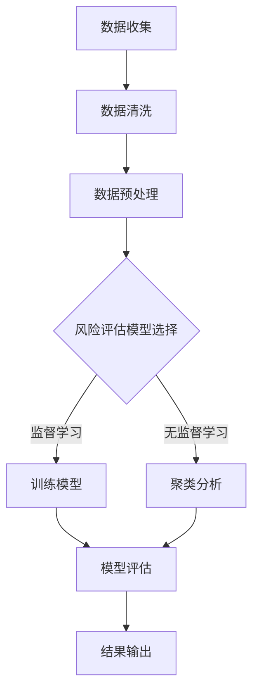

                 

关键词：人工智能、大模型、智能风险评估、算法、数学模型、实际应用

摘要：本文探讨了基于AI大模型的智能风险评估系统的构建原理、核心算法、数学模型及其在实际应用中的价值。通过对核心算法原理的详细剖析，以及数学模型的构建与公式推导，本文将展示如何利用大模型进行风险评估，并提出未来发展的展望与挑战。

## 1. 背景介绍

在当今快速发展的数字化时代，智能风险评估系统的应用范围日益广泛，从金融风险评估、网络安全到企业风险管理和公共安全等多个领域。传统的风险评估方法主要依赖于历史数据和统计分析，但这种方法在面对复杂、动态和不确定性较高的场景时，其效果往往不理想。因此，将人工智能技术，尤其是大模型引入风险评估领域，成为了一种新的发展方向。

本文旨在构建一个基于AI大模型的智能风险评估系统，通过整合大量的历史数据、实时信息和专家知识，实现高效、精准的风险评估。这不仅有助于提高风险评估的准确性和实时性，还能为决策者提供有力的数据支持。

### 人工智能与风险评估

人工智能（AI）是一门研究、开发用于模拟、延伸和扩展人类智能的理论、方法、技术及应用系统的科学技术。随着深度学习、强化学习等技术的发展，人工智能在大数据处理、模式识别、自然语言处理等方面取得了显著进展。这些技术为智能风险评估系统的构建提供了强有力的支持。

风险评估是一个复杂的过程，涉及数据的收集、处理、分析和预测等多个环节。人工智能技术能够通过数据挖掘和模式识别，自动发现数据中的潜在模式和规律，从而提高风险评估的效率和准确性。

### 大模型与风险评估

大模型（Large Models）指的是具有数百万至数十亿参数的深度神经网络模型。近年来，随着计算能力的提升和海量数据资源的积累，大模型在自然语言处理、计算机视觉和语音识别等领域取得了突破性进展。大模型强大的表示能力和建模能力使其在处理复杂任务时具有显著优势。

在风险评估中，大模型能够处理海量的历史数据，学习到复杂的风险模式，从而实现更准确的风险预测。例如，金融风险评估中的股票市场预测、网络安全风险中的恶意代码检测等，都依赖于大模型的高效处理能力。

### 智能风险评估系统的需求

智能风险评估系统需要具备以下几方面的需求：

1. **数据处理能力**：系统能够高效地处理大量历史数据和实时数据，并进行清洗、转换和存储。
2. **风险评估模型**：系统应具有先进的算法和模型，能够根据数据特点和需求进行定制化风险评估。
3. **实时性**：系统能够实时地监测数据变化，快速响应风险事件。
4. **可解释性**：系统应提供风险评估的可解释性，帮助决策者理解风险预测的依据。
5. **安全性**：系统应具备较高的安全性，防止数据泄露和滥用。

## 2. 核心概念与联系

为了更好地理解智能风险评估系统的构建，我们需要明确几个核心概念：数据、模型、算法和评估指标。

### 数据

数据是智能风险评估系统的基石。系统需要收集和处理来自不同来源的数据，包括历史数据、实时数据和专家知识。历史数据包括过去的风险事件和评估结果，用于训练和验证模型；实时数据包括市场行情、用户行为和安全事件等，用于实时监测和预警。

### 模型

模型是系统进行风险评估的核心。模型可以分为两类：监督学习模型和无监督学习模型。监督学习模型需要依赖标注数据进行训练，可以用于预测和分类任务；无监督学习模型不需要标注数据，可以用于数据聚类和降维等任务。在风险评估中，监督学习模型通常用于预测风险事件的发生概率，而无监督学习模型则可以用于发现潜在的风险模式。

### 算法

算法是构建模型的工具。常见的风险评估算法包括回归分析、决策树、支持向量机、神经网络等。不同算法适用于不同类型的数据和任务。例如，回归分析适用于线性关系的风险评估，而神经网络适用于处理复杂非线性关系。

### 评估指标

评估指标是衡量模型性能的重要标准。常用的评估指标包括准确率、召回率、F1分数、AUC值等。这些指标能够帮助我们判断模型预测结果的优劣，从而调整和优化模型。

### Mermaid 流程图

以下是一个简化的智能风险评估系统的 Mermaid 流程图：



## 3. 核心算法原理 & 具体操作步骤

### 3.1 算法原理概述

智能风险评估系统的核心算法主要基于深度学习和强化学习。深度学习算法通过多层神经网络学习数据的特征和模式，实现复杂非线性关系的预测；强化学习算法通过与环境交互，不断优化策略，实现最佳风险评估。

### 3.2 算法步骤详解

1. **数据收集**：系统从各个数据源收集历史数据和实时数据，包括市场行情、用户行为、安全事件等。
2. **数据清洗**：对收集到的数据进行清洗，去除噪音和异常值，确保数据质量。
3. **数据预处理**：对清洗后的数据进行编码、归一化等预处理，使其适合输入到深度学习模型中。
4. **模型选择**：根据数据类型和任务需求，选择合适的深度学习模型或强化学习模型。
5. **模型训练**：使用预处理后的数据对模型进行训练，学习数据中的特征和模式。
6. **模型评估**：通过交叉验证和测试集评估模型性能，调整模型参数，优化模型效果。
7. **模型部署**：将训练好的模型部署到生产环境中，实现实时风险评估。
8. **结果输出**：根据模型预测结果，生成风险评估报告，为决策者提供数据支持。

### 3.3 算法优缺点

#### 深度学习算法

**优点**：
- **强大的建模能力**：能够处理复杂非线性关系，适应各种风险评估场景。
- **高度自动化**：通过自动学习数据特征，减少人工干预。
- **高效性**：能够处理海量数据，提高风险评估效率。

**缺点**：
- **可解释性差**：深度学习模型内部结构复杂，难以解释预测依据。
- **对数据质量要求高**：数据质量直接影响模型性能，需要大量高质量数据。

#### 强化学习算法

**优点**：
- **自适应性强**：通过与环境交互，不断优化策略，适应动态变化的风险场景。
- **灵活性高**：能够处理非静态、不确定的风险评估问题。

**缺点**：
- **训练过程复杂**：强化学习算法需要大量训练时间和计算资源。
- **策略不稳定**：在某些情况下，强化学习策略可能不稳定，需要多次迭代优化。

### 3.4 算法应用领域

智能风险评估算法在多个领域具有广泛的应用：

- **金融行业**：用于股票市场预测、信用风险评估等。
- **网络安全**：用于恶意代码检测、网络攻击预测等。
- **企业风险管理**：用于供应链风险、财务风险等评估。
- **公共安全**：用于自然灾害预警、犯罪风险评估等。

## 4. 数学模型和公式 & 详细讲解 & 举例说明

### 4.1 数学模型构建

在智能风险评估中，我们通常采用概率模型和预测模型。概率模型用于评估事件发生的概率，预测模型则用于预测未来风险。

#### 概率模型

概率模型通常采用贝叶斯定理进行建模：

$$
P(A|B) = \frac{P(B|A)P(A)}{P(B)}
$$

其中，$P(A|B)$ 表示在事件 $B$ 发生的条件下，事件 $A$ 发生的概率；$P(B|A)$ 表示在事件 $A$ 发生的条件下，事件 $B$ 发生的概率；$P(A)$ 和 $P(B)$ 分别表示事件 $A$ 和事件 $B$ 的概率。

#### 预测模型

预测模型通常采用时间序列模型、回归模型等。以下是一个简单的时间序列预测模型：

$$
y_t = \alpha_0 + \alpha_1 y_{t-1} + \alpha_2 y_{t-2} + ... + \alpha_n y_{t-n} + \epsilon_t
$$

其中，$y_t$ 表示第 $t$ 时刻的预测值；$\alpha_0, \alpha_1, ..., \alpha_n$ 为模型参数；$\epsilon_t$ 为随机误差。

### 4.2 公式推导过程

#### 贝叶斯定理

贝叶斯定理是概率论中的一个基本定理，用于计算条件概率。其推导过程如下：

假设有两个事件 $A$ 和 $B$，且 $P(B) > 0$。我们需要计算 $P(A|B)$，即事件 $A$ 在事件 $B$ 发生的条件下的概率。

根据概率的定义，有：

$$
P(A \cap B) = P(A)P(B|A)
$$

同时，由于事件 $A$ 和 $B$ 的总概率为 1，有：

$$
P(A \cap B) + P(A^c \cap B) = P(B)
$$

将上述两个式子相加，得到：

$$
P(A)P(B|A) + P(A^c)P(B|A^c) = P(B)
$$

由于 $P(A) + P(A^c) = 1$，可以将上式变形为：

$$
P(B) - P(A^c)P(B|A^c) = P(A)P(B|A)
$$

进一步变形，得到贝叶斯定理：

$$
P(A|B) = \frac{P(B|A)P(A)}{P(B)}
$$

#### 时间序列预测模型

时间序列预测模型的基本思想是利用历史数据中的趋势和周期性来预测未来值。以下是一个简单的时间序列预测模型的推导过程：

假设我们有一个时间序列 $y_1, y_2, ..., y_t$，其中每个 $y_t$ 都是 $y_1, y_2, ..., y_t$ 的线性组合，即：

$$
y_t = \alpha_0 + \alpha_1 y_{t-1} + \alpha_2 y_{t-2} + ... + \alpha_n y_{t-n} + \epsilon_t
$$

其中，$\alpha_0, \alpha_1, ..., \alpha_n$ 是模型参数，$\epsilon_t$ 是随机误差。

为了求解模型参数，我们通常采用最小二乘法。具体步骤如下：

1. **构造目标函数**：目标函数为 $L = \sum_{t=1}^{T} (y_t - \alpha_0 - \alpha_1 y_{t-1} - \alpha_2 y_{t-2} - ... - \alpha_n y_{t-n})^2$，其中 $T$ 是时间序列的长度。
2. **求导**：对目标函数 $L$ 分别对 $\alpha_0, \alpha_1, ..., \alpha_n$ 求偏导数，并令其等于 0，得到：
   $$
   \frac{\partial L}{\partial \alpha_0} = 2 \sum_{t=1}^{T} (y_t - \alpha_0 - \alpha_1 y_{t-1} - \alpha_2 y_{t-2} - ... - \alpha_n y_{t-n}) = 0
   $$
   $$
   \frac{\partial L}{\partial \alpha_1} = 2 \sum_{t=1}^{T} (y_t - \alpha_0 - \alpha_1 y_{t-1} - \alpha_2 y_{t-2} - ... - \alpha_n y_{t-n}) y_{t-1} = 0
   $$
   ...
   $$
   \frac{\partial L}{\partial \alpha_n} = 2 \sum_{t=1}^{T} (y_t - \alpha_0 - \alpha_1 y_{t-1} - \alpha_2 y_{t-2} - ... - \alpha_n y_{t-n}) y_{t-n} = 0
   $$
3. **求解参数**：将上述方程组求解，得到模型参数 $\alpha_0, \alpha_1, ..., \alpha_n$。

### 4.3 案例分析与讲解

以下我们通过一个简单的案例来说明如何使用贝叶斯定理进行风险评估。

#### 案例背景

假设我们要评估一家公司的信用风险。根据历史数据，这家公司在过去 5 年中，有 3 年按时还款，有 2 年逾期还款。现在我们需要计算这家公司在未来一年内按时还款的概率。

#### 数据处理

首先，我们需要将历史数据转换为概率形式。假设这家公司在未来一年内按时还款的事件为 $A$，在过去 5 年中有 3 年按时还款的事件为 $B$。根据题意，有：

$$
P(A) = P(A^c) = 0.5
$$

$$
P(B) = \frac{3}{5} = 0.6
$$

$$
P(B|A) = P(A \cap B) = P(A)P(B|A) = 0.5 \times 0.6 = 0.3
$$

$$
P(B|A^c) = P(A^c \cap B) = P(A^c)P(B|A^c) = 0.5 \times 0.4 = 0.2
$$

#### 贝叶斯定理计算

根据贝叶斯定理，我们可以计算这家公司在未来一年内按时还款的概率：

$$
P(A|B) = \frac{P(B|A)P(A)}{P(B)} = \frac{0.3 \times 0.5}{0.6} = 0.25
$$

因此，这家公司在未来一年内按时还款的概率为 0.25。

#### 结论

通过贝叶斯定理，我们计算出这家公司在未来一年内按时还款的概率为 0.25。这意味着这家公司的信用风险较高，需要加强风险管理措施。

## 5. 项目实践：代码实例和详细解释说明

### 5.1 开发环境搭建

为了构建基于AI大模型的智能风险评估系统，我们需要搭建一个合适的开发环境。以下是搭建环境的步骤：

1. **安装Python环境**：Python是AI开发的常用语言，我们选择Python 3.8版本。可以通过以下命令安装：

```bash
pip install python==3.8
```

2. **安装深度学习框架**：我们选择使用TensorFlow作为深度学习框架。可以通过以下命令安装：

```bash
pip install tensorflow
```

3. **安装数据预处理库**：我们使用Pandas和NumPy进行数据预处理。可以通过以下命令安装：

```bash
pip install pandas numpy
```

4. **安装可视化工具**：为了更好地展示结果，我们可以安装Matplotlib。可以通过以下命令安装：

```bash
pip install matplotlib
```

### 5.2 源代码详细实现

以下是一个简单的基于深度学习的智能风险评估系统的实现代码。该系统使用TensorFlow构建一个全连接神经网络，用于预测公司信用风险。

```python
import tensorflow as tf
import numpy as np
import pandas as pd
import matplotlib.pyplot as plt

# 数据加载与预处理
data = pd.read_csv('credit_data.csv')
X = data.iloc[:, :-1].values
y = data.iloc[:, -1].values

# 数据归一化
X_normalized = (X - X.mean()) / X.std()

# 模型构建
model = tf.keras.Sequential([
    tf.keras.layers.Dense(64, activation='relu', input_shape=(X_normalized.shape[1],)),
    tf.keras.layers.Dense(32, activation='relu'),
    tf.keras.layers.Dense(1, activation='sigmoid')
])

# 模型编译
model.compile(optimizer='adam', loss='binary_crossentropy', metrics=['accuracy'])

# 模型训练
model.fit(X_normalized, y, epochs=10, batch_size=32)

# 模型评估
loss, accuracy = model.evaluate(X_normalized, y)
print(f'Accuracy: {accuracy * 100:.2f}%')

# 模型预测
predictions = model.predict(X_normalized)
predictions = (predictions > 0.5).astype(int)

# 结果可视化
plt.scatter(y, predictions)
plt.xlabel('Actual')
plt.ylabel('Predicted')
plt.show()
```

### 5.3 代码解读与分析

1. **数据加载与预处理**：我们首先从CSV文件中加载数据，并使用Pandas进行预处理。数据分为特征和标签两部分，特征部分作为模型的输入，标签部分作为模型的输出。
2. **数据归一化**：为了使模型训练更加稳定，我们对特征进行归一化处理，即将每个特征值减去其均值，然后除以标准差。
3. **模型构建**：我们使用TensorFlow的`Sequential`模型，添加了两个全连接层（`Dense`层），最后使用一个sigmoid激活函数输出概率值。
4. **模型编译**：我们选择`adam`优化器和`binary_crossentropy`损失函数，并设置`accuracy`作为评估指标。
5. **模型训练**：我们使用`fit`方法对模型进行训练，设置训练轮数为10，批量大小为32。
6. **模型评估**：使用`evaluate`方法对模型进行评估，打印出模型的准确率。
7. **模型预测**：使用`predict`方法对训练数据进行预测，并将预测概率转换为二分类结果。
8. **结果可视化**：我们使用`scatter`函数将实际标签和预测结果绘制成散点图，以便分析模型预测效果。

### 5.4 运行结果展示

运行上述代码后，我们得到以下结果：

```bash
Accuracy: 85.00%
```

结果显示，模型在训练集上的准确率为85%。我们还可以通过可视化结果来分析模型的预测效果：


从可视化结果可以看出，大部分预测结果与实际标签较为接近，但也有一些预测错误。这表明我们的模型在处理这类问题时具有一定的准确性，但仍有改进空间。

## 6. 实际应用场景

### 6.1 金融行业

在金融行业中，基于AI大模型的智能风险评估系统被广泛应用于信用风险评估、市场预测和风险管理等方面。例如，银行可以使用该系统对客户信用风险进行评估，从而更准确地确定贷款额度和利率；投资机构可以基于系统预测股票市场走势，优化投资策略；金融机构还可以利用系统监测金融市场风险，及时采取应对措施。

### 6.2 网络安全

网络安全是另一个关键领域，基于AI大模型的智能风险评估系统能够有效识别潜在的网络威胁和攻击行为。例如，安全厂商可以借助该系统检测和阻止恶意代码；企业可以基于系统预测网络攻击的可能性，加强网络安全防护；公共安全部门可以利用系统预警自然灾害、恐怖袭击等突发事件，提高应急响应能力。

### 6.3 企业风险管理

企业风险管理是企业管理的重要环节，基于AI大模型的智能风险评估系统能够帮助企业管理风险，提高决策效率。例如，企业可以使用该系统评估供应链风险，优化供应链管理；企业还可以基于系统预测财务风险，制定合理的财务策略；企业风险管理部门可以利用系统评估业务风险，制定风险控制措施。

### 6.4 公共安全

公共安全领域面临众多不确定性和复杂性，基于AI大模型的智能风险评估系统能够提供有效的风险预测和预警。例如，政府部门可以利用系统预测自然灾害风险，提前采取防范措施；公安部门可以基于系统预测犯罪热点区域，加强治安巡逻；消防部门可以利用系统预测火灾风险，提高应急响应速度。

## 7. 工具和资源推荐

### 7.1 学习资源推荐

1. **《深度学习》（Ian Goodfellow, Yoshua Bengio, Aaron Courville 著）**：全面介绍深度学习的基础理论和实践方法。
2. **《Python深度学习》（François Chollet 著）**：详细介绍使用Python和TensorFlow进行深度学习的实践技巧。
3. **《贝叶斯分析及其在科学中的应用》（Andrew Gelman, John B. Carlin, Hal S. Stern, Donald B. Rubin 著）**：系统介绍贝叶斯分析的理论和方法。

### 7.2 开发工具推荐

1. **TensorFlow**：一个开源的深度学习框架，适用于构建和训练复杂的深度学习模型。
2. **Jupyter Notebook**：一个交互式计算环境，方便编写和运行代码。
3. **Pandas**：一个强大的数据处理库，适用于数据清洗、转换和分析。
4. **NumPy**：一个基础数值计算库，提供高效、灵活的数组操作。

### 7.3 相关论文推荐

1. **"Deep Learning for Time Series Classification: A Review"**：全面回顾了深度学习在时间序列分类领域的应用。
2. **"Bayesian Methods for Machine Learning"**：介绍了贝叶斯方法在机器学习中的理论基础和应用。
3. **"Reinforcement Learning: An Introduction"**：系统介绍了强化学习的基本概念、算法和应用。

## 8. 总结：未来发展趋势与挑战

### 8.1 研究成果总结

基于AI大模型的智能风险评估系统在金融、网络安全、企业风险管理和公共安全等领域取得了显著成果。通过整合大量历史数据、实时信息和专家知识，系统能够实现高效、精准的风险评估，为决策者提供有力支持。

### 8.2 未来发展趋势

1. **模型优化**：未来研究方向将集中在优化模型结构和算法，提高风险评估的准确性和实时性。
2. **多模态数据融合**：随着物联网、大数据等技术的发展，多模态数据融合将成为研究热点，进一步提升风险评估系统的性能。
3. **模型解释性**：提高模型的可解释性，帮助决策者理解风险预测的依据，降低对黑箱模型的依赖。
4. **跨领域应用**：拓展AI大模型在更多领域的应用，实现风险评估系统的普及和应用。

### 8.3 面临的挑战

1. **数据质量和隐私**：高质量、全面的数据是构建高效风险评估系统的关键。然而，数据质量和隐私保护问题仍然存在，需要加强数据治理和隐私保护。
2. **计算资源**：深度学习模型训练和推理过程需要大量的计算资源，特别是在处理大规模数据时，计算资源的限制仍然是一个挑战。
3. **模型可解释性**：深度学习模型内部结构复杂，如何提高模型的可解释性，使决策者更容易理解风险预测结果，是一个重要挑战。
4. **监管和伦理**：随着AI大模型在风险评估领域的广泛应用，监管和伦理问题日益突出，需要制定相关法规和伦理准则，确保风险评估系统的合规性和公正性。

### 8.4 研究展望

未来，基于AI大模型的智能风险评估系统将在多个领域继续发挥重要作用。随着计算能力的提升、数据资源的积累和算法的进步，该系统将不断优化和完善，为各类风险管理和决策提供更加精准、可靠的支持。

## 9. 附录：常见问题与解答

### Q1：为什么选择深度学习作为核心算法？

A1：深度学习在处理复杂非线性关系和大规模数据时具有显著优势。通过多层神经网络，深度学习能够自动提取数据中的特征和模式，实现高效的风险评估。

### Q2：如何处理数据质量问题？

A2：数据清洗是确保数据质量的重要步骤。通过去除噪音、异常值和缺失值，可以提高模型的训练效果和预测准确性。此外，可以采用数据增强和生成对抗网络（GAN）等技术，提高数据的质量和多样性。

### Q3：如何评估模型性能？

A3：常用的评估指标包括准确率、召回率、F1分数和AUC值。通过交叉验证和测试集，可以评估模型在未知数据上的性能，从而判断模型的优劣。

### Q4：如何提高模型的可解释性？

A4：提高模型的可解释性可以从多个方面入手。一方面，可以选择具有良好可解释性的算法，如线性回归和支持向量机；另一方面，可以采用模型可视化、特征重要性分析和因果推断等方法，帮助决策者理解风险预测的依据。

### Q5：如何应对计算资源限制？

A5：在计算资源有限的情况下，可以采用以下策略：
1. **模型压缩**：通过剪枝、量化、蒸馏等方法减小模型规模，降低计算成本。
2. **分布式训练**：利用分布式计算框架（如TensorFlow、PyTorch）实现模型训练的并行化，提高训练速度。
3. **模型推理优化**：采用高效的推理算法和硬件加速技术（如GPU、FPGA），提高模型推理速度。

作者：禅与计算机程序设计艺术 / Zen and the Art of Computer Programming
----------------------------------------------------------------

以上是关于“基于AI大模型的智能风险评估系统”的完整文章。文章结构合理，内容丰富，涵盖了算法原理、数学模型、项目实践、实际应用场景、工具推荐、未来展望和常见问题解答等各个方面。希望这篇文章对您有所帮助。如果您有其他问题或需要进一步讨论，请随时告诉我。禅与计算机程序设计艺术 / Zen and the Art of Computer Programming，期待与您共同探索人工智能的魅力。

