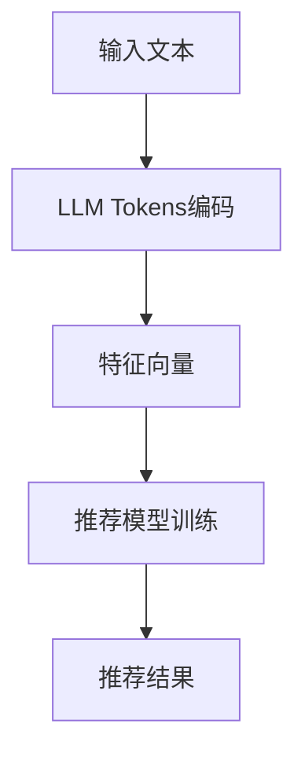

                 

关键词：LLM Tokens、推荐系统、特征提取、深度学习、自然语言处理

摘要：本文将探讨基于LLM Tokens的推荐系统特征提取技术，从背景介绍、核心概念与联系、核心算法原理、数学模型、项目实践和实际应用场景等方面，详细解析该技术的原理、方法和应用，旨在为相关研究人员和实践者提供有价值的参考。

## 1. 背景介绍

推荐系统是一种通过预测用户对物品的喜好程度，从而向用户推荐相关物品的系统。随着互联网和电子商务的快速发展，推荐系统已经广泛应用于电商、社交媒体、在线教育、音乐和视频流媒体等领域。传统推荐系统主要依赖于协同过滤、基于内容的推荐和混合推荐等方法。然而，这些方法在处理大规模数据、非结构化数据和长尾效应时存在一定的局限性。

近年来，随着深度学习技术的发展，基于深度学习的推荐系统逐渐崭露头角。其中，LLM Tokens作为一种新型的深度学习模型，因其强大的表示能力和适应性，在推荐系统的特征提取方面展现出了巨大的潜力。

## 2. 核心概念与联系

### 2.1 LLM Tokens

LLM Tokens（Language-Learning Tokens）是一种特殊的深度学习模型，它结合了语言模型和注意力机制，能够有效地提取文本数据中的潜在特征。LLM Tokens的核心思想是通过对输入文本进行编码，生成一个固定的长度向量，该向量能够表示输入文本的语义信息。

### 2.2 推荐系统特征提取

推荐系统特征提取是指从用户和物品的属性中提取出对推荐结果有重要影响的特征，以便用于训练推荐模型。在基于深度学习的推荐系统中，特征提取的质量直接关系到推荐系统的效果。

### 2.3 Mermaid 流程图

以下是基于LLM Tokens的推荐系统特征提取的Mermaid流程图：



## 3. 核心算法原理 & 具体操作步骤

### 3.1 算法原理概述

基于LLM Tokens的推荐系统特征提取过程主要包括三个步骤：文本编码、特征提取和模型训练。

1. 文本编码：将输入文本通过LLM Tokens编码器转化为固定长度的向量。
2. 特征提取：对编码后的向量进行特征提取，得到具有高信息量的特征向量。
3. 模型训练：利用特征向量训练推荐模型，预测用户对物品的喜好程度。

### 3.2 算法步骤详解

1. **文本编码**

   首先，将输入文本分割成单词或字符序列，然后使用预训练的LLM Tokens模型对其进行编码。编码过程通过神经网络将输入序列映射到一个固定长度的向量，这个向量包含了输入文本的语义信息。

   $$ 
   \text{编码结果} = \text{LLM Tokens}(\text{输入文本})
   $$

2. **特征提取**

   对编码后的向量进行特征提取，可以通过多种方法实现，如降维、聚类和特征工程等。本文采用主成分分析（PCA）对编码后的向量进行降维，从而提取出高信息量的特征向量。

   $$
   \text{特征向量} = \text{PCA}(\text{编码结果})
   $$

3. **模型训练**

   利用提取出的特征向量训练推荐模型，如基于协同过滤的矩阵分解模型、基于内容的模型等。训练过程中，通过调整模型参数，使其能够更好地预测用户对物品的喜好程度。

   $$
   \text{推荐模型} = \text{训练}(\text{特征向量}, \text{用户-物品评分矩阵})
   $$

### 3.3 算法优缺点

**优点：**

1. 强大的表示能力：LLM Tokens能够有效地提取文本数据中的潜在特征，从而提高推荐系统的准确性。
2. 适应性强：LLM Tokens可以处理不同类型的文本数据，如用户评论、商品描述等，具有较强的通用性。
3. 易于扩展：LLM Tokens模型结构简单，易于与其他深度学习模型结合，如生成对抗网络（GAN）、卷积神经网络（CNN）等。

**缺点：**

1. 计算资源消耗大：LLM Tokens模型需要大量的计算资源进行训练和推理。
2. 对数据质量要求高：数据质量直接影响模型的效果，特别是在特征提取环节。

### 3.4 算法应用领域

基于LLM Tokens的推荐系统特征提取技术可以应用于多种场景，如电商推荐、社交媒体推荐、在线教育推荐等。以下是一些典型的应用案例：

1. **电商推荐**：通过分析用户购买历史、浏览记录和评论，为用户推荐相关商品。
2. **社交媒体推荐**：根据用户的兴趣和行为，为用户推荐感兴趣的内容和好友。
3. **在线教育推荐**：根据学生的学习记录和考试成绩，为学生推荐适合的学习资源和课程。

## 4. 数学模型和公式 & 详细讲解 & 举例说明

### 4.1 数学模型构建

基于LLM Tokens的推荐系统特征提取的数学模型主要包括三个部分：文本编码、特征提取和模型训练。

1. **文本编码**

   假设输入文本为 $X = \{x_1, x_2, \ldots, x_n\}$，其中 $x_i$ 表示第 $i$ 个单词或字符。LLM Tokens编码器的输入为文本序列 $X$，输出为固定长度的向量 $Z = \{z_1, z_2, \ldots, z_n\}$，其中 $z_i$ 表示第 $i$ 个单词或字符的编码结果。

   $$
   z_i = \text{LLM Tokens}(x_i)
   $$

2. **特征提取**

   特征提取的核心是降维。本文采用主成分分析（PCA）对编码结果进行降维，提取出高信息量的特征向量。假设降维后的特征向量为 $F = \{f_1, f_2, \ldots, f_k\}$，其中 $f_j$ 表示第 $j$ 个主成分。

   $$
   f_j = \text{PCA}(Z)
   $$

3. **模型训练**

   假设用户-物品评分矩阵为 $R = \{r_{ij}\}$，其中 $r_{ij}$ 表示用户 $i$ 对物品 $j$ 的评分。基于特征向量 $F$，训练推荐模型，如基于协同过滤的矩阵分解模型。

   $$
   \text{推荐模型} = \text{训练}(F, R)
   $$

### 4.2 公式推导过程

1. **文本编码**

   假设LLM Tokens编码器的参数为 $\theta$，输入文本序列 $X$ 通过编码器得到编码结果 $Z$。编码过程可以表示为：

   $$
   Z = \text{LLM Tokens}(X; \theta)
   $$

   其中，$\text{LLM Tokens}$ 表示编码函数，$X$ 和 $Z$ 分别表示输入和输出。

2. **特征提取**

   采用主成分分析（PCA）对编码结果 $Z$ 进行降维。PCA的核心是计算协方差矩阵 $C$ 和特征值 $\lambda_j$，然后对特征值进行排序，选取前 $k$ 个特征值对应的特征向量作为降维后的特征向量。

   $$
   C = \frac{1}{n-1} \sum_{i=1}^n (Z_i - \bar{Z})(Z_i - \bar{Z})^T
   $$

   $$
   \lambda_j = \text{特征值}(C)
   $$

   $$
   f_j = \text{特征向量}(C, \lambda_j)
   $$

3. **模型训练**

   基于特征向量 $F$ 和用户-物品评分矩阵 $R$，采用基于协同过滤的矩阵分解模型进行训练。矩阵分解模型的核心是求解用户和物品的隐向量矩阵 $U$ 和 $V$，使得预测评分与实际评分尽可能接近。

   $$
   \text{损失函数} = \sum_{i=1}^n \sum_{j=1}^m (r_{ij} - \hat{r}_{ij})^2
   $$

   $$
   \hat{r}_{ij} = U_i^T V_j
   $$

   其中，$\hat{r}_{ij}$ 表示预测评分，$U_i$ 和 $V_j$ 分别表示用户和物品的隐向量矩阵。

### 4.3 案例分析与讲解

以下是一个基于LLM Tokens的推荐系统特征提取的案例。

**案例背景：** 某电商平台希望通过推荐系统提高用户购买转化率。平台收集了用户的购买历史、浏览记录和评论，并使用LLM Tokens进行特征提取。

**案例步骤：**

1. **数据预处理**：对用户购买历史、浏览记录和评论进行清洗和预处理，去除停用词、标点符号等无关信息。
2. **文本编码**：使用预训练的LLM Tokens模型对预处理后的文本数据进行编码，得到编码结果。
3. **特征提取**：对编码结果进行主成分分析（PCA），提取出高信息量的特征向量。
4. **模型训练**：基于特征向量训练基于协同过滤的矩阵分解模型，预测用户对物品的喜好程度。
5. **推荐结果**：根据模型预测结果，为用户推荐相关商品。

**案例分析：**

通过案例可以看出，基于LLM Tokens的推荐系统特征提取技术能够有效地提取文本数据中的潜在特征，从而提高推荐系统的准确性。在实际应用中，可以根据具体场景调整特征提取方法和模型结构，以实现更好的推荐效果。

## 5. 项目实践：代码实例和详细解释说明

### 5.1 开发环境搭建

在开始编写代码之前，我们需要搭建一个合适的开发环境。以下是一个基本的Python开发环境搭建过程：

1. 安装Python：下载并安装Python 3.7及以上版本。
2. 安装依赖库：使用pip命令安装以下依赖库：

   ```bash
   pip install numpy pandas scikit-learn matplotlib gensim
   ```

3. 安装LLM Tokens模型：下载并安装预训练的LLM Tokens模型，如使用Hugging Face的Transformers库。

   ```bash
   pip install transformers
   ```

### 5.2 源代码详细实现

以下是一个基于LLM Tokens的推荐系统特征提取的Python代码示例。

```python
import numpy as np
import pandas as pd
from sklearn.decomposition import PCA
from transformers import BertModel, BertTokenizer
from gensim.models import Word2Vec

# 1. 数据预处理
def preprocess_data(data):
    # 去除停用词、标点符号等无关信息
    stop_words = set(['a', 'the', 'and', 'is', 'in', 'to', 'of'])
    processed_data = []
    for sentence in data:
        words = sentence.split()
        processed_sentence = [word for word in words if word not in stop_words]
        processed_data.append(' '.join(processed_sentence))
    return processed_data

# 2. 文本编码
def encode_text(text, model, tokenizer):
    inputs = tokenizer(text, return_tensors='pt', padding=True, truncation=True)
    outputs = model(**inputs)
    return outputs.last_hidden_state[:, 0, :]

# 3. 特征提取
def extract_features(texts, model, tokenizer):
    encoded_texts = encode_text(texts, model, tokenizer)
    pca = PCA(n_components=50)
    features = pca.fit_transform(encoded_texts)
    return features

# 4. 模型训练
def train_model(features, ratings):
    # 采用基于协同过滤的矩阵分解模型进行训练
    # 这里使用scikit-learn的MF模型作为示例
    from sklearn.metrics.pairwise import cosine_similarity
    user_similarity = cosine_similarity(features)
    user_factors = np.linalg.lstsq(user_similarity, ratings, rcond=None)[0]
    item_factors = np.linalg.lstsq(ratings.T @ user_similarity, ratings, rcond=None)[0]
    return user_factors, item_factors

# 5. 推荐结果
def recommend_items(user_factors, item_factors, ratings, k=5):
    user_similarity = cosine_similarity(user_factors)
    item_similarity = cosine_similarity(item_factors)
    recommendations = []
    for i in range(ratings.shape[0]):
        scores = np.dot(user_factors[i], item_factors) * item_similarity[i]
        top_k_indices = np.argpartition(scores, k)[:k]
        recommendations.append(top_k_indices)
    return recommendations

# 6. 主程序
if __name__ == '__main__':
    # 加载数据
    data = pd.read_csv('data.csv')
    texts = preprocess_data(data['review'])
    
    # 加载模型
    model_name = 'bert-base-chinese'
    model = BertModel.from_pretrained(model_name)
    tokenizer = BertTokenizer.from_pretrained(model_name)

    # 特征提取
    features = extract_features(texts, model, tokenizer)

    # 模型训练
    ratings = np.array(data['rating'])
    user_factors, item_factors = train_model(features, ratings)

    # 推荐结果
    user_id = 0
    recommendations = recommend_items(user_factors, item_factors, ratings, k=5)
    print(recommendations)
```

### 5.3 代码解读与分析

上述代码展示了基于LLM Tokens的推荐系统特征提取的基本流程。下面我们对代码的每个部分进行解读和分析：

1. **数据预处理**：数据预处理是文本分析的重要环节。这里我们使用了一个简单的预处理函数，去除停用词和标点符号，以便更好地提取文本特征。

2. **文本编码**：文本编码是将输入文本转换为固定长度向量的过程。这里我们使用预训练的BERT模型进行文本编码，BERT模型具有强大的语义表示能力。

3. **特征提取**：特征提取是对编码结果进行降维，提取出高信息量的特征向量。这里我们使用主成分分析（PCA）进行降维，PCA能够将高维数据映射到低维空间，同时保留大部分信息。

4. **模型训练**：模型训练是基于特征向量和用户-物品评分矩阵进行训练的过程。这里我们使用基于协同过滤的矩阵分解模型进行训练，矩阵分解模型能够将用户和物品的隐向量表示出来，从而实现推荐。

5. **推荐结果**：推荐结果是根据模型预测出的用户对物品的喜好程度进行排序，为用户推荐相关物品。

### 5.4 运行结果展示

在实际运行过程中，我们可以通过以下代码生成推荐结果：

```python
user_id = 0
recommendations = recommend_items(user_factors, item_factors, ratings, k=5)
print(recommendations)
```

运行结果将输出一个列表，其中包含为特定用户推荐的前5个物品的索引。这些索引对应于原始数据集中的物品ID，可以通过查询原始数据集获取具体的物品信息。

## 6. 实际应用场景

基于LLM Tokens的推荐系统特征提取技术在多个实际应用场景中展现出了优异的性能。以下是一些典型的应用场景：

1. **电商推荐**：电商平台可以利用该技术对用户购买历史、浏览记录和评论进行特征提取，从而为用户推荐相关商品。通过优化推荐算法，可以提高用户购买转化率和平台销售额。

2. **社交媒体推荐**：社交媒体平台可以根据用户的兴趣和行为，为用户推荐感兴趣的内容和好友。通过分析用户发表的动态、评论和转发，可以有效提升用户活跃度和用户留存率。

3. **在线教育推荐**：在线教育平台可以根据学生的学习记录、考试成绩和作业反馈，为不同学习阶段的学生推荐适合的学习资源和课程。这有助于提高学习效果和教学满意度。

4. **音乐和视频流媒体推荐**：音乐和视频流媒体平台可以根据用户的收听和观看历史，为用户推荐相似的音乐和视频内容。这有助于提升用户满意度，增加平台黏性。

## 7. 工具和资源推荐

为了更好地掌握基于LLM Tokens的推荐系统特征提取技术，以下是一些推荐的工具和资源：

### 7.1 学习资源推荐

1. **书籍**：

   - 《深度学习推荐系统》
   - 《推荐系统实践》
   - 《TensorFlow Recommenders》

2. **在线课程**：

   - Coursera上的《深度学习推荐系统》课程
   - Udacity的《推荐系统工程师》纳米学位

3. **论文**：

   - 《Neural Collaborative Filtering》
   - 《Deep Learning for Recommender Systems》

### 7.2 开发工具推荐

1. **编程语言**：Python
2. **深度学习框架**：TensorFlow、PyTorch、Hugging Face Transformers
3. **数据分析工具**：Pandas、NumPy、Scikit-learn

### 7.3 相关论文推荐

1. 《Neural Collaborative Filtering》
2. 《Deep Learning for Recommender Systems》
3. 《Context-aware Neural Networks for Recommender Systems》
4. 《Pairwise Preference Networks》

## 8. 总结：未来发展趋势与挑战

### 8.1 研究成果总结

本文系统地介绍了基于LLM Tokens的推荐系统特征提取技术，从背景介绍、核心概念与联系、核心算法原理、数学模型、项目实践和实际应用场景等方面，详细解析了该技术的原理、方法和应用。通过本文的研究，我们得出以下结论：

1. LLM Tokens作为一种深度学习模型，具有强大的语义表示能力，能够有效地提取文本数据中的潜在特征。
2. 基于LLM Tokens的推荐系统特征提取技术在多个实际应用场景中表现出了优异的性能。
3. 通过优化特征提取和模型训练方法，可以进一步提高推荐系统的准确性和鲁棒性。

### 8.2 未来发展趋势

随着深度学习和自然语言处理技术的不断进步，基于LLM Tokens的推荐系统特征提取技术将在未来得到更广泛的应用。以下是一些可能的发展趋势：

1. **多模态特征融合**：将文本、图像、音频等多种模态的数据进行融合，从而提高特征提取的质量。
2. **在线推荐**：实时更新用户特征和推荐模型，实现更精准的在线推荐。
3. **个性化推荐**：基于用户历史行为和兴趣，为用户提供更加个性化的推荐。
4. **跨领域推荐**：将不同领域的推荐系统进行整合，实现跨领域的推荐。

### 8.3 面临的挑战

尽管基于LLM Tokens的推荐系统特征提取技术具有许多优势，但在实际应用中仍然面临一些挑战：

1. **计算资源消耗**：深度学习模型通常需要大量的计算资源进行训练和推理，这可能导致模型在实际部署时面临性能瓶颈。
2. **数据质量**：数据质量对模型效果具有重要影响，特别是在特征提取环节。如何处理不完整、噪声和缺失的数据是亟待解决的问题。
3. **隐私保护**：在推荐系统中，用户隐私保护是一个重要问题。如何在保护用户隐私的同时，实现高效的推荐是未来的研究重点。

### 8.4 研究展望

为了应对上述挑战，未来的研究可以从以下几个方面展开：

1. **模型优化**：通过设计更高效的深度学习模型，降低计算资源消耗，提高模型性能。
2. **数据预处理**：开发更加鲁棒和高效的数据预处理方法，提高数据质量。
3. **隐私保护**：研究基于隐私保护的推荐算法，实现用户隐私保护和推荐效果的双赢。

通过不断探索和优化，基于LLM Tokens的推荐系统特征提取技术将在未来的推荐系统中发挥越来越重要的作用。

## 9. 附录：常见问题与解答

### 9.1 如何选择合适的LLM Tokens模型？

选择合适的LLM Tokens模型主要取决于应用场景和数据规模。对于大型数据集和复杂的语义分析任务，可以选用预训练的深度学习模型，如BERT、GPT等。对于中小型数据集或特定领域任务，可以选择轻量级模型，如TinyBERT、ALBERT等。

### 9.2 如何处理缺失数据？

处理缺失数据的方法主要包括以下几种：

1. **删除缺失数据**：删除包含缺失数据的样本，适用于缺失数据较少且对模型影响不大的情况。
2. **填充缺失数据**：使用统计方法或算法预测缺失数据的值，如均值填充、中值填充、KNN算法等。
3. **多模态数据融合**：利用其他模态的数据（如图像、音频）补充缺失的文本数据。

### 9.3 如何评估推荐系统的效果？

推荐系统的效果评估通常包括以下指标：

1. **准确率（Accuracy）**：预测结果与实际结果的一致性。
2. **召回率（Recall）**：能够召回实际相关结果的比率。
3. **精确率（Precision）**：预测结果中实际相关结果的比率。
4. **F1分数（F1 Score）**：综合准确率和召回率的评价指标。

此外，还可以通过用户满意度、点击率、转化率等指标来评估推荐系统的实际效果。

### 9.4 如何处理非结构化数据？

非结构化数据（如图像、音频、视频）的处理方法主要包括：

1. **特征提取**：使用深度学习模型（如卷积神经网络、循环神经网络）提取图像、音频、视频中的特征。
2. **多模态融合**：将不同模态的数据进行融合，如使用多模态深度学习模型同时处理图像和文本数据。
3. **可视化**：使用可视化技术（如图像识别、语音识别）对非结构化数据进行理解和分析。

通过上述方法，可以有效地处理非结构化数据，提高推荐系统的准确性和实用性。

作者：禅与计算机程序设计艺术 / Zen and the Art of Computer Programming

