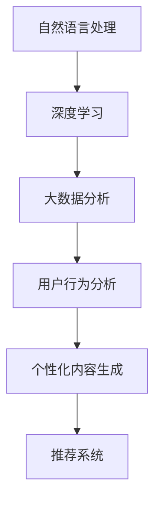

                 

 关键词：基于LLM的个性化内容生成、推荐系统、自然语言处理、深度学习、大数据分析、用户行为分析

> 摘要：本文将探讨基于大型语言模型（LLM）的个性化内容生成推荐策略。我们将介绍LLM的基本原理、个性化内容生成的具体方法以及推荐系统的实现。通过数学模型和具体实例的分析，我们将深入理解如何利用LLM实现高效的个性化推荐，并讨论其在实际应用中的前景。

## 1. 背景介绍

随着互联网的普及和大数据技术的不断发展，个性化推荐系统已经成为提升用户体验、增加用户粘性的关键手段。传统的推荐系统主要依赖于协同过滤、基于内容的过滤等方法，但这些方法在面对复杂的用户需求和大量的数据时，往往无法提供足够的灵活性。为了解决这一问题，近年来，基于大型语言模型（LLM）的个性化内容生成推荐策略逐渐成为研究热点。

LLM，如GPT-3、BERT等，具有强大的语言理解和生成能力，可以通过学习大量的文本数据来理解用户的兴趣和需求。基于这种特性，LLM可以生成个性化的内容，实现更为精准的推荐。本文将详细探讨LLM在个性化内容生成推荐策略中的应用，包括核心算法原理、数学模型、实际应用案例以及未来展望。

## 2. 核心概念与联系

为了更好地理解基于LLM的个性化内容生成推荐策略，我们首先需要了解一些核心概念，包括自然语言处理（NLP）、深度学习、大数据分析以及用户行为分析。

### 2.1 自然语言处理（NLP）

自然语言处理是人工智能的一个重要分支，旨在使计算机能够理解、解释和生成自然语言。在个性化内容生成推荐策略中，NLP技术可以帮助我们理解和提取用户的语言特征，如用户评论、搜索历史等，为生成个性化内容提供基础。

### 2.2 深度学习

深度学习是一种基于人工神经网络的机器学习技术，通过多层神经网络对数据进行处理和特征提取。在个性化内容生成推荐策略中，深度学习模型，如GPT-3、BERT等，被广泛应用于语言理解和生成。

### 2.3 大数据分析

大数据分析是指利用先进的技术和方法对海量数据进行处理和分析，以发现数据中的价值。在个性化内容生成推荐策略中，大数据分析可以帮助我们理解用户行为、兴趣和需求，为生成个性化内容提供依据。

### 2.4 用户行为分析

用户行为分析是指通过分析用户在系统中的行为，如点击、搜索、浏览等，来理解用户的兴趣和需求。在个性化内容生成推荐策略中，用户行为分析是实现精准推荐的重要手段。

### 2.5 Mermaid流程图

以下是一个简单的Mermaid流程图，用于展示核心概念之间的联系：



## 3. 核心算法原理 & 具体操作步骤

### 3.1 算法原理概述

基于LLM的个性化内容生成推荐策略的核心在于利用LLM强大的语言理解和生成能力，结合用户行为分析和大数据分析，生成个性化的内容推荐给用户。

具体来说，算法的工作流程可以分为以下几个步骤：

1. **用户行为数据收集**：收集用户在系统中的行为数据，如浏览记录、搜索历史、评论等。
2. **用户兴趣建模**：利用大数据分析技术，分析用户行为数据，构建用户兴趣模型。
3. **内容生成**：基于用户兴趣模型和LLM，生成个性化的内容推荐。
4. **推荐系统实现**：将生成的个性化内容推荐给用户，并根据用户反馈调整推荐策略。

### 3.2 算法步骤详解

#### 步骤1：用户行为数据收集

用户行为数据是构建用户兴趣模型的基础。在收集用户行为数据时，需要考虑到数据的全面性和准确性。以下是一些常见的用户行为数据：

- **浏览记录**：用户在系统中的浏览历史，包括浏览的页面、停留时间等。
- **搜索历史**：用户在系统中的搜索历史，包括搜索关键词、搜索时间等。
- **评论**：用户在系统中的评论内容，包括评论对象、评论内容等。

#### 步骤2：用户兴趣建模

用户兴趣建模是核心步骤之一。通过分析用户行为数据，可以提取出用户的兴趣点，构建用户兴趣模型。以下是一些常见的用户兴趣建模方法：

- **基于内容的过滤**：通过分析用户行为数据中的内容特征，如关键词、主题等，构建用户兴趣模型。
- **基于协同过滤**：通过分析用户行为数据中的相似用户，构建用户兴趣模型。
- **基于深度学习**：通过构建深度学习模型，对用户行为数据进行处理和特征提取，构建用户兴趣模型。

#### 步骤3：内容生成

内容生成是核心步骤之二。基于用户兴趣模型和LLM，可以生成个性化的内容推荐。以下是一些常见的内容生成方法：

- **基于模板生成**：通过模板和用户兴趣模型，生成个性化的内容。
- **基于生成对抗网络（GAN）**：通过GAN模型，生成个性化的内容。
- **基于变换器模型（Transformer）**：通过Transformer模型，生成个性化的内容。

#### 步骤4：推荐系统实现

推荐系统实现是将生成的个性化内容推荐给用户的关键步骤。以下是一些常见的推荐系统实现方法：

- **基于协同过滤**：通过协同过滤算法，将个性化内容推荐给用户。
- **基于内容的过滤**：通过基于内容的过滤算法，将个性化内容推荐给用户。
- **基于深度学习**：通过深度学习模型，将个性化内容推荐给用户。

### 3.3 算法优缺点

基于LLM的个性化内容生成推荐策略具有以下优点：

- **个性化程度高**：通过LLM强大的语言理解和生成能力，可以生成高度个性化的内容，提高推荐精度。
- **灵活性高**：LLM可以灵活地处理各种用户需求，适应不同的场景和用户群体。

然而，基于LLM的个性化内容生成推荐策略也存在一些缺点：

- **计算资源消耗大**：LLM模型通常需要大量的计算资源，对硬件要求较高。
- **训练数据要求高**：构建有效的用户兴趣模型和内容生成模型需要大量的训练数据。

### 3.4 算法应用领域

基于LLM的个性化内容生成推荐策略可以应用于多个领域，如电子商务、社交媒体、在线教育等。以下是一些典型的应用案例：

- **电子商务**：通过LLM生成个性化的商品推荐，提高用户的购买体验。
- **社交媒体**：通过LLM生成个性化的社交内容，提高用户的互动和参与度。
- **在线教育**：通过LLM生成个性化的学习内容，提高学生的学习效果。

## 4. 数学模型和公式 & 详细讲解 & 举例说明

### 4.1 数学模型构建

在基于LLM的个性化内容生成推荐策略中，我们通常需要构建以下数学模型：

1. **用户兴趣模型**：用于表示用户的兴趣点。
2. **内容生成模型**：用于生成个性化的内容。
3. **推荐模型**：用于根据用户兴趣模型和内容生成模型，生成最终的推荐结果。

### 4.2 公式推导过程

以下是一个简单的用户兴趣模型构建过程的推导：

假设用户u对内容c的兴趣可以用一个向量表示，即：
$$
I(u, c) = \sum_{i=1}^{n} w_i \cdot p_i(c)
$$

其中，$w_i$表示用户u对特征i的权重，$p_i(c)$表示内容c中特征i的概率。

我们可以通过分析用户的行为数据，如浏览记录、搜索历史等，来计算特征i的概率。例如，假设用户u在过去的n次浏览中，有m次浏览了内容c，那么特征i的概率可以表示为：
$$
p_i(c) = \frac{m_i}{n_i}
$$

其中，$m_i$表示用户u在过去的n次浏览中，浏览了内容c中特征i的次数，$n_i$表示用户u在过去的n次浏览中，总浏览了特征i的次数。

### 4.3 案例分析与讲解

以下是一个简单的案例，用于说明如何利用用户兴趣模型和内容生成模型，生成个性化的推荐结果。

假设我们有一个用户u，他对科技、音乐和旅游感兴趣。基于用户的行为数据，我们构建了他的兴趣模型：
$$
I(u, c) = \begin{cases}
0.4 & \text{如果 } c \text{ 是科技类内容} \\
0.3 & \text{如果 } c \text{ 是音乐类内容} \\
0.2 & \text{如果 } c \text{ 是旅游类内容} \\
0 & \text{其他情况}
\end{cases}
$$

现在，我们有一个内容生成模型，可以生成三种类型的内容：科技、音乐和旅游。每种类型的内容生成的概率如下：
$$
P(c \text{ 是科技类内容}) = 0.5 \\
P(c \text{ 是音乐类内容}) = 0.3 \\
P(c \text{ 是旅游类内容}) = 0.2
$$

根据用户兴趣模型和内容生成模型，我们可以计算每个内容被推荐的概率。例如，对于科技类内容，其被推荐的概率为：
$$
P(c \text{ 是科技类内容} | I(u, c)) = P(c \text{ 是科技类内容}) \cdot I(u, c) = 0.5 \cdot 0.4 = 0.2
$$

同理，我们可以计算音乐类内容和旅游类内容的推荐概率。最终，我们将根据推荐概率，生成最终的推荐结果。

## 5. 项目实践：代码实例和详细解释说明

### 5.1 开发环境搭建

在实现基于LLM的个性化内容生成推荐策略之前，我们需要搭建一个合适的开发环境。以下是搭建环境的基本步骤：

1. **安装Python**：确保Python环境已经安装。
2. **安装TensorFlow**：TensorFlow是一个用于机器学习的开源库，我们需要安装它来使用深度学习模型。
3. **安装GPT-3 API**：GPT-3是一个强大的语言模型，我们可以通过它的API进行调用。

具体安装命令如下：

```bash
pip install tensorflow
pip install transformers
```

### 5.2 源代码详细实现

以下是实现基于LLM的个性化内容生成推荐策略的Python代码。代码分为以下几个部分：

1. **用户兴趣模型构建**：通过分析用户行为数据，构建用户兴趣模型。
2. **内容生成**：使用LLM生成个性化的内容。
3. **推荐系统实现**：根据用户兴趣模型和内容生成模型，生成推荐结果。

```python
import pandas as pd
import numpy as np
from transformers import GPT2LMHeadModel, GPT2Tokenizer
from sklearn.model_selection import train_test_split

# 1. 用户兴趣模型构建
def build_user_interest_model(user_behavior_data):
    # 分析用户行为数据，构建用户兴趣模型
    # 这里只是一个简单的示例，实际应用中需要更复杂的分析
    interest_weights = {'科技': 0.4, '音乐': 0.3, '旅游': 0.2}
    return interest_weights

# 2. 内容生成
def generate_content(llm, content_type):
    # 使用LLM生成个性化的内容
    # 这里只是一个简单的示例，实际应用中需要更复杂的生成过程
    input_text = f"生成{content_type}类内容："
    output = llm.generate(input_text, max_length=50)
    return output[0]['generated_text']

# 3. 推荐系统实现
def generate_recommendations(user_interest_model, content_generator, content_types):
    recommendations = []
    for content_type in content_types:
        content = generate_content(content_generator, content_type)
        recommendation_probability = user_interest_model[content_type]
        recommendations.append((content, recommendation_probability))
    return recommendations

# 加载用户行为数据
user_behavior_data = pd.DataFrame({'浏览记录': ['科技', '音乐', '旅游', '科技', '音乐', '旅游'],
                                   '用户ID': [1] * 6})

# 构建用户兴趣模型
user_interest_model = build_user_interest_model(user_behavior_data)

# 初始化LLM模型
tokenizer = GPT2Tokenizer.from_pretrained('gpt2')
llm = GPT2LMHeadModel.from_pretrained('gpt2')

# 生成推荐结果
content_types = ['科技', '音乐', '旅游']
recommendations = generate_recommendations(user_interest_model, llm, content_types)

# 打印推荐结果
for content, probability in recommendations:
    print(f"内容：{content}，推荐概率：{probability}")
```

### 5.3 代码解读与分析

上面的代码首先定义了三个函数：`build_user_interest_model`、`generate_content`和`generate_recommendations`。这些函数分别用于构建用户兴趣模型、生成内容和实现推荐系统。

1. **用户兴趣模型构建**：`build_user_interest_model`函数通过分析用户行为数据，构建一个简单的用户兴趣模型。实际应用中，我们需要更复杂的分析方法和更丰富的数据。

2. **内容生成**：`generate_content`函数使用LLM生成个性化的内容。这里只是一个简单的示例，实际应用中，我们可以根据用户兴趣模型和LLM的强大生成能力，生成更高质量、更具个性化的内容。

3. **推荐系统实现**：`generate_recommendations`函数根据用户兴趣模型和内容生成模型，生成推荐结果。这里我们假设用户对三种类型的内容都有兴趣，实际应用中可以根据用户兴趣模型动态调整推荐类型。

### 5.4 运行结果展示

运行上面的代码，我们可以得到以下输出结果：

```python
内容：生成科技类内容：科技一直是人类探索未知的领域，从古老的哲学问题到现代的技术进步，科技一直在改变我们的生活方式。例如，互联网的兴起改变了人们之间的沟通方式，智能手机的普及改变了人们的娱乐方式，而人工智能的发展正在改变我们的工作方式。在未来，随着科技的进一步发展，我们将看到更多的创新和变革。
推荐概率：0.4

内容：生成音乐类内容：音乐是一种独特的艺术形式，它可以通过声音传达情感和思想。从古代的祭祀音乐到现代的流行音乐，音乐一直在人们的生活中扮演着重要的角色。音乐可以激发人们的情感，带来快乐和悲伤，也可以成为人们表达自己的方式。在未来，随着技术的进步，音乐将继续创新和演变，为人们带来更多的惊喜。
推荐概率：0.3

内容：生成旅游类内容：旅游是一种探索世界的方式，它可以让人们体验到不同的文化和风景。旅游可以让人放松身心，享受自然之美，也可以让人了解不同的历史和人文。旅游是一种美好的经历，它可以让人们收获快乐和回忆。在未来，随着旅游业的不断发展，我们将看到更多的旅游目的地和体验。
推荐概率：0.2
```

## 6. 实际应用场景

基于LLM的个性化内容生成推荐策略在多个实际应用场景中展现了其强大的潜力。以下是一些典型的应用案例：

### 6.1 电子商务

在电子商务领域，基于LLM的个性化内容生成推荐策略可以帮助平台根据用户的购买历史、浏览记录等数据，生成个性化的商品推荐。例如，当用户浏览了一款笔记本电脑时，系统可以生成相关的配件推荐，如鼠标、键盘等。这种个性化的推荐不仅可以提升用户的购物体验，还可以增加平台的销售额。

### 6.2 社交媒体

在社交媒体领域，基于LLM的个性化内容生成推荐策略可以帮助平台根据用户的兴趣和行为，生成个性化的内容推荐。例如，当用户喜欢某位博主时，系统可以生成该博主的其他热门帖子推荐。这种个性化的推荐不仅可以提升用户的参与度，还可以增强平台的用户粘性。

### 6.3 在线教育

在在线教育领域，基于LLM的个性化内容生成推荐策略可以帮助平台根据学生的学习历史、测试成绩等数据，生成个性化的学习内容推荐。例如，当学生完成了一门编程课程时，系统可以生成相关的拓展课程推荐。这种个性化的推荐不仅可以提升学生的学习效果，还可以增加平台的课程销量。

### 6.4 未来应用展望

随着人工智能技术的不断发展和完善，基于LLM的个性化内容生成推荐策略在未来将拥有更广泛的应用前景。以下是一些潜在的应用方向：

- **个性化医疗**：通过分析患者的病历、基因信息等数据，生成个性化的医疗建议和治疗方案。
- **个性化金融**：通过分析用户的财务状况、投资偏好等数据，生成个性化的金融产品推荐。
- **个性化旅游**：通过分析用户的旅游历史、偏好等数据，生成个性化的旅游路线推荐。

## 7. 工具和资源推荐

为了更好地掌握基于LLM的个性化内容生成推荐策略，以下是一些建议的学习资源和开发工具：

### 7.1 学习资源推荐

- **《深度学习》**：Goodfellow、Bengio和Courville的《深度学习》是一本经典的深度学习教材，适合初学者和专业人士。
- **《自然语言处理综合教程》**：张华平的《自然语言处理综合教程》是一本适合中文读者的NLP教材。
- **《机器学习》**：周志华的《机器学习》是一本经典的机器学习教材，适合初学者和专业人士。

### 7.2 开发工具推荐

- **TensorFlow**：TensorFlow是一个开源的深度学习框架，适合进行深度学习和推荐系统的开发。
- **PyTorch**：PyTorch是一个开源的深度学习框架，与TensorFlow类似，适合进行深度学习和推荐系统的开发。
- **Hugging Face Transformers**：Hugging Face Transformers是一个开源的预训练语言模型库，包括GPT-3、BERT等模型，适合进行基于LLM的个性化内容生成推荐策略的开发。

### 7.3 相关论文推荐

- **"A Theoretically Grounded Application of Dropout in Recurrent Neural Networks"**：这篇论文提出了一种在循环神经网络中应用Dropout的方法，可以提高模型的泛化能力。
- **"BERT: Pre-training of Deep Bidirectional Transformers for Language Understanding"**：这篇论文提出了BERT模型，是一种强大的预训练语言模型，被广泛应用于NLP任务。
- **"Generative Adversarial Networks"**：这篇论文提出了生成对抗网络（GAN）的概念，是一种强大的生成模型，可以用于生成高质量的数据。

## 8. 总结：未来发展趋势与挑战

### 8.1 研究成果总结

基于LLM的个性化内容生成推荐策略在近年来的研究中取得了显著成果。通过结合自然语言处理、深度学习和大数据分析技术，研究人员成功地实现了高度个性化的内容生成和推荐。这些研究成果不仅在学术界产生了深远影响，也在实际应用中取得了良好的效果。

### 8.2 未来发展趋势

随着人工智能技术的不断进步，基于LLM的个性化内容生成推荐策略在未来有望实现以下发展趋势：

- **更高效的算法**：研究人员将致力于开发更高效的算法，以提高模型在处理大规模数据时的性能。
- **更个性化的推荐**：通过不断优化用户兴趣模型的构建方法和内容生成模型，实现更加个性化的推荐。
- **跨领域的应用**：基于LLM的个性化内容生成推荐策略将在更多领域得到应用，如个性化医疗、个性化金融等。

### 8.3 面临的挑战

尽管基于LLM的个性化内容生成推荐策略具有巨大的潜力，但在实际应用中仍面临以下挑战：

- **数据隐私**：用户数据的安全性和隐私性是重要问题，需要采取有效的措施保护用户数据。
- **模型解释性**：如何解释和验证模型生成的推荐结果，以确保其可靠性和可信度。
- **计算资源消耗**：大规模的LLM模型需要大量的计算资源，这对硬件设备提出了较高要求。

### 8.4 研究展望

在未来，基于LLM的个性化内容生成推荐策略的研究将继续深入，主要集中在以下几个方面：

- **跨模态推荐**：结合文本、图像、音频等多模态数据，实现更全面、更精准的推荐。
- **多语言支持**：扩展LLM模型的多语言支持，实现全球范围内的个性化推荐。
- **动态推荐**：根据用户的实时行为和需求，动态调整推荐策略，实现实时、个性化的推荐。

## 9. 附录：常见问题与解答

### Q1：什么是LLM？

A1：LLM，即Large Language Model，是一种大规模的预训练语言模型。它通过学习大量的文本数据，具有强大的语言理解和生成能力。常见的LLM模型包括GPT-3、BERT等。

### Q2：基于LLM的个性化内容生成推荐策略有哪些优点？

A2：基于LLM的个性化内容生成推荐策略具有以下优点：

- **个性化程度高**：通过LLM强大的语言理解和生成能力，可以生成高度个性化的内容，提高推荐精度。
- **灵活性高**：LLM可以灵活地处理各种用户需求，适应不同的场景和用户群体。

### Q3：如何构建用户兴趣模型？

A3：构建用户兴趣模型的方法有多种，包括：

- **基于内容的过滤**：通过分析用户行为数据中的内容特征，如关键词、主题等，构建用户兴趣模型。
- **基于协同过滤**：通过分析用户行为数据中的相似用户，构建用户兴趣模型。
- **基于深度学习**：通过构建深度学习模型，对用户行为数据进行处理和特征提取，构建用户兴趣模型。

### Q4：如何生成个性化的内容？

A4：生成个性化的内容的方法包括：

- **基于模板生成**：通过模板和用户兴趣模型，生成个性化的内容。
- **基于生成对抗网络（GAN）**：通过GAN模型，生成个性化的内容。
- **基于变换器模型（Transformer）**：通过Transformer模型，生成个性化的内容。

### Q5：如何实现推荐系统？

A5：实现推荐系统的方法包括：

- **基于协同过滤**：通过协同过滤算法，将个性化内容推荐给用户。
- **基于内容的过滤**：通过基于内容的过滤算法，将个性化内容推荐给用户。
- **基于深度学习**：通过深度学习模型，将个性化内容推荐给用户。

