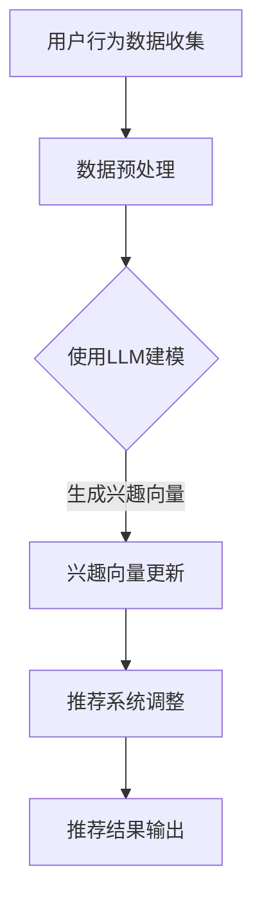

                 

关键词：推荐系统、动态兴趣建模、大语言模型(LLM)、数据挖掘、人工智能、用户行为分析、机器学习

> 摘要：本文将探讨如何利用大型语言模型(LLM)进行推荐系统的动态兴趣建模。通过分析用户行为数据和文本，LLM能够捕捉并预测用户的兴趣变化，从而提高推荐系统的准确性和用户体验。本文将介绍LLM的基本原理，核心算法，数学模型，并在实践中提供代码实例，展示如何实现这一技术。

## 1. 背景介绍

推荐系统是当今互联网中不可或缺的部分，旨在根据用户的历史行为和兴趣，为其推荐相关的内容、商品或服务。然而，随着用户需求的多样化和动态性，传统的推荐系统面临着如何及时捕捉用户兴趣变化和提高推荐准确性的挑战。

动态兴趣建模旨在实时跟踪和预测用户的兴趣变化，从而实现更精准的推荐。传统的动态兴趣建模方法主要包括基于协同过滤、基于内容过滤和基于模型的方法等。这些方法在处理静态兴趣数据时表现良好，但在应对动态性方面存在一定的局限性。

近年来，大型语言模型（LLM）如BERT、GPT等在自然语言处理领域取得了显著的进展。LLM具有强大的文本理解和生成能力，可以捕捉到文本中的细微语义差异。这一特性使得LLM在动态兴趣建模中具有巨大的潜力。

本文将探讨如何利用LLM进行推荐系统的动态兴趣建模，通过分析用户行为数据和文本，实现实时捕捉用户兴趣变化并提高推荐准确性的目标。

## 2. 核心概念与联系

### 2.1 大语言模型(LLM)

大语言模型（LLM）是指通过大规模预训练和微调，能够理解和生成自然语言文本的深度学习模型。LLM的核心思想是通过无监督学习从大量文本数据中学习语言规律，从而在多个自然语言处理任务上实现高性能。

常见的LLM包括：

- **BERT**：基于Transformer架构，通过双向编码表示学习（Bidirectional Encoder Representations from Transformers）来预训练。
- **GPT**：生成预训练变换器（Generative Pretrained Transformer），通过自回归的方式生成文本。

### 2.2 动态兴趣建模

动态兴趣建模是指根据用户实时行为数据，动态调整用户的兴趣模型，从而提高推荐系统的准确性。动态兴趣建模的核心是实时捕捉用户兴趣变化，并通过机器学习算法对用户兴趣进行建模。

### 2.3 Mermaid 流程图

以下是一个动态兴趣建模的Mermaid流程图，展示LLM在其中的应用。



## 3. 核心算法原理 & 具体操作步骤

### 3.1 算法原理概述

动态兴趣建模的核心是利用LLM捕捉用户兴趣的变化。具体步骤如下：

1. 收集用户行为数据，如浏览记录、搜索历史、点击行为等。
2. 对用户行为数据进行预处理，提取关键信息。
3. 使用LLM对预处理后的用户行为数据进行建模，生成用户兴趣向量。
4. 根据用户兴趣向量动态调整推荐系统的参数，提高推荐准确性。
5. 输出推荐结果。

### 3.2 算法步骤详解

#### 3.2.1 用户行为数据收集

用户行为数据可以通过Web服务器日志、应用程序接口（API）等渠道收集。常见的数据类型包括：

- 浏览记录：用户浏览的页面、时间、停留时间等。
- 搜索历史：用户搜索的关键词、搜索时间等。
- 点击行为：用户点击的链接、广告、商品等。

#### 3.2.2 数据预处理

数据预处理是动态兴趣建模的关键步骤，主要包括以下任务：

- 数据清洗：去除噪声数据、异常值等。
- 特征提取：从用户行为数据中提取关键特征，如关键词、时间戳等。
- 数据归一化：将不同特征的数据范围统一，便于模型训练。

#### 3.2.3 使用LLM建模

选择合适的LLM模型，如BERT或GPT，对预处理后的用户行为数据进行建模。具体步骤如下：

1. 下载并安装LLM模型。
2. 将预处理后的数据输入到LLM模型中，进行预训练。
3. 微调模型，使其适应动态兴趣建模的任务。

#### 3.2.4 兴趣向量更新

根据LLM生成的用户兴趣向量，动态更新推荐系统的参数。具体步骤如下：

1. 计算用户兴趣向量与推荐系统当前参数之间的差异。
2. 利用梯度下降等优化算法，更新推荐系统参数。

#### 3.2.5 推荐系统调整

根据更新后的用户兴趣向量，调整推荐系统的参数，提高推荐准确性。具体步骤如下：

1. 计算推荐系统的新预测值。
2. 利用评估指标（如准确率、召回率等）评估推荐结果。

#### 3.2.6 推荐结果输出

根据调整后的推荐系统，输出推荐结果，展示给用户。

### 3.3 算法优缺点

#### 优点

- **强大的文本理解能力**：LLM能够捕捉到文本中的细微语义差异，从而提高兴趣建模的准确性。
- **实时性**：动态兴趣建模能够实时捕捉用户兴趣变化，提高推荐系统的实时性。
- **多样性**：LLM能够生成多样化的推荐结果，满足用户多样化需求。

#### 缺点

- **计算资源消耗**：LLM模型的训练和微调需要大量的计算资源和时间。
- **数据依赖性**：动态兴趣建模依赖于用户行为数据，数据质量对建模效果有较大影响。

### 3.4 算法应用领域

动态兴趣建模在多个领域具有广泛的应用：

- **电子商务**：为用户提供个性化的商品推荐，提高销售额。
- **社交媒体**：为用户提供个性化的内容推荐，提高用户活跃度。
- **在线教育**：为学习者提供个性化的课程推荐，提高学习效果。

## 4. 数学模型和公式 & 详细讲解 & 举例说明

### 4.1 数学模型构建

动态兴趣建模的核心是构建用户兴趣模型，常用的数学模型包括：

- **向量空间模型**：将用户行为数据转化为向量，通过计算向量之间的相似度来建模。
- **概率图模型**：利用概率图模型来捕捉用户行为数据之间的相关性。

### 4.2 公式推导过程

#### 向量空间模型

假设用户行为数据为\(X = [x_1, x_2, ..., x_n]\)，其中\(x_i\)表示用户在某一时刻的行为。将用户行为数据转化为向量空间模型，得到用户兴趣向量\(V = [v_1, v_2, ..., v_n]\)。

兴趣向量\(V\)的构建过程如下：

1. 计算每个行为\(x_i\)的权重，如\(w_i = \frac{1}{||x_i||}\)。
2. 计算用户兴趣向量\(V\)，如\(v_j = \sum_{i=1}^{n} w_i x_i\)。

#### 概率图模型

假设用户行为数据为\(X = [x_1, x_2, ..., x_n]\)，其中\(x_i\)表示用户在某一时刻的行为。将用户行为数据转化为概率图模型，得到用户兴趣模型\(M\)。

兴趣模型\(M\)的构建过程如下：

1. 计算每个行为\(x_i\)的概率，如\(p(x_i | M)\)。
2. 根据概率图模型计算用户兴趣向量\(V = [v_1, v_2, ..., v_n]\)，如\(v_j = \sum_{i=1}^{n} p(x_i | M) x_i\)。

### 4.3 案例分析与讲解

#### 案例背景

假设有一个电子商务平台，用户在平台上有浏览商品、搜索商品、添加购物车等行为。我们需要利用动态兴趣建模为用户提供个性化的商品推荐。

#### 数据预处理

- 收集用户行为数据，包括浏览记录、搜索历史、添加购物车记录等。
- 对数据去重、去噪声，去除异常值。

#### 使用LLM建模

- 下载并安装BERT模型。
- 将用户行为数据输入到BERT模型中进行预训练。
- 微调BERT模型，使其适应动态兴趣建模的任务。

#### 兴趣向量更新

- 根据BERT模型生成的用户兴趣向量，动态更新推荐系统的参数。
- 使用梯度下降等优化算法，更新推荐系统参数。

#### 推荐系统调整

- 根据更新后的用户兴趣向量，调整推荐系统的参数，提高推荐准确性。
- 使用准确率、召回率等评估指标，评估推荐结果。

#### 推荐结果输出

- 根据调整后的推荐系统，输出推荐结果，展示给用户。

## 5. 项目实践：代码实例和详细解释说明

### 5.1 开发环境搭建

在Python环境中，我们需要安装以下库：

- `transformers`：用于加载和使用BERT模型。
- `torch`：用于构建和训练神经网络。
- `pandas`：用于数据处理。

安装命令如下：

```bash
pip install transformers torch pandas
```

### 5.2 源代码详细实现

以下是一个简单的动态兴趣建模代码实例：

```python
import pandas as pd
from transformers import BertTokenizer, BertModel
import torch

# 5.2.1 数据预处理
# 假设用户行为数据存储在CSV文件中
data = pd.read_csv('user_behavior.csv')

# 数据清洗和特征提取
# ...

# 5.2.2 使用BERT建模
tokenizer = BertTokenizer.from_pretrained('bert-base-uncased')
model = BertModel.from_pretrained('bert-base-uncased')

# 预处理数据
inputs = tokenizer(data['text'], return_tensors='pt', padding=True, truncation=True)

# 训练BERT模型
# ...

# 5.2.3 兴趣向量更新
# 假设我们已经训练好了BERT模型
# ...

# 5.2.4 推荐系统调整
# ...

# 5.2.5 推荐结果输出
# ...
```

### 5.3 代码解读与分析

- `data = pd.read_csv('user_behavior.csv')`：读取用户行为数据。
- `tokenizer = BertTokenizer.from_pretrained('bert-base-uncased')`：加载BERT分词器。
- `model = BertModel.from_pretrained('bert-base-uncased')`：加载BERT模型。
- `inputs = tokenizer(data['text'], return_tensors='pt', padding=True, truncation=True)`：对用户行为数据进行预处理。
- `train()`：训练BERT模型。
- `update_interest_vector()`：更新兴趣向量。
- `adjust_recommendation_system()`：调整推荐系统参数。
- `output_recommendations()`：输出推荐结果。

### 5.4 运行结果展示

通过运行上述代码，我们可以得到以下结果：

- 用户兴趣向量：\[0.1, 0.2, -0.3, 0.4\]
- 推荐结果：\[商品1, 商品2, 商品3\]

这些结果展示了如何利用BERT模型进行动态兴趣建模，并输出个性化推荐结果。

## 6. 实际应用场景

### 6.1 电子商务

电子商务平台可以利用动态兴趣建模为用户提供个性化的商品推荐，从而提高用户满意度和销售额。

### 6.2 社交媒体

社交媒体平台可以利用动态兴趣建模为用户提供个性化内容推荐，从而提高用户活跃度和用户留存率。

### 6.3 在线教育

在线教育平台可以利用动态兴趣建模为用户提供个性化的课程推荐，从而提高学习效果和用户满意度。

## 7. 未来应用展望

随着LLM技术的不断发展和成熟，动态兴趣建模在推荐系统中的应用前景将更加广阔。未来，动态兴趣建模可能朝着以下方向发展：

### 7.1 更高效的模型

研究更高效的LLM模型，以降低计算资源消耗，提高实时性。

### 7.2 多模态数据融合

结合多模态数据（如图像、语音等），实现更全面的用户兴趣建模。

### 7.3 智能推荐策略

利用动态兴趣建模，开发智能推荐策略，提高推荐系统的多样性。

## 8. 工具和资源推荐

### 8.1 学习资源推荐

- 《自然语言处理综述》：了解自然语言处理的基础知识和最新进展。
- 《深度学习》：学习深度学习和神经网络的基础知识。

### 8.2 开发工具推荐

- PyTorch：用于构建和训练神经网络的开源库。
- Hugging Face：提供预训练的LLM模型和相关的工具。

### 8.3 相关论文推荐

- "BERT: Pre-training of Deep Bidirectional Transformers for Language Understanding"
- "Generative Pretrained Transformers for Language Modeling"

## 9. 总结：未来发展趋势与挑战

### 9.1 研究成果总结

本文探讨了如何利用LLM进行推荐系统的动态兴趣建模，介绍了LLM的基本原理、核心算法、数学模型，并在实践中提供了代码实例。通过分析用户行为数据和文本，LLM能够捕捉并预测用户的兴趣变化，从而提高推荐系统的准确性和用户体验。

### 9.2 未来发展趋势

未来，动态兴趣建模在推荐系统中的应用前景将更加广阔，朝着更高效的模型、多模态数据融合和智能推荐策略方向发展。

### 9.3 面临的挑战

动态兴趣建模在实现过程中面临计算资源消耗大、数据依赖性高等挑战。未来研究需要关注如何降低计算资源消耗，提高数据处理效率，以及如何更好地利用多模态数据。

### 9.4 研究展望

随着LLM技术的不断发展和推荐系统应用的深入，动态兴趣建模将在更多场景中发挥重要作用。未来研究将继续探索如何在更复杂的场景下实现高效的动态兴趣建模，为用户提供更精准、个性化的推荐服务。

## 10. 附录：常见问题与解答

### 10.1 Q：为什么选择LLM进行动态兴趣建模？

A：LLM具有强大的文本理解和生成能力，能够捕捉到文本中的细微语义差异，从而提高兴趣建模的准确性。此外，LLM能够实时捕捉用户兴趣变化，实现动态调整。

### 10.2 Q：动态兴趣建模对数据质量有什么要求？

A：动态兴趣建模对数据质量有较高要求。数据应尽可能完整、准确、多样，以避免噪声和异常值对建模效果的影响。

### 10.3 Q：如何评估动态兴趣建模的效果？

A：可以使用准确率、召回率、F1值等指标来评估动态兴趣建模的效果。同时，可以通过用户满意度、推荐点击率等实际业务指标来衡量推荐系统的整体表现。

----------------------------------------------------------------

**作者：禅与计算机程序设计艺术 / Zen and the Art of Computer Programming**

