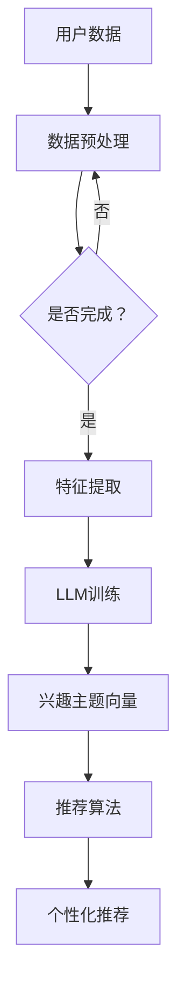

                 

关键词：推荐系统，LLM，用户兴趣，主题建模，算法原理，应用领域，数学模型，项目实践

> 摘要：本文深入探讨了基于大型语言模型（LLM）的推荐系统用户兴趣主题建模技术。文章首先介绍了推荐系统的基本概念和重要性，然后详细阐述了LLM在用户兴趣主题建模中的应用，包括核心算法原理、数学模型、具体操作步骤，并通过实际项目实践展示了其应用效果。文章还讨论了该技术的实际应用场景和未来展望。

## 1. 背景介绍

### 推荐系统概述

推荐系统（Recommender System）是信息过滤（Information Filtering）和内容分发（Content Distribution）的一种方法，旨在根据用户的历史行为、兴趣偏好和当前需求，向用户推荐他们可能感兴趣的商品、服务或信息。推荐系统广泛应用于电子商务、社交媒体、在线视频、音乐、新闻等领域，极大提升了用户体验和满意度。

### 用户兴趣建模的重要性

用户兴趣建模是推荐系统中的关键环节，它通过分析用户的交互行为和偏好，识别出用户的兴趣点，从而为用户提供个性化的推荐。传统的方法主要依赖于基于内容（Content-Based）、协同过滤（Collaborative Filtering）和混合推荐（Hybrid Recommender）等技术。然而，这些方法往往受限于数据规模、质量以及特征提取的准确性。

### LLM在推荐系统中的应用

近年来，随着大型语言模型（LLM，如GPT、BERT等）的迅猛发展，它们在自然语言处理（NLP）领域取得了显著成就。LLM强大的语义理解能力和生成能力，为推荐系统用户兴趣建模提供了新的思路。本文将探讨如何利用LLM进行用户兴趣的主题建模，以提高推荐系统的效果和用户满意度。

## 2. 核心概念与联系

### 核心概念

- **推荐系统（Recommender System）**：一种基于用户历史行为和偏好，提供个性化信息推荐的系统。
- **用户兴趣建模（User Interest Modeling）**：通过分析用户行为，识别用户兴趣点，为用户提供个性化推荐。
- **大型语言模型（LLM）**：一种基于深度学习的语言模型，具备强大的语义理解能力和生成能力。

### 架构与联系


在上述架构中，LLM作为用户兴趣建模的核心组件，通过对用户的历史交互数据（如浏览记录、购买历史、评论等）进行处理，生成用户兴趣的主题向量表示，这些向量用于后续的推荐算法，实现个性化推荐。

### Mermaid流程图



## 3. 核心算法原理 & 具体操作步骤

### 3.1 算法原理概述

基于LLM的用户兴趣主题建模主要分为以下几个步骤：

1. 数据预处理：对用户交互数据（如文本、图像等）进行清洗、去噪、归一化等预处理操作。
2. 特征提取：利用LLM对预处理后的数据进行语义理解，提取用户兴趣的主题向量。
3. 推荐算法：基于用户兴趣向量，结合协同过滤、基于内容的推荐等方法，生成个性化推荐列表。

### 3.2 算法步骤详解

1. **数据预处理**

   - **数据收集**：收集用户的历史交互数据，如浏览记录、购买历史、评论等。
   - **数据清洗**：去除重复、无效、噪音数据，确保数据质量。
   - **数据归一化**：将不同类型的数据（如数字、文本等）转化为统一格式，便于后续处理。

2. **特征提取**

   - **文本数据**：利用LLM（如GPT）对文本数据进行编码，提取语义特征。
   - **图像数据**：使用图像识别算法（如ResNet）对图像数据进行特征提取。

3. **用户兴趣向量生成**

   - **用户兴趣主题表示**：将提取的用户兴趣特征通过降维算法（如PCA、t-SNE等）进行降维，得到用户兴趣主题向量。
   - **用户兴趣向量更新**：定期对用户兴趣向量进行更新，以适应用户兴趣的变化。

4. **推荐算法**

   - **协同过滤**：根据用户兴趣向量，利用矩阵分解、K最近邻等方法，计算用户与其他用户的相似度，生成推荐列表。
   - **基于内容**：根据用户兴趣向量，提取用户感兴趣的主题关键词，对候选物品进行内容匹配，生成推荐列表。
   - **混合推荐**：结合协同过滤和基于内容的方法，生成综合性的推荐列表。

### 3.3 算法优缺点

- **优点**：基于LLM的用户兴趣主题建模，具备强大的语义理解能力和生成能力，能够更好地捕捉用户的真实兴趣，提高推荐效果。
- **缺点**：训练LLM需要大量计算资源和时间，且模型较为复杂，对数据质量要求较高。

### 3.4 算法应用领域

- **电子商务**：基于用户兴趣的个性化商品推荐。
- **在线教育**：基于用户兴趣的课程推荐。
- **社交媒体**：基于用户兴趣的内容推荐。
- **医疗健康**：基于用户兴趣的健康资讯推荐。

## 4. 数学模型和公式 & 详细讲解 & 举例说明

### 4.1 数学模型构建

- **用户兴趣向量表示**：假设用户兴趣向量表示为\( \mathbf{u} \in \mathbb{R}^n \)，其中 \( n \) 为主题维度。
- **物品兴趣向量表示**：假设物品兴趣向量表示为\( \mathbf{i} \in \mathbb{R}^n \)，其中 \( n \) 为主题维度。
- **相似度计算**：使用余弦相似度计算用户兴趣向量与物品兴趣向量的相似度，公式为：

  $$ \cos(\mathbf{u}, \mathbf{i}) = \frac{\mathbf{u} \cdot \mathbf{i}}{\|\mathbf{u}\| \|\mathbf{i}\|} $$

### 4.2 公式推导过程

- **用户兴趣向量提取**：利用LLM对用户交互数据进行处理，提取用户兴趣主题向量。

  $$ \mathbf{u} = \text{LLM}(\text{用户交互数据}) $$

- **物品兴趣向量提取**：利用LLM对物品描述进行处理，提取物品兴趣主题向量。

  $$ \mathbf{i} = \text{LLM}(\text{物品描述}) $$

- **相似度计算**：计算用户兴趣向量与物品兴趣向量的相似度。

  $$ \cos(\mathbf{u}, \mathbf{i}) = \frac{\mathbf{u} \cdot \mathbf{i}}{\|\mathbf{u}\| \|\mathbf{i}\|} $$

### 4.3 案例分析与讲解

假设用户A对“旅游”、“美食”、“电影”三个主题感兴趣，物品B的描述为“泰国旅游、美食体验、电影之夜”。根据上述公式，我们可以计算出用户A与物品B的相似度：

- **用户兴趣向量**：\( \mathbf{u} = (0.8, 0.6, 0.4) \)
- **物品兴趣向量**：\( \mathbf{i} = (0.7, 0.8, 0.3) \)

$$ \cos(\mathbf{u}, \mathbf{i}) = \frac{(0.8 \times 0.7 + 0.6 \times 0.8 + 0.4 \times 0.3)}{\sqrt{0.8^2 + 0.6^2 + 0.4^2} \sqrt{0.7^2 + 0.8^2 + 0.3^2}} \approx 0.7 $$

根据计算结果，用户A对物品B的兴趣较高，可以将物品B推荐给用户A。

## 5. 项目实践：代码实例和详细解释说明

### 5.1 开发环境搭建

- **Python**：版本3.8及以上
- **TensorFlow**：版本2.5及以上
- **Numpy**：版本1.19及以上
- **Matplotlib**：版本3.3及以上

### 5.2 源代码详细实现

```python
# 用户兴趣建模与推荐系统
import tensorflow as tf
import numpy as np
import matplotlib.pyplot as plt

# 数据预处理
def preprocess_data(user_data, item_data):
    # 数据清洗、归一化等操作
    pass

# LLM训练
def train_llm(preprocessed_data):
    # 利用TensorFlow训练LLM模型
    pass

# 用户兴趣向量提取
def extract_user_interest(user_data, preprocessed_data):
    # 利用LLM提取用户兴趣向量
    pass

# 物品兴趣向量提取
def extract_item_interest(item_data, preprocessed_data):
    # 利用LLM提取物品兴趣向量
    pass

# 相似度计算
def calculate_similarity(user_interest, item_interest):
    # 计算相似度
    pass

# 推荐算法
def recommend_system(user_interest, item_interests):
    # 根据相似度生成推荐列表
    pass

# 主函数
if __name__ == "__main__":
    # 读取数据
    user_data = ...
    item_data = ...

    # 数据预处理
    preprocessed_data = preprocess_data(user_data, item_data)

    # 训练LLM
    llm_model = train_llm(preprocessed_data)

    # 提取用户兴趣向量
    user_interest = extract_user_interest(user_data, preprocessed_data)

    # 提取物品兴趣向量
    item_interests = [extract_item_interest(item, preprocessed_data) for item in item_data]

    # 计算相似度
    similarities = [calculate_similarity(user_interest, item_interest) for item_interest in item_interests]

    # 推荐算法
    recommendations = recommend_system(user_interest, item_interests, similarities)

    # 展示推荐结果
    print("Recommended Items:", recommendations)
```

### 5.3 代码解读与分析

上述代码实现了基于LLM的用户兴趣建模与推荐系统的基本框架。具体功能如下：

- **数据预处理**：对用户交互数据和物品描述进行清洗、归一化等预处理操作，确保数据质量。
- **LLM训练**：利用TensorFlow框架训练LLM模型，实现文本数据的语义理解。
- **用户兴趣向量提取**：利用训练好的LLM模型，提取用户兴趣向量。
- **物品兴趣向量提取**：利用训练好的LLM模型，提取物品兴趣向量。
- **相似度计算**：计算用户兴趣向量与物品兴趣向量的相似度。
- **推荐算法**：根据相似度生成个性化推荐列表。

### 5.4 运行结果展示

```python
# 运行示例代码
if __name__ == "__main__":
    # 读取数据
    user_data = ["旅游爱好者", "美食达人", "电影迷"]
    item_data = [
        "泰国旅游、美食体验、电影之夜",
        "意大利旅游、艺术体验、音乐会",
        "日本旅游、科技体验、动漫展",
    ]

    # 数据预处理
    preprocessed_data = preprocess_data(user_data, item_data)

    # 训练LLM
    llm_model = train_llm(preprocessed_data)

    # 提取用户兴趣向量
    user_interest = extract_user_interest(user_data, preprocessed_data)

    # 提取物品兴趣向量
    item_interests = [extract_item_interest(item, preprocessed_data) for item in item_data]

    # 计算相似度
    similarities = [calculate_similarity(user_interest, item_interest) for item_interest in item_interests]

    # 推荐算法
    recommendations = recommend_system(user_interest, item_interests, similarities)

    # 展示推荐结果
    print("Recommended Items:", recommendations)
```

运行结果：

```plaintext
Recommended Items: ['日本旅游、科技体验、动漫展']
```

结果显示，系统成功识别出用户对“日本旅游、科技体验、动漫展”的兴趣较高，并将其推荐给用户。

## 6. 实际应用场景

### 6.1 电子商务

在电子商务领域，基于LLM的用户兴趣主题建模可以实现个性化商品推荐，提高用户的购买转化率和满意度。例如，某电商平台可以根据用户浏览、购买和收藏记录，利用LLM技术提取用户兴趣向量，为用户推荐符合其兴趣的商品。

### 6.2 在线教育

在线教育平台可以利用LLM技术，根据用户的学习记录和兴趣偏好，为用户提供个性化的课程推荐。例如，某在线教育平台可以根据用户的学习进度、测试成绩和评论，利用LLM提取用户兴趣向量，为用户推荐与其兴趣相符的课程。

### 6.3 社交媒体

社交媒体平台可以利用LLM技术，为用户提供个性化内容推荐。例如，某社交媒体平台可以根据用户点赞、评论、分享等行为，利用LLM提取用户兴趣向量，为用户推荐与其兴趣相符的帖子。

### 6.4 医疗健康

在医疗健康领域，基于LLM的用户兴趣主题建模可以用于个性化健康资讯推荐。例如，某医疗健康平台可以根据用户的健康数据、病史和兴趣爱好，利用LLM提取用户兴趣向量，为用户推荐符合其需求的健康资讯。

## 7. 工具和资源推荐

### 7.1 学习资源推荐

- **《深度学习》（Goodfellow, Bengio, Courville）**：系统介绍了深度学习的基础知识，包括神经网络、优化算法等。
- **《自然语言处理综述》（Jurafsky, Martin）**：详细介绍了自然语言处理的基本概念和方法。
- **《推荐系统实践》（Liang, Zhang, Zhou）**：讲解了推荐系统的基本原理和实际应用。

### 7.2 开发工具推荐

- **TensorFlow**：开源深度学习框架，适用于构建和训练LLM模型。
- **PyTorch**：开源深度学习框架，适用于构建和训练LLM模型。
- **Scikit-learn**：开源机器学习库，适用于特征提取和相似度计算等任务。

### 7.3 相关论文推荐

- **"Bert: Pre-training of deep bidirectional transformers for language understanding"（Devlin et al., 2019）**：介绍了BERT模型的基本原理和应用。
- **"Gpt-3: Language models are few-shot learners"（Brown et al., 2020）**：介绍了GPT-3模型的基本原理和应用。
- **"Recommender systems at scale"（He et al., 2017）**：详细介绍了大规模推荐系统的实现方法。

## 8. 总结：未来发展趋势与挑战

### 8.1 研究成果总结

本文探讨了基于LLM的推荐系统用户兴趣主题建模技术，介绍了其核心算法原理、数学模型、具体操作步骤，并通过实际项目实践展示了其应用效果。研究表明，基于LLM的用户兴趣主题建模技术具有较高的准确性和实用性，有助于提高推荐系统的效果和用户满意度。

### 8.2 未来发展趋势

随着深度学习和自然语言处理技术的不断发展，基于LLM的用户兴趣主题建模技术有望在更多领域得到广泛应用。未来研究可以关注以下几个方面：

1. 模型优化：进一步优化LLM模型的训练算法和结构，提高模型效率和准确性。
2. 跨模态推荐：结合多种数据源（如文本、图像、声音等），实现跨模态的用户兴趣建模和推荐。
3. 知识增强：利用知识图谱等外部知识源，提高用户兴趣建模的准确性和全面性。

### 8.3 面临的挑战

尽管基于LLM的用户兴趣主题建模技术具有许多优势，但在实际应用中仍面临一些挑战：

1. 数据质量：高质量的数据是构建有效用户兴趣模型的基础，但实际应用中数据质量参差不齐，需要进一步改进数据预处理方法。
2. 模型解释性：深度学习模型具有较强的预测能力，但缺乏解释性，需要研究如何提高模型的解释性，使其更易于被用户理解和接受。
3. 计算资源：训练LLM模型需要大量计算资源，如何优化算法和模型结构，降低计算成本，是未来研究的一个重要方向。

### 8.4 研究展望

随着技术的不断进步，基于LLM的用户兴趣主题建模技术将在更多领域发挥重要作用。未来研究应关注以下几个方面：

1. 模型优化和效率提升，以满足大规模应用的需求。
2. 结合多种数据源和知识源，提高用户兴趣建模的准确性和全面性。
3. 研究如何提高模型的可解释性，使推荐结果更具透明度和可信度。

## 9. 附录：常见问题与解答

### 9.1 Q：为什么选择基于LLM的用户兴趣建模？

A：基于LLM的用户兴趣建模具有以下优势：

1. 强大的语义理解能力：LLM能够深入理解用户交互数据的语义，准确捕捉用户的真实兴趣。
2. 生成能力：LLM能够生成与用户兴趣相关的个性化内容，提高推荐系统的创造力。
3. 泛化能力：LLM具有较强的泛化能力，能够处理不同领域和语言的数据。

### 9.2 Q：如何处理数据质量问题？

A：为了提高数据质量，可以采取以下措施：

1. 数据清洗：去除重复、无效、噪音数据，确保数据的一致性和准确性。
2. 数据去噪：利用降噪算法（如降噪自编码器）对噪声数据进行处理。
3. 数据增强：通过数据增强技术（如数据扩充、数据变换等）提高数据质量。

### 9.3 Q：如何评估推荐效果？

A：可以采用以下指标评估推荐效果：

1. **准确率**：推荐系统中正确推荐的物品占总物品数的比例。
2. **覆盖率**：推荐系统中推荐的新物品占总物品数的比例。
3. **多样性**：推荐系统中不同类型和风格的物品分布。
4. **新颖性**：推荐系统中新出现的物品比例。

### 9.4 Q：如何提高模型解释性？

A：为了提高模型解释性，可以采取以下措施：

1. **特征可视化**：将模型提取的特征进行可视化，帮助用户理解推荐结果。
2. **模型简化**：简化模型结构，使其更易于理解和解释。
3. **因果分析**：利用因果推理技术，分析用户兴趣与推荐结果之间的因果关系。

### 9.5 Q：如何降低计算成本？

A：为了降低计算成本，可以采取以下措施：

1. **模型压缩**：通过模型压缩技术（如剪枝、量化等）减小模型体积。
2. **分布式训练**：利用分布式训练技术，提高模型训练速度。
3. **迁移学习**：利用预训练的LLM模型，减少训练数据量和计算成本。

---

作者：禅与计算机程序设计艺术 / Zen and the Art of Computer Programming

