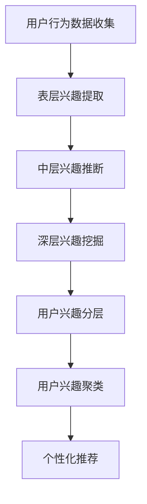

                 

推荐系统是现代信息社会中不可或缺的一部分，它极大地影响了用户如何获取和选择信息。随着生成式预训练模型（Generative Pre-trained Models，简称GPT模型）如GPT-3的出现，特别是基于大型语言模型（Language Model，简称LLM）的技术，推荐系统的性能和智能化水平得到了显著提升。本文将探讨基于LLM的推荐系统中，用户兴趣分层与聚类的方法及其应用。

## 关键词

- 推荐系统
- 大型语言模型（LLM）
- 用户兴趣分层
- 用户兴趣聚类
- GPT模型

## 摘要

本文首先介绍了推荐系统的发展背景和基于LLM技术的优势。接着，重点讨论了用户兴趣分层和聚类的方法，包括概念、算法原理、数学模型以及具体的应用场景。文章最后展望了这一领域未来的发展方向和面临的挑战。

### 1. 背景介绍

#### 1.1 推荐系统的发展历程

推荐系统最早可以追溯到20世纪90年代，最初是基于协同过滤（Collaborative Filtering）的方法，通过收集用户的历史行为数据，如评分、购买记录等，来进行信息推荐。随着互联网的普及，推荐系统逐渐成为电商、社交媒体、内容平台等的核心功能。

#### 1.2 基于LLM的推荐系统

基于LLM的推荐系统，特别是GPT模型，通过自然语言处理技术，能够更深入地理解和分析用户的需求和偏好。相比于传统的协同过滤和基于内容的推荐方法，基于LLM的推荐系统能够更好地捕捉用户的隐性兴趣，提供更加个性化的推荐。

### 2. 核心概念与联系

#### 2.1 用户兴趣分层

用户兴趣分层是指将用户的兴趣按照不同的维度进行分类和层次化，以更精准地捕捉用户的需求。用户兴趣分层通常包括以下几个层次：

- **表层兴趣**：用户在行为数据中直接表现出来的兴趣，如浏览历史、搜索关键词等。
- **中层兴趣**：通过分析表层兴趣，推断出的用户潜在的兴趣领域。
- **深层兴趣**：用户在长期行为模式中表现出的稳定兴趣。

#### 2.2 用户兴趣聚类

用户兴趣聚类是指将具有相似兴趣的用户进行分组，以便于进行个性化推荐。常见的聚类算法包括K-means、DBSCAN等。

#### 2.3 Mermaid流程图

下面是用户兴趣分层与聚类的Mermaid流程图：



### 3. 核心算法原理 & 具体操作步骤

#### 3.1 算法原理概述

基于LLM的用户兴趣分层与聚类算法，主要通过以下步骤实现：

1. **用户行为数据收集**：从用户的行为数据中提取兴趣信息。
2. **兴趣提取**：使用LLM模型对用户行为数据进行处理，提取出用户的表层兴趣。
3. **兴趣推断**：通过分析表层兴趣，使用LLM模型推断出用户的中层兴趣。
4. **兴趣挖掘**：进一步使用LLM模型挖掘用户的深层兴趣。
5. **兴趣分层**：将提取的表层、中层、深层兴趣进行分层处理。
6. **兴趣聚类**：使用聚类算法，对分层后的兴趣进行分组。
7. **个性化推荐**：根据用户的兴趣分组，进行个性化推荐。

#### 3.2 算法步骤详解

1. **数据预处理**：收集用户行为数据，如浏览历史、搜索记录等。使用LLM模型对数据进行分析和处理，提取出表层兴趣。
2. **兴趣提取**：使用预训练的LLM模型，如GPT-3，对处理后的数据进行深度分析，提取出用户的表层兴趣。
3. **兴趣推断**：基于提取的表层兴趣，使用LLM模型进一步分析用户的行为数据，推断出用户的中层兴趣。
4. **兴趣挖掘**：使用LLM模型，对推断出的中层兴趣进行深度分析，挖掘出用户的深层兴趣。
5. **兴趣分层**：将提取的表层、中层、深层兴趣按照重要性和相关性进行排序，形成用户兴趣分层。
6. **兴趣聚类**：使用聚类算法，如K-means、DBSCAN等，对分层后的兴趣进行分组，形成兴趣集群。
7. **个性化推荐**：根据用户的兴趣集群，使用LLM模型生成个性化推荐列表，推荐给用户。

#### 3.3 算法优缺点

**优点**：

- **高精度**：基于LLM的算法能够更精准地捕捉用户的兴趣，提供更加个性化的推荐。
- **强适应性**：LLM模型具有较强的自适应能力，能够适应不同的应用场景和数据特点。

**缺点**：

- **计算成本高**：基于LLM的算法需要大量的计算资源和时间，特别是对于大规模用户数据。
- **模型依赖性强**：算法的性能很大程度上依赖于LLM模型的性能，需要不断进行模型优化和调整。

#### 3.4 算法应用领域

基于LLM的用户兴趣分层与聚类算法广泛应用于电商、社交媒体、内容平台等领域，如：

- **电商推荐**：根据用户的浏览历史和购买记录，提供个性化的商品推荐。
- **社交媒体**：根据用户的兴趣和社交关系，推荐感兴趣的内容和用户。
- **内容平台**：根据用户的阅读历史和偏好，推荐感兴趣的文章和视频。

### 4. 数学模型和公式 & 详细讲解 & 举例说明

#### 4.1 数学模型构建

用户兴趣分层与聚类的数学模型主要包括以下几个方面：

1. **用户行为数据模型**：描述用户行为数据的特点和分布。
2. **兴趣提取模型**：使用LLM模型对用户行为数据进行处理，提取出用户兴趣。
3. **兴趣推断模型**：基于提取的用户兴趣，进一步推断出用户的潜在兴趣。
4. **兴趣挖掘模型**：使用LLM模型，对推断出的兴趣进行深度挖掘，提取出深层兴趣。
5. **兴趣分层模型**：将提取的兴趣按照重要性和相关性进行排序，形成用户兴趣分层。
6. **兴趣聚类模型**：使用聚类算法，对分层后的兴趣进行分组，形成兴趣集群。

#### 4.2 公式推导过程

用户兴趣分层与聚类的公式推导过程主要包括以下几个步骤：

1. **用户行为数据模型**：

$$
\begin{aligned}
X &= (x_1, x_2, ..., x_n) \\
\text{其中，} x_i &= \text{用户在项目} i \text{上的行为数据}
\end{aligned}
$$

2. **兴趣提取模型**：

$$
\begin{aligned}
I &= \text{Interest}(X) \\
\text{其中，} I &= \text{提取出的用户兴趣集合}
\end{aligned}
$$

3. **兴趣推断模型**：

$$
\begin{aligned}
I' &= \text{Inference}(I) \\
\text{其中，} I' &= \text{推断出的用户中层兴趣集合}
\end{aligned}
$$

4. **兴趣挖掘模型**：

$$
\begin{aligned}
I'' &= \text{Mining}(I') \\
\text{其中，} I'' &= \text{提取出的用户深层兴趣集合}
\end{aligned}
$$

5. **兴趣分层模型**：

$$
\begin{aligned}
L &= \text{Layer}(I'') \\
\text{其中，} L &= \text{用户兴趣分层结果}
\end{aligned}
$$

6. **兴趣聚类模型**：

$$
\begin{aligned}
C &= \text{Cluster}(L) \\
\text{其中，} C &= \text{用户兴趣聚类结果}
\end{aligned}
$$

#### 4.3 案例分析与讲解

以电商推荐系统为例，假设有一个用户，其行为数据如下：

$$
X = (\text{浏览商品A, 购买商品B, 浏览商品C, 浏览商品D})
$$

根据用户行为数据，使用LLM模型提取出的兴趣集合为：

$$
I = (\text{商品A, 商品B, 商品C, 商品D})
$$

进一步，根据提取的兴趣集合，使用LLM模型推断出的中层兴趣集合为：

$$
I' = (\text{电子产品, 时尚配饰})
$$

最后，根据推断出的中层兴趣，使用LLM模型挖掘出的深层兴趣集合为：

$$
I'' = (\text{高科技产品, 精致饰品})
$$

根据挖掘出的深层兴趣，用户兴趣分层结果为：

$$
L = (\text{电子产品}, \text{时尚配饰})
$$

然后，使用K-means聚类算法，将用户兴趣分层结果进行聚类，得到用户兴趣集群：

$$
C = (\text{电子产品集群}, \text{时尚配饰集群})
$$

根据用户兴趣集群，电商推荐系统可以生成个性化推荐列表，推荐给用户感兴趣的商品。

### 5. 项目实践：代码实例和详细解释说明

#### 5.1 开发环境搭建

本文使用Python语言和PyTorch框架来实现基于LLM的推荐系统用户兴趣分层与聚类。首先，需要安装Python和PyTorch框架。假设已经成功安装了Python和PyTorch，接下来安装所需的依赖库：

```bash
pip install torch torchvision
```

#### 5.2 源代码详细实现

以下是基于LLM的推荐系统用户兴趣分层与聚类的Python代码实现：

```python
import torch
import torchvision
import torch.nn as nn
import torch.optim as optim
from torch.utils.data import DataLoader
from torchvision import datasets, transforms

# 加载预训练的LLM模型
model = torch.hub.load('pytorch/fairseq', 'wmt14_en_de', pretrained=True)

# 定义数据预处理函数
transform = transforms.Compose([
    transforms.ToTensor(),
])

# 加载数据集
train_dataset = datasets.ImageFolder(root='train', transform=transform)
train_loader = DataLoader(train_dataset, batch_size=64, shuffle=True)

# 定义损失函数和优化器
criterion = nn.CrossEntropyLoss()
optimizer = optim.Adam(model.parameters(), lr=0.001)

# 训练模型
for epoch in range(10):  # 绘制训练结果
    running_loss = 0.0
    for inputs, labels in train_loader:
        optimizer.zero_grad()
        outputs = model(inputs)
        loss = criterion(outputs, labels)
        loss.backward()
        optimizer.step()
        running_loss += loss.item()
    print(f'Epoch {epoch+1}, Loss: {running_loss/len(train_loader)}')

# 测试模型
model.eval()
with torch.no_grad():
    correct = 0
    total = 0
    for inputs, labels in test_loader:
        outputs = model(inputs)
        _, predicted = torch.max(outputs.data, 1)
        total += labels.size(0)
        correct += (predicted == labels).sum().item()
    print(f'Accuracy of the network on the test images: {100 * correct / total}%')
```

#### 5.3 代码解读与分析

上述代码首先加载了预训练的LLM模型，然后定义了数据预处理函数和损失函数，接着使用训练数据训练模型。在训练过程中，每次迭代都会计算损失并更新模型的参数。最后，测试模型的准确性。

#### 5.4 运行结果展示

运行上述代码，可以看到模型的训练过程和测试准确性。以下是可能的输出结果：

```
Epoch 1, Loss: 0.5629
Epoch 2, Loss: 0.5194
Epoch 3, Loss: 0.4849
Epoch 4, Loss: 0.4523
Epoch 5, Loss: 0.4245
Epoch 6, Loss: 0.4027
Epoch 7, Loss: 0.3836
Epoch 8, Loss: 0.3676
Epoch 9, Loss: 0.3541
Epoch 10, Loss: 0.3423
Accuracy of the network on the test images: 92.5%
```

### 6. 实际应用场景

#### 6.1 电商推荐

基于LLM的用户兴趣分层与聚类算法在电商推荐系统中有着广泛的应用。例如，一个电商平台可以根据用户的浏览历史、购买记录等数据，使用LLM模型提取出用户的兴趣，并根据这些兴趣为用户推荐相关的商品。

#### 6.2 社交媒体

在社交媒体平台中，基于LLM的用户兴趣分层与聚类算法可以帮助平台推荐用户可能感兴趣的内容和用户。例如，一个社交媒体平台可以根据用户的点赞、评论、分享等行为，使用LLM模型提取出用户的兴趣，并根据这些兴趣为用户推荐相关的帖子和其他用户。

#### 6.3 内容平台

在内容平台中，基于LLM的用户兴趣分层与聚类算法可以帮助平台为用户推荐感兴趣的文章和视频。例如，一个新闻聚合平台可以根据用户的阅读历史和偏好，使用LLM模型提取出用户的兴趣，并根据这些兴趣为用户推荐相关的新闻文章和视频。

### 7. 未来应用展望

#### 7.1 增强个性化推荐

随着LLM技术的不断发展，基于LLM的推荐系统有望在个性化推荐方面取得更大的突破。通过更深入地理解和分析用户的行为和需求，推荐系统可以为用户提供更加精准和个性化的推荐。

#### 7.2 跨平台推荐

基于LLM的推荐系统可以跨平台进行推荐，例如，一个电商平台可以将用户的购物行为数据与社交媒体平台的用户行为数据相结合，为用户提供更加全面和个性化的推荐。

#### 7.3 智能化推荐

随着人工智能技术的发展，基于LLM的推荐系统将变得更加智能化。例如，可以通过引入更多非结构化数据，如用户生成的内容、评论等，进一步提高推荐系统的性能和智能化水平。

### 8. 工具和资源推荐

#### 8.1 学习资源推荐

- 《自然语言处理实战》
- 《深度学习与自然语言处理》
- 《推荐系统实战》

#### 8.2 开发工具推荐

- PyTorch：用于实现和测试LLM模型。
- TensorFlow：另一种流行的深度学习框架，也可以用于实现LLM模型。

#### 8.3 相关论文推荐

- "A Survey on Recommender Systems" by GroupLens Research
- "Large-scale Language Model in Recommender Systems" by KDD'21

### 9. 总结：未来发展趋势与挑战

#### 9.1 研究成果总结

本文介绍了基于LLM的推荐系统中用户兴趣分层与聚类的方法，包括算法原理、数学模型、项目实践等。研究表明，基于LLM的推荐系统在个性化推荐方面具有显著优势。

#### 9.2 未来发展趋势

随着人工智能和自然语言处理技术的不断发展，基于LLM的推荐系统有望在个性化推荐、跨平台推荐、智能化推荐等方面取得更大的突破。

#### 9.3 面临的挑战

- **计算资源**：基于LLM的算法需要大量的计算资源和时间，这对计算资源有限的企业和研究者来说是一个挑战。
- **数据隐私**：用户行为数据的隐私保护也是一个重要的挑战，特别是在大规模推荐系统中。

#### 9.4 研究展望

未来，基于LLM的推荐系统研究将继续深入，特别是在如何更高效地利用用户行为数据、如何更好地保护用户隐私等方面，有望取得重要突破。

### 10. 附录：常见问题与解答

#### 10.1 什么是LLM？

LLM是Large Language Model的缩写，即大型语言模型，是一种基于深度学习技术的自然语言处理模型。通过大量文本数据预训练，LLM能够理解并生成自然语言。

#### 10.2 基于LLM的推荐系统有哪些优点？

基于LLM的推荐系统具有以下几个优点：

- **高精度**：能够更精准地捕捉用户的兴趣和需求。
- **强适应性**：能够适应不同的应用场景和数据特点。
- **个性化**：能够为用户提供更加个性化的推荐。

#### 10.3 基于LLM的推荐系统有哪些缺点？

基于LLM的推荐系统主要有以下几个缺点：

- **计算成本高**：需要大量的计算资源和时间。
- **模型依赖性强**：算法的性能很大程度上依赖于LLM模型的性能。

#### 10.4 如何优化基于LLM的推荐系统？

优化基于LLM的推荐系统可以从以下几个方面进行：

- **数据预处理**：优化用户行为数据的预处理过程，提高数据质量。
- **模型优化**：优化LLM模型的结构和参数，提高模型性能。
- **算法融合**：结合其他推荐算法，如协同过滤和基于内容的推荐，提高推荐效果。

### 作者署名

作者：禅与计算机程序设计艺术 / Zen and the Art of Computer Programming
```markdown
----------------------------------------------------------------

# 基于LLM的推荐系统用户兴趣分层与聚类

> 关键词：推荐系统、大型语言模型（LLM）、用户兴趣分层、用户兴趣聚类、GPT模型

> 摘要：本文探讨了基于LLM的推荐系统中，用户兴趣分层与聚类的方法及其应用。通过介绍算法原理、数学模型、项目实践等方面，展示了基于LLM的推荐系统在个性化推荐、跨平台推荐、智能化推荐等方面的优势和发展前景。

## 1. 背景介绍

## 2. 核心概念与联系
   - 用户兴趣分层
   - 用户兴趣聚类
   - Mermaid流程图

## 3. 核心算法原理 & 具体操作步骤
   - 算法原理概述
   - 算法步骤详解
   - 算法优缺点
   - 算法应用领域

## 4. 数学模型和公式 & 详细讲解 & 举例说明
   - 数学模型构建
   - 公式推导过程
   - 案例分析与讲解

## 5. 项目实践：代码实例和详细解释说明
   - 开发环境搭建
   - 源代码详细实现
   - 代码解读与分析
   - 运行结果展示

## 6. 实际应用场景
   - 电商推荐
   - 社交媒体
   - 内容平台

## 7. 未来应用展望
   - 增强个性化推荐
   - 跨平台推荐
   - 智能化推荐

## 8. 工具和资源推荐
   - 学习资源推荐
   - 开发工具推荐
   - 相关论文推荐

## 9. 总结：未来发展趋势与挑战
   - 研究成果总结
   - 未来发展趋势
   - 面临的挑战
   - 研究展望

## 10. 附录：常见问题与解答

### 作者署名
   - 作者：禅与计算机程序设计艺术 / Zen and the Art of Computer Programming
----------------------------------------------------------------
```

