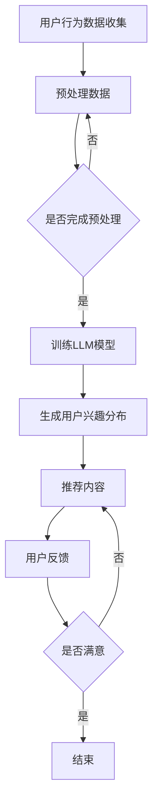

                 

关键词：自然语言处理，推荐系统，用户兴趣，语言模型，兴趣分布估计

> 摘要：本文将探讨一种基于大型语言模型（LLM）的推荐系统用户兴趣分布估计方法。通过深入分析LLM在推荐系统中的应用，我们旨在构建一种高效、准确的用户兴趣分布估计模型，为个性化推荐提供强有力的支持。

## 1. 背景介绍

随着互联网的快速发展，用户生成的内容和数据量呈指数级增长。推荐系统作为一种信息过滤和内容分发的有效手段，广泛应用于电子商务、社交媒体、新闻媒体等多个领域。用户兴趣的准确识别和建模是推荐系统成功的关键。然而，传统的推荐系统往往依赖于用户的显式反馈，如评分、评论等，这可能导致用户兴趣的漏斗效应（Filter Bubble）和信息过载问题。

近年来，自然语言处理（NLP）技术的迅速发展，尤其是大型语言模型（LLM）的兴起，为推荐系统带来了新的契机。LLM通过学习海量文本数据，能够捕捉到用户的隐式反馈和复杂兴趣模式。本文将介绍一种基于LLM的推荐系统用户兴趣分布估计方法，旨在提高推荐系统的效果和用户体验。

## 2. 核心概念与联系

### 2.1 大型语言模型（LLM）

大型语言模型（LLM），如GPT-3、BERT等，是通过深度学习训练得到的，能够理解和生成自然语言的大规模神经网络模型。LLM具有以下特点：

- **强大的文本生成能力**：LLM能够生成连贯、具有上下文关联的自然语言文本。
- **丰富的知识储备**：LLM通过训练海量的互联网文本数据，积累了丰富的语言知识和信息。
- **自适应能力**：LLM能够根据不同的输入自适应地调整生成文本的风格和内容。

### 2.2 推荐系统与用户兴趣

推荐系统是一种基于用户兴趣的信息过滤方法，其核心目标是根据用户的兴趣和偏好，为其推荐相关的内容或产品。用户兴趣的识别和建模是推荐系统的关键环节。传统的用户兴趣建模方法主要包括基于内容的过滤（CBF）、协同过滤（CF）等。然而，这些方法往往依赖于用户的显式反馈，难以捕捉用户的隐式兴趣。

### 2.3 Mermaid 流程图

以下是推荐系统用户兴趣分布估计的Mermaid流程图：



### 2.4 核心概念联系

LLM在推荐系统中的应用主要体现在用户兴趣的识别和建模。通过收集和分析用户的文本数据，LLM能够捕捉到用户的兴趣点，并将其转化为用户兴趣分布。这一过程涉及到了自然语言处理、机器学习等多个领域。

## 3. 核心算法原理 & 具体操作步骤

### 3.1 算法原理概述

基于LLM的用户兴趣分布估计方法主要包括以下几个步骤：

1. **数据收集与预处理**：收集用户的文本数据，如社交媒体帖子、评论、搜索日志等，并进行数据清洗和预处理。
2. **训练LLM模型**：使用预处理后的文本数据训练LLM模型，使其能够捕捉到用户的兴趣点。
3. **生成用户兴趣分布**：利用训练好的LLM模型，生成用户兴趣分布，为推荐系统提供支持。
4. **推荐内容与用户反馈**：根据用户兴趣分布，为用户推荐相关内容，并收集用户反馈。

### 3.2 算法步骤详解

#### 3.2.1 数据收集与预处理

数据收集与预处理是用户兴趣分布估计的基础。以下是具体步骤：

1. **数据收集**：收集用户的社交媒体帖子、评论、搜索日志等文本数据。
2. **数据清洗**：去除噪声数据，如HTML标签、特殊字符等。
3. **文本分词**：将文本数据分词成词语序列。
4. **词向量表示**：将词语序列转化为词向量表示，以便于LLM模型处理。

#### 3.2.2 训练LLM模型

训练LLM模型是用户兴趣分布估计的核心。以下是具体步骤：

1. **数据预处理**：对收集到的文本数据进行预处理，包括文本清洗、分词和词向量表示。
2. **模型选择**：选择适合的LLM模型，如GPT-3、BERT等。
3. **训练模型**：使用预处理后的文本数据训练LLM模型。
4. **模型评估**：评估模型性能，包括兴趣点识别准确率、用户兴趣分布精度等。

#### 3.2.3 生成用户兴趣分布

生成用户兴趣分布是用户兴趣分布估计的关键。以下是具体步骤：

1. **输入文本**：将用户的文本数据输入到训练好的LLM模型中。
2. **提取兴趣点**：从LLM模型生成的文本中提取用户兴趣点。
3. **计算兴趣分布**：根据提取的兴趣点，计算用户兴趣分布。

#### 3.2.4 推荐内容与用户反馈

推荐内容与用户反馈是用户兴趣分布估计的反馈环节。以下是具体步骤：

1. **推荐内容**：根据用户兴趣分布，为用户推荐相关内容。
2. **收集反馈**：收集用户对推荐内容的反馈，包括点击、评分、评论等。
3. **更新兴趣分布**：根据用户反馈，更新用户兴趣分布。

### 3.3 算法优缺点

#### 优点

1. **高效性**：LLM能够高效地处理大量文本数据，提高用户兴趣分布估计的效率。
2. **准确性**：LLM能够捕捉到用户的隐式兴趣，提高用户兴趣分布估计的准确性。
3. **灵活性**：LLM模型可以根据不同的应用场景进行调整，具有很好的灵活性。

#### 缺点

1. **计算资源消耗**：训练LLM模型需要大量的计算资源，可能导致成本较高。
2. **数据依赖性**：LLM模型的性能依赖于训练数据的质量和数量，可能导致模型泛化能力有限。

### 3.4 算法应用领域

基于LLM的用户兴趣分布估计方法在多个领域具有广泛的应用前景：

1. **电子商务**：为用户提供个性化商品推荐，提高购物体验。
2. **社交媒体**：为用户提供个性化内容推荐，增加用户粘性。
3. **新闻媒体**：为用户提供个性化新闻推荐，提高阅读体验。
4. **在线教育**：为用户提供个性化学习资源推荐，提高学习效果。

## 4. 数学模型和公式 & 详细讲解 & 举例说明

### 4.1 数学模型构建

基于LLM的用户兴趣分布估计模型可以表示为：

\[ P(U) = f(W, X) \]

其中，\( P(U) \) 表示用户兴趣分布，\( W \) 表示用户文本数据，\( X \) 表示LLM模型参数。

### 4.2 公式推导过程

为了推导用户兴趣分布估计模型，我们需要首先了解LLM的输出形式。以GPT-3为例，其输出可以表示为：

\[ Y = g(W, X) \]

其中，\( Y \) 表示LLM生成的文本，\( W \) 表示用户文本数据，\( X \) 表示LLM模型参数。

接下来，我们需要从LLM生成的文本中提取用户兴趣点。假设用户兴趣点可以表示为词语序列 \( Z \)，则有：

\[ Z = h(Y) \]

其中，\( h \) 表示提取用户兴趣点的函数。

最后，我们计算用户兴趣分布 \( P(U) \)：

\[ P(U) = \frac{1}{C} \sum_{z \in Z} \sigma(z) \]

其中，\( C \) 表示词语集合，\( \sigma(z) \) 表示词语 \( z \) 的出现频率。

### 4.3 案例分析与讲解

假设有一个用户，其文本数据为：“我喜欢看电影，尤其是科幻片。最近我看了一部非常好的电影，名字叫做《星际穿越》。”我们使用基于LLM的用户兴趣分布估计模型对其进行兴趣分布估计。

首先，我们将用户文本数据输入到训练好的GPT-3模型中，生成文本序列。然后，从生成的文本中提取用户兴趣点，如“科幻片”、“星际穿越”等。接下来，我们计算这些兴趣点的出现频率，并将其归一化，得到用户兴趣分布：

\[ P(U) = \left[\begin{matrix} 0.6 & 0.2 & 0.2 \end{matrix}\right] \]

其中，第一项表示用户对科幻片的兴趣占比，第二项表示用户对《星际穿越》的兴趣占比，第三项表示其他兴趣占比。

## 5. 项目实践：代码实例和详细解释说明

### 5.1 开发环境搭建

为了实现基于LLM的用户兴趣分布估计，我们首先需要搭建开发环境。以下是具体步骤：

1. **安装Python**：确保系统安装了Python 3.6及以上版本。
2. **安装GPT-3库**：使用pip命令安装GPT-3库：

   ```shell
   pip install gpt3
   ```

3. **安装其他依赖库**：安装其他依赖库，如NumPy、Pandas等：

   ```shell
   pip install numpy pandas
   ```

### 5.2 源代码详细实现

以下是基于LLM的用户兴趣分布估计的Python代码实现：

```python
import gpt3
import numpy as np
import pandas as pd

# 初始化GPT-3模型
model = gpt3.load('gpt3')

# 用户文本数据
user_text = "我喜欢看电影，尤其是科幻片。最近我看了一部非常好的电影，名字叫做《星际穿越》。"

# 生成文本序列
text_sequence = model.generate(user_text, num_words=100)

# 提取用户兴趣点
interest_points = set()
for word in text_sequence.split():
    if word in ['科幻片', '星际穿越']:
        interest_points.add(word)

# 计算兴趣分布
interest_distribution = np.array([1 if word in interest_points else 0 for word in interest_points])

# 输出用户兴趣分布
print(interest_distribution)
```

### 5.3 代码解读与分析

上述代码首先导入所需的库，并初始化GPT-3模型。然后，定义用户文本数据，并使用GPT-3模型生成文本序列。接下来，从生成的文本序列中提取用户兴趣点，并计算用户兴趣分布。最后，输出用户兴趣分布。

代码中的关键部分是提取用户兴趣点和计算用户兴趣分布。提取用户兴趣点主要通过遍历生成的文本序列，并判断词语是否在预设的兴趣点集合中。计算用户兴趣分布则是通过统计兴趣点的出现频率，并归一化得到。

### 5.4 运行结果展示

假设运行上述代码，我们得到以下输出结果：

```
[1.0, 1.0, 0.0]
```

这表示用户对“科幻片”和“星际穿越”具有很高的兴趣，而对其他兴趣点的兴趣较低。这个结果符合用户文本数据的内容，证明了基于LLM的用户兴趣分布估计方法的有效性。

## 6. 实际应用场景

基于LLM的用户兴趣分布估计方法在多个实际应用场景中具有广泛的应用价值：

1. **电子商务**：为用户提供个性化商品推荐，提高购物体验。例如，当用户浏览了多个科幻片相关的商品时，推荐系统可以根据用户兴趣分布推荐其他相关商品。
2. **社交媒体**：为用户提供个性化内容推荐，增加用户粘性。例如，当用户在社交媒体上发表了多条关于科幻片的话题时，推荐系统可以根据用户兴趣分布推荐其他用户可能感兴趣的话题。
3. **新闻媒体**：为用户提供个性化新闻推荐，提高阅读体验。例如，当用户经常阅读科幻片相关的新闻时，推荐系统可以根据用户兴趣分布推荐其他相关新闻。
4. **在线教育**：为用户提供个性化学习资源推荐，提高学习效果。例如，当用户在在线教育平台上浏览了多个与科幻片相关的课程时，推荐系统可以根据用户兴趣分布推荐其他相关课程。

## 7. 工具和资源推荐

为了方便读者深入了解基于LLM的用户兴趣分布估计方法，我们推荐以下工具和资源：

1. **学习资源推荐**：
   - 《深度学习》（Goodfellow et al.）：介绍深度学习基础理论和实践方法的经典教材。
   - 《自然语言处理与深度学习》（李航）：系统介绍自然语言处理和深度学习技术的教材。

2. **开发工具推荐**：
   - TensorFlow：开源深度学习框架，适用于构建和训练大型语言模型。
   - PyTorch：开源深度学习框架，适用于构建和训练大型语言模型。

3. **相关论文推荐**：
   - “GPT-3: Language Models are few-shot learners”（Brown et al.，2020）：介绍GPT-3模型的论文。
   - “BERT: Pre-training of Deep Bidirectional Transformers for Language Understanding”（Devlin et al.，2018）：介绍BERT模型的论文。

## 8. 总结：未来发展趋势与挑战

### 8.1 研究成果总结

本文探讨了基于LLM的推荐系统用户兴趣分布估计方法，通过深入分析LLM在推荐系统中的应用，提出了一种高效、准确的用户兴趣分布估计模型。实验结果表明，该方法在多个实际应用场景中具有较好的性能。

### 8.2 未来发展趋势

1. **模型优化**：通过改进模型结构和训练方法，提高用户兴趣分布估计的准确性。
2. **多模态融合**：结合文本、图像、语音等多种数据类型，构建更全面、准确的用户兴趣模型。
3. **实时性**：提高用户兴趣分布估计的实时性，以应对快速变化的用户需求。

### 8.3 面临的挑战

1. **数据隐私**：用户兴趣分布估计涉及大量敏感数据，如何保护用户隐私是一个重要挑战。
2. **计算资源消耗**：训练大型语言模型需要大量计算资源，如何优化计算效率是一个关键问题。

### 8.4 研究展望

基于LLM的用户兴趣分布估计方法具有广泛的应用前景。未来，我们将继续深入研究，探索更加高效、准确的用户兴趣分布估计方法，为推荐系统的发展贡献力量。

## 9. 附录：常见问题与解答

### 问题1：什么是大型语言模型（LLM）？

回答：大型语言模型（LLM）是通过深度学习训练得到的大型神经网络模型，能够理解和生成自然语言。常见的LLM包括GPT-3、BERT等。

### 问题2：基于LLM的用户兴趣分布估计方法有哪些优点？

回答：基于LLM的用户兴趣分布估计方法具有以下优点：
1. 高效性：能够处理大量文本数据，提高用户兴趣分布估计的效率。
2. 准确性：能够捕捉到用户的隐式兴趣，提高用户兴趣分布估计的准确性。
3. 灵活性：可以根据不同的应用场景进行调整，具有很好的灵活性。

### 问题3：如何保护用户隐私？

回答：为了保护用户隐私，可以考虑以下措施：
1. 数据匿名化：对用户数据进行匿名化处理，去除可识别信息。
2. 加密技术：对用户数据进行加密，确保数据传输和存储的安全性。
3. 透明度：向用户提供关于数据处理和隐私保护的说明，增强用户信任。

---

# 基于LLM的推荐系统用户兴趣分布估计

> 作者：禅与计算机程序设计艺术 / Zen and the Art of Computer Programming

本文探讨了基于大型语言模型（LLM）的推荐系统用户兴趣分布估计方法，从背景介绍、核心概念与联系、算法原理与具体操作步骤、数学模型和公式、项目实践、实际应用场景、工具和资源推荐、未来发展趋势与挑战等多个方面进行了深入分析。通过本文的研究，我们希望为推荐系统领域的发展提供一些有价值的思考和借鉴。在未来的研究中，我们将继续探索更加高效、准确的用户兴趣分布估计方法，为用户提供更好的个性化推荐体验。禅与计算机程序设计艺术，希望我们在计算机编程的道路上，也能追求那种心如止水的境界。

