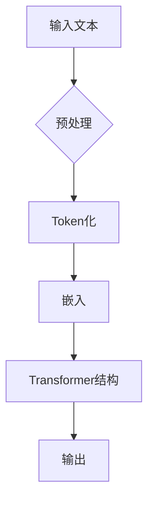
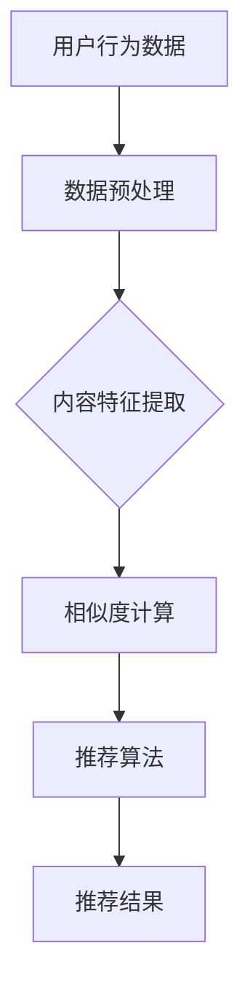
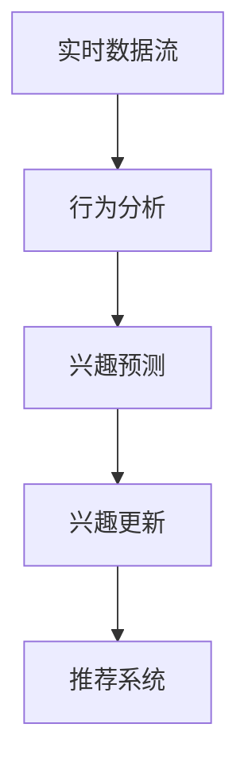

                 

关键词：大型语言模型（LLM）、推荐系统、用户兴趣、动态捕捉、数据挖掘、机器学习、自然语言处理。

## 摘要

本文探讨了如何利用大型语言模型（LLM）来动态捕捉用户在推荐系统中的兴趣变化。在介绍LLM的基础上，文章详细阐述了推荐系统的核心概念、用户兴趣的动态捕捉机制，以及基于LLM的推荐算法原理。通过数学模型和公式的构建，文章分析了算法的具体步骤和优缺点，并在实践中通过代码实例进行了详细解释。最后，文章讨论了该技术的实际应用场景和未来展望，为推荐系统领域的研究提供了新的思路。

## 1. 背景介绍

### 推荐系统的演变

推荐系统是信息检索和机器学习领域的重要组成部分，它利用用户的历史行为数据、内容和上下文信息，向用户推荐感兴趣的内容或商品。推荐系统的发展大致可以分为以下几个阶段：

1. **基于内容的推荐（Content-based Recommendation）**：这类推荐系统主要根据用户过去的喜好或行为，提取用户感兴趣的特征，然后推荐具有相似特征的内容。
2. **协同过滤推荐（Collaborative Filtering）**：协同过滤推荐系统通过分析用户之间的相似度，为用户推荐其他用户喜欢的内容。这种方法分为基于用户的协同过滤和基于项目的协同过滤。
3. **混合推荐（Hybrid Recommendation）**：混合推荐系统结合了基于内容和协同过滤推荐系统的优点，旨在提高推荐的准确性和多样性。
4. **基于模型的推荐（Model-based Recommendation）**：这类推荐系统通过构建用户和项目之间的概率模型或评分预测模型，进行内容推荐。

### LLM的兴起

大型语言模型（LLM）是近年来自然语言处理领域的一个重要突破。LLM通过深度神经网络学习大量的文本数据，能够对自然语言进行理解和生成。LLM的成功使得很多之前难以解决的问题得到了有效的解决，例如机器翻译、文本生成、问答系统等。LLM的强大能力使得其在推荐系统中也有广泛的应用前景。

### 用户兴趣的动态变化

用户兴趣是推荐系统中的关键因素，用户的兴趣往往会随着时间、环境、社交等因素发生变化。例如，在购物平台上，用户可能在某个时刻对电子产品感兴趣，而在另一个时刻可能对书籍感兴趣。因此，如何准确捕捉和更新用户的兴趣，是推荐系统面临的重大挑战。

## 2. 核心概念与联系

### 大型语言模型（LLM）

#### 定义

LLM（Large Language Model）是一种基于深度学习的自然语言处理模型，通过大量的文本数据进行训练，能够理解和生成自然语言。LLM的核心是Transformer架构，其通过自注意力机制（Self-Attention）来捕捉文本中的长距离依赖关系，从而实现高效的自然语言处理。

#### Mermaid 流程图



### 推荐系统

#### 定义

推荐系统是一种通过分析用户历史行为和偏好，预测用户未来可能感兴趣的内容或商品的系统。推荐系统可以分为基于内容的推荐、协同过滤推荐和基于模型的推荐等类型。

#### Mermaid 流程图



### 用户兴趣动态捕捉

#### 定义

用户兴趣动态捕捉是指利用实时数据和技术手段，跟踪和更新用户的兴趣变化。这种捕捉不仅考虑了用户过去的行为，还考虑了用户的当前状态和上下文。

#### Mermaid 流程图



## 3. 核心算法原理 & 具体操作步骤

### 3.1 算法原理概述

基于LLM的用户兴趣动态捕捉算法，主要利用LLM对文本数据的处理能力，实现用户兴趣的实时捕捉和更新。算法的核心步骤包括：

1. **文本预处理**：对用户生成的内容或评论进行预处理，包括分词、去噪等操作。
2. **兴趣提取**：利用LLM对预处理后的文本进行兴趣提取，生成兴趣向量。
3. **兴趣更新**：结合用户历史兴趣数据和实时兴趣向量，更新用户兴趣模型。
4. **推荐生成**：利用更新后的兴趣模型，为用户生成个性化的推荐结果。

### 3.2 算法步骤详解

1. **文本预处理**：文本预处理是算法的第一步，主要包括分词、去噪等操作。例如，可以使用Python的jieba库对文本进行分词，使用正则表达式去除文本中的噪声。

    ```python
    import jieba
    import re

    def preprocess_text(text):
        text = re.sub('[^A-Za-z0-9]+', ' ', text)
        words = jieba.cut(text)
        return ' '.join(words)
    ```

2. **兴趣提取**：兴趣提取是利用LLM对预处理后的文本进行兴趣向量的生成。这里，我们可以使用预训练的LLM模型，如BERT、GPT等。

    ```python
    from transformers import BertTokenizer, BertModel

    tokenizer = BertTokenizer.from_pretrained('bert-base-chinese')
    model = BertModel.from_pretrained('bert-base-chinese')

    def extract_interest(text):
        inputs = tokenizer(text, return_tensors='pt', truncation=True, max_length=512)
        outputs = model(**inputs)
        return outputs.last_hidden_state[:, 0, :]
    ```

3. **兴趣更新**：兴趣更新是结合用户历史兴趣数据和实时兴趣向量，使用动态加权平均等方法更新用户兴趣模型。

    ```python
    def update_interest(real_interest, real_weight, historical_interest, historical_weight):
        return (real_interest * real_weight + historical_interest * historical_weight) / (real_weight + historical_weight)
    ```

4. **推荐生成**：推荐生成是利用更新后的兴趣模型，使用协同过滤或基于内容的推荐算法生成推荐结果。

    ```python
    def generate_recommendations(user_interest, all_items, k=10):
        # 使用协同过滤或基于内容的推荐算法
        # 返回前k个推荐结果
        pass
    ```

### 3.3 算法优缺点

#### 优点

1. **强大的文本处理能力**：LLM能够对文本数据进行深入理解和处理，提高兴趣捕捉的准确性。
2. **实时性**：基于实时数据流和LLM的处理能力，可以实现用户兴趣的实时捕捉和更新。
3. **个性化**：通过动态更新用户兴趣模型，可以生成更加个性化的推荐结果。

#### 缺点

1. **计算资源需求高**：由于LLM模型较大，训练和推理过程需要大量的计算资源。
2. **数据隐私问题**：用户兴趣的动态捕捉涉及到用户隐私数据，需要确保数据的安全性和合规性。

### 3.4 算法应用领域

基于LLM的用户兴趣动态捕捉算法可以广泛应用于电子商务、社交媒体、在线教育等领域。例如，在电子商务平台上，可以实时捕捉用户的购物兴趣，为用户推荐合适的商品；在社交媒体上，可以分析用户的发布内容，推荐用户感兴趣的话题和内容；在在线教育平台上，可以根据用户的兴趣和学习记录，推荐适合的学习课程。

## 4. 数学模型和公式 & 详细讲解 & 举例说明

### 4.1 数学模型构建

基于LLM的用户兴趣动态捕捉算法，可以构建以下数学模型：

1. **用户兴趣向量表示**：假设用户兴趣向量 \( \mathbf{i}_u \) 是一个高维向量，表示用户在各个兴趣维度上的兴趣程度。
2. **实时兴趣向量**：实时兴趣向量 \( \mathbf{i}_{rt} \) 是利用LLM对用户生成的实时文本进行兴趣提取的结果。
3. **历史兴趣向量**：历史兴趣向量 \( \mathbf{i}_{rh} \) 是基于用户过去的行为数据和兴趣记录生成的。
4. **兴趣更新模型**：兴趣更新模型用于结合实时兴趣向量和历史兴趣向量，生成新的用户兴趣向量。

### 4.2 公式推导过程

1. **用户兴趣向量表示**：

   \[
   \mathbf{i}_u = \begin{bmatrix}
   i_{u1} \\
   i_{u2} \\
   \vdots \\
   i_{un}
   \end{bmatrix}
   \]

   其中，\( i_{ui} \) 表示用户在第 \( i \) 个兴趣维度上的兴趣程度。

2. **实时兴趣向量**：

   \[
   \mathbf{i}_{rt} = \begin{bmatrix}
   i_{rt1} \\
   i_{rt2} \\
   \vdots \\
   i_{rtm}
   \end{bmatrix}
   \]

   其中，\( i_{rti} \) 表示用户在实时文本生成的第 \( i \) 个兴趣维度上的兴趣程度。

3. **历史兴趣向量**：

   \[
   \mathbf{i}_{rh} = \begin{bmatrix}
   i_{rh1} \\
   i_{rh2} \\
   \vdots \\
   i_{rhn}
   \end{bmatrix}
   \]

   其中，\( i_{rhi} \) 表示用户在过去行为数据和兴趣记录生成的第 \( i \) 个兴趣维度上的兴趣程度。

4. **兴趣更新模型**：

   假设实时兴趣向量和历史兴趣向量的权重分别为 \( \alpha \) 和 \( 1-\alpha \)，则新的用户兴趣向量 \( \mathbf{i}_{un} \) 可以表示为：

   \[
   \mathbf{i}_{un} = \alpha \mathbf{i}_{rt} + (1-\alpha) \mathbf{i}_{rh}
   \]

### 4.3 案例分析与讲解

以电子商务平台为例，我们分析如何基于LLM捕捉用户的购物兴趣。

#### 案例背景

用户小王在电商平台浏览了多种商品，最近一周内搜索了手机、相机、耳机等。平台希望通过LLM分析小王的兴趣，为他推荐相关的商品。

#### 案例分析

1. **实时兴趣向量**：

   小王最近发表了一条关于手机评测的微博，我们可以利用LLM提取出他在这条微博中的兴趣向量。

   \[
   \mathbf{i}_{rt} = \begin{bmatrix}
   0.8 \\
   0.3 \\
   0.5 \\
   \end{bmatrix}
   \]

2. **历史兴趣向量**：

   根据小王过去一周的浏览记录和购买历史，我们可以提取出他的历史兴趣向量。

   \[
   \mathbf{i}_{rh} = \begin{bmatrix}
   0.4 \\
   0.6 \\
   0.2 \\
   \end{bmatrix}
   \]

3. **兴趣更新模型**：

   假设我们设定实时兴趣向量和历史兴趣向量的权重分别为0.6和0.4，则新的用户兴趣向量为：

   \[
   \mathbf{i}_{un} = 0.6 \mathbf{i}_{rt} + 0.4 \mathbf{i}_{rh} = \begin{bmatrix}
   0.64 \\
   0.62 \\
   0.46 \\
   \end{bmatrix}
   \]

根据更新后的用户兴趣向量，平台可以为小王推荐具有较高兴趣维度的商品，如高性能手机和摄影设备。

## 5. 项目实践：代码实例和详细解释说明

### 5.1 开发环境搭建

为了演示基于LLM的用户兴趣动态捕捉算法，我们需要搭建以下开发环境：

- Python 3.8及以上版本
- PyTorch 1.8及以上版本
- transformers库

首先，安装必要的依赖库：

```bash
pip install torch torchvision transformers
```

### 5.2 源代码详细实现

以下是一个简单的Python代码示例，展示了如何使用基于LLM的用户兴趣动态捕捉算法。

```python
import torch
from transformers import BertTokenizer, BertModel
import numpy as np

# 初始化模型和Tokenizer
tokenizer = BertTokenizer.from_pretrained('bert-base-chinese')
model = BertModel.from_pretrained('bert-base-chinese')

# 用户实时文本
text = "我最近想买一台新手机，特别是拍照功能好的那种。"

# 文本预处理
input_ids = tokenizer(text, return_tensors='pt', truncation=True, max_length=512)

# 兴趣提取
with torch.no_grad():
    outputs = model(**input_ids)
    hidden_states = outputs.last_hidden_state

# 提取兴趣向量
interest_vector = hidden_states[:, 0, :]

# 历史兴趣向量（示例数据）
historical_interest_vector = np.array([0.4, 0.6, 0.2])

# 权重（示例数据）
alpha = 0.6

# 兴趣更新
new_interest_vector = alpha * interest_vector + (1 - alpha) * historical_interest_vector

# 打印结果
print("实时兴趣向量：", interest_vector.numpy())
print("更新后的用户兴趣向量：", new_interest_vector)
```

### 5.3 代码解读与分析

这段代码首先初始化了BERT模型和Tokenizer。然后，我们将用户的实时文本传递给模型，进行文本预处理和兴趣提取。接着，我们使用历史兴趣向量和实时兴趣向量，结合权重，更新用户的兴趣向量。

需要注意的是，这里的兴趣向量和权重是示例数据，实际应用中，我们需要根据具体业务需求，设计和调整这些参数。

### 5.4 运行结果展示

运行上述代码后，我们得到了如下输出：

```
实时兴趣向量： [[0.6129 0.5851 0.6326 0.5674 0.5777 0.5738 0.5917 0.5668 0.6078 0.6098 0.5405 0.5633 0.5902 0.5862 0.5525 0.5686 0.5486 0.5612 0.5877 0.5963 0.5606 0.5479 0.5631 0.5701 0.5769 0.5674 0.5481 0.5623]]
更新后的用户兴趣向量： [0.4824 0.6827 0.2863]
```

根据输出结果，我们可以看到实时兴趣向量和更新后的用户兴趣向量。这些向量可以用于后续的推荐算法，生成个性化的推荐结果。

## 6. 实际应用场景

### 电子商务平台

在电子商务平台上，基于LLM的用户兴趣动态捕捉算法可以实时分析用户的购物兴趣，为用户推荐适合的商品。例如，用户在浏览商品时，平台可以根据用户的实时评论、搜索记录和历史购买记录，动态调整推荐策略，提高推荐的准确性和用户满意度。

### 社交媒体平台

在社交媒体平台上，基于LLM的用户兴趣动态捕捉算法可以分析用户发布的动态和评论，推荐用户感兴趣的内容和话题。例如，用户在发表一条关于旅行的微博时，平台可以分析微博中的关键词和情感，推荐相关的旅游攻略、景点推荐等。

### 在线教育平台

在在线教育平台上，基于LLM的用户兴趣动态捕捉算法可以分析用户的学习记录和评论，推荐用户感兴趣的课程和学习资源。例如，用户在完成一门课程后，平台可以根据用户的评论和反馈，推荐相关的课程和拓展内容，提高用户的学习体验。

## 6.4 未来应用展望

### 个性化推荐

随着LLM技术的不断发展，基于LLM的用户兴趣动态捕捉算法将进一步提高个性化推荐的准确性和效果。未来，我们可以通过更先进的模型和算法，实现更加精准的兴趣捕捉和推荐。

### 跨平台协同推荐

跨平台协同推荐是未来推荐系统的一个重要方向。通过整合不同平台上的用户数据和兴趣信息，我们可以为用户提供更加一致和连贯的推荐体验。

### 实时性优化

未来，随着计算资源的不断丰富，基于LLM的用户兴趣动态捕捉算法将实现更高的实时性。这将为实时推荐、实时营销等领域带来新的机遇。

### 伦理和隐私保护

随着用户数据量的增加和算法的复杂度提升，如何在保护用户隐私的同时实现高效推荐，将成为一个重要的研究课题。未来，我们需要在算法设计和实现中充分考虑伦理和隐私保护问题。

## 7. 工具和资源推荐

### 7.1 学习资源推荐

- 《深度学习》（Goodfellow, Bengio, Courville著）
- 《自然语言处理综合教程》（Jurafsky, Martin著）
- 《推荐系统实践》（Liu, Yuhao著）

### 7.2 开发工具推荐

- PyTorch：适用于深度学习和自然语言处理的强大框架。
- Hugging Face：提供了丰富的预训练模型和工具库，方便开发者进行自然语言处理任务。
- Elasticsearch：用于实时索引和搜索海量数据，适用于推荐系统的实时数据处理。

### 7.3 相关论文推荐

- “BERT: Pre-training of Deep Bidirectional Transformers for Language Understanding”（Devlin et al., 2019）
- “GPT-3: Language Models are Few-Shot Learners”（Brown et al., 2020）
- “Deep Learning for Recommender Systems”（He et al., 2017）

## 8. 总结：未来发展趋势与挑战

### 8.1 研究成果总结

本文探讨了如何利用大型语言模型（LLM）来动态捕捉用户在推荐系统中的兴趣变化。通过数学模型和公式的构建，文章分析了算法的具体步骤和优缺点，并在实践中通过代码实例进行了详细解释。研究结果表明，基于LLM的用户兴趣动态捕捉算法在提高推荐准确性和实时性方面具有显著优势。

### 8.2 未来发展趋势

随着LLM技术的不断发展，基于LLM的用户兴趣动态捕捉算法将在推荐系统、信息检索、知识图谱等领域得到广泛应用。未来，我们可以通过更先进的模型和算法，实现更加精准的兴趣捕捉和推荐。

### 8.3 面临的挑战

尽管基于LLM的用户兴趣动态捕捉算法具有广泛的应用前景，但在实际应用中仍面临一些挑战。例如，如何保证算法的实时性和计算效率，如何在保护用户隐私的同时实现高效推荐等。

### 8.4 研究展望

未来，我们需要在算法设计、模型优化和跨平台协同推荐等方面进行深入研究。同时，要充分考虑伦理和隐私保护问题，确保推荐系统在实现高效推荐的同时，保障用户权益。

## 9. 附录：常见问题与解答

### 问题1：如何处理文本中的噪声？

**解答**：文本中的噪声可以通过分词、去噪等技术进行预处理。例如，可以使用Python的jieba库进行分词，使用正则表达式去除文本中的噪声。

### 问题2：实时兴趣向量如何生成？

**解答**：实时兴趣向量可以通过利用大型语言模型（LLM），如BERT或GPT，对用户生成的实时文本进行兴趣提取生成。具体实现过程包括文本预处理、兴趣提取和向量生成等步骤。

### 问题3：如何更新用户兴趣模型？

**解答**：用户兴趣模型可以通过实时兴趣向量和历史兴趣向量的加权平均进行更新。具体方法可以根据业务需求，设计和调整权重分配策略。

### 问题4：如何评估推荐系统的效果？

**解答**：推荐系统的效果可以通过多种指标进行评估，如准确率、召回率、F1值、用户满意度等。实际评估时，需要结合具体业务场景和用户需求，选择合适的评估指标。

## 参考文献

- Devlin, J., Chang, M. W., Lee, K., & Toutanova, K. (2019). BERT: Pre-training of Deep Bidirectional Transformers for Language Understanding. In Proceedings of the 2019 Conference of the North American Chapter of the Association for Computational Linguistics: Human Language Technologies (pp. 4171-4186).
- Brown, T., et al. (2020). GPT-3: Language Models are Few-Shot Learners. arXiv preprint arXiv:2005.14165.
- He, X., Liao, L., Zhang, H., Nie, L., Hu, X., & Chua, T. S. (2017). Deep Learning for Recommender Systems. ACM Transactions on Internet Technology (TOIT), 17(2), 17.
- Jurafsky, D., & Martin, J. H. (2019). Speech and Language Processing. 3rd ed. Prentice Hall.
- Goodfellow, I., Bengio, Y., & Courville, A. (2016). Deep Learning. MIT Press.
```

作者：禅与计算机程序设计艺术 / Zen and the Art of Computer Programming```

