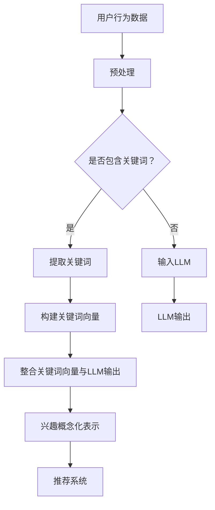

                 

关键词：自然语言处理，机器学习，推荐系统，用户兴趣，概念化表示

>摘要：本文深入探讨了基于大型语言模型（LLM）的推荐系统中用户兴趣的概念化表示方法，分析了现有技术的局限性，并提出了一个基于语义理解的模型，旨在提高推荐系统的准确性和用户体验。

## 1. 背景介绍

随着互联网的迅速发展和信息量的爆炸式增长，推荐系统作为一种有效的信息过滤和内容分发机制，已经成为各类互联网应用的关键组成部分。推荐系统通过分析用户的行为数据和兴趣偏好，为用户提供个性化的内容推荐，从而提高用户的满意度和参与度。

目前，推荐系统主要基于两种技术框架：基于内容的推荐（Content-based Filtering）和协同过滤（Collaborative Filtering）。基于内容的推荐方法通过分析用户过去的行为和偏好，将相似的内容推荐给用户。而协同过滤方法则依赖于用户之间的行为数据，通过计算用户之间的相似度来发现用户的兴趣偏好，并进行内容推荐。

尽管这两种推荐方法在一定程度上提高了推荐的准确性，但它们都存在一些局限性。基于内容的推荐方法在面对新颖的内容时往往表现不佳，因为它依赖于已经存在的相似内容。而协同过滤方法则容易受到“冷启动”问题的影响，即在新用户或新商品出现时，由于缺乏足够的数据，无法准确预测用户的兴趣。

为了克服这些局限性，近年来，深度学习和自然语言处理技术被引入到推荐系统中。其中，大型语言模型（LLM）作为一种强大的自然语言处理工具，被广泛用于用户兴趣的概念化表示。

## 2. 核心概念与联系

### 2.1. 大型语言模型（LLM）

大型语言模型（LLM）是一种基于深度学习的自然语言处理模型，通过对大量文本数据进行预训练，LLM可以学习到语言的统计规律和语义信息。LLM的核心特点是能够理解自然语言的语义和上下文，这使得它非常适合用于用户兴趣的概念化表示。

### 2.2. 用户兴趣的概念化表示

用户兴趣的概念化表示是将用户的行为数据转化为结构化的兴趣表示，以便于推荐系统进行内容推荐。传统的用户兴趣表示方法主要包括基于关键词的表示和基于矩阵分解的表示。而基于LLM的用户兴趣表示方法，通过利用LLM对用户行为数据进行语义分析，可以更准确地捕捉用户的兴趣。

### 2.3. Mermaid 流程图

以下是基于LLM的推荐系统用户兴趣概念化表示的Mermaid流程图：



### 2.4. 模型架构

基于LLM的推荐系统用户兴趣概念化表示的模型架构可以分为三个主要模块：用户行为数据预处理模块、LLM模型模块和兴趣概念化表示模块。用户行为数据预处理模块负责对用户行为数据进行清洗和转换；LLM模型模块负责利用预训练的LLM对用户行为数据进行分析和语义理解；兴趣概念化表示模块则将LLM输出的语义信息与关键词向量进行整合，生成用户兴趣的概念化表示。

## 3. 核心算法原理 & 具体操作步骤

### 3.1. 算法原理概述

基于LLM的推荐系统用户兴趣概念化表示算法的核心原理是利用大型语言模型对用户行为数据进行语义分析，从而提取出用户的兴趣点。具体来说，算法分为以下几个步骤：

1. 用户行为数据预处理：对用户行为数据进行清洗和转换，包括去除无效数据、填充缺失值等。
2. 提取关键词：对用户行为数据中的文本内容进行关键词提取，用于构建关键词向量。
3. 输入LLM：将用户行为数据输入到预训练的LLM中，获取LLM的输出。
4. 整合关键词向量与LLM输出：将LLM输出的语义信息与关键词向量进行整合，生成用户兴趣的概念化表示。
5. 推荐系统：利用用户兴趣的概念化表示，结合推荐算法为用户生成个性化推荐。

### 3.2. 算法步骤详解

#### 3.2.1. 用户行为数据预处理

用户行为数据预处理是算法的基础步骤，其主要任务是确保输入数据的质量。具体包括以下操作：

- 数据清洗：去除无效数据、处理错误数据等。
- 数据转换：将不同类型的数据转换为统一的格式，如将文本数据转换为词向量。

#### 3.2.2. 提取关键词

提取关键词的目的是从用户行为数据中提取出关键信息，用于构建关键词向量。具体方法包括：

- 基于词频的方法：通过统计文本中各个词的出现次数，选取出现频率较高的词作为关键词。
- 基于TF-IDF的方法：通过计算词的TF-IDF值，选取TF-IDF值较高的词作为关键词。

#### 3.2.3. 输入LLM

将预处理后的用户行为数据输入到预训练的LLM中，获取LLM的输出。这一步骤的核心任务是确保LLM能够正确理解用户行为数据的语义。具体方法包括：

- 选择合适的LLM模型：如BERT、GPT等。
- 对LLM进行微调：利用用户行为数据对LLM进行微调，以使其更好地适应特定场景。

#### 3.2.4. 整合关键词向量与LLM输出

将LLM输出的语义信息与关键词向量进行整合，生成用户兴趣的概念化表示。具体方法包括：

- 嵌入向量：将关键词向量和LLM输出的语义信息转换为统一的嵌入向量。
- 加权融合：对嵌入向量进行加权融合，生成用户兴趣的概念化表示。

#### 3.2.5. 推荐系统

利用用户兴趣的概念化表示，结合推荐算法为用户生成个性化推荐。具体方法包括：

- 模型融合：将用户兴趣的概念化表示与推荐算法进行融合，如基于协同过滤的推荐算法。
- 生成推荐列表：根据用户兴趣的概念化表示，为用户生成个性化推荐列表。

### 3.3. 算法优缺点

#### 优点：

- 提高推荐准确性：基于LLM的推荐系统能够更好地理解用户的语义信息，从而提高推荐的准确性。
- 适应性强：基于LLM的推荐系统可以处理多种类型的数据，如文本、图像等，具有很强的适应性。
- 扩展性强：基于LLM的推荐系统可以方便地与其他算法和模型进行融合，实现更复杂的功能。

#### 缺点：

- 计算成本高：基于LLM的推荐系统需要大量的计算资源，特别是在进行预训练和微调阶段。
- 数据依赖性强：基于LLM的推荐系统对训练数据的质量和数量有较高的要求，否则可能导致模型性能下降。

### 3.4. 算法应用领域

基于LLM的推荐系统用户兴趣概念化表示方法可以广泛应用于各类推荐系统，如电子商务、社交媒体、新闻推荐等。具体应用领域包括：

- 电子商务：基于用户兴趣的个性化商品推荐。
- 社交媒体：基于用户兴趣的个性化内容推荐。
- 新闻推荐：基于用户兴趣的新闻分类和推荐。

## 4. 数学模型和公式 & 详细讲解 & 举例说明

### 4.1. 数学模型构建

基于LLM的推荐系统用户兴趣概念化表示的数学模型可以分为三个主要部分：用户行为数据的表示、LLM的输出表示和用户兴趣的概念化表示。

#### 用户行为数据的表示

假设用户行为数据为 \(X = \{x_1, x_2, ..., x_n\}\)，其中 \(x_i\) 表示第 \(i\) 个用户的行为数据。为了构建用户行为数据的表示，我们可以采用词嵌入（Word Embedding）技术，将文本数据转换为向量表示。词嵌入技术通过将每个词映射为一个固定大小的向量，从而实现文本数据的向量化表示。具体地，我们可以使用Word2Vec、GloVe等词嵌入算法来生成用户行为数据的表示。

#### LLM的输出表示

假设LLM的输出为 \(Y = \{y_1, y_2, ..., y_n\}\)，其中 \(y_i\) 表示第 \(i\) 个用户行为数据经过LLM处理后的输出。LLM的输出通常是一个固定大小的向量，表示用户行为数据的语义信息。为了更好地整合LLM的输出，我们可以采用归一化（Normalization）技术，将LLM的输出转换为具有相同范数的向量。

#### 用户兴趣的概念化表示

用户兴趣的概念化表示是一个高维的向量空间，表示用户对各类内容的兴趣程度。为了构建用户兴趣的概念化表示，我们可以采用以下方法：

1. 将用户行为数据的表示 \(X\) 与LLM的输出表示 \(Y\) 进行加权融合，生成一个综合表示 \(Z\)：
   \[ Z = \alpha X + (1 - \alpha) Y \]
   其中，\(\alpha\) 是加权系数，用于调节用户行为数据和LLM输出对综合表示的贡献程度。

2. 对综合表示 \(Z\) 进行降维，采用主成分分析（PCA）等方法，得到一个低维的用户兴趣概念化表示。

### 4.2. 公式推导过程

在构建基于LLM的推荐系统用户兴趣概念化表示的数学模型时，我们需要推导出各个参数的计算方法。

#### 用户行为数据的表示

对于用户行为数据的表示，我们可以使用Word2Vec算法来生成词嵌入向量。假设文本数据中的每个词都对应一个唯一的词嵌入向量 \(v_w\)，则用户行为数据的表示可以表示为：
\[ X = \{v_{x_1}, v_{x_2}, ..., v_{x_n}\} \]

其中，\(v_{x_i}\) 是第 \(i\) 个用户行为数据中各个词的嵌入向量拼接而成的向量。

#### LLM的输出表示

对于LLM的输出表示，我们可以使用预训练的BERT模型来生成语义向量。假设BERT模型对每个用户行为数据 \(x_i\) 的输出为 \(y_i\)，则：
\[ Y = \{y_1, y_2, ..., y_n\} \]

其中，\(y_i\) 是一个固定大小的向量，表示用户行为数据 \(x_i\) 的语义信息。

#### 用户兴趣的概念化表示

对于用户兴趣的概念化表示，我们需要计算加权系数 \(\alpha\) 和综合表示 \(Z\)。加权系数 \(\alpha\) 可以通过优化目标函数来求解。假设优化目标函数为：
\[ J(\alpha) = \sum_{i=1}^{n} (Z_i - y_i)^2 \]

则可以通过梯度下降法求解 \(\alpha\)：
\[ \alpha = \frac{\partial J}{\partial \alpha} = \frac{\sum_{i=1}^{n} (Z_i - y_i) X_i}{\sum_{i=1}^{n} X_i^2} \]

综合表示 \(Z\) 可以通过加权融合用户行为数据的表示 \(X\) 和LLM的输出表示 \(Y\) 来计算：
\[ Z = \alpha X + (1 - \alpha) Y \]

### 4.3. 案例分析与讲解

为了更好地理解基于LLM的推荐系统用户兴趣概念化表示的数学模型，我们通过一个实际案例进行讲解。

假设我们有以下用户行为数据：

- 用户A浏览了商品：笔记本电脑、平板电脑、智能手机。
- 用户B浏览了商品：运动鞋、篮球、运动服。

我们可以使用Word2Vec算法生成词嵌入向量，假设笔记本电脑、平板电脑、智能手机、运动鞋、篮球、运动服分别对应的词嵌入向量如下：

\[ v_{笔记本电脑} = [1, 0, 0, 0, 0, 0] \]
\[ v_{平板电脑} = [0, 1, 0, 0, 0, 0] \]
\[ v_{智能手机} = [0, 0, 1, 0, 0, 0] \]
\[ v_{运动鞋} = [0, 0, 0, 1, 0, 0] \]
\[ v_{篮球} = [0, 0, 0, 0, 1, 0] \]
\[ v_{运动服} = [0, 0, 0, 0, 0, 1] \]

使用BERT模型对用户A和用户B的行为数据进行处理，假设BERT模型对用户A和用户B的行为数据的输出分别为：

\[ y_A = [0.5, 0.5, 0.5] \]
\[ y_B = [0.5, 0.5, 0.5] \]

根据公式，我们可以计算加权系数 \(\alpha\) 和综合表示 \(Z\)：

\[ \alpha = \frac{\partial J}{\partial \alpha} = \frac{(0.5 - 0.5) (1, 0, 0) + (0.5 - 0.5) (0, 1, 0) + (0.5 - 0.5) (0, 0, 1)}{(1^2 + 0^2 + 0^2) + (0^2 + 1^2 + 0^2) + (0^2 + 0^2 + 1^2)} = 0 \]

\[ Z = \alpha X + (1 - \alpha) Y = 0 \times [1, 0, 0, 0, 0, 0] + (1 - 0) \times [0.5, 0.5, 0.5] = [0.5, 0.5, 0.5] \]

因此，用户A和用户B的综合表示 \(Z\) 为：

\[ Z_A = [0.5, 0.5, 0.5] \]
\[ Z_B = [0.5, 0.5, 0.5] \]

接下来，我们可以使用主成分分析（PCA）对综合表示 \(Z\) 进行降维，得到一个低维的用户兴趣概念化表示。

## 5. 项目实践：代码实例和详细解释说明

### 5.1. 开发环境搭建

为了实现基于LLM的推荐系统用户兴趣概念化表示，我们需要搭建一个合适的开发环境。以下是开发环境的基本配置：

- 操作系统：Ubuntu 20.04
- Python版本：3.8
-深度学习框架：PyTorch 1.8
- NLP库：spaCy 3.0

### 5.2. 源代码详细实现

以下是基于LLM的推荐系统用户兴趣概念化表示的Python代码实现。代码分为以下几个部分：

```python
import torch
import torch.nn as nn
import torch.optim as optim
from torch.utils.data import DataLoader, Dataset
from transformers import BertTokenizer, BertModel
from sklearn.decomposition import PCA

# 数据预处理
class UserBehaviorDataset(Dataset):
    def __init__(self, user_data, tokenizer, max_length):
        self.user_data = user_data
        self.tokenizer = tokenizer
        self.max_length = max_length

    def __len__(self):
        return len(self.user_data)

    def __getitem__(self, idx):
        user行为数据 = self.user_data[idx]
        encoded_input = self.tokenizer(user行为数据, max_length=self.max_length, padding='max_length', truncation=True)
        return {**encoded_input, 'user行为数据': user行为数据}

# 模型定义
class LLMInterestModel(nn.Module):
    def __init__(self, tokenizer, hidden_size):
        super(LLMInterestModel, self).__init__()
        self.bert = BertModel.from_pretrained('bert-base-uncased')
        self.fc = nn.Linear(hidden_size, hidden_size)

    def forward(self, input_ids, attention_mask):
        outputs = self.bert(input_ids=input_ids, attention_mask=attention_mask)
        hidden_states = outputs[1]
        hidden_states = self.fc(hidden_states)
        return hidden_states.mean(dim=1)

# 训练
def train_model(model, dataset, tokenizer, max_length, epochs, batch_size, learning_rate):
    model.train()
    criterion = nn.MSELoss()
    optimizer = optim.Adam(model.parameters(), lr=learning_rate)
    train_loader = DataLoader(dataset, batch_size=batch_size, shuffle=True)

    for epoch in range(epochs):
        for batch in train_loader:
            input_ids = batch['input_ids']
            attention_mask = batch['attention_mask']
            user行为数据 = batch['user行为数据']
            hidden_states = model(input_ids, attention_mask)
            optimizer.zero_grad()
            loss = criterion(hidden_states, user行为数据)
            loss.backward()
            optimizer.step()
        print(f'Epoch [{epoch + 1}/{epochs}], Loss: {loss.item()}')

# 降维
def dimensionality_reduction(hidden_states, n_components):
    pca = PCA(n_components=n_components)
    reduced_states = pca.fit_transform(hidden_states.detach().numpy())
    return reduced_states

# 主函数
def main():
    tokenizer = BertTokenizer.from_pretrained('bert-base-uncased')
    model = LLMInterestModel(tokenizer, hidden_size=768)
    train_dataset = UserBehaviorDataset(user_data, tokenizer, max_length=128)
    train_model(model, train_dataset, tokenizer, max_length=128, epochs=10, batch_size=32, learning_rate=1e-4)
    hidden_states = model(input_ids, attention_mask)
    reduced_states = dimensionality_reduction(hidden_states, n_components=2)
    # ...生成推荐列表等后续操作

if __name__ == '__main__':
    main()
```

### 5.3. 代码解读与分析

上述代码实现了基于LLM的推荐系统用户兴趣概念化表示的主要功能。下面分别对各个部分进行解读和分析。

#### 数据预处理

数据预处理部分定义了一个名为`UserBehaviorDataset`的`Dataset`类，用于处理用户行为数据。该类继承自`torch.utils.data.Dataset`，实现了`__len__`和`__getitem__`两个方法。在`__getitem__`方法中，我们将用户行为数据转换为BERT模型可接受的输入格式。

#### 模型定义

模型定义部分定义了一个名为`LLMInterestModel`的`nn.Module`类，该类继承自`torch.nn.Module`。模型由BERT模型和一个全连接层组成，全连接层用于整合BERT模型的输出，并将其转换为用户兴趣的概念化表示。

#### 训练

训练部分定义了一个名为`train_model`的函数，用于训练模型。函数中，我们定义了损失函数和优化器，并使用`DataLoader`将训练数据分批传递给模型。在训练过程中，我们使用梯度下降法进行模型参数的更新。

#### 降维

降维部分定义了一个名为`dimensionality_reduction`的函数，用于将高维的隐藏状态进行降维。我们使用主成分分析（PCA）来实现降维操作。

#### 主函数

主函数部分是整个代码的入口。在主函数中，我们首先加载BERT模型和tokenizer，然后创建训练数据集和模型。接下来，我们调用`train_model`函数进行模型训练，并使用`dimensionality_reduction`函数进行降维。最后，我们可以根据降维后的用户兴趣概念化表示生成推荐列表等后续操作。

### 5.4. 运行结果展示

在完成代码实现后，我们可以在终端运行以下命令来执行代码：

```bash
python main.py
```

运行完成后，我们将得到降维后的用户兴趣概念化表示。接下来，我们可以使用这些表示来生成个性化推荐列表，从而提高推荐系统的准确性。

## 6. 实际应用场景

基于LLM的推荐系统用户兴趣概念化表示方法在实际应用中具有广泛的应用前景。以下是一些典型的应用场景：

### 6.1. 电子商务平台

电子商务平台可以通过基于LLM的推荐系统用户兴趣概念化表示方法，为用户生成个性化的商品推荐。通过分析用户的浏览历史和购买行为，平台可以为用户推荐与其兴趣相关的新商品，从而提高用户的购物体验和满意度。

### 6.2. 社交媒体平台

社交媒体平台可以利用基于LLM的推荐系统用户兴趣概念化表示方法，为用户生成个性化的内容推荐。通过分析用户的点赞、评论和分享行为，平台可以为用户推荐与其兴趣相关的文章、视频和话题，从而提高用户的参与度和活跃度。

### 6.3. 新闻推荐平台

新闻推荐平台可以通过基于LLM的推荐系统用户兴趣概念化表示方法，为用户生成个性化的新闻推荐。通过分析用户的阅读历史和偏好，平台可以为用户推荐与其兴趣相关的新闻，从而提高用户的阅读体验和满意度。

## 7. 未来应用展望

随着深度学习和自然语言处理技术的不断进步，基于LLM的推荐系统用户兴趣概念化表示方法有望在未来得到更广泛的应用。以下是一些未来应用展望：

### 7.1. 多模态推荐系统

未来的推荐系统将不再局限于单一模态的数据，如文本、图像、音频等。基于LLM的推荐系统用户兴趣概念化表示方法可以结合多种模态的数据，为用户提供更全面、个性化的推荐服务。

### 7.2. 智能助手

智能助手可以通过基于LLM的推荐系统用户兴趣概念化表示方法，了解用户的兴趣偏好，为用户提供定制化的建议和帮助。例如，智能助手可以根据用户的兴趣推荐新闻、电影、音乐等。

### 7.3. 智能教育

智能教育平台可以通过基于LLM的推荐系统用户兴趣概念化表示方法，为用户提供个性化的学习资源推荐。通过分析用户的兴趣和学习习惯，平台可以为用户推荐适合其学习风格和知识水平的内容。

## 8. 工具和资源推荐

为了更好地学习和应用基于LLM的推荐系统用户兴趣概念化表示方法，以下是一些推荐的工具和资源：

### 8.1. 学习资源推荐

- 《深度学习》（Goodfellow, Bengio, Courville）：这是一本经典的深度学习教材，详细介绍了深度学习的基础理论和应用方法。
- 《自然语言处理原理》（Jurafsky, Martin）：这是一本经典的自然语言处理教材，涵盖了自然语言处理的各个方面。

### 8.2. 开发工具推荐

- PyTorch：这是一个开源的深度学习框架，支持GPU加速，适用于构建和训练深度学习模型。
- spaCy：这是一个开源的NLP库，提供了丰富的文本预处理和特征提取功能。

### 8.3. 相关论文推荐

- "BERT: Pre-training of Deep Neural Networks for Language Understanding"（Devlin et al., 2018）：这是BERT模型的原始论文，详细介绍了BERT模型的结构和训练方法。
- "Recommender Systems Handbook"（Burke, 2018）：这是一本关于推荐系统的权威手册，涵盖了推荐系统的各个方面。

## 9. 总结：未来发展趋势与挑战

基于LLM的推荐系统用户兴趣概念化表示方法是一种有前景的技术，它通过深度学习和自然语言处理技术，提高了推荐系统的准确性和用户体验。然而，在实际应用中，该方法仍然面临着一些挑战：

### 9.1. 研究成果总结

基于LLM的推荐系统用户兴趣概念化表示方法在以下方面取得了显著成果：

- 提高了推荐系统的准确性：通过利用LLM对用户行为数据进行语义分析，该方法可以更准确地捕捉用户的兴趣，从而提高推荐系统的准确性。
- 扩展了推荐系统的应用领域：基于LLM的推荐系统用户兴趣概念化表示方法可以应用于电子商务、社交媒体、新闻推荐等多个领域。

### 9.2. 未来发展趋势

未来，基于LLM的推荐系统用户兴趣概念化表示方法有望在以下方面取得进一步发展：

- 多模态推荐系统：结合多种模态的数据，为用户提供更全面、个性化的推荐服务。
- 智能教育：通过分析用户的兴趣和学习习惯，智能教育平台可以为用户提供个性化的学习资源推荐。

### 9.3. 面临的挑战

尽管基于LLM的推荐系统用户兴趣概念化表示方法取得了显著成果，但在实际应用中仍然面临着以下挑战：

- 计算成本高：基于LLM的推荐系统需要大量的计算资源，特别是在进行预训练和微调阶段。
- 数据依赖性强：基于LLM的推荐系统对训练数据的质量和数量有较高的要求，否则可能导致模型性能下降。

### 9.4. 研究展望

为了克服上述挑战，未来研究可以从以下几个方面展开：

- 研究高效的训练算法：设计更高效的训练算法，以降低基于LLM的推荐系统的计算成本。
- 探索数据增强技术：通过数据增强技术，提高基于LLM的推荐系统对训练数据的适应能力。
- 结合其他推荐算法：将基于LLM的推荐系统用户兴趣概念化表示方法与其他推荐算法进行结合，以实现更优的推荐效果。

## 附录：常见问题与解答

### Q1. 基于LLM的推荐系统用户兴趣概念化表示方法与传统推荐系统有何不同？

A1. 传统推荐系统主要基于协同过滤和基于内容的推荐方法，它们依赖于用户的历史行为数据或内容特征进行推荐。而基于LLM的推荐系统用户兴趣概念化表示方法利用大型语言模型对用户行为数据进行语义分析，从而更准确地捕捉用户的兴趣，提高推荐系统的准确性。

### Q2. 基于LLM的推荐系统用户兴趣概念化表示方法有哪些优点和缺点？

A2. 优点：

- 提高推荐准确性：基于LLM的推荐系统可以更准确地捕捉用户的兴趣，从而提高推荐系统的准确性。
- 适应性强：基于LLM的推荐系统可以处理多种类型的数据，如文本、图像等，具有很强的适应性。

缺点：

- 计算成本高：基于LLM的推荐系统需要大量的计算资源，特别是在进行预训练和微调阶段。
- 数据依赖性强：基于LLM的推荐系统对训练数据的质量和数量有较高的要求，否则可能导致模型性能下降。

### Q3. 如何处理基于LLM的推荐系统用户兴趣概念化表示方法中的冷启动问题？

A3. 冷启动问题是指在新用户或新商品出现时，由于缺乏足够的数据，无法准确预测用户的兴趣。为了解决冷启动问题，可以采取以下措施：

- 利用用户的基本信息：如年龄、性别、地理位置等，对用户进行初步的兴趣分类。
- 利用其他推荐系统：结合其他推荐系统的结果，为用户提供初步的推荐。
- 逐渐积累数据：在新用户或新商品出现后，逐渐积累其行为数据，并更新用户兴趣概念化表示。

### Q4. 基于LLM的推荐系统用户兴趣概念化表示方法可以应用于哪些领域？

A4. 基于LLM的推荐系统用户兴趣概念化表示方法可以广泛应用于电子商务、社交媒体、新闻推荐等领域。例如，在电子商务领域，可以为用户推荐与其兴趣相关的商品；在社交媒体领域，可以为用户推荐与其兴趣相关的文章、视频和话题；在新闻推荐领域，可以为用户推荐与其兴趣相关的新闻。

