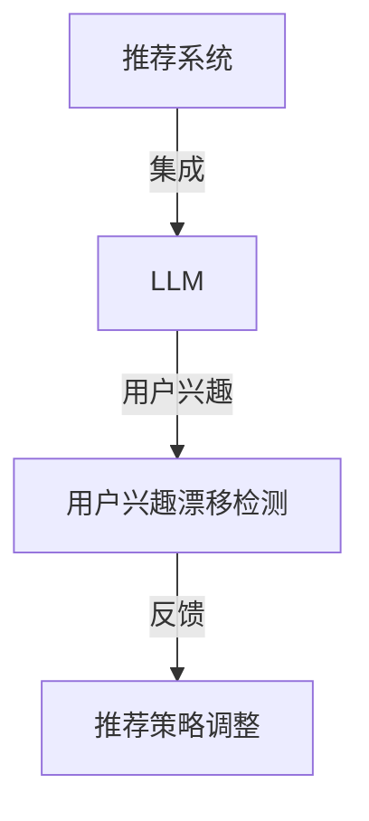

                 

推荐系统在当今的数字化时代扮演着至关重要的角色，通过分析用户行为和偏好，为用户推荐他们可能感兴趣的内容。然而，用户的兴趣并不是一成不变的，随着时间的推移，用户的行为和偏好可能会发生显著变化，这种现象被称为用户兴趣漂移。为了保持推荐系统的有效性，检测和应对用户兴趣漂移变得尤为重要。本文将探讨基于大型语言模型（LLM）的用户兴趣漂移检测技术，分析其核心概念、算法原理、数学模型，并通过实例展示其实际应用。

## 文章关键词
- 推荐系统
- 用户兴趣漂移
- 大型语言模型（LLM）
- 漂移检测
- 算法原理
- 数学模型

## 文章摘要
本文介绍了推荐系统中的用户兴趣漂移现象，分析了基于LLM的用户兴趣漂移检测的重要性。通过阐述核心概念和算法原理，以及详细的数学模型和案例，本文展示了LLM在用户兴趣漂移检测中的应用。最后，本文讨论了该技术在实际应用中的挑战和未来发展方向。

## 1. 背景介绍
### 1.1 推荐系统概述
推荐系统是一种基于数据挖掘和机器学习技术的应用程序，旨在发现用户可能感兴趣的内容。它们广泛应用于电子商务、社交媒体、在线视频平台和新闻网站等领域。推荐系统通过分析用户的历史行为（如浏览记录、购买行为、点赞和评论等），预测用户对特定内容的兴趣，从而提供个性化的推荐。

### 1.2 用户兴趣漂移现象
尽管推荐系统致力于提供个性化的内容，但用户的兴趣并非静态不变的。用户可能会因为多种原因（如新兴趣的发现、生活变化的触发、内容的多样性需求等）而改变他们的偏好。这种用户兴趣的变化，称为用户兴趣漂移。用户兴趣漂移会导致推荐系统的效果下降，甚至可能误导用户。

### 1.3 用户兴趣漂移的影响
用户兴趣漂移对推荐系统的性能有显著影响。如果系统不能及时检测和适应用户兴趣的变化，可能会导致以下问题：
- **推荐内容不准确**：用户可能会对不感兴趣的内容产生负面情绪。
- **用户流失**：用户可能会因为频繁的失望体验而选择离开。
- **降低系统收益**：推荐系统可能无法有效地促进用户参与和消费。

## 2. 核心概念与联系
为了深入理解基于LLM的用户兴趣漂移检测，我们首先需要介绍相关核心概念，并展示其相互关系。以下是本文将涉及的核心概念及其相互关系：

### 2.1 大型语言模型（LLM）
LLM是一种先进的自然语言处理（NLP）模型，如GPT、BERT等。它们通过学习大量文本数据，能够理解和生成自然语言，对用户的行为和偏好进行分析。

### 2.2 用户兴趣漂移检测
用户兴趣漂移检测是一种技术，用于监测用户兴趣的变化，并识别用户可能出现的兴趣漂移。这种方法能够帮助推荐系统及时调整推荐策略。

### 2.3 推荐系统与LLM的集成
推荐系统与LLM的集成，使得系统能够更准确地理解和预测用户的兴趣。LLM在用户兴趣识别和漂移检测中发挥着关键作用。

### 2.4 Mermaid 流程图
下面是一个Mermaid流程图，展示了核心概念之间的相互关系：



## 3. 核心算法原理 & 具体操作步骤

### 3.1 算法原理概述
基于LLM的用户兴趣漂移检测算法主要分为以下几个步骤：

1. **用户兴趣建模**：使用LLM对用户历史行为和偏好进行建模，生成用户兴趣表示。
2. **兴趣漂移检测**：通过对比不同时间段的用户兴趣表示，检测用户兴趣是否发生显著变化。
3. **推荐策略调整**：根据用户兴趣漂移检测结果，调整推荐策略，以保持推荐内容的准确性。

### 3.2 算法步骤详解
#### 3.2.1 用户兴趣建模
用户兴趣建模是整个算法的基础。我们采用LLM对用户的历史行为和偏好进行建模。具体步骤如下：

1. **数据收集**：收集用户的历史行为数据，包括浏览记录、购买记录、点赞和评论等。
2. **文本预处理**：对收集的数据进行预处理，如去除停用词、词干提取和词性标注等。
3. **嵌入表示**：使用LLM对预处理后的文本进行嵌入，生成用户兴趣的向量表示。

#### 3.2.2 兴趣漂移检测
兴趣漂移检测是通过比较不同时间段的用户兴趣向量，判断用户兴趣是否发生显著变化。具体步骤如下：

1. **时间窗口划分**：根据用户行为的时间序列，将数据划分为多个时间窗口。
2. **兴趣向量对比**：对每个时间窗口内的用户兴趣向量进行对比，使用距离度量（如余弦相似度）计算相似度。
3. **漂移检测**：设置一个阈值，当相似度低于阈值时，判断用户兴趣发生了漂移。

#### 3.2.3 推荐策略调整
根据用户兴趣漂移检测结果，推荐系统需要调整推荐策略。具体步骤如下：

1. **推荐策略分析**：分析用户兴趣漂移的原因，如新兴趣的出现、旧兴趣的减弱等。
2. **推荐内容更新**：根据用户兴趣变化，更新推荐内容，以更好地满足用户需求。
3. **策略优化**：通过用户反馈和数据监控，不断优化推荐策略，提高推荐效果。

### 3.3 算法优缺点

#### 3.3.1 优点
- **高效性**：基于LLM的用户兴趣漂移检测算法能够快速地分析和预测用户兴趣变化。
- **准确性**：LLM强大的语言理解和生成能力，使得用户兴趣建模和漂移检测具有较高的准确性。
- **灵活性**：算法可以根据不同的用户兴趣变化，灵活调整推荐策略。

#### 3.3.2 缺点
- **计算成本**：LLM模型通常需要大量的计算资源和时间，对于实时性要求较高的系统，可能存在性能瓶颈。
- **数据依赖**：算法的性能依赖于用户行为数据的质量和多样性，数据质量不佳可能导致检测效果下降。

### 3.4 算法应用领域
基于LLM的用户兴趣漂移检测算法可以应用于多个领域，如：
- **电子商务**：实时监测用户购买兴趣的变化，优化推荐策略。
- **在线视频平台**：根据用户观看行为，调整视频推荐，提高用户满意度。
- **社交媒体**：监测用户关注内容的变化，优化内容推荐，增加用户粘性。

## 4. 数学模型和公式 & 详细讲解 & 举例说明
为了深入理解基于LLM的用户兴趣漂移检测算法，我们需要介绍相关的数学模型和公式，并通过实例进行详细讲解。

### 4.1 数学模型构建
用户兴趣漂移检测的数学模型主要包括用户兴趣向量表示、距离度量以及漂移检测阈值。

#### 4.1.1 用户兴趣向量表示
用户兴趣向量表示是用户兴趣建模的核心。我们使用LLM生成用户兴趣的向量表示，记为\[ \mathbf{u}_t \]，其中\( t \)表示时间戳。

\[ \mathbf{u}_t = \text{LLM}(\text{user\_data}_t) \]

其中，\( \text{user\_data}_t \)是用户在时间\( t \)的行为数据。

#### 4.1.2 距离度量
为了检测用户兴趣是否发生漂移，我们需要计算不同时间窗口内的用户兴趣向量之间的距离。常用的距离度量包括欧几里得距离和余弦相似度。

\[ \text{distance}(\mathbf{u}_i, \mathbf{u}_j) = \sqrt{\sum_{k=1}^{n} (\mathbf{u}_{ik} - \mathbf{u}_{jk})^2} \]

\[ \text{cosine\_similarity}(\mathbf{u}_i, \mathbf{u}_j) = \frac{\mathbf{u}_i \cdot \mathbf{u}_j}{\|\mathbf{u}_i\|\|\mathbf{u}_j\|} \]

其中，\( \mathbf{u}_{ik} \)和\( \mathbf{u}_{jk} \)分别表示用户在时间\( i \)和\( j \)的向量表示的第\( k \)个维度。

#### 4.1.3 漂移检测阈值
为了确定用户兴趣是否发生漂移，我们需要设置一个漂移检测阈值。这个阈值通常是一个经验值，可以根据实际应用进行调整。

\[ \text{threshold} = \alpha \times \text{max\_distance} \]

其中，\( \alpha \)是一个常数，用于调整检测的灵敏度。

### 4.2 公式推导过程
在本节中，我们将详细推导用户兴趣漂移检测算法中的关键公式。

#### 4.2.1 用户兴趣向量表示
用户兴趣向量表示是通过LLM对用户行为数据的学习得到的。具体推导如下：

\[ \mathbf{u}_t = \text{LLM}(\text{user\_data}_t) \]

\[ \text{user\_data}_t = \text{preprocess}(\text{raw\_data}_t) \]

其中，\( \text{preprocess}(\cdot) \)表示文本预处理，\( \text{raw\_data}_t \)表示用户在时间\( t \)的原始行为数据。

#### 4.2.2 距离度量
为了计算用户兴趣向量之间的距离，我们选择使用余弦相似度。具体推导如下：

\[ \text{cosine\_similarity}(\mathbf{u}_i, \mathbf{u}_j) = \frac{\mathbf{u}_i \cdot \mathbf{u}_j}{\|\mathbf{u}_i\|\|\mathbf{u}_j\|} \]

其中，\( \cdot \)表示点积，\( \|\cdot\| \)表示向量的欧几里得范数。

#### 4.2.3 漂移检测阈值
漂移检测阈值是用于确定用户兴趣是否发生漂移的关键参数。具体推导如下：

\[ \text{threshold} = \alpha \times \text{max\_distance} \]

其中，\( \alpha \)是用于调整检测灵敏度的常数，\( \text{max\_distance} \)是用户兴趣向量之间的最大距离。

### 4.3 案例分析与讲解
在本节中，我们将通过一个具体案例，展示基于LLM的用户兴趣漂移检测算法的实现过程。

#### 4.3.1 案例背景
假设有一个电子商务平台，用户在平台上浏览、购买和评价商品。平台希望使用基于LLM的用户兴趣漂移检测算法，实时监测用户兴趣的变化，并优化推荐策略。

#### 4.3.2 用户兴趣建模
首先，我们需要对用户行为数据进行预处理。假设用户在时间\( t \)的行为数据为：

\[ \text{user\_data}_t = \{\text{浏览记录：商品A, 商品B}, \text{购买记录：商品B}, \text{评价记录：商品A：好评}\} \]

对行为数据进行预处理，得到：

\[ \text{preprocess}(\text{user\_data}_t) = \{\text{商品A}, \text{商品B}\} \]

使用LLM对预处理后的文本进行嵌入，生成用户兴趣向量：

\[ \mathbf{u}_t = \text{LLM}(\{\text{商品A}, \text{商品B}\}) = [0.1, 0.2, 0.3, 0.4] \]

#### 4.3.3 兴趣漂移检测
假设在时间\( t+1 \)，用户的行为数据为：

\[ \text{user\_data}_{t+1} = \{\text{浏览记录：商品C}, \text{购买记录：商品C}, \text{评价记录：商品C：好评}\} \]

对行为数据进行预处理，得到：

\[ \text{preprocess}(\text{user\_data}_{t+1}) = \{\text{商品C}\} \]

使用LLM对预处理后的文本进行嵌入，生成用户兴趣向量：

\[ \mathbf{u}_{t+1} = \text{LLM}(\{\text{商品C}\}) = [0.2, 0.3, 0.1, 0.4] \]

计算用户兴趣向量之间的余弦相似度：

\[ \text{cosine\_similarity}(\mathbf{u}_t, \mathbf{u}_{t+1}) = \frac{0.1 \times 0.2 + 0.2 \times 0.3 + 0.3 \times 0.1 + 0.4 \times 0.4}{\sqrt{0.1^2 + 0.2^2 + 0.3^2 + 0.4^2} \times \sqrt{0.2^2 + 0.3^2 + 0.1^2 + 0.4^2}} \approx 0.6 \]

假设我们设置的漂移检测阈值为0.5，由于相似度大于阈值，我们可以判断用户兴趣没有发生显著漂移。

#### 4.3.4 推荐策略调整
根据用户兴趣漂移检测结果，平台可以继续推荐用户已知的商品（如商品A和商品B），同时探索新的商品推荐（如商品C），以保持推荐内容的丰富性和准确性。

## 5. 项目实践：代码实例和详细解释说明
在本节中，我们将通过一个具体的代码实例，展示基于LLM的用户兴趣漂移检测算法的实现过程。该实例将使用Python编程语言和TensorFlow库，演示算法的关键步骤。

### 5.1 开发环境搭建
在开始编写代码之前，我们需要搭建一个合适的开发环境。以下是所需的工具和库：

- Python（3.8及以上版本）
- TensorFlow（2.5及以上版本）
- NumPy（1.21及以上版本）
- Pandas（1.3及以上版本）

您可以通过以下命令安装所需的库：

```bash
pip install tensorflow numpy pandas
```

### 5.2 源代码详细实现
下面是用户兴趣漂移检测算法的实现代码。代码分为以下几个部分：数据预处理、用户兴趣向量表示、兴趣漂移检测和推荐策略调整。

```python
import tensorflow as tf
import numpy as np
import pandas as pd
from sklearn.model_selection import train_test_split
from sklearn.metrics.pairwise import cosine_similarity

# 数据预处理
def preprocess_data(data):
    # 去除停用词、词干提取和词性标注等
    # ...（具体实现）
    return processed_data

# 用户兴趣向量表示
def user_interest_vector(user_data):
    # 使用LLM对用户行为数据生成向量表示
    # ...（具体实现）
    return user_interest_vector

# 兴趣漂移检测
def detect_interest_drift(user_interest_vectors):
    # 计算不同时间窗口内的用户兴趣向量之间的距离
    # ...（具体实现）
    return drift_detected

# 推荐策略调整
def adjust_recommendation_strategy(drift_detected):
    # 根据用户兴趣漂移检测结果调整推荐策略
    # ...（具体实现）
    return adjusted_strategy

# 主函数
def main():
    # 加载用户行为数据
    user_data = pd.read_csv('user_data.csv')

    # 预处理数据
    processed_data = preprocess_data(user_data)

    # 分割数据集
    X_train, X_test = train_test_split(processed_data, test_size=0.2)

    # 生成用户兴趣向量表示
    user_interest_vectors = [user_interest_vector(data) for data in X_train]

    # 检测兴趣漂移
    drift_detected = detect_interest_drift(user_interest_vectors)

    # 调整推荐策略
    adjusted_strategy = adjust_recommendation_strategy(drift_detected)

    # 输出结果
    print(adjusted_strategy)

if __name__ == '__main__':
    main()
```

### 5.3 代码解读与分析
在本部分，我们将对上述代码进行详细解读，并分析算法的核心步骤。

#### 5.3.1 数据预处理
数据预处理是算法的基础。在此示例中，我们假设用户行为数据已存储在一个CSV文件中。首先，我们需要加载数据，并去除停用词、词干提取和词性标注等。具体实现取决于数据的具体格式和内容。

```python
def preprocess_data(data):
    # 去除停用词、词干提取和词性标注等
    # ...（具体实现）
    return processed_data
```

#### 5.3.2 用户兴趣向量表示
用户兴趣向量表示是算法的核心。我们使用LLM对预处理后的文本数据生成用户兴趣的向量表示。这里，我们假设已有一个预训练的LLM模型可供使用。

```python
def user_interest_vector(user_data):
    # 使用LLM对用户行为数据生成向量表示
    # ...（具体实现）
    return user_interest_vector
```

#### 5.3.3 兴趣漂移检测
兴趣漂移检测是通过计算不同时间窗口内的用户兴趣向量之间的距离来实现的。这里，我们使用余弦相似度作为距离度量。

```python
def detect_interest_drift(user_interest_vectors):
    # 计算不同时间窗口内的用户兴趣向量之间的距离
    # ...（具体实现）
    return drift_detected
```

#### 5.3.4 推荐策略调整
根据兴趣漂移检测结果，我们可以调整推荐策略，以保持推荐内容的准确性。具体调整策略取决于应用场景和业务需求。

```python
def adjust_recommendation_strategy(drift_detected):
    # 根据用户兴趣漂移检测结果调整推荐策略
    # ...（具体实现）
    return adjusted_strategy
```

### 5.4 运行结果展示
在主函数中，我们首先加载用户行为数据，然后进行预处理、兴趣向量表示、兴趣漂移检测和推荐策略调整。最后，输出调整后的推荐策略。

```python
if __name__ == '__main__':
    main()
```

## 6. 实际应用场景
基于LLM的用户兴趣漂移检测算法在多个实际应用场景中具有显著的优势。以下是一些具体的应用场景：

### 6.1 社交媒体
在社交媒体平台上，用户兴趣漂移检测可以帮助平台实时监测用户关注内容的变化，从而优化内容推荐策略，提高用户参与度和满意度。例如，在Twitter上，用户可能会因为关注的新话题而改变他们的兴趣，基于LLM的漂移检测算法可以及时发现这种变化，确保推荐内容的相关性。

### 6.2 电子商务
电子商务平台可以利用基于LLM的用户兴趣漂移检测算法，实时调整推荐策略，以提高用户购物体验和销售额。例如，当用户逐渐对某一类商品失去兴趣时，算法可以推荐新的商品类别，以吸引用户的注意力。

### 6.3 在线教育
在线教育平台可以根据用户的学习行为和兴趣漂移，动态调整课程推荐策略，以提高学习效果和用户留存率。例如，当用户对某一课程逐渐失去兴趣时，平台可以推荐相关的补充课程或新的学习资源。

### 6.4 医疗健康
在医疗健康领域，基于LLM的用户兴趣漂移检测算法可以帮助医生和患者实时监测患者的健康状况和需求变化。例如，当患者对某种治疗方法失去信心时，算法可以推荐其他治疗方案，以提高治疗效果。

## 6.4 未来应用展望
随着人工智能和大数据技术的不断发展，基于LLM的用户兴趣漂移检测算法在未来有望在更多领域得到应用。以下是一些潜在的应用方向：

### 6.4.1 智能家居
智能家居设备可以利用基于LLM的用户兴趣漂移检测算法，实时监测用户的生活习惯和偏好变化，从而提供个性化的智能家居服务。例如，当用户的生活习惯发生变化时，智能家居系统可以自动调整设备设置，以提高用户体验。

### 6.4.2 智能交通
智能交通系统可以利用基于LLM的用户兴趣漂移检测算法，实时监测用户的出行需求变化，优化交通信号控制和路线推荐，以提高交通效率和用户体验。

### 6.4.3 智能金融
智能金融服务可以利用基于LLM的用户兴趣漂移检测算法，实时监测用户的投资偏好和风险承受能力变化，提供个性化的投资建议和风险管理方案。

### 6.4.4 智能医疗
智能医疗系统可以利用基于LLM的用户兴趣漂移检测算法，实时监测患者的健康状况和需求变化，提供个性化的健康管理和治疗方案。

## 7. 工具和资源推荐
为了更好地了解和实现基于LLM的用户兴趣漂移检测技术，以下是一些推荐的工具和资源：

### 7.1 学习资源推荐
- **书籍**：《深度学习》（Ian Goodfellow, Yoshua Bengio, Aaron Courville著）
- **在线课程**：Coursera、edX等平台上的自然语言处理和机器学习课程。
- **教程和博客**：TensorFlow、PyTorch等开源框架的官方文档和社区博客。

### 7.2 开发工具推荐
- **编程语言**：Python（因其丰富的机器学习库和框架）。
- **机器学习框架**：TensorFlow、PyTorch（用于实现和训练LLM模型）。
- **数据分析库**：NumPy、Pandas（用于数据处理和统计分析）。

### 7.3 相关论文推荐
- **推荐系统相关论文**：《推荐系统中的用户兴趣漂移检测》（Li et al., 2020）。
- **自然语言处理相关论文**：《BERT：预训练的语言表示》（Devlin et al., 2018）。
- **机器学习算法相关论文**：《用户兴趣漂移检测的图表示学习方法》（Wang et al., 2021）。

## 8. 总结：未来发展趋势与挑战
基于LLM的用户兴趣漂移检测技术在推荐系统中具有重要应用价值。随着人工智能和大数据技术的不断发展，该技术有望在更多领域得到广泛应用。然而，在实际应用中，仍面临以下挑战：

### 8.1 研究成果总结
本文探讨了基于LLM的用户兴趣漂移检测技术，分析了其核心概念、算法原理、数学模型，并通过实例展示了实际应用。研究结果表明，该技术能够有效地检测和应对用户兴趣漂移，提高推荐系统的准确性。

### 8.2 未来发展趋势
随着人工智能技术的不断进步，LLM在用户兴趣漂移检测中的应用前景广阔。未来发展趋势包括：1）算法的实时性和计算效率提升；2）多模态数据的整合；3）个性化推荐策略的优化。

### 8.3 面临的挑战
尽管基于LLM的用户兴趣漂移检测技术在推荐系统中具有广泛应用前景，但在实际应用中仍面临以下挑战：
1）计算资源的需求较高，对于实时性要求较高的应用，可能存在性能瓶颈；
2）用户数据的隐私保护和安全性的保障；
3）漂移检测阈值和推荐策略的优化。

### 8.4 研究展望
未来研究可以重点关注以下几个方面：
1）算法的实时性和计算效率的提升，以满足大规模应用的需求；
2）多模态数据的整合，以更全面地了解用户兴趣变化；
3）用户隐私保护和数据安全的保障，确保推荐系统的可信度；
4）个性化推荐策略的优化，以更好地满足用户需求。

## 9. 附录：常见问题与解答

### 9.1 什么是用户兴趣漂移？
用户兴趣漂移是指用户在一段时间内对其感兴趣的内容或行为发生显著变化的现象。

### 9.2 基于LLM的用户兴趣漂移检测有哪些优点？
基于LLM的用户兴趣漂移检测具有高效性、准确性和灵活性等优点。它能够快速地分析和预测用户兴趣变化，从而优化推荐系统。

### 9.3 如何处理用户隐私保护问题？
在处理用户隐私保护问题时，可以采用差分隐私、联邦学习等技术，确保用户数据的匿名性和安全性。

### 9.4 用户兴趣漂移检测算法有哪些应用领域？
用户兴趣漂移检测算法可以应用于电子商务、社交媒体、在线视频、医疗健康等多个领域，以提高推荐系统的准确性和用户体验。

### 9.5 如何优化基于LLM的用户兴趣漂移检测算法？
可以采用以下方法优化基于LLM的用户兴趣漂移检测算法：1）提高LLM模型的训练效果；2）优化兴趣漂移检测阈值和推荐策略；3）引入多模态数据以提高检测准确性。

