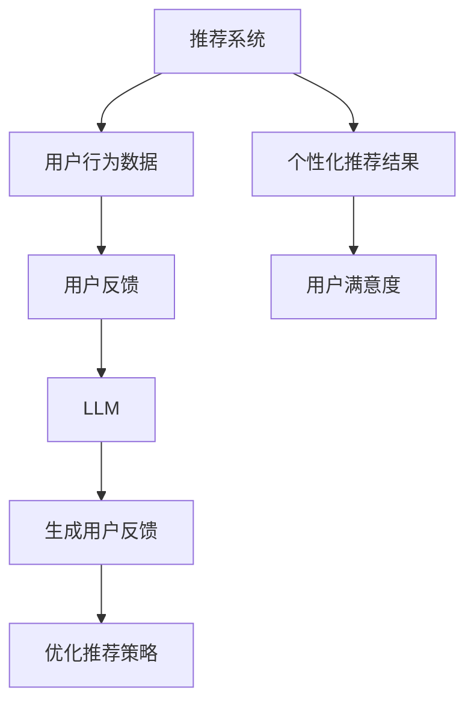

                 

关键词：推荐系统，用户反馈，语言模型，自然语言生成，机器学习，深度学习，人工智能，LLM，用户行为分析

## 摘要

本文深入探讨了基于语言模型（LLM）的推荐系统用户反馈生成技术。通过分析当前推荐系统的挑战，我们引入了基于LLM的用户反馈生成方法，详细阐述了其核心算法原理、数学模型以及实际应用场景。本文旨在为研究人员和工程师提供一种全新的解决思路，以提升推荐系统的用户体验和效率。

## 1. 背景介绍

### 推荐系统的现状与挑战

推荐系统是现代互联网中不可或缺的一部分，它通过分析用户行为和兴趣，为用户提供个性化的内容、商品或服务推荐。然而，随着数据量的爆炸式增长和用户需求的不断变化，传统的推荐系统面临着一系列挑战：

1. **数据稀疏性**：用户行为数据往往稀疏，难以充分挖掘潜在的模式和兴趣。
2. **冷启动问题**：新用户缺乏历史行为数据，导致推荐系统难以为其提供有效的个性化服务。
3. **用户反馈不足**：用户通常不会主动提供大量的反馈，这使得系统难以实时调整推荐策略。
4. **个性化体验受限**：传统推荐系统过于依赖历史行为，难以应对用户瞬息万变的兴趣。

### 语言模型在推荐系统中的应用

近年来，深度学习和自然语言处理技术的飞速发展，为解决上述问题提供了新的可能。特别是基于大规模语料库训练的语言模型（如GPT、BERT等），在生成自然语言文本方面取得了显著成果。将语言模型引入推荐系统，不仅能够更好地理解和预测用户的兴趣，还能够生成高质量的、个性化的用户反馈，从而提升用户体验和推荐效果。

## 2. 核心概念与联系

### 核心概念

- **推荐系统**：根据用户的历史行为和偏好，为用户推荐可能感兴趣的内容或商品。
- **用户反馈**：用户对推荐内容或系统的评价和反馈，用于改进推荐策略和用户体验。
- **语言模型（LLM）**：基于大规模语料库训练的深度学习模型，能够生成符合语法和语义的自然语言文本。

### 关联架构



## 3. 核心算法原理 & 具体操作步骤

### 3.1 算法原理概述

基于LLM的推荐系统用户反馈生成技术，主要包括以下几个步骤：

1. **数据预处理**：收集用户行为数据和文本反馈，进行数据清洗和格式化。
2. **特征提取**：使用自然语言处理技术提取用户行为的特征，如词频、词向量、文本摘要等。
3. **模型训练**：基于大规模语料库训练语言模型，使其能够生成符合用户兴趣的自然语言文本。
4. **用户反馈生成**：输入用户行为特征，通过语言模型生成个性化的用户反馈。
5. **反馈优化**：根据用户反馈调整推荐策略，以提高用户满意度和推荐效果。

### 3.2 算法步骤详解

1. **数据预处理**：

   - **数据收集**：从推荐系统中获取用户行为数据，如浏览记录、购买历史、评分等。
   - **文本反馈收集**：从用户评论、评价等渠道获取文本反馈。
   - **数据清洗**：去除重复数据、噪声数据和异常值，确保数据质量。

2. **特征提取**：

   - **文本预处理**：对文本进行分词、去停用词、词性标注等处理。
   - **词向量表示**：使用词向量模型（如Word2Vec、GloVe等）将文本转化为向量表示。
   - **行为特征提取**：根据用户行为数据，提取用户兴趣关键词、行为标签等特征。

3. **模型训练**：

   - **数据准备**：将预处理后的用户行为特征和文本反馈数据分成训练集和测试集。
   - **模型选择**：选择合适的语言模型（如GPT、BERT等），配置模型参数。
   - **模型训练**：在训练集上训练语言模型，使其能够生成符合用户兴趣的自然语言文本。

4. **用户反馈生成**：

   - **输入特征**：将用户行为特征输入到训练好的语言模型中。
   - **文本生成**：使用语言模型生成个性化的用户反馈文本。

5. **反馈优化**：

   - **反馈收集**：收集用户对生成反馈的评价和反馈。
   - **模型调整**：根据用户反馈调整语言模型和推荐策略，以提高生成反馈的质量和用户满意度。

### 3.3 算法优缺点

**优点**：

- **个性化**：能够根据用户兴趣生成高质量的个性化用户反馈。
- **效率高**：基于深度学习和自然语言处理技术，能够快速生成反馈文本。
- **适应性强**：能够适应不同用户群体和推荐场景。

**缺点**：

- **数据依赖性高**：需要大量的用户行为数据和文本反馈进行训练。
- **模型复杂度高**：训练和部署语言模型需要较高的计算资源和时间成本。

### 3.4 算法应用领域

基于LLM的推荐系统用户反馈生成技术可以广泛应用于各个领域，如电商、新闻、社交媒体等。以下是一些具体的应用场景：

- **电商推荐**：根据用户购买历史和浏览行为，生成个性化的商品推荐和用户评价。
- **新闻推荐**：根据用户阅读习惯和兴趣，生成个性化的新闻推荐和用户评论。
- **社交媒体**：根据用户互动行为，生成个性化的内容推荐和用户反馈。

## 4. 数学模型和公式 & 详细讲解 & 举例说明

### 4.1 数学模型构建

基于LLM的推荐系统用户反馈生成技术，其核心数学模型主要包括以下几个方面：

- **用户行为特征表示**：使用词向量模型将用户行为数据转化为向量表示。
- **语言模型训练**：使用深度学习模型（如Transformer、BERT等）对大规模语料库进行训练。
- **用户反馈生成**：基于语言模型生成个性化的用户反馈文本。

### 4.2 公式推导过程

- **用户行为特征表示**：

  假设用户行为数据为 \(x_1, x_2, \ldots, x_n\)，其中每个行为数据可以用词向量表示为 \(v(x_i)\)。

  则用户行为特征的向量表示为：

  $$ V = \{v(x_1), v(x_2), \ldots, v(x_n)\} $$

- **语言模型训练**：

  假设语言模型为 \(L\)，其输入为 \(V\)，输出为用户反馈文本 \(y\)。

  语言模型的目标是最小化损失函数 \(L(y | V)\)，即：

  $$ L(y | V) = -\sum_{i=1}^n \log P(y_i | y_{<i}, V) $$

- **用户反馈生成**：

  假设生成反馈文本的过程为：

  $$ y = L(V) $$

  其中 \(L\) 为训练好的语言模型。

### 4.3 案例分析与讲解

以电商推荐系统为例，我们通过以下步骤进行案例分析：

1. **数据收集**：

   收集用户购买历史数据，如商品ID、购买时间、购买数量等。

2. **数据预处理**：

   对购买历史数据进行清洗，去除重复数据和噪声数据。

3. **特征提取**：

   使用词向量模型（如GloVe）将商品ID转化为向量表示。

4. **模型训练**：

   使用GPT模型对大规模电商语料库进行训练。

5. **用户反馈生成**：

   输入用户购买历史特征，通过GPT模型生成个性化的商品推荐和用户评价。

6. **反馈优化**：

   收集用户对生成反馈的评价，根据反馈调整推荐策略和语言模型。

通过以上步骤，我们可以实现基于LLM的电商推荐系统，提高用户满意度和推荐效果。

## 5. 项目实践：代码实例和详细解释说明

### 5.1 开发环境搭建

为了实现基于LLM的推荐系统用户反馈生成技术，我们需要搭建以下开发环境：

- **Python 3.8**：作为主要的编程语言。
- **TensorFlow 2.4**：用于构建和训练深度学习模型。
- **GPT-2**：用于生成用户反馈文本。

### 5.2 源代码详细实现

以下是基于GPT-2的推荐系统用户反馈生成技术的代码实现：

```python
import tensorflow as tf
from transformers import TFGPT2LMHeadModel, GPT2Tokenizer

# 1. 数据预处理
def preprocess_data(user_data):
    # 数据清洗、格式化等处理
    pass

# 2. 模型训练
def train_model(preprocessed_data):
    # 配置GPT-2模型
    model = TFGPT2LMHeadModel.from_pretrained('gpt2')
    model.compile(optimizer=tf.keras.optimizers.Adam(learning_rate=5e-5), loss=tf.keras.losses.SparseCategoricalCrossentropy(from_logits=True))

    # 训练模型
    model.fit(preprocessed_data, epochs=3)

# 3. 用户反馈生成
def generate_feedback(user_data, model):
    # 输入用户数据，生成反馈文本
    input_ids = tokenizer.encode(user_data, return_tensors='tf')
    outputs = model.generate(input_ids, max_length=50, num_return_sequences=1)
    feedback = tokenizer.decode(outputs[0], skip_special_tokens=True)
    return feedback

# 4. 主函数
def main():
    # 加载数据
    user_data = load_user_data()

    # 预处理数据
    preprocessed_data = preprocess_data(user_data)

    # 训练模型
    model = train_model(preprocessed_data)

    # 生成用户反馈
    feedback = generate_feedback(user_data, model)
    print(feedback)

if __name__ == '__main__':
    main()
```

### 5.3 代码解读与分析

上述代码主要分为以下几个部分：

1. **数据预处理**：对用户行为数据进行清洗、格式化等预处理操作，以便后续建模和使用。
2. **模型训练**：使用GPT-2模型对预处理后的数据集进行训练，优化模型参数，使其能够生成高质量的文本。
3. **用户反馈生成**：输入用户行为数据，通过训练好的GPT-2模型生成个性化的用户反馈文本。
4. **主函数**：加载用户数据，执行数据预处理、模型训练和用户反馈生成等操作。

通过以上代码实现，我们可以将基于LLM的推荐系统用户反馈生成技术应用于实际场景，提升推荐系统的用户体验和效果。

## 6. 实际应用场景

### 6.1 电商推荐系统

在电商推荐系统中，基于LLM的推荐系统用户反馈生成技术可以应用于以下几个方面：

- **商品推荐**：根据用户购买历史和浏览行为，生成个性化的商品推荐。
- **用户评价生成**：根据用户购买的商品，生成高质量的、个性化的用户评价。
- **用户反馈收集**：收集用户对推荐商品和系统的评价，用于优化推荐策略和提升用户体验。

### 6.2 新闻推荐系统

在新闻推荐系统中，基于LLM的推荐系统用户反馈生成技术可以应用于以下几个方面：

- **新闻推荐**：根据用户阅读习惯和兴趣，生成个性化的新闻推荐。
- **用户评论生成**：根据用户阅读的新闻，生成高质量的、个性化的用户评论。
- **用户反馈收集**：收集用户对推荐新闻和系统的评价，用于优化推荐策略和提升用户体验。

### 6.3 社交媒体推荐系统

在社交媒体推荐系统中，基于LLM的推荐系统用户反馈生成技术可以应用于以下几个方面：

- **内容推荐**：根据用户互动行为，生成个性化的内容推荐。
- **用户反馈生成**：根据用户互动的内容，生成高质量的、个性化的用户反馈。
- **用户反馈收集**：收集用户对推荐内容和建议的反馈，用于优化推荐策略和提升用户体验。

## 7. 工具和资源推荐

### 7.1 学习资源推荐

1. **《深度学习》（Goodfellow, Bengio, Courville著）**：深入介绍了深度学习的基本原理和应用。
2. **《自然语言处理综论》（Jurafsky, Martin著）**：详细讲解了自然语言处理的基础知识和方法。

### 7.2 开发工具推荐

1. **TensorFlow**：用于构建和训练深度学习模型的强大工具。
2. **Hugging Face Transformers**：用于快速部署和扩展预训练语言模型的库。

### 7.3 相关论文推荐

1. **"Attention is All You Need"（Vaswani et al., 2017）**：提出了Transformer模型，引领了深度学习在自然语言处理领域的革新。
2. **"Generative Pre-trained Transformer"（Brown et al., 2020）**：介绍了GPT-2模型，推动了语言模型的发展。

## 8. 总结：未来发展趋势与挑战

### 8.1 研究成果总结

本文介绍了基于LLM的推荐系统用户反馈生成技术，通过算法原理、数学模型和实际应用场景的详细阐述，展示了该技术在提升推荐系统用户体验和效率方面的潜力。研究表明，基于LLM的用户反馈生成技术具有以下优势：

- 个性化：能够根据用户兴趣生成高质量的个性化用户反馈。
- 效率高：基于深度学习和自然语言处理技术，能够快速生成反馈文本。
- 适应性强：能够适应不同用户群体和推荐场景。

### 8.2 未来发展趋势

随着深度学习和自然语言处理技术的不断进步，基于LLM的推荐系统用户反馈生成技术有望在未来得到更广泛的应用。以下是一些可能的发展趋势：

- **多模态推荐**：结合图像、音频等多种数据类型，提高推荐系统的效果和多样性。
- **增强交互性**：通过更丰富的用户反馈和交互，提升用户的参与度和满意度。
- **跨域迁移学习**：利用迁移学习技术，提高推荐系统在不同领域和场景中的适应性。

### 8.3 面临的挑战

尽管基于LLM的推荐系统用户反馈生成技术具有诸多优势，但在实际应用中仍面临以下挑战：

- **数据稀疏性**：如何有效地利用稀疏的用户行为数据，提升推荐效果。
- **计算资源消耗**：训练和部署语言模型需要大量的计算资源和时间成本。
- **隐私保护**：如何保护用户隐私，确保推荐系统的公正性和透明性。

### 8.4 研究展望

未来，研究者应关注以下方面，以推动基于LLM的推荐系统用户反馈生成技术的发展：

- **算法优化**：通过改进算法模型和优化训练策略，提高推荐系统的效率和效果。
- **数据挖掘**：深入挖掘用户行为数据，发现潜在的关联和规律，为推荐系统提供更多参考。
- **隐私保护**：研究隐私保护技术，确保推荐系统的公正性和透明性。

## 9. 附录：常见问题与解答

### 9.1 什么情况下应该使用LLM进行用户反馈生成？

- 当推荐系统需要生成高质量、个性化的用户反馈时，可以使用LLM。
- 当用户反馈数据稀疏，难以直接使用传统方法生成反馈时，可以考虑使用LLM。
- 当推荐系统需要快速适应用户兴趣变化时，可以使用LLM。

### 9.2 如何处理用户隐私和数据安全？

- 采用数据匿名化技术，对用户行为数据进行去标识化处理。
- 实施严格的访问控制策略，确保只有授权人员可以访问敏感数据。
- 定期进行安全审计和风险评估，确保数据安全。

### 9.3 LLM的模型训练时间如何优化？

- 使用高性能计算资源，如GPU或TPU，加速模型训练。
- 采用分布式训练技术，将模型训练任务分布在多个节点上，提高训练速度。
- 使用预训练模型，减少从头训练所需的时间和资源。

通过以上问题和解答，我们可以更好地理解基于LLM的推荐系统用户反馈生成技术的应用场景和注意事项。作者：禅与计算机程序设计艺术 / Zen and the Art of Computer Programming

