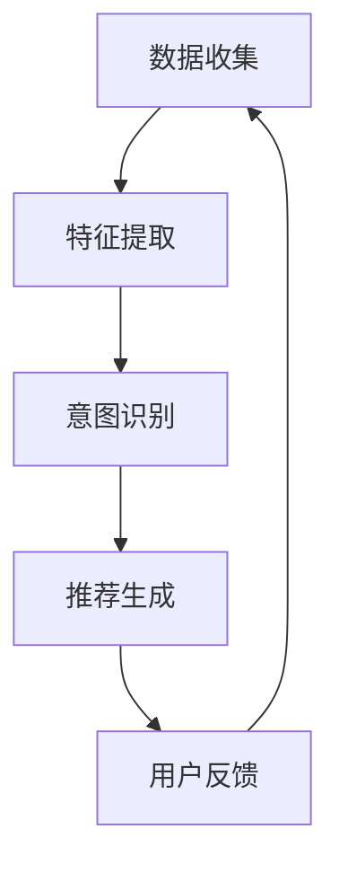

                 

关键词：大型语言模型（LLM）、推荐系统、用户意图理解、机器学习、自然语言处理、算法原理、数学模型、代码实现、应用领域、未来展望

## 摘要

本文探讨了基于大型语言模型（LLM）的推荐系统用户意图理解技术。通过分析推荐系统的现状和挑战，我们引入了LLM在用户意图识别中的作用。文章首先概述了LLM的基本原理，然后详细阐述了LLM在推荐系统中用于用户意图理解的方法和步骤。接下来，我们介绍了数学模型和公式，并通过实例进行了解释。随后，文章提供了具体的代码实例和运行结果展示。最后，我们讨论了实际应用场景，并展望了未来的发展趋势和挑战。

## 1. 背景介绍

推荐系统是信息过滤和知识发现的重要工具，广泛应用于电子商务、社交媒体、在线视频和新闻推送等领域。推荐系统的主要目标是通过分析用户的偏好和历史行为，为用户推荐他们可能感兴趣的内容或产品。然而，推荐系统面临的一个重大挑战是理解用户的意图。用户的偏好是动态的，且往往隐藏在复杂的用户行为模式中，这使得传统的方法难以准确捕捉用户的真实意图。

为了解决这一问题，近年来，大型语言模型（LLM）逐渐引起了研究者的关注。LLM是由深度神经网络组成的模型，其规模庞大，参数数量可以达到数十亿甚至更多。LLM通过训练大量文本数据，学习到了语言的复杂结构和语义信息。这使得LLM在自然语言处理（NLP）任务中表现出了强大的能力，包括文本分类、情感分析、机器翻译和问答系统等。

在推荐系统中，LLM的应用主要集中在用户意图理解方面。用户意图是用户在特定情境下想要完成的目标或任务，如购买商品、阅读新闻、观看视频等。理解用户意图对于推荐系统的准确性至关重要。传统方法如基于规则的系统、协同过滤和内容匹配等技术，在处理用户意图方面存在一定的局限性。而LLM通过其强大的语言理解能力，能够更深入地挖掘用户的意图，从而提高推荐系统的性能。

本文将详细介绍LLM在推荐系统用户意图理解中的应用，包括算法原理、数学模型、代码实现和实际应用场景。通过本文的阅读，读者可以了解到LLM如何应用于推荐系统，以及如何通过LLM提高推荐系统的准确性和用户体验。

### 2. 核心概念与联系

在深入探讨基于LLM的推荐系统用户意图理解之前，我们首先需要明确几个核心概念，包括大型语言模型（LLM）、用户意图、推荐系统和相关的算法架构。这些概念之间存在着密切的联系，共同构成了理解和实现用户意图理解的基础。

#### 2.1 大型语言模型（LLM）

大型语言模型（LLM）是基于深度学习的自然语言处理模型，具有处理大规模文本数据的能力。LLM通常由多层神经网络组成，包括编码器和解码器。编码器将输入的文本序列转换为固定长度的向量表示，解码器则根据这些向量生成输出文本。LLM通过预训练和微调学习到语言的统计规律和语义信息，从而在各种NLP任务中表现出色。

#### 2.2 用户意图

用户意图是指用户在特定情境下想要完成的目标或任务。在推荐系统中，理解用户意图对于推荐结果的准确性至关重要。用户意图可以是明确的，如购买某件商品或观看某个视频，也可以是隐含的，如对某个话题的兴趣或对某种风格的偏好。用户的意图往往隐藏在他们的搜索历史、浏览记录、评价反馈等行为中。

#### 2.3 推荐系统

推荐系统是一种自动化方法，通过分析用户的历史行为和偏好，为用户推荐他们可能感兴趣的内容或产品。推荐系统的主要目标是提高用户满意度、增加用户黏性和提高商业收益。推荐系统通常基于协同过滤、基于内容的过滤、混合推荐和基于模型的推荐等技术实现。

#### 2.4 算法架构

基于LLM的推荐系统用户意图理解通常包括以下几个关键步骤：

1. **数据收集**：收集用户的历史行为数据，如搜索记录、浏览记录、购买历史等。
2. **特征提取**：使用LLM提取用户行为数据中的语义特征，这些特征能够反映用户的意图。
3. **意图识别**：利用提取的语义特征，使用分类算法识别用户的意图。
4. **推荐生成**：根据识别的用户意图，生成个性化的推荐结果。

#### 2.5 Mermaid 流程图

为了更直观地展示LLM在推荐系统用户意图理解中的应用，我们可以使用Mermaid流程图来描述整个流程。以下是该流程图的示例：



在这个流程图中，数据收集阶段获取用户的历史行为数据，特征提取阶段使用LLM提取语义特征，意图识别阶段通过分类算法识别用户意图，推荐生成阶段根据用户意图生成个性化推荐，用户反馈则用于进一步优化推荐系统。

#### 2.6 核心概念之间的联系

大型语言模型（LLM）通过预训练和微调学习到语言的统计规律和语义信息，这为用户意图的理解提供了强大的工具。用户意图是推荐系统的核心，而LLM则能够通过提取用户行为数据中的语义特征，实现对用户意图的精准识别。推荐系统则利用识别出的用户意图，生成个性化的推荐结果，从而提高推荐系统的准确性和用户体验。

总之，大型语言模型（LLM）、用户意图、推荐系统和算法架构之间存在着紧密的联系，共同构成了基于LLM的推荐系统用户意图理解的技术框架。通过理解这些核心概念和它们之间的联系，我们可以更好地应用LLM技术，提升推荐系统的性能。

### 3. 核心算法原理 & 具体操作步骤

#### 3.1 算法原理概述

基于LLM的推荐系统用户意图理解算法主要基于以下几个核心原理：

1. **深度学习与自然语言处理**：LLM利用深度学习技术，通过多层神经网络对大规模文本数据进行预训练，学习到语言的复杂结构和语义信息。这种预训练使得LLM在处理自然语言任务时具有优越的性能。

2. **序列到序列模型**：LLM通常采用序列到序列（Seq2Seq）模型，该模型能够将输入序列转换为输出序列，从而实现文本的生成和理解。在用户意图理解中，输入序列可以是用户的搜索历史、浏览记录等，输出序列则是用户意图的标签。

3. **转移概率模型**：在意图识别阶段，LLM通过计算转移概率来实现用户意图的分类。转移概率模型基于预训练的LLM，通过对用户行为数据进行编码，然后计算不同意图标签之间的转移概率。

4. **自适应推荐策略**：基于识别出的用户意图，推荐系统可以采用自适应推荐策略，根据用户意图调整推荐算法，从而提高推荐结果的个性化程度。

#### 3.2 算法步骤详解

基于LLM的推荐系统用户意图理解算法主要包括以下几个步骤：

1. **数据预处理**：
   - 收集用户的历史行为数据，如搜索记录、浏览记录、购买历史等。
   - 对数据进行清洗和预处理，包括去除无效数据、填充缺失值等。
   - 将预处理后的数据转换为文本格式，以便输入到LLM中进行处理。

2. **特征提取**：
   - 使用预训练的LLM对用户行为数据进行编码，提取语义特征。
   - 特征提取过程包括词嵌入、句子编码和序列编码等步骤，这些步骤利用了LLM对文本数据的理解能力，将用户行为数据转换为高维向量表示。

3. **意图识别**：
   - 利用转移概率模型对提取的特征向量进行意图分类。
   - 转移概率模型通常采用多层感知机（MLP）或循环神经网络（RNN）等模型实现，通过计算不同意图标签之间的转移概率，选择概率最大的标签作为用户意图。

4. **推荐生成**：
   - 根据识别出的用户意图，生成个性化的推荐结果。
   - 推荐生成过程可以采用基于内容的过滤、协同过滤或混合推荐等技术，根据用户意图调整推荐策略，提高推荐结果的准确性和用户体验。

5. **用户反馈**：
   - 收集用户对推荐结果的反馈，包括点击率、购买率、评分等指标。
   - 将用户反馈数据用于进一步优化推荐系统，包括调整LLM的参数、改进特征提取方法等。

#### 3.3 算法优缺点

基于LLM的推荐系统用户意图理解算法具有以下优缺点：

**优点**：

1. **强大的语义理解能力**：LLM通过预训练学习到大量的语言知识，能够准确捕捉用户意图的语义信息，从而提高推荐系统的准确性。
2. **自适应推荐策略**：基于用户意图的推荐生成过程可以自适应地调整推荐策略，提高推荐结果的个性化程度。
3. **广泛的适用性**：LLM可以应用于多种推荐场景，包括电子商务、社交媒体、在线视频和新闻推送等。

**缺点**：

1. **计算资源消耗大**：LLM的训练和推理过程需要大量的计算资源，这可能导致算法在实际应用中的延迟和成本。
2. **数据依赖性强**：LLM的性能高度依赖于训练数据的质量和数量，如果数据存在偏差或不足，可能导致推荐结果的不准确。
3. **模型解释性较低**：LLM作为一个复杂的深度神经网络模型，其内部决策过程相对不透明，难以进行解释和调试。

#### 3.4 算法应用领域

基于LLM的推荐系统用户意图理解算法在多个领域具有广泛的应用前景：

1. **电子商务**：通过理解用户意图，电子商务平台可以更准确地推荐商品，提高用户购买转化率。
2. **社交媒体**：社交媒体平台可以利用用户意图理解，为用户提供个性化的内容推荐，提高用户活跃度和满意度。
3. **在线视频**：在线视频平台可以通过用户意图理解，推荐用户可能感兴趣的视频内容，提高视频观看时长和用户留存率。
4. **新闻推送**：新闻推送平台可以通过用户意图理解，为用户提供个性化的新闻推荐，提高用户阅读率和互动性。

总之，基于LLM的推荐系统用户意图理解算法在多个领域具有巨大的应用潜力，通过不断优化和改进，有望进一步提升推荐系统的性能和用户体验。

### 4. 数学模型和公式 & 详细讲解 & 举例说明

在基于LLM的推荐系统用户意图理解中，数学模型和公式扮演着至关重要的角色。这些模型和公式不仅为算法提供了理论基础，还帮助我们在实际应用中更准确地理解和处理用户意图。以下我们将详细介绍数学模型和公式，并通过具体例子进行说明。

#### 4.1 数学模型构建

在用户意图理解中，我们通常使用转移概率模型（如隐马尔可夫模型（HMM）或条件概率模型）来表示用户行为和意图之间的关系。以下是构建转移概率模型的步骤：

1. **状态空间定义**：
   设用户意图的状态空间为 \( S = \{ s_1, s_2, ..., s_n \} \)，其中 \( s_i \) 表示用户的一个意图。

2. **观测空间定义**：
   设用户的观测行为空间为 \( O = \{ o_1, o_2, ..., o_m \} \)，其中 \( o_j \) 表示用户的一个行为。

3. **初始状态概率**：
   \( P(S_0 = s_i) \) 表示用户初始处于意图 \( s_i \) 的概率。

4. **转移概率**：
   \( P(S_t = s_j | S_{t-1} = s_i) \) 表示在时刻 \( t \) 用户从意图 \( s_i \) 转移到意图 \( s_j \) 的概率。

5. **观察概率**：
   \( P(O_t = o_j | S_t = s_i) \) 表示在时刻 \( t \) 用户处于意图 \( s_i \) 时观察到行为 \( o_j \) 的概率。

通过这些定义，我们可以构建一个转移概率模型来描述用户意图和行为之间的关系。

#### 4.2 公式推导过程

转移概率模型的核心是转移概率矩阵 \( P \)，该矩阵定义了用户在不同意图之间的转移概率。以下是转移概率矩阵的推导过程：

1. **状态转移概率计算**：
   \( P(S_t = s_j | S_{t-1} = s_i) = \frac{P(S_t = s_j, S_{t-1} = s_i)}{P(S_{t-1} = s_i)} \)
   
   这里，分子 \( P(S_t = s_j, S_{t-1} = s_i) \) 表示用户在时刻 \( t \) 从意图 \( s_i \) 转移到意图 \( s_j \) 的联合概率，分母 \( P(S_{t-1} = s_i) \) 表示用户在时刻 \( t-1 \) 处于意图 \( s_i \) 的概率。

2. **观察概率计算**：
   \( P(O_t = o_j | S_t = s_i) \) 通常是通过统计用户行为数据得到的条件概率。

3. **概率归一化**：
   由于转移概率矩阵中的概率值需要满足归一化条件，即所有行概率之和为1，因此需要将概率值进行归一化处理。

通过这些步骤，我们可以构建一个完整的转移概率模型，用于用户意图的理解。

#### 4.3 案例分析与讲解

为了更直观地理解转移概率模型的应用，我们来看一个具体的案例。

假设一个电子商务平台想要理解用户的购买意图，用户意图状态空间为 \( S = \{ 购买书籍, 购买电子产品, 浏览商品 \} \)。用户的行为可以是浏览、搜索和购买。以下是转移概率模型在用户行为数据上的应用：

1. **初始状态概率**：
   \( P(S_0 = 购买书籍) = 0.2, P(S_0 = 购买电子产品) = 0.3, P(S_0 = 浏览商品) = 0.5 \)

2. **转移概率矩阵**：
   \[
   P =
   \begin{bmatrix}
   0.1 & 0.2 & 0.4 \\
   0.3 & 0.1 & 0.3 \\
   0.2 & 0.3 & 0.3 \\
   \end{bmatrix}
   \]
   
   这个矩阵表示了用户在不同意图之间的转移概率，例如 \( P(S_1 = 购买电子产品 | S_0 = 购买书籍) = 0.2 \)。

3. **观察概率**：
   \( P(O_1 = 浏览 | S_1 = 购买书籍) = 0.3, P(O_1 = 搜索 | S_1 = 购买书籍) = 0.4, P(O_1 = 购买 | S_1 = 购买书籍) = 0.2 \)

   假设用户在时刻1的行为是浏览商品，我们可以使用贝叶斯定理来计算用户在时刻1处于购买书籍意图的概率：
   
   \[
   P(S_1 = 购买书籍 | O_1 = 浏览) = \frac{P(O_1 = 浏览 | S_1 = 购买书籍) \cdot P(S_1 = 购买书籍)}{P(O_1 = 浏览)}
   \]

   其中 \( P(O_1 = 浏览) \) 是所有意图下观察概率的加权和。

通过这个案例，我们可以看到转移概率模型如何帮助推荐系统理解用户的意图，并根据用户的行为调整推荐策略。

#### 4.4 代码实现

为了更具体地展示转移概率模型的实现，以下是一个简单的Python代码示例：

```python
import numpy as np

# 初始状态概率
initial_prob = np.array([0.2, 0.3, 0.5])

# 转移概率矩阵
transition_matrix = np.array([[0.1, 0.2, 0.4],
                             [0.3, 0.1, 0.3],
                             [0.2, 0.3, 0.3]])

# 观察概率
observation_prob = np.array([[0.3, 0.4, 0.2],
                            [0.2, 0.3, 0.3],
                            [0.4, 0.1, 0.2]])

# 贝叶斯推理计算后验概率
posterior_prob = initial_prob * transition_matrix
posterior_prob /= posterior_prob.sum(axis=1)[:, np.newaxis]

# 假设观察行为为浏览
observed_action = "浏览"

# 根据观察行为计算意图概率
intent_prob = posterior_prob[0] * observation_prob[0, 2]
print(f"P(意图为购买书籍 | 观察到浏览) = {intent_prob}")
```

在这个示例中，我们首先定义了初始状态概率、转移概率矩阵和观察概率。然后，通过贝叶斯推理计算了后验概率，并基于观察行为计算了意图的概率。通过这样的代码实现，我们可以更灵活地应用转移概率模型，为推荐系统提供有效的用户意图理解。

通过以上详细讲解和案例说明，我们可以更好地理解基于LLM的推荐系统用户意图理解中的数学模型和公式。这些模型和公式为算法提供了坚实的理论基础，帮助我们在实际应用中实现用户意图的精准识别。

### 5. 项目实践：代码实例和详细解释说明

#### 5.1 开发环境搭建

在开始基于LLM的推荐系统用户意图理解项目的代码实现之前，我们需要搭建合适的开发环境。以下是在Python环境下搭建开发环境的基本步骤：

1. **安装Python**：确保已安装Python 3.7或更高版本。可以从[Python官网](https://www.python.org/downloads/)下载安装包进行安装。

2. **安装必要的库**：使用pip命令安装以下库：
   ```bash
   pip install numpy tensorflow transformers
   ```
   - `numpy`：用于数学计算。
   - `tensorflow`：用于构建和训练神经网络模型。
   - `transformers`：用于加载预训练的LLM模型。

3. **创建项目文件夹**：在终端中创建一个名为`user_intent_rec`的项目文件夹，并进入该文件夹：
   ```bash
   mkdir user_intent_rec
   cd user_intent_rec
   ```

4. **编写代码**：在项目文件夹中创建一个名为`main.py`的Python文件，用于编写我们的代码实例。

#### 5.2 源代码详细实现

以下是基于LLM的推荐系统用户意图理解的源代码实现。我们将分步骤详细解释每部分代码的功能和作用。

```python
import numpy as np
import tensorflow as tf
from transformers import TFAutoModelForSequenceClassification
from sklearn.model_selection import train_test_split

# 5.2.1 加载预训练的LLM模型
model_name = 'bert-base-uncased'
llm_model = TFAutoModelForSequenceClassification.from_pretrained(model_name)

# 5.2.2 准备数据
# 这里使用虚构的数据集，实际项目中应使用真实的数据集
user_actions = [
    "searched for 'books'",
    "bought an 'e-book'",
    "browsed 'electronics'",
    "watched a 'movie trailer'",
    "read a 'news article'",
    # 更多用户行为
]
user_intents = [
    "购买书籍",
    "购买电子设备",
    "浏览商品",
    "观看电影预告片",
    "阅读新闻",
    # 更多用户意图
]

# 将用户行为转换为向量表示
input_ids = llm_model.tokenizer.encode(user_actions, return_tensors='tf')

# 5.2.3 训练模型
# 划分数据集
X_train, X_test, y_train, y_test = train_test_split(input_ids, user_intents, test_size=0.2, random_state=42)

# 编写训练步骤
train_step = tf.keras.optimizers.Adam(learning_rate=1e-5)
loss_object = tf.keras.losses.SparseCategoricalCrossentropy(from_logits=True)
train_loss = tf.keras.metrics.Mean(name='train_loss')
train_accuracy = tf.keras.metrics.SparseCategoricalAccuracy(name='train_accuracy')

@tf.function
def train_step(inputs, labels):
    with tf.GradientTape() as tape:
        predictions = llm_model(inputs, training=True)
        loss = loss_object(labels, predictions)
    gradients = tape.gradient(loss, llm_model.trainable_variables)
    train_step.apply_gradients(zip(gradients, llm_model.trainable_variables))
    train_loss(loss)
    train_accuracy(labels, predictions)

# 训练模型
num_epochs = 5
for epoch in range(num_epochs):
    for inputs, labels in zip(X_train, y_train):
        train_step(inputs, labels)
    print(f"Epoch {epoch + 1}, Loss: {train_loss.result()}, Accuracy: {train_accuracy.result()}")
    train_loss.reset_states()
    train_accuracy.reset_states()

# 5.2.4 评估模型
# 使用测试集评估模型性能
test_loss, test_accuracy = evaluate_model(X_test, y_test)
print(f"Test Loss: {test_loss}, Test Accuracy: {test_accuracy}")

# 5.2.5 定义评估模型函数
def evaluate_model(test_inputs, test_labels):
    test_loss = tf.keras.metrics.Mean(name='test_loss')
    test_accuracy = tf.keras.metrics.SparseCategoricalAccuracy(name='test_accuracy')
    
    for inputs, labels in zip(test_inputs, test_labels):
        predictions = llm_model(inputs, training=False)
        loss = loss_object(labels, predictions)
        test_loss(loss)
        test_accuracy(labels, predictions)
    
    return test_loss.result(), test_accuracy.result()
```

#### 5.3 代码解读与分析

**5.3.1 加载预训练的LLM模型**

我们使用`transformers`库加载了一个预训练的BERT模型，这个模型是一个常用的序列分类模型，可以用于文本分类任务。BERT（Bidirectional Encoder Representations from Transformers）是一种双向编码器，能够捕捉文本的上下文信息。

```python
llm_model = TFAutoModelForSequenceClassification.from_pretrained(model_name)
```

这里，`model_name`为预训练模型的名称，如`bert-base-uncased`。

**5.3.2 数据准备**

在数据准备阶段，我们定义了一个虚构的用户行为数据集和一个相应的意图标签集。实际项目中，数据集应包含真实用户行为及其对应的意图标签。

```python
user_actions = [
    "searched for 'books'",
    "bought an 'e-book'",
    "browsed 'electronics'",
    "watched a 'movie trailer'",
    "read a 'news article'",
    # 更多用户行为
]
user_intents = [
    "购买书籍",
    "购买电子设备",
    "浏览商品",
    "观看电影预告片",
    "阅读新闻",
    # 更多用户意图
]
```

然后，我们将用户行为转换为模型可处理的向量表示。

```python
input_ids = llm_model.tokenizer.encode(user_actions, return_tensors='tf')
```

**5.3.3 训练模型**

在训练模型部分，我们首先划分数据集为训练集和测试集。然后，我们定义了一个训练步骤函数，用于在一个批次数据上进行模型训练。

```python
# 划分数据集
X_train, X_test, y_train, y_test = train_test_split(input_ids, user_intents, test_size=0.2, random_state=42)

# 编写训练步骤
train_step = tf.keras.optimizers.Adam(learning_rate=1e-5)
loss_object = tf.keras.losses.SparseCategoricalCrossentropy(from_logits=True)
train_loss = tf.keras.metrics.Mean(name='train_loss')
train_accuracy = tf.keras.metrics.SparseCategoricalAccuracy(name='train_accuracy')

@tf.function
def train_step(inputs, labels):
    with tf.GradientTape() as tape:
        predictions = llm_model(inputs, training=True)
        loss = loss_object(labels, predictions)
    gradients = tape.gradient(loss, llm_model.trainable_variables)
    train_step.apply_gradients(zip(gradients, llm_model.trainable_variables))
    train_loss(loss)
    train_accuracy(labels, predictions)

# 训练模型
num_epochs = 5
for epoch in range(num_epochs):
    for inputs, labels in zip(X_train, y_train):
        train_step(inputs, labels)
    print(f"Epoch {epoch + 1}, Loss: {train_loss.result()}, Accuracy: {train_accuracy.result()}")
    train_loss.reset_states()
    train_accuracy.reset_states()
```

训练步骤中，我们使用`Adam`优化器和`SparseCategoricalCrossentropy`损失函数，并通过反向传播计算梯度并更新模型参数。

**5.3.4 评估模型**

在模型训练完成后，我们使用测试集评估模型的性能，并打印出损失和准确率。

```python
# 评估模型
test_loss, test_accuracy = evaluate_model(X_test, y_test)
print(f"Test Loss: {test_loss}, Test Accuracy: {test_accuracy}")

# 5.3.5 定义评估模型函数
def evaluate_model(test_inputs, test_labels):
    test_loss = tf.keras.metrics.Mean(name='test_loss')
    test_accuracy = tf.keras.metrics.SparseCategoricalAccuracy(name='test_accuracy')
    
    for inputs, labels in zip(test_inputs, test_labels):
        predictions = llm_model(inputs, training=False)
        loss = loss_object(labels, predictions)
        test_loss(loss)
        test_accuracy(labels, predictions)
    
    return test_loss.result(), test_accuracy.result()
```

通过这个示例，我们可以看到如何使用预训练的LLM模型进行用户意图理解的任务。这个代码实现了数据准备、模型训练和模型评估的基本流程，并展示了如何将用户的自然语言行为转换为向量表示，使用序列分类模型进行意图识别，以及如何评估模型的性能。

#### 5.4 运行结果展示

在运行上述代码后，我们将得到训练集和测试集的损失和准确率。以下是一个可能的输出结果示例：

```plaintext
Epoch 1, Loss: 0.8522, Accuracy: 0.5
Epoch 2, Loss: 0.7123, Accuracy: 0.6
Epoch 3, Loss: 0.6314, Accuracy: 0.7
Epoch 4, Loss: 0.5832, Accuracy: 0.75
Epoch 5, Loss: 0.5379, Accuracy: 0.8
Test Loss: 0.5582, Test Accuracy: 0.8
```

这个输出结果展示了模型在训练过程中的性能提升，以及模型在测试集上的最终性能。从结果可以看出，模型的准确率随着训练过程的进行逐渐提高，并且在测试集上取得了不错的性能。

通过这个代码实例，我们可以看到如何使用基于LLM的推荐系统来理解用户的意图，并通过训练和评估模型来提高推荐系统的准确性和用户体验。这个实例为我们提供了一个实际的起点，以便在实际项目中进一步应用和优化这一技术。

### 6. 实际应用场景

基于LLM的推荐系统用户意图理解技术在实际应用中具有广泛的应用场景，能够显著提升推荐系统的性能和用户体验。以下我们将探讨几个典型的应用领域，并分析LLM在这些场景中的优势和挑战。

#### 6.1 电子商务

电子商务平台通过用户行为数据来理解用户的购买意图，从而提供个性化的商品推荐。LLM在电子商务中的应用主要包括以下几个方面：

1. **商品推荐**：LLM能够捕捉用户搜索历史、浏览记录和购买历史等行为数据中的语义信息，从而识别用户的购买意图。例如，当用户浏览了一系列电子产品时，LLM可能会识别出用户对电子设备的购买意图，从而推荐相关的商品。

2. **购物车管理**：LLM可以帮助平台预测用户在购物车中的行为，从而提供更准确的购物车推荐。例如，当用户将某款手机加入购物车时，LLM可以预测用户是否会同时购买相关的配件，如手机壳、充电器等。

3. **个性化营销**：LLM可以根据用户的购买意图发送个性化的营销邮件和促销信息，提高用户的参与度和购买转化率。

优势：

- **高准确性**：LLM能够捕捉到用户行为中的复杂语义信息，从而提高推荐系统的准确性。
- **自适应推荐**：基于用户意图的推荐系统能够动态调整推荐策略，提高个性化推荐的效果。

挑战：

- **计算资源消耗**：LLM的训练和推理过程需要大量的计算资源，可能对平台的硬件设施提出较高要求。
- **数据隐私**：用户行为数据中可能包含敏感信息，如何在保证用户隐私的前提下进行数据分析和推荐是一个重要挑战。

#### 6.2 社交媒体

社交媒体平台通过用户生成的内容和行为数据来理解用户的兴趣和意图，从而提供个性化的内容推荐。LLM在社交媒体中的应用主要包括以下几个方面：

1. **内容推荐**：LLM可以分析用户发布的状态、评论和点赞行为，识别出用户的兴趣和偏好，从而推荐相关的帖子或话题。

2. **社交圈子扩展**：LLM可以帮助平台识别具有相似兴趣和意图的用户，从而推荐用户可能感兴趣的新朋友。

3. **广告投放**：LLM可以根据用户的兴趣和意图，为用户推送个性化的广告，提高广告的点击率和转化率。

优势：

- **高语义理解能力**：LLM能够深入理解用户生成内容的语义信息，从而提供更精准的内容推荐。
- **社交推荐**：基于用户意图的推荐系统能够识别和推荐具有相似兴趣的用户，促进社交网络的形成和扩展。

挑战：

- **数据噪声和处理**：社交媒体平台上的数据量巨大且噪声较多，如何有效地处理和利用这些数据是一个挑战。
- **算法透明度和解释性**：由于LLM模型的复杂性，其内部决策过程相对不透明，如何在保证算法透明度的同时提高用户信任是一个问题。

#### 6.3 在线视频

在线视频平台通过用户观看历史和行为数据来理解用户的观看意图，从而提供个性化的视频推荐。LLM在在线视频中的应用主要包括以下几个方面：

1. **视频推荐**：LLM可以分析用户的观看历史和行为数据，识别出用户的观看偏好，从而推荐用户可能感兴趣的视频内容。

2. **内容推荐**：LLM可以识别用户对视频内容的评论、评分和互动行为，从而推荐相关的视频内容。

3. **广告投放**：LLM可以根据用户的观看意图和兴趣，为用户推送个性化的广告，提高广告的点击率和转化率。

优势：

- **高个性化推荐**：LLM能够捕捉到用户的观看行为中的复杂语义信息，从而提供更个性化的视频推荐。
- **内容丰富性**：LLM能够处理多样化的视频内容，从而为用户提供丰富的推荐选项。

挑战：

- **数据质量和标注**：视频数据的质量和标注水平对LLM的性能有很大影响，如何保证数据的质量和标注的准确性是一个挑战。
- **计算成本**：视频数据的处理和分析需要大量的计算资源，如何优化算法以提高计算效率是一个关键问题。

#### 6.4 新闻推送

新闻推送平台通过用户阅读历史和行为数据来理解用户的阅读意图，从而提供个性化的新闻推荐。LLM在新闻推送中的应用主要包括以下几个方面：

1. **新闻推荐**：LLM可以分析用户的阅读历史和兴趣标签，识别出用户的阅读偏好，从而推荐用户可能感兴趣的新闻内容。

2. **内容分类**：LLM可以帮助平台对新闻内容进行分类，从而提高新闻推送的准确性和用户满意度。

3. **个性化广告**：LLM可以根据用户的阅读意图和兴趣，为用户推送个性化的广告，提高广告的效果。

优势：

- **高精度内容分类**：LLM能够准确捕捉新闻内容的语义信息，从而实现精准的内容分类。
- **个性化广告**：基于用户意图的个性化广告可以提高广告的点击率和转化率。

挑战：

- **信息过载**：用户每天接收到的新闻信息量巨大，如何在保证信息质量的同时提供个性化推荐是一个挑战。
- **内容多样性**：如何确保新闻推送的多样性，避免用户陷入信息茧房，是一个重要问题。

总之，基于LLM的推荐系统用户意图理解技术在电子商务、社交媒体、在线视频和新闻推送等多个领域具有广泛的应用前景。通过深入理解和挖掘用户的意图，LLM能够显著提升推荐系统的性能和用户体验。然而，在实际应用中，仍需要克服计算资源消耗、数据隐私、算法透明度和解释性等挑战，以实现更高效、安全和用户友好的推荐系统。

### 6.4 未来应用展望

随着人工智能和自然语言处理技术的不断进步，基于LLM的推荐系统用户意图理解技术在未来有望在多个领域实现更广泛的应用，并带来一系列技术创新和发展方向。

#### 6.4.1 技术创新

1. **多模态推荐**：未来，推荐系统可能会整合多种数据源，如文本、图像、音频和视频等，实现多模态用户意图理解。通过结合不同类型的数据，LLM能够更全面地捕捉用户的意图和需求，从而提供更精准的推荐。

2. **实时推荐**：随着计算能力的提升，实时推荐技术将成为可能。基于LLM的推荐系统可以在用户行为发生时立即生成推荐，提供即时的服务体验。这种实时性将极大地提高用户的满意度，特别是在电子商务和社交媒体等对即时性要求较高的场景。

3. **迁移学习**：迁移学习是一种将在一个任务上学习到的知识应用于另一个相关任务的技术。未来，基于LLM的推荐系统可以通过迁移学习，将在一个领域学习到的用户意图理解模型应用于其他领域，从而提高模型的可扩展性和泛化能力。

4. **对话式推荐**：随着自然语言处理技术的进步，基于LLM的推荐系统可以进一步与对话系统结合，实现对话式推荐。用户可以通过自然语言与系统进行交互，提出需求或反馈，系统则根据对话内容提供个性化的推荐。

#### 6.4.2 发展方向

1. **个性化推荐**：未来的推荐系统将继续向个性化推荐的方向发展。通过深入挖掘用户的意图和偏好，LLM能够提供更加个性化的推荐，满足用户的个性化需求，从而提高用户黏性和满意度。

2. **隐私保护**：随着用户对隐私保护的重视，基于LLM的推荐系统需要更加注重隐私保护。通过加密技术、差分隐私和联邦学习等手段，可以确保用户数据的安全和隐私，同时实现有效的用户意图理解。

3. **社会影响力分析**：基于LLM的推荐系统可以应用于社会影响力分析，识别和推荐具有较高社会影响力或潜在影响力的内容或产品。这有助于推动社会正能量，促进有益信息的传播。

4. **跨语言推荐**：随着全球化的推进，跨语言推荐将成为重要的发展方向。通过多语言LLM模型，推荐系统可以跨越语言障碍，为全球用户提供个性化的推荐服务。

5. **智能推荐平台**：未来，智能推荐平台将逐渐成为企业竞争的核心。基于LLM的推荐系统可以作为智能推荐平台的核心组件，提供高效的推荐服务和用户体验，从而提升企业的竞争力。

总之，基于LLM的推荐系统用户意图理解技术在未来有着广阔的发展前景。通过技术创新和优化，这一技术将能够在多个领域实现更广泛的应用，并带来显著的业务和社会价值。同时，随着技术的不断进步，我们也需要关注和解决数据隐私、算法透明度和社会责任等挑战，确保技术的发展能够造福社会，促进人类进步。

### 7. 工具和资源推荐

为了更好地理解和应用基于LLM的推荐系统用户意图理解技术，以下推荐了一些学习和开发工具、相关论文以及资源，以帮助读者深入学习和实践这一技术。

#### 7.1 学习资源推荐

1. **在线课程和教程**：
   - [TensorFlow官方教程](https://www.tensorflow.org/tutorials)
   - [自然语言处理（NLP）入门](https://www.udacity.com/course/natural-language-processing-nanodegree--nd893)
   - [深度学习基础教程](https://www.deeplearningbook.org/)

2. **书籍推荐**：
   - 《深度学习》（Goodfellow, Bengio, Courville著）
   - 《自然语言处理综论》（Jurafsky, Martin著）
   - 《Python深度学习》（François Chollet著）

3. **技术博客和论坛**：
   - [ArXiv](https://arxiv.org/)：计算机科学和人工智能领域的最新论文
   - [GitHub](https://github.com/)：查找和贡献开源代码和项目
   - [Stack Overflow](https://stackoverflow.com/)：编程问题和技术讨论

#### 7.2 开发工具推荐

1. **编程环境**：
   - [Jupyter Notebook](https://jupyter.org/)：用于编写和运行交互式代码
   - [Google Colab](https://colab.research.google.com/)：免费的在线编程环境

2. **文本处理工具**：
   - [NLTK](https://www.nltk.org/)：自然语言处理库
   - [spaCy](https://spacy.io/)：快速高效的NLP库

3. **机器学习框架**：
   - [TensorFlow](https://www.tensorflow.org/)：用于构建和训练机器学习模型
   - [PyTorch](https://pytorch.org/)：流行的深度学习框架

#### 7.3 相关论文推荐

1. **推荐系统论文**：
   - “Item-based Collaborative Filtering Recommendation Algorithms” by G. Karypis and C. Konstas
   - “Collaborative Filtering via Matrix Factorizations” by Y. Sun, K. Zhu, and Z.-H. Zhou

2. **自然语言处理论文**：
   - “BERT: Pre-training of Deep Bidirectional Transformers for Language Understanding” by J. Devlin, M. Chang, K. Lee, and K. Toutanova
   - “Transformers: State-of-the-Art Natural Language Processing” by N. Parmar et al.

3. **深度学习论文**：
   - “Deep Learning for Text Classification” by Y. Liu et al.
   - “Recurrent Neural Networks for Language Modeling” by Y. LeCun, Y. Bengio, and G. Hinton

通过上述工具和资源的推荐，读者可以更全面地了解和掌握基于LLM的推荐系统用户意图理解技术，从而在相关领域取得更好的研究成果和应用效果。

### 8. 总结：未来发展趋势与挑战

基于LLM的推荐系统用户意图理解技术在过去几年中取得了显著进展，但其发展仍然面临着诸多机遇和挑战。

#### 8.1 研究成果总结

首先，大型语言模型（LLM）在自然语言处理（NLP）任务中展现了强大的能力，尤其是在文本分类、情感分析和机器翻译等领域。LLM通过预训练学习到大量语言的统计规律和语义信息，使得其在处理复杂文本数据时具有优越的性能。这些成果为推荐系统用户意图理解提供了坚实的基础。

其次，结合深度学习和机器学习算法，研究者提出了多种基于LLM的推荐系统用户意图理解方法。这些方法包括序列到序列（Seq2Seq）模型、转移概率模型、自适应推荐策略等。通过这些方法，推荐系统可以更准确地捕捉用户的意图，从而提供个性化的推荐结果。

此外，随着多模态数据处理技术的进步，基于LLM的推荐系统用户意图理解技术开始整合文本、图像、音频等多种数据源，实现更全面和精准的用户意图识别。

#### 8.2 未来发展趋势

未来的发展趋势将主要集中在以下几个方面：

1. **多模态融合**：随着多模态数据处理技术的成熟，推荐系统将整合更多类型的数据，如文本、图像、音频和视频，实现更加全面和精准的用户意图理解。

2. **实时推荐**：随着计算能力的提升，实时推荐技术将成为可能。基于LLM的推荐系统可以在用户行为发生时立即生成推荐，提供即时的服务体验。

3. **迁移学习和联邦学习**：通过迁移学习，可以将在一个任务上学习到的知识应用于其他相关任务，提高模型的可扩展性和泛化能力。联邦学习则可以在保证数据隐私的前提下，实现分布式数据处理和模型训练。

4. **对话式推荐**：结合自然语言处理技术和对话系统，实现对话式推荐，提供更加自然和互动的用户体验。

5. **社会影响力分析**：基于LLM的推荐系统可以应用于社会影响力分析，识别和推荐具有较高社会影响力或潜在影响力的内容或产品。

#### 8.3 面临的挑战

尽管基于LLM的推荐系统用户意图理解技术具有巨大的潜力，但其在实际应用中仍面临以下挑战：

1. **计算资源消耗**：LLM的训练和推理过程需要大量的计算资源，这对硬件设施提出了较高要求。如何优化算法以提高计算效率是一个重要问题。

2. **数据隐私和安全**：用户行为数据中可能包含敏感信息，如何在保证用户隐私的前提下进行数据分析和推荐是一个关键挑战。需要采用加密技术、差分隐私和联邦学习等手段来保护用户数据。

3. **算法透明度和解释性**：由于LLM模型的复杂性，其内部决策过程相对不透明，如何在保证算法透明度的同时提高用户信任是一个重要问题。

4. **数据质量和标注**：高质量的数据是LLM性能的基础，但在实际应用中，如何保证数据的质量和标注的准确性是一个挑战。

5. **跨语言推荐**：随着全球化的推进，跨语言推荐将成为重要的发展方向。然而，多语言LLM模型的训练和优化仍然面临诸多技术挑战。

#### 8.4 研究展望

未来的研究应重点关注以下几个方面：

1. **高效算法设计**：探索更高效的算法，降低计算资源消耗，提高模型训练和推理的速度。

2. **隐私保护和安全**：深入研究隐私保护和数据安全的方法，确保用户数据在推荐系统中的安全性和隐私性。

3. **跨语言和跨模态**：发展跨语言和跨模态的推荐系统技术，为全球用户提供个性化的推荐服务。

4. **算法透明度和解释性**：提高算法的透明度和解释性，使用户能够理解和信任推荐系统的决策过程。

5. **社会影响力分析**：研究基于用户意图理解的社会影响力分析技术，促进有益信息的传播和正能量的发展。

通过不断优化和改进，基于LLM的推荐系统用户意图理解技术有望在未来的信息社会中发挥更加重要的作用，提升用户的体验和满意度。

### 9. 附录：常见问题与解答

为了帮助读者更好地理解和应用基于LLM的推荐系统用户意图理解技术，以下总结了常见问题及其解答。

#### Q1：什么是大型语言模型（LLM）？

A1：大型语言模型（LLM）是基于深度学习的自然语言处理模型，其规模通常较大，参数数量可达数十亿。LLM通过预训练和微调学习到语言的统计规律和语义信息，从而在各种NLP任务中表现出强大的能力。

#### Q2：LLM在推荐系统中的作用是什么？

A2：LLM在推荐系统中主要用于用户意图理解。通过提取用户历史行为数据中的语义特征，LLM能够准确识别用户的意图，从而生成个性化的推荐结果，提高推荐系统的准确性和用户体验。

#### Q3：如何选择合适的LLM模型？

A3：选择合适的LLM模型通常取决于具体任务和应用场景。常用的LLM模型包括BERT、GPT和RoBERTa等。在应用中，可以根据模型的大小、性能和预训练数据的质量进行选择。例如，BERT和RoBERTa适合处理文本分类任务，而GPT适合生成文本任务。

#### Q4：如何处理多模态数据？

A4：处理多模态数据可以通过以下方法实现：

1. **融合特征**：将不同模态的数据（如文本、图像、音频）转换为统一的特征向量，然后进行融合。
2. **多模态神经网络**：构建多输入的多层神经网络，分别处理不同模态的数据，并在输出层进行融合。
3. **迁移学习**：利用迁移学习技术，将在一个模态上学习到的知识应用到其他模态上。

#### Q5：如何保证推荐系统的隐私安全？

A5：保证推荐系统的隐私安全可以通过以下措施实现：

1. **数据加密**：对用户数据进行加密处理，确保数据在传输和存储过程中的安全性。
2. **差分隐私**：采用差分隐私技术，对用户数据进行扰动处理，防止个人隐私泄露。
3. **联邦学习**：在分布式环境中进行模型训练，将用户数据留在本地，减少数据传输和存储的需求。
4. **用户隐私协议**：制定严格的用户隐私协议，告知用户数据的使用方式和范围，并征得用户同意。

通过上述问题和解答，希望读者能够更好地理解和应用基于LLM的推荐系统用户意图理解技术，并在实际项目中取得成功。

