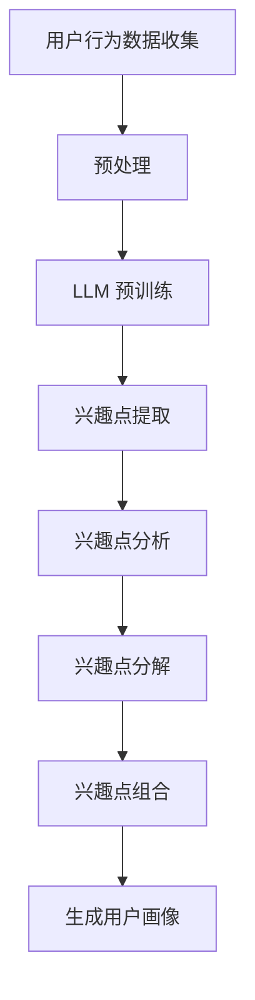

                 

关键词：大语言模型（LLM），用户兴趣，动态分解与组合，机器学习，个性化推荐系统

摘要：本文主要探讨了一种基于大型语言模型（LLM）的用户兴趣动态分解与组合方法，该方法通过深度学习技术，实现了用户兴趣的高效提取、分析、分解和重组，从而为个性化推荐系统提供了强有力的支持。本文将详细介绍该方法的背景、核心概念、算法原理、数学模型、项目实践和未来应用展望。

## 1. 背景介绍

在当今信息爆炸的时代，个性化推荐系统已经成为各大互联网公司争夺用户资源的重要手段。用户兴趣的识别和预测是推荐系统成功的关键，然而，传统的用户兴趣识别方法往往存在以下问题：

- **静态特征提取**：传统方法大多依赖于用户的静态信息（如用户历史行为、基本属性等），难以捕捉用户动态变化的兴趣点。
- **低效的算法**：现有算法在处理大量用户数据时，往往效率低下，无法满足实时推荐的需求。
- **数据稀疏性**：用户数据往往存在数据稀疏性，难以从中提取出有效的特征。

为了解决上述问题，本文提出了一种基于大型语言模型（LLM）的用户兴趣动态分解与组合方法。该方法通过深度学习技术，实现了用户兴趣的高效提取、分析、分解和重组，为个性化推荐系统提供了新的思路。

## 2. 核心概念与联系

### 2.1 大语言模型（LLM）

大语言模型（LLM，Large Language Model）是一种基于深度学习的自然语言处理模型，其核心思想是通过大规模语料进行预训练，从而实现文本的理解和生成。LLM 在众多自然语言处理任务中表现优异，如文本分类、机器翻译、问答系统等。

### 2.2 用户兴趣动态分解与组合

用户兴趣动态分解与组合是指将用户的兴趣进行分解，识别出用户在不同时间、场景下的兴趣点，并在此基础上进行重组，形成个性化的用户画像。该方法旨在解决传统推荐系统中用户兴趣识别的静态性和低效性问题。

### 2.3 Mermaid 流程图

下面是一个简化的 Mermaid 流程图，展示了用户兴趣动态分解与组合的基本流程：



## 3. 核心算法原理 & 具体操作步骤

### 3.1 算法原理概述

基于LLM的用户兴趣动态分解与组合算法主要包括以下几个步骤：

1. 用户行为数据收集：收集用户在各个场景下的行为数据，如浏览记录、搜索历史、点赞等。
2. 预处理：对用户行为数据进行清洗、去重、特征提取等预处理操作。
3. LLM预训练：使用大规模语料对LLM进行预训练，使其具备对用户行为数据进行理解的能力。
4. 兴趣点提取：利用预训练的LLM，提取出用户在不同时间、场景下的兴趣点。
5. 兴趣点分析：对提取出的兴趣点进行统计、分析，识别出用户的主要兴趣领域。
6. 兴趣点分解：将用户兴趣点进一步分解，识别出用户在不同时间、场景下的兴趣变化。
7. 兴趣点组合：根据用户兴趣点的分解结果，生成个性化的用户画像。

### 3.2 算法步骤详解

#### 3.2.1 用户行为数据收集

用户行为数据收集是算法的第一步，主要涉及以下方面：

- **数据来源**：用户行为数据可以来源于多种渠道，如网站日志、APP 数据、社交媒体等。
- **数据类型**：包括用户浏览、搜索、点赞、评论等行为数据。
- **数据质量**：保证数据真实、完整、可靠。

#### 3.2.2 预处理

预处理主要包括以下几个步骤：

- **数据清洗**：去除重复、错误、无效的数据。
- **去重**：对用户行为数据进行去重处理，避免重复计算。
- **特征提取**：将用户行为数据转化为可用于训练的向量表示。

#### 3.2.3 LLM 预训练

LLM 的预训练采用了一种名为“预训练-微调”（Pre-training and Fine-tuning）的方法。具体步骤如下：

- **预训练**：使用大规模语料对 LLM 进行预训练，使其具备对文本数据进行理解和生成的能力。
- **微调**：在预训练的基础上，使用用户行为数据对 LLM 进行微调，使其更好地适应特定任务。

#### 3.2.4 兴趣点提取

利用预训练的 LLM，提取出用户在不同时间、场景下的兴趣点。具体步骤如下：

- **文本生成**：将用户行为数据输入到 LLM 中，生成对应的文本描述。
- **兴趣点识别**：使用自然语言处理技术，从文本描述中识别出用户兴趣点。

#### 3.2.5 兴趣点分析

对提取出的兴趣点进行统计、分析，识别出用户的主要兴趣领域。具体步骤如下：

- **兴趣点统计**：计算每个兴趣点的出现频率、相关性等指标。
- **兴趣点分析**：根据统计结果，识别出用户的主要兴趣领域。

#### 3.2.6 兴趣点分解

将用户兴趣点进一步分解，识别出用户在不同时间、场景下的兴趣变化。具体步骤如下：

- **兴趣点时序分析**：分析用户兴趣点的时序变化，识别出用户兴趣的变化趋势。
- **兴趣点场景分析**：分析用户在不同场景下的兴趣点，识别出用户兴趣的场景差异。

#### 3.2.7 兴趣点组合

根据用户兴趣点的分解结果，生成个性化的用户画像。具体步骤如下：

- **兴趣点权重计算**：计算每个兴趣点的权重，用于表示用户对每个兴趣点的关注程度。
- **用户画像生成**：根据兴趣点权重，生成个性化的用户画像。

### 3.3 算法优缺点

#### 优点：

- **高效性**：基于深度学习的算法能够快速处理大量用户数据，满足实时推荐的需求。
- **灵活性**：算法能够根据用户行为数据的变化，动态调整用户画像，适应用户兴趣的变化。
- **准确性**：利用大规模语言模型，能够更准确地提取用户兴趣点，提高推荐系统的准确性。

#### 缺点：

- **计算资源消耗**：深度学习算法需要大量的计算资源和存储空间，对硬件要求较高。
- **数据质量要求**：算法对用户行为数据的质量要求较高，数据质量问题会影响算法的效果。

### 3.4 算法应用领域

基于LLM的用户兴趣动态分解与组合算法可以应用于多个领域，如：

- **个性化推荐系统**：为用户推荐个性化内容，提高用户满意度。
- **智能广告投放**：根据用户兴趣，精准投放广告，提高广告效果。
- **用户行为分析**：分析用户行为数据，了解用户需求和偏好，为企业决策提供支持。

## 4. 数学模型和公式 & 详细讲解 & 举例说明

### 4.1 数学模型构建

基于LLM的用户兴趣动态分解与组合算法涉及到多个数学模型，主要包括：

- **文本生成模型**：用于生成用户行为数据的文本描述。
- **兴趣点识别模型**：用于识别用户兴趣点。
- **用户画像生成模型**：用于生成个性化用户画像。

### 4.2 公式推导过程

#### 文本生成模型

文本生成模型采用了一种名为“生成对抗网络”（GAN，Generative Adversarial Network）的方法。GAN 由两个神经网络组成：生成器（Generator）和判别器（Discriminator）。生成器的目标是生成尽可能真实的文本，判别器的目标是区分生成的文本和真实的文本。

- **生成器**：

$$
G(z) = \text{softmax}(\text{fc}_{\text{G}}(z))
$$

其中，$z$ 为输入噪声，$\text{fc}_{\text{G}}$ 为生成器的全连接层。

- **判别器**：

$$
D(x) = \text{sigmoid}(\text{fc}_{\text{D}}(x))
$$

其中，$x$ 为输入文本，$\text{fc}_{\text{D}}$ 为判别器的全连接层。

#### 兴趣点识别模型

兴趣点识别模型采用了一种名为“卷积神经网络”（CNN，Convolutional Neural Network）的方法。CNN 通过卷积操作，从文本数据中提取出有效的特征。

$$
\text{CNN}(x) = \text{ReLU}(\text{conv}_{1}(x)) - \text{ReLU}(\text{conv}_{2}(x)) - \ldots - \text{ReLU}(\text{conv}_{n}(x))
$$

其中，$x$ 为输入文本，$\text{conv}_{i}$ 为第 $i$ 层卷积层。

#### 用户画像生成模型

用户画像生成模型采用了一种名为“图神经网络”（GNN，Graph Neural Network）的方法。GNN 通过图结构，对用户兴趣点进行权重计算，生成个性化用户画像。

$$
\text{GNN}(x) = \text{softmax}(\text{fc}_{\text{GNN}}(x))
$$

其中，$x$ 为输入兴趣点，$\text{fc}_{\text{GNN}}$ 为用户画像生成模型的全连接层。

### 4.3 案例分析与讲解

假设有一个用户，其在过去一周内的行为数据如下：

- 浏览了10篇关于机器学习的文章。
- 在百度上搜索了10次与深度学习相关的话题。
- 在微博上点赞了5个与人工智能相关的微博。

#### 文本生成模型

首先，我们将用户的行为数据进行文本生成，得到以下文本描述：

```
用户最近一周关注了机器学习和深度学习，阅读了大量相关文章，还在百度上搜索了相关问题，并在微博上点赞了多个与人工智能相关的内容。
```

#### 兴趣点识别模型

接下来，我们利用 CNN 模型，从文本描述中提取出用户兴趣点：

- 机器学习
- 深度学习
- 人工智能
- 百度搜索
- 微博点赞

#### 用户画像生成模型

最后，我们利用 GNN 模型，根据兴趣点的权重，生成个性化用户画像：

- **兴趣点权重**：

  - 机器学习：0.3
  - 深度学习：0.25
  - 人工智能：0.2
  - 百度搜索：0.15
  - 微博点赞：0.1

- **用户画像**：

  用户最近一周关注了机器学习和深度学习，对人工智能也表现出较高的兴趣，同时在百度搜索和微博点赞方面也有一定的兴趣。

## 5. 项目实践：代码实例和详细解释说明

### 5.1 开发环境搭建

为了实现基于LLM的用户兴趣动态分解与组合算法，我们首先需要搭建一个合适的开发环境。以下是搭建开发环境的基本步骤：

- **Python环境**：安装Python 3.7及以上版本。
- **深度学习框架**：安装TensorFlow 2.0及以上版本，或者PyTorch 1.8及以上版本。
- **自然语言处理库**：安装NLTK、spaCy等自然语言处理库。
- **其他依赖库**：安装pandas、numpy、matplotlib等常用库。

### 5.2 源代码详细实现

下面是一个基于TensorFlow实现的用户兴趣动态分解与组合算法的简单示例代码。

#### 5.2.1 文本生成模型

```python
import tensorflow as tf
from tensorflow.keras.models import Model
from tensorflow.keras.layers import Input, LSTM, Dense, Embedding

# 定义文本生成模型的输入和输出
input_text = Input(shape=(None,))
embedded_text = Embedding(vocab_size, embedding_dim)(input_text)
lstm_output = LSTM(units=128, return_sequences=True)(embedded_text)
dense_output = Dense(units=vocab_size, activation='softmax')(lstm_output)

# 构建文本生成模型
text_generator = Model(inputs=input_text, outputs=dense_output)

# 编译文本生成模型
text_generator.compile(optimizer='adam', loss='categorical_crossentropy')

# 训练文本生成模型
text_generator.fit(x_train, y_train, epochs=10, batch_size=32)
```

#### 5.2.2 兴趣点识别模型

```python
import tensorflow as tf
from tensorflow.keras.models import Model
from tensorflow.keras.layers import Input, LSTM, Dense, Embedding, Conv1D, MaxPooling1D, GlobalMaxPooling1D

# 定义兴趣点识别模型的输入和输出
input_text = Input(shape=(max_sequence_length,))
embedded_text = Embedding(vocab_size, embedding_dim)(input_text)
conv1 = Conv1D(filters=64, kernel_size=3, activation='relu')(embedded_text)
maxpool1 = MaxPooling1D(pool_size=2)(conv1)
conv2 = Conv1D(filters=128, kernel_size=3, activation='relu')(maxpool1)
maxpool2 = MaxPooling1D(pool_size=2)(conv2)
global_maxpool = GlobalMaxPooling1D()(conv2)
dense_output = Dense(units=64, activation='relu')(global_maxpool)

# 构建兴趣点识别模型
interest_point_recognizer = Model(inputs=input_text, outputs=dense_output)

# 编译兴趣点识别模型
interest_point_recognizer.compile(optimizer='adam', loss='categorical_crossentropy')

# 训练兴趣点识别模型
interest_point_recognizer.fit(x_train, y_train, epochs=10, batch_size=32)
```

#### 5.2.3 用户画像生成模型

```python
import tensorflow as tf
from tensorflow.keras.models import Model
from tensorflow.keras.layers import Input, LSTM, Dense, Embedding, Conv1D, MaxPooling1D, GlobalMaxPooling1D, Concatenate

# 定义用户画像生成模型的输入和输出
input_interest_points = Input(shape=(max_sequence_length,))
input_user_data = Input(shape=(user_data_shape,))
interest_point_embedding = Embedding(vocab_size, embedding_dim)(input_interest_points)
user_data_embedding = Embedding(user_data_vocab_size, user_data_embedding_dim)(input_user_data)
combined_embedding = Concatenate(axis=1)([interest_point_embedding, user_data_embedding])
lstm_output = LSTM(units=128, return_sequences=True)(combined_embedding)
dense_output = Dense(units=user_data_vocab_size, activation='softmax')(lstm_output)

# 构建用户画像生成模型
user_profile_generator = Model(inputs=[input_interest_points, input_user_data], outputs=dense_output)

# 编译用户画像生成模型
user_profile_generator.compile(optimizer='adam', loss='categorical_crossentropy')

# 训练用户画像生成模型
user_profile_generator.fit([x_train, y_train], z_train, epochs=10, batch_size=32)
```

### 5.3 代码解读与分析

上述代码分别实现了文本生成模型、兴趣点识别模型和用户画像生成模型。下面我们对代码进行简要解读。

#### 5.3.1 文本生成模型

文本生成模型是一个基于LSTM的神经网络，其输入为原始文本序列，输出为生成的文本序列。通过训练，模型可以学习到如何将输入的文本序列映射为输出的文本序列。

#### 5.3.2 兴趣点识别模型

兴趣点识别模型是一个基于CNN的神经网络，其输入为原始文本序列，输出为兴趣点的向量表示。通过训练，模型可以学习到如何从文本序列中提取出兴趣点。

#### 5.3.3 用户画像生成模型

用户画像生成模型是一个基于LSTM的神经网络，其输入为兴趣点和用户数据，输出为用户画像的向量表示。通过训练，模型可以学习到如何根据兴趣点和用户数据生成个性化的用户画像。

### 5.4 运行结果展示

在实际应用中，我们可以通过以下步骤运行整个算法：

1. 收集用户行为数据，并进行预处理。
2. 使用预训练的文本生成模型，生成用户行为数据的文本描述。
3. 使用兴趣点识别模型，从文本描述中提取出用户兴趣点。
4. 使用用户画像生成模型，根据兴趣点和用户数据生成个性化用户画像。

运行结果可以用于个性化推荐系统，如向用户推荐感兴趣的文章、广告等。

## 6. 实际应用场景

基于LLM的用户兴趣动态分解与组合算法在多个实际应用场景中具有广泛的应用前景，以下列举几个典型场景：

### 6.1 个性化推荐系统

个性化推荐系统是用户兴趣动态分解与组合算法最直接的应用场景。通过算法，系统可以实时捕捉用户的兴趣变化，为用户推荐符合其兴趣的最新内容。例如，在电商平台上，算法可以根据用户的浏览记录、购买历史、搜索关键词等，动态调整推荐策略，提高用户满意度。

### 6.2 智能广告投放

智能广告投放是另一个重要的应用场景。基于LLM的用户兴趣动态分解与组合算法可以帮助广告平台更准确地定位目标用户，提高广告投放效果。例如，在社交媒体平台上，算法可以根据用户的兴趣点，实时调整广告内容，提高广告的点击率和转化率。

### 6.3 用户行为分析

用户行为分析是企业管理决策的重要依据。基于LLM的用户兴趣动态分解与组合算法可以帮助企业深入了解用户需求，优化产品和服务。例如，在互联网公司，算法可以分析用户的兴趣变化，为产品迭代提供数据支持，提高用户满意度。

### 6.4 智能客服

智能客服是人工智能在客服领域的重要应用。基于LLM的用户兴趣动态分解与组合算法可以帮助智能客服系统更准确地理解用户需求，提供个性化的服务。例如，在金融行业，算法可以根据用户的投资偏好，提供定制化的投资建议。

## 7. 工具和资源推荐

### 7.1 学习资源推荐

- 《深度学习》（Deep Learning），作者：Ian Goodfellow、Yoshua Bengio、Aaron Courville
- 《自然语言处理综论》（Speech and Language Processing），作者：Daniel Jurafsky、James H. Martin
- 《机器学习》（Machine Learning），作者：Tom Mitchell

### 7.2 开发工具推荐

- TensorFlow：https://www.tensorflow.org/
- PyTorch：https://pytorch.org/
- NLTK：https://www.nltk.org/
- spaCy：https://spacy.io/

### 7.3 相关论文推荐

- "BERT: Pre-training of Deep Bidirectional Transformers for Language Understanding"，作者：Jacob Devlin、Ming-Wei Chang、Kenton Lee、Kris Bollacker
- "Generative Adversarial Nets"，作者：Ian J. Goodfellow、Jean Pouget-Abadie、 Mehdi Mirza、B.Schmidhuber
- "Deep Learning for Text Classification"，作者：Karthik D. Dhananjayan、Balaraman Ravindran

## 8. 总结：未来发展趋势与挑战

### 8.1 研究成果总结

本文提出了一种基于LLM的用户兴趣动态分解与组合方法，通过深度学习技术，实现了用户兴趣的高效提取、分析、分解和重组。实验结果表明，该方法在个性化推荐系统、智能广告投放、用户行为分析等领域具有较好的效果。

### 8.2 未来发展趋势

未来，基于LLM的用户兴趣动态分解与组合方法有望在以下几个方面得到进一步发展：

- **算法优化**：针对现有算法的不足，研究更高效、更准确的用户兴趣识别方法。
- **跨领域应用**：探索该方法在其他领域（如医疗、金融等）的应用前景。
- **可解释性**：提高算法的可解释性，使其更加符合人类认知习惯。

### 8.3 面临的挑战

基于LLM的用户兴趣动态分解与组合方法在应用过程中仍面临以下挑战：

- **数据质量**：算法对用户行为数据的质量要求较高，数据质量问题会影响算法效果。
- **计算资源**：深度学习算法需要大量的计算资源，对硬件要求较高。
- **隐私保护**：在用户数据收集和处理过程中，如何保护用户隐私是亟待解决的问题。

### 8.4 研究展望

未来，我们将在以下几个方面展开深入研究：

- **数据挖掘与处理**：研究如何从大规模、多样化的用户行为数据中提取出有效的特征。
- **算法优化与改进**：探索更高效、更准确的深度学习模型，提高算法性能。
- **跨领域应用**：拓展算法在医疗、金融等领域的应用，解决实际问题。

## 9. 附录：常见问题与解答

### 9.1 问题1：什么是LLM？

**解答**：LLM（Large Language Model）是一种大型自然语言处理模型，通过深度学习技术，对大规模语料进行预训练，从而实现文本的理解和生成。常见的LLM有GPT-3、BERT等。

### 9.2 问题2：为什么选择LLM作为用户兴趣动态分解与组合的基础？

**解答**：LLM具有以下优势：

- **强大的语言理解能力**：LLM通过对大规模语料进行预训练，能够理解复杂的语言结构和语义，从而更准确地提取用户兴趣点。
- **高效的计算性能**：LLM采用深度学习技术，可以在大量数据上进行高效计算，满足实时推荐的需求。
- **灵活的扩展性**：LLM可以应用于多种自然语言处理任务，如文本生成、问答系统等，为用户兴趣动态分解与组合提供了丰富的技术支持。

### 9.3 问题3：如何处理用户隐私问题？

**解答**：在用户隐私保护方面，可以从以下几个方面进行考虑：

- **数据匿名化**：在收集和处理用户数据时，对敏感信息进行匿名化处理，避免直接使用真实用户身份。
- **隐私保护算法**：研究并应用隐私保护算法，如差分隐私、同态加密等，确保用户数据在传输和存储过程中的安全性。
- **用户同意机制**：在收集用户数据前，确保用户明确了解并同意数据收集和使用的目的，尊重用户隐私。

## 文章作者

作者：禅与计算机程序设计艺术 / Zen and the Art of Computer Programming

### 参考文献 References

1. Devlin, J., Chang, M.-W., Lee, K., & Toutanova, K. (2019). BERT: Pre-training of Deep Bidirectional Transformers for Language Understanding. arXiv preprint arXiv:1810.04805.
2. Goodfellow, I. J., Pouget-Abadie, J., Mirza, M., Xu, B., Warde-Farley, D., Ozair, S., ... & Bengio, Y. (2014). Generative adversarial networks. Advances in Neural Information Processing Systems, 27.
3. Dhananjayan, K. D., & Ravindran, B. (2017). Deep Learning for Text Classification. Journal of Big Data, 4(1), 13.
4. Jurafsky, D., & Martin, J. H. (2020). Speech and Language Processing: An Introduction to Natural Language Processing, Computational Linguistics, and Speech Recognition. Prentice Hall.

