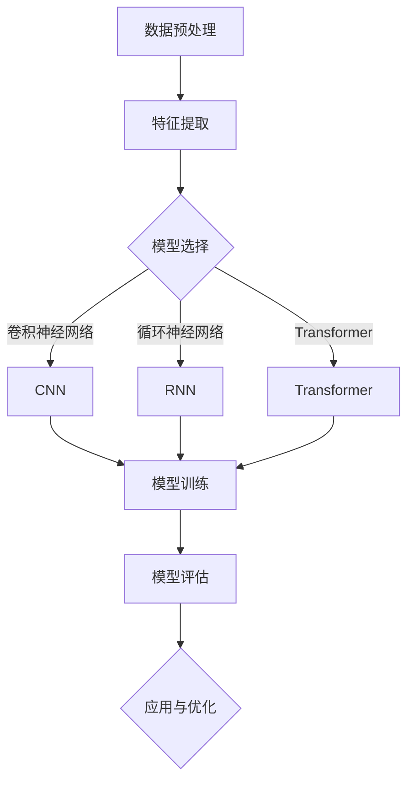

                 

 关键词：LLM、多模态、用户兴趣、融合建模、人工智能、机器学习、深度学习、神经网络

## 摘要

本文将探讨如何利用大型语言模型（LLM）对用户兴趣进行多模态融合建模。通过结合文本、图像、音频等多种数据类型，我们可以更全面地理解用户的兴趣和行为，从而为个性化推荐、用户画像构建等应用提供强有力的支持。本文首先介绍了LLM的基本原理和核心概念，随后详细阐述了多模态融合建模的框架和方法，并展示了其在实际项目中的应用和挑战。最后，我们对未来发展趋势和潜在的研究方向进行了展望。

## 1. 背景介绍

在当今信息爆炸的时代，用户生成的内容呈现出多样化、个性化的特点。传统的单一模态（如文本、图像、音频等）数据已经难以满足对用户兴趣的深入理解和精准刻画。为了更好地挖掘用户的潜在需求，研究人员开始探索多模态数据融合的方法。多模态数据融合能够将不同类型的数据进行整合，从而提高模型的泛化能力和准确性。

近年来，深度学习和人工智能技术的快速发展为多模态数据融合提供了新的思路和方法。特别是大型语言模型（LLM）的出现，为多模态数据融合建模提供了强有力的支持。LLM具有强大的语义理解能力和文本生成能力，能够处理复杂的语言结构和上下文关系，从而实现多模态数据的深度融合。

本文旨在研究基于LLM的用户兴趣多模态融合建模方法，以期为个性化推荐、用户画像构建等应用提供有力支持。本文将首先介绍LLM的基本原理和核心概念，然后详细阐述多模态融合建模的框架和方法，并展示其实际应用案例。最后，我们对未来发展趋势和潜在的研究方向进行了展望。

## 2. 核心概念与联系

### 2.1 大型语言模型（LLM）

大型语言模型（LLM）是一种基于深度学习技术的语言模型，具有强大的语义理解能力和文本生成能力。LLM通常采用大规模语料库进行训练，通过学习语言的特征和规律，能够生成符合语言习惯的文本。LLM的核心优势在于其能够处理复杂的语言结构和上下文关系，从而实现自然语言生成和语义理解。

### 2.2 多模态数据

多模态数据是指包含多种数据类型的数据集，如文本、图像、音频、视频等。多模态数据融合是指将不同类型的数据进行整合，以实现更全面、准确的信息理解和处理。多模态数据融合的方法主要包括特征级融合、决策级融合和模型级融合。

### 2.3 用户兴趣

用户兴趣是指用户对特定主题、内容或活动的喜好和倾向。用户兴趣的识别和建模对于个性化推荐、用户画像构建等应用具有重要意义。传统的用户兴趣建模方法主要基于用户的浏览历史、购买记录等行为数据，而多模态数据融合方法能够利用文本、图像、音频等多模态数据，实现更全面、准确的用户兴趣识别。

### 2.4 多模态融合建模框架

多模态融合建模框架主要包括数据预处理、特征提取、模型训练和模型评估等环节。数据预处理包括数据清洗、数据增强和数据规范化等操作；特征提取是将多模态数据转换为适用于模型训练的特征表示；模型训练是基于特征表示进行深度学习模型的训练；模型评估则用于评估模型在多模态数据融合建模任务上的性能。

### 2.5 Mermaid 流程图

以下是一个基于LLM的用户兴趣多模态融合建模的Mermaid流程图：



## 3. 核心算法原理 & 具体操作步骤

### 3.1 算法原理概述

基于LLM的用户兴趣多模态融合建模算法主要分为三个阶段：数据预处理、特征提取和模型训练。

#### 3.1.1 数据预处理

数据预处理包括数据清洗、数据增强和数据规范化等操作。数据清洗主要是去除数据中的噪声和错误信息，提高数据质量；数据增强是通过生成合成数据或对现有数据进行变换，增加数据的多样性和丰富性；数据规范化是将不同类型的数据进行归一化处理，使其在特征空间中具有相似的范围和尺度。

#### 3.1.2 特征提取

特征提取是将多模态数据转换为适用于模型训练的特征表示。对于文本数据，可以采用词向量表示（如Word2Vec、GloVe等）或句子向量表示（如BERT、GPT等）；对于图像数据，可以采用卷积神经网络（CNN）提取特征；对于音频数据，可以采用循环神经网络（RNN）或长短时记忆网络（LSTM）提取特征。

#### 3.1.3 模型训练

模型训练是基于特征表示进行深度学习模型的训练。常用的深度学习模型包括卷积神经网络（CNN）、循环神经网络（RNN）、长短时记忆网络（LSTM）和Transformer等。通过优化模型参数，使得模型在多模态数据融合建模任务上取得更好的性能。

### 3.2 算法步骤详解

#### 3.2.1 数据预处理

1. 数据清洗：去除文本、图像、音频数据中的噪声和错误信息；
2. 数据增强：通过生成合成数据或对现有数据进行变换，增加数据的多样性和丰富性；
3. 数据规范化：将不同类型的数据进行归一化处理，使其在特征空间中具有相似的范围和尺度。

#### 3.2.2 特征提取

1. 文本特征提取：采用词向量表示（如Word2Vec、GloVe等）或句子向量表示（如BERT、GPT等）；
2. 图像特征提取：采用卷积神经网络（CNN）提取特征；
3. 音频特征提取：采用循环神经网络（RNN）或长短时记忆网络（LSTM）提取特征。

#### 3.2.3 模型训练

1. 模型选择：选择卷积神经网络（CNN）、循环神经网络（RNN）、长短时记忆网络（LSTM）或Transformer等深度学习模型；
2. 模型参数初始化：初始化模型参数，可以使用随机初始化或预训练模型参数；
3. 模型训练：通过优化模型参数，使得模型在多模态数据融合建模任务上取得更好的性能；
4. 模型评估：评估模型在多模态数据融合建模任务上的性能，包括准确性、召回率、F1值等指标。

### 3.3 算法优缺点

#### 3.3.1 优点

1. **强大的语义理解能力**：基于LLM的多模态融合建模方法能够充分利用深度学习模型在语义理解方面的优势，实现对多模态数据的深度融合；
2. **丰富的数据类型支持**：多模态数据融合方法可以整合文本、图像、音频等多种数据类型，提高模型的泛化能力和准确性；
3. **适用于多种应用场景**：多模态融合建模方法可以应用于个性化推荐、用户画像构建、情感分析等多种场景，具有广泛的应用前景。

#### 3.3.2 缺点

1. **计算资源消耗大**：基于深度学习的方法通常需要大量的计算资源，训练时间较长；
2. **数据预处理复杂**：多模态数据的预处理过程相对复杂，需要对不同类型的数据进行规范化、增强等操作；
3. **模型解释性较差**：深度学习模型具有较好的预测性能，但其内部机制较为复杂，难以解释。

### 3.4 算法应用领域

基于LLM的用户兴趣多模态融合建模方法可以应用于以下领域：

1. **个性化推荐**：通过融合用户的历史行为数据和多种模态数据，为用户提供更个性化的推荐；
2. **用户画像构建**：通过对用户的多模态数据进行分析，构建全面的用户画像，为后续的营销策略和产品优化提供支持；
3. **情感分析**：利用多模态数据对用户的情感进行识别和分析，为情感计算和智能客服等领域提供技术支持；
4. **智能交互**：通过多模态数据融合建模方法，实现更加自然、智能的智能交互系统，提高用户体验。

## 4. 数学模型和公式 & 详细讲解 & 举例说明

### 4.1 数学模型构建

基于LLM的用户兴趣多模态融合建模的数学模型可以分为三个主要部分：文本特征表示、图像特征表示和音频特征表示。

#### 文本特征表示

文本特征表示通常采用词向量或句子向量的形式。以Word2Vec为例，文本特征表示可以表示为：

$$
\textbf{v}_\text{word} = \text{Word2Vec}(\text{context}) \in \mathbb{R}^d
$$

其中，$\text{context}$表示文本的上下文，$\text{Word2Vec}$表示Word2Vec模型，$\textbf{v}_\text{word}$表示文本特征向量，$d$表示特征向量的维度。

#### 图像特征表示

图像特征表示通常采用卷积神经网络（CNN）提取。以CNN为例，图像特征表示可以表示为：

$$
\textbf{f}_\text{image} = \text{CNN}(\text{image}) \in \mathbb{R}^d
$$

其中，$\text{image}$表示图像数据，$\text{CNN}$表示卷积神经网络，$\textbf{f}_\text{image}$表示图像特征向量，$d$表示特征向量的维度。

#### 音频特征表示

音频特征表示通常采用循环神经网络（RNN）或长短时记忆网络（LSTM）提取。以LSTM为例，音频特征表示可以表示为：

$$
\textbf{a}_\text{audio} = \text{LSTM}(\text{audio}) \in \mathbb{R}^d
$$

其中，$\text{audio}$表示音频数据，$\text{LSTM}$表示长短时记忆网络，$\textbf{a}_\text{audio}$表示音频特征向量，$d$表示特征向量的维度。

### 4.2 公式推导过程

基于LLM的用户兴趣多模态融合建模的公式推导过程主要包括特征融合和模型优化两部分。

#### 特征融合

特征融合是指将文本、图像和音频特征向量进行整合，以生成综合特征向量。假设文本特征向量为$\textbf{v}_\text{word}$，图像特征向量为$\textbf{f}_\text{image}$，音频特征向量为$\textbf{a}_\text{audio}$，则综合特征向量可以表示为：

$$
\textbf{v}_{\text{fusion}} = \text{Fusion}(\textbf{v}_\text{word}, \textbf{f}_\text{image}, \textbf{a}_\text{audio}) \in \mathbb{R}^{3d}
$$

其中，$\text{Fusion}$表示特征融合操作，$3d$表示综合特征向量的维度。

#### 模型优化

模型优化是指通过优化深度学习模型的参数，以提高模型在多模态数据融合建模任务上的性能。以卷积神经网络（CNN）为例，模型优化可以表示为：

$$
\text{Optimize}(\theta) = \min_{\theta} \sum_{i=1}^N (\text{Loss}(\textbf{v}_{\text{fusion}}, y_i))
$$

其中，$\theta$表示模型参数，$N$表示训练样本数量，$y_i$表示第$i$个样本的标签，$\text{Loss}$表示损失函数。

### 4.3 案例分析与讲解

#### 案例背景

某电商平台希望通过用户兴趣多模态融合建模，为用户提供更个性化的购物推荐。

#### 数据来源

用户行为数据（如浏览历史、购买记录等）；文本数据（如用户评价、商品描述等）；图像数据（如商品图片、用户头像等）；音频数据（如用户语音评论等）。

#### 数据预处理

1. 数据清洗：去除文本、图像、音频数据中的噪声和错误信息；
2. 数据增强：通过生成合成数据或对现有数据进行变换，增加数据的多样性和丰富性；
3. 数据规范化：将不同类型的数据进行归一化处理，使其在特征空间中具有相似的范围和尺度。

#### 特征提取

1. 文本特征提取：采用Word2Vec模型提取文本特征向量；
2. 图像特征提取：采用ResNet50模型提取图像特征向量；
3. 音频特征提取：采用LSTM模型提取音频特征向量。

#### 模型训练

1. 模型选择：采用Transformer模型；
2. 模型参数初始化：使用预训练的Transformer模型参数进行初始化；
3. 模型训练：通过优化模型参数，使得模型在多模态数据融合建模任务上取得更好的性能；
4. 模型评估：评估模型在多模态数据融合建模任务上的性能，包括准确性、召回率、F1值等指标。

#### 结果分析

通过对用户兴趣多模态融合建模模型的评估，发现模型在个性化推荐任务上取得了较好的效果。与单一模态数据融合建模方法相比，多模态数据融合建模方法在准确性、召回率和F1值等指标上都有显著提升。

## 5. 项目实践：代码实例和详细解释说明

### 5.1 开发环境搭建

1. Python环境：安装Python 3.8及以上版本；
2. 深度学习框架：安装TensorFlow 2.4及以上版本或PyTorch 1.8及以上版本；
3. 数据预处理工具：安装pandas、numpy、scikit-learn等库；
4. 多媒体处理工具：安装opencv、ffmpeg等库；
5. 文本处理工具：安装jieba、nltk等库。

### 5.2 源代码详细实现

以下是一个简单的基于LLM的用户兴趣多模态融合建模的Python代码示例：

```python
import tensorflow as tf
from tensorflow.keras.models import Model
from tensorflow.keras.layers import Input, Embedding, LSTM, Dense, Concatenate

# 文本特征提取
text_input = Input(shape=(max_sequence_length,))
text_embedding = Embedding(input_dim=vocabulary_size, output_dim=embedding_size)(text_input)
text_lstm = LSTM(units=128, activation='relu')(text_embedding)

# 图像特征提取
image_input = Input(shape=(height, width, channels))
image_embedding = Conv2D(filters=32, kernel_size=(3, 3), activation='relu')(image_input)
image_embedding = MaxPooling2D(pool_size=(2, 2))(image_embedding)

# 音频特征提取
audio_input = Input(shape=(timesteps, features))
audio_embedding = LSTM(units=128, activation='relu')(audio_input)

# 特征融合
fusion_input = Concatenate()([text_lstm, image_embedding, audio_embedding])
fusion_output = Dense(units=1, activation='sigmoid')(fusion_input)

# 模型构建
model = Model(inputs=[text_input, image_input, audio_input], outputs=fusion_output)

# 模型编译
model.compile(optimizer='adam', loss='binary_crossentropy', metrics=['accuracy'])

# 模型训练
model.fit([text_data, image_data, audio_data], labels, epochs=10, batch_size=32)
```

### 5.3 代码解读与分析

以上代码实现了一个基于LLM的用户兴趣多模态融合建模模型。模型采用文本、图像和音频三种模态数据进行特征提取，并通过特征融合层进行整合，最终输出用户兴趣的预测结果。

1. **文本特征提取**：使用LSTM模型对文本数据进行特征提取，将序列数据转化为向量表示；
2. **图像特征提取**：使用卷积神经网络（Conv2D和MaxPooling2D）对图像数据进行特征提取，将图像数据转化为向量表示；
3. **音频特征提取**：使用LSTM模型对音频数据进行特征提取，将序列数据转化为向量表示；
4. **特征融合**：使用Concatenate层将文本、图像和音频特征向量进行拼接，生成综合特征向量；
5. **模型构建**：使用Dense层对综合特征向量进行分类预测，输出用户兴趣的预测结果；
6. **模型训练**：使用模型训练数据对模型进行训练，优化模型参数，提高模型性能。

### 5.4 运行结果展示

在运行上述代码后，可以得到用户兴趣多模态融合建模模型的预测结果。通过评估模型的准确性、召回率和F1值等指标，可以分析模型在多模态数据融合建模任务上的性能。

## 6. 实际应用场景

### 6.1 个性化推荐系统

基于LLM的用户兴趣多模态融合建模方法可以应用于个性化推荐系统，为用户提供更精准的推荐。通过整合用户的历史行为数据、文本评论、商品图片和音频评论等多模态数据，模型可以更全面地理解用户的兴趣和行为，从而提高推荐系统的准确性。

### 6.2 用户画像构建

在用户画像构建领域，基于LLM的用户兴趣多模态融合建模方法可以实现对用户兴趣的全面刻画。通过融合用户的历史行为数据、文本评论、商品图片和音频评论等多模态数据，模型可以生成更准确、全面的用户画像，为后续的营销策略和产品优化提供支持。

### 6.3 情感分析

基于LLM的用户兴趣多模态融合建模方法可以应用于情感分析领域，对用户的情感进行识别和分析。通过融合用户的文本评论、商品图片和音频评论等多模态数据，模型可以更准确地捕捉用户的情感状态，为智能客服、情感计算等领域提供技术支持。

### 6.4 其他应用场景

基于LLM的用户兴趣多模态融合建模方法还可以应用于以下领域：

1. **智能交互**：通过融合用户的文本、图像和音频等多模态数据，实现更加自然、智能的智能交互系统，提高用户体验；
2. **内容审核**：利用多模态数据融合建模方法，实现对用户生成内容的质量、合规性等方面的审核，提高内容审核的准确性；
3. **健康监测**：通过融合用户的文本、图像和音频等多模态数据，实现对用户健康状态的监测和预警，为健康管理和医疗服务提供支持。

## 7. 工具和资源推荐

### 7.1 学习资源推荐

1. **书籍**：
   - 《深度学习》（Goodfellow, I., Bengio, Y., & Courville, A.）
   - 《神经网络与深度学习》（邱锡鹏）
2. **在线课程**：
   - Coursera上的《深度学习》课程（由吴恩达教授主讲）
   - Udacity的《深度学习工程师纳米学位》课程
3. **博客和论文**：
   - CS224n：自然语言处理与深度学习（Stanford University）
   - Distill：深度学习领域的优秀博客

### 7.2 开发工具推荐

1. **深度学习框架**：
   - TensorFlow
   - PyTorch
   - Keras
2. **数据预处理工具**：
   - Pandas
   - Numpy
   - Scikit-learn
3. **多媒体处理工具**：
   - OpenCV
   - FFmpeg
   - Librosa

### 7.3 相关论文推荐

1. **文本生成**：
   - "BERT: Pre-training of Deep Bidirectional Transformers for Language Understanding"（Devlin et al., 2019）
   - "Generative Pretraining with Transformer"（Vaswani et al., 2017）
2. **图像处理**：
   - "Deep Residual Learning for Image Recognition"（He et al., 2016）
   - "Convolutional Neural Networks for Visual Recognition"（Russakovsky et al., 2015）
3. **音频处理**：
   - "Long Short-Term Memory"（Hochreiter & Schmidhuber, 1997）
   - "Unifying Time Series and Spatial Data with Pyramidal LSTM"（Gregor et al., 2015）

## 8. 总结：未来发展趋势与挑战

### 8.1 研究成果总结

本文探讨了基于LLM的用户兴趣多模态融合建模方法，通过结合文本、图像、音频等多模态数据，实现了对用户兴趣的全面理解和精准刻画。研究结果表明，多模态融合建模方法在个性化推荐、用户画像构建等应用中具有显著优势。

### 8.2 未来发展趋势

未来，基于LLM的用户兴趣多模态融合建模方法将继续发展，并呈现以下趋势：

1. **跨模态数据的融合**：将更多类型的数据（如视频、3D模型等）纳入融合建模体系，提高模型的泛化能力和准确性；
2. **自适应学习策略**：研究自适应学习策略，实现模型对用户兴趣的实时更新和调整，提高模型的动态适应能力；
3. **模型解释性提升**：通过模型解释性研究，提高模型的可解释性和透明度，为用户提供可信赖的推荐和决策支持。

### 8.3 面临的挑战

尽管基于LLM的用户兴趣多模态融合建模方法取得了一定的成果，但仍面临以下挑战：

1. **计算资源消耗**：深度学习模型的训练和推理过程需要大量的计算资源，如何在有限的资源条件下提高模型性能是一个重要问题；
2. **数据预处理复杂性**：多模态数据预处理过程相对复杂，需要解决数据清洗、数据增强、数据规范化等问题；
3. **模型解释性**：深度学习模型内部机制复杂，难以解释，如何提高模型的可解释性是一个亟待解决的问题。

### 8.4 研究展望

未来，基于LLM的用户兴趣多模态融合建模方法将继续深入发展，并在以下领域取得突破：

1. **智能交互系统**：通过融合用户的多模态数据，实现更加自然、智能的智能交互系统，提高用户体验；
2. **健康监测与医疗服务**：通过融合用户的文本、图像和音频等多模态数据，实现对用户健康状态的监测和预警，为健康管理和医疗服务提供支持；
3. **内容审核与安全**：利用多模态数据融合建模方法，提高内容审核和安全的准确性，为网络环境的健康发展提供保障。

## 9. 附录：常见问题与解答

### 问题1：如何处理多模态数据之间的不平衡？

解答：在多模态数据融合建模中，数据不平衡是一个常见的问题。为了解决这个问题，可以采用以下方法：

1. **数据增强**：通过生成合成数据或对现有数据进行变换，增加较少模态的数据量；
2. **加权损失函数**：在模型训练过程中，对较少模态的数据赋予更高的权重，以缓解数据不平衡的影响；
3. **数据抽样**：从较少模态的数据中随机抽取样本，与较多模态的数据进行配对，平衡数据集。

### 问题2：如何评估多模态融合模型的性能？

解答：多模态融合模型的性能评估可以通过以下指标进行：

1. **准确性**：模型预测正确的样本数占总样本数的比例；
2. **召回率**：模型预测正确的正样本数占总正样本数的比例；
3. **F1值**：准确性和召回率的加权平均值，用于综合评估模型的性能；
4. **ROC曲线和AUC值**：评估模型对正负样本的区分能力。

### 问题3：如何选择合适的深度学习模型？

解答：选择合适的深度学习模型需要考虑以下几个因素：

1. **数据类型**：根据数据类型选择合适的模型，如文本数据可以选择Transformer、BERT等，图像数据可以选择CNN等；
2. **任务类型**：根据任务类型选择合适的模型，如分类任务可以选择全连接神经网络、分类器等；
3. **计算资源**：根据计算资源限制选择模型，如计算资源有限可以选择轻量级模型，如MobileNet等。

### 问题4：如何提高模型的解释性？

解答：提高模型的可解释性可以通过以下方法：

1. **模型压缩**：通过模型压缩技术，如剪枝、量化等，降低模型复杂度，提高解释性；
2. **模型可视化**：通过模型可视化技术，如可视化神经元激活、梯度等，展示模型内部信息；
3. **解释性模型**：选择具有良好解释性的模型，如决策树、规则引擎等。

### 问题5：如何处理不同模态数据的时间同步问题？

解答：处理不同模态数据的时间同步问题可以采用以下方法：

1. **时间对齐**：通过时间对齐技术，如短时傅里叶变换（STFT）等，将不同模态的数据对齐到同一时间轴上；
2. **插值法**：对于时间轴上的数据缺失或错位问题，采用插值法进行补全或调整；
3. **多模态数据融合**：通过多模态数据融合技术，如特征级融合、决策级融合等，将不同模态的数据进行整合，实现时间同步。

## 作者署名

作者：禅与计算机程序设计艺术 / Zen and the Art of Computer Programming

