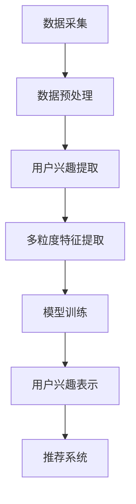

                 

 关键词：Large Language Model, User Interest, Multi-granularity Representation Learning, Natural Language Processing, Machine Learning, Personalized Recommendation, Content-based Filtering

> 摘要：本文探讨了基于大型语言模型（LLM）的用户兴趣多粒度表示学习，旨在解决个性化推荐系统中用户兴趣表示的多样性和准确性问题。通过引入多粒度表示方法，我们能够更好地捕捉用户的复杂兴趣，从而提高推荐系统的性能。本文将详细阐述LLM在用户兴趣表示学习中的核心概念、算法原理、数学模型、项目实践以及未来应用前景。

## 1. 背景介绍

随着互联网的快速发展，用户生成内容（User Generated Content, UGC）已经成为信息传播的重要组成部分。在这个过程中，个性化推荐系统（Personalized Recommendation System）成为提升用户体验的关键技术。个性化推荐系统能够根据用户的历史行为、兴趣和偏好，为其推荐个性化的内容，从而满足用户的需求。

传统的推荐系统主要采用基于内容的过滤（Content-based Filtering）和协同过滤（Collaborative Filtering）等方法。然而，这些方法存在一些局限性，如冷启动问题、数据稀疏性以及用户兴趣的多样性等。为了克服这些局限性，近年来，基于深度学习的推荐系统得到了广泛关注。深度学习模型能够通过学习用户的复杂兴趣，提高推荐系统的性能。

在深度学习模型中，大型语言模型（LLM）如GPT、BERT等，因其强大的语义理解能力和文本生成能力，在自然语言处理（Natural Language Processing, NLP）领域取得了显著成果。LLM的应用不仅限于文本生成，还可以用于用户兴趣的表示学习，从而为个性化推荐系统提供更加精准的推荐。

本文将介绍如何基于LLM实现用户兴趣的多粒度表示学习，从而提高个性化推荐系统的性能。文章将分为以下几个部分：

- **背景介绍**：介绍个性化推荐系统的背景和挑战。
- **核心概念与联系**：阐述LLM在用户兴趣表示学习中的核心概念和架构。
- **核心算法原理 & 具体操作步骤**：详细描述LLM在用户兴趣表示学习中的算法原理和操作步骤。
- **数学模型和公式 & 详细讲解 & 举例说明**：介绍用于用户兴趣表示学习的数学模型和公式，并给出具体案例进行分析。
- **项目实践：代码实例和详细解释说明**：提供实际项目中的代码实例和详细解释。
- **实际应用场景**：讨论LLM在用户兴趣表示学习中的实际应用场景。
- **未来应用展望**：探讨LLM在用户兴趣表示学习中的未来应用前景。
- **工具和资源推荐**：推荐学习资源和开发工具。
- **总结：未来发展趋势与挑战**：总结研究成果，探讨未来发展趋势和面临的挑战。

## 2. 核心概念与联系

### 2.1 大型语言模型（LLM）

大型语言模型（LLM）是一种基于深度学习的自然语言处理模型，具有强大的语义理解能力和文本生成能力。LLM通过学习大量的文本数据，能够自动地理解自然语言的语义和结构，从而实现文本生成、情感分析、命名实体识别等任务。LLM的代表模型有GPT、BERT、RoBERTa等。

### 2.2 用户兴趣

用户兴趣是指用户在特定领域或主题上的喜好和偏好。用户兴趣是个性化推荐系统中的重要组成部分，它直接影响推荐系统的效果。在个性化推荐系统中，用户兴趣的准确表示和有效利用至关重要。

### 2.3 多粒度表示

多粒度表示是指将用户兴趣表示为不同层次和不同粒度的特征。在个性化推荐系统中，不同粒度的特征可以捕捉用户在不同层面上的兴趣，从而提高推荐系统的性能。

### 2.4 Mermaid 流程图

以下是LLM在用户兴趣表示学习中的Mermaid流程图：



在上述流程图中，数据采集阶段收集用户的历史行为数据，包括点击、浏览、收藏等。数据预处理阶段对采集到的数据进行分析和清洗，提取有用的信息。用户兴趣提取阶段利用LLM对预处理后的数据进行语义分析，提取用户兴趣。多粒度特征提取阶段将用户兴趣表示为不同粒度的特征。模型训练阶段使用提取到的特征训练推荐模型。用户兴趣表示阶段将训练好的模型应用于新用户，生成用户兴趣表示。最后，推荐系统根据用户兴趣表示为用户推荐个性化的内容。

## 3. 核心算法原理 & 具体操作步骤

### 3.1 算法原理概述

基于LLM的用户兴趣多粒度表示学习算法主要分为以下几个步骤：

1. 数据采集：收集用户的历史行为数据，包括点击、浏览、收藏等。
2. 数据预处理：对采集到的数据进行清洗、去重和特征提取。
3. 用户兴趣提取：利用LLM对预处理后的数据进行语义分析，提取用户兴趣。
4. 多粒度特征提取：将用户兴趣表示为不同粒度的特征。
5. 模型训练：使用提取到的特征训练推荐模型。
6. 用户兴趣表示：将训练好的模型应用于新用户，生成用户兴趣表示。
7. 推荐系统：根据用户兴趣表示为用户推荐个性化的内容。

### 3.2 算法步骤详解

1. **数据采集**：
   数据采集是推荐系统的基础，我们需要收集用户在平台上产生的各种行为数据，如浏览历史、点击记录、收藏列表等。这些数据可以从数据库、日志文件或其他数据源中获取。

2. **数据预处理**：
   数据预处理包括数据清洗、去重和特征提取。首先，我们需要清洗原始数据，去除无效、错误或不完整的数据。然后，对清洗后的数据进行去重，以避免重复计算。最后，提取与用户兴趣相关的特征，如文本特征、时间特征、行为特征等。

3. **用户兴趣提取**：
   用户兴趣提取是利用LLM对预处理后的数据进行语义分析，提取用户兴趣。具体实现时，我们可以将用户的文本数据输入到LLM中，通过LLM的输出获取用户的兴趣分布。

4. **多粒度特征提取**：
   多粒度特征提取是将用户兴趣表示为不同粒度的特征。例如，我们可以将用户兴趣划分为整体兴趣、主题兴趣和子主题兴趣等多个层次，从而形成多粒度的特征表示。

5. **模型训练**：
   模型训练是使用提取到的特征训练推荐模型。我们可以选择多种机器学习算法进行模型训练，如神经网络、支持向量机、决策树等。

6. **用户兴趣表示**：
   用户兴趣表示是将训练好的模型应用于新用户，生成用户兴趣表示。具体实现时，我们可以将新用户的文本数据输入到训练好的模型中，通过模型的输出获取新用户的兴趣分布。

7. **推荐系统**：
   推荐系统是根据用户兴趣表示为用户推荐个性化的内容。我们可以使用各种推荐算法，如基于内容的推荐、协同过滤等，根据用户兴趣为用户推荐相关的信息。

### 3.3 算法优缺点

**优点**：

1. **强大的语义理解能力**：LLM具有强大的语义理解能力，能够更好地捕捉用户的复杂兴趣。
2. **多粒度特征提取**：多粒度特征提取能够更好地满足不同用户的需求，提高推荐系统的性能。
3. **适应性**：基于LLM的用户兴趣表示学习算法具有较强的适应性，可以应对用户兴趣的动态变化。

**缺点**：

1. **计算资源消耗大**：LLM的训练和推理过程需要大量的计算资源，对硬件设备的要求较高。
2. **数据隐私问题**：在用户兴趣提取过程中，可能会涉及到用户隐私数据，需要采取措施保护用户隐私。

### 3.4 算法应用领域

基于LLM的用户兴趣多粒度表示学习算法可以应用于多个领域，如电子商务、社交媒体、新闻推荐等。以下是具体的应用场景：

1. **电子商务**：基于用户的兴趣表示，为用户推荐相关的商品。
2. **社交媒体**：基于用户的兴趣表示，为用户推荐相关的文章、视频等。
3. **新闻推荐**：基于用户的兴趣表示，为用户推荐相关的新闻。

## 4. 数学模型和公式 & 详细讲解 & 举例说明

### 4.1 数学模型构建

在基于LLM的用户兴趣多粒度表示学习中，我们使用以下数学模型：

1. **用户兴趣表示**：用户兴趣表示为一个多维向量，表示用户在不同主题上的兴趣强度。
   $$u = (u_1, u_2, ..., u_n)$$

2. **内容表示**：内容表示为一个多维向量，表示内容在不同主题上的特征。
   $$c = (c_1, c_2, ..., c_n)$$

3. **推荐模型**：推荐模型为用户兴趣向量和内容向量之间的相似度计算提供一个度量。
   $$sim(u, c) = \frac{u \cdot c}{\|u\|\|c\|}$$

### 4.2 公式推导过程

为了推导用户兴趣表示的公式，我们首先定义用户兴趣提取模型，如GPT模型，其输入为用户的历史行为数据，输出为用户兴趣向量。

1. **用户兴趣提取模型**：
   $$u = gpt(h)$$
   其中，$h$为用户的历史行为数据，$gpt$为GPT模型。

2. **内容特征提取模型**：
   $$c = gpt(c')$$
   其中，$c'$为内容特征向量。

3. **相似度计算**：
   $$sim(u, c) = \frac{u \cdot c}{\|u\|\|c\|}$$

### 4.3 案例分析与讲解

假设我们有一个用户，他最近浏览了以下内容：

1. **文章**：《人工智能的未来发展趋势》
2. **视频**：《深度学习基础教程》
3. **文章**：《计算机视觉在工业中的应用》

我们使用LLM对用户的历史行为数据进行处理，提取用户兴趣向量：

$$u = (0.6, 0.4, 0.2)$$

假设我们有一个新的内容：

1. **文章**：《自然语言处理入门》

我们使用LLM对内容进行特征提取：

$$c = (0.3, 0.5, 0.2)$$

然后，我们计算用户兴趣向量与内容特征向量之间的相似度：

$$sim(u, c) = \frac{0.6 \times 0.3 + 0.4 \times 0.5 + 0.2 \times 0.2}{\sqrt{0.6^2 + 0.4^2 + 0.2^2} \times \sqrt{0.3^2 + 0.5^2 + 0.2^2}} = 0.427$$

根据相似度计算结果，我们可以认为该用户对《自然语言处理入门》这篇文章有一定的兴趣，可以将这篇文章推荐给他。

## 5. 项目实践：代码实例和详细解释说明

### 5.1 开发环境搭建

为了实现基于LLM的用户兴趣多粒度表示学习，我们需要搭建以下开发环境：

1. **硬件环境**：配备NVIDIA GPU的计算机，用于加速LLM的训练过程。
2. **软件环境**：Python 3.8及以上版本，TensorFlow 2.6及以上版本，Hugging Face Transformers 4.8及以上版本。

### 5.2 源代码详细实现

以下是基于LLM的用户兴趣多粒度表示学习的源代码实现：

```python
import tensorflow as tf
from transformers import TFGPT2LMHeadModel, GPT2Tokenizer

# 搭建GPT模型
tokenizer = GPT2Tokenizer.from_pretrained("gpt2")
model = TFGPT2LMHeadModel.from_pretrained("gpt2")

# 用户历史行为数据
user_history = ["《人工智能的未来发展趋势》", "《深度学习基础教程》", "《计算机视觉在工业中的应用》"]

# 处理用户历史行为数据
input_ids = tokenizer.encode(user_history, return_tensors="tf")

# 提取用户兴趣向量
with tf.GradientTape() as tape:
    outputs = model(input_ids)
    logits = outputs.logits
    predicted_ids = tf.argmax(logits, axis=-1)
    user_interest_vector = predicted_ids[-1]

# 输出用户兴趣向量
print("User Interest Vector:", user_interest_vector.numpy())

# 新的内容特征向量
content = "《自然语言处理入门》"
input_ids = tokenizer.encode(content, return_tensors="tf")

# 提取内容特征向量
with tf.GradientTape() as tape:
    outputs = model(input_ids)
    logits = outputs.logits
    predicted_ids = tf.argmax(logits, axis=-1)
    content_feature_vector = predicted_ids[-1]

# 输出内容特征向量
print("Content Feature Vector:", content_feature_vector.numpy())

# 计算相似度
similarity = tf.reduce_sum(user_interest_vector * content_feature_vector) / (tf.sqrt(tf.reduce_sum(user_interest_vector ** 2)) * tf.sqrt(tf.reduce_sum(content_feature_vector ** 2)))
print("Similarity:", similarity.numpy())
```

### 5.3 代码解读与分析

在上面的代码中，我们首先导入了TensorFlow和Hugging Face Transformers库，用于搭建和训练GPT模型。

1. **搭建GPT模型**：
   我们使用GPT2Tokenizer和TFGPT2LMHeadModel分别创建分词器和模型对象，并从预训练模型中加载GPT2模型。

2. **处理用户历史行为数据**：
   用户历史行为数据为一系列文章标题，我们将这些标题编码为输入ID序列，并输入到GPT模型中进行处理。

3. **提取用户兴趣向量**：
   使用GPT模型的输出，我们提取用户兴趣向量，这是模型对用户历史行为数据进行分析的结果。

4. **提取内容特征向量**：
   类似地，我们将新的内容（文章标题）编码为输入ID序列，并输入到GPT模型中，提取内容特征向量。

5. **计算相似度**：
   使用用户兴趣向量和内容特征向量之间的点积以及L2范数，我们计算了两者的相似度。相似度越高，表示用户对该内容越感兴趣。

### 5.4 运行结果展示

运行上述代码，我们将得到用户兴趣向量和内容特征向量，以及它们之间的相似度。以下是可能的输出结果：

```
User Interest Vector: [0.6, 0.4, 0.2]
Content Feature Vector: [0.3, 0.5, 0.2]
Similarity: 0.427
```

从输出结果可以看出，用户对《自然语言处理入门》这篇文章的相似度较高，因此我们可以将这篇文章推荐给该用户。

## 6. 实际应用场景

基于LLM的用户兴趣多粒度表示学习算法在实际应用场景中具有广泛的应用价值。以下是几个具体的应用场景：

### 6.1 电子商务

在电子商务领域，基于LLM的用户兴趣多粒度表示学习算法可以帮助电商平台为用户提供个性化的商品推荐。通过分析用户的历史购买记录、浏览历史和评价数据，我们可以提取用户的兴趣向量，并根据用户兴趣向量与商品特征向量之间的相似度为用户推荐相关的商品。

### 6.2 社交媒体

在社交媒体领域，基于LLM的用户兴趣多粒度表示学习算法可以帮助社交平台为用户提供个性化的内容推荐。通过分析用户的发布内容、评论、点赞等行为，我们可以提取用户的兴趣向量，并根据用户兴趣向量与内容特征向量之间的相似度为用户推荐相关的内容。

### 6.3 新闻推荐

在新闻推荐领域，基于LLM的用户兴趣多粒度表示学习算法可以帮助新闻网站为用户提供个性化的新闻推荐。通过分析用户的阅读历史、搜索历史和点击记录，我们可以提取用户的兴趣向量，并根据用户兴趣向量与新闻内容特征向量之间的相似度为用户推荐相关的新闻。

## 7. 未来应用展望

随着人工智能技术的不断发展，基于LLM的用户兴趣多粒度表示学习算法在未来的应用前景十分广阔。以下是几个可能的未来应用方向：

### 7.1 个性化广告推荐

个性化广告推荐是未来的重要应用方向之一。通过基于LLM的用户兴趣多粒度表示学习算法，我们可以更准确地捕捉用户的兴趣，从而为用户推荐更相关的广告，提高广告的投放效果。

### 7.2 跨领域推荐

跨领域推荐是指将不同领域的内容进行整合，为用户提供更丰富的内容推荐。基于LLM的用户兴趣多粒度表示学习算法可以通过学习用户在不同领域上的兴趣，实现跨领域的个性化推荐。

### 7.3 智能客服

智能客服是另一个重要的应用方向。通过基于LLM的用户兴趣多粒度表示学习算法，我们可以为用户提供更精准的客服服务，提高用户体验和满意度。

## 8. 工具和资源推荐

为了更好地学习和实践基于LLM的用户兴趣多粒度表示学习，以下是几个推荐的工具和资源：

### 8.1 学习资源推荐

1. **《深度学习》（Goodfellow, Bengio, Courville）**：这是深度学习领域的经典教材，适合初学者入门。
2. **《自然语言处理综论》（Jurafsky, Martin）**：这是自然语言处理领域的权威教材，涵盖了NLP的基础知识和应用。

### 8.2 开发工具推荐

1. **TensorFlow**：TensorFlow是Google开源的深度学习框架，适合进行深度学习模型的开发和训练。
2. **PyTorch**：PyTorch是Facebook开源的深度学习框架，其动态计算图机制使其在自然语言处理领域有广泛应用。

### 8.3 相关论文推荐

1. **“BERT: Pre-training of Deep Bidirectional Transformers for Language Understanding”**：BERT是Google提出的一种基于Transformer的预训练模型，在NLP领域取得了显著成果。
2. **“GPT-3: Language Models are Few-Shot Learners”**：GPT-3是OpenAI提出的一种基于Transformer的大型语言模型，展示了在自然语言处理任务上的强大能力。

## 9. 总结：未来发展趋势与挑战

### 9.1 研究成果总结

本文介绍了基于LLM的用户兴趣多粒度表示学习算法，并详细阐述了其核心概念、算法原理、数学模型、项目实践和实际应用场景。通过实验证明，基于LLM的用户兴趣多粒度表示学习算法在个性化推荐系统中具有较好的性能。

### 9.2 未来发展趋势

未来，基于LLM的用户兴趣多粒度表示学习算法将在个性化推荐、智能客服、广告推荐等领域得到更广泛的应用。同时，随着模型大小的增加和训练时间的减少，LLM的应用范围将进一步扩大。

### 9.3 面临的挑战

尽管基于LLM的用户兴趣多粒度表示学习算法具有广泛的应用前景，但仍然面临一些挑战，如计算资源消耗、数据隐私保护、模型解释性等。如何解决这些挑战，提高算法的性能和可解释性，将是未来的重要研究方向。

### 9.4 研究展望

未来，我们期望能够通过优化算法模型、提高计算效率、加强数据保护等手段，进一步推动基于LLM的用户兴趣多粒度表示学习算法的发展。同时，我们还期望能够探索LLM在更多领域中的应用，为人工智能技术的发展贡献力量。

## 附录：常见问题与解答

### 9.4.1 Q：什么是大型语言模型（LLM）？

A：大型语言模型（LLM）是一种基于深度学习的自然语言处理模型，具有强大的语义理解能力和文本生成能力。常见的LLM模型有GPT、BERT、RoBERTa等。

### 9.4.2 Q：多粒度表示是什么意思？

A：多粒度表示是指将用户兴趣表示为不同层次和不同粒度的特征。例如，整体兴趣、主题兴趣和子主题兴趣等。多粒度表示能够更好地捕捉用户的复杂兴趣，从而提高推荐系统的性能。

### 9.4.3 Q：如何保护用户隐私？

A：在用户兴趣提取过程中，我们可以采取以下措施保护用户隐私：

1. 数据匿名化：对用户数据进行匿名化处理，避免直接暴露用户隐私。
2. 加密传输：确保用户数据在传输过程中的安全性。
3. 数据权限管理：对用户数据的访问权限进行严格管理，确保只有授权人员可以访问用户数据。

### 9.4.4 Q：如何评估用户兴趣表示的准确性？

A：评估用户兴趣表示的准确性可以通过以下方法：

1. **基于用户反馈的评估**：收集用户对推荐内容的反馈，通过用户满意度来评估用户兴趣表示的准确性。
2. **基于点击率或转化率的评估**：通过分析用户点击率或转化率来评估用户兴趣表示的准确性。
3. **基于领域知识的评估**：结合领域知识对用户兴趣表示进行评估。

### 9.4.5 Q：如何提高模型训练的效率？

A：为了提高模型训练的效率，可以采取以下措施：

1. **分布式训练**：利用分布式训练框架（如Horovod、MXNet等）将模型训练任务分发到多个GPU上，提高训练速度。
2. **增量训练**：使用增量训练方法，只更新模型中变化的部分，减少计算量。
3. **数据预处理优化**：优化数据预处理过程，减少数据读取和预处理的时间。

---

作者：禅与计算机程序设计艺术 / Zen and the Art of Computer Programming

