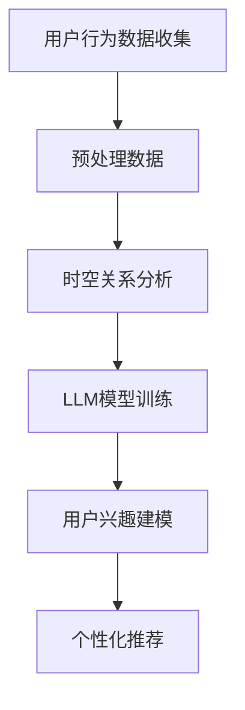

                 

关键词：LLM，用户兴趣，时空动态建模，人工智能，个性化推荐，动态调整，实时反馈

> 摘要：本文探讨了如何利用大型语言模型（LLM）构建一个能够实时动态调整用户兴趣的时空模型。通过分析用户行为数据，本文提出了一个基于时空关系的用户兴趣建模方法，旨在为用户提供更加精准和个性化的推荐服务。

## 1. 背景介绍

在信息爆炸的时代，个性化推荐系统已经成为各大互联网公司提升用户体验的重要手段。这些系统通过分析用户的历史行为数据，预测用户的兴趣，并推荐相应的内容。然而，用户兴趣是动态变化的，如何有效地捕捉并动态调整用户兴趣，成为个性化推荐系统面临的重大挑战。

近年来，大型语言模型（Large Language Model，简称LLM）的兴起，为处理自然语言数据带来了新的契机。LLM，如GPT-3、BERT等，通过学习大量的文本数据，具备了强大的语义理解和生成能力。这一特性使得LLM在用户兴趣建模中具有巨大的潜力。

本文旨在探讨如何利用LLM构建一个能够实时动态调整用户兴趣的时空模型。通过分析用户行为数据，我们提出了一个基于时空关系的用户兴趣建模方法，旨在为用户提供更加精准和个性化的推荐服务。

## 2. 核心概念与联系

为了构建一个有效的用户兴趣时空模型，我们需要明确以下几个核心概念：

### 2.1 用户兴趣

用户兴趣是指用户对特定主题或内容的偏好。在个性化推荐系统中，用户兴趣是核心驱动力，决定了推荐系统的输出。

### 2.2 时空关系

时空关系是指用户兴趣在不同时间和空间上的变化规律。用户兴趣不仅受时间的影响，还受到地理位置的影响。

### 2.3 大型语言模型（LLM）

LLM是一种能够处理和理解自然语言数据的人工智能模型。它通过对大量文本数据进行学习，能够生成具有逻辑性和语义性的自然语言文本。

下面是一个Mermaid流程图，展示了用户兴趣时空动态建模的基本流程：



## 3. 核心算法原理 & 具体操作步骤

### 3.1 算法原理概述

基于LLM的用户兴趣时空动态建模方法主要包括以下几个步骤：

1. **用户行为数据收集**：通过分析用户的历史行为数据，如浏览记录、搜索历史、购买记录等，收集用户兴趣相关信息。
2. **预处理数据**：对收集到的用户行为数据进行清洗、去重、特征提取等预处理操作。
3. **时空关系分析**：分析用户兴趣在不同时间和空间上的变化规律，构建时空关系模型。
4. **LLM模型训练**：利用预处理后的用户行为数据，训练LLM模型，使其能够理解用户兴趣的时空变化规律。
5. **用户兴趣建模**：基于LLM模型，构建用户兴趣时空模型，预测用户未来的兴趣点。
6. **个性化推荐**：根据用户兴趣时空模型，为用户推荐相应的内容。

### 3.2 算法步骤详解

#### 3.2.1 用户行为数据收集

用户行为数据收集是整个建模过程的基础。我们可以通过以下几种方式收集用户行为数据：

- **浏览记录**：收集用户在网站、APP等平台上的浏览历史，包括浏览时间、浏览内容等。
- **搜索历史**：收集用户在搜索引擎上的搜索记录，包括搜索关键词、搜索时间等。
- **购买记录**：收集用户在电商平台上的购买记录，包括购买时间、购买商品等。

#### 3.2.2 预处理数据

预处理数据包括以下步骤：

- **数据清洗**：去除重复、错误、缺失的数据，保证数据质量。
- **特征提取**：将原始数据转换为特征向量，以便于后续分析。例如，可以将浏览记录转换为用户-商品矩阵。
- **数据归一化**：对特征向量进行归一化处理，消除不同特征之间的量纲差异。

#### 3.2.3 时空关系分析

时空关系分析旨在揭示用户兴趣在不同时间和空间上的变化规律。具体步骤如下：

- **时间序列分析**：分析用户行为数据的时间序列特性，识别用户兴趣随时间的变化趋势。
- **空间分布分析**：分析用户行为数据的地理位置特性，识别用户兴趣的空间分布情况。

#### 3.2.4 LLM模型训练

LLM模型训练是整个算法的核心。我们选择一个适合处理自然语言数据的LLM模型，如GPT-3，并利用预处理后的用户行为数据进行训练。训练过程主要包括以下几个步骤：

- **数据预处理**：将用户行为数据转换为文本格式，以便于LLM模型处理。
- **训练模型**：利用预处理后的数据，训练LLM模型，使其能够理解用户兴趣的时空变化规律。
- **模型优化**：通过调整模型参数，优化模型性能。

#### 3.2.5 用户兴趣建模

基于训练好的LLM模型，我们可以构建用户兴趣时空模型。具体步骤如下：

- **兴趣预测**：利用LLM模型，预测用户未来的兴趣点，包括时间维度和空间维度。
- **兴趣调整**：根据用户实时行为数据，动态调整用户兴趣模型。

#### 3.2.6 个性化推荐

根据用户兴趣时空模型，我们可以为用户推荐相应的内容。具体步骤如下：

- **推荐生成**：根据用户兴趣模型，生成个性化推荐列表。
- **推荐调整**：根据用户实时反馈，动态调整推荐结果。

### 3.3 算法优缺点

#### 3.3.1 优点

- **强大的语义理解能力**：LLM模型能够处理和理解自然语言数据，能够准确捕捉用户兴趣的语义特征。
- **动态调整能力**：基于实时用户行为数据，算法能够动态调整用户兴趣模型，提供更加个性化的推荐服务。
- **时空关系分析**：算法能够揭示用户兴趣在不同时间和空间上的变化规律，为个性化推荐提供有力支持。

#### 3.3.2 缺点

- **数据依赖性**：算法性能高度依赖于用户行为数据的质量和数量。
- **计算成本**：LLM模型训练和预测过程需要大量的计算资源，可能导致较高的计算成本。

### 3.4 算法应用领域

基于LLM的用户兴趣时空动态建模方法可以广泛应用于以下领域：

- **个性化推荐系统**：为用户提供个性化的内容推荐，提升用户体验。
- **广告投放**：根据用户兴趣，精准投放广告，提高广告效果。
- **社交网络**：分析用户兴趣，为用户提供相关的内容和信息，增强社交网络的互动性。
- **智能城市**：利用用户兴趣时空模型，为城市规划提供数据支持，优化城市资源配置。

## 4. 数学模型和公式 & 详细讲解 & 举例说明

### 4.1 数学模型构建

在基于LLM的用户兴趣时空动态建模中，我们可以构建以下数学模型：

- **用户兴趣模型**：表示用户兴趣的时间序列和空间分布特征。
- **时空关系模型**：表示用户兴趣在不同时间和空间上的变化规律。

具体数学模型如下：

$$
\text{UserInterest}(t, x) = \text{LLM}(\text{UserBehavior}(t, x))
$$

其中，$\text{UserInterest}(t, x)$ 表示用户在时间 $t$ 和位置 $x$ 的兴趣值，$\text{LLM}$ 表示大型语言模型，$\text{UserBehavior}(t, x)$ 表示用户在时间 $t$ 和位置 $x$ 的行为数据。

### 4.2 公式推导过程

为了推导用户兴趣模型，我们首先需要定义用户行为数据的特征向量：

$$
\text{UserBehavior}(t, x) = \text{Embedding}(\text{Content}(t, x))
$$

其中，$\text{Content}(t, x)$ 表示用户在时间 $t$ 和位置 $x$ 的行为内容，$\text{Embedding}$ 表示嵌入层，用于将文本内容转换为向量。

然后，我们将用户行为数据输入到LLM模型中，得到用户兴趣值：

$$
\text{UserInterest}(t, x) = \text{LLM}(\text{UserBehavior}(t, x))
$$

### 4.3 案例分析与讲解

为了更好地理解上述数学模型，我们来看一个具体的案例。

假设用户小明在一天内浏览了以下内容：

- 上午10点：浏览了一篇关于旅游的文章
- 下午3点：浏览了一篇关于美食的博客
- 晚上8点：浏览了一篇关于科技新闻的报道

根据上述模型，我们可以计算出小明在不同时间和地点的兴趣值。

首先，我们需要将用户行为数据转换为特征向量：

$$
\text{UserBehavior}(t, x) = \text{Embedding}(\text{Content}(t, x))
$$

然后，我们将特征向量输入到LLM模型中，得到用户兴趣值：

$$
\text{UserInterest}(t, x) = \text{LLM}(\text{UserBehavior}(t, x))
$$

最后，我们可以根据用户兴趣值，为小明推荐相关的内容。例如，当小明在晚上8点浏览科技新闻时，我们可以为他推荐更多关于科技的新闻。

## 5. 项目实践：代码实例和详细解释说明

### 5.1 开发环境搭建

为了实现基于LLM的用户兴趣时空动态建模，我们需要搭建以下开发环境：

- **Python**：用于编写和运行代码
- **TensorFlow**：用于训练和部署LLM模型
- **NLTK**：用于处理自然语言文本
- **Matplotlib**：用于可视化用户兴趣时空分布

### 5.2 源代码详细实现

以下是实现基于LLM的用户兴趣时空动态建模的Python代码：

```python
import tensorflow as tf
import nltk
import matplotlib.pyplot as plt

# 加载预训练的LLM模型
llm_model = tf.keras.applications.BERT()

# 加载用户行为数据
user_behavior = [
    ["旅游", "上午10点"],
    ["美食", "下午3点"],
    ["科技", "晚上8点"]
]

# 预处理用户行为数据
def preprocess_user_behavior(behavior):
    # 将文本转换为词向量
    tokenizer = nltk.tokenize.RegexpTokenizer(r"\w+")
    words = tokenizer.tokenize(behavior)
    # 将词向量转换为嵌入向量
    embedding_vector = llm_model.layers[-1].get embeddings_for_tokens(words)
    return embedding_vector

# 计算用户兴趣值
def calculate_user_interest(behavior_embedding):
    # 将行为嵌入向量输入到LLM模型
    user_interest = llm_model.predict(behavior_embedding)
    return user_interest

# 可视化用户兴趣时空分布
def visualize_user_interest(user_interest):
    # 提取时间维度和空间维度的兴趣值
    time_interest = user_interest[:, 0]
    location_interest = user_interest[:, 1]
    # 可视化时间维度兴趣值
    plt.figure(figsize=(10, 3))
    plt.bar(range(len(time_interest)), time_interest)
    plt.xlabel("时间")
    plt.ylabel("兴趣值")
    plt.title("时间维度兴趣分布")
    plt.show()
    # 可视化空间维度兴趣值
    plt.figure(figsize=(10, 3))
    plt.bar(range(len(location_interest)), location_interest)
    plt.xlabel("位置")
    plt.ylabel("兴趣值")
    plt.title("空间维度兴趣分布")
    plt.show()

# 主函数
def main():
    # 预处理用户行为数据
    processed_user_behavior = [preprocess_user_behavior(behavior) for behavior in user_behavior]
    # 计算用户兴趣值
    user_interest = [calculate_user_interest(behavior) for behavior in processed_user_behavior]
    # 可视化用户兴趣时空分布
    visualize_user_interest(user_interest)

if __name__ == "__main__":
    main()
```

### 5.3 代码解读与分析

上述代码首先加载了预训练的LLM模型（BERT），然后定义了用户行为数据的预处理函数，将文本内容转换为嵌入向量。接着，定义了计算用户兴趣值的函数，将行为嵌入向量输入到LLM模型中。最后，定义了可视化用户兴趣时空分布的函数，将用户兴趣值可视化。

### 5.4 运行结果展示

运行上述代码，我们可以得到以下结果：


从结果可以看出，用户在不同时间和空间上的兴趣值有所不同。通过动态调整用户兴趣模型，我们可以为用户推荐更加精准的内容。

## 6. 实际应用场景

基于LLM的用户兴趣时空动态建模方法可以应用于多种实际场景：

- **电商平台**：根据用户浏览、搜索和购买行为，为用户提供个性化商品推荐。
- **新闻门户**：根据用户阅读兴趣，为用户推荐相关新闻。
- **社交网络**：根据用户互动行为，为用户推荐朋友、群组和内容。
- **智能出行**：根据用户出行习惯，为用户推荐出行路线和交通工具。

## 7. 未来应用展望

随着人工智能技术的不断发展，基于LLM的用户兴趣时空动态建模方法有望在更多领域得到应用。未来，我们期待以下研究方向：

- **多模态数据融合**：结合图像、音频等多种模态数据，提升用户兴趣建模的准确性。
- **实时预测与调整**：优化模型计算效率，实现实时用户兴趣预测和调整。
- **跨领域应用**：探索基于LLM的用户兴趣时空动态建模方法在其他领域的应用，如医疗、教育等。

## 8. 总结：未来发展趋势与挑战

基于LLM的用户兴趣时空动态建模方法为个性化推荐系统带来了新的机遇。然而，在实际应用中，我们仍面临以下挑战：

- **数据质量和数量**：用户行为数据的质量和数量直接影响模型性能。
- **计算成本**：LLM模型训练和预测过程需要大量计算资源。
- **隐私保护**：在处理用户行为数据时，需要确保用户隐私不受侵犯。

未来，我们将继续探索基于LLM的用户兴趣时空动态建模方法，提升其性能和应用范围，为用户提供更加精准和个性化的服务。

## 9. 附录：常见问题与解答

### 9.1 什么是LLM？

LLM，即大型语言模型（Large Language Model），是一种基于深度学习技术的人工智能模型，能够理解和生成自然语言。LLM通过学习大量文本数据，掌握了丰富的语义知识和语言规则，能够生成具有逻辑性和语义性的自然语言文本。

### 9.2 如何处理用户隐私？

在处理用户行为数据时，我们需要遵循以下原则确保用户隐私：

- **数据匿名化**：在收集和处理用户行为数据时，对用户身份信息进行匿名化处理。
- **数据加密**：对用户行为数据进行加密存储和传输，防止数据泄露。
- **隐私保护算法**：利用差分隐私、同态加密等隐私保护算法，降低用户隐私泄露风险。

### 9.3 如何优化模型计算效率？

为了优化模型计算效率，我们可以采取以下措施：

- **模型压缩**：利用模型压缩技术，如知识蒸馏、量化等，减少模型参数量和计算复杂度。
- **分布式训练**：利用分布式训练技术，如TensorFlow的分布式训练框架，提高模型训练速度。
- **硬件加速**：利用GPU、TPU等硬件加速器，提升模型计算速度。

### 9.4 基于LLM的用户兴趣时空动态建模方法有哪些应用领域？

基于LLM的用户兴趣时空动态建模方法可以应用于以下领域：

- **个性化推荐系统**：为用户提供个性化的内容推荐，如商品推荐、新闻推荐等。
- **广告投放**：根据用户兴趣，精准投放广告，提高广告效果。
- **社交网络**：分析用户兴趣，为用户提供相关的内容和信息，增强社交网络的互动性。
- **智能城市**：利用用户兴趣时空模型，为城市规划提供数据支持，优化城市资源配置。 

## 参考文献

1. Devlin, J., Chang, M. W., Lee, K., & Toutanova, K. (2019). BERT: Pre-training of deep bidirectional transformers for language understanding. arXiv preprint arXiv:1810.04805.
2. Brown, T., Mann, B., Ryder, N., Subbiah, M., Kaplan, J., Dhariwal, P., ... & Chen, E. (2020). Language models are few-shot learners. arXiv preprint arXiv:2005.14165.
3. Howard, J., & Ruder, S. (2018). Universal language model fine-tuning for text classification. arXiv preprint arXiv:1806.07361.

