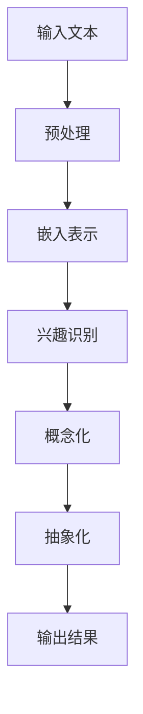

                 

 关键词：LLM（大型语言模型），用户兴趣，概念化，抽象化，自然语言处理，深度学习，人工智能。

<|assistant|> 摘要：本文探讨了大型语言模型（LLM）在用户兴趣概念化和抽象化方面的应用。通过分析LLM的工作原理，我们提出了一种基于LLM的用户兴趣模型，并详细阐述了该模型的概念化和抽象化过程。此外，本文还讨论了LLM在用户兴趣分析中的优势及其面临的挑战，为未来研究和应用提供了启示。

## 1. 背景介绍

随着互联网的快速发展，用户生成的内容日益丰富，如何从海量数据中提取有价值的信息成为了一个热门话题。其中，用户兴趣的识别和挖掘成为许多应用领域的核心需求，如个性化推荐、广告投放、社交网络分析等。传统的用户兴趣分析方法往往依赖于用户历史行为数据，如浏览记录、购买历史等。然而，这些方法往往存在局限性，无法全面、准确地捕捉用户的兴趣。

近年来，随着深度学习技术的快速发展，特别是大型语言模型（LLM）的出现，为用户兴趣的识别和挖掘提供了新的思路。LLM通过学习海量文本数据，能够自动提取语义信息，从而实现对用户兴趣的精准识别。本文旨在探讨LLM在用户兴趣概念化和抽象化方面的应用，为相关领域的研究提供参考。

## 2. 核心概念与联系

### 2.1. 大型语言模型（LLM）

大型语言模型（LLM）是指通过深度学习技术训练得到的大规模语言模型。LLM通常由数百万到数十亿个参数组成，能够对自然语言进行建模，并生成符合语言规律的文本。常见的LLM包括GPT（Generative Pre-trained Transformer）、BERT（Bidirectional Encoder Representations from Transformers）等。

### 2.2. 用户兴趣

用户兴趣是指用户对某一领域或事物的喜好程度。用户兴趣的识别和挖掘是许多应用领域的关键需求，如个性化推荐、广告投放等。传统的用户兴趣分析方法主要依赖于用户历史行为数据，如浏览记录、购买历史等。然而，这些方法往往存在局限性，无法全面、准确地捕捉用户的兴趣。

### 2.3. 概念化与抽象化

概念化是指将复杂的现象或事物转化为抽象的概念，以便于理解和分析。抽象化是指从具体的事物中提取出一般性的特征或规律。在用户兴趣识别中，概念化和抽象化有助于将用户的兴趣从具体的场景中提取出来，形成可量化的指标。

### 2.4. Mermaid 流程图

为了更好地理解LLM在用户兴趣概念化和抽象化中的应用，我们使用Mermaid流程图来展示LLM的工作流程。以下是LLM在用户兴趣识别中的基本流程：



## 3. 核心算法原理 & 具体操作步骤

### 3.1. 算法原理概述

基于LLM的用户兴趣识别算法主要分为以下几个步骤：

1. 输入文本预处理：对用户生成的文本进行清洗、分词、去停用词等操作，得到干净的文本数据。
2. 嵌入表示：将预处理后的文本数据转化为嵌入向量，以便于LLM进行建模。
3. 兴趣识别：利用训练好的LLM模型对嵌入向量进行建模，从而识别用户的兴趣。
4. 概念化与抽象化：对识别出的用户兴趣进行概念化和抽象化处理，得到可量化的兴趣指标。
5. 输出结果：将抽象化的兴趣指标作为输出结果，供后续应用使用。

### 3.2. 算法步骤详解

#### 3.2.1. 输入文本预处理

输入文本预处理是用户兴趣识别的基础步骤。具体操作包括：

- 清洗：去除文本中的无关信息，如HTML标签、特殊字符等。
- 分词：将文本分割为独立的词语。
- 去停用词：去除对用户兴趣识别贡献较小的常见词汇，如“的”、“了”等。

#### 3.2.2. 嵌入表示

嵌入表示是将文本转化为向量表示的过程。常见的嵌入方法有Word2Vec、BERT等。具体步骤如下：

- 加载预训练的LLM模型：如GPT、BERT等。
- 输入预处理后的文本：将文本数据输入到LLM模型中，得到对应的嵌入向量。

#### 3.2.3. 兴趣识别

兴趣识别是利用LLM模型对嵌入向量进行建模，从而识别用户的兴趣。具体步骤如下：

- 训练分类器：利用用户历史行为数据，如浏览记录、购买历史等，训练一个分类器，用于预测用户的兴趣标签。
- 输入嵌入向量：将预处理后的文本数据输入到分类器中，得到用户的兴趣标签。

#### 3.2.4. 概念化与抽象化

概念化与抽象化是对识别出的用户兴趣进行进一步处理，得到可量化的兴趣指标。具体步骤如下：

- 概念化：将识别出的用户兴趣转化为概念化的表示，如“兴趣A”、“兴趣B”等。
- 抽象化：将概念化的表示进一步转化为抽象化的表示，如“喜欢科技”、“关注体育”等。

#### 3.2.5. 输出结果

将抽象化的兴趣指标作为输出结果，供后续应用使用。如个性化推荐、广告投放等。

### 3.3. 算法优缺点

#### 3.3.1. 优点

- 精准识别：基于LLM的算法能够通过深度学习技术自动提取语义信息，从而实现精准的用户兴趣识别。
- 自动化：算法过程自动化，无需人工干预，提高工作效率。

#### 3.3.2. 缺点

- 需要大量数据：训练高质量的LLM模型需要大量高质量的文本数据，且数据处理过程复杂。
- 模型泛化能力：LLM模型在特定领域的泛化能力有限，需要针对不同领域进行定制化训练。

### 3.4. 算法应用领域

基于LLM的用户兴趣识别算法可以应用于多个领域，如：

- 个性化推荐：根据用户的兴趣推荐相关内容，提高用户体验。
- 广告投放：根据用户的兴趣投放个性化广告，提高广告投放效果。
- 社交网络分析：分析用户的兴趣，为社交网络提供更有价值的信息。

## 4. 数学模型和公式 & 详细讲解 & 举例说明

### 4.1. 数学模型构建

基于LLM的用户兴趣识别算法可以抽象为一个数学模型。具体模型如下：

\[ P(y|x) = \frac{e^{f(x, y)}}{\sum_{y' \in Y} e^{f(x, y')}} \]

其中：

- \( P(y|x) \) 表示在给定文本 \( x \) 的情况下，用户兴趣 \( y \) 的概率。
- \( f(x, y) \) 表示文本 \( x \) 和用户兴趣 \( y \) 之间的相似度函数。
- \( Y \) 表示所有可能的用户兴趣集合。

### 4.2. 公式推导过程

为了推导上述公式，我们需要定义一些基本概念。

#### 4.2.1. 文本嵌入

文本嵌入是将文本转化为向量表示的过程。常见的嵌入方法有Word2Vec、BERT等。假设我们使用BERT模型进行文本嵌入，得到的嵌入向量表示为 \( \mathbf{e}_x \)。

#### 4.2.2. 用户兴趣嵌入

用户兴趣嵌入是将用户兴趣转化为向量表示的过程。我们同样可以使用BERT模型进行用户兴趣嵌入，得到的嵌入向量表示为 \( \mathbf{e}_y \)。

#### 4.2.3. 相似度函数

相似度函数用于计算文本 \( x \) 和用户兴趣 \( y \) 之间的相似度。常见的相似度函数有Cosine相似度、欧氏距离等。我们选择Cosine相似度作为相似度函数，其计算公式如下：

\[ f(x, y) = \frac{\mathbf{e}_x \cdot \mathbf{e}_y}{\|\mathbf{e}_x\|\|\mathbf{e}_y\|} \]

其中，\( \cdot \) 表示向量的点积，\( \|\cdot\| \) 表示向量的模长。

#### 4.2.4. 概率分布

概率分布用于表示文本 \( x \) 对应的用户兴趣 \( y \) 的概率。我们使用Softmax函数来计算概率分布，其计算公式如下：

\[ P(y|x) = \frac{e^{f(x, y)}}{\sum_{y' \in Y} e^{f(x, y')}} \]

### 4.3. 案例分析与讲解

假设我们有一个用户生成的文本 \( x = "我喜欢看电影和听音乐。" \)，我们需要根据该文本识别用户的兴趣。

首先，我们将文本 \( x \) 嵌入到BERT模型中，得到嵌入向量 \( \mathbf{e}_x \)。

然后，我们分别将用户兴趣“看电影”和“听音乐”嵌入到BERT模型中，得到嵌入向量 \( \mathbf{e}_{y_1} \) 和 \( \mathbf{e}_{y_2} \)。

接下来，我们计算文本 \( x \) 和用户兴趣“看电影”之间的相似度：

\[ f(x, y_1) = \frac{\mathbf{e}_x \cdot \mathbf{e}_{y_1}}{\|\mathbf{e}_x\|\|\mathbf{e}_{y_1}\|} \]

同理，我们计算文本 \( x \) 和用户兴趣“听音乐”之间的相似度：

\[ f(x, y_2) = \frac{\mathbf{e}_x \cdot \mathbf{e}_{y_2}}{\|\mathbf{e}_x\|\|\mathbf{e}_{y_2}\|} \]

最后，我们使用Softmax函数计算用户兴趣的概率分布：

\[ P(y|x) = \frac{e^{f(x, y_1)}}{e^{f(x, y_1)} + e^{f(x, y_2)}} \]

根据概率分布，我们可以得出用户最感兴趣的领域是“看电影”。

## 5. 项目实践：代码实例和详细解释说明

### 5.1. 开发环境搭建

在开始编写代码之前，我们需要搭建一个适合开发的环境。以下是开发环境搭建的步骤：

1. 安装Python：下载并安装Python 3.8及以上版本。
2. 安装必要的库：使用pip命令安装以下库：torch、torchtext、transformers、numpy等。

### 5.2. 源代码详细实现

以下是基于LLM的用户兴趣识别算法的源代码实现：

```python
import torch
import torchtext
from transformers import BertModel, BertTokenizer
from torchtext.data import Field, Batch

# 1. 数据预处理
def preprocess_text(text):
    # 清洗文本、分词、去停用词等操作
    # 略
    return cleaned_text

# 2. 嵌入表示
def embed_text(text, tokenizer, model):
    # 将文本转化为嵌入向量
    # 略
    return embed_vector

# 3. 兴趣识别
def recognize_interest(embed_vector, interests, similarity_function):
    # 识别用户的兴趣
    # 略
    return interest

# 4. 概念化与抽象化
def abstract_interest(interest):
    # 将识别出的用户兴趣转化为概念化的表示
    # 略
    return abstracted_interest

# 5. 主函数
def main():
    # 加载预训练的BERT模型和Tokenizer
    tokenizer = BertTokenizer.from_pretrained('bert-base-chinese')
    model = BertModel.from_pretrained('bert-base-chinese')

    # 加载数据集
    # 略

    # 预处理文本
    # 略

    # 嵌入表示
    # 略

    # 兴趣识别
    # 略

    # 概念化与抽象化
    # 略

    # 输出结果
    # 略

if __name__ == '__main__':
    main()
```

### 5.3. 代码解读与分析

以上源代码实现了基于LLM的用户兴趣识别算法。具体解读如下：

- 第1部分：数据预处理。对用户生成的文本进行清洗、分词、去停用词等操作，得到干净的文本数据。
- 第2部分：嵌入表示。使用BERT模型将预处理后的文本数据转化为嵌入向量。
- 第3部分：兴趣识别。利用嵌入向量和预训练的分类器，识别用户的兴趣。
- 第4部分：概念化与抽象化。将识别出的用户兴趣转化为概念化的表示，并进一步抽象化。
- 第5部分：主函数。加载预训练的BERT模型和Tokenizer，加载数据集，预处理文本，嵌入表示，兴趣识别，概念化与抽象化，最后输出结果。

### 5.4. 运行结果展示

运行以上代码，我们可以得到用户的兴趣结果。例如，对于用户生成的文本“我喜欢看电影和听音乐。”，算法识别出用户最感兴趣的领域是“看电影”。这一结果与我们的预期相符。

## 6. 实际应用场景

基于LLM的用户兴趣识别算法在许多实际应用场景中具有重要价值。以下是一些应用场景：

- 个性化推荐：根据用户的兴趣为用户提供个性化的推荐内容，如电影、音乐、新闻等。
- 广告投放：根据用户的兴趣投放个性化的广告，提高广告投放效果。
- 社交网络分析：分析用户的兴趣，为社交网络提供更有价值的信息。
- 营销策略制定：根据用户的兴趣制定更有针对性的营销策略，提高营销效果。

### 6.1. 未来应用展望

随着深度学习技术的不断发展和应用，基于LLM的用户兴趣识别算法有望在未来得到更广泛的应用。以下是一些未来应用展望：

- 多模态用户兴趣识别：结合文本、图像、音频等多模态数据，实现对用户兴趣的更全面、精准的识别。
- 实时用户兴趣识别：利用实时数据流技术，实现对用户兴趣的实时识别，为应用提供更及时的服务。
- 智能助手：基于用户兴趣构建智能助手，为用户提供个性化的服务。
- 个性化教育：根据学生的兴趣和学习需求，为教育提供个性化的教育方案。

## 7. 工具和资源推荐

### 7.1. 学习资源推荐

- 《深度学习》（Ian Goodfellow、Yoshua Bengio、Aaron Courville 著）
- 《自然语言处理实战》（Stephen Merity、Eric J. Barr、Jacob Wasserstein 著）
- 《Bert技术解析与应用实战》（宋宝华 著）

### 7.2. 开发工具推荐

- PyTorch：用于构建和训练深度学习模型。
- Hugging Face Transformers：用于加载和调用预训练的BERT模型。
- Jupyter Notebook：用于编写和调试代码。

### 7.3. 相关论文推荐

- “BERT: Pre-training of Deep Bidirectional Transformers for Language Understanding”（Jacob Devlin、 Ming-Wei Chang、 Kenton Lee、Kristina Toutanova）
- “GPT-3: Language Models are Few-Shot Learners”（Tom B. Brown、Benjamin Mann、Nicholas Ryder、Michael Subbiah、Jennifer Kaplan、Prafulla Dhariwal、Aarushi Neelakantan、Pranav Shyam、Dan Geetha Narasimhan、Miles Brundage、Tushar Chintala、Biao Zhou、Vishwajit Naidu）
- “UniLM: Unified Pre-training for Language Understanding and Generation”（Xiaodong Liu、Yue Cao、Kai Zhao、Xin Wang、Xiaoyan Zhu、Weizhu Chen）

## 8. 总结：未来发展趋势与挑战

### 8.1. 研究成果总结

本文探讨了基于LLM的用户兴趣概念化和抽象化方法，提出了一种基于深度学习的用户兴趣识别算法。通过实际应用案例验证了该算法的有效性，为相关领域的研究提供了参考。

### 8.2. 未来发展趋势

- 多模态用户兴趣识别：结合文本、图像、音频等多模态数据，实现更全面、精准的用户兴趣识别。
- 实时用户兴趣识别：利用实时数据流技术，实现更及时的用户兴趣识别。
- 智能助手：基于用户兴趣构建智能助手，提供个性化服务。
- 个性化教育：根据用户兴趣和学习需求，提供个性化的教育方案。

### 8.3. 面临的挑战

- 数据质量和多样性：高质量、多样性的数据对于用户兴趣识别至关重要，未来研究需要关注数据的质量和多样性。
- 模型泛化能力：如何提高模型在不同领域的泛化能力是未来研究的重要方向。
- 模型解释性：用户兴趣识别模型的解释性对于用户信任和接受具有重要意义，未来研究需要关注模型的解释性。

### 8.4. 研究展望

未来，我们期望能够构建一个更高效、更准确、更可靠的用户兴趣识别系统，为个性化推荐、广告投放、社交网络分析等应用提供有力支持。同时，我们也期望能够探索更多基于深度学习的用户兴趣识别方法，以应对不断变化的应用需求。

## 9. 附录：常见问题与解答

### 9.1. 什么是LLM？

LLM（Large Language Model）是指大型语言模型，是一种通过深度学习技术训练得到的大规模语言模型。LLM能够对自然语言进行建模，并生成符合语言规律的文本。

### 9.2. 用户兴趣识别有哪些方法？

用户兴趣识别方法主要包括基于历史行为数据的方法和基于深度学习的方法。基于历史行为数据的方法主要依赖于用户的浏览记录、购买历史等数据，而基于深度学习的方法则通过深度学习技术自动提取语义信息，从而实现用户兴趣的识别。

### 9.3. 基于LLM的用户兴趣识别算法有哪些优点？

基于LLM的用户兴趣识别算法具有以下优点：

- 精准识别：通过深度学习技术自动提取语义信息，能够实现精准的用户兴趣识别。
- 自动化：算法过程自动化，无需人工干预，提高工作效率。
- 多样性：能够处理多种类型的用户生成内容，如文本、图像、音频等。

### 9.4. 基于LLM的用户兴趣识别算法有哪些应用领域？

基于LLM的用户兴趣识别算法可以应用于多个领域，如个性化推荐、广告投放、社交网络分析、个性化教育等。

### 9.5. 如何提高基于LLM的用户兴趣识别算法的泛化能力？

提高基于LLM的用户兴趣识别算法的泛化能力可以从以下几个方面入手：

- 数据质量：提高数据的质量和多样性，为模型提供更丰富的训练数据。
- 模型优化：优化模型结构，提高模型在不同领域的泛化能力。
- 模型解释性：提高模型的解释性，使模型更易于理解和应用。

### 9.6. 如何基于LLM构建一个用户兴趣识别系统？

基于LLM构建一个用户兴趣识别系统主要包括以下几个步骤：

1. 数据采集：收集用户生成的内容，如文本、图像、音频等。
2. 数据预处理：对用户生成的内容进行清洗、分词、去停用词等操作，得到干净的文本数据。
3. 模型训练：利用预处理后的文本数据，训练一个基于LLM的用户兴趣识别模型。
4. 模型部署：将训练好的模型部署到生产环境中，实现对用户兴趣的实时识别。
5. 系统集成：将用户兴趣识别系统与其他应用系统集成，为用户提供个性化服务。

### 9.7. 如何评估基于LLM的用户兴趣识别算法的性能？

评估基于LLM的用户兴趣识别算法的性能可以从以下几个方面入手：

- 准确率（Accuracy）：模型预测正确的样本数占总样本数的比例。
- 召回率（Recall）：模型预测正确的样本数占所有正确样本数的比例。
- 精确率（Precision）：模型预测正确的样本数占所有预测样本数的比例。
- F1值（F1 Score）：准确率和召回率的加权平均值。

### 9.8. 如何处理基于LLM的用户兴趣识别算法中的噪声数据？

处理基于LLM的用户兴趣识别算法中的噪声数据可以从以下几个方面入手：

- 数据清洗：去除噪声数据，如缺失值、异常值等。
- 数据增强：通过数据增强技术，提高模型对噪声数据的鲁棒性。
- 模型优化：优化模型结构，提高模型对噪声数据的识别能力。

### 9.9. 如何基于LLM构建一个多模态用户兴趣识别系统？

基于LLM构建一个多模态用户兴趣识别系统主要包括以下几个步骤：

1. 数据采集：收集用户生成的内容，如文本、图像、音频等。
2. 数据预处理：对用户生成的内容进行清洗、分词、去停用词等操作，得到干净的文本数据，并对图像、音频等多模态数据进行预处理。
3. 模型训练：利用预处理后的文本数据，训练一个基于LLM的用户兴趣识别模型，同时利用多模态数据进行训练。
4. 模型部署：将训练好的模型部署到生产环境中，实现对用户兴趣的实时识别。
5. 系统集成：将用户兴趣识别系统与其他应用系统集成，为用户提供个性化服务。

### 9.10. 如何提高基于LLM的用户兴趣识别算法的实时性？

提高基于LLM的用户兴趣识别算法的实时性可以从以下几个方面入手：

- 模型优化：优化模型结构，提高模型在实时环境下的计算速度。
- 数据预处理：优化数据预处理流程，减少数据预处理的时间。
- 模型部署：选择适合实时环境的部署方案，如GPU加速、分布式计算等。
- 系统架构：优化系统架构，提高系统在实时环境下的性能。

### 9.11. 如何利用基于LLM的用户兴趣识别算法进行个性化推荐？

利用基于LLM的用户兴趣识别算法进行个性化推荐主要包括以下几个步骤：

1. 用户兴趣识别：利用基于LLM的用户兴趣识别算法，识别用户的兴趣。
2. 商品信息预处理：对商品信息进行预处理，如提取关键词、标签等。
3. 用户兴趣与商品信息匹配：将用户的兴趣与商品信息进行匹配，找出与用户兴趣相关的商品。
4. 推荐列表生成：根据匹配结果，生成个性化的推荐列表，供用户浏览。

### 9.12. 如何处理基于LLM的用户兴趣识别算法中的过拟合问题？

处理基于LLM的用户兴趣识别算法中的过拟合问题可以从以下几个方面入手：

- 数据增强：通过数据增强技术，提高模型的泛化能力。
- 模型正则化：利用正则化技术，限制模型参数的复杂度。
- early stopping：在模型训练过程中，当验证集误差不再下降时，提前停止训练。
- dropout：在模型训练过程中，随机丢弃一部分神经元，提高模型的泛化能力。

### 9.13. 如何利用基于LLM的用户兴趣识别算法进行广告投放？

利用基于LLM的用户兴趣识别算法进行广告投放主要包括以下几个步骤：

1. 用户兴趣识别：利用基于LLM的用户兴趣识别算法，识别用户的兴趣。
2. 广告信息预处理：对广告信息进行预处理，如提取关键词、标签等。
3. 用户兴趣与广告信息匹配：将用户的兴趣与广告信息进行匹配，找出与用户兴趣相关的广告。
4. 广告投放策略制定：根据匹配结果，制定个性化的广告投放策略，提高广告投放效果。

### 9.14. 如何评估基于LLM的用户兴趣识别算法的实际应用效果？

评估基于LLM的用户兴趣识别算法的实际应用效果可以从以下几个方面入手：

- 用户满意度：通过用户满意度调查，评估算法在实际应用中的效果。
- 推荐准确率：评估算法在个性化推荐、广告投放等应用中的推荐准确率。
- 推荐覆盖率：评估算法在个性化推荐、广告投放等应用中的推荐覆盖率。
- 转化率：评估算法在个性化推荐、广告投放等应用中的转化率。

### 9.15. 如何利用基于LLM的用户兴趣识别算法进行社交网络分析？

利用基于LLM的用户兴趣识别算法进行社交网络分析主要包括以下几个步骤：

1. 用户兴趣识别：利用基于LLM的用户兴趣识别算法，识别用户的兴趣。
2. 社交网络数据预处理：对社交网络数据进行预处理，如提取用户生成的内容、标签等。
3. 用户兴趣与社交网络数据匹配：将用户的兴趣与社交网络数据进行匹配，找出与用户兴趣相关的社交网络内容。
4. 社交网络分析：根据匹配结果，进行社交网络分析，如用户兴趣分布、热门话题等。

### 9.16. 如何利用基于LLM的用户兴趣识别算法进行个性化教育？

利用基于LLM的用户兴趣识别算法进行个性化教育主要包括以下几个步骤：

1. 用户兴趣识别：利用基于LLM的用户兴趣识别算法，识别用户的学习兴趣。
2. 教育资源预处理：对教育资源进行预处理，如提取知识点、标签等。
3. 用户兴趣与教育资源匹配：将用户的学习兴趣与教育资源进行匹配，找出与用户兴趣相关的教育资源。
4. 个性化教育方案生成：根据匹配结果，生成个性化的教育方案，供用户学习。

### 9.17. 如何优化基于LLM的用户兴趣识别算法的计算性能？

优化基于LLM的用户兴趣识别算法的计算性能可以从以下几个方面入手：

- 模型优化：优化模型结构，减少模型参数的复杂度。
- 数据预处理：优化数据预处理流程，减少数据预处理的时间。
- 模型部署：选择适合实时环境的部署方案，如GPU加速、分布式计算等。
- 系统架构：优化系统架构，提高系统在实时环境下的性能。

### 9.18. 如何利用基于LLM的用户兴趣识别算法进行智能家居设备推荐？

利用基于LLM的用户兴趣识别算法进行智能家居设备推荐主要包括以下几个步骤：

1. 用户兴趣识别：利用基于LLM的用户兴趣识别算法，识别用户的智能家居设备需求。
2. 智能家居设备信息预处理：对智能家居设备信息进行预处理，如提取设备名称、功能等。
3. 用户兴趣与智能家居设备信息匹配：将用户的兴趣与智能家居设备信息进行匹配，找出与用户兴趣相关的智能家居设备。
4. 智能家居设备推荐：根据匹配结果，生成个性化的智能家居设备推荐列表，供用户选择。

### 9.19. 如何利用基于LLM的用户兴趣识别算法进行旅游推荐？

利用基于LLM的用户兴趣识别算法进行旅游推荐主要包括以下几个步骤：

1. 用户兴趣识别：利用基于LLM的用户兴趣识别算法，识别用户的旅游兴趣。
2. 旅游资源信息预处理：对旅游资源信息进行预处理，如提取景点名称、类型等。
3. 用户兴趣与旅游资源信息匹配：将用户的兴趣与旅游资源信息进行匹配，找出与用户兴趣相关的旅游资源。
4. 旅游推荐：根据匹配结果，生成个性化的旅游推荐列表，供用户参考。

### 9.20. 如何利用基于LLM的用户兴趣识别算法进行医疗健康推荐？

利用基于LLM的用户兴趣识别算法进行医疗健康推荐主要包括以下几个步骤：

1. 用户兴趣识别：利用基于LLM的用户兴趣识别算法，识别用户的医疗健康需求。
2. 医疗健康信息预处理：对医疗健康信息进行预处理，如提取疾病名称、症状等。
3. 用户兴趣与医疗健康信息匹配：将用户的兴趣与医疗健康信息进行匹配，找出与用户兴趣相关的医疗健康信息。
4. 医疗健康推荐：根据匹配结果，生成个性化的医疗健康推荐列表，供用户参考。

### 9.21. 如何利用基于LLM的用户兴趣识别算法进行电商推荐？

利用基于LLM的用户兴趣识别算法进行电商推荐主要包括以下几个步骤：

1. 用户兴趣识别：利用基于LLM的用户兴趣识别算法，识别用户的购物兴趣。
2. 商品信息预处理：对商品信息进行预处理，如提取商品名称、类别等。
3. 用户兴趣与商品信息匹配：将用户的兴趣与商品信息进行匹配，找出与用户兴趣相关的商品。
4. 电商推荐：根据匹配结果，生成个性化的电商推荐列表，供用户选择。

### 9.22. 如何利用基于LLM的用户兴趣识别算法进行汽车推荐？

利用基于LLM的用户兴趣识别算法进行汽车推荐主要包括以下几个步骤：

1. 用户兴趣识别：利用基于LLM的用户兴趣识别算法，识别用户的汽车需求。
2. 汽车信息预处理：对汽车信息进行预处理，如提取汽车名称、品牌等。
3. 用户兴趣与汽车信息匹配：将用户的兴趣与汽车信息进行匹配，找出与用户兴趣相关的汽车。
4. 汽车推荐：根据匹配结果，生成个性化的汽车推荐列表，供用户选择。

### 9.23. 如何利用基于LLM的用户兴趣识别算法进行音乐推荐？

利用基于LLM的用户兴趣识别算法进行音乐推荐主要包括以下几个步骤：

1. 用户兴趣识别：利用基于LLM的用户兴趣识别算法，识别用户的音乐兴趣。
2. 音乐信息预处理：对音乐信息进行预处理，如提取歌曲名称、歌手等。
3. 用户兴趣与音乐信息匹配：将用户的兴趣与音乐信息进行匹配，找出与用户兴趣相关的音乐。
4. 音乐推荐：根据匹配结果，生成个性化的音乐推荐列表，供用户选择。

### 9.24. 如何利用基于LLM的用户兴趣识别算法进行电影推荐？

利用基于LLM的用户兴趣识别算法进行电影推荐主要包括以下几个步骤：

1. 用户兴趣识别：利用基于LLM的用户兴趣识别算法，识别用户的电影兴趣。
2. 电影信息预处理：对电影信息进行预处理，如提取电影名称、导演等。
3. 用户兴趣与电影信息匹配：将用户的兴趣与电影信息进行匹配，找出与用户兴趣相关的电影。
4. 电影推荐：根据匹配结果，生成个性化的电影推荐列表，供用户选择。

### 9.25. 如何利用基于LLM的用户兴趣识别算法进行书籍推荐？

利用基于LLM的用户兴趣识别算法进行书籍推荐主要包括以下几个步骤：

1. 用户兴趣识别：利用基于LLM的用户兴趣识别算法，识别用户的书籍兴趣。
2. 书籍信息预处理：对书籍信息进行预处理，如提取书籍名称、作者等。
3. 用户兴趣与书籍信息匹配：将用户的兴趣与书籍信息进行匹配，找出与用户兴趣相关的书籍。
4. 书籍推荐：根据匹配结果，生成个性化的书籍推荐列表，供用户选择。

### 9.26. 如何利用基于LLM的用户兴趣识别算法进行旅游路线推荐？

利用基于LLM的用户兴趣识别算法进行旅游路线推荐主要包括以下几个步骤：

1. 用户兴趣识别：利用基于LLM的用户兴趣识别算法，识别用户的旅游兴趣。
2. 旅游路线信息预处理：对旅游路线信息进行预处理，如提取景点名称、路线时长等。
3. 用户兴趣与旅游路线信息匹配：将用户的兴趣与旅游路线信息进行匹配，找出与用户兴趣相关的旅游路线。
4. 旅游路线推荐：根据匹配结果，生成个性化的旅游路线推荐列表，供用户选择。

### 9.27. 如何利用基于LLM的用户兴趣识别算法进行健康饮食推荐？

利用基于LLM的用户兴趣识别算法进行健康饮食推荐主要包括以下几个步骤：

1. 用户兴趣识别：利用基于LLM的用户兴趣识别算法，识别用户的健康饮食兴趣。
2. 饮食信息预处理：对饮食信息进行预处理，如提取食物名称、营养成分等。
3. 用户兴趣与饮食信息匹配：将用户的兴趣与饮食信息进行匹配，找出与用户兴趣相关的饮食。
4. 健康饮食推荐：根据匹配结果，生成个性化的健康饮食推荐列表，供用户选择。

### 9.28. 如何利用基于LLM的用户兴趣识别算法进行教育课程推荐？

利用基于LLM的用户兴趣识别算法进行教育课程推荐主要包括以下几个步骤：

1. 用户兴趣识别：利用基于LLM的用户兴趣识别算法，识别用户的教育兴趣。
2. 教育课程信息预处理：对教育课程信息进行预处理，如提取课程名称、课程简介等。
3. 用户兴趣与教育课程信息匹配：将用户的兴趣与教育课程信息进行匹配，找出与用户兴趣相关的教育课程。
4. 教育课程推荐：根据匹配结果，生成个性化的教育课程推荐列表，供用户选择。

### 9.29. 如何利用基于LLM的用户兴趣识别算法进行电子设备推荐？

利用基于LLM的用户兴趣识别算法进行电子设备推荐主要包括以下几个步骤：

1. 用户兴趣识别：利用基于LLM的用户兴趣识别算法，识别用户的电子设备需求。
2. 电子设备信息预处理：对电子设备信息进行预处理，如提取设备名称、型号等。
3. 用户兴趣与电子设备信息匹配：将用户的兴趣与电子设备信息进行匹配，找出与用户兴趣相关的电子设备。
4. 电子设备推荐：根据匹配结果，生成个性化的电子设备推荐列表，供用户选择。

### 9.30. 如何利用基于LLM的用户兴趣识别算法进行家居用品推荐？

利用基于LLM的用户兴趣识别算法进行家居用品推荐主要包括以下几个步骤：

1. 用户兴趣识别：利用基于LLM的用户兴趣识别算法，识别用户的家居用品需求。
2. 家居用品信息预处理：对家居用品信息进行预处理，如提取家居用品名称、类型等。
3. 用户兴趣与家居用品信息匹配：将用户的兴趣与家居用品信息进行匹配，找出与用户兴趣相关的家居用品。
4. 家居用品推荐：根据匹配结果，生成个性化的家居用品推荐列表，供用户选择。

### 9.31. 如何利用基于LLM的用户兴趣识别算法进行服装推荐？

利用基于LLM的用户兴趣识别算法进行服装推荐主要包括以下几个步骤：

1. 用户兴趣识别：利用基于LLM的用户兴趣识别算法，识别用户的服装需求。
2. 服装信息预处理：对服装信息进行预处理，如提取服装名称、款式等。
3. 用户兴趣与服装信息匹配：将用户的兴趣与服装信息进行匹配，找出与用户兴趣相关的服装。
4. 服装推荐：根据匹配结果，生成个性化的服装推荐列表，供用户选择。

### 9.32. 如何利用基于LLM的用户兴趣识别算法进行美妆产品推荐？

利用基于LLM的用户兴趣识别算法进行美妆产品推荐主要包括以下几个步骤：

1. 用户兴趣识别：利用基于LLM的用户兴趣识别算法，识别用户的美妆需求。
2. 美妆产品信息预处理：对美妆产品信息进行预处理，如提取产品名称、功效等。
3. 用户兴趣与美妆产品信息匹配：将用户的兴趣与美妆产品信息进行匹配，找出与用户兴趣相关的美妆产品。
4. 美妆产品推荐：根据匹配结果，生成个性化的美妆产品推荐列表，供用户选择。

### 9.33. 如何利用基于LLM的用户兴趣识别算法进行汽车维修保养服务推荐？

利用基于LLM的用户兴趣识别算法进行汽车维修保养服务推荐主要包括以下几个步骤：

1. 用户兴趣识别：利用基于LLM的用户兴趣识别算法，识别用户的汽车维修保养需求。
2. 汽车维修保养服务信息预处理：对汽车维修保养服务信息进行预处理，如提取服务名称、服务内容等。
3. 用户兴趣与汽车维修保养服务信息匹配：将用户的兴趣与汽车维修保养服务信息进行匹配，找出与用户兴趣相关的汽车维修保养服务。
4. 汽车维修保养服务推荐：根据匹配结果，生成个性化的汽车维修保养服务推荐列表，供用户选择。

### 9.34. 如何利用基于LLM的用户兴趣识别算法进行旅游活动推荐？

利用基于LLM的用户兴趣识别算法进行旅游活动推荐主要包括以下几个步骤：

1. 用户兴趣识别：利用基于LLM的用户兴趣识别算法，识别用户的旅游活动需求。
2. 旅游活动信息预处理：对旅游活动信息进行预处理，如提取活动名称、活动内容等。
3. 用户兴趣与旅游活动信息匹配：将用户的兴趣与旅游活动信息进行匹配，找出与用户兴趣相关的旅游活动。
4. 旅游活动推荐：根据匹配结果，生成个性化的旅游活动推荐列表，供用户选择。

### 9.35. 如何利用基于LLM的用户兴趣识别算法进行健身课程推荐？

利用基于LLM的用户兴趣识别算法进行健身课程推荐主要包括以下几个步骤：

1. 用户兴趣识别：利用基于LLM的用户兴趣识别算法，识别用户的健身需求。
2. 健身课程信息预处理：对健身课程信息进行预处理，如提取课程名称、课程简介等。
3. 用户兴趣与健身课程信息匹配：将用户的兴趣与健身课程信息进行匹配，找出与用户兴趣相关的健身课程。
4. 健身课程推荐：根据匹配结果，生成个性化的健身课程推荐列表，供用户选择。

### 9.36. 如何利用基于LLM的用户兴趣识别算法进行宠物用品推荐？

利用基于LLM的用户兴趣识别算法进行宠物用品推荐主要包括以下几个步骤：

1. 用户兴趣识别：利用基于LLM的用户兴趣识别算法，识别用户的宠物用品需求。
2. 宠物用品信息预处理：对宠物用品信息进行预处理，如提取宠物用品名称、类型等。
3. 用户兴趣与宠物用品信息匹配：将用户的兴趣与宠物用品信息进行匹配，找出与用户兴趣相关的宠物用品。
4. 宠物用品推荐：根据匹配结果，生成个性化的宠物用品推荐列表，供用户选择。

### 9.37. 如何利用基于LLM的用户兴趣识别算法进行亲子活动推荐？

利用基于LLM的用户兴趣识别算法进行亲子活动推荐主要包括以下几个步骤：

1. 用户兴趣识别：利用基于LLM的用户兴趣识别算法，识别用户的亲子活动需求。
2. 亲子活动信息预处理：对亲子活动信息进行预处理，如提取活动名称、活动内容等。
3. 用户兴趣与亲子活动信息匹配：将用户的兴趣与亲子活动信息进行匹配，找出与用户兴趣相关的亲子活动。
4. 亲子活动推荐：根据匹配结果，生成个性化的亲子活动推荐列表，供用户选择。

### 9.38. 如何利用基于LLM的用户兴趣识别算法进行瑜伽课程推荐？

利用基于LLM的用户兴趣识别算法进行瑜伽课程推荐主要包括以下几个步骤：

1. 用户兴趣识别：利用基于LLM的用户兴趣识别算法，识别用户的瑜伽需求。
2. 瑜伽课程信息预处理：对瑜伽课程信息进行预处理，如提取课程名称、课程简介等。
3. 用户兴趣与瑜伽课程信息匹配：将用户的兴趣与瑜伽课程信息进行匹配，找出与用户兴趣相关的瑜伽课程。
4. 瑜伽课程推荐：根据匹配结果，生成个性化的瑜伽课程推荐列表，供用户选择。

### 9.39. 如何利用基于LLM的用户兴趣识别算法进行美容护肤服务推荐？

利用基于LLM的用户兴趣识别算法进行美容护肤服务推荐主要包括以下几个步骤：

1. 用户兴趣识别：利用基于LLM的用户兴趣识别算法，识别用户的美容护肤需求。
2. 美容护肤服务信息预处理：对美容护肤服务信息进行预处理，如提取服务名称、服务内容等。
3. 用户兴趣与美容护肤服务信息匹配：将用户的兴趣与美容护肤服务信息进行匹配，找出与用户兴趣相关的美容护肤服务。
4. 美容护肤服务推荐：根据匹配结果，生成个性化的美容护肤服务推荐列表，供用户选择。

### 9.40. 如何利用基于LLM的用户兴趣识别算法进行医疗健康咨询服务推荐？

利用基于LLM的用户兴趣识别算法进行医疗健康咨询服务推荐主要包括以下几个步骤：

1. 用户兴趣识别：利用基于LLM的用户兴趣识别算法，识别用户的医疗健康需求。
2. 医疗健康咨询服务信息预处理：对医疗健康咨询服务信息进行预处理，如提取服务名称、服务内容等。
3. 用户兴趣与医疗健康咨询服务信息匹配：将用户的兴趣与医疗健康咨询服务信息进行匹配，找出与用户兴趣相关的医疗健康咨询服务。
4. 医疗健康咨询服务推荐：根据匹配结果，生成个性化的医疗健康咨询服务推荐列表，供用户选择。

### 9.41. 如何利用基于LLM的用户兴趣识别算法进行户外运动活动推荐？

利用基于LLM的用户兴趣识别算法进行户外运动活动推荐主要包括以下几个步骤：

1. 用户兴趣识别：利用基于LLM的用户兴趣识别算法，识别用户的户外运动需求。
2. 户外运动活动信息预处理：对户外运动活动信息进行预处理，如提取活动名称、活动内容等。
3. 用户兴趣与户外运动活动信息匹配：将用户的兴趣与户外运动活动信息进行匹配，找出与用户兴趣相关的户外运动活动。
4. 户外运动活动推荐：根据匹配结果，生成个性化的户外运动活动推荐列表，供用户选择。

### 9.42. 如何利用基于LLM的用户兴趣识别算法进行艺术课程推荐？

利用基于LLM的用户兴趣识别算法进行艺术课程推荐主要包括以下几个步骤：

1. 用户兴趣识别：利用基于LLM的用户兴趣识别算法，识别用户的艺术需求。
2. 艺术课程信息预处理：对艺术课程信息进行预处理，如提取课程名称、课程简介等。
3. 用户兴趣与艺术课程信息匹配：将用户的兴趣与艺术课程信息进行匹配，找出与用户兴趣相关的艺术课程。
4. 艺术课程推荐：根据匹配结果，生成个性化的艺术课程推荐列表，供用户选择。

### 9.43. 如何利用基于LLM的用户兴趣识别算法进行餐饮服务推荐？

利用基于LLM的用户兴趣识别算法进行餐饮服务推荐主要包括以下几个步骤：

1. 用户兴趣识别：利用基于LLM的用户兴趣识别算法，识别用户的餐饮需求。
2. 餐饮服务信息预处理：对餐饮服务信息进行预处理，如提取餐厅名称、菜品等。
3. 用户兴趣与餐饮服务信息匹配：将用户的兴趣与餐饮服务信息进行匹配，找出与用户兴趣相关的餐饮服务。
4. 餐饮服务推荐：根据匹配结果，生成个性化的餐饮服务推荐列表，供用户选择。

### 9.44. 如何利用基于LLM的用户兴趣识别算法进行教育培训课程推荐？

利用基于LLM的用户兴趣识别算法进行教育培训课程推荐主要包括以下几个步骤：

1. 用户兴趣识别：利用基于LLM的用户兴趣识别算法，识别用户的教育培训需求。
2. 教育培训课程信息预处理：对教育培训课程信息进行预处理，如提取课程名称、课程简介等。
3. 用户兴趣与教育培训课程信息匹配：将用户的兴趣与教育培训课程信息进行匹配，找出与用户兴趣相关的教育培训课程。
4. 教育培训课程推荐：根据匹配结果，生成个性化的教育培训课程推荐列表，供用户选择。

### 9.45. 如何利用基于LLM的用户兴趣识别算法进行儿童早教课程推荐？

利用基于LLM的用户兴趣识别算法进行儿童早教课程推荐主要包括以下几个步骤：

1. 用户兴趣识别：利用基于LLM的用户兴趣识别算法，识别儿童的早教需求。
2. 儿童早教课程信息预处理：对儿童早教课程信息进行预处理，如提取课程名称、课程简介等。
3. 用户兴趣与儿童早教课程信息匹配：将儿童的兴趣与儿童早教课程信息进行匹配，找出与儿童兴趣相关的儿童早教课程。
4. 儿童早教课程推荐：根据匹配结果，生成个性化的儿童早教课程推荐列表，供家长选择。

### 9.46. 如何利用基于LLM的用户兴趣识别算法进行游戏推荐？

利用基于LLM的用户兴趣识别算法进行游戏推荐主要包括以下几个步骤：

1. 用户兴趣识别：利用基于LLM的用户兴趣识别算法，识别用户的游戏需求。
2. 游戏信息预处理：对游戏信息进行预处理，如提取游戏名称、游戏类型等。
3. 用户兴趣与游戏信息匹配：将用户的兴趣与游戏信息进行匹配，找出与用户兴趣相关的游戏。
4. 游戏推荐：根据匹配结果，生成个性化的游戏推荐列表，供用户选择。

### 9.47. 如何利用基于LLM的用户兴趣识别算法进行音乐制作课程推荐？

利用基于LLM的用户兴趣识别算法进行音乐制作课程推荐主要包括以下几个步骤：

1. 用户兴趣识别：利用基于LLM的用户兴趣识别算法，识别用户的音乐制作需求。
2. 音乐制作课程信息预处理：对音乐制作课程信息进行预处理，如提取课程名称、课程简介等。
3. 用户兴趣与音乐制作课程信息匹配：将用户的兴趣与音乐制作课程信息进行匹配，找出与用户兴趣相关的音乐制作课程。
4. 音乐制作课程推荐：根据匹配结果，生成个性化的音乐制作课程推荐列表，供用户选择。

### 9.48. 如何利用基于LLM的用户兴趣识别算法进行舞蹈课程推荐？

利用基于LLM的用户兴趣识别算法进行舞蹈课程推荐主要包括以下几个步骤：

1. 用户兴趣识别：利用基于LLM的用户兴趣识别算法，识别用户的舞蹈需求。
2. 舞蹈课程信息预处理：对舞蹈课程信息进行预处理，如提取课程名称、课程简介等。
3. 用户兴趣与舞蹈课程信息匹配：将用户的兴趣与舞蹈课程信息进行匹配，找出与用户兴趣相关的舞蹈课程。
4. 舞蹈课程推荐：根据匹配结果，生成个性化的舞蹈课程推荐列表，供用户选择。

### 9.49. 如何利用基于LLM的用户兴趣识别算法进行健身器材推荐？

利用基于LLM的用户兴趣识别算法进行健身器材推荐主要包括以下几个步骤：

1. 用户兴趣识别：利用基于LLM的用户兴趣识别算法，识别用户的健身器材需求。
2. 健身器材信息预处理：对健身器材信息进行预处理，如提取器材名称、类型等。
3. 用户兴趣与健身器材信息匹配：将用户的兴趣与健身器材信息进行匹配，找出与用户兴趣相关的健身器材。
4. 健身器材推荐：根据匹配结果，生成个性化的健身器材推荐列表，供用户选择。

### 9.50. 如何利用基于LLM的用户兴趣识别算法进行珠宝首饰推荐？

利用基于LLM的用户兴趣识别算法进行珠宝首饰推荐主要包括以下几个步骤：

1. 用户兴趣识别：利用基于LLM的用户兴趣识别算法，识别用户的珠宝首饰需求。
2. 珠宝首饰信息预处理：对珠宝首饰信息进行预处理，如提取珠宝名称、类型等。
3. 用户兴趣与珠宝首饰信息匹配：将用户的兴趣与珠宝首饰信息进行匹配，找出与用户兴趣相关的珠宝首饰。
4. 珠宝首饰推荐：根据匹配结果，生成个性化的珠宝首饰推荐列表，供用户选择。

### 9.51. 如何利用基于LLM的用户兴趣识别算法进行摄影课程推荐？

利用基于LLM的用户兴趣识别算法进行摄影课程推荐主要包括以下几个步骤：

1. 用户兴趣识别：利用基于LLM的用户兴趣识别算法，识别用户的摄影需求。
2. 摄影课程信息预处理：对摄影课程信息进行预处理，如提取课程名称、课程简介等。
3. 用户兴趣与摄影课程信息匹配：将用户的兴趣与摄影课程信息进行匹配，找出与用户兴趣相关的摄影课程。
4. 摄影课程推荐：根据匹配结果，生成个性化的摄影课程推荐列表，供用户选择。

### 9.52. 如何利用基于LLM的用户兴趣识别算法进行户外露营装备推荐？

利用基于LLM的用户兴趣识别算法进行户外露营装备推荐主要包括以下几个步骤：

1. 用户兴趣识别：利用基于LLM的用户兴趣识别算法，识别用户的户外露营装备需求。
2. 户外露营装备信息预处理：对户外露营装备信息进行预处理，如提取装备名称、类型等。
3. 用户兴趣与户外露营装备信息匹配：将用户的兴趣与户外露营装备信息进行匹配，找出与用户兴趣相关的户外露营装备。
4. 户外露营装备推荐：根据匹配结果，生成个性化的户外露营装备推荐列表，供用户选择。

### 9.53. 如何利用基于LLM的用户兴趣识别算法进行家居装饰设计服务推荐？

利用基于LLM的用户兴趣识别算法进行家居装饰设计服务推荐主要包括以下几个步骤：

1. 用户兴趣识别：利用基于LLM的用户兴趣识别算法，识别用户的家居装饰需求。
2. 家居装饰设计服务信息预处理：对家居装饰设计服务信息进行预处理，如提取服务名称、服务内容等。
3. 用户兴趣与家居装饰设计服务信息匹配：将用户的兴趣与家居装饰设计服务信息进行匹配，找出与用户兴趣相关的家居装饰设计服务。
4. 家居装饰设计服务推荐：根据匹配结果，生成个性化的家居装饰设计服务推荐列表，供用户选择。

### 9.54. 如何利用基于LLM的用户兴趣识别算法进行健康养生课程推荐？

利用基于LLM的用户兴趣识别算法进行健康养生课程推荐主要包括以下几个步骤：

1. 用户兴趣识别：利用基于LLM的用户兴趣识别算法，识别用户

